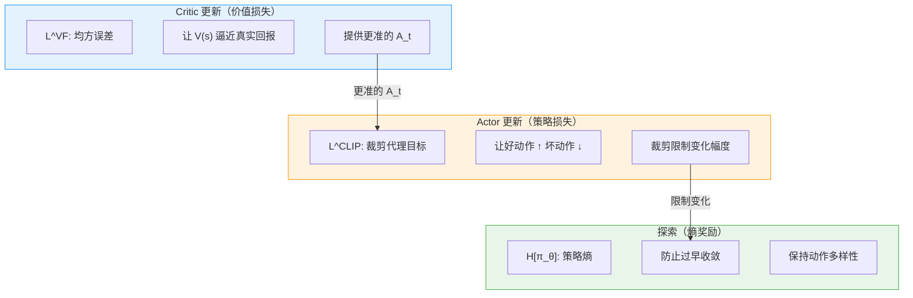
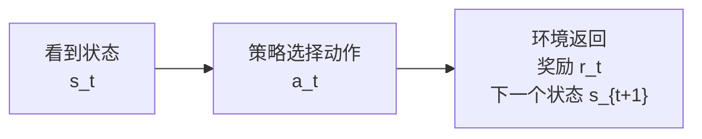
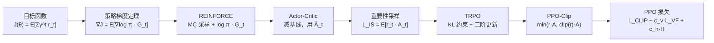

# 8.2 PPO 数学推导

上一节我们用 SB3 的 PPO 训练了月球着陆器，看到了 reward、entropy、clip fraction 这些曲线。接下来要回答一个更基础的问题：**PPO 到底是什么？为什么它最后会写成一个 loss？**

::: tip 本节前置知识
本节会从策略梯度更新一步步推到 PPO-Clip。为了读得更顺，最好已经见过以下概念；如果不熟，可以先读本节末尾的[附录](#附录-从零推导策略梯度与优势函数)，再回到正文：

- **策略梯度定理**：$\nabla_\theta J(\theta) = \mathbb{E}_t[\nabla_\theta \log \pi_\theta(a_t\mid s_t)\hat{A}_t]$
- **优势函数 $A_t$**：衡量动作比平均水平好多少，由 Critic 提供基线
- **Actor-Critic 框架**：Actor 选动作，Critic 估计状态价值
  :::

上一章的 Actor-Critic 框架给出了策略训练的基本分工：Actor 输出动作概率，Critic 估计状态价值，优势函数 $\hat{A}_t$ 判断某个动作比当前状态的平均水平好多少。

如果优势为正，就提高这个动作的概率；如果优势为负，就降低这个动作的概率。这就是策略梯度最核心的直觉。

但这个直觉落到实际训练中，还有两个问题需要解决。

**第一个问题：一批数据能用几轮？** 原始策略梯度要求数据来自当前策略。参数一更新，这批 rollout 就变成了旧策略的数据，再用就会产生偏差。

**第二个问题：策略每次能改多少？** 优势估计来自有限样本，带有噪声。如果某个动作碰巧表现很好，普通策略梯度可能把这个动作的概率调得过高，下一轮采样分布跟着剧烈变化，训练就会震荡。

针对这两个问题，PPO 的做法是：**让同一批经验可以多学几轮，但每一轮都要限制新策略不要离旧策略太远。** 它不改变 Actor-Critic 的基本分工，只是在”怎么更新 Actor”这一步加了一套更稳的规则。

实际使用 PPO 时，流程如下：


PPO 全称 **Proximal Policy Optimization**——Policy 是被训练的策略，Optimization 是优化它的过程，Proximal 表示”近端”：新策略应该靠近旧策略，避免一步跳到很远的位置。

**PPO 是一种训练策略网络的方法**。它最后会写成 loss，是因为 PyTorch 优化器只能根据一个可微的标量目标做反向传播。后面的推导，就是把”复用旧数据”和”限制策略变化”这两个训练要求，翻译成可以 `loss.backward()` 的数学表达式。

## PPO 训练框架

训练一个会做决策的智能体，需要依次回答六个问题。下面的实现结构就是按这个顺序组织的。

**第一，用什么做决策？** 需要一个神经网络——策略网络输出动作概率，价值网络输出当前状态的好坏评分。这是 `[A] forward` 做的事。

**第二，怎么和环境交互？** Actor 看到状态后根据动作概率分布选择一个动作，同时记下选这个动作时的概率（log_prob）。这是 `[B] act / evaluate` 做的事。

**第三，交互时记下什么？** 每一步的状态、动作、奖励都要存，还要把当时的旧策略概率单独存下来——因为后面更新参数后策略就变了，需要旧概率来做对比。这是 `[C] collect_rollout` 做的事。

**第四，怎么评价每个动作的好坏？** 不能只看奖励高不高，要看这个动作比当前策略的"正常水平"好多少。这个相对评价就是优势（advantage）。这是 `[D] compute_gae` 做的事。

**第五，知道好坏之后怎么安全地改？** 加强好动作、削弱坏动作，但更新幅度不能过大——否则策略跑偏，旧数据就不准了。`actor_loss_fn` 用 ratio 和 clip 控制策略更新的幅度，`critic_loss_fn` 同时训练价值网络。这是 `[E]` 做的事。

**第六，怎么反复这个过程？** 同一批经验多学几轮（靠 clip 保证不学歪），然后重新收集新经验，不断循环。这是 `[F]` 做的事。

<PpoCodeFocus focus="overview" />

### 实现结构总览

训练一个会做决策的智能体，需要依次回答六个问题。下面的实现结构就是按这个顺序组织的。

**第一，用什么做决策？** 需要一个神经网络——策略网络输出动作概率，价值网络输出当前状态的好坏评分。这是 `[A] forward` 做的事。

**第二，怎么和环境交互？** 根据动作概率分布选择一个动作，同时记下选这个动作时的概率（log_prob）。这是 `[B] act / evaluate` 做的事。

**第三，交互时记下什么？** 每一步的状态、动作、奖励都要存，还要把当时的旧策略概率单独存下来——因为后面更新参数后策略就变了，需要旧概率来做对比。这是 `[C] collect_rollout` 做的事。

**第四，怎么评价每个动作的好坏？** 不能只看奖励高不高，要看这个动作比当前策略的"正常水平"好多少。这个相对评价就是优势（advantage）。这是 `[D] compute_gae` 做的事。

**第五，知道好坏之后怎么安全地改？** 加强好动作、削弱坏动作，但更新幅度不能过大——否则策略跑偏，旧数据就不准了。`actor_loss_fn` 用 ratio 和 clip 控制策略更新的幅度，`critic_loss_fn` 同时训练价值网络。这是 `[E]` 做的事。

**第六，怎么反复这个过程？** 同一批经验多学几轮（靠 clip 保证不学歪），然后重新收集新经验，不断循环。这是 `[F]` 做的事。

<PpoCodeFocus focus="overview" />

上述六个问题构成 PPO 的完整实现逻辑，后文在数学推导中会逐段对应到具体代码。

## 原始策略梯度的局限性

实现结构的第六步指出：**同一批经验可以多学几轮**。但原始策略梯度无法做到这一点，限制来自它的更新公式。

策略梯度的目标是在当前策略 $\pi_\theta$ 下最大化期望回报，更新方向由优势函数 $\hat{A}_t$ 引导：

$$
\nabla_\theta J(\theta)
= \mathbb{E}_t\left[
\nabla_\theta \log \pi_\theta(a_t\mid s_t)\hat{A}_t
\right].
$$

这个公式有一个隐含要求：**用来计算梯度的样本，必须来自当前策略 $\pi_\theta$**。

原因就在 $\mathbb{E}_t[\cdot]$ 这个平均符号上。它的意思是：**把智能体实际采到的所有动作按经验频次加权平均**——当前策略经常选的动作，在平均里占的权重就高；很少选的动作，权重就低。

举个例子。假设当前策略在某个状态下：

- 有 80% 的概率选"向左"
- 有 20% 的概率选"向右"

智能体跑了 100 步，大约 80 次选了"向左"，20 次选了"向右"。公式按这个 80/20 的频次来加权平均梯度，这就是 $\mathbb{E}_t[\cdot]$ 做的事。

但如果这 100 步数据来自旧策略——旧策略在这个状态下有 60% 概率选"向左"，40% 选"向右"——数据里实际会有 60 次"向左"、40 次"向右"。

**实际频次（60/40）和公式期望（80/20）已经不一致**，用这种数据算出来的梯度就是错的——"向左"的贡献被低估，"向右"的贡献被高估。

更新一轮后，参数变成 $\theta$，策略变成 $\pi_\theta$。同一批 rollout 的来源仍然是 $\pi_{\text{old}}$，但公式期望已经指向 $\pi_\theta$——**数据频率属于旧策略，公式期望属于新策略，两者已经不对齐**。旧策略常选的动作在数据里频率高，新策略可能不再偏好它们；旧策略很少选的动作样本稀少，新策略却可能开始更想选择它们。梯度估计里混入的偏差随着更新轮次累积，这就是 on-policy 方法一批 rollout 只用一次的原因。

但为什么要打破这个限制？采样很贵。机器人控制、游戏模拟、LLM 生成回答中，一批 rollout 的成本往往高于多次反向传播。

PPO 希望同一批数据更新多轮，但这里有个实际问题：**旧策略采的数据，怎么才能给新策略用？**

重要性采样是下一节的答案。

## 重要性采样

重要性采样（Importance Sampling）解决的是一个朴素问题：**样本来自一个分布，但我们想估计另一个分布下的平均值。**

先看普通采样平均。回到策略梯度公式：

$$
\nabla_\theta J(\theta)
= \mathbb{E}_t\left[
\nabla_\theta \log \pi_\theta(a_t\mid s_t)\hat{A}_t
\right].
$$

公式里的被积函数是 $\nabla_\theta \log \pi_\theta(a_t\mid s_t)\hat{A}_t$。把它简记为 $f(a_t)$，问题变成：要估计新策略 $\pi_\theta$ 下这个量的期望，理想写法是：

$$
\mathbb{E}_{a\sim\pi_\theta}[f(a_t)].
$$

如果手里有新策略采出来的动作，直接对这些 $f(a_t)$ 求平均即可。但现在没有新策略样本，只有旧策略 $\pi_{\text{old}}$ 采出来的动作。直接平均会有偏差，因为旧策略和新策略对同一个动作的偏好不同。

重要性采样的做法是：旧样本不是垃圾——它们毕竟是真实交互得到的，只是被旧策略”采偏”了。每个样本要乘一个修正权重，把旧策略的分布”翻译”成新策略的分布。这个权重就是新策略选择该动作的概率与旧策略选择该动作的概率之比：

$$
\frac{\pi_\theta(a\mid s)}{\pi_{\text{old}}(a\mid s)}
$$

这样，新策略下的期望可以改写成：

$$
\mathbb{E}_{a \sim \pi_\theta} [f(a_t)]
=
\mathbb{E}_{a \sim \pi_{\text{old}}}
\left[
\frac{\pi_\theta(a\mid s)}{\pi_{\text{old}}(a\mid s)}
f(a_t)
\right].
$$

如果新策略比旧策略更喜欢这个动作，权重大于 1，这个样本对新策略的贡献应该被放大；如果新策略不太会选这个动作，权重小于 1，这个样本的贡献应该被缩小。这一步来自期望变换：把新策略下的期望，改写成旧策略分布下的加权平均。

在 PPO 代码里，[C] `collect_rollout` 在采样时存下了 `old_logprobs`：

<PpoCodeFocus focus="oldLogprobs" />

这个 `old_logprobs` 就是 $\log \pi_{\text{old}}(a_t\mid s_t)$。后面更新时，模型重新计算同一批数据在新策略下的 `new_logprobs`，新旧一比就知道策略偏离了多少。

### 策略比率

重要性采样的修正权重 $\pi_\theta/\pi_{\text{old}}$ 需要同时知道新旧策略的概率，计算上并不直观。PPO 先把这个比率拆成两个部分来理解：**同一个动作，新策略给它多大概率，旧策略给它多大概率。**

假设在某个状态 $s_t$，旧策略和新策略对三个动作的概率如下：

| 动作 | 旧策略概率 $\pi_{\text{old}}(a\mid s_t)$ | 新策略概率 $\pi_\theta(a\mid s_t)$ | 比率 $r=\pi_\theta/\pi_{\text{old}}$ |
| ---- | ---------------------------------------- | ---------------------------------- | ------------------------------------ |
| 左   | 0.50                                     | 0.25                               | 0.5                                  |
| 右   | 0.25                                     | 0.50                               | 2.0                                  |
| 停   | 0.25                                     | 0.25                               | 1.0                                  |

旧策略采样到”右”，新策略比旧策略更喜欢这个动作（比率 2.0），这个样本对新策略的贡献应该被放大。旧策略采样到”左”，新策略已经不太想选它了（比率 0.5），这个样本的权重应该降低。

写成公式，这个权重就是**策略比率**（Policy Ratio）：

$$r_t(\theta) = \frac{\pi_\theta(a_t \mid s_t)}{\pi_{\text{old}}(a_t \mid s_t)}$$

这里的 $a_t$ 指旧策略当时真实采到的动作。$r_t=1$ 表示新旧策略对它的概率相同；$r_t>1$ 表示新策略更倾向选它；$r_t<1$ 表示新策略在回避它。

代码中通过 log 概率之差的指数计算，避免直接除两个很小的概率：

<PpoCodeFocus focus="ratio" />

乘上这个比率后，旧数据上的期望就可以写成：

$$
\mathbb{E}_{a \sim \pi_\theta} [f(a_t)]
=
\mathbb{E}_{a \sim \pi_{\text{old}}}
\left[
r_t(\theta) \cdot f(a_t)
\right].
$$

这就是旧数据能给新策略当训练样本的数学依据——每个样本乘上策略比率，旧分布就"翻译"成了新分布。

### 代理目标

策略更新时，$f(a_t)$ 对应这个动作的优势 $A_t$。优势告诉我们：这个动作相对于当前状态的平均水平，是更好还是更差。

把重要性采样权重和优势放在一起，旧数据上的训练信号就变成：

$$L^{\text{IS}}(\theta) = \mathbb{E}_t \left[ r_t(\theta) \cdot A_t \right]$$

代码中对应 `actor_loss_fn` 里的 `surr1 = ratio * advantages`：

<PpoCodeFocus focus="surr1" />

这就是**代理目标**（Surrogate Objective）。它用旧数据计算，方向上推动新策略改进；环境里的真实总回报仍然只能通过采样观察。

读这个乘积时要同时看两件事：

- $A_t$ 决定方向：好动作增强，坏动作削弱。
- $r_t$ 决定这条旧样本在新策略下的权重：新策略越认同这个动作，权重越大；越不认同，权重越小。

这个目标在 $r_t$ 接近 1 时是可信的。但 $r_t$ 可以无限增长——如果某个好动作（$A_t > 0$）的比率被推到 5、10、100，目标值也跟着涨，优化器会继续推，旧数据的可信度却在下降。

## PPO-Clip

**重要性采样解决了一个问题，但引入了另一个。**

重要性采样让旧数据可以用于新策略，但它本身有一个根本弱点：**重要性权重 $r_t$ 没有上界**。如果某个好动作碰巧在旧数据里多次出现，新策略可能会把它推得过高——$r_t=5$ 意味着新策略选这个动作的概率已经是旧策略的 5 倍，但旧数据里这个动作的频率还是按旧策略的分布采的。

这会导致两个问题：

1. **更新步长失控**：$r_t$ 持续增长，优化器不断放大这个动作的概率，策略在一步之内可能发生剧烈变化。
2. **数据可信度下降**：$r_t$ 越大，说明新旧策略的分布差异越大，旧数据的偏差就越严重。

**PPO-Clip 要解决的就是：如何在不损失重要性采样好处的前提下，限制策略更新的步长。**

做法是把策略比率限制在一个小区间里：

$$
\overline{r}_t(\theta)
= \text{clip}(r_t(\theta), 1-\varepsilon, 1+\varepsilon)
$$

$\varepsilon=0.2$ 时，区间是 $[0.8, 1.2]$。用裁剪后的比率构造第二个目标，取两个目标中较保守的一个：

$$
J^{\text{CLIP}}(\theta)
= \mathbb{E}_t
\left[
\min \left(
r_t(\theta)A_t,\;
\overline{r}_t(\theta)A_t
\right)
\right]
$$

代码中 `surr1` 是未裁剪目标，`surr2` 是裁剪后的目标，`policy_loss = -torch.min(surr1, surr2).mean()`：

<PpoCodeFocus focus="clip" title="PPO-Clip 更新核心" />

这段代码完整实现了 PPO-Clip 的四步逻辑：

**第一步：计算策略比率**。用 `torch.exp(new_logprobs - old_logprobs)` 而不是直接相除，是因为概率值通常很小（比如 0.01），直接除容易产生数值下溢；用 log 相减再 exp，在数值上更稳定。这里的 `ratio` 就是 $r_t(\theta)$，表示**新策略相对于旧策略的概率变化**。

**第二步：计算两个目标**。`advantages` 是优势函数 $\hat{A}_t$，由 Critic 提供——它告诉 Actor 每个动作比当前状态的平均水平好多少，是**更新方向的标签**。`surr1 = ratio * advantages` 是不加限制的原始目标；`surr2 = torch.clamp(ratio, ...) * advantages` 是裁剪后的目标——把 ratio 限制在 $[1-\varepsilon, 1+\varepsilon]$ 区间内，超出部分不再增长。

**第三步：取较保守者**。`torch.min(surr1, surr2)` 是裁剪机制的实现，但不是裁剪的全部。

PPO-Clip 实际上做了两件事：

**第一件事：用重要性采样让旧数据能用。** 策略比率 $r_t = \pi_\theta/\pi_{\text{old}}$ 是重要性采样的核心——它把旧策略的分布"翻译"成新策略的分布，让旧数据可以用于新策略的训练。这是 PPO-Clip 的基础，没有它，PPO 只能像原始策略梯度那样一轮更新后重新采样。

**第二件事：裁剪限制更新步长。** $\text{clip}(r_t, 1-\varepsilon, 1+\varepsilon)$ 是 PPO 的核心创新——它限制了策略比率的变化范围，防止新策略离旧策略太远。

`torch.min(surr1, surr2)` 是第二件事的具体实现方式，它完成了两个任务：

- **梯度控制**：当 ratio 超出裁剪区间后，裁剪项变成常数，$\min$ 取裁剪项，梯度自动归零
- **距离惩罚**：ratio 越接近裁剪边界，surr1 和 surr2 越接近，没有惩罚；ratio 越远离裁剪边界，差距越大，loss 的惩罚也越大

用一个具体例子看 `torch.min` 如何工作。假设某个样本的优势 $A_t = 2$（好动作），$\varepsilon = 0.2$，裁剪区间是 $[0.8, 1.2]$：

| ratio   | surr1 = ratio × 2 | surr2 = clipped × 2 | torch.min 取哪个 | 结果含义                |
| ------- | ----------------- | ------------------- | ---------------- | ----------------------- |
| 0.7     | 1.4               | 1.6                 | surr1            | 低于下界，正常优化      |
| 1.0     | 2.0               | 2.0                 | 相等             | ratio = 1，新旧策略相同 |
| 1.1     | 2.2               | 2.2                 | 相等             | 在裁剪边界内，正常优化  |
| **1.3** | **2.6**           | **2.4**             | **surr2**        | **超出上界，取裁剪项**  |
| 2.0     | 4.0               | 2.4                 | surr2            | 大幅超出，裁剪项封顶    |

如果换成坏动作 $A_t = -2$：

| ratio   | surr1 = ratio × (-2) | surr2 = clipped × (-2) | torch.min 取哪个 | 结果含义                |
| ------- | -------------------- | ---------------------- | ---------------- | ----------------------- |
| 0.7     | -1.4                 | -1.6                   | surr2            | 低于下界，取裁剪项      |
| 1.0     | -2.0                 | -2.0                   | 相等             | ratio = 1，新旧策略相同 |
| 1.1     | -2.2                 | -2.2                   | 相等             | 在裁剪边界内，正常优化  |
| **1.3** | **-2.6**             | **-2.4**               | **surr2**        | **超出上界，取裁剪项**  |
| 2.0     | -4.0                 | -2.4                   | surr2            | 大幅超出，裁剪项封顶    |

两种情况下，`torch.min` 都是**在安全区间内让 surr1 主导，超出区间后让裁剪项主导**。

到此为止，第三步 `torch.min(surr1, surr2)` 算出了**PPO-Clip 代理目标**的数值——在安全区间内等于 surr1（原始目标），超出区间后等于 surr2（裁剪后的常数）。

但这个值本身还不能直接用于优化——它是一个"要最大化的目标"，而 PyTorch 优化器的工作方式是"最小化 loss"。因此需要第四步：把最大化目标转换成最小化 loss。

**第四步：取负并平均**

**从最大化期望回报到代理目标**

PPO 的最终目标是**最大化期望回报** $J(\theta)$——让策略在环境中获得尽可能高的总奖励。策略梯度的更新方向 $\nabla_\theta J(\theta)$ 也是朝着这个目标。

但直接优化 $J(\theta)$ 有两个问题：

1. **数据不匹配**：$J(\theta)$ 的梯度估计需要当前策略 $\pi_\theta$ 的样本，但当前这批数据来自旧策略 $\pi_{\text{old}}$
2. **更新步长失控**：即使解决了数据匹配问题，原始策略梯度也没有限制更新幅度的机制

重要性采样解决了第一个问题——用策略比率 $r_t$ 把旧数据的分布"翻译"成新策略的分布，让 $J(\theta)$ 的梯度可以用旧数据来估计。

但重要性采样引入了第二个问题——$r_t$ 没有上界，ratio 越大，重要性权重越离谱，旧数据的偏差越严重。

**裁剪机制解决了第二个问题**——$\text{clip}(r_t, 1-\varepsilon, 1+\varepsilon)$ 限制了 ratio 的变化范围，让重要性权重的偏差控制在可接受的程度。

**`torch.min(surr1, surr2)` 是把两个解决方案合并在一起的实现**：surr1 是不加限制的重要性采样目标，surr2 是裁剪后的目标，两者取最小值保证结果永远不会超出裁剪区间。

最终，**PPO-Clip 代理目标 $J^{\text{CLIP}}(\theta)$ 是对 $J(\theta)$ 的近似**——它既解决了数据不匹配的问题，又解决了更新步长失控的问题，所以优化方向同样是**最大化**这个目标。

**第三步和第四步的联系**：第三步用 `torch.min(surr1, surr2)` 算出了**PPO-Clip 代理目标**的数值，第四步通过 `-torch.min(surr1, surr2).mean()` 把它转换成 PyTorch 可以优化的 loss。两者合起来就是完整的策略损失：**在裁剪限制的范围内，引导策略向更高目标值的方向前进。**

**为什么要 `.mean()`？**

`surr1` 和 `surr2` 都是向量——batch 内每个样本都有一个值。`.mean()` 把它们平均成一个标量，这样 `loss.backward()` 才能计算出针对整个 batch 的平均梯度。如果用 sum 代替 mean，梯度大小会随 batch size 变化，学习率需要额外调整。

### 裁剪机制

**$A_t > 0$（好动作）**：希望 $r_t$ 变大。$r_t \leq 1+\varepsilon$ 时，裁剪项和未裁剪项相等，正常优化。$r_t > 1+\varepsilon$ 后，裁剪项封顶为常数，$\min$ 取裁剪项，梯度归零——好动作最多增到旧策略的 $1+\varepsilon$ 倍。

**$A_t < 0$（坏动作）**：希望 $r_t$ 变小。$r_t < 1-\varepsilon$ 后，裁剪项封底，$\min$ 取裁剪项，梯度归零——坏动作最多降到旧策略的 $1-\varepsilon$ 倍。

**$A_t = 0$**：$r_t \cdot A_t = 0$，PPO 不做任何调整。

三种情况合起来：**PPO 允许策略在安全区间内学习；一旦变化走得太远，目标函数不再奖励那部分变化。**


<details>
<summary>裁剪目标的数值分析（附可视化代码）</summary>

当 $A_t > 0$ 时，$r_t \leq 1+\varepsilon$ 的区间内未裁剪项和裁剪项相等，$\min$ 取谁都不影响。$r_t$ 突破 $1+\varepsilon$ 后，裁剪项停在 $(1+\varepsilon) \cdot A_t$，而未裁剪项继续线性增长，$\min$ 自动选择裁剪项，梯度归零。

| $r_t$ 的范围               | 未裁剪项 $r_t \cdot A_t$ | 裁剪项 $\overline{r}_t \cdot A_t$   | $\min$ 取哪个    |
| -------------------------- | ------------------------ | ----------------------------------- | ---------------- |
| $r_t \leq 1 + \varepsilon$ | $r_t \cdot A_t$          | $r_t \cdot A_t$                     | 相等，正常优化   |
| $r_t > 1 + \varepsilon$    | $r_t \cdot A_t$（更大）  | $(1+\varepsilon) \cdot A_t$（常数） | 裁剪项，梯度为零 |

当 $A_t < 0$ 时要注意符号。令 $A_t=-2$，$\varepsilon=0.2$。$r_t=0.7$ 时未裁剪项 $= -1.4$，裁剪项 $= -1.6$，$\min$ 取更小的 $-1.6$（裁剪项），梯度为零。

| $r_t$ 的范围               | 未裁剪项 $r_t \cdot A_t$  | 裁剪项 $\overline{r}_t \cdot A_t$   | $\min$ 取哪个          |
| -------------------------- | ------------------------- | ----------------------------------- | ---------------------- |
| $r_t < 1 - \varepsilon$    | 比裁剪项更大，例如 $-1.4$ | $(1-\varepsilon) \cdot A_t$（常数） | 裁剪项，梯度为零       |
| $r_t \geq 1 - \varepsilon$ | 未裁剪项                  | 区间内相等                          | 未裁剪项，继续正常优化 |

```python
import numpy as np
import matplotlib.pyplot as plt

epsilon = 0.2
r = np.linspace(0.0, 2.0, 500)

def clip_objective(r, A, eps=0.2):
    r_clipped = np.clip(r, 1 - eps, 1 + eps)
    return np.minimum(r * A, r_clipped * A)

fig, axes = plt.subplots(1, 3, figsize=(15, 4))

for ax, (A_val, title) in zip(axes, [
    (1.0, "A > 0 (好动作)"),
    (-1.0, "A < 0 (坏动作)"),
    (0.0, "A = 0 (中性动作)")
]):
    obj = clip_objective(r, A_val)
    ax.plot(r, r * A_val, 'b--', alpha=0.4, label='未裁剪 r·A')
    ax.plot(r, obj, 'r-', linewidth=2, label='PPO-Clip min(...)')
    ax.axvspan(1 - epsilon, 1 + epsilon, alpha=0.1, color='green', label='安全区间')
    ax.set_title(title)
    ax.set_xlabel('策略比率 r_t(θ)')
    ax.set_ylabel('目标值')
    ax.legend(fontsize=8)

plt.suptitle('PPO-Clip 目标函数的三种情况 (ε=0.2)', fontsize=13)
plt.tight_layout()
plt.savefig("ppo_clip_three_cases.png", dpi=150)
```

</details>

## PPO 损失函数

PPO-Clip 给出了策略更新的规则。神经网络训练需要一个标量 loss，优化器才能通过 `loss.backward()` 更新参数。

PPO 的总 loss 由三项组成，分别对应三个目标：**策略损失** $L^{\text{CLIP}}$ 控制 Actor 的更新方向；**价值损失** $L^{\text{VF}}$ 让 Critic 更准确地估计状态价值；**熵奖励** $c_2 H[\pi_\theta]$ 保持策略的探索动力。三项加权合并后，一次反向传播就能同时更新 Actor 和 Critic。

$$
L^{\text{PPO}}(\theta)
= L^{\text{CLIP}}(\theta)
+ c_1 L^{\text{VF}}(\theta)
- c_2 H[\pi_\theta]
$$

### 策略损失

PPO-Clip 代理目标本身就是一个**策略损失**（Policy Loss）——它衡量了当前策略与目标策略之间的差距，用于指导 Actor 的参数更新。

最大化 PPO-Clip 代理目标，就是在引导 Actor 找到更好的策略。具体来说：

- 当优势 $A_t > 0$（好动作）时，希望策略比率 $r_t$ 变大——即新策略更倾向于选择这个动作
- 当优势 $A_t < 0$（坏动作）时，希望策略比率 $r_t$ 变小——即新策略降低这个动作的概率

裁剪机制限制了 $r_t$ 的变化范围在 $[1-\varepsilon, 1+\varepsilon]$ 内，保证策略不会因为单次更新就发生剧烈变化。但 PyTorch 优化器只能最小化 loss，因此取相反数：

$$
L^{\text{CLIP}}(\theta)
= -\mathbb{E}_t
\left[
\min \left(
r_t(\theta) \cdot A_t,\;
\overline{r}_t(\theta) \cdot A_t
\right)
\right]
$$

代码对应 `actor_loss_fn` 中的 `policy_loss = -torch.min(surr1, surr2).mean()`。这一项调整 Actor 参数——**让好动作概率上升、坏动作概率下降**，变化幅度被裁剪限制在安全范围内。

### 价值函数损失

Critic 的预测值 $V_\theta(s_t)$ 需要逼近目标回报 $V_t^{\text{targ}}$（由 GAE 计算，下一节详细推导）。价值损失是两者之间的均方误差：

$$L^{\text{VF}}(\theta) = \mathbb{E}_t \left[ \left( V_\theta(s_t) - V_t^{\text{targ}} \right)^2 \right]$$

**Critic 的准确性直接影响优势估计 $A_t$ 的质量。** Critic 预测不准，$A_t$ 就带偏差，会误导 Actor 的更新方向。代码中 `critic_loss_fn` 在 MSE 基础上加了值裁剪（value clipping），防止 Critic 在单次更新中变化过大：

<PpoCodeFocus focus="loss" title="PPO 总损失与反向传播" />

### 熵奖励

策略熵衡量动作分布的随机程度：

$$H[\pi_\theta] = -\mathbb{E}_t \left[ \sum_a \pi_\theta(a|s_t) \log \pi_\theta(a|s_t) \right]$$

熵越高，探索越充分；熵越低，策略越容易锁定在次优动作上。PPO 的裁剪机制在稳定训练的同时，也会让策略倾向于收敛——熵奖励通过在 loss 中减去 $c_2 H[\pi_\theta]$ 来保持探索动力。代码中是 `entropy_bonus = entropy.mean()`，总 loss 里取减号。

### 总损失

三项合并，代码中就是 `ppo_update` 里的：

```python
loss = pg_loss + vf_coef * vf_loss - ent_coef * entropy_bonus
```

工业框架（DeepSpeed-Chat、VeRL、OpenRLHF）的实现结构与上面的代码骨架一致：`actor_loss_fn` 负责裁剪策略损失，`critic_loss_fn` 负责带裁剪的价值损失，`ppo_update` 负责合成并反向传播。



### 超参数

| 符号          | 名称         | 典型值  | 作用                       | 代码参数   |
| ------------- | ------------ | ------- | -------------------------- | ---------- |
| $\varepsilon$ | 裁剪范围     | 0.1–0.2 | 限制策略比率的变化范围     | `clip_eps` |
| $c_1$         | 价值损失系数 | 0.5     | 平衡策略更新和价值函数拟合 | `vf_coef`  |
| $c_2$         | 熵奖励系数   | 0.01    | 鼓励探索                   | `ent_coef` |
| $\gamma$      | 折扣因子     | 0.99    | 未来奖励的衰减速度         | `gamma`    |
| $\lambda$     | GAE 参数     | 0.95    | 优势估计中偏差-方差的权衡  | `lam`      |
| $T$           | rollout 长度 | 2048    | 每次收集多少步数据         | `steps`    |
| $K$           | epoch 数     | 10      | 同一批数据更新几轮         | `epochs`   |

## 完整算法

把所有组件组装起来，PPO 的训练循环如下：

```mermaid
flowchart TD
    A[循环开始<br/>当前策略 pi_theta] --> B[1. 收集 T 步数据]
    B --> C[2. 用 GAE 计算<br/>优势估计 A_hat_t<br/>目标回报 V_t^targ]
    C --> D[3. 重复 K 轮<br/>按 mini-batch 更新]
    D --> E[计算策略比率<br/>r_t = pi_theta / pi_old]
    E --> F[计算裁剪策略损失<br/>L^CLIP]
    F --> G[计算价值损失<br/>L^VF]
    G --> H[计算策略熵<br/>H[pi_theta]]
    H --> I[合成总损失<br/>L = L^CLIP + c1 L^VF - c2 H]
    I --> J[梯度下降更新参数<br/>theta]
    J --> K{K 轮完成?}
    K -- 否 --> D
    K -- 是 --> L[进入下一批数据<br/>旧策略记录更新为当前策略]
    L -. 继续训练 .-> A
```

对照代码中的实现，每一步都可以找到对应的代码行：

<PpoCodeFocus focus="overview" title="完整 PPO 训练程序回看" />

几个关键设计决策：

- **重复利用数据 K 轮**：收集一次数据很贵（需要跑环境），所以用同一批数据更新多次。裁剪机制保证多轮更新不会让策略跑偏。
- **Mini-batch 更新**：把 $T$ 步数据分成若干 mini-batch，每个 mini-batch 独立计算梯度，提高训练效率。
- **每轮重新计算 r_t**：虽然用的是同一批数据，但每轮更新后 $\theta$ 变了，$r_t$ 也变了，裁剪会动态生效。

<details>
<summary>推导补充：TRPO 与 PPO-Penalty</summary>

TRPO（Trust Region Policy Optimization）和 PPO 解决同一个问题：策略更新不能太大。TRPO 的写法是：

$$
\max_\theta L^{\text{IS}}(\theta)
\quad \text{s.t.} \quad
\bar{D}_{\text{KL}}(\theta_{\text{old}}, \theta) \leq \delta
$$

可以优化代理目标，但新旧策略之间的平均 KL 散度不能超过阈值 $\delta$。理论上漂亮，但实现需要约束优化、共轭梯度等复杂步骤。

PPO 用裁剪策略比率近似达到类似效果，实现简单得多。PPO 论文中还提出了 **PPO-Penalty** 变体，把 KL 约束直接加入目标函数作为惩罚项：

$$L^{\text{KL}}(\theta) = \mathbb{E}_t \left[ r_t(\theta) \cdot A_t - \beta \cdot D_{\text{KL}}(\pi_{\text{old}}, \pi_\theta) \right]$$

$\beta$ 是自适应系数。PPO-Penalty 在某些场景下效果更好，但实现比 PPO-Clip 复杂，实践中 PPO-Clip 更常用。

PPO 的 "Proximal" 来自信任域思想，但写代码时真正需要落地的是 **`ratio`、`clamp`、`min` 和总损失**。

</details>

<details>
<summary><strong>思考题一：如果将 ε 设为 0，PPO-Clip 会退化成什么？</strong></summary>

当 $\varepsilon = 0$ 时，裁剪区间退化为 $[1, 1]$，即 $\overline{r}_t(\theta) = 1$。PPO-Clip 目标变为：

$$L^{\text{CLIP}}(\theta) = \mathbb{E}_t \left[ \min \left( r_t(\theta) \cdot A_t, \; 1 \cdot A_t \right) \right]$$

对于 $A_t > 0$，$r_t > 1$ 时取常数 $A_t$，继续提高好动作概率不会增加目标；$r_t < 1$ 时取 $r_t \cdot A_t$，梯度只会把它推回 $1$ 附近。

对于 $A_t < 0$，$r_t < 1$ 时取常数 $A_t$，继续降低坏动作概率不会增加目标；$r_t > 1$ 时取 $r_t \cdot A_t$，梯度只会把它推回 $1$ 附近。

$\varepsilon = 0$ 几乎把策略冻结在旧策略附近：无论优势是正还是负，策略都不能做有意义的改进。$\varepsilon$ 同时控制了"允许的变化幅度"和"学习能力"。

</details>

<details>
<summary><strong>思考题二：PPO 的裁剪机制能否完全替代 KL 约束？</strong></summary>

裁剪只约束了每个**单个**动作的策略比率 $r_t$，没有直接约束两个策略分布之间的整体 KL 散度。极端情况下，如果所有动作都被推到裁剪边界，整体分布的变化可能远超 $\delta = 0.01$ 的 KL 约束。实践中这种情况很少发生，但 LLM 对齐等需要严格控制策略变化的场景，通常会同时监控 KL 散度作为额外安全指标——第八章的 RLHF 训练中会同时记录 `clip_fraction` 和 `approx_kl`。

</details>

<details>
<summary><strong>思考题三：为什么 PPO 要用同一批数据更新 K 轮？</strong></summary>

两种策略的样本量相同（都是 $K \times T$ 步），但数据质量不同。

"收集 K 次、各更新一轮"每轮都用当前策略收集新数据，梯度估计无偏。但每次收集数据需要跑环境模拟，计算开销远大于参数更新——在 LLM 场景中，生成一批回答可能需要几分钟，而一次梯度更新只需几秒。

"收集一次、更新 K 轮"用旧数据做多轮更新，从重要性采样的角度看，只有第一轮是无偏的，后续轮次随着 $\theta$ 偏离 $\theta_{\text{old}}$，估计偏差逐渐增大。但裁剪机制正是为了应对这个问题：当偏差过大时，裁剪自动让梯度归零，停止更新。这是一种用"轻微偏差"换"巨大计算节省"的工程权衡。

在实践中，$K$ 通常取 3-10，此时裁剪机制能有效控制偏差在可接受范围内。

</details>

---

到这一步，你已经看到了 **PPO 的完整数学图景**：从重要性采样代理目标，到 **`ratio`、`clamp`、`min` 组成的 PPO-Clip 策略损失**，最后合成**可以直接反向传播的总损失**。接下来的两节会分别深入两个关键细节：

- **裁剪机制的直觉和实验**：[策略更新的约束机制](./trust-region-clipping)
- **GAE 的推导和 LLM 对齐中的应用**：[优势估计与奖励建模](./gae-reward-model)

## 从零推导策略梯度与优势函数

如果前面的推导中你对策略梯度、优势函数或 Actor-Critic 框架还不够熟悉，这里从最基本的 RL 记号讲起，逐步铺垫到 PPO 的推导起点。

### A.1 强化学习的概率表述

强化学习最基本的循环是：



这里的 $t$ 表示时间步。$s_t$ 是 agent 在第 $t$ 步看到的状态，$a_t$ 是它采取的动作，$r_t$ 是环境对这个动作的即时反馈。**强化学习关心一串决策共同造成的长期结果。**

通常我们把环境写成一个[马尔可夫决策过程（MDP）](../chapter03_mdp/mdp)：

$$
\mathcal{M} = (\mathcal{S}, \mathcal{A}, P, R, \gamma)
$$

每个字母的意思是（回顾：[MDP 五元组](../chapter03_mdp/mdp)）：

- $\mathcal{S}$：状态空间，所有可能状态的集合。
- $\mathcal{A}$：动作空间，所有可能动作的集合。
- $P(s_{t+1}\mid s_t,a_t)$：状态转移概率。
- $R(s_t,a_t)$：奖励函数。
- $\gamma$：[折扣因子](../chapter03_mdp/mdp)，决定未来奖励在今天看来有多重要。

**策略是我们要训练的对象。** 写成公式就是：

$$
\pi_\theta(a_t \mid s_t)
$$

这表示"参数为 $\theta$ 的策略网络，在状态 $s_t$ 下选择动作 $a_t$ 的概率"。在代码中，Actor 网络会先输出动作概率，再把它包装成动作分布 `dist`：

<PpoCodeFocus focus="dist" />

`action_probs` 就是 $\pi_\theta(\cdot \mid s_t)$，它是所有动作的概率分布。`dist` 是一个概率分布对象，提供了几个常用方法：

| 代码                    | 含义                       | 数学对应                              |
| ----------------------- | -------------------------- | ------------------------------------- |
| `dist.sample()`         | 按概率分布采样一个动作     | $a_t \sim \pi_\theta(\cdot \mid s_t)$ |
| `dist.log_prob(action)` | 查询动作的对数概率         | $\log \pi_\theta(a_t \mid s_t)$       |
| `dist.entropy()`        | 计算分布有多随机，鼓励探索 | $H[\pi_\theta]$                       |

如果从初始状态一路跑到结束，我们得到一条轨迹：

$$
\tau = (s_0,a_0,r_0,s_1,a_1,r_1,\ldots,s_T)
$$

给定策略 $\pi_\theta$ 后，这条轨迹出现的概率可以写成：

$$
p_\theta(\tau)
= \rho_0(s_0)
\prod_{t=0}^{T-1}
\pi_\theta(a_t\mid s_t)
P(s_{t+1}\mid s_t,a_t)
$$

非常关键的一点是：**在这个乘积里，只有 $\pi_\theta(a_t\mid s_t)$ 含有我们能训练的参数 $\theta$。** 环境转移 $P$ 通常不知道、不可导、也不能被我们直接修改。策略梯度方法之所以只需要动作的 `log_prob`，根源就在这里。

### A.2 折扣累计回报

如果只最大化即时奖励 $r_t$，agent 会变得短视。强化学习真正要最大化的是**从现在开始的一串未来奖励**：

$$
G_t = r_t + \gamma r_{t+1} + \gamma^2 r_{t+2} + \cdots = \sum_{k=0}^{T-t-1}\gamma^k r_{t+k}
$$

折扣回报有一个**适合实现的递推形式**：

$$
G_t = r_t + \gamma G_{t+1}
$$

代码里通常从后往前算：

```python {4}
G = 0
returns = []
for reward in reversed(rewards):
    G = reward + gamma * G
    returns.insert(0, G)
```

于是，一个策略的目标函数可以写成：

$$
J(\theta) = \mathbb{E}_{\tau \sim \pi_\theta}\left[\sum_{t=0}^{T-1}\gamma^t r_t\right]
$$

$J(\theta)$ 读作"参数 $\theta$ 的策略好不好"。训练目标是最大化**平均意义上的长期回报**，避免被某一次运行的偶然奖励误导。

### A.3 策略梯度定理

怎样调整 $\theta$ 让 $J(\theta)$ 变大？先把目标写成对所有可能轨迹的求和：

$$
J(\theta) = \sum_{\tau} p_\theta(\tau)R(\tau)
$$

对 $\theta$ 求梯度，利用恒等式 $\nabla_\theta p_\theta(\tau) = p_\theta(\tau)\nabla_\theta \log p_\theta(\tau)$：

$$
\nabla_\theta J(\theta) = \mathbb{E}_{\tau\sim\pi_\theta}\left[\nabla_\theta \log p_\theta(\tau)R(\tau)\right]
$$

展开 $\log p_\theta(\tau)$ 后，对 $\theta$ 求导让环境转移 $P$ 和初始分布 $\rho_0$ 消失，得到 REINFORCE 梯度：

$$
\nabla_\theta J(\theta) = \mathbb{E}_{\tau\sim\pi_\theta}\left[\sum_{t=0}^{T-1}\nabla_\theta \log \pi_\theta(a_t\mid s_t)G_t\right]
$$

实现时写一个等价的 loss，让自动微分去算：

```python {1-2}
policy_loss = -(log_probs * returns).mean()
policy_loss.backward()
```

### A.4 价值函数、基线与优势

朴素 REINFORCE 能工作但**方差很大**。原因是 $G_t$ 只告诉我们"这一次轨迹后面总共拿了多少奖励"，却没有告诉我们"这在当前状态下算不算好"。要判断一个动作好不好，不能只看这一次的分数，还要知道同一个状态下当前策略通常能拿多少分。

举个例子：LunarLander 某一步之后拿到 $G_t=80$。这听起来不错，但如果同一个状态下当前策略平均能拿 $120$，那这一步选择的动作其实低于平均水平。这里需要先区分三个量：$G_t$ 是一次采样得到的实际回报，$V^\pi$ 和 $Q^\pi$ 是对这种回报取期望之后得到的价值。

先看[状态价值函数](../chapter03_mdp/value-bellman)：

$$
V^\pi(s_t) = \mathbb{E}_{\pi}[G_t \mid s_t]
$$

$V^\pi(s_t)$ 表示：如果现在处在状态 $s_t$，从这一步开始按照策略 $\pi$ 选择动作，未来**平均**能拿到多少回报。这个平均包括两层随机性：当前动作按 $\pi(\cdot\mid s_t)$ 抽样，后续状态转移和后续动作也按环境与策略展开。因此，$V^\pi$ 评价的是"当前状态配合当前策略整体有多好"，它没有固定某一个具体动作。

[动作价值函数](../chapter03_mdp/value-q)则多固定了一个动作：

$$
Q^\pi(s_t,a_t) = \mathbb{E}_{\pi}[G_t \mid s_t,a_t]
$$

$Q^\pi(s_t,a_t)$ 表示：在状态 $s_t$ **先执行动作 $a_t$**，后面再按策略 $\pi$ 行动，未来平均能拿到多少回报。它和 $V^\pi$ 的区别只在第一步：$Q^\pi$ 固定了当前动作，$V^\pi$ 按策略 $\pi$ 对所有可能动作求平均。

这个关系可以写成：

$$
V^\pi(s_t) = \sum_a \pi(a\mid s_t) Q^\pi(s_t,a)
$$

也就是说，$V^\pi(s_t)$ 是当前策略下各个动作价值的加权平均。策略越倾向于选择某个动作，这个动作的 $Q^\pi$ 对 $V^\pi$ 的影响越大。

两者相减得到[优势函数](../chapter09_actor_critic/advantage-function)：

$$
A^\pi(s_t,a_t) = Q^\pi(s_t,a_t) - V^\pi(s_t)
$$

优势的意思非常朴素：**这个动作比当前状态下的平均动作好多少。**

- $A_t > 0$：这个动作比平均好，应该提高概率
- $A_t < 0$：这个动作比平均差，应该降低概率
- $A_t = 0$：差不多就是平均水平，不用特别调整

为什么 $Q - V$ 就是"比平均好多少"？因为 $Q^\pi(s_t,a_t)$ 评价的是"先选这个动作"的平均回报，而 $V^\pi(s_t)$ 评价的是"按当前策略正常选动作"的平均回报。相减之后，消掉了"这个状态本身有多好"的部分，剩下的就是"这个动作相对于当前策略的常规选择好多少"。

实际代码里，我们不知道真实的 $V^\pi$ 和 $Q^\pi$，只能拿到一批采样轨迹。这里要把"样本"和"期望"分清楚：

- $G_t$：这条轨迹在第 $t$ 步之后实际拿到的折扣回报，是一个样本值。
- $Q^\pi(s_t,a_t)$：在同一个 $s_t,a_t$ 下重复很多次采样，把所有 $G_t$ 平均起来得到的期望。
- $V^\pi(s_t)$：在同一个 $s_t$ 下重复很多次采样，当前动作也按 $\pi(\cdot\mid s_t)$ 抽样，把所有 $G_t$ 平均起来得到的期望。

用一组数字看会更清楚。假设 LunarLander 在某个相似状态 $s_t$ 下，当前策略有两个常见动作：向左喷气 $a_L$ 和向右喷气 $a_R$。我们从这个状态附近采样多条轨迹，记录第 $t$ 步之后的折扣回报 $G_t$：

| 轨迹 | 当前动作 | 实际回报 $G_t$ |
| ---- | -------- | -------------- |
| 1    | $a_L$    | 80             |
| 2    | $a_L$    | 100            |
| 3    | $a_L$    | 70             |
| 4    | $a_R$    | 120            |
| 5    | $a_R$    | 140            |
| 6    | $a_R$    | 130            |

如果只看动作 $a_L$，三次实际回报分别是 80、100、70，它们的平均值是：

$$
Q^\pi(s_t,a_L) \approx \frac{80+100+70}{3}=83.3
$$

如果只看动作 $a_R$，三次实际回报分别是 120、140、130，它们的平均值是：

$$
Q^\pi(s_t,a_R) \approx \frac{120+140+130}{3}=130
$$

这两个数近似的是动作价值 $Q^\pi$：在同一个状态先固定某个动作，后面继续按策略行动，平均能拿多少回报。

再看状态价值 $V^\pi(s_t)$。如果当前策略在这个状态下有一半概率选 $a_L$，一半概率选 $a_R$，那么：

$$
V^\pi(s_t) \approx 0.5\times 83.3 + 0.5\times 130 = 106.7
$$

这时动作优势也能算出来：

$$
A^\pi(s_t,a_L) \approx 83.3-106.7=-23.4
$$

$$
A^\pi(s_t,a_R) \approx 130-106.7=23.3
$$

这说明，在这个状态下，$a_R$ 相对当前策略的平均水平更好，$a_L$ 相对平均水平更差。这里的平均水平来自很多条采样轨迹的回报估计。

上面的表格是为了说明概念。实际训练时，我们通常不会在完全相同的 $s_t,a_t$ 下反复采样很多次。一次 rollout 里，某个时间步只会留下一个实际结果。比如第 1 条轨迹选择了 $a_L$，后面实际拿到 $G_t=80$；这个 80 是 $Q^\pi(s_t,a_L)$ 这个期望的一次样本。第 2 条轨迹里的 100、第 3 条轨迹里的 70，也都是同一个动作价值下的不同样本。

这一步要抓住的关系是：**$Q^\pi$ 是很多次 $G_t$ 的平均，单个 $G_t$ 是这个平均的一次观测。** 在代码里，我们手上只有当前 rollout 里的这个观测值，所以只能先用它来代表当前样本上的动作价值信号：

$$
G_t \approx Q^\pi(s_t,a_t)
$$

把它代入优势函数定义 $A^\pi = Q^\pi - V^\pi$，就得到一个可以从采样轨迹出发的估计式：

$$
\hat{A}_t \approx G_t - V^\pi(s_t)
$$

现在还剩一个问题：$V^\pi(s_t)$ 也不知道。解决办法是训练一个 **Critic 网络**来估计它。Critic 是一个和 Actor 并行的小型神经网络，输入状态 $s_t$，输出一个标量 $V_\theta(s_t)$，意思是："如果从这个状态开始按当前策略行动，平均能拿多少回报。"

这里容易产生一个误解：既然 Critic 用 $G_t$ 训练，而优势又写成 $G_t - V_\theta(s_t)$，那 $V_\theta(s_t)$ 会不会学成 $G_t$，最后自己减自己，优势全变成 0？

答案是不会。关键在于，Critic 学条件期望，不背下这一次的 $G_t$：

$$
V^\pi(s_t)=\mathbb{E}_\pi[G_t\mid s_t]
$$

回到刚才的数字表。如果某些相似状态下的回报有时是 80，有时是 100，有时是 70，Critic 不应该在同一个状态附近一会儿预测 80、一会儿预测 100、一会儿预测 70。用均方误差训练时，面对这些有噪声的样本，最合理的预测是靠近它们的平均水平。换句话说，$G_t$ 是训练 Critic 的样本标签，$V_\theta(s_t)$ 是 Critic 从许多样本中学出来的平均预测。

因此，$G_t - V_\theta(s_t)$ 表达的是：

$$
\text{这一次实际拿到的回报} - \text{这个状态通常应该拿到的回报}
$$

这正是优势函数要表达的东西。如果某一步实际拿到的 $G_t$ 高于 Critic 对该状态的平均预测，说明这次选择的动作比当前策略的常规水平更好；如果低于预测，说明这次动作更差。训练好之后，Critic 就充当了 $V^\pi$ 的近似。于是最终的实用近似变成：

$$
\hat{A}_t \approx G_t - V_\theta(s_t)
$$

这里 $G_t$ 提供当前样本的动作价值信号，$V_\theta(s_t)$ 提供当前状态的平均水平。如果实际比预期好（$G_t > V_\theta(s_t)$），说明这个动作比平均好，$\hat{A}_t$ 为正；反之 $\hat{A}_t$ 为负。

对应到代码：

<PpoCodeFocus focus="advantages" />

如果不用 GAE，最朴素的近似就是 `advantages = returns - values`。本章代码使用 GAE 来算 `advantages`，下一节会专门推导 GAE。这里先把它理解成"比 Critic 预期更好或更差的那部分"。

为什么可以把 $G_t$ 换成 $A_t$？因为从策略梯度里减去一个只依赖状态的基线 $b(s_t)$，不会改变期望梯度（回顾：[基线降方差](../chapter08_policy_gradient/pg-improvements)的数学解释）：

$$
\mathbb{E}_{a_t\sim\pi_\theta}\left[\nabla_\theta\log\pi_\theta(a_t\mid s_t)b(s_t)\right] = b(s_t)\nabla_\theta\sum_{a_t}\pi_\theta(a_t\mid s_t) = b(s_t)\nabla_\theta 1 = 0
$$

这段推导说明：**减去基线不改变梯度方向的期望，只会降低方差。** 于是策略梯度可以写成更常用的 Actor-Critic 形式：

$$
\nabla_\theta J(\theta) = \mathbb{E}_t\left[\nabla_\theta \log \pi_\theta(a_t\mid s_t)\hat{A}_t\right]
$$

这就是 **Actor 和 Critic 的分工**：Critic 估计 $V_\theta(s_t)$，把"当前状态的平均水平"告诉 Actor；Actor 只根据优势 $\hat{A}_t$ 调整动作概率。

### A.5 从策略梯度到 PPO 的推导链

前四节铺平了 PPO 推导的起点：策略梯度定理 → 基线 → 优势函数 → Actor-Critic 形式。本节补上最后一段——从 Actor-Critic 的策略梯度到 PPO-Clip——使 PG → REINFORCE → TRPO → PPO 这条主线在书中成形。

#### 推导链的五个环节

策略梯度方法沿着下面这条主线演化，每一步都对应前一步的明确瓶颈：

| 环节 | 方法                  | 解决了什么                     | 遗留瓶颈                   |
| ---- | --------------------- | ------------------------------ | -------------------------- |
| ①    | REINFORCE             | 策略梯度定理的第一个可实现算法 | 高方差、一批数据只能用一次 |
| ②    | Actor-Critic + 优势   | 用 $V_\theta$ 作基线降方差     | 单步更新幅度不可控         |
| ③    | 重要性采样 + 代理目标 | 让旧数据能复用                 | $r_t$ 无上界，更新会失稳   |
| ④    | TRPO                  | 用 KL 散度硬约束限制更新       | 需要二阶信息，工程昂贵     |
| ⑤    | PPO-Clip              | 用一阶裁剪近似 TRPO 的约束     | —                          |

正文从 ③ 直接跳到 ⑤，省略了 ④ 这一关键过渡。TRPO 第一次把"约束策略更新幅度"写成严格的数学形式，PPO-Clip 的设计直接源于对 TRPO 的简化。

#### Actor-Critic 的两个工程痛点

把 A.4 末尾的 Actor-Critic 策略梯度重写一遍：

$$
\nabla_\theta J(\theta) = \mathbb{E}_t\left[\nabla_\theta \log \pi_\theta(a_t\mid s_t)\hat{A}_t\right]
$$

公式能跑，但有两个工程痛点。

**痛点一：一批 rollout 只能用一次。** $\mathbb{E}_t[\cdot]$ 默认数据来自当前 $\pi_\theta$。参数一更新，旧数据就变成 $\pi_{\text{old}}$ 采的，再用就把旧策略的动作频率误当成新策略的，梯度估计偏。

**痛点二：单步更新没有上界。** 如果某个好动作 $\hat{A}_t > 0$ 偶然被采到多次，普通策略梯度会把 $\pi_\theta(a_t\mid s_t)$ 一路推高。一次大步更新就可能让策略跳到很差的位置，且不可逆。

重要性采样解决了痛点一，代理目标变成 $L^{\text{IS}}(\theta) = \mathbb{E}_t[r_t(\theta) \cdot A_t]$。但 $r_t$ 无上界，痛点二反而被放大——$r_t$ 越大，目标越大，优化器越要继续推。

#### 第一次给"约束"一个严格形式

2015 年的 TRPO 把痛点二表述为约束优化：

$$
\max_\theta \; \mathbb{E}_t[r_t(\theta) \cdot A_t] \quad \text{s.t.} \quad \bar{D}_{\text{KL}}(\pi_{\text{old}} \| \pi_\theta) \leq \delta
$$

目标函数仍然是重要性采样的代理目标，但额外要求新策略和旧策略的 KL 散度不超过 $\delta$（通常取 0.01）。$\delta$ 定义了一个**信任域**——策略可以在这个域里自由移动，越界则更新被拒绝。

KL 散度衡量两个概率分布的差异，在策略空间里具有自然几何含义：局部等价于策略分布的 Fisher 信息矩阵。在 $\theta_{\text{old}}$ 附近做泰勒展开，TRPO 的更新方向是：

$$
\theta_{\text{new}} = \theta_{\text{old}} + \sqrt{\frac{2\delta}{g^\top F^{-1} g}} \cdot F^{-1} g
$$

其中 $g$ 是代理目标的梯度，$F$ 是 Fisher 信息矩阵。$F^{-1}$ 就是 TRPO 的工程负担：维度是 $|\theta| \times |\theta|$，百万参数的网络已经存不下，LLM 场景更无从谈起。TRPO 用共轭梯度法只算 $F^{-1} g$ 这个向量，避免显式求逆，但每步仍然需要多次矩阵-向量积，速度慢、实现复杂、容易出 bug。

TRPO 的 KL 约束的数值含义与微型示例，详见 [策略更新的约束机制](./trust-region-clipping)。

#### PPO-Clip 与 用一阶裁剪替代二阶约束

PPO 的核心观察是：**TRPO 的 KL 约束不是目的，目的是限制策略比率 $r_t$ 不要偏离 1 太远**。既然如此，直接对 $r_t$ 做廉价的硬限制即可。把"约束 $r_t \in [1-\varepsilon, 1+\varepsilon]$"翻译成可微的目标函数，得到的正是 PPO-Clip：

$$
L^{\text{CLIP}}(\theta) = \mathbb{E}_t\left[\min\left(r_t(\theta) A_t,\; \text{clip}(r_t(\theta), 1-\varepsilon, 1+\varepsilon) A_t\right)\right]
$$

TRPO 与 PPO-Clip 的关键对比：

| 维度       | TRPO                | PPO-Clip             |
| ---------- | ------------------- | -------------------- |
| 约束对象   | 分布级 KL 散度      | 样本级策略比率 $r_t$ |
| 求解信息   | 二阶（Fisher 矩阵） | 一阶（普通梯度）     |
| 实现复杂度 | 共轭梯度 + 线搜     | 一行 `torch.clamp`   |
| 约束力度   | 硬约束（精确）      | 软约束（启发式）     |

PPO-Clip 牺牲了 TRPO 的理论精确性，换来了工程上的可行性。对于 LLM 对齐这类百亿参数规模场景，二阶方法不可行——PPO 的简单实现成为事实标准。裁剪机制、$\min$ 操作和方向性的详细分析见 [策略更新的约束机制](./trust-region-clipping)。

#### 推导链全景

把全章的推导链放在一起：



每一箭头解决一个具体问题：

- $A \to B$：把"长期回报"变成可对 $\theta$ 求导的形式 → 策略梯度定理。
- $B \to C$：从定理得到可实现算法 → 蒙特卡洛采样 + 累计回报。
- $C \to D$：降低 REINFORCE 的高方差 → 引入基线 $V_\theta$，用优势 $\hat{A}_t$。
- $D \to E$：复用旧数据 → 重要性采样 + 策略比率 $r_t$。
- $E \to F$：限制 $r_t$ 无界增长 → TRPO 的 KL 硬约束。
- $F \to G$：避免 TRPO 的二阶代价 → PPO-Clip 的裁剪近似。
- $G \to H$：把代理目标变成可优化的 loss → 加上价值损失和熵奖励。

正文从 $D \to E$ 进入（重要性采样），到 $G$ 收口（PPO-Clip），第 7.3 节详细拆解裁剪机制。本附录补全了 $A \to D$ 的起点，并在这一节补上 $E \to F \to G$ 的过渡，使 PG → REINFORCE → TRPO → PPO 的完整推导链在书中成形。
