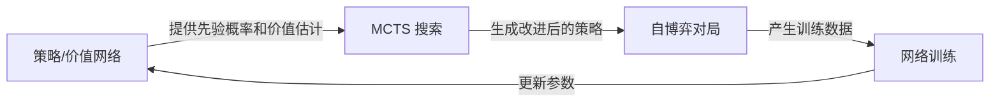

# 8.4 长程任务实验

前面我们用 PPO 解决了 BipedalWalker，并整理了不少游戏项目入口。这些任务的决策步数通常在几十到几千步之间，奖励信号也相对容易设计。但现实中的很多任务远比这复杂：一台机器人需要在厨房里完成"打开冰箱 → 取出食材 → 切菜 → 炒菜 → 装盘"这一长串操作，一个智能体需要在 Minecraft 中从零开始采集资源、建造房屋。这类任务叫做**长程任务**（Long-Horizon Task），它的决策步数可达数千甚至数万步，且中间几乎没有奖励信号。

这一节我们回顾传统强化学习（不涉及 LLM）在长程任务规划上的主要思路，包括分层强化学习、后见之明经验回放、基于模型的规划等方向。理解这些方法，有助于后续对比 LLM + RL 在长程规划上的不同策略。

## 长程任务为什么难

长程任务的困难可以归结为三个核心问题，它们相互交织、彼此加剧：

### 稀疏奖励

在大多数长程任务中，智能体只有在完成整个任务后才能获得奖励（比如围棋的胜负、机器人完成组装）。中间步骤的奖励 $r_t = 0$，策略梯度无法从零奖励中学到任何方向信号。这就是**稀疏奖励问题**（Sparse Reward Problem）。

对比 CartPole：每保持一步杆子不倒就获得 $r_t = 1$，信号非常稠密。而在"组装机器人"任务中，智能体可能随机探索一百万步都碰不到一个非零奖励。形式化地说，如果一个 episode 有 $T$ 步，每步有 $A$ 个可选动作，那么随机策略碰到非零奖励的概率是 $A^{-T}$——当 $T=100, A=4$ 时，这个概率约为 $10^{-60}$，几乎为零。

稀疏奖励不等于"没有奖励"。有时奖励虽然非零但频率极低——比如在 Montezuma's Revenge 中，通过一扇门才得 100 分，但整个游戏有 24 间房，平均需要上千步才能通过一扇门。

### 信用分配

即便最终获得了奖励，智能体也很难判断**哪一步的哪个动作**对这个奖励贡献最大。一个 1000 步的 episode，最终奖励是 $+1$，那么第 37 步的动作和第 892 步的动作，谁贡献更大？这就是**信用分配问题**（Credit Assignment Problem），随着 horizon 增长而急剧恶化。

信用分配的困难有数学上的根源：策略梯度估计的方差与有效 horizon 成正比。回顾 REINFORCE 的梯度估计：

$$\nabla_\theta J(\theta) \approx \frac{1}{N} \sum_{i=1}^{N} \sum_{t=0}^{T} \nabla_\theta \log \pi_\theta(a_t^{(i)} | s_t^{(i)}) \cdot \left(\sum_{t'=t}^{T} \gamma^{t'-t} r_{t'}^{(i)}\right)$$

当 $T$ 很大时，累计回报 $G_t = \sum_{t'=t}^{T} \gamma^{t'-t} r_{t'}$ 的方差极大。前面介绍的 Actor-Critic 和 GAE（Generalized Advantage Estimation）本质上都是为了缓解信用分配问题——用价值函数来"估计"每一步的贡献，而不是直接用高方差的累计回报。

### 探索空间爆炸

长程任务的状态空间随着步数指数级增长。假设每步有 4 个动作可选，100 步的任务就有 $4^{100}$ 种可能的轨迹。随机探索几乎不可能碰到有意义的解。这个问题被称为**探索瓶颈**（Exploration Bottleneck）。

探索空间爆炸与稀疏奖励形成了一个恶性循环：因为探索空间太大，随机策略几乎不可能碰到奖励；因为没有奖励信号，策略无法学到"哪些方向值得探索"。$\epsilon$-greedy 或添加高斯噪声这样的简单探索策略在短程任务中够用，但在长程任务中完全不够——它们只能探索局部邻域，无法做出"大步跳跃"式的探索。

后面介绍的分层 RL 和课程学习，本质上都是在探索层面做文章——通过改变探索的结构或难度，让智能体有机会碰到有意义的奖励信号。

## 分层强化学习

分层强化学习（Hierarchical Reinforcement Learning, HRL）是应对长程任务最经典的思路：把一个复杂任务拆成多个子任务，每个子任务有自己的策略和目标，高层负责"指派任务"，低层负责"执行任务"。

这种"分而治之"的思想无处不在：公司里有 CEO → 部门经理 → 员工的层级结构，CEO 不需要知道每个员工每天做什么，只需要给部门经理设定季度目标。HRL 的分层也是类似的——高层在抽象的"子目标空间"上做决策，低层在具体的"动作空间"上做决策。

HRL 之所以能缓解长程任务的三大困难，有三个直接原因：

- **决策频率降低**：高层每 $c$ 步（$c \gg 1$）才做一次决策，有效 horizon 从 $T$ 缩短到 $T/c$
- **抽象状态空间**：高层看到的是子目标级别的状态，而不是原始的像素或关节角度，状态空间更小
- **技能复用**：同一个底层技能可以在不同的高层任务中被复用，提高样本效率

  <em>图 1：HIRO 的两层分层架构。高层 Manager 观察环境状态后输出子目标（subgoal），低层 Worker 根据子目标执行原始动作。来源：<a href="https://arxiv.org/abs/1805.08296" target="_blank" rel="noopener noreferrer">Nachum et al., 2018</a></em>

### Options 框架

Sutton 等人在 1999 年提出的 **Options 框架**是 HRL 的理论基础。一个 Option $o$ 由三部分组成：

- **初始条件** $\mathcal{I}_o \subseteq \mathcal{S}$：在哪些状态下可以执行这个 Option
- **内部策略** $\pi_o: \mathcal{S} \times \mathcal{A} \to [0,1]$：执行期间遵循的策略
- **终止条件** $\beta_o: \mathcal{S} \to [0,1]$：到达某状态后以多大概率终止这个 Option

可以把 Option 理解为一个"宏动作"（macro-action），它不是一个单步动作，而是一段持续的行为。比如在机器人任务中，"走到冰箱前"就是一个 Option，它内部包含很多步的底层动作，但高层只需要选择这个 Option 即可。

有了 Options，高层的决策频率大幅降低——1000 步的底层任务，在高层可能只需要做 10 次 Option 选择。这直接缓解了信用分配和探索瓶颈。

### 目标条件策略

另一种分层的思路是**目标条件强化学习**（Goal-Conditioned RL）。策略的输入不仅有状态 $s$，还有一个目标 $g$：

$$\pi(a | s, g)$$

训练时，智能体学习"给定目标，如何到达"。这种泛化能力非常强大——策略不是只学"如何到达终点"，而是学"如何到达任意目标"。这意味着同一条轨迹可以被多次复用：智能体从 $s_0$ 走到 $s_T$ 的过程中，经过了 $s_5, s_{10}, s_{50}$ 等状态，那么这条轨迹既训练了"从 $s_0$ 到 $s_T$"，也训练了"从 $s_0$ 到 $s_5$"、"从 $s_5$ 到 $s_{10}$"等多个子任务。

UVFA（Universal Value Function Approximator, Schaul et al., 2015）是这个方向的基础工作：它学习一个统一的价值函数 $Q(s, a, g)$，对任意状态-目标对都给出价值估计。HIRO（Nachum et al., 2018）在此基础上构建了两层架构（图 1）：

- **高层** $\pi^{hi}$：每 $c$ 步观察状态 $s_t$，输出一个子目标 $g_t$（通常是状态空间中的一个目标状态）
- **低层** $\pi^{lo}$：根据当前状态和子目标执行原始动作 $a_t = \pi^{lo}(a_t | s_t, g_t)$
- **目标重标记**（goal relabeling）：高层训练时，不使用原始目标 $g_t$ 的奖励，而是用"实际到达的状态"作为虚拟目标，与 HER 的思想类似

HIRO 的关键创新在于高层的训练方式——由于低层策略在不断变化，高层的目标需要跟着适应。HIRO 通过一个重标记机制解决了这个非平稳问题。

### 自动子目标发现

HRL 的一个关键挑战是：**子目标从哪来？** 手动设计子目标需要领域知识，违背了 RL"端到端学习"的初衷。研究者提出了多种自动发现子目标的方法：

- **基于状态访问频率**：构建一个状态转移图，找到那些"经常被经过"的瓶颈状态。比如在迷宫中，连接两个房间的走廊就是瓶颈——很多轨迹都会经过它，所以它天然适合作为一个子目标。代表工作包括betweenness centrality 和 spectral clustering 方法
- **基于互信息**：通过最大化 DIAYN（Diversity is All You Need）这样的目标函数，学习一组技能，使得每个技能在不同状态子空间中有稳定且可区分的行为。直觉上，每个技能学会了一种"独特的运动模式"（比如向左走、向右走），这些技能自然成为可复用的子策略
- **基于技能发现**：与互信息方法相关但更关注时间抽象。例如 Option-Critic 架构将 Option 的发现和策略学习统一到一个端到端框架中——Option 的初始条件、内部策略和终止条件全部通过梯度下降自动学习，无需手动指定

::: info 分层方法的效果
"Does Hierarchical Reinforcement Learning Outperform Standard RL?" 这篇论文对 HRL 做了系统的实证比较，结论是：在真正需要长程规划的任务上，HRL 确实优于扁平 RL；但在中等难度的任务上，精心调参的 PPO 或 SAC 反而可能更好。分层结构本身引入了额外的复杂度和训练难度。
:::

## 后见之明经验回放

分层 RL 通过改变策略结构来应对长程任务。另一个方向是**改变数据利用方式**——其中最著名的方法是 **Hindsight Experience Replay（HER）**，由 Andrychowicz 等人于 2017 年在 OpenAI 提出。

### 核心思想

HER 的出发点很简单：智能体尝试达到目标 $g$ 但失败了，最终到达了状态 $s_T$。虽然对目标 $g$ 来说这次 episode 失败了，但如果**假装目标本来就是 $s_T$**，那这次经验就变成了成功经验。

  <em>图 2：Goal-Conditioned 任务中的目标概念。智能体需要将物体推到目标位置（绿色点），但奖励是稀疏的——只有到达目标才得 0 分，否则都是 -1 分。来源：<a href="https://openai.com/index/ingredients-for-robotics-research/" target="_blank" rel="noopener noreferrer">OpenAI Blog</a></em>

具体来说，训练过程中：

1. 智能体按正常方式与环境交互，尝试达到目标 $g$
2. episode 结束后，收集到的轨迹为 $(s_0, a_0, r_0, s_1, \ldots, s_T)$
3. 从最终状态 $s_T$（或中间状态）提取一个**虚拟目标** $g' = \phi(s_T)$
4. 用 $g'$ 替换原始目标 $g$，重新计算奖励 $r'_t = r(s_t, a_t, g')$
5. 将 $(s_t, a_t, r'_t, s_{t+1}, g')$ 存入回放缓冲区

这样，每条轨迹可以被多次复用——一次对原始目标，多次对不同的虚拟目标。在稀疏奖励下，HER 把"失败经验"转化为"成功经验"，极大地提高了样本效率。

  <em>图 3：HER 的核心机制——虚拟目标（Virtual Goal）。虽然智能体没有到达原始目标（红色点），但它到达了另一个位置（蓝色点）。HER 将这个"实际到达的位置"重新标记为目标，把失败经验转化为成功训练数据。来源：<a href="https://openai.com/index/ingredients-for-robotics-research/" target="_blank" rel="noopener noreferrer">OpenAI Blog</a></em>

### 与 Goal-Conditioned RL 的配合

HER 通常与目标条件策略 $\pi(a|s,g)$ 配合使用。策略的输入包含目标，所以改变目标就改变了策略的训练信号。DQN + HER 和 DDPG + HER 是常见的组合，后者在 OpenAI 的 Fetch 系列机器人任务上达到了接近 100% 的成功率。

原始论文提出了四种虚拟目标的采样策略：

- **final**：只用 episode 的最终状态作为虚拟目标（最简单，通常效果已经不错）
- **episode**：从同一条轨迹中随机选一个状态作为虚拟目标
- **future**：从当前时间步 $t$ **之后**的状态中随机选一个（最常用，避免"倒退"的虚拟目标）
- **random**：从之前所有 episode 的状态中随机选

实验表明 **future** 策略通常效果最好——因为它保证虚拟目标在时间上是"向前"的，逻辑上更合理。值得注意的是，HER 的虚拟目标采样策略与后面要介绍的课程学习有天然的交集：如果我们优先采样那些"离当前策略能力不太远"的虚拟目标，就形成了一种自动课程。

  <em>图 4：DDPG + HER 在 ShadowHand 旋转方块任务（Hand Manipulate Block—Rotate XYZ）上的训练曲线。DDPG + HER + 稀疏奖励（蓝色）显著超越所有基线配置，最终成功率达到接近 100%。来源：<a href="https://openai.com/index/ingredients-for-robotics-research/" target="_blank" rel="noopener noreferrer">OpenAI Blog</a></em>

### 局限性

HER 虽然巧妙，但有几个局限：

- **需要目标条件**：环境必须支持"到达某个状态"这种目标表示。如果目标无法用状态空间中的某个点来表示（比如"在棋局中获胜"），HER 就无法直接应用。不过，很多物理操作任务天然满足这个条件——"把物体放到目标位置"就是一个状态空间中的目标
- **虚拟目标质量**：如果随机到达的状态毫无意义，重新标记也没有帮助。比如在迷宫中，智能体随机探索到的位置可能在墙壁旁边，重新标记为"目标"没有训练价值。这个问题在稀疏奖励 + 大状态空间中尤为严重
- **极长程任务**：当任务需要多步精确的顺序执行时（比如"打开冰箱 → 取出食材 → 切菜 → 炒菜"），随机探索仍然很难到达有意义的终态。HER 解决的是"数据复用"问题，但不解决"探索"问题——如果智能体连第一步"打开冰箱"都做不到，后面的子目标都是空谈
- **多目标冲突**：如果环境中同时有多个目标需要满足，简单的 HER 可能产生相互矛盾的虚拟目标。Multi-goal HER 等扩展方法尝试解决这一问题

## 基于模型的规划（Model-Based Planning）

第三条路线是：与其让智能体在真实环境中试错，不如**先学一个世界模型（World Model），然后在世界模型中规划**。

  <em>图 5：Dreamer 的整体架构。从过去的经验中学习世界模型，然后在潜空间的想象中通过反向传播训练 Actor-Critic，最后将学到的策略部署到真实环境中。来源：<a href="https://arxiv.org/abs/1912.01603" target="_blank" rel="noopener noreferrer">Hafner et al., 2020</a></em>

### 短程模型推演

MBPO（Model-Based Policy Optimization, Janner et al., 2019）的思路是：学习一个环境动力学模型 $\hat{T}(s'|s,a)$，用它生成**短程虚拟轨迹**来增广训练数据。具体来说：

1. 从真实环境中收集数据 $(s, a, r, s')$
2. 用这些数据训练动力学模型 $\hat{T}$（通常用 ensemble 的方式训练多个模型来估计不确定性）
3. 从真实状态出发，用 $\hat{T}$ 模拟 $k$ 步（$k$ 通常很短，如 5 步），生成"分支轨迹"（branched rollout）
4. 将虚拟轨迹加入回放缓冲区，用 SAC 或 PPO 训练策略

MBPO 的关键洞察是：短程预测足够准确，长程预测误差累积太快。假设每步的预测误差是 $\epsilon$，那么 $k$ 步后的累积误差约为 $O(\epsilon \cdot \frac{\gamma^k}{1-\gamma})$。Janner 等人推导出了一个理论结论：当模型推演长度 $k$ 满足某个阈值时，使用模型数据的期望回报优于纯无模型方法。实践中这个 $k$ 通常取 5 左右。

MBPO 在 HalfCheetah 等连续控制任务上将样本效率提升了 5-10 倍。但它的局限也很明显：只用了模型的"短程"能力，本质上还是无模型训练，只是用模型来增强数据量。对于真正需要长期规划的任务，MBPO 的帮助有限。

  <em>图 6：MBPO 的核心思路。学习一个动力学模型来回答"如果我采取动作 $a$，下一步会怎样？"，然后用模型生成的虚拟轨迹增广训练数据。来源：<a href="http://bair.berkeley.edu/blog/2019/12/12/mbpo/" target="_blank" rel="noopener noreferrer">BAIR Blog</a></em>

### 搜索即规划

MBPO 和 Dreamer 学的是**隐式世界模型**（用神经网络拟合动力学）。另一条路是：**不需要学习世界模型，而是直接在已知的规则上搜索**。蒙特卡洛树搜索（Monte Carlo Tree Search, MCTS）就是这种思路的典范。

MCTS 的核心思想是：不需要遍历所有可能的未来（那太多了），而是通过有选择的模拟来找到好的动作。它维护一棵搜索树，每次迭代执行四个步骤：

1. **选择（Selection）**：从根节点出发，用 UCB（Upper Confidence Bound）公式选择最有潜力的子节点，直到到达一个尚未扩展的节点。UCB 公式为：

$$\text{UCB}(a) = Q(s, a) + c \cdot \sqrt{\frac{\ln N(s)}{N(s, a)}}$$

其中 $Q(s,a)$ 是动作价值估计，$N(s)$ 和 $N(s,a)$ 是访问次数，$c$ 是探索常数。第一项鼓励利用已知的好动作，第二项鼓励探索访问少的动作。

2. **扩展（Expansion）**：对选中的节点，模拟一步动作，将新状态加入搜索树

3. **模拟（Rollout）**：从新节点出发，用快速策略（如随机策略）模拟到终局，获得一个回报估计

4. **回传（Backpropagation）**：将模拟结果沿路径回传，更新路径上所有节点的 $Q$ 值和访问次数

MCTS 的强大之处在于**自适应的计算分配**：它把更多的模拟次数花在更有希望的动作分支上，而不是均匀地探索。搜索树的深度和广度随着计算量自动增长——思考时间越长，决策越好。

**AlphaZero 的革命**

纯粹的 MCTS 需要大量模拟才能得到准确的 $Q$ 值估计。AlphaZero（Silver et al., 2017）将 MCTS 与深度学习结合，做了一次关键的升级：

- **用神经网络替代 rollout**：不再用随机策略模拟到终局，而是用价值网络 $v_\theta(s)$ 直接给出状态价值估计。这相当于"截断"了搜索深度，用一个学习到的直觉来替代漫长的模拟
- **用策略网络缩小搜索范围**：策略网络 $\pi_\theta(a|s)$ 给出每个动作的先验概率，MCTS 在选择时优先考虑策略网络推荐的动作。搜索范围从所有合法动作缩小到少数几个候选
- **MCTS 与学习互相增强**：MCTS 的搜索结果作为"改进后的策略目标"来训练网络；训练好的网络又让 MCTS 搜索更准确。这形成了一个正反馈循环

AlphaZero 在围棋、国际象棋、将棋上均超越了人类冠军和之前的所有 AI 系统。它的成功说明了一个深刻的事实：**搜索和学习不是对立的，而是互补的**——学习提供直觉（价值网络），搜索提供精确推理（MCTS），两者结合远胜于单独使用。

不过 MCTS 也有明显的局限：它需要环境的精确模型（棋类游戏的规则是完美的模型），而现实世界很少有这种精确模型。AlphaZero 的方法在围棋这样的**完全可观测、离散动作、完美模型**的环境中表现优异，但很难直接迁移到机器人控制等连续、高维、部分可观测的任务上。

### Dreamer 与 在想象中训练

Dreamer 系列（Hafner et al., 2020-2023）走得更远——不在真实环境中训练策略，而是**完全在世界模型的想象中训练**。

Dreamer 的核心是一个称为 **RSSM**（Recurrent State-Space Model）的世界模型。RSSM 的关键设计是将潜状态分为两部分：

- **确定性状态** $h_t$：通过循环网络（GRU）从前一步递推，类似于 RNN 的隐状态，提供长期记忆
- **随机性状态** $z_t$：从观测中推断，捕捉当前帧的不确定性（比如其他玩家的位置不可预测）

两者的结合使得模型既能记住"我在哪个房间"（确定性），又能处理"门可能开也可能关"（随机性）。

完整的 Dreamer 训练分三个阶段：

**阶段一：学习世界模型**

从真实交互数据中学习 RSSM 的参数，优化目标包括：

- 观测重建损失：让潜状态能够重建原始观测
- 奖励预测损失：从潜状态预测奖励
- KL 散度正则化：保持后验 $q(z_t | o_{\leq t}, a_{<t})$ 接近先验 $p(z_t | h_t)$

**阶段二：在想象中训练策略**

世界模型固定不变，从想象中采样潜状态序列 $z_1, z_2, \ldots, z_H$（$H$ 可达数百步），然后在这个想象的序列上训练 Actor-Critic：

- Actor 通过反向传播穿过想象的时间步来优化策略参数
- Critic 估计想象中的状态价值，使用 $\lambda$-return 来平衡偏差和方差

**阶段三：部署到真实环境**

将学到的策略直接用于真实环境，收集新数据，回到阶段一继续迭代。

1. **表征模型**（Representation Model）：将原始观测（如图像）编码为潜变量 $z_t$
2. **转移模型**（Transition Model）：学习潜空间中的动力学 $p(z_{t+1}|z_t, a_t)$
3. **策略模型**（Policy Model）：在潜空间中学习策略 $\pi(a|z_{1:t})$

  <em>图 7：Dreamer 的三个阶段。(a) 从经验中学习动力学模型（编码器 + RSSM + 奖励预测）；(b) 在想象的潜空间轨迹中训练 Actor-Critic；(c) 将策略部署到环境中执行动作。来源：<a href="https://arxiv.org/abs/1912.01603" target="_blank" rel="noopener noreferrer">Hafner et al., 2020</a></em>

训练时，先从真实数据学习世界模型，然后**完全在模型的"想象"中训练策略**——通过反向传播穿过时间步来优化策略参数。因为不需要与环境交互，策略可以"预见"很远的未来并据此做决策。

Dreamer-V3（2023 年发表于 Nature）在超过 150 个不同的基准任务上使用**同一组超参数**达到了 SOTA 水平，从连续控制到 Atari 游戏再到 Minecraft 中的钻石采集，展现了基于模型方法的强大泛化能力。Dreamer-V3 相比前代做了几个关键改进：

- **symlog 预测**：用对称对数变换来处理不同量级的值（奖励、价值等），让同一个网络能同时适应 $[-1, 1]$ 和 $[-1000, 1000]$ 范围的目标
- **免归一化**：前代 Dreamer 需要对奖励和状态做归一化，Dreamer-V3 通过动态损失缩放（dynamic loss scaling）自动处理
- **robust critic**：使用分位数回归（quantile regression）来估计价值分布，而不是简单的期望值，对长尾分布的奖励更鲁棒

  <em>图 8：DreamerV3 在 Minecraft 钻石采集任务上的表现。这是第一个从零开始（无人类数据、无课程学习）在 Minecraft 中成功采集钻石的算法，整个流程需要超过 17000 步的连续决策。来源：<a href="https://arxiv.org/abs/2301.04104" target="_blank" rel="noopener noreferrer">Hafner et al., 2023</a></em>

::: tip 为什么世界模型能处理长程任务
世界模型把"探索环境"和"学习策略"解耦：在真实环境中只需要探索到足够好的动力学模型，之后策略训练在想象中完成，不受真实交互次数的限制。Dreamer 可以在想象中展开数百步的轨迹，让策略"看到"长程后果。
:::

## 探索方法

前面介绍的方法（分层 RL、HER、世界模型）主要从策略结构和训练方式上解决长程问题。但它们都隐含了一个假设：智能体能在环境中收集到足够多样的数据。当任务极度稀疏、探索空间爆炸时，这个假设不成立——智能体需要**专门的探索策略**。

### Go-Explore 与 回到过去继续探索

Go-Explore（Ecoffet et al., 2019, 2021）是解决长程稀疏探索的里程碑方法。它的核心洞察是：**大多数探索算法的问题不是"找不到新状态"，而是"找到了但随即忘记了"**。智能体偶然到达了一个有前景的新状态，但因为策略是随机的，下次 episode 几乎不可能再回到那个状态。

Go-Explore 的解决方案直截了当：**把有前景的状态存下来，下次直接从那里出发**。具体分两个阶段：

**阶段一：探索（Explore）**

1. 维护一个**存档**（archive），保存所有访问过的"有趣"状态
2. 从存档中随机选一个状态，加载到模拟器中（即"回到过去"）
3. 从该状态出发，用随机策略或半随机策略探索
4. 如果发现了新状态（用网格化 Cell 来定义"新"），将其加入存档
5. 重复上述过程

这个过程的直觉是：如果你在探索迷宫时发现了一条有希望的新路，下次不用从起点重新开始——直接从新路的位置继续探索。

**阶段二：鲁棒化（Robustify）**

阶段一产生的是一系列高回报轨迹，但这些轨迹可能非常脆弱——它们依赖精确的状态加载和随机种子，无法直接用作策略。阶段二用**模仿学习**（下一节介绍）从这些轨迹中训练一个稳健的神经网络策略，使其能在没有"存档点"的情况下也能完成任务。

Go-Explore 在 Montezuma's Revenge 上取得了超过 40,000 分的成绩，是当时平均人类得分的 10 倍以上。它还在 Pitfall 等之前被认为"几乎不可能"的 Atari 游戏上取得了突破。

Go-Explore 的局限在于它**依赖环境的可重置性**——需要能够将环境精确恢复到某个历史状态。在模拟器中这不是问题（可以保存/加载状态），但在真实机器人上很难实现。后续工作提出了"策略版本"的 Go-Explore，用目标条件策略来近似状态重置，但效果有所折扣。

### 内在奖励与好奇心驱动

另一类探索方法不依赖状态存档，而是给智能体一个**内在奖励**（intrinsic reward），鼓励它主动探索新颖状态。总奖励变为：

$$r_t^{\text{total}} = r_t^{\text{extrinsic}} + \beta \cdot r_t^{\text{intrinsic}}$$

其中 $\beta$ 控制探索与利用的平衡。常见的内在奖励设计包括：

- **计数探索**（Count-based）：记录每个状态（或状态-动作对）的访问次数 $N(s)$，内在奖励设为 $r_t^{\text{int}} = 1/\sqrt{N(s_{t+1})}$。访问越少的状态，奖励越高。简单有效但难以扩展到高维连续状态空间（因为几乎不会"重复访问"同一个连续状态）
- **RND（Random Network Distillation）**：训练一个固定的随机神经网络 $f$ 作为"目标网络"，同时训练一个预测网络 $\hat{f}$ 去模仿 $f$ 的输出。预测误差 $\|f(s) - \hat{f}(s)\|^2$ 作为内在奖励——如果某个状态的预测误差大，说明这个状态"新颖"（之前没见过类似的），值得探索
- **ICM（Intrinsic Curiosity Module）**：学习一个前向动力学模型 $\hat{s}_{t+1} = f(s_t, a_t)$，用预测误差作为好奇心信号。额外加一个逆向模型来过滤"不可控"的噪声（比如电视屏幕的随机变化不应该产生好奇心）

内在奖励方法的优势是通用性强——不需要修改环境或策略结构，只需要在奖励函数上加一项。但它们面临一个根本性的**"noisy TV"问题**：如果环境中有一个持续产生随机信号的噪声源（比如一台随机切换频道的电视），智能体可能永远停在电视机前看，因为每次的画面都是"新颖"的。ICM 通过逆向模型部分解决了这个问题，但在复杂环境中仍然是一个挑战。

## 奖励塑形与课程学习

除了改变策略结构和训练方式，还有一类方法从**奖励函数本身**入手。

### 奖励塑形

**奖励塑形**（Reward Shaping）的核心思想是为稀疏奖励任务手工设计或自动学习**稠密的中间奖励**。最著名的理论结果是 Ng 等人（1999）证明：基于势能函数的奖励塑形

$$F(s, s') = \gamma \Phi(s') - \Phi(s)$$

不改变最优策略（策略等价性），其中 $\Phi$ 是任意状态函数。这保证了人为添加的奖励不会"误导"智能体。

举例说明：在导航任务中，原始奖励只有"到达终点 $+1$"。我们可以设置势能函数 $\Phi(s)$ 为状态 $s$ 到终点的距离的负值，那么 $F(s, s') = \gamma \cdot (-\text{dist}(s')) - (-\text{dist}(s))$，相当于"每接近终点一步就获得一个小奖励"。由于 $\Phi$ 是势能函数，这个附加奖励满足策略等价性——它不会改变最优策略是什么，只是让学习过程更快。

  <em>图 9：通过学习获得的奖励函数示例。智能体从稀疏的环境中学习到一个稠密的奖励信号（颜色越亮奖励越高），为策略训练提供了更丰富的梯度信息。来源：<a href="https://arxiv.org/abs/1907.02025" target="_blank" rel="noopener noreferrer">Singh et al., 2019</a></em>

但设计好的势能函数 $\Phi$ 本身就需要领域知识——你需要知道什么是"好的中间状态"。为了减少对人工设计的依赖，研究者发展了多种自动推断奖励的方法：

- **逆向强化学习**（Inverse RL, IRL）：从专家演示中推断奖励函数。假设专家的轨迹是最优的，反推出什么样的奖励函数会让专家行为最优。代表方法包括 MaxEnt IRL 和 GAIL（Generative Adversarial Imitation Learning）
- **偏好强化学习**（Preference-based RL）：让人类对两条轨迹做偏好判断（"A 比 B 好"），从中学习奖励函数。这后来成为 RLHF 的核心思想——后面章节会详细介绍
- **自监督奖励发现**：不依赖人类输入，而是用信息论或好奇心驱动（Curiosity-driven）的方法自动生成内在奖励。例如 RND（Random Network Distillation）用预测误差作为好奇心信号，鼓励智能体探索新颖状态

### 课程学习

**课程学习**（Curriculum Learning）的思路是：不要一开始就给智能体最难的任务，而是从简单任务开始，逐步增加难度。这个概念最早由 Bengio 等人（2009）提出，灵感来自人类教育——小学生不会一开始就学微积分，而是先学加减乘除。

  <em>图 10：RL 中课程学习的五种主要类型。红色部分为"课程生产者"（负责生成训练任务），蓝色部分为"目标策略"（需要被训练的策略）。来源：<a href="https://lilianweng.github.io/posts/2020-01-29-curriculum-rl/" target="_blank" rel="noopener noreferrer">Lilian Weng, 2020</a></em>

Lilian Weng（2020）将 RL 中的课程学习分为五种主要类型，图 10 展示了每种类型中"谁生成课程"和"谁执行课程"的关系：

**1. 任务特定课程（Task-Specific Curriculum）**

最直接的方式：人工设计一系列难度递增的任务。例如训练机器人开门：

- 阶段一：门已经半开，只需要推一下
- 阶段二：门微微打开，需要更大力气
- 阶段三：门完全关闭，需要完整的开门动作

这种方法的优点是可控性强，缺点是需要大量人工设计。OpenAI 在训练机械手解魔方时就采用了精心设计的手动课程。

**2. 教师引导课程（Teacher-Guided Curriculum）**

用一个独立的"教师"策略来为"学生"生成合适的训练任务。教师根据学生的当前能力水平，动态调整任务难度——太简单则加速推进，太难则退回练习。这类方法的代表是 Prioritized Level Replay（PLR）：维护一个任务池，根据智能体的学习信号（如 TD error 或成功率变化）来优先采样最有训练价值的任务。

**3. 自博弈课程（Self-Play Curriculum）**

让智能体以自己为对手进行博弈训练。AlphaGo 和 AlphaZero 是最经典的例子：智能体不断与过去的自己对弈，对手越来越强，训练难度自然递进。这种方法在零和博弈中非常有效，但在合作任务或单智能体任务中不太适用。OpenAI Five 在训练 Dota 2 时也采用了自博弈 + 课程的方式，从 1v1 逐步过渡到 5v5。

**4. 自动目标生成（Automatic Goal Generation）**

核心思想是**用算法自动生成合适的训练目标**，而不是依赖人工设计。代表方法包括：

- **ALP-GMM**（Absolute Learning Progress - Gaussian Mixture Model）：用高斯混合模型对任务参数空间建模，根据"学习进展"（learning progress）来采样新任务。学得快的区域多采样，学不动的区域少采样
- **GoalGAN**：训练一个生成对抗网络来生成"刚好适合当前智能体能力"的目标——太难的目标不会产生梯度信号，太简单的目标浪费计算
- **SPDL**（Self-Paced Deep Learning）：将课程学习建模为一个优化问题，在"训练难度"和"学习进度"之间自动平衡

**5. 基于技能的课程（Skill-Based / Distillation Curriculum）**

先在多个独立任务上训练出各自的技能策略，再将这些技能蒸馏到一个统一的多面手策略中。这种方法假设不同的子任务会自然形成一个由简到难的课程结构。代表工作包括 Distral 和政策蒸馏（Policy Distillation）。

#### RL 中课程的三个维度

无论采用上述哪种类型，课程在 RL 中通常通过以下维度来调节难度：

- **初始状态课程**：一开始让智能体从离目标很近的地方出发，逐渐增加初始距离。例如在导航任务中，先从终点 1 米处出发，再从 5 米、10 米、50 米处出发
- **目标课程**：先学简单的目标，再学复杂的目标。例如机械臂先学"移动到指定位置"，再学"抓取物体"，再学"抓取后放到目标位置"
- **环境课程**：先在简单环境（少障碍物、低摩擦力）中训练，再迁移到复杂环境。Domain Randomization 可以看作一种特殊的课程策略——先在窄分布的环境参数上训练，再逐步扩大随机化范围

#### 课程学习与 HER 的结合

课程学习与 HER 的结合（Curriculum-guided HER）在长程稀疏奖励任务上效果显著：HER 负责高效利用失败经验，课程负责控制任务难度的递进。一个具体的结合方式是：在 HER 的虚拟目标采样中引入偏好——优先采样那些离当前策略能力边界不太远的虚拟目标，而不是完全随机采样。这避免了 HER 在极长程任务中采样到"过于简单"或"过于困难"的无效虚拟目标。

## 从专家演示学习

到目前为止，所有方法都假设智能体从零开始学习。但如果我们有**专家的示范**（demonstration），情况就完全不同了——专家演示天然包含了长程规划的"答案"。从专家数据中学习的方法统称为**模仿学习**（Imitation Learning, IL）。

### 行为克隆

最简单的模仿学习是**行为克隆**（Behavioral Cloning, BC）：把专家轨迹当作监督学习的数据集，训练一个策略网络 $\pi_\theta(a|s)$ 去模仿专家的动作选择：

$$\min_\theta \sum_{(s_i, a_i) \in \mathcal{D}_{\text{expert}}} \mathcal{L}(\pi_\theta(\cdot|s_i), a_i)$$

BC 简单到令人怀疑它的效果。事实上，它在"短程"任务上确实很好用——自动驾驶中的车道保持、简单的机械臂抓取，几十万条专家数据就能训出一个不错的策略。

但 BC 有一个致命的问题：**分布漂移**（Distribution Shift，也称 covariate shift）。训练时策略只看到过专家的状态分布 $p_{\text{expert}}(s)$，但执行时策略一旦犯了小错误，就会进入一个训练时从未见过的状态，然后犯更大的错误，形成恶性循环：

$$s_0 \sim p_{\text{expert}} \to a_0 \text{ 略有偏差} \to s_1 \notin p_{\text{expert}} \to a_1 \text{ 大幅偏差} \to s_2 \text{ 崩溃}$$

这个 compounding error 问题在长程任务中尤为严重——策略需要连续正确决策数百步，一步出错就可能永远恢复不了。理论上，如果策略每步的错误概率是 $\epsilon$，那么 $T$ 步后至少犯一次错的概率约为 $1 - (1-\epsilon)^T \approx T\epsilon$，与 horizon 成正比。

### DAgger 与 迭代纠错

DAgger（Dataset Aggregation, Ross et al., 2011）是解决分布漂移的经典方法。它的思路是：既然策略执行时会遇到训练分布之外的状态，那就**让专家也在这些状态上提供示范**。

具体流程：

1. 用初始专家数据训练策略 $\pi_1$
2. 用 $\pi_1$ 在环境中执行，收集访问过的状态序列 $\{s_1, s_2, \ldots\}$
3. 请专家为这些状态标注正确的动作 $\{a_1^*, a_2^*, \ldots\}$
4. 将新数据加入数据集，重新训练策略 $\pi_2$
5. 重复直到收敛

DAgger 的理论保证很强：在适当条件下，DAgger 的累积遗憾以 $O(1/T)$ 的速度递减，远优于纯 BC 的 $O(T)$。但它的实际瓶颈在于**需要在线访问专家**——每轮迭代都需要人类（或昂贵的专家系统）为新状态标注动作。在某些场景下（比如机器人遥操作），获取专家标注的成本非常高。

### 对抗模仿学习 与 GAIL

如果只有一批专家数据，无法在线获取更多标注怎么办？**GAIL**（Generative Adversarial Imitation Learning, Ho & Ermon, 2016）提供了一种巧妙的解决方案，灵感来自 GAN（生成对抗网络）：

- **生成器** $G$：策略 $\pi_\theta$，尝试生成与专家相似的轨迹
- **判别器** $D_\phi$：尝试区分"专家轨迹"和"策略轨迹"

训练目标是让判别器尽可能准确地区分，同时让策略尽可能"骗过"判别器：

$$\min_\theta \max_\phi \; \mathbb{E}_{\pi_\theta}[\log(1 - D_\phi(s, a))] + \mathbb{E}_{\pi_E}[\log D_\phi(s, a)]$$

训练完成后，判别器被丢弃，只保留策略。GAIL 的巧妙之处在于它**不需要显式地定义奖励函数**——判别器的输出隐式地定义了一个奖励：$r(s, a) = \log D(s, a)$。专家做过的 $(s, a)$ 对得高分，策略自己产生的得低分。

GAIL 在机器人操控、自动驾驶等任务上表现优异，但训练不稳定（GAN 的通病）且计算成本较高。后续工作如 DAC（Deep Adversarial Control）和 AIRL（Adversarial Inverse Reinforcement Learning）改进了 GAIL 的稳定性。

::: info 模仿学习与 RL 的关系
模仿学习和强化学习不是二选一的关系。在实践中，最常见的模式是**先用 BC 从专家数据初始化策略，再用 RL 微调**。这种组合在 AlphaStar（星际争霸 II AI）和 OpenAI Five（Dota 2 AI）中都被使用：BC 提供一个不错的起点（避免 RL 从零开始的漫长探索），RL 在此基础上进一步优化。后续我们会看到，这个"BC 初始化 + RL 微调"的模式在大模型对齐（RLHF）中也出现了——SFT 对应 BC，PPO/DPO 对应 RL 微调。
:::

## 方法对比与总结

下表总结了传统 RL 在长程任务上的主要方法路线：

| 方法路线     | 核心思路                 | 代表工作                 | 优势                       | 局限                           |
| ------------ | ------------------------ | ------------------------ | -------------------------- | ------------------------------ |
| 分层 RL      | 把长程任务拆成子任务     | Options、HIRO、DIAYN     | 决策频率降低，可解释性强   | 子目标发现问题，训练复杂       |
| HER          | 把失败经验重新标记为成功 | DDPG+HER                 | 简单有效，样本效率高       | 需要目标条件，极长程仍困难     |
| 基于模型规划 | 学世界模型 / 树搜索      | MBPO、Dreamer、AlphaZero | 极高的样本效率或推理能力   | 模型误差，或需要完美环境模型   |
| 探索方法     | 回到过去 / 好奇心驱动    | Go-Explore、RND、ICM     | 专门解决稀疏奖励探索问题   | 依赖模拟器，或受 noisy TV 困扰 |
| 奖励塑形     | 设计中间奖励引导学习     | 势能奖励塑形、IRL        | 理论保证不改变最优策略     | 需要领域知识                   |
| 课程学习     | 从简单到困难递进         | ALP-GMM、GoalGAN、PLR    | 稳定训练，适合迁移         | 课程设计本身困难               |
| 模仿学习     | 从专家演示中学习         | BC、DAgger、GAIL         | 绕过探索问题，快速获得策略 | 需要专家数据，存在分布漂移     |

这些传统方法在机器人控制、游戏 AI、自动驾驶等领域都取得了实质性进展。它们的共同特点是需要针对特定任务精心设计（子目标结构、奖励塑形、课程策略、专家数据），泛化到全新任务的能力有限。后续章节我们会看到，LLM 的引入为长程规划带来了一种全新的范式——利用大模型的常识和推理能力来生成子目标、设计奖励、甚至直接做规划，大幅减少了对人工设计的依赖。

## 本章总结

本章围绕 PPO 这一稳定训练的核心算法展开，从实践到理论，从约束到估计。同时我们也回顾了传统强化学习在长程任务规划上的主要探索方向——分层 RL、HER、基于模型规划（MBPO、MCTS/AlphaZero、Dreamer）、探索方法（Go-Explore、好奇心驱动）、奖励塑形、课程学习和模仿学习——这些方法为理解后续 LLM + RL 在长程规划上的新范式奠定了基础。

在 PPO 的基础上，下一部分我们将进入**大模型 RL** 的核心内容：从 RLHF 到 DPO 再到 GRPO，看看 PPO 的思想如何在大模型对齐中焕发新生。
