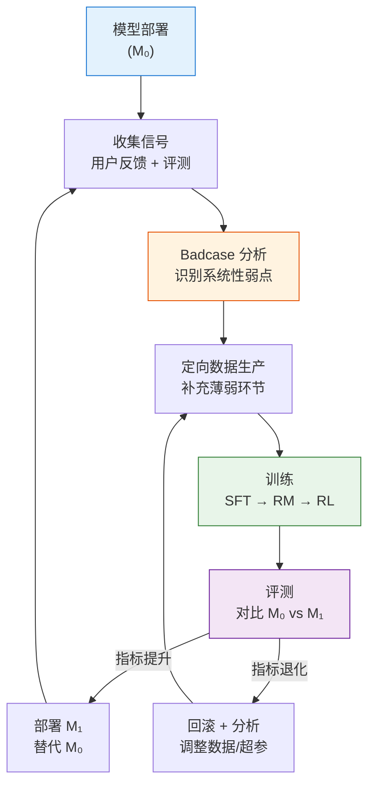
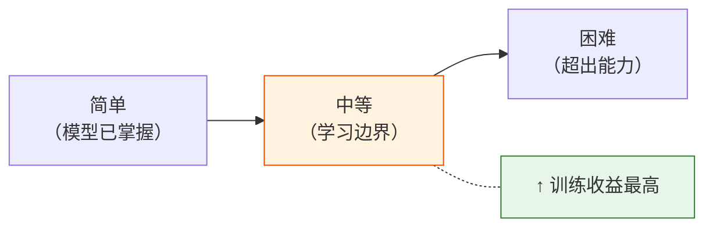
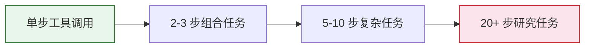

# 10.5 数据循环体系——从训练到数据再到训练

前面四节我们分别讨论了 RLHF 流水线的各个组件：模仿学习与 SFT、奖励函数设计、训练稳定性、以及 RLAIF 和 Self-Play。这些组件拼在一起形成了一个完整的对齐系统。但还有一个**贯穿全局的视角**没有讲——数据如何在整个流水线中流转、进化、反馈。

这一节不讲新算法，而是回答一个工程问题：**如何让数据像飞轮一样，越转越快，越转越好？**

## 数据飞轮：对齐不是一个项目，而是一个系统

工业界的 RLHF 从来不是"训练一次就完事"。一个成熟的对齐系统运转方式如下：



这个飞轮转得越快，模型迭代的速度就越快。关键瓶颈往往不在训练——而在**数据生产和评测**这两端。

### 飞轮运转的关键指标

| 指标       | 含义                         | 健康范围 |
| ---------- | ---------------------------- | -------- |
| 迭代周期   | 从发现问题到部署新模型的耗时 | 1-2 周   |
| 数据有效率 | 新数据中实际提升模型的比例   | > 30%    |
| 评测覆盖率 | 评测集覆盖的能力维度比例     | > 80%    |
| 回退率     | 因退化而回滚的迭代比例       | < 10%    |

## 数据质量保障：垃圾进、垃圾出

无论用什么算法（DPO、PPO、GRPO），数据质量的影响都远大于算法选择。数据质量保障分三个层次：

### 第一层：基础清洗

```python
# ==========================================
# 数据质量基础检查
# ==========================================

def quality_check(dataset):
    """数据集质量基础检查"""
    issues = []

    for sample in dataset:
        # 1. 去重：文本相似度 > 0.9 的样本只保留一条
        # 可用 MinHash / SimHash 快速去重

        # 2. 去污染：检查 prompt 是否与评测集重叠
        # 评测集泄露会导致虚假的高分

        # 3. 长度过滤：过短（<10 tokens）或过长（>4096 tokens）的样本
        if len(sample['chosen']) < 10 or len(sample['chosen']) > 4096:
            issues.append(('length', sample))

        # 4. 格式检查：chosen 和 rejected 是否有实质差异
        if sample['chosen'] == sample['rejected']:
            issues.append(('identical', sample))

        # 5. 语言一致性：prompt 和 response 的语言是否一致
        # 中英混杂的数据可能混淆模型

    return issues
```

### 第二层：难度分层

不是所有数据对模型的帮助都一样大。太简单的数据（模型已经能做好）浪费训练资源，太难的数据（模型根本学不会）没有训练价值。最佳策略是**围绕模型当前的"学习边界"构造数据**：



实践中，可以用模型在当前数据上的 **Pass@K** 来判断难度：

- Pass@K ≈ 100%：太简单，跳过
- Pass@K ≈ 30-70%：学习边界，重点训练
- Pass@K ≈ 0%：太难，暂缓或分解为子任务

### 第三层：LLM-as-Judge 质量打分

对于无法用规则验证的数据（如对话质量、创意写作），用 LLM-as-Judge 做批量质量打分：

```python
def llm_judge_quality(judge_model, prompt, response):
    """用 LLM Judge 评估数据质量"""
    judge_prompt = f"""
请评估以下训练数据的质量（1-5 分）。

评估维度：
- 准确性：信息是否正确，有无幻觉
- 帮助性：是否真正解决了问题
- 安全性：有无有害内容

用户问题: {prompt}
模型回答: {response}

质量评分（1-5）:
"""
    score = judge_model.generate(judge_prompt)
    return float(score)

# 过滤低质量数据
filtered_data = [d for d in dataset if llm_judge_quality(judge, d['prompt'], d['chosen']) >= 3.5]
```

## 数据合成策略：四种生产方式

### 1. 拒绝采样合成正例

让模型在同一个 prompt 上生成 N 次回答，保留最好的（通过验证器或 RM 评分）作为 chosen。这是 GRPO 训练中最常用的数据生产方式：

```python
def rejection_sampling(model, prompt, verifier, num_samples=16):
    """拒绝采样：生成多个候选，保留最好的"""
    candidates = [model.generate(prompt, temperature=0.8) for _ in range(num_samples)]
    scores = [verifier.score(prompt, c) for c in candidates]
    best = candidates[max(range(len(scores)), key=lambda i: scores[i])]
    return best
```

### 2. 对比构造偏好对

对于 DPO 训练，需要 (chosen, rejected) 偏好对。构造方式：

- **同一模型对比**：模型生成多个回答，最高分 = chosen，最低分 = rejected
- **不同模型对比**：强模型的回答 = chosen，弱模型的回答 = rejected
- **Self-Critic 对比**：原始回答 = rejected，自我修订后的回答 = chosen

### 3. 课程式合成

从简单任务逐步组合成复杂任务——[第 9 章的轨迹合成](../chapter12_agentic_rl/trajectory-synthesis)中大量使用了这种方式：



### 4. 主动学习：让模型告诉你它需要什么数据

不是盲目地生产数据，而是让模型自己暴露弱点：

1. 用当前模型跑一批评测，收集所有错误样本
2. 按**错误类型**聚类（数学错误、代码错误、知识错误等）
3. 针对**高频错误类型**定向生产训练数据
4. 用新数据训练后，再次评测验证改进效果

```python
def active_learning_cycle(model, eval_set, data_producer):
    """主动学习循环：自动发现并补强薄弱环节"""
    # 1. 评测，收集错误
    errors = evaluate(model, eval_set)

    # 2. 按类型聚类
    error_clusters = cluster_by_type(errors)

    # 3. 针对 top-k 薄弱环节定向生产数据
    new_data = []
    for cluster in error_clusters.top_k(k=3):
        new_data.extend(data_producer.generate(
            task_type=cluster.type,
            difficulty=cluster.difficulty,
            num_samples=1000
        ))

    # 4. 训练并验证
    model = train(model, new_data)
    improvement = evaluate(model, eval_set).accuracy - errors.accuracy
    return model, improvement
```

## 两个实践案例

### 案例一：Reasoning 数据循环

[GRPO](../chapter08_grpo_rlvr/grpo-practice-and-mechanism) + [RLVR](../chapter08_grpo_rlvr/deepseek-dapo-rlvr) 训练中的数据循环：

```
GRPO 采样 N 条回答
    ↓
验证器判断正确/错误（规则验证，无需 RM）
    ↓
组内排序：正确 > 错误，更短 > 更长
    ↓
GRPO 训练（正确的强化，错误的弱化）
    ↓
评测（GSM8K / MATH / HumanEval）
    ↓
收集仍做错的题目 → 定向生成类似题目 → 回到训练
```

这个循环的关键是**验证器不需要训练**——数学答案对不对、代码能不能跑，都是规则可判定的。这让数据生产的成本极低。

### 案例二：Agent 轨迹数据循环

Agentic RL 中的数据循环更复杂，因为涉及工具执行环境：

```
Agent 执行任务 → 收集成功/失败轨迹
    ↓
成功轨迹 → 作为正例（chosen）
失败轨迹的"部分成功"片段 → 改进后作为正例
完全失败的轨迹 → 作为反例（rejected）
    ↓
GRPO / PPO 训练
    ↓
评测（SWE-bench / WebArena）
    ↓
按失败类型分析 → 构造针对性的训练任务 → 回到训练
```

Agent 轨迹数据循环的特殊之处在于：**轨迹是环境交互的产物，不能凭空生成**。每条轨迹都需要真实的工具执行（运行代码、访问网页、调用 API），这意味着数据生产有不可压缩的时间成本。这也是为什么[第 9 章的工程实战](../chapter12_agentic_rl/agentic-engineering)花了大量篇幅讨论异步并发和并行 rollout 的工程优化。

<details>
<summary>思考题：如果数据飞轮转得很快但评测集很小（只有 100 道题），会有什么问题？</summary>

这会导致**对评测集过拟合**——模型在 100 道评测题上表现越来越好，但在真实使用场景中的表现可能不变甚至变差。数据飞轮的有效性取决于评测集的**代表性**——它必须能代表模型在真实场景中会遇到的任务分布。

如果评测集太小，模型可能学会"记住"这 100 道题的最优回答，而不是学会通用的推理能力。解决方案：

1. 扩大评测集（至少 1000+ 题目，覆盖多个领域和难度）
2. 定期更换评测集（避免模型"刷题"）
3. 用 A/B 测试在真实用户流量上验证（这是最终的"真实评测"）

</details>

到这里，我们从数据飞轮、质量保障、合成策略到两个实践案例，完整覆盖了对齐系统中"数据"这个核心要素。下一章，我们将从单轮 RL 进入多轮交互的 Agentic RL——看看如何训练能在环境中连续行动、调用工具的智能体。让我们进入第 9 章——[Agentic RL](../chapter12_agentic_rl/intro)。
