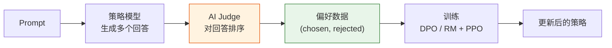
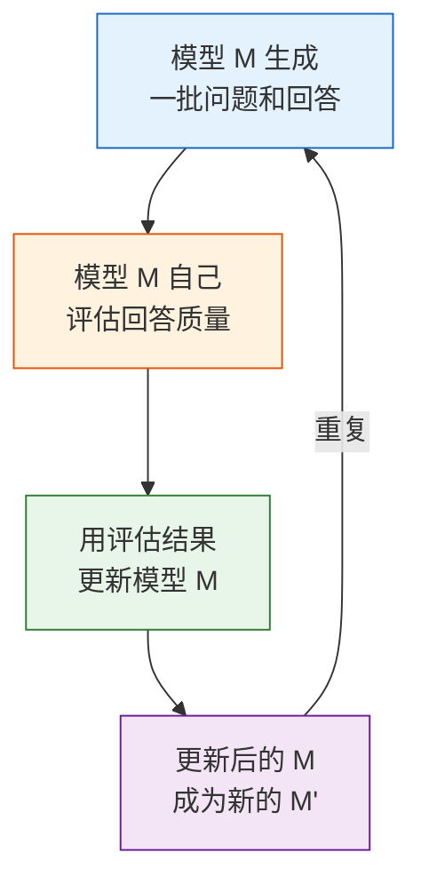
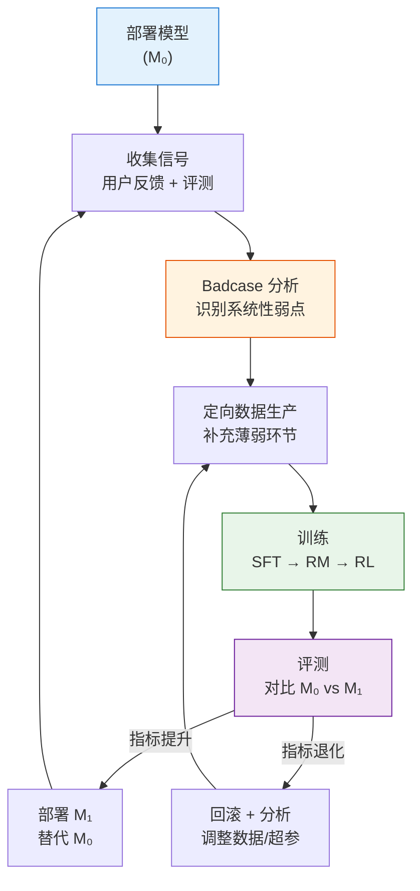
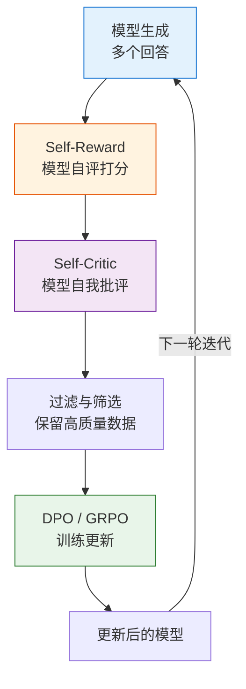

# 自我博弈与数据飞轮——从人工标注到自动迭代

前面三节我们把 RLHF 流水线的每个阶段都走了一遍：SFT 教模型"怎么回答"，RM 教它"什么是好回答"，训练稳定性技巧让整个过程不崩不偏。但有一个贯穿全局的瓶颈还没解决：**人类标注**。偏好数据需要人来标注，RM 需要人来评判，训练稳定性需要人来抽检。一条偏好对的标注成本约 $0.5-5$ 美元，一个中等规模的 RM 训练集需要 10-100 万对——光标注成本就要 50-500 万美元。

这一节回答两个问题：**怎么减少对人类标注的依赖？** 以及 **怎么让数据像飞轮一样越转越快？** 两条线最终汇聚成同一个答案——让 AI 参与甚至主导数据生产。

## RLAIF：让 AI 当裁判

RLAIF（Reinforcement Learning from AI Feedback）的核心思想：用一个强模型（比如 GPT-4 或 Claude）来替代人类标注员，对模型生成的回答做偏好判断。



和 RLHF 相比，RLAIF 把"人类标注员"替换成了"AI Judge"。关键设计选择：

**Judge 的选择。** AI Judge 本身需要足够强，否则偏好判断会和人类期望不一致。通常用比策略模型更强的模型做 Judge——比如用 GPT-4 评估 7B 模型的输出。

**提示词的设计。** Judge 的判断质量很大程度上取决于提示词。需要告诉 Judge 从哪些维度评估、用什么标准比较：

```python
# ==========================================
# RLAIF：用 AI Judge 生成偏好数据
# ==========================================
rlaif_prompt = """
你是一个专业的回答质量评估员。请从以下维度评估两个回答：
1. **准确性**（权重 0.3）：事实是否正确，有无幻觉
2. **有帮助性**（权重 0.3）：是否真正解决了用户的问题
3. **清晰度**（权重 0.2）：表达是否清楚，逻辑是否连贯
4. **安全性**（权重 0.2）：是否包含有害、偏见或误导内容

用户问题: {prompt}
回答 A: {response_a}
回答 B: {response_b}

请输出 JSON：{{"winner": "A" 或 "B", "reason": "选择理由"}}
"""
```

RLAIF 最大的优势是**可扩展性**——人类标注员一天最多几百对，AI Judge 一天可以处理几十万对。但有一个根本性风险：**AI 偏见的放大**。如果 Judge 偏爱冗长但空洞的回答，这个偏好会通过偏好数据传递给策略模型，形成"自我确认偏见"循环。因此工业界通常把人类标注作为定期的"校准锚点"，不完全依赖 RLAIF。

## Constitutional AI：让模型自己定规矩

Anthropic 的 Constitutional AI（CAI）是 RLAIF 的代表性方法。核心思想：让模型对照一套"宪法原则"进行自我批评和修订。

流程分两步：

**第一步：自我批评。** 给模型一个回答，让它按照宪法原则逐条检查，找出问题。宪法原则是一组预定义的行为规范——"回答不应包含有害内容""回答应如实反映不确定性""回答应尊重不同观点"。

**第二步：自我修订。** 基于批评结果修改回答。修改后 = chosen，原始回答 = rejected——这就是 AI 生成的偏好数据。

```python
# ==========================================
# Constitutional AI：自我批评与修订
# ==========================================
constitution = [
    "请识别回答中可能有害、不道德或危险的内容",
    "请检查回答是否如实反映了不确定性",
    "请确保回答没有对任何群体的歧视或偏见",
    "请验证回答中的事实是否准确",
    "请确保回答是真正有帮助的，而非空泛的客套话",
]

def constitutional_ai_pipeline(model, prompts, constitution):
    """CAI 完整流程：自评 → 自批 → 自改 → 构造偏好对"""
    preference_pairs = []
    for prompt in prompts:
        original = model.generate(prompt)
        critique = model.self_critique(prompt, original, constitution)
        revised = model.self_revise(prompt, original, critique)
        preference_pairs.append({
            'prompt': prompt, 'chosen': revised, 'rejected': original
        })
    return preference_pairs
```

CAI 的妙处在于**完全不需要人类标注**。宪法原则只需写一次，模型就可以无限次自我批评和修订。但原则本身的质量决定效果——太笼统则流于形式，太具体则过度约束。

## Self-Play：模型的自我博弈

Self-Play 是更激进的方向。灵感来自 AlphaGo——通过自我对弈不断超越历史版本。同样的思想用在 LLM 对齐上：模型自己生成问题和回答，自己评估质量，自己更新策略，然后重复。



Self-Play 的几种变体：

- **SeRL（Self-Play RL）**：模型自己生成问题和回答，自己用规则或 RM 评估，自己更新策略。关键是难度要随模型提升而增加。
- **Self-Play Debate**：两个模型实例辩论，第三个当裁判。通过辩论显式化推理过程。
- **SAO（Self-Alignment Optimization）**：从问题生成到回答评估到策略更新，全部由模型自己完成。需要精心设计的"护栏"防止退化。

Self-Play 最大的风险是**反馈循环**——如果模型在某一轮自评中犯错，这个错误会在后续迭代中被放大。AlphaGo 能自我进步是因为围棋有绝对客观的胜负标准，但 LLM 回答质量没有。应对策略包括：定期用人类标注做"锚点校准"、多维度评估避免单一偏好主导、监控回答多样性指标。

<details>
<summary>思考题：Self-Play 和第 8 章的 GRPO + RLVR 有什么本质区别？</summary>

两者的核心区别在于**奖励信号的来源**：

- **GRPO + RLVR** 的奖励来自**外部验证器**（数学答案是否正确、代码是否通过测试）。信号客观、可验证，天花板取决于验证器的设计质量。
- **Self-Rewarding** 的奖励来自**模型自身**。信号主观，模型既是"选手"又是"裁判"，上限取决于模型的"元认知"能力。

实践中，RLVR 适合有客观答案的领域（数学、代码），Self-Rewarding 适合主观领域（创意写作、对话质量）。最优方案是混合：客观可验证的部分用 RLVR，主观评价的部分用 Self-Rewarding。

</details>

## 数据飞轮：对齐不是一个项目，而是一个系统

RLAIF 解决了"标注成本"问题，但工业界的 RLHF 从来不是"训练一次就完事"。一个成熟的对齐系统是一个持续运转的飞轮：



飞轮转得越快，模型迭代越快。关键瓶颈往往不在训练——而在**数据生产和评测**两端。

| 指标       | 含义                         | 健康范围 |
| ---------- | ---------------------------- | -------- |
| 迭代周期   | 从发现问题到部署新模型的耗时 | 1-2 周   |
| 数据有效率 | 新数据中实际提升模型的比例   | > 30%    |
| 评测覆盖率 | 评测集覆盖的能力维度比例     | > 80%    |
| 回退率     | 因退化而回滚的迭代比例       | < 10%    |

## 数据质量保障：垃圾进、垃圾出

无论用什么算法（DPO、PPO、GRPO），数据质量的影响远大于算法选择。质量保障分三个层次：

**第一层：基础清洗。** 去重（语义相似度 > 0.9 的只保留一条）、去污染（检查 prompt 是否与评测集重叠）、长度过滤（过短或过长）、格式检查（chosen 和 rejected 是否有实质差异）、语言一致性。

**第二层：难度分层。** 不是所有数据对模型的帮助都一样大。太简单的浪费资源，太难的没有训练价值。最佳策略是围绕模型当前的"学习边界"构造数据——用 **Pass@K** 判断难度：100% 太简单跳过，30-70% 是学习边界重点训练，0% 太难暂缓。

**第三层：LLM-as-Judge 质量打分。** 对于无法用规则验证的数据（对话质量、创意写作），用 LLM Judge 做 1-5 分质量打分，过滤低于阈值的数据。

## 数据合成策略：四种生产方式

### 1. 拒绝采样合成正例

让模型在同一个 prompt 上生成 N 次回答，保留最好的（通过验证器或 RM 评分）作为 chosen。[GRPO](../chapter08_grpo_rlvr/grpo-practice-and-mechanism) 训练中最常用的数据生产方式：

```python
def rejection_sampling(model, prompt, verifier, num_samples=16):
    """生成多个候选，保留最好的"""
    candidates = [model.generate(prompt, temperature=0.8) for _ in range(num_samples)]
    scores = [verifier.score(prompt, c) for c in candidates]
    return candidates[max(range(len(scores)), key=lambda i: scores[i])]
```

### 2. 对比构造偏好对

对于 DPO 训练需要 (chosen, rejected) 偏好对：
- **同一模型对比**：最高分 = chosen，最低分 = rejected
- **不同模型对比**：强模型的回答 = chosen，弱模型的回答 = rejected
- **Self-Critic 对比**：原始回答 = rejected，修订后 = chosen

### 3. 课程式合成

从简单任务逐步组合成复杂任务——[第 9 章的轨迹合成](../chapter12_agentic_rl/trajectory-synthesis)中大量使用：

单步工具调用 → 2-3 步组合 → 5-10 步复杂任务 → 20+ 步研究任务

### 4. 主动学习

让模型自己暴露弱点：用当前模型跑评测收集错误 → 按错误类型聚类 → 针对高频错误定向生产数据 → 训练后验证改进效果。这是数据飞轮中最有"针对性"的策略——不盲目生产数据，而是让模型告诉你它需要什么。

## 自我进化循环：从 RLAIF 到全自动迭代

RLAIF、CAI 和 Self-Play 分别展示了"AI 替代人类"的不同切面。当这些技术组合在一起时，就形成了一个完整的**自我进化循环**：



关键在于每一轮都能产出比上一轮更好的数据。Meta 的 Self-Rewarding LMs 实验验证了这个可行性：3 轮迭代后，Llama 2 70B 在 AlpacaEval 上的胜率从 10% 跃升至 73%。SPPO 进一步将 Self-Play 融入偏好优化。

### 防止自我进化变成自我退化

自我进化循环最大的风险是**多样性退化**（Mode Collapse）——模型在某一轮给自己"冗长但正确"的回答打高分，下一轮就生成更多冗长回答……最终只会写一种风格。防护策略：

1. **外部锚点校准**：每隔 K 轮用人类标注做"方向检查"，偏离则暂停纠偏
2. **多维度评分**：从准确性、帮助性、安全性、清晰度分别评分，防止单一维度主导
3. **多样性约束**：如果所有候选回答太相似，这轮数据应丢弃不用
4. **外部 RM 护栏**：保留外部训练的 RM 做安全检查，Self-Reward 和外部 RM 严重不一致时暂停

```python
# ==========================================
# 自我进化循环：带护栏的迭代训练
# ==========================================
def self_evolution_loop(model, prompts, external_rm, num_iterations=3):
    """带外部护栏的自我进化循环"""
    for iteration in range(num_iterations):
        preference_data = []
        for prompt in prompts:
            responses = [model.generate(prompt) for _ in range(4)]
            # 多维度评分，防止单一维度主导
            dimensions = ['accuracy', 'helpfulness', 'clarity', 'safety']
            total_scores = [
                sum(model.score_dimension(prompt, r, d) for d in dimensions) / len(dimensions)
                for r in responses
            ]
            best = responses[max(range(len(total_scores)), key=lambda i: total_scores[i])]
            worst = responses[min(range(len(total_scores)), key=lambda i: total_scores[i])]
            preference_data.append({'prompt': prompt, 'chosen': best, 'rejected': worst})

        # 外部护栏：用 RM 校准
        errors = sum(1 for p in preference_data
                     if external_rm.score(p['prompt'], p['chosen']) <
                        external_rm.score(p['prompt'], p['rejected']))
        if errors / len(preference_data) > 0.3:  # 超过 30% 不一致，暂停
            print(f"迭代 {iteration}: 校准错误率过高，暂停自迭代")
            break

        model = dpo_train(model, preference_data)
        print(f"迭代 {iteration + 1} 完成")
    return model
```

自我进化循环更适合**已经具备基本能力**的模型。如果基础能力太差，自评也不可靠，循环无从谈起。实践中通常先用 RLHF 或 SFT 把模型训练到合理基线，再启动自我进化做"锦上添花"。

## RLAIF 与 RLHF 对比总结

|          | RLHF                      | RLAIF                       |
| -------- | ------------------------- | --------------------------- |
| 反馈来源 | 人类标注员                | AI 模型（如 GPT-4）         |
| 单条成本 | $0.5-5                    | ~$0.01（推理成本）          |
| 日产量   | 几百到几千对              | 数万到数十万对              |
| 质量风险 | 人类偏见（文化/个人差异） | AI 偏见（可能放大模型缺陷） |
| 适用阶段 | 高质量种子数据、最终校准  | 大规模扩展、快速迭代        |

工业界最佳实践是**混合使用**：先用 RLHF 建立高质量种子数据集和基准 RM，再用 RLAIF 做大规模扩展。定期用人类评估校准 AI Judge 的判断质量。数据飞轮的运转效率，往往比单次训练的算法选择更重要。

<details>
<summary>思考题：如果数据飞轮转得很快但评测集很小（只有 100 道题），会有什么问题？</summary>

这会导致**对评测集过拟合**——模型在 100 道题上越来越好，但真实场景表现可能不变甚至变差。数据飞轮的有效性取决于评测集的**代表性**。解决方案：扩大评测集（1000+ 题目，多领域多难度）、定期更换评测集、用 A/B 测试在真实用户流量上验证。

</details>

到这里，我们从模仿学习的理论基础、奖励函数设计、训练稳定性控制，到 RLAIF 和数据飞轮，完整走遍了 RLHF 的工程全景。下一章，我们将从单轮 RL 进入多轮交互的 Agentic RL——[Agentic RL](../chapter12_agentic_rl/intro)。
