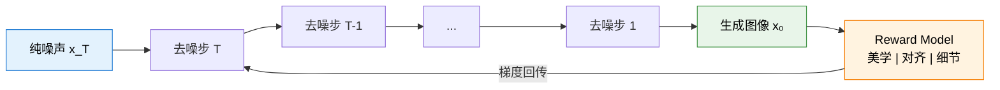

# 11.4 视觉生成模型的 RL 后训练

前三节我们一直在讨论 VLM 的**理解**侧——模型看一张图，回答关于图片的问题。RL 的作用是让它"看得更准、答得更好"。但视觉 AI 还有另一半：**生成**侧——给模型一段文字描述，让它生成对应的图像或视频。Stable Diffusion、DALL-E、Sora、Kling 都在做这件事。

问题来了：理解侧的 RL 天然有"可验证奖励"（答案对不对一眼就知道），但生成侧的奖励怎么定？一张图"好不好"没有标准答案——美学见仁见智，细节对不对需要专业知识，文字和画面的匹配程度也不是简单的对错判断。这让视觉生成的 RL 后训练成为一个独特且重要的挑战。

## 理解 RL vs 生成 RL：为什么不能直接复用？

你可能会想：第 8 章的 GRPO 用可验证奖励训练推理，第 11.1 节的 VLM GRPO 用规则奖励训练视觉理解，生成侧是不是也类似？答案是**不完全是**，原因有三：

| 维度            | 理解侧 RL（前几节）        | 生成侧 RL（本节）                          |
| --------------- | -------------------------- | ------------------------------------------ |
| **输出空间**    | 离散文本 token             | 连续 latent / 高维像素                     |
| **奖励来源**    | 答案正确性（可验证）       | 视觉质量 + 文本对齐 + 细节准确性（多维度） |
| **RLVR 适用性** | 天然适用（答案对错可判断） | 不直接适用（"画得对不对"没有二元标准）     |
| **训练稳定性**  | 相对稳定                   | 更难控制（高维输出 + 连续梯度）            |

最核心的区别是**动作空间的维度**。理解侧模型每步只选一个 token（词表大小几万），生成侧的 Diffusion 模型每步要预测整个 latent（维度是 $h \times w \times c$，通常几万到几十万）。这意味着策略梯度的方差天然更大，训练更不稳定。

## Diffusion Model 的 RL 后训练

### DDPO：策略梯度直接优化 Diffusion

DDPO（Denoising Diffusion Policy Optimization）是把 Diffusion 采样过程当作一个 MDP 来做 RL 的代表性方法。

**核心思路**：Diffusion 模型的去噪过程本身就是一系列"动作"——每一步从噪声中去掉一点点，逐步生成清晰图像。把每一步去噪看作一个"动作"，整个去噪链路就是一个 episode：

$$\underbrace{x_T}_{\text{纯噪声}} \xrightarrow{a_T} x_{T-1} \xrightarrow{a_{T-1}} \cdots \xrightarrow{a_1} \underbrace{x_0}_{\text{生成图像}}$$

其中动作 $a_t = \epsilon_\theta(x_t, t)$ 是模型预测的噪声。每一步"去噪"就是一个 action，最终生成的图像 $x_0$ 获得 reward $r(x_0, \text{prompt})$。

DDPO 的策略梯度就是标准的 REINFORCE（回顾第 5 章），只是动作空间从离散 token 变成了连续的噪声预测：

$$\nabla_\theta J = \mathbb{E}\left[\sum_{t=1}^{T} \nabla_\theta \log p_\theta(a_t | x_t) \cdot r(x_0, \text{prompt})\right]$$

这个公式和第 5 章的策略梯度公式在形式上完全一致——只是把"生成 token"换成了"预测去噪"。最终的 reward（图像质量）通过整条去噪链路回传到每一步。

**DDPO 的挑战**：去噪步数通常有 20-50 步，episode 很长，reward 信号要经过很多步才能回传。这和第 9 章 Agentic RL 中的"长 horizon 信用分配"问题类似——reward 信号在长链路中被稀释。实践中需要配合 reward shaping 或者过程奖励来缓解。

### Reward-Guided Sampling：不改模型，改采样

另一种思路是**不修改 Diffusion 模型的权重**，而是在采样过程中用 reward model 来引导去噪方向。每次去噪后，reward model 评估当前中间结果的质量，选择"奖励更高"的去噪方向。

这种方法的好处是**不需要 RL 训练**——没有策略梯度的方差问题，也没有训练不稳定的风险。缺点是推理时需要额外的前向传播来评估 reward，速度较慢；而且不改模型意味着每次生成都要重新引导，无法"固化"学到的好策略。

## 视觉生成的 Reward Model

RL 训练的质量直接取决于 reward model 的质量。视觉生成的 reward 通常包含多个维度：

### 维度一：文本-图像对齐（Text-Image Alignment）

生成的图像是否符合文字描述？这是最基础的要求。常用指标：

- **CLIP Score**：用 CLIP 模型计算文本和图像的语义相似度。优点是自动化、快速；缺点是 CLIP 本身的偏好可能和人类判断不一致。
- **细粒度属性匹配**：描述说"一只戴红色帽子的猫"，模型不仅要画出猫，帽子还得是红色。这比整体 CLIP Score 更细粒度——需要拆解描述中的每个属性逐一验证。

细粒度属性匹配正是 JD 中"细粒度 caption"的核心应用场景：先用一个细粒度 caption 模型把图像的每个细节（颜色、位置、大小、数量）描述出来，再和原始 prompt 逐项对比，生成细粒度的 reward 信号。

### 维度二：视觉质量（Visual Quality）

图像的"好看程度"——构图、光影、清晰度、色彩搭配。常用指标：

- **Aesthetic Score**：在大量人工标注的"美学评分"数据上训练的分类/回归模型。简单有效，但偏向主流审美。
- **FID（Fréchet Inception Distance）**：衡量生成图像分布和真实图像分布的距离。通常用于评估整体生成质量，不适合作为单张图像的 reward。
- **NIQE / BRISQUE**：无参考的图像质量评估，不需要"参考图像"就能打分。

### 维度三：指令遵循（Instruction Following）

用户可能给出复杂的多约束指令："画一只猫，戴着红色帽子，坐在蓝色沙发上，背景是窗外下雨的城市夜景"。模型需要同时满足所有约束。

这和第 9 章 Agentic RL 中的"多轮指令遵循"有相似之处——都是多约束下的策略学习。区别在于 Agentic RL 的动作是文本/工具调用（离散），视觉生成的动作是像素/latent（连续）。

### 多维度 Reward 的融合

实际训练中通常将多个维度的 reward 加权组合：

$$R_{\text{total}} = w_1 \cdot R_{\text{align}} + w_2 \cdot R_{\text{quality}} + w_3 \cdot R_{\text{instruction}}$$

但第 7 章和第 9 章都讨论过：**多组件 reward 容易导致 reward hacking**。Bespoke Labs 的经验（9.4 节）是"reward 越简单越好"。视觉生成也有类似问题——模型可能学会"讨好"美学评分但牺牲文本对齐（生成很好看但和描述无关的图），或者反过来。

实践中一个有效的策略是：**用最简单的二值信号作为主 reward，用其他维度做过滤**。例如主 reward 是"生成的图是否通过了所有属性检查"（二值），美学评分只用作负样本过滤（低于阈值的直接丢弃，不给负 reward）。

## 视频生成的 RL

视频生成比图像生成多了一个维度：**时序一致性**。一段 5 秒的视频可能有 120 帧，每一帧都要和前后帧连贯，同时整体要符合文字描述。

### 视频生成 RL 的独特挑战

| 挑战              | 描述                                                | 缓解方案                                  |
| ----------------- | --------------------------------------------------- | ----------------------------------------- |
| **时序一致性**    | 相邻帧之间的物体/场景不能突变                       | 时序一致性 reward（光流一致性、帧间差异） |
| **长 horizon**    | 视频的 token 数远超图像                             | 分段优化 + 时间维度的 reward shaping      |
| **计算成本**      | 视频的 latent 维度是 $T \times H \times W \times C$ | latent 空间做 RL，不在像素空间            |
| **文本-视频对齐** | 文字描述可能涉及时序（"先...然后..."）              | 分段 caption + 逐段对齐 reward            |

### 视频生成的 Reward

视频的 reward 需要在图像 reward 的基础上增加时序维度：

- **帧级 reward**：对每一帧（或每隔几帧）计算文本-图像对齐和视觉质量
- **片段级 reward**：评估一个短片段的连贯性和动态质量
- **整体 reward**：评估整段视频是否完整地表达了文字描述的内容

$$R_{\text{video}} = \alpha \cdot \frac{1}{T}\sum_t R_{\text{frame}}(x_t) + \beta \cdot \frac{1}{T-1}\sum_t R_{\text{temporal}}(x_t, x_{t+1}) + \gamma \cdot R_{\text{overall}}(\{x_t\}, \text{prompt})$$

## On-Policy 蒸馏：把 RL 学到的能力"压缩"

RL 训练后的生成模型通常比原始模型更"聪明"（更懂用户意图、生成质量更高），但也可能更慢——因为 RL 过程中模型可能学到了更复杂的采样策略。On-policy 蒸馏（On-Policy Distillation）的目标是：**把 RL 训练后的大模型的能力，蒸馏到一个更小、更快的模型中**。

具体流程：

1. **Teacher**：RL 训练后的大模型（如 8B 参数的 Diffusion 模型）
2. **Student**：更小的模型（如 1B 参数）
3. Student 从 Teacher 的输出中学习——不是简单地模仿 Teacher 的去噪过程，而是学习 Teacher 在 RL 后获得的"好品味"

这和第 8 章讨论的蒸馏思想一致——用强模型的输出作为弱模型的训练信号。区别在于视觉生成的蒸馏需要在 latent 空间进行，而不是 token 空间。

## 与前面章节的联系

| 前面章节                         | 在视觉生成 RL 中的对应                               |
| -------------------------------- | ---------------------------------------------------- |
| REINFORCE 策略梯度（第 5 章）    | DDPO 的核心算法——把去噪过程当作策略                  |
| Reward Hacking（第 7 章）       | 生成侧的 hacking：讨好美学但牺牲对齐                 |
| 多组件 reward 的教训（9.5 节）  | 视觉生成的多维度 reward 同样容易导致 hacking         |
| RLVR（第 8 章）                  | 生成侧的"可验证性"：细粒度属性可以逐项检查           |
| VLM 理解 RL（10.1-10.3 节）      | 理解和生成是视觉 AI 的两面——一个学"看"，一个学"画"   |
| Agentic RL 长 horizon（9.1 节） | Diffusion 的 20-50 步去噪也是长 horizon 信用分配问题 |

一个值得注意的联系是：**VLM 理解 RL 和视觉生成 RL 可以形成闭环**。VLM 理解模型（第 10.1-10.3 节）可以作为视觉生成的 reward model——它已经学会了"看懂图片"，自然能判断"生成的图和描述是否匹配"。反过来，视觉生成模型生成的数据也可以用来增强 VLM 的训练——形成类似于 VisPlay（11.3 节）的协同进化循环。

## 小结

视觉生成的 RL 后训练是"教 AI 画画"的关键一步——不只让它画得出来，还要画得准、画得好、画得符合预期。核心要点：

1. **生成 RL ≠ 理解 RL**：连续高维输出、多维度 reward、无二元标准，决定了不能简单复用理解侧的 RL 方案。
2. **Reward 设计是核心**：文本-图像对齐、视觉质量、指令遵循三个维度需要权衡。简化 reward、避免 hacking 是关键。
3. **Diffusion 去噪 = MDP**：把去噪过程建模为策略，用 REINFORCE/PPO 优化，是当前最主流的生成 RL 方案。
4. **理解和生成可以协同**：VLM 做 reward model，生成模型做数据增强，形成闭环进化。

---

到这里，我们覆盖了 VLM 的理解和生成两个方向的 RL 训练。下一章，我们将进入 RL 最令人兴奋的前沿——[Agentic RL：工具调用、多轮交互与智能体训练](../chapter12_agentic_rl/intro)。

## 参考资料

- Black K, Janner M, Du Y, et al. "[Training Diffusion Models with Reinforcement Learning](https://arxiv.org/abs/2305.13301)." ICLR 2024. —— DDPO，把 Diffusion 去噪过程建模为 MDP，用策略梯度优化。首次证明 RL 可以显著提升 Diffusion 模型的指令遵循能力。
- Fan Y, Watkins O, Du Y, et al. "[DPOK: Reinforcement Learning for Fine-tuning Text-to-Image Diffusion Models](https://arxiv.org/abs/2305.16381)." NeurIPS 2023. —— 将策略优化与 KL 正则化结合，在线 RL 微调文本到图像扩散模型。
- Clark K, et al. "[Directly Fine-Tuning Diffusion Models on Differentiable Rewards](https://arxiv.org/abs/2309.17400)." ICLR 2024. —— 用可微 reward 直接微调 Diffusion 模型，无需 RL。
- Prabhudesai M, et al. "[Aligning Text-to-Image Diffusion Models with Reward Backpropagation](https://arxiv.org/abs/2407.08737)." 2024. —— 通过 reward 反向传播来对齐 Diffusion 模型。（注：初版 arXiv:2310.03739 已被作者撤回，此处引用更新版。）
- Wu X, et al. "[Human Preference Score v2: A Benchmark for Evaluating Human Preferences of Text-to-Image Synthesis](https://arxiv.org/abs/2306.09341)." NeurIPS 2023. —— HPS v2，大规模人类偏好评分数据集和 reward model。
- Kirstain S, et al. "[Pick-a-Pic: Open Dataset of Human Preferences for Text-to-Image Generation](https://arxiv.org/abs/2305.01569)." NeurIPS 2023. —— 人类对生成图像的偏好数据集，用于训练 reward model。
- Girdhar R, et al. "[Emu Video: Factorizing Text-to-Video Generation by Explicit Image Conditioning](https://arxiv.org/abs/2311.10709)." ECCV 2024. —— 视频生成模型，涉及视频质量的多维度评估。
- Wu X, et al. "[Boosting Text-to-Video Generative Model with MLLMs Feedback](https://neurips.cc/virtual/2024/poster/96722)." NeurIPS 2024. —— 用多模态 LLM 反馈作为 reward model，通过 RL 微调视频生成模型。
