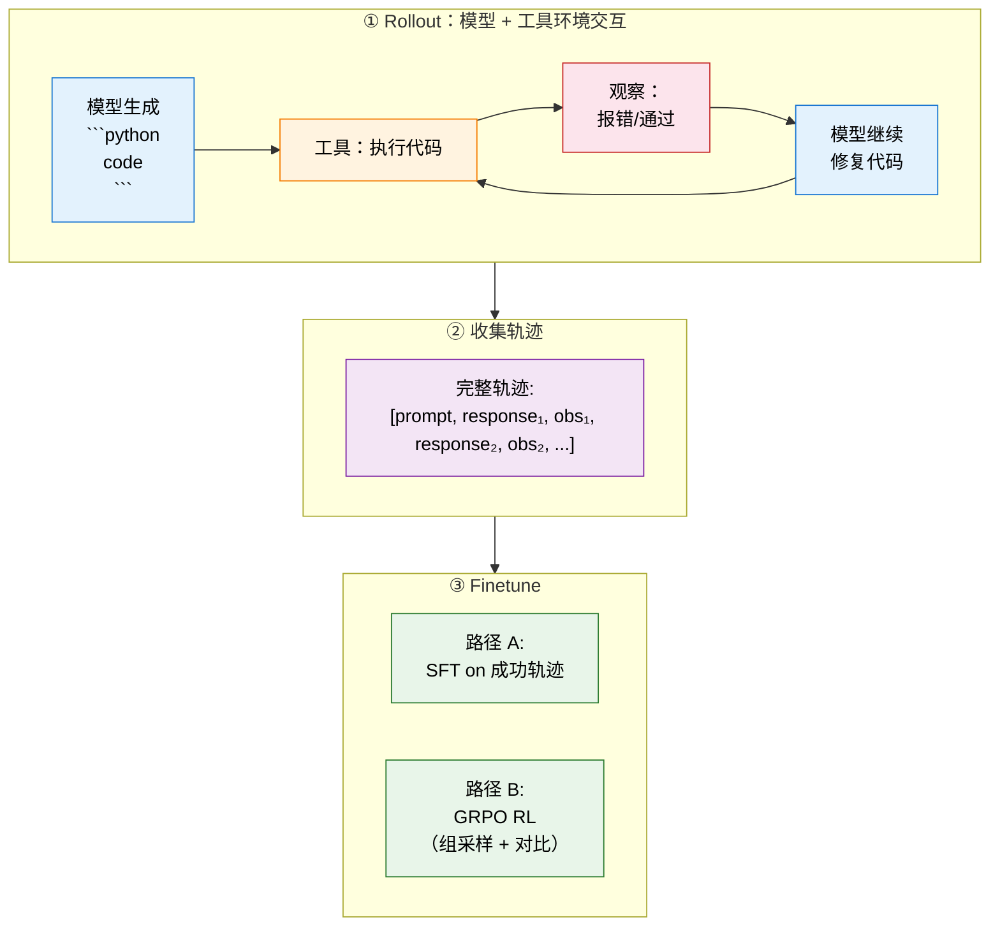

# 12.4 动手：端到端 Agentic RL 训练——真实模型、真实 Benchmark、真实提升

前面的实验用模拟数据对比了 ORM 和 PRM。但那些轨迹是假的——没有真实的模型推理，没有真实的代码执行，也没有真实的梯度更新。这一节我们要做一件更硬核的事：**用真实的 Code LLM，构建真实的代码执行工具，模型自己写代码→执行→看报错→修复，用 rollout 出来的轨迹 finetune 模型，跑 HumanEval 看 pass@1 的真实提升。**

整个实验在一台 24GB 显存的 GPU（如 RTX 4090 / A5000）上即可完成。如果你没有 GPU，可以用 Google Colab 的免费 T4。

> 实验设计参考 SimpleTIR（ICLR 2026）、ReTool（字节跳动）和 Search-R1 的真实训练管线。它们的核心模式是一样的：模型生成工具调用 → 环境执行 → 结果追加到上下文 → 模型继续生成 → 收集完整轨迹 → 训练。



## 第零步：环境准备

```bash
pip install torch transformers accelerate datasets
pip install matplotlib numpy peft
```

我们使用 **Qwen2.5-Coder-1.5B-Instruct** 作为基座模型。1.5B 参数量在 24GB 显存上跑 GRPO（group_size=4）绰绰有余。

```python
# ==========================================
# 0. 全局配置
# ==========================================
import torch, numpy as np, random, re, os, subprocess, tempfile, warnings
warnings.filterwarnings("ignore")

SEED = 42
MODEL_NAME = "Qwen/Qwen2.5-Coder-1.5B-Instruct"
MAX_NEW_TOKENS = 512
GROUP_SIZE = 4
MAX_EPOCHS = 3
LR = 5e-6
KL_COEFF = 0.05

device = "cuda" if torch.cuda.is_available() else "cpu"
random.seed(SEED); np.random.seed(SEED); torch.manual_seed(SEED)
print(f"Device: {device}")
```

## 第一步：加载模型 + 代码执行沙箱 + HumanEval

```python
# ==========================================
# 1.1 加载模型
# ==========================================
from transformers import AutoModelForCausalLM, AutoTokenizer
from datasets import load_dataset

tokenizer = AutoTokenizer.from_pretrained(MODEL_NAME)
if tokenizer.pad_token is None:
    tokenizer.pad_token = tokenizer.eos_token

model = AutoModelForCausalLM.from_pretrained(
    MODEL_NAME,
    torch_dtype=torch.bfloat16 if torch.cuda.is_bf16_supported() else torch.float16,
    device_map="auto",
)
model.eval()
for p in model.parameters():
    p.requires_grad = False
print(f"Model: {MODEL_NAME} ({sum(p.numel() for p in model.parameters())/1e9:.2f}B)")

# ==========================================
# 1.2 加载 HumanEval
# ==========================================
humaneval = load_dataset("openai_humaneval", trust_remote_code=True)
problems = humaneval["test"]
print(f"HumanEval: {len(problems)} problems")

# ==========================================
# 1.3 代码执行沙箱（和 SimpleTIR 一样：写文件 → subprocess → 拿结果）
# ==========================================
def sandbox_execute(code: str, task_prompt: str, task_test: str,
                    entry_point: str, timeout: float = 10.0) -> dict:
    """
    在子进程中真实执行代码，返回 stdout/stderr。
    这就是 SimpleTIR 的 Sandbox Fusion 做的事——只不过我们用本地 subprocess。
    """
    full_code = task_prompt + code + "\n" + task_test + "\n"
    full_code += f"\ncheck({entry_point})\n"

    with tempfile.TemporaryDirectory() as tmpdir:
        path = os.path.join(tmpdir, "solution.py")
        with open(path, "w") as f:
            f.write(full_code)
        try:
            r = subprocess.run(["python", path], capture_output=True, text=True,
                               timeout=timeout, cwd=tmpdir)
            passed = r.returncode == 0
            error = None if passed else (r.stderr.strip().split("\n")[-1] if r.stderr else "unknown")
            return {"passed": passed, "error": error, "stdout": r.stdout.strip()[:200]}
        except subprocess.TimeoutExpired:
            return {"passed": False, "error": "TIMEOUT", "stdout": ""}


def batch_evaluate(tasks, completions):
    results = [sandbox_execute(c, t["prompt"], t["test"], t["entry_point"]) for t, c in zip(tasks, completions)]
    passed = sum(1 for r in results if r["passed"])
    return {"pass@1": passed / len(results), "passed": passed, "total": len(results), "details": results}
```

## 第二步：基线评测——训练前模型的真实水平

先跑一遍 HumanEval（单轮补全，不调工具），记录基线。

```python
# ==========================================
# 2. 基线评测（单轮补全，无工具调用）
# ==========================================
BASELINE_N = 64
baseline_tasks = list(problems.select(range(BASELINE_N)))

def generate_single_turn(task, temperature=0.0):
    messages = [{"role": "user", "content": f"Complete this function. Output ONLY the function body:\n\n{task['prompt']}"}]
    text = tokenizer.apply_chat_template(messages, tokenize=False, add_generation_prompt=True)
    inputs = tokenizer(text, return_tensors="pt").to(device)
    with torch.no_grad():
        out = model.generate(**inputs, max_new_tokens=MAX_NEW_TOKENS,
                             temperature=temperature, do_sample=temperature>0,
                             pad_token_id=tokenizer.pad_token_id)
    return tokenizer.decode(out[0][inputs["input_ids"].shape[1]:], skip_special_tokens=True).strip()

print(f"Baseline evaluation on {BASELINE_N} HumanEval problems...")
baseline_completions = []
for i, task in enumerate(baseline_tasks):
    comp = generate_single_turn(task)
    res = sandbox_execute(comp, task["prompt"], task["test"], task["entry_point"])
    baseline_completions.append(comp)
    if (i+1) % 16 == 0:
        so_far = sum(1 for c in baseline_completions[:i+1]
                     if sandbox_execute(c, baseline_tasks[baseline_completions.index(c)]["prompt"],
                                       baseline_tasks[baseline_completions.index(c)]["test"],
                                       baseline_tasks[baseline_completions.index(c)]["entry_point"])["passed"])

# 更高效的基线计算
baseline_metrics = batch_evaluate(baseline_tasks, baseline_completions)
print(f"Baseline pass@1: {baseline_metrics['pass@1']:.1%} ({baseline_metrics['passed']}/{baseline_metrics['total']})")
```

## 第三步：Agent Rollout——模型生成代码，沙箱执行，观察结果，继续生成

### 3.1 Rollout 的核心问题

从 Search-R1 和 ReTool 的源码中提取的关键 insight：

**问题 1：每轮重新 encode 整个对话。** 我们之前的实现在每轮都调用 `apply_chat_template` 重新编码整个对话历史。Search-R1 的 `run_llm_loop` 不是这样做的——它维护一个 `rolling_state`，每轮只**增量拼接**新的 token（response + observation），不重新编码。重新编码会导致 tokenization drift。

**问题 2：生成不截断。** 之前模型每轮生成完整 `max_new_tokens`，然后事后从中提取代码块。Search-R1 在 `</search>` 处截断，ReTool 在 ` ``` ` 处截断。截断让 action 边界更干净。

**问题 3：info_mask 事后构建。** 之前用 diff 文本的方式事后构建 mask，脆弱且不精确。Search-R1 在 rollout 过程中**增量构建**两个平行张量——真实 token 和 masked token。

### 3.2 修正后的实现

```python
# ==========================================
# 3.2 Agent Rollout：token 级增量拼接
# ==========================================

CODE_PATTERN = re.compile(r'```(?:python|py)?\n(.*?)\n```', re.DOTALL)
PAD_ID = tokenizer.pad_token_id

def ensure_print(code: str) -> str:
    """自动给最后一行补 print()，确保沙箱输出结果"""
    lines = code.strip().split("\n")
    for i in range(len(lines) - 1, -1, -1):
        if lines[i].strip() and not lines[i].strip().startswith("print"):
            lines[i] = f"print({lines[i]})"
            break
    return "\n".join(lines)

def run_agent_rollout(task, temperature=0.7, max_turns=3, verbose=False):
    """
    多轮 Agent Rollout。

    关键修正（基于 Search-R1/ReTool 源码 insight）：
    1. token 级增量拼接，不每轮重新 encode 整个对话
    2. 在 ``` 代码块边界截断生成
    3. rollout 过程中增量构建 input_ids 和 info_mask
    """
    # 初始 prompt → token
    init_messages = [
        {"role": "system", "content": AGENT_PROMPT},
        {"role": "user", "content": f"Implement this function:\n\n{task['prompt']}"},
    ]
    prompt_text = tokenizer.apply_chat_template(init_messages, tokenize=False, add_generation_prompt=True)
    prompt_ids = tokenizer.encode(prompt_text, add_special_tokens=False)

    # 增量构建：real = 真实 token, masked = 工具 token 替换为 pad
    real_ids = list(prompt_ids)
    masked_ids = list(prompt_ids)  # prompt 部分：两个张量相同

    current_code = ""
    passed = False
    is_valid = True

    for turn_idx in range(max_turns):
        # --- 模型生成（从 rolling state） ---
        input_t = torch.tensor([real_ids], dtype=torch.long).to(device)
        attn_t = torch.ones_like(input_t)

        with torch.no_grad():
            out = model.generate(input_ids=input_t, attention_mask=attn_t,
                                 max_new_tokens=MAX_NEW_TOKENS,
                                 temperature=temperature, do_sample=temperature>0,
                                 top_p=0.95, pad_token_id=PAD_ID)

        gen_ids = out[0][input_t.shape[1]:].tolist()
        response_text = tokenizer.decode(gen_ids, skip_special_tokens=True)

        # --- 截断：在第一个代码块结尾处截断 ---
        # 模型可能生成 ```python ... ``` 之后再生成更多文本，
        # 我们只取到代码块结束，让 observation 更干净
        truncated_text = response_text
        code_end = response_text.find('```\n')
        if code_end != -1 and '```python' in response_text[:code_end]:
            # 找到代码块结束位置，截取到那里 + ```
            end_pos = code_end + 4  # len('```\n')
            truncated_text = response_text[:end_pos]
            gen_ids = tokenizer.encode(truncated_text, add_special_tokens=False)

        # 追加 assistant 生成的 token（real 和 masked 相同——都是 LLM 生成的）
        real_ids.extend(gen_ids)
        masked_ids.extend(gen_ids)

        # --- 提取代码块并执行 ---
        code_blocks = CODE_PATTERN.findall(truncated_text)

        if not code_blocks:
            is_valid = False
            current_code = response_text
            break

        current_code = ensure_print(code_blocks[-1].strip())
        exec_result = sandbox_execute(current_code, task["prompt"], task["test"], task["entry_point"])

        if verbose:
            status = "PASS" if exec_result["passed"] else f"FAIL: {exec_result['error'][:50]}"
            print(f"  Turn {turn_idx+1}: {status}")

        # --- 构造 observation token ---
        if exec_result["passed"]:
            obs_text = f"\n<output>\nALL TESTS PASSED\n</output>\nOutput your final implementation.\n"
        else:
            obs_text = f"\n<output>\nFAILED: {exec_result['error']}\n</output>\nFix the code and try again.\n"

        obs_ids = tokenizer.encode(obs_text, add_special_tokens=False)

        # 追加 observation token：
        # real_ids: 真实的 observation token（训练时模型看到）
        # masked_ids: 全部替换为 PAD_ID（训练时不算 loss）
        real_ids.extend(obs_ids)
        masked_ids.extend([PAD_ID] * len(obs_ids))

        if exec_result["passed"]:
            passed = True
            # 再生成一轮最终代码
            input_t = torch.tensor([real_ids], dtype=torch.long).to(device)
            attn_t = torch.ones_like(input_t)
            with torch.no_grad():
                out = model.generate(input_ids=input_t, attention_mask=attn_t,
                                     max_new_tokens=MAX_NEW_TOKENS,
                                     temperature=temperature, do_sample=temperature>0,
                                     pad_token_id=PAD_ID)
            final_gen = out[0][input_t.shape[1]:].tolist()
            real_ids.extend(final_gen)
            masked_ids.extend(final_gen)

            final_text = tokenizer.decode(final_gen, skip_special_tokens=True)
            final_blocks = CODE_PATTERN.findall(final_text)
            if final_blocks:
                current_code = final_blocks[-1].strip()
            break

    # 最终验证
    if current_code:
        final_check = sandbox_execute(current_code, task["prompt"], task["test"], task["entry_point"])
        passed = final_check["passed"]
    else:
        passed = False

    # 构建 info_mask（和 Search-R1 的 create_attention_mask(masked_ids) 一样）
    ids_tensor = torch.tensor([real_ids], dtype=torch.long)
    masked_tensor = torch.tensor([masked_ids], dtype=torch.long)
    info_mask = (masked_tensor != PAD_ID).long()
    labels = ids_tensor.clone()
    labels[info_mask == 0] = -100

    return {
        "input_ids": ids_tensor,
        "attention_mask": torch.ones_like(ids_tensor),
        "labels": labels,
        "info_mask": info_mask,
        "completion": current_code,
        "passed": passed,
        "is_valid": is_valid,
        "turns": turn_idx + 1 if current_code else 0,
    }
```

### 3.3 验证 Rollout

```python
# 快速验证
print("Sanity check — Agent Rollout:")
print("-" * 60)
for i in [0, 5, 10]:
    task = problems[i]
    result = run_agent_rollout(task, temperature=0.3, verbose=True)
    n_assist = result["info_mask"].sum().item()
    n_tool = (result["info_mask"] == 0).sum().item()
    print(f"  {task['task_id']}: {'PASS' if result['passed'] else 'FAIL'} "
          f"(turns: {result['turns']}, LLM tokens: {n_assist}, tool tokens: {n_tool})")
print("-" * 60)
```

### 4.1 批量 Rollout 收集轨迹

```python
# ==========================================
# 4.1 批量 Rollout：对训练集的每道题跑 agent loop
# ==========================================
TRAIN_IDS = list(range(64, 96))  # HumanEval #64-#95（避开评测集）
train_tasks = list(problems.select(TRAIN_IDS))

print(f"Collecting agent rollouts on {len(train_tasks)} tasks...")
print(f"Each task: {GROUP_SIZE} trajectories (group_size for GRPO)")
print("=" * 60)

all_trajectories = []  # 存储所有轨迹

for task_idx, task in enumerate(train_tasks):
    for g in range(GROUP_SIZE):
        result = run_agent_rollout(task, temperature=0.7, max_turns=3)
        result["task"] = task
        all_trajectories.append(result)

    if (task_idx + 1) % 8 == 0:
        passed = sum(1 for t in all_trajectories if t["passed"])
        print(f"  Task {task_idx+1}/{len(train_tasks)} | "
              f"Rollouts: {len(all_trajectories)} | "
              f"Passed: {passed} ({passed/len(all_trajectories):.1%})")

print(f"\nTotal trajectories: {len(all_trajectories)}")
print(f"Passed: {sum(1 for t in all_trajectories if t['passed'])}")
print(f"Avg turns: {np.mean([t['turns'] for t in all_trajectories]):.1f}")
```

## 第五步：两条 Finetune 路径

收集到轨迹后，有两条路可以走：

- **路径 A：Rejection Sampling + SFT**——只保留成功轨迹，做监督微调。最简单，效果稳定。
- **路径 B：GRPO RL**——组内比较，策略梯度更新。更高级，能从失败轨迹中学到东西。

### 路径 A：SFT on 成功轨迹（参考 ReTool 的冷启动阶段）

```python
# ==========================================
# 5A. SFT Finetune：只保留成功的 rollout 轨迹
#     参考 ReTool 第一阶段 + Search-R1 的拒绝采样
# ==========================================
from peft import LoraConfig, get_peft_model, TaskType
from torch.optim import AdamW

# 过滤：只保留通过测试的轨迹
success_trajs = [t for t in all_trajectories if t["passed"]]
print(f"成功轨迹: {len(success_trajs)}/{len(all_trajectories)} "
      f"({len(success_trajs)/len(all_trajectories):.1%})")

if len(success_trajs) == 0:
    print("没有成功轨迹！需要调整模型或温度。跳过 SFT。")
else:
    # ★ SimpleTIR 的 void turn 过滤：丢弃 is_valid=False 的轨迹
    valid_trajs = [t for t in success_trajs if t.get("is_valid", True)]
    print(f"Void turn 过滤: {len(success_trajs)} → {len(valid_trajs)} (丢弃 {len(success_trajs)-len(valid_trajs)} 条无效轨迹)")
    if len(valid_trajs) == 0:
        valid_trajs = success_trajs  # fallback
else:
    # 设置 LoRA
    model.enable_input_require_grads()
    model_sft = get_peft_model(model, LoraConfig(
        task_type=TaskType.CAUSAL_LM, r=16, lora_alpha=32,
        lora_dropout=0.05, target_modules=["q_proj", "v_proj"],
    ))
    model_sft.train()
    optimizer = AdamW(filter(lambda p: p.requires_grad, model_sft.parameters()), lr=LR)

    print(f"\nSFT Training on {len(valid_trajs)} successful trajectories...")
    print(f"Trainable params: {sum(p.numel() for p in model_sft.parameters() if p.requires_grad)/1e6:.1f}M")

    for epoch in range(MAX_EPOCHS):
        random.shuffle(valid_trajs)
        total_loss = 0

        for traj in valid_trajs:
            # rollout 已经构建好了 input_ids / labels / info_mask，直接用
            input_ids = traj["input_ids"].to(device)
            attention_mask = traj["attention_mask"].to(device)
            labels = traj["labels"].to(device)

            if (labels != -100).sum() == 0:
                continue  # 跳过没有 assistant token 的轨迹

            outputs = model_sft(input_ids=input_ids, attention_mask=attention_mask, labels=labels)
            loss = outputs.loss

            optimizer.zero_grad()
            loss.backward()
            torch.nn.utils.clip_grad_norm_(model_sft.parameters(), 1.0)
            optimizer.step()
            total_loss += loss.item()

        avg_loss = total_loss / len(valid_trajs)
        print(f"  SFT Epoch {epoch+1}/{MAX_EPOCHS} | Avg Loss: {avg_loss:.4f}")

    model_sft.eval()
    print("SFT training complete.")
```

### 路径 B：GRPO RL（参考 SimpleTIR / DeepSWE）

```python
# ==========================================
# 5B. GRPO RL Finetune：组采样 → 组内比较 → 策略梯度
#     参考 SimpleTIR 的 GRPO+DAPO 和 Search-R1 的 token masking
# ==========================================

# 重新加载模型（SFT 和 RL 用不同的模型实例）
model_rl = AutoModelForCausalLM.from_pretrained(
    MODEL_NAME,
    torch_dtype=torch.bfloat16 if torch.cuda.is_bf16_supported() else torch.float16,
    device_map="auto",
)
model_rl.enable_input_require_grads()
model_rl = get_peft_model(model_rl, LoraConfig(
    task_type=TaskType.CAUSAL_LM, r=16, lora_alpha=32,
    lora_dropout=0.05, target_modules=["q_proj", "v_proj"],
))

# Reference model（KL 约束）
ref_model = AutoModelForCausalLM.from_pretrained(
    MODEL_NAME,
    torch_dtype=torch.bfloat16 if torch.cuda.is_bf16_supported() else torch.float16,
    device_map="auto",
)
ref_model.eval()
for p in ref_model.parameters():
    p.requires_grad = False

optimizer_rl = AdamW(filter(lambda p: p.requires_grad, model_rl.parameters()), lr=LR)

training_log = {"epoch": [], "success_rate": [], "mean_reward": [], "loss": []}

print("=" * 60)
print("GRPO RL Training (Multi-Turn Agent Rollout)")
print("=" * 60)

for epoch in range(MAX_EPOCHS):
    model_rl.train()
    epoch_rewards, epoch_losses = [], []
    epoch_successes = 0
    random.shuffle(train_tasks)

    for task_idx, task in enumerate(train_tasks):
        # ---- Phase 1: On-Policy Rollout (GROUP_SIZE 条轨迹) ----
        trajectories = []
        for g in range(GROUP_SIZE):
            result = run_agent_rollout(task, temperature=0.7, max_turns=3)
            result["task"] = task
            # Reward 设计（参考 ReTool retool.py + Search-R1 qa_em.py）：
            # 1. Outcome reward：二元 0/1
            base_reward = 1.0 if result["passed"] else 0.0
            # 2. ★ ReTool 的 tool-call shaping：答错时鼓励多调工具
            if base_reward == 0 and result["turns"] > 1:
                tool_bonus = (result["turns"] - 2) / 2 * 0.1
                base_reward = max(-0.6, tool_bonus)
            result["reward"] = base_reward
            trajectories.append(result)

        # ---- Phase 2: GRPO Advantage ----
        rewards = np.array([t["reward"] for t in trajectories])
        mean_r, std_r = rewards.mean(), rewards.std() + 1e-8
        advantages = (rewards - mean_r) / std_r

        # ---- Phase 3: 策略梯度更新 ----
        for traj, advantage in zip(trajectories, advantages):
            if not traj["completion"]:
                continue

            input_ids = traj["input_ids"].to(device)
            attention_mask = traj["attention_mask"].to(device)
            labels = traj["labels"].to(device)
            info_mask = traj["info_mask"].to(device)

            if (info_mask == 1).sum() == 0:
                continue

            # Policy log prob（用 info_mask 而不是 labels=-100）
            outputs = model_rl(input_ids=input_ids, attention_mask=attention_mask, labels=labels)
            policy_lp = -outputs.loss

            # Reference log prob（KL）
            with torch.no_grad():
                ref_out = ref_model(input_ids=input_ids, attention_mask=attention_mask, labels=labels)
                ref_lp = -ref_out.loss

            # GRPO loss
            kl = policy_lp - ref_lp
            loss = -advantage * policy_lp + KL_COEFF * kl

            optimizer_rl.zero_grad()
            loss.backward()
            torch.nn.utils.clip_grad_norm_(model_rl.parameters(), 1.0)
            optimizer_rl.step()
            epoch_losses.append(loss.item())

        epoch_rewards.extend(rewards.tolist())
        epoch_successes += sum(1 for t in trajectories if t["passed"])

        if (task_idx + 1) % 8 == 0:
            sr = epoch_successes / ((task_idx+1) * GROUP_SIZE)
            print(f"  Epoch {epoch+1} | Task {task_idx+1}/{len(train_tasks)} | SR: {sr:.1%}")

    # Epoch summary
    sr = epoch_successes / (len(train_tasks) * GROUP_SIZE)
    training_log["epoch"].append(epoch+1)
    training_log["success_rate"].append(sr)
    training_log["mean_reward"].append(np.mean(epoch_rewards))
    training_log["loss"].append(np.mean(epoch_losses) if epoch_losses else 0)
    print(f"  Epoch {epoch+1} Summary: SR={sr:.1%}, Reward={np.mean(epoch_rewards):.3f}, "
          f"Loss={training_log['loss'][-1]:.4f}")

model_rl.eval()
```

## 第六步：Benchmark 评测——真的提升了吗？

**不管训练过程多么花哨，只有独立 Benchmark 上的 pass@1 才是唯一裁判。**

```python
# ==========================================
# 6. 训练后 Benchmark 评测
# ==========================================

def evaluate_model(model_to_eval, tasks, label="Model"):
    """用 greedy decoding 评测模型在 HumanEval 上的 pass@1"""
    model_to_eval.eval()
    completions = []
    for i, task in enumerate(tasks):
        messages = [{"role": "user", "content": f"Complete this function. Output ONLY the function body:\n\n{task['prompt']}"}]
        text = tokenizer.apply_chat_template(messages, tokenize=False, add_generation_prompt=True)
        inputs = tokenizer(text, return_tensors="pt").to(device)
        with torch.no_grad():
            out = model_to_eval.generate(**inputs, max_new_tokens=MAX_NEW_TOKENS,
                                          temperature=0.0, pad_token_id=tokenizer.pad_token_id)
        comp = tokenizer.decode(out[0][inputs["input_ids"].shape[1]:], skip_special_tokens=True).strip()
        completions.append(comp)
        if (i+1) % 16 == 0:
            passed_so_far = sum(1 for c, t in zip(completions, tasks[:i+1])
                               if sandbox_execute(c, t["prompt"], t["test"], t["entry_point"])["passed"])
            print(f"  [{label}] {i+1}/{len(tasks)} running pass@1: {passed_so_far/(i+1):.1%}")

    metrics = batch_evaluate(tasks, completions)
    print(f"  [{label}] Final pass@1: {metrics['pass@1']:.1%} ({metrics['passed']}/{metrics['total']})")
    return metrics

print("=" * 60)
print("POST-TRAINING Evaluation")
print("=" * 60)

# 评测 SFT 模型
if len(success_trajs) > 0:
    sft_metrics = evaluate_model(model_sft, baseline_tasks, "SFT")
else:
    sft_metrics = baseline_metrics

# 评测 GRPO 模型
rl_metrics = evaluate_model(model_rl, baseline_tasks, "GRPO-RL")

# 对比
print("\n" + "=" * 60)
print("FINAL COMPARISON")
print("=" * 60)
print(f"  Baseline (no training):  {baseline_metrics['pass@1']:.1%}")
print(f"  SFT (on success trajs):  {sft_metrics['pass@1']:.1%}  (Δ = {sft_metrics['pass@1'] - baseline_metrics['pass@1']:+.1%})")
print(f"  GRPO RL (on all trajs):  {rl_metrics['pass@1']:.1%}  (Δ = {rl_metrics['pass@1'] - baseline_metrics['pass@1']:+.1%})")
print("=" * 60)
```

### 可视化

```python
import matplotlib.pyplot as plt
import matplotlib
matplotlib.rcParams['font.sans-serif'] = ['Arial Unicode MS', 'SimHei', 'sans-serif']
matplotlib.rcParams['axes.unicode_minus'] = False

fig, axes = plt.subplots(1, 2, figsize=(14, 5))

# --- 左图：Benchmark 对比 ---
ax = axes[0]
methods = ['Baseline', 'SFT\n(success only)', 'GRPO RL\n(all trajs)']
pass_rates = [baseline_metrics["pass@1"], sft_metrics["pass@1"], rl_metrics["pass@1"]]
colors = ['#90a4ae', '#42a5f5', '#66bb6a']

bars = ax.bar(methods, pass_rates, color=colors, edgecolor=[c.replace('a', '')[:7] for c in colors], linewidth=2)
ax.set_ylabel('pass@1')
ax.set_title(f'HumanEval Benchmark (n={BASELINE_N})', fontweight='bold')
ax.set_ylim(0, max(pass_rates) * 1.3)

for bar, v in zip(bars, pass_rates):
    ax.text(bar.get_x() + bar.get_width()/2., v + 0.015,
            f'{v:.1%}', ha='center', fontsize=13, fontweight='bold')

# 标注最佳
best = np.argmax(pass_rates)
if pass_rates[best] > pass_rates[0]:
    ax.annotate(f'Best: +{pass_rates[best]-pass_rates[0]:.1%}',
                xy=(best, pass_rates[best]), xytext=(best, pass_rates[best]+0.08),
                fontsize=13, fontweight='bold', color='#2e7d32',
                arrowprops=dict(arrowstyle='->', color='#2e7d32', lw=2))

# --- 右图：GRPO 训练过程 ---
ax = axes[1]
epochs = training_log["epoch"]
ax.plot(epochs, training_log["success_rate"], 'o-', color='#388e3c', lw=2, label='Agent Success Rate')
ax.plot(epochs, training_log["mean_reward"], 's--', color='#1976d2', lw=2, label='Mean Reward')
ax.set_xlabel('Epoch')
ax.set_title('GRPO RL Training Progress', fontweight='bold')
ax.legend()
ax.grid(True, alpha=0.3)

plt.suptitle('Agentic RL: Real Model + Real Rollout + Real Benchmark', fontsize=14, fontweight='bold')
plt.tight_layout()
plt.savefig("agentic_rl_real_benchmark.png", dpi=150)
print("Saved: agentic_rl_real_benchmark.png")
```

## 参考：真正在做 Agentic RL 训练的开源项目

| 项目 | 工具环境 | Rollout 方式 | 训练方法 | 结果 | 代码 |
|------|---------|-------------|---------|------|------|
| **SimpleTIR** | 代码沙箱 | 模型写 ````python```` → 执行 → 看结果 | GRPO + void turn 过滤 | AIME 22→50, ICLR'26 | [GitHub](https://github.com/ltzheng/SimpleTIR) |
| **ReTool** | 代码解释器 | 推理中穿插代码块执行 | SFT 冷启动 → RL | AIME 67% | [GitHub](https://github.com/ReTool-RL/ReTool) |
| **Search-R1** | 搜索引擎 | 推理→`<search>`→搜索结果→继续 | PPO/GRPO + token mask | 多轮搜索RL标杆 | [GitHub](https://github.com/PeterGriffinJin/Search-R1) |
| **DeepSWE** | Docker + 测试套件 | 多步 agent 修 bug | GRPO++ | SWE-bench 42% | [GitHub](https://github.com/agentica-project/rllm) |
| **VerlTool** | 通用工具服务器 | 异步多轮交互 | GRPO | 多域 SOTA | [GitHub](https://github.com/TIGER-AI-Lab/verl-tool) |

## 实验总结

**核心管线**（所有项目共同遵循）：

1. **构建工具环境**（代码沙箱 / 搜索引擎 / Docker）
2. **模型与环境多轮 Rollout**：模型生成工具调用 → 环境执行 → 结果追加到上下文 → 模型继续生成
3. **收集完整轨迹**：`[prompt, assistant₁, observation₁, assistant₂, observation₂, ...]`
4. **Finetune**：
   - **路径 A（SFT）**：只保留成功轨迹，做监督微调。简单稳定。
   - **路径 B（GRPO RL）**：组采样 + 组内比较 + 策略梯度。能从失败中学习。
5. **独立 Benchmark 评测**：只有 pass@1 的变化才是真实的训练效果

**关键设计决策**：

- **Token mask**：工具执行结果的 token 不参与 loss（`labels = -100`），只有 assistant token 参与。这是 Search-R1 论文中实验证明有效的（有 mask: 0.431 vs 无 mask: 0.343）
- **Outcome reward**：只看最终测试是否通过（`passed = 0/1`），不需要每步给 reward。SimpleTIR 和 DeepSWE 都证实 outcome reward 足够
- **Code block 格式**：用 ```` ```python ``` ```` 而不是自定义 XML 标签。这是 SimpleTIR 和 ReTool 共同采用的模式，模型更容易学会

下一节我们聚焦 Agentic RL 的工程挑战——[怎么把这些想法变成一个真正能跑的训练系统](./agentic-engineering)。
