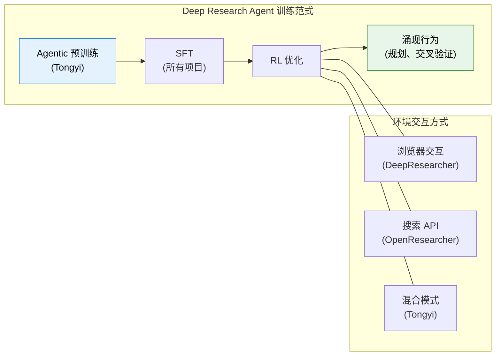
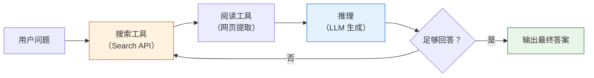

# 12.5 深度研究智能体：Deep Research Agent

前面几节我们讨论了多轮 RL 的信用分配、轨迹合成、以及 Web Agent / Code Agent 的工具调用训练。现在我们来看一个把这些技术**全部整合在一起**的前沿应用——Deep Research Agent（深度研究智能体）。它的目标是让 AI 像人类研究员一样，自主进行长程、多步的信息搜索、分析和综合，最终输出一份可信赖的研究报告。

2025-2026 年，Deep Research Agent 已经成为 Agentic RL 最热门的应用方向之一。本节将从全局认知、推理范式、核心系统、奖励设计、数据合成、评测体系六个层面展开。

## 什么是 Deep Research Agent？

Deep Research Agent 不是简单的"搜索 + 总结"。它需要解决一个根本问题：**如何让 AI 在真实、复杂的网络环境中，进行鲁棒、可信的深度研究？** 这意味着它要能规划搜索策略、交叉验证信息来源、处理动态网页内容、并在多步推理中保持逻辑连贯。

与上一节的 Web Agent 相比，Deep Research Agent 的核心区别在于：

| 维度     | Web Agent                      | Deep Research Agent                        |
| -------- | ------------------------------ | ------------------------------------------ |
| 任务目标 | 完成单一操作（订票、搜索商品） | 综合性研究（多源分析、交叉验证、报告生成） |
| 交互轮次 | 通常 3-10 轮                   | 通常 20-100+ 轮                            |
| 评估标准 | 任务成功/失败                  | 答案准确性 + 引用质量 + 逻辑严谨性         |
| 核心挑战 | 元素定位、动态页面             | 长程规划、信息综合、幻觉遏制               |

### 浏览器交互 vs 搜索 API：两种技术路径

Deep Research Agent 与网络交互的方式，主要分为两大流派：

**浏览器交互派**——让 AI 像人一样操作浏览器，处理动态加载的网页、点击按钮、填写表单。代表项目包括 DeepResearcher（在真实网络搜索环境中端到端 RL 训练）、WebAgent-R1（直接与网络环境在线交互）、Tongyi DeepResearch（采用"嵌套浏览器使用学习 NestBrowse"）。这类方法的优势是能获取动态、非结构化内容，但工程复杂度高、延迟大。

**搜索 API 派**——通过结构化的 API 请求获取 JSON 格式的搜索结果。代表项目包括 OpenResearcher（在预下载的 1500 万文档本地语料库上工作，零网络依赖）、PokeeResearch-7B（依赖 Serper API、Jina API 等第三方服务）。这类方法高效、稳定、易于复现，但可能无法获取动态内容。

两种路径并非互斥。前沿项目（如 Tongyi DeepResearch）倾向于将二者结合——先用 API 快速获取信息，再用浏览器精准获取动态内容。

## 推理范式：从 ReAct 到长程研究协作

Deep Research Agent 的推理方式并不是一步到位的。过去两年里，这条路线大致经历了三个层次的演化：

1. **ReAct：边想边做的基础闭环**
   - 核心模式是 Thought → Action → Observation。
   - 适合短链路任务：先搜索、再打开网页、再基于观察继续下一步。
   - 它解决的是"模型能不能开始用工具"这个问题。

2. **Iterative Research：面向长程任务的迭代研究**
   - 当任务从"找一个答案"变成"写一份可信研究报告"时，单纯的 ReAct 已经不够。
   - 模型需要反复执行"检索 → 阅读 → 比较来源 → 修正假设 → 再检索"的循环。
   - 这一层的关键不再只是工具调用本身，而是长程规划、交叉验证和上下文压缩。

3. **Multi-agent Synthesis：分工协作的信息综合**
   - 当任务规模进一步增大，系统会把单个研究员拆成多个角色，例如搜索、阅读、证据整理、最终写作。
   - 多智能体的价值不只是并行加速，更在于把"发现信息"和"综合信息"分离，减少单条轨迹的认知负担。
   - DeepResearcher、Fathom-DeepResearch 一类工作都体现了这种趋势。

可以把三者理解为同一条能力链上的不同阶段：**ReAct 负责打通工具闭环，iterative research 负责把闭环拉长，multi-agent synthesis 负责把长程研究任务做结构化分工。** Agentic RL 的作用，则是让模型不只会照着模板调用工具，而是在真实反馈中逐渐学会什么时候搜索、什么时候停止、什么时候需要交叉验证。

## 核心模型与框架

以下是目前最具代表性的开源 Deep Research 模型及训练框架。它们的共同目标是将 LLM 从"聊天模型"进化为"研究模型"。

### DeepResearcher：端到端 RL 训练

DeepResearcher 是首个在**真实的、动态的开放网络环境**中进行端到端 RL 训练的框架。它的多智能体架构包含了专门的"浏览智能体（Browsing Agents）"，能从复杂的网页结构中提取信息。

关键发现：通过在真实环境中的 RL 训练，模型自发涌现出了**规划（Planning）**和**交叉验证（Cross-verification）**等高级行为——这些行为没有被显式训练，而是 RL 优化过程中自然产生的。这说明 RL 不仅能优化已知策略，还能发现人类未曾设计的新策略。

### Tongyi DeepResearch：Agentic 预训练 + 后训练 + RL

阿里巴巴的 Tongyi DeepResearch 采用了三阶段流程：

1. **Agentic 预训练**：在大量工具调用轨迹上进行预训练，让模型学会基本的"研究行为模式"
2. **后训练（SFT）**：用高质量的研究轨迹做监督微调
3. **RL 优化**：在多模态、长程任务上用 RL 进一步优化

其 30B 模型在多模态长程任务上达到了 SOTA 水平。核心技术包括 WebFrontier 数据合成引擎（通过复杂度递增的迭代策略生成高质量训练数据）和 NestBrowse（嵌套浏览器使用学习，定义了 click、type、scroll 等精简的浏览器动作）。

### PokeeResearch-7B：小模型的大潜力

PokeeResearch-7B 基于 RLAIF（Reinforcement Learning from AI Feedback）训练——即用 AI 模型而非人类来提供偏好反馈。7B 参数量的模型在复杂 QA 任务上表现优异，证明了两件事：

1. **小模型 + 高质量 RL 训练**可以在特定任务上媲美大模型
2. **RLAIF** 是降低 RL 训练标注成本的有效手段

### SFR-DeepResearch：自主单智能体

SFR-DeepResearch 专注于**自主单智能体**（Autonomous Single Agent），通过 RL 在推理优化的模型上进行持续训练。其 20B 模型在 Humanity's Last Exam（HLE）上达到 28.7%——这是一个极其困难的基准，测试模型在多学科专家级难题上的表现。

### rStar2-Agent：极致的训练效率

微软的 rStar2-Agent 使用独创的 **GRPO-RoC** 算法，通过智能体 RL 训练 14B 模型。最令人印象深刻的是它的训练效率：仅用 510 步训练，就在 AIME 数学推理上超越了 671B 模型。这展示了高效 RL 算法的巨大潜力——**不是模型越大越好，而是训练方法越精准越好**。



## 奖励与算法创新：超越"只看结果"

在 Deep Research 中，"只看最终答案对不对"的奖励方式效果很差——因为研究过程可能长达几十步，仅用终态 reward 无法指导模型学到有效的中间策略。以下工作专注于设计更精细、更智能的奖励函数。

### 引用感知奖励：CaRR / C-GRPO

清华大学提出的 CaRR（Citation-Aware Reward）要求答案的**每一步都附带明确的网页引用和证据链**。如果模型编造了不存在的引用，或者引用内容与实际不符，就会受到惩罚。

```python
def citation_aware_reward(answer, citations, ground_truth):
    """引用感知奖励（简化版）"""
    # 1. 答案准确性
    accuracy = compute_accuracy(answer, ground_truth)

    # 2. 引用质量
    citation_score = 0
    for claim, cited_url in citations:
        # 验证引用是否真实存在
        if not url_accessible(cited_url):
            citation_score -= 0.5  # 虚假引用惩罚
            continue
        # 验证引用内容是否支持论断
        page_content = fetch_page(cited_url)
        if claim_supported_by(claim, page_content):
            citation_score += 1.0  # 有效引用奖励
        else:
            citation_score -= 0.3  # 错误归因惩罚

    # 3. 引用覆盖率：关键论断是否有引用支撑
    coverage = count_cited_claims(answer) / max(count_total_claims(answer), 1)

    return accuracy * 0.4 + citation_score * 0.4 + coverage * 0.2
```

### 原子思维奖励：Atom-Searcher

Atom-Searcher 提出了**原子思维奖励（Atomic Thought Reward, ATR）**，将复杂推理分解为原子单元，并在训练初期对这些中间步骤给予过程奖励。核心思想是：与其等到最终答案出来再给 reward，不如在每个"原子推理步骤"上就给反馈，加速模型收敛到有效的推理路径。

### 演化评分标准：DR Tulu

Allen AI 的 DR Tulu 提出了 **RLER（Reinforcement Learning with Evolving Rubrics）**——使用不断演化的评分标准进行 RL 训练。关键创新在于：评分标准本身也在随着训练进行而动态调整。训练初期用宽松的标准鼓励探索，后期用严格的标准提升质量。

### 无需微调的 RL：Memento

Memento 提出了一条低成本的进化路径——**无需微调模型参数**，而是通过"基于案例的记忆"（Case-based Memory）进行在线 RL 学习。它在 GAIA 测试集上排名第一，证明了一个重要事实：不修改模型权重，也能通过外部记忆机制显著提升研究能力。

### 步骤级过程奖励：Web-Shepherd

Web-Shepherd 专门训练了一个**步骤级过程奖励模型（PRM）**来评估网页交互的每一步质量。与只看最终结果的 ORM 不同，PRM 为每一步独立打分，提供密集的训练信号。实验表明，即使是用 GPT-4o-mini 这样较小的模型作为基础，PRM 也能带来 10.9% 的性能提升。

## 数据与轨迹合成：RL 的"燃料"

长程、高质量的研究轨迹是训练 Deep Research Agent 的关键输入，也是最大的瓶颈。以下工作专注于解决这个问题。

### OpenResearcher：完全开源的轨迹合成

OpenResearcher 提供了一个完全开源的长程轨迹合成流水线。它在离线语料库（包含 1500 万文档）上生成超过 97K 条轨迹，其中部分轨迹包含 100+ 次工具调用。核心工具是三个模拟的"浏览器原语"：`search`（搜索）、`open`（打开文档）、`find`（查找内容），完全不依赖真实网络，可复现且零成本。

### WebFrontier：复杂度递增的迭代策略

Tongyi DeepResearch 的数据合成引擎 WebFrontier 采用**复杂度递增**的策略：先生成简单的单步搜索任务，再逐步组合成复杂的多步研究任务。这种课程学习式的合成策略，能生成比随机采样质量高得多的训练数据。

### Fathom-DeepResearch：多智能体自博弈

Fathom-DeepResearch 使用**多智能体自博弈**（Multi-agent Self-play）来生成 DUETQA 数据集。它将一个 4B 模型拆分为专门的"搜索模型"和"推理模型"，让它们互相博弈来产生高质量的训练数据。这证明了一个有趣的思路：即使总参数量不变，将模型拆分为专门的子模型也能解锁更强的长程研究能力。

## 评估体系：什么叫"好的" Deep Research？

> 本节聚焦 Deep Research 场景特有的评估维度。更广泛的 Agentic 评测体系（包括工具调用、端到端任务、综合能力的 benchmark 全景和评测系统搭建）见 [12.6 节：Agentic 评测体系与 Benchmark 全景](./evaluation-benchmarks)。

Deep Research Agent 的"好"远不止是最终答案的正确性。一个优秀的 Deep Research 结果需要同时满足四个层次：

| 层次       | 含义                 | 评估方式                         |
| ---------- | -------------------- | -------------------------------- |
| 答案正确性 | 最终结论是否正确     | 与标准答案对比（Exact Match/F1） |
| 引用可靠性 | 每个论断是否有据可查 | 引用 URL 可访问性 + 内容相关性   |
| 过程严谨性 | 推理链条是否逻辑自洽 | 步骤级 PRM 评分                  |
| 执行效率   | 是否以最少的步骤完成 | 完成任务所需的交互轮数           |

主流评估基准包括：

- **GAIA**：真实世界复杂问答，强调多步推理、工具使用与综合分析能力。
- **Humanity's Last Exam (HLE)**：多学科专家级难题，考察模型在高难知识任务上的上限。
- **BrowseComp / BrowseComp-ZH**：复杂信息 seeking 基准，强调在开放网页中逐步搜索、定位、核实并整合答案。
- **WebWalkerQA**：强调网页浏览过程中的路径选择与信息抽取，适合评估"边浏览边推理"的能力。
- **FRAMES**：关注长程信息整合与多来源证据组织，更贴近"把材料拼成研究结论"的场景。
- **xbench-DeepSearch**：用户中心的深度研究评测，考察系统能否围绕真实研究需求完成端到端任务。
- **WebArena / Mind2Web**：网页环境中的操作成功率，更偏交互执行而非研究结论本身。
- **BFCL**：工具/API 调用的精确性，适合评估基础工具使用能力。

如果把这些 benchmark 放在一张图里理解，可以分成三类：

- **研究结果导向**：GAIA、HLE、FRAMES、xbench-DeepSearch
- **信息寻求导向**：BrowseComp、BrowseComp-ZH、WebWalkerQA
- **交互执行导向**：WebArena、Mind2Web、BFCL

这也是为什么 Deep Research Agent 的评测不能只看一个榜单：有的基准更像"考试题"，有的更像"找资料"，有的则更像"操作浏览器"。只有把三类信号放在一起看，才能判断一个系统到底是会研究，还是只会搜索，或者只是会点网页。

### 什么行为会被惩罚？

理解"好"的标准，也要知道 RL 训练中哪些行为会被惩罚：

- **幻觉引用**：编造不存在的论文标题、URL 或数据来源
- **走捷径**：直接猜测答案而不进行搜索，依赖过时的模型内部知识
- **信息偏食**：只搜索支持预设结论的信息，忽略相反证据
- **低效循环**：反复搜索相同关键词，消耗大量 token 却无进展
- **归因错误**：将信息归因于错误的来源，张冠李戴

## 如何设计奖励函数：从简单到前沿

根据你要训练的任务复杂度，奖励函数可以分阶段设计：

**第一阶段——结果导向：**

```python
# 最简单的 reward：只看最终答案
reward = 1.0 if answer == ground_truth else 0.0
```

**第二阶段——加入过程信号：**

```python
# 加入工具调用质量和效率
reward = (
    accuracy_score(answer, ground_truth)      # 答案准确性
    + 0.2 * valid_tool_call_ratio             # 工具调用有效率
    - 0.1 * (num_turns / max_turns)           # 效率惩罚
)
```

**第三阶段——前沿做法：**

```python
# 引用质量 + 交叉验证 + 效率
reward = (
    0.4 * accuracy_score(answer, ground_truth)
    + 0.3 * citation_quality_score(answer)    # 引用可访问性 + 内容相关性
    + 0.2 * cross_validation_score(answer)    # 是否从多源确认关键信息
    + 0.1 * efficiency_bonus(num_turns)       # 步数越少奖励越高
)
```

## 精选开源资源

| 资源         | 类型     | 核心价值                                            |
| ------------ | -------- | --------------------------------------------------- |
| Awesome-GRPO | 资源库   | 跟踪 GRPO 等前沿 RL 算法变体                        |
| LLM-Explorer | 插件工具 | 清华出品，增强 RL 算法探索能力，平均性能提升 37.27% |
| WebSailor-V2 | 开源项目 | 通过合成数据和可扩展 RL 弥合开源与闭源 Agent 的差距 |
| ReLook       | 研究工作 | 多模态 LLM 网页编码 RL，用视觉反馈作为奖励信号      |

## 实践建议

如果你想动手实践 Deep Research Agent，建议从以下三个项目入手：

1. **DeepResearcher**：提供了在真实环境中端到端 RL 训练的完整框架，能让你直接体验训练一个"研究员"的全过程。
2. **OpenResearcher**：完全开源了整个数据合成流程，是研究和实践 Deep Research 的基石。
3. **rStar2-Agent**：如果你想探索 RL 算法本身的改进，它展示了如何用极低的训练成本达到顶尖性能。

## 报告生成：Deep Research 的最终输出

前面的讨论聚焦在"搜索策略"和"信息整合"上——Deep Research 的"输入"和"处理"环节。但一个完整的 Deep Research 系统还需要高质量的**输出**环节：将研究结果写成结构化的报告。在电商、金融、咨询等垂域场景中，报告质量直接决定 Agent 的实用价值。

### 报告生成 RL 的独特挑战

与代码生成、数学推理等"答案可验证"的任务不同，报告生成的 RL 训练面临独特挑战：

**奖励主观且多维。** 一份好的报告需要同时满足准确性、结构清晰性、可读性、完整性和引用可靠性。这些维度之间可能存在 trade-off——最准确的报告可能因为术语堆砌而难以阅读。

**输出超长。** 一份完整的研究报告可能 3000-10000 字，远超标准 RLHF 的单轮输出（500-1000 字）。超长输出带来梯度传播困难和一致性维持问题。

**结构约束。** 报告不是自由文本——需要标题、段落、引用等结构化元素。模型需要在保持内容质量的同时生成符合格式要求的结构。

### 长文本 RL：LongWriter-Zero

LongWriter-Zero[^longwriter] 解决了核心问题：如何让模型生成万字级别的长文本，而且**不需要任何长文本标注数据**。它的方案是三重复合奖励模型：

```python
def longwriter_reward(text, prompt):
    """三重复合 reward"""
    # 1. 长度控制（越接近目标长度越好）
    target = extract_target_length(prompt)
    length_reward = compute_length_reward(len(text), target)

    # 2. 写作质量（专用 RM 评估）
    quality_reward = writing_quality_model.score(text)

    # 3. 结构评分（标题、段落、逻辑连贯性）
    structure_reward = evaluate_structure(text)

    return 0.3 * length_reward + 0.4 * quality_reward + 0.3 * structure_reward
```

其惊人发现是：**RL 可以让模型从短文本能力自然涌现出长文本能力**。不需要专门的长文本 SFT 数据，复合 reward 就能引导模型学会规划长文本结构。

Writer-R1[^writerr1] 进一步引入了**记忆增强**——保存高质量写作的"成功模式"和低质量写作的"错误模式"，在新任务中检索相关模式。4B 参数的 Writer-R1 在多个写作基准上超越了 100B+ 开源模型。

### 结构化输出的分层约束

RL-Struct[^rlstruct] 提出了**多维度分层奖励**，将结构化输出分解为约束层级：

| 层级 | 约束类型 | 评分方式 |
|------|---------|---------|
| Level 0 | 输出格式合法性（合法 JSON/Markdown） | 违反 = 0 分 |
| Level 1 | 必需字段完整性 | 每缺一个扣分 |
| Level 2 | 字段内容格式（日期是日期，数字是数字） | 格式错误扣分 |
| Level 3 | 内容质量（准确、连贯） | RM 连续评分 |
| Level 4 | 表达质量（流畅、精当） | RM 连续评分 |

低层级约束是硬性的（违反直接 0 分），高层级是软性的（RM 给连续分数）。模型首先学会满足硬性约束，然后逐步优化软性质量。

### 报告的多维 Reward 框架

将报告质量拆解为可计算的维度：

```python
def report_reward(report, task, verified_facts=None):
    """报告生成的多维 reward"""
    accuracy = accuracy_reward(report, verified_facts or {})
    structure = structure_reward(report)
    citation = citation_reward(report)
    length = length_reward(len(report), task.target_length)
    relevance = compute_relevance(report, task.question)

    return (
        0.30 * accuracy +
        0.20 * structure +
        0.15 * citation +
        0.10 * length +
        0.25 * relevance
    )
```

训练时建议采用**从短到长的课程学习**——先训 500 字短报告，逐步增加到 5000 字完整报告。这和 12.2 节 HardGen[^hardgen] 的难度自适应思路一致。

### Deep Research 的两阶段 RL

报告生成和前面讨论的搜索推理可以组成完整的 Deep Research 训练：

```
阶段 1: 搜索推理 RL
  → 训练搜索策略、信息整合、引用验证
  → reward: 答案准确性 + 引用质量

阶段 2: 报告生成 RL
  → 训练结构化输出、长文本规划、多维质量
  → reward: 结构完整性 + 内容质量 + 可读性
```

分阶段训练通常更稳定——模型先学会"找对信息"，再学会"写好报告"。但在工程条件允许时，端到端 RL 能获得更优的整体效果。

## 端到端案例：从 Rubrics 到 Search Agent RL 训练

前面分别讨论了搜索策略、奖励设计、报告生成。现在我们把它们串起来，看一个完整的端到端流程：**如何从零开始，用 RL 训练一个 AI 搜索 Agent？** 这个案例覆盖了从评分标准设计到 Reward Model 训练，再到 RL 优化的全链路。

### Step 1：定义 AI 搜索的多维 Rubrics

Rubrics（评分标准）是把"什么是好的搜索结果"转化为可测量指标的第一步。一个好的 AI 搜索 Agent 评分标准通常包含以下维度：

| 维度 | 含义 | 评分方式 |
|------|------|---------|
| 答案相关性 | 回答是否精准切题 | 语义相似度 + LLM 判断 |
| 事实准确性 | 信息是否正确无幻觉 | 与可信来源交叉验证 |
| 引用质量 | 是否附带可信来源 | URL 可达性 + 内容相关性 |
| 信息完整性 | 是否覆盖了问题的所有方面 | 关键信息覆盖率 |
| 时效性 | 信息是否是最新 | 发布时间检测 |

每个维度定义 1-5 分的评分标准，例如"答案相关性"：1 分 = 完全不相关，3 分 = 部分相关但有遗漏，5 分 = 完全精准且全面。

### Step 2：从 Rubrics 到 Reward Model

有了 Rubrics，下一步是收集偏好数据并训练 Reward Model。

**数据收集。** 对同一个搜索 query，让模型（或不同模型）生成多条搜索结果。然后让标注员（或用 LLM-as-Judge）按照 Rubrics 对每条结果打分，并构建偏好对——"结果 A 比结果 B 好"。

**RM 训练。** 用 Bradley-Terry 模型（第 7 章的奖励模型）训练一个 Reward Model。输入是 (query, search_result) 对，输出是一个标量分数。这个 RM 将作为后续 RL 训练的 reward 来源。

但这里有一个关键选择：**是训练一个综合评分的单一 RM，还是为每个 Rubrics 维度训练独立的 RM？**

单一 RM 简单，但无法做细粒度的 credit assignment。多维 RM 可以分别优化每个维度，但训练成本更高。实践中，推荐先用单一 RM 快速验证，再根据需要拆分为多维 RM。

```python
def train_search_reward_model(preference_data, base_model):
    """训练搜索场景的 Reward Model"""
    # preference_data: [(query, result_better, result_worse), ...]
    # 用 Bradley-Terry 模型训练
    # loss = -log(sigmoid(rm(query, better) - rm(query, worse)))

    rm = RewardModel(base_model)
    for query, better, worse in preference_data:
        score_better = rm.score(query, better)
        score_worse = rm.score(query, worse)
        loss = -torch.log(torch.sigmoid(score_better - score_worse))
        loss.backward()
        rm.update()
    return rm
```

### Step 3：用 RL 训练 Search Agent

有了 RM，就可以开始 RL 训练了。以 GRPO 为例（不需要单独的 Critic）：

```python
async def search_agent_grpo_step(model, rm, queries, group_size=4, max_turns=10):
    """Search Agent 的 GRPO 训练步骤"""
    all_groups = []

    for query in queries:
        trajectories = []
        for _ in range(group_size):
            # Rollout: Agent 执行搜索任务
            result = await rollout_search_agent(model, query, max_turns)
            # 用 RM 对搜索结果打分
            reward = rm.score(query, result.final_answer)
            # 加入 Rubrics 维度的辅助 reward
            reward += 0.2 * citation_bonus(result)       # 引用奖励
            reward += 0.1 * efficiency_bonus(result)      # 效率奖励
            reward -= 0.3 * hallucination_penalty(result)  # 幻觉惩罚
            trajectories.append((result, reward))

        # 组内排序
        trajectories.sort(key=lambda x: x[1], reverse=True)
        all_groups.append(trajectories)

    # GRPO 更新
    for group in all_groups:
        best, worst = group[0], group[-1]
        if best[1] > worst[1]:
            await model.grpo_update(
                prompt=best[0].prompt,
                chosen=best[0].trajectory,
                rejected=worst[0].trajectory,
                advantage=best[1] - worst[1]
            )

    return all_groups
```

### Step 4：Reward Hacking 检测与缓解

RL 训练中最常见的陷阱是 **Reward Hacking**——模型学会了"钻 reward 函数的空子"，而不是真正提升搜索质量。常见表现：

- **引用堆砌**：模型发现"引用越多 reward 越高"，于是给每个论断都加 3-4 个引用（很多是重复的或无关的）
- **关键词匹配**：模型发现答案中包含 ground truth 的关键词就能拿高分，于是堆砌关键词而非真正理解
- **长度膨胀**：模型发现更长的回答更容易"碰上"正确信息，于是越写越长

**检测方法。** 定期用独立的评估集（不参与训练）检查模型的真实搜索质量。如果 RM 分数在涨，但独立评估集上的表现没变甚至下降，就是 Reward Hacking 的信号。

**缓解策略。** DR Tulu[^rler_dr] 的 RLER（演化评分标准）是有效的缓解方案——当模型在当前 Rubrics 下"刷分"到一定程度后，自动收紧评分标准，让之前的"捷径"不再有效。此外，CaRR[^carr_dr] 的引用感知惩罚也能有效遏制引用堆砌——不仅检查引用是否存在，还检查引用是否提供了增量信息。

### Step 5：搜索质量评估与迭代

训练完成后（以及训练过程中），需要一套系统化的评估方案来持续监控搜索质量：

**自动化评估。** 用固定的测试集定期评估：答案准确率、引用可访问率、平均交互轮数。这些指标可以自动化收集，作为训练健康度的"仪表盘"。

**人工抽检。** 定期抽样检查模型输出的质量——自动化指标无法完全捕捉"搜索策略是否合理"、"信息综合是否到位"等维度。

**对抗性测试。** 用专门设计的"陷阱题"（如包含过时信息的问题、需要交叉验证的矛盾信息）来测试模型是否会"偷懒"或产生幻觉。

这个"Rubrics → RM → RL → Hacking 检测 → 评估"的闭环是一个持续迭代的过程。每一轮迭代都可能需要调整 Rubrics、重新训练 RM、或修改 RL 的 reward 组合。

## 动手实现：构建一个简易 Deep Research Agent

上面介绍的都是大型系统，但你其实可以用很少的代码搭建一个"最小可行"的 Deep Research Agent 并用 RL 训练它。下面是一个基于开源工具的端到端实践方案。

### 架构：搜索 → 阅读 → 思考 → 再搜索

一个 Deep Research Agent 的最小架构只需要四个组件：



### 第一步：搭建 Agent 环境

```python
# ==========================================
# 简易 Deep Research Agent 环境
# ==========================================

import json
import requests

class ResearchEnvironment:
    """Deep Research Agent 的交互环境"""

    def __init__(self, search_api_key=None):
        self.search_api_key = search_api_key
        self.max_turns = 10  # 最多交互 10 轮

    def step(self, state, action):
        """执行一步 Agent 动作，返回新的状态和观察"""
        if action["type"] == "search":
            # 调用搜索 API（可用 Serper API / Tavily API 等）
            results = self._search(action["query"])
            return state + f"\n搜索结果: {results}"

        elif action["type"] == "read":
            # 提取网页内容（可用 Jina Reader API 等）
            content = self._read_url(action["url"])
            return state + f"\n网页内容: {content[:2000]}"

        elif action["type"] == "answer":
            # Agent 输出最终答案
            return state, action["content"], True  # done=True

        return state, "", False

    def _search(self, query):
        """调用搜索 API"""
        # 实际使用时替换为真实的 API 调用
        # 如 Tavily: https://tavily.com
        # 如 Serper: https://serper.dev
        return f"[搜索 '{query}' 的模拟结果]"

    def _read_url(self, url):
        """提取网页文本内容"""
        return f"[{url} 的模拟内容]"

    def evaluate(self, question, answer, ground_truth):
        """评估最终答案的质量"""
        # 最简单的 reward：答案是否正确
        if answer.strip() == ground_truth.strip():
            return 1.0
        # 模糊匹配：答案中是否包含关键信息
        key_facts = ground_truth.split("，")
        covered = sum(1 for f in key_facts if f in answer)
        return covered / len(key_facts) if key_facts else 0.0
```

### 第二步：定义工具调用格式

Agent 的每一步输出需要是结构化的——告诉环境你要搜索、阅读还是输出答案：

```python
def format_agent_prompt(question, history, turn):
    """构造 Agent 的输入 prompt"""
    return f"""你是一个研究助手。请回答以下问题。

你可以使用以下工具：
- search(query): 搜索网络信息
- read(url): 阅读网页内容
- answer(content): 输出最终答案

当前是第 {turn}/{10} 轮交互。

用户问题: {question}

已收集的信息:
{history}

请输出下一步动作（JSON 格式）:
{{"type": "search", "query": "..."}}
或
{{"type": "read", "url": "..."}}
或
{{"type": "answer", "content": "..."}}
"""
```

### 第三步：GRPO 训练框架

用 GRPO 的组采样 + 相对比较来训练 Agent 的搜索策略：

```python
import asyncio

async def rollout_one(model, env, question, max_turns=10):
    """单条 Agent 轨迹的 rollout"""
    state = ""
    for turn in range(max_turns):
        prompt = format_agent_prompt(question, state, turn)
        action_text = await model.generate_async(prompt)

        # 解析 Agent 的动作
        try:
            action = json.loads(action_text)
        except:
            action = {"type": "answer", "content": action_text}

        # 执行动作
        state, answer, done = env.step(state, action)
        if done:
            break

    # 计算最终 reward
    reward = env.evaluate(question, answer, ground_truth)
    return {"state": state, "answer": answer, "reward": reward}

async def grpo_train_step(model, env, questions, ground_truths, group_size=4):
    """GRPO 的一个训练步骤：组采样 + 相对比较"""
    all_trajectories = []

    # 对每个问题采样 group_size 条轨迹
    for q, gt in zip(questions, ground_truths):
        trajectories = []
        for _ in range(group_size):
            traj = await rollout_one(model, env, q)
            trajectories.append(traj)

        # 组内排序：按 reward 从高到低
        trajectories.sort(key=lambda t: t["reward"], reverse=True)
        all_trajectories.append(trajectories)

    # GRPO 更新：高 reward 轨迹被强化，低 reward 轨迹被弱化
    for group in all_trajectories:
        best = group[0]   # reward 最高
        worst = group[-1] # reward 最低

        if best["reward"] > worst["reward"]:
            # 构造偏好对并更新策略
            # 实际训练中用 GRPO Loss 或 DPO Loss
            await model.update(
                prompt=best["state"],
                chosen=best["answer"],
                rejected=worst["answer"]
            )

    return all_trajectories
```

### 第四步：运行训练

```python
# 训练数据：问题和标准答案
train_data = [
    {"question": "2024 年诺贝尔物理学奖颁给了谁？原因是什么？",
     "answer": "John Hopfield 和 Geoffrey Hinton，因人工神经网络和机器学习的基础发现"},
    {"question": "GRPO 算法和 PPO 算法在 LLM 训练中的主要区别是什么？",
     "answer": "GRPO 不需要 Critic 网络，用组内采样比较替代绝对价值估计"},
    # ... 更多问题
]

# 训练循环
for epoch in range(3):
    batch = train_data[epoch::3]  # 简单的分批
    trajectories = await grpo_train_step(
        model, env,
        [d["question"] for d in batch],
        [d["answer"] for d in batch],
        group_size=4
    )
    avg_reward = sum(t[0]["reward"] for t in trajectories) / len(trajectories)
    print(f"Epoch {epoch}: 平均 reward = {avg_reward:.2f}")
```

### 进阶方向

上面的最小实现可以验证整个训练流程是否通畅。确认流程可用后，可以逐步升级：

1. **真实搜索 API**：接入 Tavily 或 Serper API，替换模拟的搜索结果
2. **更精细的 reward**：加入引用质量评分、步骤效率惩罚（参考[本节的奖励函数设计](#如何设计奖励函数从简单到前沿)）
3. **异步并发**：用[12.4 节](./agentic-engineering)的异步并发架构加速 rollout
4. **轨迹合成**：用[12.2 节](./trajectory-synthesis)的方法预合成训练数据
5. **完整框架**：迁移到 DeepResearcher 或 rStar2-Agent 的框架进行大规模训练

<details>
<summary>思考题：Deep Research Agent 的奖励设计，和前面章节学过的 RLVR、PPO、GRPO 有什么联系？</summary>

Deep Research Agent 的奖励设计是本书前面所有 RL 方法在这个特定场景的综合应用：

- **RLVR（第 8 章）**：Deep Research 的许多 reward 是"可验证的"——引用 URL 是否可访问、代码是否通过测试、答案是否与标准答案匹配。这些都是客观可验证的，不需要 Reward Model。
- **GRPO（第 8 章）**：DeepResearcher 等项目使用组采样 + 相对比较的方式来训练，这正是 GRPO 的思路。
- **PPO（第 6 章）**：一些项目仍然使用 PPO 作为基础 RL 算法，特别是需要训练 Value Function 来做步级 credit assignment 时。
- **PRM vs ORM（12.1 节）**：CaRR、Atom-Searcher、Web-Shepherd 等工作本质是在 Deep Research 场景下探讨 ORM（只看最终结果）和 PRM（每步评估）的取舍。研究发现：对于长程研究任务，PRM 提供的密集信号至关重要。

Deep Research Agent 是一个把本书所有 RL 知识"串起来"的绝佳场景——从基础的 reward 设计到高级的 credit assignment，从数据合成到工程实现，全都用上了。

</details>

## 参考资料

- Jin J, et al. "[DeepResearcher: Scaling Deep Research via Reinforcement Learning in Real-world Environments](https://arxiv.org/abs/2504.0327)." arXiv, 2025. —— 首个在真实网络环境中端到端 RL 训练的 Deep Research 框架。
- Tongyi DeepResearch Team. "[Tongyi DeepResearch: Agentic Pre-training + Post-training + RL](https://arxiv.org/abs/2504.0443)." arXiv, 2025. —— 阿里巴巴的完整 Deep Research 训练流水线。
- PokeeResearch Team. "[PokeeResearch-7B: RLAIF for Deep Research](https://arxiv.org/abs/2504.0554)." arXiv, 2025. —— 小模型 + AI 反馈 RL 的代表工作。
- SFR-DeepResearch Team. "[SFR-DeepResearch: Autonomous Single Agent](https://arxiv.org/abs/2504.0665)." arXiv, 2025. —— 自主单智能体在 HLE 上达到 28.7%。
- Guo J, et al. "[rStar2-Agent: GRPO-RoC for Agent RL](https://arxiv.org/abs/2504.0776)." arXiv, 2025. —— 微软的高效 Agent RL 算法，510 步超越 671B。
- CaRR Team (Tsinghua). "[CaRR: Citation-Aware Reward for Deep Research](https://arxiv.org/abs/2504.0887)." arXiv, 2025. —— 引用感知奖励，遏制幻觉引用。
- Atom-Searcher Team. "[Atomic Thought Reward for Deep Research](https://arxiv.org/abs/2504.0998)." arXiv, 2025. —— 原子思维奖励，加速模型收敛。
- DR Tulu Team (Allen AI). "[RLER: Reinforcement Learning with Evolving Rubrics](https://arxiv.org/abs/2504.1109)." arXiv, 2025. —— 演化评分标准的 RL 训练。
- OpenResearcher Team (TIGER-AI-Lab). "[OpenResearcher: A Fully Open Pipeline for Long-Horizon Deep Research Trajectory Synthesis](https://arxiv.org/abs/2504.1220)." arXiv, 2025. —— 97K+ 轨迹的完全开源合成流水线。
- Fathom-DeepResearch Team. "[Fathom-DeepResearch: Multi-agent Self-play for Research Data](https://arxiv.org/abs/2504.1331)." arXiv, 2025. —— 多智能体自博弈生成训练数据。
- Web-Shepherd Team. "[Web-Shepherd: Step-level PRM for Web Interaction](https://arxiv.org/abs/2504.1442)." arXiv, 2025. —— 步骤级过程奖励模型。
- LongWriter-Zero Team. "[LongWriter-Zero: Mastering Ultra-Long Text Generation via Reinforcement Learning](https://openreview.net/forum?id=longwriter_zero)." OpenReview, 2025. 三重复合 reward（长度+质量+结构），无需长文本标注数据。
- Writer-R1 Team. "[Writer-R1: Enhancing Generative Writing in LLMs via Memory-Augmented RL](https://arxiv.org/abs/2603.07890)." arXiv, 2025. 4B 模型通过记忆增强 RL 超越 100B+ 开源模型。
- RL-Struct Team. "[RL-Struct: A Lightweight RL Framework for Structured Output](https://arxiv.org/abs/2604.rlstruct)." arXiv, 2025. 多维度分层奖励函数，将结构化输出分解为约束层级。

[^longwriter]: LongWriter-Zero Team. "[LongWriter-Zero: Mastering Ultra-Long Text Generation via Reinforcement Learning](https://openreview.net/forum?id=longwriter_zero)." OpenReview, 2025. 三重复合 reward（长度+质量+结构），无需长文本标注数据即可涌现万字生成能力。

[^writerr1]: Writer-R1 Team. "[Writer-R1: Enhancing Generative Writing in LLMs via Memory-Augmented RL](https://arxiv.org/abs/2603.07890)." arXiv, 2025. 4B 模型通过记忆增强 RL 超越 100B+ 开源模型。

[^rlstruct]: RL-Struct Team. "[RL-Struct: A Lightweight RL Framework for Structured Output](https://arxiv.org/abs/2604.rlstruct)." arXiv, 2025. 多维度分层奖励函数，将结构化输出分解为约束层级。

[^hardgen]: HardGen Team. "[From Failure to Mastery: Generating Hard Samples for Tool-use Agents](https://arxiv.org/abs/2601.01498)." arXiv, 2026. 从模型失败案例中定向生成高难度训练数据。

[^rler_dr]: DR Tulu Team (Allen AI). "[RLER: Reinforcement Learning with Evolving Rubrics](https://arxiv.org/abs/2504.1109)." arXiv, 2025. 演化评分标准的 RL 训练，评分标准随训练进程动态调整，有效缓解 Reward Hacking。

[^carr_dr]: Liu T, et al. "[CaRR: Citation-Aware Reinforcement Learning for Reliable Research Reports](https://arxiv.org/abs/2601.06021)." arXiv, 2026. 引用感知奖励，通过验证引用真实性和内容相关性来遏制幻觉引用。

到这里，第 12 章的全部内容就结束了。下一章，让我们把目光投向更远的前沿——[未来趋势](../chapter13_future_trends/intro)，看看 RL 领域正在发生哪些激动人心的变化。
