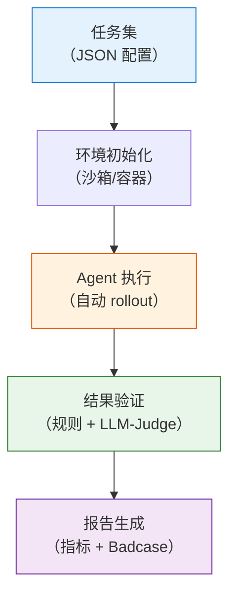

# Agentic 评测体系与 Benchmark 全景

标准 LLM 的评测是简单的。给模型一道题，它给出一个答案，答对就得分。MMLU 考常识，GSM8K 考数学，HumanEval 考代码。评测过程是一个"问→答→判"的三步循环。

Agent 的评测则不同。当你让一个 Agent "帮我修复这个 GitHub Issue"，它不会直接给你一个答案。它会先读代码，定位问题，写补丁，跑测试，发现测试不通过，改补丁，再跑测试。这是多步、多工具、多轮交互的过程。评测不仅看"最终结果对不对"，还要看"中间过程是否合理"。

训练指标和真实能力之间的鸿沟也比标准 LLM 大得多。在标准 RLHF 中，reward 曲线上升通常意味着模型在变好。但在 Agentic RL 中，reward 上升可能只是模型学会了硬编码测试用例、在搜索结果中挑最长的段落、或者反复调用同一个工具来刷分。这些策略都能骗取高 reward，但没有任何实际价值。

评测因此在 Agentic RL 中不是一个训练完再做的收尾工作，而是一个贯穿训练全过程的反馈回路。本节讨论三个问题：用什么 benchmark 衡量 Agent 的能力，怎么搭建自动化评测管线，以及如何将评测结果反哺训练形成闭环。

## 评估维度：Agent 的"好"不是一个数

标准 LLM 评测中，一个模型"好不好"通常可以概括为一个分数——MMLU 得分、HumanEval pass@1、MT-Bench 胜率。但 Agent 的行为是多层次的，单一分数无法捕捉全部信息。

考虑一个具体场景。让 Agent "调查某公司的财务状况并写一份报告"。要评估这次任务的完成质量，至少需要考察三个方面：

- 它是否选择了正确的工具？该搜索的时候搜索，该读 PDF 的时候读 PDF，而不是只用一种工具走到底。
- 它的搜索策略是否高效？是 3 轮搜索就找到了关键信息，还是漫无目的地搜了 20 轮。
- 最终报告的结论是否正确，数据是否真实，引用是否可靠。

这三个方面对应 Agentic 评测的三个核心维度：

| 维度     | 评估什么                  | 代表性基准                   |
| -------- | ------------------------- | ---------------------------- |
| 工具调用 | 模型能否正确调用 API/工具 | BFCL、ACEBench、API-Bank     |
| 任务完成 | Agent 能否完成端到端任务  | SWE-bench、WebArena、τ-bench |
| 综合能力 | 通用智能助手水平          | GAIA、Toolathlon             |

下面按维度逐一介绍主流 benchmark。

## 工具调用基准

工具调用是 Agent 最基础的能力。如果模型连"调用哪个函数、传什么参数"都做不对，后面的一切都无从谈起。

### BFCL

**BFCL（Berkeley Function Calling Leaderboard）** 是目前业界最权威的工具调用排行榜，由 UC Berkeley 的 Gorilla 团队维护。它评估模型在各种场景下正确调用函数的能力——简单函数、多函数组合、RESTful API、Java 函数等。BFCL v3 包含 2,000+ 测试用例，覆盖从单工具到多工具、从简单参数到嵌套对象的各类场景。

BFCL 的评测方式是纯文本的：给定函数签名和用户请求，模型输出结构化的函数调用 JSON。评测不需要沙箱环境，成本低，适合快速验证。排行榜地址：[gorilla.cs.berkeley.edu/leaderboard.html](https://gorilla.cs.berkeley.edu/leaderboard.html)。

### ACEBench

**ACEBench** 从更细的粒度评估工具使用能力。评测分为三个类别：Normal（基础调用）、Special（高级场景如并行调用、长上下文）和 Agent（多智能体协作）。ACEBench 被 ACL 2025 收录，是目前最全面的工具使用评测之一。

### API-Bank

**API-Bank** 提供了 53 个常用 API 工具和 314 个工具使用对话，侧重评估 API 规划、检索和调用的完整能力链。与 BFCL 的"给定函数签名调用"不同，API-Bank 更接近真实场景：模型需要先找到正确的 API，再决定如何调用它。

## 端到端任务基准

工具调用正确只是基本功。Agent 的核心价值在于完成端到端的复杂任务——理解模糊的需求，规划执行路径，遇到挫折时调整策略，最终交付结果。

### SWE-bench

**SWE-bench** 评估代码智能体解决真实 GitHub Issue 的能力。给定一个开源项目的 Issue 描述，Agent 需要理解代码库、定位问题、编写修复补丁。整个过程没有人为干预。Agent 自己决定读哪些文件、改哪些代码、跑哪些测试。

这是目前最难的代码 Agent 评测之一。顶级模型（如 Claude Opus）的解决率也仅在 50% 左右。真实软件工程任务的复杂度远超单文件代码生成。排行榜地址：[swebench.com](https://www.swebench.com/)。

### WebArena

**WebArena** 提供了一个真实的 Web 环境让 Agent 执行任务——在电商网站购物、在论坛发帖、在 GitLab 上管理代码仓库。Agent 需要理解网页的视觉布局和 DOM 结构，执行点击、输入、导航等操作。

WebArena 的难度在于环境的动态性和不确定性。BFCL 的函数签名是固定的，SWE-bench 的代码库至少是静态的，但 WebArena 中的网页可能随时变化。Agent 需要在真实、动态的环境中行动。

### τ-bench

**τ-bench（tau-bench）** 评估对话式智能体与用户协作完成领域任务的能力。它模拟航空订票、电商客服等真实场景。Agent 需要引导用户提供信息、查询数据库、执行操作。

τ-bench 的挑战在于状态维护和不确定性处理。用户可能给出模糊的信息（"我要一张去上海的票"——哪天？哪个机场？），Agent 需要在多轮对话中逐步澄清、更新状态、最终完成任务。这比 SWE-bench 的"单次提交补丁"和 WebArena 的"在网页上操作"多了一个维度：与人类用户的协作。

## 综合能力基准

工具调用基准考基本功，端到端基准考专项能力。如果想问一个更根本的问题——"这个 Agent 到底有多智能"——就需要综合能力基准。这类基准不局限于某一类任务，而是同时考察推理、工具使用、多模态理解等多种能力。

### GAIA

**GAIA（General AI Assistants Benchmark）** 是目前最具挑战性的通用 AI 助手评测之一，包含 450 个需要推理、多模态理解、工具使用、Web 搜索等多种能力的问题。GAIA 分为三个难度等级：

- Level 1：不需要工具，纯推理即可解决
- Level 2：需要一到两个工具辅助
- Level 3：需要多步推理 + 多个工具协作

即使是顶级模型在 Level 3 上的表现也远未饱和。这个评测的天花板还没有人摸到。排行榜地址：[HuggingFace GAIA Leaderboard](https://huggingface.co/spaces/gaia-benchmark/leaderboard)。

### Toolathlon

**Toolathlon** 专注于多工具、长时间工作流的评测，包含 108 个手选的复杂任务，每个任务平均需要与 20+ 个工具交互。它评估的不只是"能不能用工具"，而是"能不能编排复杂的工作流"——在多个工具之间协调状态、处理依赖关系、从失败中恢复。

## 特定场景的评测

上面三个维度覆盖了通用的 Agentic 能力。但不同类型的 Agent 还有各自特有的评估标准。以 Deep Research Agent 为例，它的"好"远不止最终答案的正确性。

一个 Deep Research 结果需要同时满足四个层次：

| 层次       | 含义                 | 评估方式                         |
| ---------- | -------------------- | -------------------------------- |
| 答案正确性 | 最终结论是否正确     | 与标准答案对比（Exact Match/F1） |
| 引用可靠性 | 每个论断是否有据可查 | 引用 URL 可访问性 + 内容相关性   |
| 过程严谨性 | 推理链条是否逻辑自洽 | 步骤级 PRM 评分                  |
| 执行效率   | 是否以最少的步骤完成 | 完成任务所需的交互轮数           |

主流评估基准包括：

- **GAIA**：真实世界复杂问答，需多步推理与工具使用，SOTA 模型约 50-60%
- **Humanity's Last Exam (HLE)**：多学科专家级难题，SFR-DeepResearch 达 28.7%
- **WebArena / Mind2Web**：网页环境中的操作成功率
- **BFCL**：工具/API 调用的精确性

更多细节见 [12.7 节 Deep Research Agent](./deep-research-agent) 的评估体系部分。

## 怎么选基准？

面对这么多 benchmark，全部跑一遍既不现实也不必要。一个实用的选择路径是：

```
你要评估什么？                    推荐基准
├─ 基础函数调用能力               → BFCL
├─ 多场景工具使用                 → ACEBench
├─ 代码修复能力                   → SWE-bench
├─ Web 操作能力                   → WebArena
├─ 多轮对话协作                   → τ-bench
└─ 综合智能助手水平               → GAIA / Toolathlon
```

从 BFCL 开始。它最容易上手，评测成本最低（纯文本评测，不需要沙箱环境），可以快速验证 Agent 的基础工具调用能力。如果 BFCL 都没有达标，更复杂的基准也没有意义。工具调用是所有 Agent 能力的基石。

基础能力达标后，再用 SWE-bench 或 WebArena 评估端到端的任务完成能力。

## 构建你自己的评测

现有的 benchmark 覆盖的是通用能力。如果你的 Agent 面向特定领域——比如法律咨询、医疗问诊、财务分析——很可能找不到现成的 benchmark。这时候需要自己构建评测集。

构建一个 Agentic 评测集，需要回答两个问题：拿什么任务来考，以及怎么判断做得好不好。第一个问题相对容易，难的是第二个。

### 结果评测与过程评测

标准 LLM 评测只看结果。数学题答案对了就得分，代码跑通了就通过。但 Agent 的任务通常是多步的，只看最终结果会漏掉大量信息。

回到"调查某公司财务状况并写报告"这个例子。两个 Agent 可能产出同样正确的结论，但一个只搜了 2 轮就找到了关键财报，另一个搜了 15 轮，其中 8 轮在重复查询同一个关键词。只看结果，两者没有区别。但前者的过程明显更合理。

Agent 评测需要同时考察两个层面。

**结果评测（Outcome Evaluation）** 检验最终交付物是否满足要求。报告的结论是否正确，数据是否准确，格式是否符合预期。这是最基本的检验。SWE-bench 就是典型的纯结果评测——只要补丁通过了测试用例就算成功，不管 Agent 中间折腾了多少轮。

**过程评测（Process Evaluation）** 检验 Agent 在完成任务过程中每一步的决策是否合理。工具选择是否恰当，搜索策略是否高效，遇到障碍时是否正确调整方向。Web-Shepherd（[12.7 节](./deep-research-agent)会详细讨论）是典型的过程评测——它对 Agent 在网页上的每一步操作独立打分。

过程评测并不是锦上添花。Berkeley RDI 的研究发现，几乎每一个主流 agentic benchmark 都可以被"钻空子"拿到接近满分的成绩，而根本不需要真正完成任务 [^benchmark-exploit]。SWE-bench、WebArena、GAIA 都不例外。如果没有过程评测，你可能只测到了模型钻空子的能力。

### 把"质量"拆成可量化的维度

"质量"本身是不可量化的。但任何 Agent 任务的质量都可以拆解为若干个可量化的维度。不同任务的质量维度不同。

以三种常见 Agent 任务为例：

| 质量维度 | Code Agent | Web Agent | Research Agent |
| -------- | ---------- | --------- | -------------- |
| 正确性   | 补丁通过测试 | 操作结果符合预期 | 核心结论与事实吻合 |
| 完整性   | 覆盖所有相关文件 | 完成所有子步骤 | 报告覆盖关键信息点 |
| 效率     | 总交互轮数 | 操作步骤数 | 搜索次数 / 总轮数 |
| 鲁棒性   | 处理边界情况 | 从页面错误恢复 | 冲突信息的交叉验证 |
| 引用     | — | — | 每个论断有可追溯来源 |

拆完维度之后，每个维度需要一个评分方法。正确性通常可以自动验证（跑测试、对比答案），效率可以直接计算（统计轮数），但完整性和鲁棒性往往需要人工或 LLM-as-Judge 判断。

### 设计评分函数

将上面的维度组合成一个评分函数。最简单的做法是加权求和：

```python
def evaluate_trajectory(trajectory, task):
    """对一条 Agent 轨迹打分"""
    scores = {}

    # 正确性：自动验证
    scores["correctness"] = verify_result(
        trajectory.final_answer, task["expected"]
    )

    # 效率：统计交互轮数
    max_turns = task.get("max_turns", 20)
    scores["efficiency"] = 1.0 - (trajectory.num_turns / max_turns)

    # 完整性：检查关键信息点是否被覆盖
    scores["completeness"] = check_coverage(
        trajectory.final_answer, task["key_points"]
    )

    # 过程合理性：每一步的工具选择是否恰当
    scores["process"] = evaluate_process(trajectory.steps, task)

    # 加权求和
    weights = {
        "correctness": 0.4,
        "completeness": 0.2,
        "efficiency": 0.15,
        "process": 0.25
    }

    total = sum(scores[k] * weights[k] for k in weights)
    return total, scores
```

权重的分配反映你对不同维度的重视程度。Code Agent 可能更看重正确性（权重 0.5），Research Agent 可能更看重完整性和引用（权重各 0.25）。权重的选择没有标准答案，取决于业务场景。

权重的设定也不是一成不变的。Allen AI 在 Dr. Tulu 项目中发现，随着训练的推进，模型的弱项会变化——一开始是正确性不够，后来正确性上去了但效率变差。他们在训练过程中**动态调整 Rubric 的权重**，让评测始终对准当前的薄弱环节 [^rler]。

### 过程评测怎么做

过程评测是 Agent 评测区别于标准 LLM 评测的关键。有三种做法，成本和精度依次递增。

**第一种：统计指标。** 最简单。只看总交互轮数、工具调用次数、重复操作比例等数字指标。不判断每一步"对不对"，但能捕捉明显的低效行为（比如同一个 query 搜了 5 次）。

```python
def process_stats(trajectory):
    """统计轨迹的过程指标"""
    return {
        "total_turns": len(trajectory.steps),
        "tool_calls": sum(1 for s in trajectory.steps if s.is_tool_call),
        "repeat_actions": count_repeats(trajectory.steps),
        "distinct_tools": len(set(s.tool_name for s in trajectory.steps
                                   if s.is_tool_call))
    }
```

**第二种：步骤级规则检查。** 为任务定义一组过程规则，检查 Agent 是否违反。比如：

- 禁止连续 3 次调用同一工具且参数相同（说明陷入了循环）
- 搜索之后必须在 3 步内使用搜索结果（说明没有浪费信息）
- 最终回答之前必须至少调用过一次搜索工具（说明不是凭空编造）

```python
def check_process_rules(trajectory, rules):
    """检查轨迹是否违反过程规则"""
    violations = []
    for rule in rules:
        if not rule.check(trajectory):
            violations.append(rule.name)
    return violations
```

成本低，可以自动运行，但只能捕捉已知的坏模式。

**第三种：步骤级 LLM 评分。** 对轨迹中的每一步，用一个 LLM 评估"这一步的决策是否合理"。这是最精细的做法，也是成本最高的。

```python
STEP_RUBRIC = """
给定当前状态和可用工具，评估 Agent 这一步的操作是否合理。
考虑：
1. 这一步是否推进了任务进展？
2. 工具选择是否恰当？参数是否合理？
3. 是否存在更好的替代方案？

评分 1-5 分。3 分及格，表示操作合理但不是最优。
"""

def score_step(step, context, judge_model):
    """对单步操作评分"""
    prompt = f"任务：{context.task}\n历史：{context.history}\n操作：{step}"
    return judge_model.score(prompt, STEP_RUBRIC)
```

第三种方法本质上是 PRM（Process Reward Model）的评测版本。训练时 PRM 提供梯度信号，评测时 PRM 提供质量评估。两者用的是同一个思路——对每一步独立打分——只是目的不同。

ICML 2025 收录的 **Agent-as-a-Judge** [^agent-judge] 进一步推进了这个思路。它不只用一个 LLM 给每步打分，而是部署一个**完整的 Agent 作为评审者**。这个评审 Agent 可以调用工具去验证被评测 Agent 的行为——比如被评测 Agent 声称某个 URL 包含某条信息，评审 Agent 可以真的去访问这个 URL 检查。Agent-as-a-Judge 在 DevAI 基准上与人类专家的吻合度达到约 90%，而普通 LLM-as-Judge 只有约 70%。

### 任务从哪来？

评分方法解决了"怎么判断做得好不好"的问题。但还有另一个问题：拿什么任务来考？

任务的质量直接决定评测的有效性。NeurIPS 2025 的一项研究调查了 78 个 agentic benchmark，发现其中大部分存在任务设计缺陷——有的评测任务本身就有歧义，有的评测方法高估了 Agent 能力高达 100% [^abc]。这项研究提出了 **Agentic Benchmark Checklist（ABC）**，用于审查评测集的质量。

一个靠谱的做法是从真实用户需求中提取任务。Anthropic 在实践中建议：**从用户反馈、客服工单、失败日志中寻找真实任务** [^anthropic-eval]。这些任务天然具有生态效度——它们是用户真正关心的场景。比如 τ-bench 的任务设计来源于真实的航空订票和电商客服场景。τ-bench 的构建分三个阶段 [^tau-bench]：

1. 手动设计数据库 schema、API 和业务规则（模拟真实业务逻辑）
2. 用 LLM 批量生成数据条目（填充数据库）
3. 人工编写测试场景（用户模拟 + 预期目标状态）

另一个方向是用自动化方法生成任务。**TaskCraft** [^taskcraft]（ICLR 2026）的做法是：先定义一批原子任务（简单、可验证），然后通过**深度扩展**（增加步骤数）和**宽度扩展**（增加工具和约束）逐步合成复杂任务。每次扩展后用拒绝采样验证任务的可解性。TaskCraft 用这个方法生成了 41K 个多工具任务。

**APIGen-MT** [^apigen]（NeurIPS 2025）采用**模拟 Agent-人类交互**的方式生成多轮对话任务。先用一个 LLM 委员会生成任务蓝图，再模拟用户逐步透露信息、Agent 做出响应的交互过程。生成的模型（xLAM-2-fc-r）在 τ-bench 上超过了 GPT-4o。

### 开放式任务怎么评？

上面的方法大多适用于有标准答案的任务。但很多 Agent 任务是开放式的——写一份报告、做一次调研、给一段建议。这些任务没有唯一的正确答案。

**JADE** [^jade] 提出了一种两层框架来评估开放式任务。第一层是**技能激活**：由领域专家编写一组评估"技能"，每个技能定义一个质量维度。对每个查询，自动生成一组加权的是/否检查项。第二层是**声明验证**：从 Agent 的回答中提取具体的声明（claim），逐一验证每个声明是否准确。正权重表示质量要求，负权重表示致命缺陷。这种设计支持**时间动态性**——比如检查当前汇率是否正确，而不是对照一个静态答案。

Anthropic 的实践建议对于开放式任务采用**混合评分策略** [^anthropic-eval]：确定性检查做日常回归，LLM-as-Judge 做阶段性评估，人工抽检做最终验收。同时维护两套评测集——一套是**能力评测**（有挑战性的任务，模型不需要全部通过），另一套是**回归评测**（基础任务，模型应该 100% 通过）。

### 实例：为前端页面生成 Agent 构建评测

上面的讨论比较抽象。让我们用一个完整的例子走一遍：你要训练一个"前端页面生成 Agent"——给定一段需求描述（比如"做一个登录页面，支持手机号和邮箱登录"），Agent 需要规划页面结构、选择组件、编写 HTML/CSS/JS 代码，最终交付一个可运行的页面。

这个任务的难点在于：**没有标准答案**。同一个"登录页面"需求，可以做出十种不同的设计，每一种都可能是合格的。传统的精确匹配和执行验证都不适用。需要从零构建一套评测。

**第一步：定义质量维度。**

前端页面的质量可以从以下几个维度衡量：

| 维度     | 含义                               | 量化方式                     |
| -------- | ---------------------------------- | ---------------------------- |
| 功能正确 | 页面的交互逻辑是否正确             | Puppeteer/Playwright 自动化测试 |
| 视觉还原 | 页面是否符合需求描述的布局和风格   | LLM-as-Judge 截图对比        |
| 代码质量 | HTML/CSS/JS 是否规范、可维护       | ESLint + LLM 评分            |
| 响应式   | 页面在不同屏幕尺寸下是否正常显示   | 多分辨率截图对比             |
| 效率     | Agent 用了多少轮交互完成任务       | 统计轨迹轮数                 |

**第二步：构造任务集。**

采用"简单→中等→困难"的梯度。简单任务：单页面静态布局（如落地页）。中等任务：带交互逻辑的表单页面（如登录/注册页）。困难任务：多组件嵌套的复杂页面（如后台管理仪表盘）。每种难度 20-30 个任务，总计约 80 个。

任务的来源有两个渠道。一部分由前端工程师手写，覆盖常见的业务场景（登录、注册、商品列表、数据看板）。另一部分从真实的设计稿网站（如 Dribbble、Figma 社区）中截图提取需求描述，由 LLM 将截图转化为文字 prompt。后者的好处是生态效度高——这些是真实存在的设计需求。

每个任务的数据结构如下：

```python
task = {
    "id": "frontend_001",
    "prompt": "创建一个登录页面，支持手机号和邮箱两种登录方式，"
              "包含忘记密码和注册链接，风格简洁现代",
    "difficulty": "medium",
    "verify_type": "multi_layer",  # 多层验证
    "checklist": [
        "页面包含手机号输入框",
        "页面包含邮箱输入框",
        "页面包含密码输入框",
        "点击登录按钮有响应",
        "有忘记密码链接",
        "有注册链接",
    ],
    "style_reference": "简洁现代风格，白色背景，蓝色主色调",
    "max_turns": 15
}
```

注意 `checklist` 字段。开放式任务没有标准答案，但可以定义一组**必须满足的功能点**。这不是在规定答案长什么样，而是在规定"合格答案至少要包含什么"。

**第三步：设计多层验证。**

前端页面的特殊性在于：它既有客观的功能正确性（按钮能不能点、表单能不能提交），又有主观的视觉质量（好不好看、布局是否合理）。因此验证需要分多层。

```python
class FrontendEvalPipeline:
    """前端页面生成的多层评测"""

    def evaluate(self, task, trajectory):
        code = trajectory.final_answer
        scores = {}

        # 层 1：代码可运行（最低要求）
        # 用 Playwright 在无头浏览器中加载页面，检查是否有 JS 错误
        scores["runnable"] = check_page_loads(code)

        # 层 2：功能 checklist
        # 自动化测试：每个 checklist 项用 Playwright 执行
        scores["functionality"] = run_playwright_checks(
            code, task["checklist"]
        )

        # 层 3：视觉质量（LLM-as-Judge）
        # 截图后让 Judge 对比需求描述和实际效果
        screenshot = take_screenshot(code)
        scores["visual"] = self.judge.score(
            f"需求：{task['prompt']}\n风格要求：{task['style_reference']}",
            screenshot,
            rubric=VISUAL_RUBRIC
        )

        # 层 4：代码质量（ESLint + LLM）
        scores["code_quality"] = (
            0.5 * run_eslint(code) +
            0.5 * self.judge.score(code, CODE_RUBRIC)
        )

        # 层 5：过程评分
        scores["process"] = evaluate_process(trajectory, task)

        return aggregate(scores)
```

五层验证，从客观到主观，从自动到半自动：

- 层 1（代码可运行）和层 2（功能 checklist）是**确定性的**，用 Playwright 自动化测试，不需要人工。每次 checkpoint 都可以跑。
- 层 3（视觉质量）是**半主观的**，用 LLM-as-Judge 对比截图和需求。每隔几个 checkpoint 跑一次。
- 层 4（代码质量）是**混合的**，ESLint 检查客观规范，LLM 评估可读性和架构合理性。
- 层 5（过程评分）评估 Agent 的工具调用是否高效，是否有不必要的重复生成。

层 3 和层 5 需要展开说。先说层 3 的问题。

#### 视觉还原：LLM-as-Judge 不够准确怎么办？

层 3 直接让 LLM 看截图然后打分，有明显的局限。LLM 对视觉细节的判断不稳定——同一个页面，跑两次可能得到不同的分数。更严重的是，LLM 可能被表面特征误导：一个功能完全错误的页面，只要配色好看、对齐整齐，也可能拿到高分。

这不是空想的担忧。Omni-I2C 基准的测试表明 [^omni-i2c]，纯像素指标（SSIM、LPIPS）与人类判断的相关性只有 0.11-0.44（Kendall's Tau），而 LMM Judge 可以达到 0.83。但即便如此，0.83 意味着每 10 个判断里还有近 2 个与人类不一致。FullFront 基准用 CLIP + DINOv2 + Gemini 三层视觉评估 [^fullfront]，与人类相关性达到 0.94，是目前最好的结果——但仍有 6% 的偏差。

问题确实存在，但可以用组合策略缓解。

**做法一：用 Design2Code 的多指标体系替代单一打分。** Design2Code [^design2code]（NAACL 2025）不依赖单一分数，而是从五个维度独立评估视觉还原质量：

| 指标               | 评估什么                           | 计算方式                      |
| ------------------ | ---------------------------------- | ----------------------------- |
| Block-Match        | 页面区块的布局是否对齐             | 对应区块的匹配比例            |
| Text Accuracy      | 文字内容是否正确                   | Sorensen-Dice 字符级相似度    |
| Position Alignment | 元素位置是否准确                   | 区块中心的归一化空间偏移      |
| Color Consistency  | 配色是否一致                       | CIEDE2000 色差（感知加权）    |
| CLIP Similarity    | 整体视觉语义是否接近               | CLIP-ViT 嵌入的余弦相似度    |

每个指标独立计算、独立报告。如果 Block-Match 低但 CLIP 高，说明整体布局对但配色/文字有偏差。如果 Block-Match 高但 Text Accuracy 低，说明布局对了但内容有误。多指标体系比单一分数提供更丰富的诊断信息。

在前端 Agent 评测中，不需要全部照搬。可以选取最相关的几个：

```python
def visual_multi_metric(generated_screenshot, reference_screenshot):
    """多指标视觉评估"""
    return {
        "block_match": compute_block_match(
            generated_screenshot, reference_screenshot
        ),
        "position": compute_position_alignment(
            generated_screenshot, reference_screenshot
        ),
        "color": compute_ciede2000(
            generated_screenshot, reference_screenshot
        ),
        "clip_sim": clip_image_similarity(
            generated_screenshot, reference_screenshot
        ),
    }
```

**做法二：锚定到具体检查项，而非泛泛打分。** 如果没有参考图，不适合用像素对比。可以把视觉还原拆成一组可判定的检查项：

```python
VISUAL_CHECKLIST = """
逐项检查（每项"通过"或"不通过"，不允许模糊）：

1. 页面是否有明确的导航区域？
2. 登录表单是否居中或位于视觉焦点位置？
3. 是否存在两个以上的输入框（手机号 + 邮箱 + 密码）？
4. 是否有至少一个可点击的按钮（如"登录"）？
5. 页面配色是否以白色/浅色为主色调（非深色模式）？
6. 是否存在明显的文字重叠或元素遮挡？
7. 按钮和输入框是否有可辨识的边界？

逐项回答，最后统计通过数。
"""
```

用离散的通过/不通过替代连续的 1-5 分，能大幅降低评判的随机性。实践表明，用离散命名类别（Fully Correct / Partially Correct / Incorrect）比 1-10 的连续打分更稳定 [^anthropic-eval]。

**做法三：有参考图时做多层视觉对比。** 如果任务附带设计稿截图（从 Figma/Dribbble 提取的任务天然就有参考图），可以叠加多层视觉评估。CLIP Score 衡量语义相似度，DINOv2 Score 衡量结构保真度，CIEDE2000 衡量颜色精度。三个指标互补——一个换了配色但布局完全正确的页面，CLIP 可能低但 Block-Match 高。

```python
def layered_visual_eval(generated, reference):
    """多层视觉评估（有参考图时）"""
    return {
        "semantic": clip_score(generated, reference),     # 语义层
        "structural": dino_score(generated, reference),   # 结构层
        "color": ciede2000(generated, reference),         # 颜色层
    }
```

**做法四：定期人工校准。** 无论自动评分设计得多精细，都需要定期用人工评分做锚定。每隔一段时间，随机抽取 20 个任务的自动评分和人工评分，计算一致率。如果一致率低于 80%，说明评分标准需要调整。

四种做法的组合关系：多指标体系提供诊断信息，具体检查项做基础判断（确定性高），多层视觉对比做客观参考（不需要 LLM），人工校准做最终锚定。

更进一步，视觉差异不仅可以用于评测，还可以直接用于训练。VisRefiner [^visrefiner] 把渲染截图与参考图的视觉差异作为 RL 训练的奖励信号——模型生成代码，渲染截图，与目标对比，根据视觉差异更新策略。这相当于把评测和训练合二为一。

#### 过程评测：怎么评价 Agent 的"做法"？

层 5 评估 Agent 的过程质量。对于前端页面生成 Agent，一条典型的轨迹可能是这样的：

```
轮次 1: Agent 分析需求，输出页面结构规划
轮次 2: Agent 生成 HTML 骨架代码
轮次 3: Agent 运行代码，发现布局有问题
轮次 4: Agent 修改 CSS，重新运行
轮次 5: Agent 添加交互逻辑（JS）
轮次 6: Agent 运行，发现 JS 报错
轮次 7: Agent 修复 JS 错误
轮次 8: Agent 最终确认，输出成品
```

这条轨迹看起来不错——Agent 先规划、再执行、遇到问题能调试。但同样的任务，另一个 Agent 可能是这样的：

```
轮次 1: Agent 直接生成完整代码（一坨 3000 行的 HTML）
轮次 2: 运行失败，JS 报错
轮次 3: Agent 删掉所有代码重新生成
轮次 4: 运行失败，换了一种方式重新生成
轮次 5: 运行成功
```

两个 Agent 都产出了能运行的页面。但前者的过程明显更合理：分步构建、增量调试。后者是"暴力随机生成直到碰巧成功"。

过程评测需要捕捉这种差异。前面讨论的三种方法（统计指标、规则检查、步骤级 LLM 评分）在前端场景下各有具体的应用。

**统计指标。** 最直接：

```python
def frontend_process_stats(trajectory):
    """前端生成任务的过程统计"""
    stats = {
        "total_turns": len(trajectory.steps),
        "code_rewrites": count_full_rewrites(trajectory),
        "incremental_edits": count_incremental_edits(trajectory),
        "preview_count": sum(
            1 for s in trajectory.steps
            if s.tool_name == "browser_preview"
        ),
        "plan_exists": any(
            s.content contains "规划" or "结构" or "布局"
            for s in trajectory.steps[:2]  # 前两步有没有规划
        ),
    }
    stats["rewrite_ratio"] = (
        stats["code_rewrites"]
        / max(stats["code_rewrites"] + stats["incremental_edits"], 1)
    )
    return stats
```

`rewrite_ratio`（全量重写比例）是一个有用的信号。合理的开发过程应该是增量修改居多。如果重写比例超过 50%，说明 Agent 的规划能力不足——它在碰运气。

**步骤级规则检查。** 定义一组前端场景特有的过程规则：

```python
FRONTEND_PROCESS_RULES = [
    # 规则 1：第一步应该是规划或分析，而不是直接写代码
    Rule("plan_first",
         check=lambda t: t.steps[0].type in ["plan", "analyze"]),

    # 规则 2：生成代码后必须在 3 步内预览
    Rule("preview_after_code",
         check=lambda t: preview_within(t, after="code_gen", within=3)),

    # 规则 3：禁止连续 2 次全量重写（说明陷入循环）
    Rule("no_consecutive_rewrites",
         check=lambda t: not has_consecutive(t, "full_rewrite", 2)),

    # 规则 4：最终代码行数不应超过需求合理范围的 3 倍
    Rule("reasonable_code_length",
         check=lambda t: len(t.final_code) < max_lines(t.task) * 3),
]
```

规则检查的好处是确定性高、成本低。但它只能捕捉你事先想到的坏模式。如果 Agent 发明了一种新的低效行为（比如反复修改一个无关紧要的 CSS 属性），规则检查不会触发。

**步骤级 LLM 评分。** 前面提到 Agent-as-a-Judge [^agent-judge] 可以用完整 Agent 做评审。在前端场景下，评审 Agent 可以做的事情比普通 LLM-as-Judge 多很多——它可以真的打开浏览器检查页面，可以审查 DOM 结构，可以用 Lighthouse 跑性能评分：

```python
FRONTEND_STEP_RUBRIC = """
评估 Agent 在前端页面生成任务中这一步的操作质量。

上下文：
- 任务需求：{task_prompt}
- 已完成的步骤：{history}
- 当前步骤：{current_step}
- 代码当前状态：{current_code}

判断：
1. 这一步是否推进了任务？（还是在做无用功）
2. 代码修改是否合理？（改对了地方，没有引入新问题）
3. 如果遇到了错误，调试方向是否正确？（还是在盲目试错）

评分 1-5。先给理由，再给分。
"""
```

三种方法的关系是互补的。统计指标做日常监控（每次 checkpoint 都跑），规则检查做异常检测（捕捉已知坏模式），步骤级 LLM 评分做深度诊断（只对统计指标异常的轨迹做，降低成本）。

但三种方法各有盲区。统计指标只能捕捉数字上的异常（重写次数太多），规则检查只能捕捉你事先想到的坏模式，LLM 评分成本高且不稳定。能不能做得更好？

**从 AgentPRM 得到的启发：给每一步算"推进度"。** 前面的统计指标只看"重写了几次"，但没有判断每一步是否真的推进了任务。AgentPRM [^agent-prm] 的思路是用 Q-value 来估计"这一步之后，最终成功的概率有多大"。受这个启发，我们可以给前端 Agent 的每一步算一个简化的"推进度"——不是用真正的 Q-value（那需要大量采样），而是用状态差异来近似：

```python
def step_progress(trajectory):
    """受 AgentPRM 启发：用状态差异近似每步的推进度"""
    progress_scores = []
    for i, step in enumerate(trajectory.steps):
        # 这一步之后，checklist 的通过数增加了多少？
        checklist_before = count_passed_checks(trajectory.code_at(i))
        checklist_after = count_passed_checks(trajectory.code_at(i + 1))
        progress_scores.append(checklist_after - checklist_before)

    return {
        "total_progress": sum(max(0, p) for p in progress_scores),
        "wasted_steps": sum(1 for p in progress_scores if p <= 0),
        "efficiency": sum(max(0, p) for p in progress_scores)
                      / max(len(progress_scores), 1)
    }
```

这个"推进度"不需要训练任何模型——只需要比较每步前后 checklist 通过数的变化。一个规划良好的 Agent 每步都应该推进 1-2 个 checklist 项。一个暴力重写的 Agent 可能在第 4 步突然推进了 5 个项（碰巧生成的代码对了），前面 3 步的推进度都是 0。两种模式在 `wasted_steps` 上有明确区分。

**从 AdaRubric 得到的启发：前端任务的过程评测维度应该因任务而异。** 一个"登录页面"任务的过程重点和"数据看板"任务不同。登录页面的过程评测应该关注：是否先规划了表单结构？CSS 是否在 HTML 骨架之后才添加？而数据看板的过程评测应该关注：是否先理解了数据源？图表组件是否按数据维度逐一添加？AdaRubric [^ada-rubric] 的做法是根据任务描述自动生成评测维度。我们可以直接复用这个思路：在任务配置中为不同类型的任务指定不同的过程评测重点：

```python
TASK_TYPE_PROCESS_FOCUS = {
    "login_form": {
        "expected_plan_keywords": ["表单", "输入框", "按钮", "布局"],
        "expected_step_order": ["plan", "html_skeleton", "css_style",
                                "js_interaction", "preview"],
    },
    "dashboard": {
        "expected_plan_keywords": ["数据源", "图表", "筛选", "布局"],
        "expected_step_order": ["plan", "data_layer", "chart_components",
                                "interaction", "preview"],
    },
}
```

**从 IRC 研究得到的警示：过程评分的权重不能乱设。** τ-bench 的迭代奖励校准研究 [^irc] 发现了一个反直觉的结果：设计不当的密集奖励（每步都打分）反而比稀疏奖励（只看最终结果）更差。原因是每步分数的区分度与 advantage 计算不匹配——模型被误导去优化中间步骤的表面分数，而不是真正推进任务。

这意味着在前端评测中，过程评分的权重不能设得太大。如果过程评分占 40%，而"推进度"的估算又不够准确，模型可能学到"每步都改一点 CSS 让过程评分好看"，而不是"高效地完成任务"。一个安全的做法是：过程评分在评测中占 15-20%，主要作为诊断信号（帮助分析 badcase），而不是作为训练奖励的主要来源。训练奖励仍然以结果评测为主（层 1 + 层 2 占 60% 以上）。

**从 METR 得到的启发：用规则检测钻空子。** METR [^metr] 的监控模型能以 96% AUROC 检测 reward hacking。前端场景下，Agent 可能学到以下钻空子行为：硬编码测试用例中的数据、生成一个只有 1px 高度的隐藏 div 来"包含"要求的元素、用 `user-select: none` 隐藏错误内容。这些行为无法通过结果评测检测（页面看起来是对的），但可以通过过程规则检查：

```python
FRONTEND_HACKING_RULES = [
    # 检测隐藏元素作弊
    Rule("no_invisible_elements",
         check=lambda t: not has_hidden_elements(t.final_code)),

    # 检测硬编码测试数据
    Rule("no_hardcoded_test_data",
         check=lambda t: not has_hardcoded_data(t.final_code)),

    # 检测可疑的内联样式覆盖
    Rule("no_suspicious_overrides",
         check=lambda t: not has_suspicious_css(t.final_code)),
]
```

**第四步：试跑和校准。**

用基线模型（比如未经 RL 训练的原始模型）跑一遍 80 个任务。预期结果：简单任务大多能通过层 1 和层 2，但层 3（视觉质量）得分偏低。困难任务可能层 1 都通过不了（代码无法运行）。

根据试跑结果调整：如果简单任务的层 2 通过率已经超过 90%，说明简单任务太简单了，需要增加交互复杂度。如果困难任务的层 1 通过率只有 10%，说明困难任务太难了，需要拆解成更小的步骤。

**第五步：设定回归基线。**

从试跑结果中选出 20 个"基线模型通过了"的任务作为回归测试集。后续每次训练迭代后都跑这 20 个任务，确保新模型不会退步。

这套评测系统建成后，可以嵌入训练循环。每次 checkpoint 自动跑层 1 和层 2（低成本），每天跑一次层 3 和层 4（中等成本），每周做一次人工抽检（高成本）。评测结果反馈到训练循环中——如果视觉质量得分低，就补充视觉还原相关的训练数据；如果功能 checklist 通过率低，就强化交互逻辑的训练。

### 构建评测集的流程

综合上面的讨论，构建评测集的流程可以总结为：

1. **定义任务分布。** 确定评测集需要覆盖的任务类型和难度范围。以"财务分析 Agent"为例，任务可能包括：单一指标查询（简单）、跨年度趋势分析（中等）、多公司对比报告（困难）。每种难度各占一定比例。

2. **构造任务。** 简单任务可以用 TaskCraft 式的自动化方法生成。复杂任务从真实用户需求中提取。每个任务标注验证类型：有确定答案的用精确匹配，可执行的用沙箱验证，开放式的用 JADE 式的动态 Rubric。

3. **去污染。** 确保评测集中的任务没有出现在训练数据中。可以用 n-gram 重叠或语义相似度检测泄露。这一步和[附录 B 的去污染方法](/appendix_industrial_training/evaluation-badcase)一致。

4. **用 ABC 清单审查。** 检查任务是否有歧义，评测方法是否高估或低估 Agent 能力，是否存在可以被钻空子的漏洞。

5. **试跑和校准。** 用基线模型跑一遍评测集，检查得分分布是否合理。如果所有任务都得满分或零分，说明难度没有区分度，需要调整任务。

评测集不是一次性的。随着模型能力提升，需要定期补充更难的任务、更新评分标准。一个健康的评测集应该像活的一样——随着模型的进化不断更新，始终保持区分度。

## 评测系统设计

知道了"用什么 benchmark 考"，接下来的问题是"怎么考"。Agent 快速迭代时，需要一个自动化、可复现、能回归检测的评测平台。

### Pipeline 架构

一个完整的 Agent 评测 Pipeline 包含五个环节：



任务集是 JSON 配置文件，每个任务指定 prompt、预期答案、验证方式和环境初始化参数。环境初始化为每个任务创建独立的沙箱。这是 Agent 评测和标准 LLM 评测的关键区别：标准 LLM 评测只需把 prompt 喂给模型，Agent 评测还需要把工具环境准备好。

下面是一个简化的评测 Pipeline 实现：

```python
class AgentEvaluationPipeline:
    """Agent 评测流水线"""

    def __init__(self, sandbox, judge_model):
        self.sandbox = sandbox      # Docker 沙箱
        self.judge = judge_model    # LLM-as-Judge

    def run_evaluation(self, agent, task_set):
        """运行完整评测"""
        results = []

        for task in task_set:
            # 1. 初始化环境（每个任务独立的沙箱）
            env = self.sandbox.create_isolated_env(task.get("setup", {}))

            # 2. Agent 执行任务
            trajectory = agent.run(
                task["prompt"], env,
                max_turns=task.get("max_turns", 20)
            )

            # 3. 结果验证
            if task.get("verify_type") == "exact_match":
                passed = (
                    trajectory.final_answer.strip()
                    == task["expected_answer"].strip()
                )
            elif task.get("verify_type") == "execution":
                # 代码类任务：在沙箱中执行验证脚本
                passed = env.execute(
                    task["verify_script"], trajectory.final_answer
                )
            elif task.get("verify_type") == "llm_judge":
                # 主观类任务：用 LLM 评估
                passed = self.judge.evaluate(
                    task["prompt"], trajectory.final_answer,
                    task["rubric"]
                )
            else:
                passed = False

            results.append({
                "task_id": task["id"],
                "passed": passed,
                "turns": trajectory.num_turns,
                "tool_calls": trajectory.tool_calls,
                "final_answer": trajectory.final_answer
            })

        return results
```

`run_evaluation` 中的三种验证方式对应 Agent 任务的不同性质。确定性任务（代码执行、数学计算）用精确匹配或执行验证。非确定性任务（开放式问答、创意生成）用 LLM-as-Judge。

### 回归测试

Agent 的能力是相互关联的。修复一个 bug 可能引入新的退化：模型学会了在代码任务中使用更好的搜索策略，但同时忘记了怎么处理简单的函数调用。每次评测都需要和基线做对比。

```python
def regression_test(self, agent, baseline_results, task_set):
    """回归测试：新模型不能退步旧能力"""
    new_results = self.run_evaluation(agent, task_set)

    regressions = []
    for old, new in zip(baseline_results, new_results):
        if old["passed"] and not new["passed"]:
            regressions.append({
                "task_id": old["task_id"],
                "old_answer": old["final_answer"],
                "new_answer": new["final_answer"]
            })

    if regressions:
        print(f"⚠️ 发现 {len(regressions)} 处能力退化！")
    return regressions
```

`regression_test` 做的事情很简单：把新模型的结果和基线逐条对比，找出从"通过"变成"不通过"的 case。这些退化 case 是下一轮训练的重点关注对象。

### LLM-as-Judge 与评分标准

对于无法用规则验证的任务（开放式问答、报告质量、对话自然度），需要用 LLM-as-Judge 评估。关键在于设计可复现的评分标准（Rubric）：

```python
RUBRIC_TEMPLATE = """
评估标准（每项 1-5 分）：

1. 准确性：回答中的事实是否正确？是否有幻觉？
2. 完整性：是否完整回答了用户的问题？有无遗漏？
3. 引用质量：如果有引用，是否真实可访问？是否支持论断？
4. 效率：是否用了合理的步骤数完成任务？有无冗余操作？

总分 = 各项加权平均
"""
```

实践中三种验证方式组合使用。确定性验证做日常回归，每次 checkpoint 都跑。LLM-as-Judge 做阶段性评估，每隔几个 checkpoint 跑一次。人工抽检做最终验收，上线前才跑。三种方式覆盖从高频低成本到低频高成本的光谱。

## 评测驱动训练改进

评测的最终目的不只是打分，而是将评测结果反馈到训练循环中，形成持续改进的闭环：

$$
\text{评测} \rightarrow \text{Badcase 分析} \rightarrow \text{定向数据合成} \rightarrow \text{再训练} \rightarrow \text{再评测}
$$

用一个具体例子来说明。假设你的 Code Agent 在 SWE-bench 上的通过率卡在 35%。

**收集失败案例。** 从 SWE-bench 的 65% 失败任务中，按错误类型分层采样 100 个。

**归因分析。** 逐一检查失败 case，按错误原因分类。你可能会发现：40% 是"定位了错误的文件"，30% 是"补丁语法错误"，30% 是"理解错了需求"。这个分布直接告诉你下一步该做什么。

**定向合成。** 针对占比最大的错误类型，用 [12.2 节的轨迹合成方法](./trajectory-synthesis) 生成一批"正确定位"的训练数据。合成数据中强化"理解代码结构 → 定位相关文件"的能力。

**训练改进。** 用新数据做一轮 GRPO/PPO 训练。

**回归验证。** 重新跑 SWE-bench，确认两件事：通过率是否提升（预期从 35% 上升），之前通过的 case 是否退步。

这个闭环和[附录 B 的评测体系](/appendix_industrial_training/evaluation-badcase)一脉相承，只是从 LLM 评测扩展到了 Agent 评测。Agent 评测的特殊之处在于需要管理沙箱环境和工具执行状态，Pipeline 的工程复杂度更高。

<details>
<summary>思考题：如果你的 Agent 在 BFCL 上得了 95 分，但在 SWE-bench 上只有 15%，这说明什么？</summary>

这说明 Agent 的工具调用基本功没有问题，但缺乏端到端的任务规划和执行能力。BFCL 考的是"给定明确的函数签名和用户请求，你能不能输出正确的调用"，而 SWE-bench 考的是"给定一段模糊的 Issue 描述，你能不能自己规划路线、理解代码库、定位问题、编写修复"。前者是机械操作，后者需要规划、推理和代码理解。

改进方向：不是继续在工具调用上花力气，而是加强 Agent 的规划能力（参考 [12.1 节多轮交互 RL](./multi-turn-rl)）和代码理解能力。评测的归因分析会直接指向这些方向。

</details>

## 参考资料

- Patil S, et al. "[The Berkeley Function Calling Leaderboard](https://gorilla.cs.berkeley.edu/leaderboard.html)." 2023. —— BFCL 排行榜，评估 LLM 函数调用能力。
- Jimenez C E, et al. "[SWE-bench: Can Language Models Resolve Real-World GitHub Issues?](https://arxiv.org/abs/2310.06770)." ICLR 2024. —— 代码智能体评估基准。
- Zhou S, et al. "[WebArena: A Realistic Web Environment for Building Autonomous Agents](https://arxiv.org/abs/2307.13854)." ICLR 2024. —— Web Agent 评估环境。
- Mialon G, Fourrier C, Wolf T, et al. "[GAIA: A Benchmark for General AI Assistants](https://arxiv.org/abs/2311.12983)." NeurIPS 2023. —— 通用 AI 助手评测。
- Ma L, et al. "[ACEBench: Who Wins the Match Point in Tool Usage?](https://arxiv.org/abs/2501.12851)." ACL 2025. —— 综合工具使用评测。
- Sierra Team. "[τ-bench: A Benchmark for Tool-Agent-User Interaction in Real-World Domains](https://arxiv.org/abs/2406.12045)." arXiv:2406.12045, 2024. —— 对话式智能体评测。
- Li M, et al. "[API-Bank: A Comprehensive Benchmark for Tool-Augmented LLMs](https://arxiv.org/abs/2304.08244)." EMNLP 2023. —— 工具增强 LLM 评测。
- Ji H, et al. "[The Tool Decathlon](https://arxiv.org/abs/2510.25726)." arXiv:2510.25726, 2024. —— Toolathlon，多工具长时间工作流评测。

[^benchmark-exploit]: Berkeley RDI. "[Trustworthy Benchmarks for Contamination](https://rdi.berkeley.edu/blog/trustworthy-benchmarks-cont)." 2025. —— 几乎所有主流 agentic benchmark 都可以被钻空子拿到接近满分，SWE-bench、WebArena、GAIA 均不例外。
[^abc]: Zhu J, et al. "[Establishing Best Practices for Building Rigorous Agentic Benchmarks](https://arxiv.org/abs/2507.02825)." NeurIPS 2025. —— 调查了 78 个 agentic benchmark，提出 ABC 清单用于审查评测集质量。
[^agent-judge]: Zhuge M, et al. "[Agent-as-a-Judge: Evaluate Agents with Agents](https://arxiv.org/abs/2410.10934)." ICML 2025. —— 用完整的 Agent 作为评审者，可以调用工具验证被评测 Agent 的行为。
[^tau-bench]: Sierra Team. "[τ-bench: A Benchmark for Tool-Agent-User Interaction](https://arxiv.org/abs/2406.12045)." 2024. —— 三阶段构建方法：手动 schema → LLM 数据生成 → 人工场景编写。
[^taskcraft]: TaskCraft Team. "[TaskCraft: Automated Generation of Agentic Tasks](https://arxiv.org/abs/2506.10055)." ICLR 2026. —— 原子任务 + 深度/宽度扩展，自动生成 41K 多工具任务。
[^apigen]: APIGen-MT Team. "[Agentic Pipeline for Multi-Turn Data Generation](https://openreview.net/forum?id=qk6ORqQ4Cu)." NeurIPS 2025. —— 模拟 Agent-人类交互生成多轮对话任务。
[^jade]: JADE Team. "[JADE: Expert-Grounded Dynamic Evaluation](https://arxiv.org/html/2602.06486v1)." 2025. —— 两层框架评估开放式任务：技能激活 + 声明验证。
[^rler]: Allen AI. "[DR Tulu: Reinforcement Learning with Evolving Rubrics](https://arxiv.org/abs/2511.19399)." 2025. —— Rubric 随训练动态演化，保持评测的区分度。
[^anthropic-eval]: Anthropic Engineering. "[Demystifying Evals for AI Agents](https://www.anthropic.com/engineering/demystifying-evals-for-ai-agents)." 2025. —— 工业界 Agent 评测实践：混合评分策略、两套评测集、从真实失败中提取任务。
[^design2code]: Si Y, et al. "[Design2Code: How Far Are We from Automating Front-End Engineering?](https://salt-nlp.github.io/Design2Code/)." NAACL 2025. —— 前端代码生成的视觉评测基准，提出 Block-Match、Text Accuracy、Position Alignment、CIEDE2000、CLIP Similarity 五个细粒度指标。
[^omni-i2c]: Omni-I2C Team. "[Omni-I2C: A Holistic Benchmark for Image-to-Code](https://arxiv.org/abs/2603.17508)." 2025. —— 发现 LMM Judge 与人类判断相关性达 Tau=0.83，远高于 SSIM（0.12）和 CLIP Score（0.44）。
[^fullfront]: FullFront Team. "[FullFront: A Benchmark for Full-Stack Front-End Development](https://openreview.net/pdf/636edc8feafa72561dc2cff193472b1f68327a52.pdf)." 2025. —— CLIP + DINOv2 + Gemini 三层视觉评估，与人类相关性达 Spearman rho=0.94。
[^visrefiner]: VisRefiner Team. "[VisRefiner: Learning from Visual Differences](https://arxiv.org/abs/2602.05998)." 2025. —— 用渲染截图与参考图的视觉差异作为 RL 训练奖励信号。
[^agent-prm]: Chen et al. "[AgentPRM: Process Reward Models for LLM Agents via Step-Wise Promise and Progress](https://arxiv.org/abs/2511.08325)." 2025. —— 用 Promise（Q-value）和 Progress（Advantage）双信号评估 Agent 每步质量。
[^ada-rubric]: AdaRubric Team. "[AdaRubric: Task-Adaptive Rubrics for LLM Agent Evaluation](https://arxiv.org/abs/2603.21362)." 2025. —— 评测维度按任务动态生成，在 VisualWebArena 上与人类相关性达 r=0.76。
[^irc]: IRC Team. "[Iterative Reward Calibration for Multi-Turn Agent RL](https://arxiv.org/abs/2604.02869)." 2025. —— 发现设计不当的密集奖励比稀疏奖励更差。
[^metr]: METR. "[MALT: Monitoring Agents for Reward Hacking](https://metr.org/)." 2025. —— 专门的监控模型检测 reward hacking，AUROC 达 0.96。
