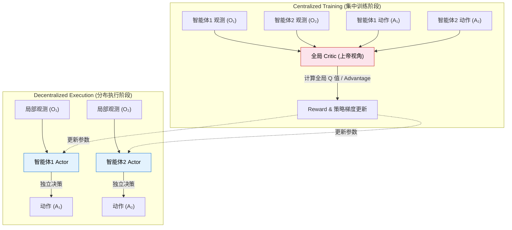
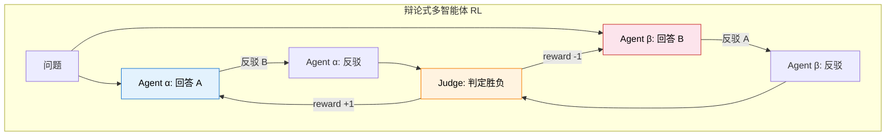
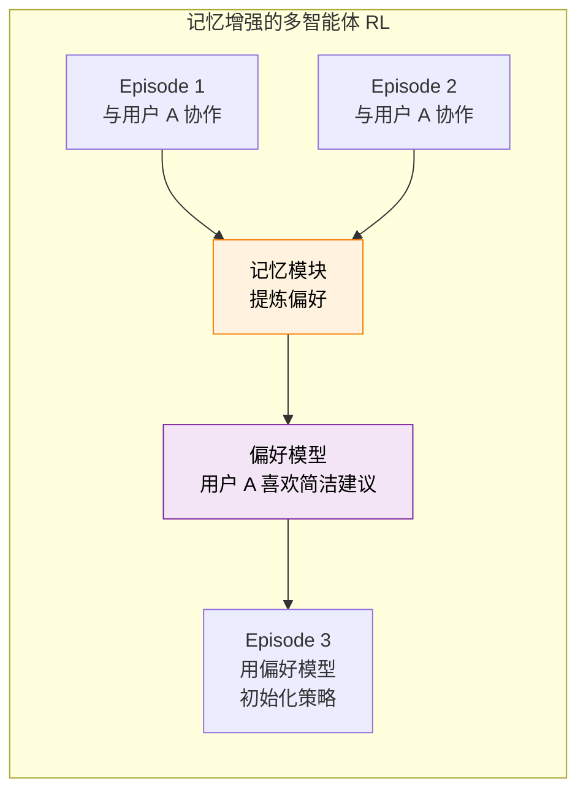
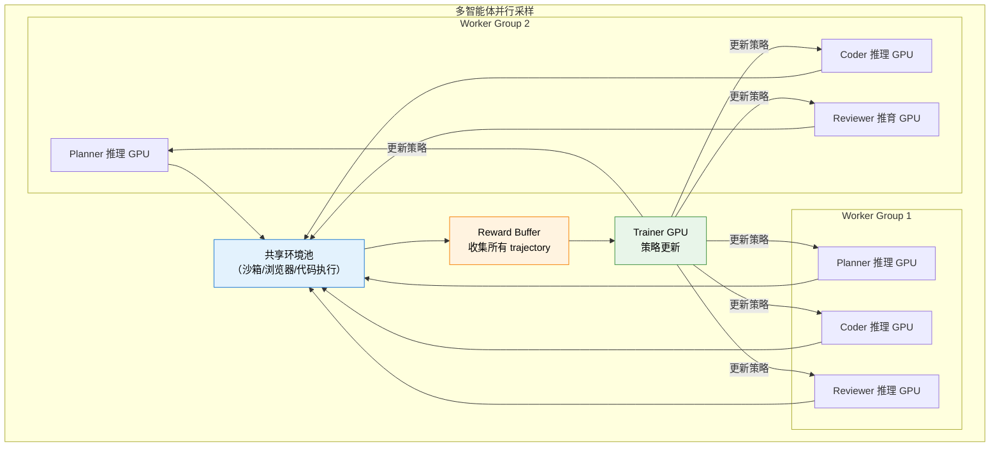
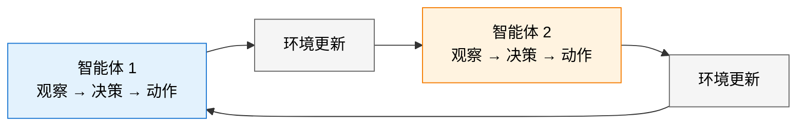

# 12.4 LLM 多智能体强化学习

在讨论 LLM 驱动的多智能体系统之前，先快速回顾传统多智能体 RL（MARL）的核心框架。MARL 最大的挑战是**非平稳性**：当你学习新策略时，队友也在学习——你面对的"环境"在不断变化。当前主流范式是 **CTDE（集中训练，分布执行，Centralized Training with Decentralized Execution）**：训练时有一个"上帝视角"的全局 Critic 看到所有智能体的观测和动作，执行时每个智能体只能根据自己的局部观测做决策。



<div style="text-align: center; font-size: 0.9em; color: var(--vp-c-text-2); margin-top: -10px; margin-bottom: 20px;">
  <em>图：CTDE (集中训练，分布执行) 范式。这是 MAPPO 和 MADDPG 等强化学习算法的核心。在 LLM 场景下，全局 Critic 通常由一个能够审查所有 Agent 对话历史的强大模型（如 GPT-4）或基于结果的验证器来充当。</em>
</div>

| 算法       | 核心思路                           | 适用场景                |
| ---------- | ---------------------------------- | ----------------------- |
| **IPPO**   | 每个智能体独立运行 PPO，互不通信   | 基线方法，角色相同      |
| **MAPPO**  | PPO + 全局价值函数（CTDE）         | 需要协作的团队任务      |
| **QMIX**   | 混合网络保证局部 Q 值与全局 Q 单调 | 合作型任务              |
| **MADDPG** | 每个智能体用 DDPG + 全局 Critic    | 连续动作，混合合作/竞争 |

这些算法在机器人协作、多车调度等场景中表现出色，但当我们切换到**大语言模型驱动的多智能体系统**时，会面对全新的挑战——不能直接把 MAPPO 套到 LLM 上：

| 维度             | 传统 MARL                          | LLM 多智能体 RL                              |
| ---------------- | ---------------------------------- | -------------------------------------------- |
| **动作空间**     | 低维连续/离散（移动方向、加速度）  | 自然语言（生成 token 序列）                  |
| **角色异构性**   | 通常同质（多辆出租车、多个机器人） | 高度异构（Coder 和 Reviewer 的能力完全不同） |
| **Episode 结构** | 固定步数或固定终止条件             | 多轮对话，长度差异极大                       |
| **通信方式**     | 参数化的消息向量                   | 自然语言对话（可解释但高维）                 |
| **人类参与**     | 通常无                             | 人机协作是核心场景                           |

下面我们来拆解 LLM 时代多智能体 RL 的核心问题、典型架构和前沿进展。

## 三种典型架构

### 架构一：角色分工协作 (Role-Playing Collaboration)

这是最直觉的架构——多个 LLM Agent 扮演不同角色，各自负责擅长的子任务，协作完成一个复杂目标。清华与清华系初创公司面壁智能联合提出的 **ChatDev** 就是这一架构的代表作。


<div style="text-align: center; font-size: 0.9em; color: var(--vp-c-text-2); margin-top: -10px; margin-bottom: 20px;">
  <em>图 1：ChatDev 虚拟软件公司架构。通过为 LLM 赋予 CEO、CTO、Programmer、Reviewer 等不同角色，并通过多智能体协作流（设计、编码、测试、文档），模型能够像人类团队一样自动完成软件开发。来源：<a href="https://arxiv.org/abs/2307.07924" target="_blank" rel="noopener noreferrer">ChatDev Paper</a></em>
</div>

```
任务: "修复这个 GitHub Issue"
├── Planner：分析 Issue，制定修复计划
├── Coder：根据计划编写修复代码
├── Reviewer：审查代码质量，提出修改建议
└── Tester：运行测试，验证修复是否有效
```

这种架构和上面提到的 CTDE 思路一致，但关键区别在于**RL 训练方式**。传统 MARL 用全局 Critic 评估每个智能体的贡献，但 LLM Agent 的"动作"是一段完整的文本（可能是几百个 token），用传统 Q 值难以评估"这段代码的质量"。

实践中更常用的方案是**结果驱动的 reward**——只看最终结果（Issue 是否修复？测试是否通过？），然后用 9.1 节讨论的信用分配方法（ORM vs PRM）来分配 reward 到各个角色。另一个代表作是 **MetaGPT**，它将标准化操作程序（SOP）编码进 Prompt，让 LLM 严格按照人类产品经理的流程工作。

### 架构二：辩论对抗 (Debate and Competition)

13.2 介绍了辩论式自博弈训练，这里我们从**多智能体 RL** 的视角重新审视。辩论架构中，两个 LLM Agent 对同一个问题给出不同回答，通过多轮辩论互相挑战，最终由 Judge 判定胜负。

和 13.2 节的区别在于：自博弈通常用**同一个模型的多个实例**，而多智能体视角下的辩论可以用**不同训练策略的模型**。这引入了种群训练（Population Training）的思想——维持多个策略不同的模型，随机配对辩论，避免所有模型收敛到同一个策略。



### 架构三：多智能体社会模拟 (Social Simulation)

除了工具协作和对抗，多智能体还有一个极具科幻色彩的分支：**社会模拟（Social Simulation）**。这不完全是为了完成某个具体的代码修复任务，而是为了研究 LLM 在交互中涌现出的复杂社会学行为。


<div style="text-align: center; font-size: 0.9em; color: var(--vp-c-text-2); margin-top: -10px; margin-bottom: 20px;">
  <em>图 2：MetaGPT 架构。不仅将不同角色的 Agent 封装，更引入了 Standardized Operating Procedures (SOPs) 约束 Agent 的工作流和通信协议，从而极大地缓解了多智能体交流时的“信息幻觉”问题。来源：<a href="https://arxiv.org/abs/2308.01432" target="_blank" rel="noopener noreferrer">MetaGPT Paper</a></em>
</div>

最具代表性的是斯坦福大学的 **Generative Agents (斯坦福小镇)** 工作。在这个虚拟小镇中，25 个由大语言模型驱动的 Agent 有自己的工作、家庭、记忆和性格。它们通过互相聊天、观察、反思（Reflection）来决定每天的行程——甚至能够自发地组织一场情人节派对。

在强化学习的视角下，这可以被视为一个**极高自由度的开放式环境（Open-ended Environment）**。这里的 Reward 不是单一的“得分”，而是保持“行为连贯度（Coherence）”和“社会合理性（Social Plausibility）”。

## LLM 多智能体 RL 的核心挑战

### 挑战一：非平稳性放大

传统 MARL 就有非平稳性问题——当你在学习新策略时，队友也在变。LLM 多智能体把这个挑战放大了：

- **角色异构导致更新不同步**：Coder 模型和 Reviewer 模型的学习速率和更新频率可能不同。当 Coder 升级了代码风格，Reviewer 的审查策略需要重新适应。
- **语言动作空间加剧不稳定性**：传统 MARL 的动作是低维向量，策略变化通常是渐进的。LLM 的动作是语言，策略的一次更新可能导致输出风格完全不同（比如突然从写 Python 切换到写 Java），队友很难快速适应。

**缓解方案**：采用**冻结-轮训**策略——一次只更新一个角色的策略，其他角色保持不变。类似 curriculum learning，先训练稳定的基础角色，再逐个引入更复杂的角色。

### 挑战二：跨角色信用分配

第 9 章讨论了多轮交互中的信用分配（9.1 节）——7 轮交互失败了，该怪谁？多智能体把这个维度进一步扩展：**多个独立决策者同时在行动，谁的贡献最大？**

一个软件项目中，Coder 写了一段代码，Reviewer 发现了潜在 bug 并建议修改，Coder 修改后通过了测试。最终的"通过测试"这个 reward 应该怎么分配？

- Coder 贡献了"写出基本可用的代码"和"根据反馈修改"
- Reviewer 贡献了"发现潜在问题"
- 如果没有 Reviewer 的反馈，Coder 的原始代码可能通不过测试

这和 CTDE 的全局 Critic 思路一致——需要一个看到所有角色动作的"上帝视角"来评估各自贡献。但在 LLM 场景下，"贡献"不只是"动作选得对不对"，还包括"生成的文本质量"、"给出的建议是否有帮助"等更抽象的维度。

**实践方案**：结合过程奖励和结果奖励。过程奖励评估每个角色的中间输出质量（如代码质量分、审查准确率），结果奖励看最终任务是否完成。两者加权组合：

$$R_i = \alpha \cdot R_i^{\text{process}} + (1 - \alpha) \cdot R^{\text{outcome}}$$

其中 $R_i^{\text{process}}$ 是角色 $i$ 的过程奖励，$R^{\text{outcome}}$ 是共享的结果奖励。

### 挑战三：记忆机制与长期策略

在人机协作场景中，Agent 需要记住过去和同一个人协作的经验——上次主播喜欢什么风格的选题？上次用户对哪类建议反应冷淡？这些记忆需要跨 episode 积累，影响未来的策略选择。

这和 DQN 的经验回放（第 4 章）有本质区别：DQN 的经验回放是**原样复用**旧数据，而人机协作的记忆需要**提炼**——从过去的交互中抽象出"这个人喜欢什么"的偏好模型，然后在新的 episode 中使用。



记忆机制的 RL 训练面临一个特殊挑战：**记忆更新本身也需要 RL 优化**。不是简单地"记住所有历史"就有效——记忆容量有限，需要学会"记什么、忘什么"。这可以建模为一个**元学习问题**：外层循环优化记忆策略（记什么、怎么用），内层循环优化任务策略（基于记忆怎么做决策）。

## 代表性工作

### MAPoRL：多智能体协作训练新范式


<div style="text-align: center; font-size: 0.9em; color: var(--vp-c-text-2); margin-top: -10px; margin-bottom: 20px;">
  <em>图 3：MAPoRL 架构。这是一种为协作大语言模型专门设计的多智能体 RL 强化微调（Post-Co-Training）框架。它不仅评估每个模型完成其独立任务的质量，还专门设计了“协作 Reward”来评估不同角色间交互（如 Coder 和 Reviewer）的配合度，用 RL 直接优化多模型间的交互效率。来源：<a href="https://arxiv.org/abs/2502.18439" target="_blank" rel="noopener noreferrer">MAPoRL Paper</a></em>
</div>

MAPoRL [^maporl] 将多个 LLM Agent 的协作建模为一个联合策略优化问题。核心创新是引入了**协作奖励**——不只评估每个角色独立完成子任务的效果，还评估角色之间的"配合度"。例如，Coder 生成的代码是否容易被 Reviewer 理解？Tester 的测试用例是否覆盖了 Coder 代码的边界情况？

### M-GRPO：GRPO 的多智能体扩展

回顾第 8 章的 GRPO：同一个模型生成多条回答，在组内比较。M-GRPO [^mgrpo] 把这个思路扩展到多智能体场景——多个角色的多组输出一起比较。例如，对于同一个编程任务，生成 3 组"Coder-Reviewer-Tester"团队，比较哪个团队的任务完成率更高。

$$\text{Advantage}_i = \frac{R_i - \text{mean}(R_{1..G})}{\text{std}(R_{1..G})}$$

其中 $R_i$ 是第 $i$ 组团队的总体 reward。这保持了 GRPO 的核心优势（不需要 Critic），同时引入了组间竞争来驱动协作能力的提升。

### SAGE：闭环自进化多智能体框架

SAGE [^sage] 实现了一个**闭环自进化**的多智能体系统：多个 Agent 协作完成任务 → 评估协作效果 → 识别薄弱环节 → 针对性训练薄弱角色的策略 → 重新协作。这个循环类似于 12.3 节的自进化系统，但扩展到了多智能体场景。

### MARTI：多智能体辩论框架

MARTI [^marti] 通过多智能体辩论来提升推理质量。核心思想是：多个 LLM Agent 对同一个问题进行多轮辩论，每轮都可以看到其他 Agent 的论点并进行反驳。最终的"共识答案"作为训练信号，参与辩论的每个 Agent 都通过 RL 优化自己的辩论策略。

## 与前面章节的联系

| 前面章节                          | 在 LLM 多智能体 RL 中的对应      |
| --------------------------------- | -------------------------------- |
| CTDE 全局 Critic                  | 跨角色信用分配的理论基础         |
| 自博弈 Generator-Judge（12.3 节） | 辩论对抗架构的直接前身           |
| 多轮信用分配 ORM/PRM（9.1 节）    | 跨角色信用分配的方法论基础       |
| GRPO 组内比较（第 8 章）          | M-GRPO 将组内比较扩展到多智能体  |
| DQN 经验回放（第 4 章）           | 记忆机制：从原样复用到提炼偏好   |
| PPO（第 6 章）                    | 多智能体策略优化的基础算法       |
| 训练稳定性（第 7 章）             | 非平稳性放大要求更强的稳定性控制 |
| Bespoke Labs KL=0.001（9.5 节）   | 多智能体场景中 KL 约束同样关键   |

最深刻的联系可能是：**LLM 多智能体 RL 是本书所有核心概念的"最高难度综合应用"**。它需要同时处理多轮信用分配（9.1 节）、策略梯度优化（第 5-6 章）、训练稳定性（第 7 章）、reward 设计（9.5 节）——只是从单智能体扩展到了多智能体，每个问题的难度都提升了一个量级。

## 训练配方：从理论到实践

上面讨论了三种架构和三个核心挑战。现在我们来看看，在实践中如何把一个多智能体 RL 系统真正训练起来。

### 配方一：冻结-轮训（Freeze-Rotate Training）

这是最稳定的训练方案，适合初期探索：

**Step 1：单独 SFT 每个角色。** 先用监督学习让每个角色掌握基本能力——Coder 学会写代码格式，Reviewer 学会审查模式，Tester 学会写测试用例。

**Step 2：冻结其他角色，RL 训练一个角色。** 比如冻结 Reviewer 和 Tester，只用 RL 训练 Coder。Coder 需要适应固定的 Reviewer 和 Tester——"既然 Reviewer 总是检查边界条件，我就要主动处理边界情况"。

**Step 3：轮换。** 训练好 Coder 后，冻结 Coder，RL 训练 Reviewer。Reviewer 需要适应训练后的 Coder——"Coder 的代码风格变了，我的审查策略也要调整"。

**Step 4：迭代多轮。** 重复 Step 2-3 直到收敛。

```python
class FreezeRotateTrainer:
    """冻结-轮训的多智能体训练器"""

    def __init__(self, agents, env, num_rounds=3):
        self.agents = agents  # {"coder": model_c, "reviewer": model_r, ...}
        self.env = env
        self.num_rounds = num_rounds

    def train(self, tasks):
        for round_idx in range(self.num_rounds):
            for role, model in self.agents.items():
                print(f"Round {round_idx}: Training {role}")

                # 冻结其他角色
                for other_role, other_model in self.agents.items():
                    if other_role != role:
                        other_model.freeze()

                # RL 训练当前角色
                for task_batch in tasks:
                    trajectories = self.rollout_multi_agent(task_batch)
                    rewards = self.compute_multi_agent_reward(trajectories)
                    model.update(trajectories, rewards, role)

                # 解冻所有角色
                for m in self.agents.values():
                    m.unfreeze()

    def rollout_multi_agent(self, tasks):
        """多智能体联合 rollout"""
        trajectories = []
        for task in tasks:
            state = {"task": task, "history": []}

            # 按角色顺序执行
            for role, model in self.agents.items():
                action = model.act(state, role)
                state["history"].append({
                    "role": role, "action": action
                })

            trajectories.append(state)
        return trajectories

    def compute_multi_agent_reward(self, trajectories):
        """计算多智能体协作的 reward"""
        rewards = []
        for traj in trajectories:
            # 结果 reward（共享）
            outcome = self.env.evaluate(traj)
            outcome_reward = 1.0 if outcome["success"] else 0.0

            # 过程 reward（每个角色独立）
            process_rewards = {}
            for step in traj["history"]:
                role = step["role"]
                quality = self.env.evaluate_step(step)
                process_rewards[role] = quality

            # 综合 reward
            total_reward = 0.6 * outcome_reward + 0.4 * sum(
                process_rewards.values()
            ) / max(len(process_rewards), 1)

            rewards.append(total_reward)
        return rewards
```

### 配方二：联合 GRPO（M-GRPO 实战）

M-GRPO 将 GRPO 的组采样思路扩展到多智能体——不再对单个模型的输出做组内比较，而是对**整个团队**的协作表现做组内比较：

```
任务: 修复 GitHub Issue #1234

团队 A (采样 1):
  Planner → 计划: 分析→定位→修复→验证
  Coder   → 代码: 修改了第 45 行
  Reviewer → 审查: 建议增加错误处理
  Tester  → 测试: 3/3 通过
  团队 reward: 0.85

团队 B (采样 2):
  Planner → 计划: 直接搜索关键词→修改
  Coder   → 代码: 修改了第 12 和 45 行
  Reviewer → 审查: LGTM
  Tester  → 测试: 2/3 通过（边界 case 失败）
  团队 reward: 0.60

团队 C (采样 3):
  Planner → 计划: 分析 Issue→复现→定位→修复
  Coder   → 代码: 修改了第 45 行，增加边界处理
  Reviewer → 审查: 建议优化变量命名
  Tester  → 测试: 3/3 通过
  团队 reward: 0.90

GRPO 更新: 团队 C 被强化，团队 B 被弱化
           → 每个角色的策略都向团队 C 的行为靠近
```

M-GRPO 的关键决策是**reward 如何分配到各角色**。两种常见策略：

**共享 reward**：所有角色使用同一个团队 reward。优点是鼓励协作，缺点是可能让某些角色"搭便车"。

**角色特定 reward**：每个角色获得一个加权组合——$\alpha \times$ 团队 reward + $(1-\alpha) \times$ 角色过程 reward。$\alpha$ 通常取 0.5-0.7。

### 配方三：自博弈训练（Self-Play）

多智能体自博弈不需要人工设计角色分工——让同一个模型的不同实例互相竞争：

**Generator vs Judge**：Generator 生成回答，Judge 评估质量。两者通过 RL 共同进化——Generator 学会生成更难评估的回答，Judge 学会更准确地评估。

**Proposer vs Solver**：Proposer 生成难题，Solver 尝试解答。好的 Proposer 应该生成"恰好超过 Solver 当前能力"的难题——太难了 Solver 学不到东西，太简单了没有挑战。这种"难度自适应"的能力也是通过 RL 学到的。

自博弈的核心挑战是**避免模式崩溃**——两个模型可能收敛到一个固定的策略均衡，停止进化。缓解方案是维持一个**策略池**（Population）：不是两个模型对打，而是从包含 10-20 个历史策略的池子中随机配对。FlexMARL [^flexmarl] 是首个端到端联合优化采样、训练及编排的多智能体框架，在工程层面解决了这类并行调度问题。

## 工程实践：多智能体 RL 的基础设施

多智能体 RL 的工程复杂度远超单智能体——你需要同时管理多个模型的推理、多个环境的交互、以及复杂的通信协议。FlexMARL [^flexmarl] 和 KD-MARL [^kdmarl] 分别从端到端训练和去中心化部署两个角度解决了基础设施层面的挑战。

### 并行采样架构



关键设计原则：

**角色推理解耦**。不同角色的模型可能大小不同——Planner 用 14B，Coder 用 32B，Reviewer 用 7B。它们的推理速度不同，必须用异步队列来解耦，避免快的角色等慢的。

**环境沙箱隔离**。每个团队（一组角色）需要独立的环境沙箱，避免角色之间的环境干扰。代码执行环境尤其重要——Coder 写的代码不能影响其他团队的执行环境。

**通信协议标准化**。角色之间传递的消息格式需要统一——即使角色的内部模型不同，消息格式应该一致。常见做法是用 JSON Schema 定义消息格式，类似 9.3 节的工具调用格式。

## 基于模型的 RL：从盲目试错到脑内推演

前面讨论的多智能体方案都是 **Model-Free**——智能体不知道环境内部如何运作，只能通过不断试错来积累经验。本书覆盖的 Q-Learning、DQN、PPO、DPO、GRPO，全都是 Model-Free 的。

但还有另一条路线：**Model-Based RL（MBRL）先学习一个"世界模型"，然后在这个虚拟世界中"想象"和"规划"**。

|                  | Model-Free（本书主线）   | Model-Based                      |
| ---------------- | ------------------------ | -------------------------------- |
| 是否需要环境模型 | 不需要                   | 需要先学一个世界模型             |
| 样本效率         | 低（需要大量试错）       | 高（可以在脑内"想象"无数次）     |
| 策略质量         | 通常更高（直接优化策略） | 可能次优（受限于世界模型的精度） |
| 代表算法         | DQN、PPO、DPO、GRPO      | Dreamer、MuZero、AlphaZero       |
| 类比             | 靠经验学开车             | 先学物理规律，再推演怎么开       |

世界模型 $\hat{P}(s_{t+1}|s_t, a_t)$ 学会了预测"在状态 $s_t$ 下做动作 $a_t$，环境会变成什么样"。有了它，智能体可以在脑内模拟无数次交互，而真实环境只需提供少量数据来训练世界模型本身。

### 为什么 MBRL 对大模型很重要？

大语言模型本身就是一个关于语言的**世界模型**。当你要求大模型用思维链（CoT）进行多步推理时，它其实就是在做某种形式的"内部规划"：

$$\text{CoT 推理} \approx \text{在世界模型中规划}$$

更具体地说：

- **世界模型** = 大模型的语言建模能力（预测下一个 token）
- **规划** = 思维链的多步推理
- **动作** = 选择推理的路径（验证、回溯、尝试新方向）
- **Reward** = 最终答案的正确性

这也是为什么第 8 章的 GRPO 和 DeepSeek-R1 能通过 RL 激发出推理能力——大模型本身就是一个强大的世界模型，RL 教会了它如何更好地利用这个世界模型来规划推理路径。

### 代表性工作

**AlphaZero / MuZero**。AlphaGo 的继任者。AlphaGo 需要人类告诉它围棋规则，但 MuZero 完全从零开始——自己学会环境的动态规律，然后在脑内用 MCTS 规划。MuZero 不仅学会了围棋、国际象棋、将棋，还学会了 Atari 游戏——全部从零开始，不需要任何先验知识。

**Dreamer 系列**。Dreamer 在潜空间（Latent Space）中构建世界模型，把高维观测压缩到低维隐空间，在隐空间中学习动态规律并做规划。Dreamer 的样本效率比 Model-Free 方法高一个数量级——同样的任务，Dreamer 需要的交互量只有 Model-Free 方法的十分之一。

MARL 和 MBRL 的交汇点是**多机器人协作**：多个机器人需要协作完成任务，同时每个机器人的策略需要基于世界模型来做规划（预测"如果我推这边，物体会怎么动？其他机器人会怎么反应？"）。这把多智能体的非平稳性、世界模型的模型偏差、物理世界的安全约束叠加在一起，目前还在早期探索阶段。

## 小结

本节从传统 MARL 出发，讨论了 LLM 时代多智能体 RL 的核心问题和前沿进展：

1. **非平稳性放大**：语言动作空间和角色异构性让多智能体训练更不稳定。冻结-轮训是实用的缓解方案。
2. **跨角色信用分配**：多个独立决策者的贡献难以评估。结合过程奖励和结果奖励是当前最有效的方案。
3. **记忆与长期策略**：人机协作需要跨 episode 的偏好积累。记忆机制本身也需要 RL 优化。
4. **基于模型的 RL**：世界模型让智能体从"盲目试错"走向"脑内推演"，大模型的 CoT 推理本质上就是利用语言世界模型进行规划。

在实践中，三种训练配方各有适用场景：

- **冻结-轮训**：最稳定，适合初期探索和角色差异大的场景
- **联合 GRPO（M-GRPO）**：效率最高，适合角色能力相当、协作紧密的场景
- **自博弈**：无需设计角色分工，适合对抗性任务和自适应难度

下面我们用 PettingZoo 做一个多智能体 RL 的动手实验，最后讨论[离线强化学习（CQL / IQL / DT）](./offline-rl)。

---

## 动手：用 PettingZoo 做多智能体 RL

到目前为止，我们的实验都只有一个智能体。但真实世界很少是单打独斗——自动驾驶车辆需要在车流中协调，机器人团队需要分工合作。[PettingZoo](https://github.com/Farama-Foundation/PettingZoo) 是 MARL 的标准环境库，由 Gymnasium 同一团队（Farama 基金会）维护，提供统一的多智能体环境 API。

### 从单智能体到多智能体：什么变了？

|            | 单智能体（Gymnasium）  | 多智能体（PettingZoo）               |
| ---------- | ---------------------- | ------------------------------------ |
| 智能体数量 | 1 个                   | 2 个到数百个                         |
| 环境平稳性 | 平稳（环境规则不变）   | 非平稳（其他智能体也在学习改变）     |
| 信用分配   | 无需（好坏都是自己的） | 核心难题（团队成功，功劳归谁？）     |
| 探索策略   | ε-greedy / 熵正则      | 还要考虑其他智能体是否会利用你的探索 |
| 代表算法   | DQN / PPO / SAC        | QMIX / MAPPO / MADDPG                |

### PettingZoo 环境概览

```bash
pip install pettingzoo
```

| 家族        | 类型      | 代表环境                                      | 描述                       |
| ----------- | --------- | --------------------------------------------- | -------------------------- |
| `classic`   | 博弈论    | `chess_v3`, `connect_four_v3`, `tictactoe_v3` | 经典棋盘游戏，回合制对抗   |
| `butterfly` | 合作/竞争 | `cooperative_pong_v5`, `pistonball_v6`        | 需要多个智能体协作完成目标 |
| `mpe`       | 混合      | `simple_adversary_v3`, `simple_spread_v3`     | 多粒子环境，沟通与导航     |
| `sisl`      | 对抗/合作 | `pursuit_v4`, `waterworld_v4`                 | 追逃、资源收集             |
| `atari`     | 对抗      | `pong_v3`                                     | 多智能体版 Atari           |

### 快速上手：四子棋

四子棋（Connect Four）是最简单的多智能体环境之一——两个智能体轮流落子：

```python
from pettingzoo.classic import connect_four_v3

env = connect_four_v3.env(render_mode="human")
env.reset()

for agent in env.agent_iter():
    observation, reward, termination, truncation, info = env.last()

    if termination or truncation:
        action = None
    else:
        mask = observation["action_mask"]
        valid_actions = [i for i, m in enumerate(mask) if m == 1]
        action = valid_actions[0]  # 简单策略：选第一个合法位置

    env.step(action)

env.close()
```

PettingZoo 使用 **AEC（Agent Environment Cycle）模型**：智能体轮流行动，每次只有一个智能体执行动作。



### 实战：多粒子环境中的协作导航

`simple_spread` 是多智能体 RL 的经典基准：N 个智能体需要协作覆盖地图上的 N 个目标点，同时避免碰撞。

```python
from pettingzoo.mpe import simple_spread_v3
import numpy as np

env = simple_spread_v3.env(N=3, local_ratio=0.5, max_cycles=100)
env.reset()

total_rewards = {agent: 0 for agent in env.agents}

for agent in env.agent_iter():
    obs, reward, termination, truncation, info = env.last()

    if termination or truncation:
        action = None
    else:
        action = env.action_space(agent).sample()

    env.step(action)
    if reward is not None:
        total_rewards[agent] += reward

print("各智能体累积奖励:")
for agent, reward in total_rewards.items():
    print(f"  {agent}: {reward:.2f}")

env.close()
```

关键参数 `local_ratio=0.5` 控制奖励中"全局奖励"和"局部奖励"的比例——这正是多智能体信用分配问题的体现。

### 训练多智能体策略

以下是使用独立 PPO（IPPO）的简单方案——每个智能体用独立的 PPO 策略：

```python
from pettingzoo.mpe import simple_spread_v3
from stable_baselines3 import PPO
import supersuit as ss

env = simple_spread_v3.env(N=3)
env = ss.pettingzoo_env_to_vec_env_v1(env)
env = ss.concat_vec_envs_v1(env, 8, num_cpus=1, base_env="single")

model = PPO("MlpPolicy", env, verbose=1, learning_rate=3e-4, n_steps=2048)
model.learn(total_timesteps=200_000)
model.save("./models/ippo_simple_spread")
```

::: tip
这里所有智能体共享同一个策略网络（参数共享），这在角色相同的环境中是标准做法。如果角色不同（如追逃游戏中的追捕者和逃跑者），则需要各自独立的网络。
:::

### 从多智能体到 Agentic RL

PettingZoo 中的多智能体是"同一环境中多个 RL 智能体"。而第 9 章讨论的 Agentic RL 则是"一个智能体与外部工具和环境交互"。两者的交汇点正是**多智能体大模型协作**——多个 LLM Agent 扮演不同角色，通过 RL 学会协作完成复杂任务。

## 参考资料

[^maporl]: Park C, Han S, et al. "[MAPoRL: Multi-Agent Post-Co-Training for Collaborative Large Language Models with Reinforcement Learning](https://arxiv.org/abs/2502.18439)." 2025. —— 多 LLM Agent 协作训练新范式，引入协作 reward。

[^mgrpo]: Hong H, Yin J, et al. "[Multi-Agent Deep Research: Training Multi-Agent Systems with M-GRPO](https://arxiv.org/abs/2511.13288)." 2025. —— 将 GRPO 扩展到多智能体场景，保持无 Critic 优势。

[^sage]: Peng Y, et al. "[SAGE: Multi-Agent Self-Evolution for LLM Reasoning](https://arxiv.org/abs/2603.15255)." 2026. —— 闭环自进化多智能体框架。

[^marti]: Zhang K, Tian K, et al. "[MARTI: A Framework for Multi-Agent LLM Systems Reinforced Training and Inference](https://openreview.net/forum?id=E7jZqo0A50)." ICLR 2026. —— 多智能体 RL 训练与推理框架。[GitHub](https://github.com/TsinghuaC3I/MARTI)

- Zhang G, et al. "[The Landscape of Agentic Reinforcement Learning for LLMs: A Survey](https://arxiv.org/abs/2509.02547)." 2025. —— Agentic RL 综述，包含多智能体协作板块。
- Li J, et al. "[FlexMARL: Rollout-Training Co-Design for Efficient LLM-Based Multi-Agent Reinforcement Learning](https://arxiv.org/abs/2602.09578)." 2026. —— 首个联合优化采样、训练及编排的端到端多智能体框架。
- Pavel M I, Hu S, Masum M A, Pratama M, Kowalczyk R, Cao Z J. "[KD-MARL: Resource-Aware Knowledge Distillation in Multi-Agent Reinforcement Learning](https://arxiv.org/abs/2604.06691)." 2026. —— 通过知识蒸馏将集中式协调行为迁移到轻量级去中心化智能体。

[^flexmarl]: Li J, et al. "[FlexMARL: Rollout-Training Co-Design for Efficient LLM-Based Multi-Agent Reinforcement Learning](https://arxiv.org/abs/2602.09578)." 2026. —— 首个联合优化采样、训练及编排的端到端多智能体框架。

[^kdmarl]: Pavel M I, Hu S, Masum M A, Pratama M, Kowalczyk R, Cao Z J. "[KD-MARL: Resource-Aware Knowledge Distillation in Multi-Agent Reinforcement Learning](https://arxiv.org/abs/2604.06691)." 2026. —— 通过知识蒸馏将集中式协调行为迁移到轻量级去中心化智能体。
