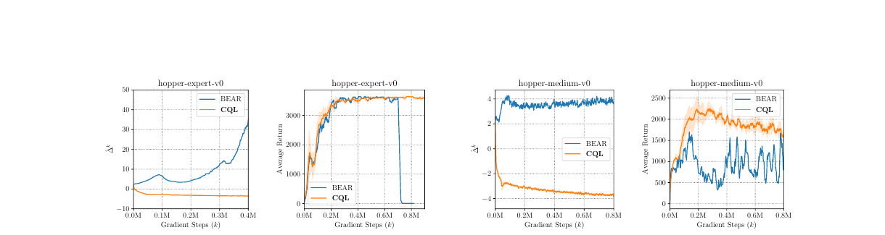
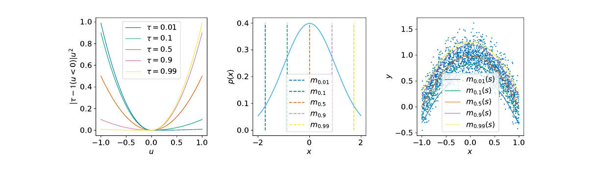

# 12.5 离线强化学习：从历史数据到可靠策略

<a id="article-start"></a>

到目前为止，我们见过的大多数强化学习算法都有一个隐含前提：智能体可以一边学习，一边继续和环境交互。DQN 可以反复玩 Atari，PPO 可以在仿真器里摔倒再重来，GRPO 可以让模型不断生成新答案再用规则打分。

但很多真实场景不是这样。自动驾驶不能靠真实事故探索边界条件，医疗决策不能拿病人做随机试验，工业机器人不能每天撞坏工装夹具，推荐系统也不能长期把高风险策略直接推给真实用户。

这些问题的共同形态是：**我们有大量历史数据，却不能在训练时继续试错。** 这就是 **Offline Reinforcement Learning（Offline RL，离线强化学习）** 要解决的问题。


<div style="text-align: center; font-size: 0.9em; color: var(--vp-c-text-2); margin-top: -10px; margin-bottom: 20px;">
  <em>图 1：在线 RL、off-policy RL 与离线 RL 的训练方式对比。离线 RL 的数据集只收集一次，训练时不再和 MDP 交互。来源：Levine et al., “Offline Reinforcement Learning: Tutorial, Review, and Perspectives on Open Problems”, Fig. 1。</em>
</div>

::: tip 阅读路径
如果数学符号一开始看不懂，先读 [先用人话看一遍](#intuition-first) 和 [最小实践](#minimal-offline-practice)。公式下面的“展开”下拉框是慢速解释，第一遍可以先不打开。
:::

## 先用人话看一遍 {#intuition-first}

Offline RL 可以用一句话概括：

**只给你一堆过去发生过的轨迹，让你学出一个未来要部署的新策略。**

它和三件事很像，但又不完全一样：

| 方法                    | 数据从哪来                 | 训练时能否继续试错 | 学到什么                         |
| ----------------------- | -------------------------- | ------------------ | -------------------------------- |
| Online RL               | 当前策略实时采样           | 能                 | 通过试错优化策略                 |
| Off-policy RL           | replay buffer + 新交互     | 能                 | 复用旧数据，也继续收集新数据     |
| Imitation Learning / BC | 专家或历史动作             | 不能               | 模仿数据里的动作                 |
| Offline RL              | 固定历史数据集             | 不能               | 在不越出数据太远的前提下提高回报 |
| Offline-to-Online RL    | 先固定数据，后少量在线交互 | 后期能             | 先安全初始化，再真实微调         |

最危险的地方在于：离线数据只覆盖了行为策略曾经做过的动作。模型训练完以后，如果新策略开始选择数据里没见过的动作，我们其实不知道这些动作会怎样。Q 函数却可能因为神经网络外推，错误地给这些动作很高分。

所以离线 RL 的核心不是“怎样更激进地找高 Q 动作”，而是：

**怎样从固定数据中学到更好策略，同时不要被数据分布外的幻想动作骗走。**

## 数学问题：固定数据里的策略优化

标准 MDP 仍然是：

$$
\mathcal{M}=(\mathcal{S},\mathcal{A},p,r,\gamma)
$$

在线 RL 想优化的是策略回报：

$$
J(\pi)=
\mathbb{E}_{\tau\sim p,\pi}
\left[
\sum_{t=0}^{\infty}\gamma^t r(s_t,a_t)
\right]
$$

但 Offline RL 不能从 $\pi$ 继续采样。它只有一个固定数据集：

$$
\mathcal{D}
=
\{(s_t,a_t,r_t,s_{t+1},d_t)\}_{t=1}^{N},
\qquad
a_t\sim \pi_\beta(\cdot\mid s_t)
$$

这里的 $\pi_\beta$ 叫 **behavior policy**，也就是收集数据时的旧策略。它可能是人类司机、旧推荐系统、专家策略、随机探索策略，也可能是很多策略混在一起。

::: details 展开：这几行公式怎么读？
`D` 是离线数据集。它像一堆录像，每一帧记录了状态 `s_t`、动作 `a_t`、奖励 `r_t`、下一状态 `s_{t+1}` 和是否结束 `d_t`。

`pi_beta` 是“录像是谁拍出来的”。如果数据来自人类司机，`pi_beta` 就是人类驾驶行为；如果来自老模型，`pi_beta` 就是老模型策略。

我们真正想部署的是新策略 `pi`。问题是：训练时不能让 `pi` 上路继续试，只能用 `D` 判断它好不好。

[返回人话版](#intuition-first) / [返回文章开头](#article-start)
:::

如果直接套 Q-learning，会遇到一个很典型的 backup：

$$
y_t
=
r_t+\gamma(1-d_t)\max_{a'}Q_{\bar{\theta}}(s_{t+1},a')
$$

这一步在 online RL 里很自然，因为如果某个动作被高估，智能体之后可以真的试一下，再用真实反馈纠正。但在 offline RL 里，$\max_{a'}$ 很可能选到数据集中没出现过的动作。这个动作的 Q 值只是神经网络外推出来的，未必可信。

这就是 **extrapolation error** 或 **out-of-distribution action** 问题。

::: details 展开：为什么 max 会制造分布外动作？
Q 网络要回答的是“任意状态动作对有多好”。但离线数据只告诉它数据中出现过的动作有多好。

当我们写 `max_a Q(s, a)` 时，优化器会在整个动作空间找最高值。神经网络在未见过动作上的预测可能很随意。如果某个没见过的动作被错误估高，`max` 会把它挑出来，策略也会朝它移动。

在线 RL 有纠错机会：真的试一试，发现不好就降 Q。离线 RL 没有这个机会，错误会在 bootstrapping 中被反复放大。
:::

用一句工程话说：

**Online RL 怕探索太慢；Offline RL 怕模型相信自己没见过的东西。**

## 最小实践：复现 OOD 动作问题 {#minimal-offline-practice}

先做一个小到能跑懂的实验。完整脚本在 [minimal_offline_rl_contextual_bandit.py](./snippets/minimal_offline_rl_contextual_bandit.py)。

这个环境不是完整 MDP，而是一个上下文 bandit。它足够小，但能复现离线 RL 最核心的坑：**数据只覆盖窄动作区，普通 Q 最大化会跑到数据没覆盖的极端动作。**

运行：

```bash
python docs/chapter12_future_trends/offline-rl/snippets/minimal_offline_rl_contextual_bandit.py
```

典型输出：

```text
behavior_policy  return=-0.0480 support_gap=0.0000
oracle_policy    return= 0.0000 support_gap=unknown
naive_q_actor    return=-0.1137 support_gap=0.4819
cql_actor        return=-0.0420 support_gap=0.0112
td3bc_actor      return=-0.0260 support_gap=0.0520
```

这里 `support_gap` 表示策略动作离数据集行为动作有多远。`naive_q_actor` 的 gap 很大，说明它被 Q 网络外推吸引到了数据没覆盖的地方，真实回报反而更差。`cql_actor` 和 `td3bc_actor` 更保守，动作仍然留在数据附近。

核心代码只有两处。

第一，普通 Q 只在数据动作上拟合奖励：

```python
q_data = q(state, action)
loss = ((q_data - reward) ** 2).mean()
```

第二，CQL 加一个保守项：随机采一些动作，如果 Q 网络给这些动作高分，就惩罚它。

```python
q_random = q(repeated_state, random_action).reshape(batch_size, num_random_actions)
conservative_penalty = torch.logsumexp(q_random, dim=1).mean() - q_data.mean()
loss = mse_loss + alpha * conservative_penalty
```

这不是完整 CQL 论文实现，但已经抓住核心直觉：**让数据外动作的 Q 值低一点，策略就不容易被幻觉高分带走。**

## 数据质量：离线 RL 首先是数据问题

离线数据不是越多越好，而是要看它覆盖了什么。


<div style="text-align: center; font-size: 0.9em; color: var(--vp-c-text-2); margin-top: -10px; margin-bottom: 20px;">
  <em>图 2：D4RL 中 Maze2D 轨迹覆盖示意。离线数据记录的是行为策略走过的路径，算法能否“拼接”已有片段，是离线 RL 的关键能力之一。来源：Fu et al., “D4RL: Datasets for Deep Data-Driven Reinforcement Learning”, Fig. 4。</em>
</div>

D4RL 论文把离线 RL 数据集分成很多类型[^d4rl]。这比只说“专家数据”更接近真实世界：

| 数据类型         | 直觉                       | 难点                        |
| ---------------- | -------------------------- | --------------------------- |
| random           | 随机策略收集               | 回报低，但覆盖可能广        |
| medium           | 中等策略收集               | 有可学信号，也有很多坏动作  |
| expert           | 专家策略收集               | 质量高，但覆盖窄            |
| medium-replay    | 训练中 replay buffer       | 混合了从差到好的策略        |
| mixed / multiway | 多个策略、多段轨迹拼在一起 | 需要把好片段 stitching 起来 |
| narrow demos     | 少量示范                   | 模仿容易，超过示范很难评估  |

这解释了为什么 behavior cloning 有时很强：如果数据几乎全是专家轨迹，模仿就够了。也解释了为什么 Offline RL 有时比模仿更有价值：如果数据里混有许多次优轨迹，算法需要识别哪些动作更好，而不是平均模仿所有动作。

## 方法地图：离线 RL 的几条路线

离线 RL 方法很多，但可以按“怎样避免分布外动作”来理解。

| 路线              | 代表方法                                            | 核心做法                         |
| ----------------- | --------------------------------------------------- | -------------------------------- |
| 行为约束          | BCQ[^bcq], BEAR[^bear], TD3+BC[^td3bc], AWAC[^awac] | 新策略不要离数据行为太远         |
| 保守价值估计      | CQL                                                 | 主动压低数据外动作的 Q 值        |
| 隐式价值学习      | IQL                                                 | 不对数据外动作做 max             |
| 序列建模          | Decision Transformer                                | 不学 Q，直接条件生成动作         |
| 模型辅助与规划    | MOPO[^mopo], MOReL[^morel], COMBO[^combo]           | 学模型，但惩罚模型不确定区域     |
| Offline-to-Online | AWAC, IQL fine-tuning                               | 先离线安全初始化，再少量在线微调 |
| LLM 偏好离线优化  | DPO 等                                              | 用固定偏好数据更新语言模型策略   |

这篇文章重点讲 CQL、IQL 和 Decision Transformer，因为它们分别代表三种很清晰的思想：**保守 Q、避开 OOD max、把 RL 当序列建模。**

## CQL：把数据外动作压低

CQL（Conservative Q-Learning）直接面对 Q 高估问题[^cql]。

标准 Bellman error 是：

$$
\mathcal{L}_{\text{TD}}(\theta)
=
\mathbb{E}_{(s,a,r,s')\sim\mathcal{D}}
\left[
\left(
Q_\theta(s,a)-
\left(r+\gamma V_{\bar{\theta}}(s')\right)
\right)^2
\right]
$$

CQL 在上面加一个保守项。离散动作空间里，一个常见写法是：

$$
\mathcal{L}_{\text{CQL}}(\theta)
=
\mathcal{L}_{\text{TD}}(\theta)
+
\alpha
\left(
\mathbb{E}_{s\sim\mathcal{D}}
\left[
\log\sum_a \exp Q_\theta(s,a)
\right]
-
\mathbb{E}_{(s,a)\sim\mathcal{D}}
\left[
Q_\theta(s,a)
\right]
\right)
$$

前一项会惩罚所有动作里偏高的 Q，后一项把数据中真实出现过的动作保留下来。直觉上，CQL 让 Q 函数变得悲观：**宁可低估没见过的动作，也不要把策略引到危险盲区。**



<div style="text-align: center; font-size: 0.9em; color: var(--vp-c-text-2); margin-top: -10px; margin-bottom: 20px;">
  <em>图 3：CQL 论文中关于 Q-gap 与回报变化的实验曲线。CQL 通过保守价值估计缓解 policy constraint 方法可能出现的价值过估与退化。来源：Kumar et al., “Conservative Q-Learning for Offline Reinforcement Learning”, Fig. 2。</em>
</div>

::: details 展开：CQL 公式怎么慢慢读？
`logsumexp` 可以理解成一个平滑版的 `max`。如果某些动作 Q 值很高，这一项就会变大。

`E_D Q(s,a)` 只看数据集中真的出现过的动作。CQL 用它抵消一部分惩罚，让数据内动作不被全部压低。

`alpha` 控制保守程度。太小，压不住 OOD 高估；太大，策略会过度模仿数据，学不到改进。
:::

代码上，CQL 的味道就是：

```python
q_data = q(state, data_action)
q_random = q(state_repeated, random_action).view(batch_size, num_random_actions)

td_loss = ((q_data - bellman_target) ** 2).mean()
cql_penalty = torch.logsumexp(q_random, dim=1).mean() - q_data.mean()
loss = td_loss + alpha * cql_penalty
```

## IQL：不在数据外动作上取 max

IQL（Implicit Q-Learning）的路线更克制：它不显式约束策略，也不在动作空间上做 $\arg\max$，而是只用数据集动作学习 value 和 Q[^iql]。

它的核心是 expectile regression。先学习一个 value 函数：

$$
\mathcal{L}_{V}(\psi)
=
\mathbb{E}_{(s,a)\sim\mathcal{D}}
\left[
L_2^\tau
\left(
Q_{\bar{\theta}}(s,a)-V_\psi(s)
\right)
\right]
$$

其中非对称平方损失是：

$$
L_2^\tau(u)=|\tau-\mathbf{1}(u<0)|u^2
$$

当 $\tau>0.5$ 时，$V(s)$ 会更靠近数据动作里的高 Q 部分。它像是在问：**在数据集中出现过的动作里，较好的那一批大概有多好？**



<div style="text-align: center; font-size: 0.9em; color: var(--vp-c-text-2); margin-top: -10px; margin-bottom: 20px;">
  <em>图 4：IQL 使用 expectile regression 从数据动作中估计高价值状态。不同的 τ 会让回归目标偏向分布中不同位置。来源：Kostrikov et al., “Offline Reinforcement Learning with Implicit Q-Learning”, Fig. 1。</em>
</div>

然后 Q 函数用这个 value 做 target：

$$
\mathcal{L}_{Q}(\theta)
=
\mathbb{E}_{(s,a,r,s')\sim\mathcal{D}}
\left[
\left(
Q_\theta(s,a)-r-\gamma V_\psi(s')
\right)^2
\right]
$$

最后策略不是直接最大化 Q，而是做 advantage-weighted behavior cloning：

$$
\mathcal{L}_{\pi}(\omega)
=
-
\mathbb{E}_{(s,a)\sim\mathcal{D}}
\left[
\exp(\beta A(s,a))
\log \pi_\omega(a\mid s)
\right]
$$

其中：

$$
A(s,a)=Q_\theta(s,a)-V_\psi(s)
$$

也就是说：数据里比平均更好的动作，多模仿一点；数据里不好的动作，少模仿一点。整个过程仍然不需要问“数据外某个动作 Q 有多高”。

::: details 展开：IQL 为什么稳定？
IQL 的关键是它把“找最优动作”变成了“从数据动作里挑更好的动作”。

普通 Q-learning 会在 `next_state` 上对所有动作取 max，容易选到 OOD 动作。IQL 的 value target 来自数据动作的 expectile，不需要显式搜索动作空间。

所以 IQL 在连续动作离线控制里很受欢迎：公式看起来绕，但实现上相当干净，调参也通常比 CQL 轻一些。
:::

最小化版代码长这样：

```python
diff = q_target(state, data_action) - value(state)
weight = torch.where(diff > 0, tau, 1.0 - tau)
value_loss = (weight * diff.pow(2)).mean()

q_target_value = reward + gamma * next_value
q_loss = (q(state, data_action) - q_target_value).pow(2).mean()

advantage = q(state, data_action) - value(state)
actor_weight = torch.exp(beta * advantage).clamp(max=100.0)
actor_loss = -(actor_weight * policy.log_prob(data_action, state)).mean()
```

## Decision Transformer：把轨迹当序列

Decision Transformer（DT）走了第三条路线：不学 Q 函数，也不写 Bellman backup，而是把强化学习变成条件序列建模[^dt]。

一条轨迹可以写成：

$$
(\hat{R}_1,s_1,a_1,\hat{R}_2,s_2,a_2,\ldots,\hat{R}_T,s_T,a_T)
$$

其中 $\hat{R}_t$ 是 return-to-go：

$$
\hat{R}_t=\sum_{t'=t}^{T}r_{t'}
$$

训练时，Transformer 学习：

$$
\pi_\theta(a_t\mid \hat{R}_t,s_{\le t},a_{<t})
$$

推理时，你给它一个目标回报，比如“我想拿 360 分”，它就根据过去状态和动作生成下一步动作。


<div style="text-align: center; font-size: 0.9em; color: var(--vp-c-text-2); margin-top: -10px; margin-bottom: 20px;">
  <em>图 5：Decision Transformer 把 return、state、action 交替输入 causal Transformer，并预测下一步动作。来源：Chen et al., “Decision Transformer: Reinforcement Learning via Sequence Modeling”, Fig. 1。</em>
</div>

直觉上，DT 像一个条件模仿学习模型：

- 如果你给普通 BC 一个状态，它模仿数据里的平均动作。
- 如果你给 DT 一个状态和“高回报目标”，它会模仿数据中那些通向高回报的轨迹片段。

这让 DT 特别适合长序列、多任务、稀疏奖励或已经拥有大模型序列建模基础设施的场景。但它也有边界：如果数据里根本没有高回报轨迹，光把 target return 设很高不会凭空创造能力。

## 三种代表方法怎么选？

| 方法                 | 最适合的直觉场景                | 优点                     | 风险                         |
| -------------------- | ------------------------------- | ------------------------ | ---------------------------- |
| CQL                  | Q 值外推风险大，需要保守安全    | 原理直接，悲观性强       | α 难调，过保守会学不动       |
| IQL                  | 连续控制、数据质量混合          | 稳定、实现简洁、适合微调 | 依赖数据里存在可加权的好动作 |
| TD3+BC               | 想要强 baseline                 | 简单有效，工程成本低     | 本质仍偏行为约束             |
| AWAC                 | 离线预训练后继续在线提升        | offline-to-online 很自然 | 在线阶段仍要处理安全探索     |
| Decision Transformer | 长序列、多任务、轨迹可 token 化 | 复用 Transformer 工具链  | 对 return conditioning 敏感  |
| BC                   | 专家数据很干净、部署风险要最低  | 简单、稳定               | 很难超过数据策略             |

一个实际建议：如果只是想做可靠 baseline，先跑 BC、TD3+BC、IQL；如果任务对安全更敏感，再看 CQL；如果你的数据天然是长序列、任务目标多样，DT 值得尝试。

## 与 DPO 和 LLM 后训练的关系

第 8 章的 DPO 也使用固定数据集，不需要在线生成新回答，因此可以从广义上看成一种离线策略优化[^dpo]。不过它和传统 Offline RL 仍有重要差别。

传统 Offline RL 的数据通常是：

$$
(s,a,r,s')
$$

DPO 的数据是偏好对：

$$
(x,y_w,y_l)
$$

其中 $y_w$ 是更受偏好的回答，$y_l$ 是较差回答。DPO 不显式学习 Q 函数，而是用 Bradley-Terry 偏好模型推导出一个分类式目标：

$$
\mathcal{L}_{\text{DPO}}
=
-
\mathbb{E}
\left[
\log\sigma
\left(
\beta
\log\frac{\pi_\theta(y_w\mid x)}{\pi_{\text{ref}}(y_w\mid x)}
-
\beta
\log\frac{\pi_\theta(y_l\mid x)}{\pi_{\text{ref}}(y_l\mid x)}
\right)
\right]
$$

这里的 reference model 有点像“不要离数据策略太远”的约束。它不是 CQL，但有类似的安全味道：不要为了偏好优化把模型推到训练分布外太远。

所以可以这样理解：

- CQL/IQL 主要处理连续控制里的离线转移数据。
- DT 把离线轨迹变成序列建模。
- DPO 把离线偏好数据变成语言模型策略优化。
- 它们共同面对的问题都是：**没有在线纠错时，策略更新要保守、有约束、可评估。**

## 评估：不能在线试错时怎么知道策略好不好？

离线 RL 的评估很棘手。训练时不能交互，不代表研究时完全不能评估；大多数 benchmark 仍然会在隐藏环境里评估策略。但真实部署前，往往只能做离线评估。

常见做法有四类：

1. **行为克隆基线**：先问 Offline RL 是否真的超过 BC。
2. **FQE / OPE**：用固定数据估计新策略价值，但对覆盖度敏感。
3. **支持度诊断**：测新策略动作离数据动作有多远。
4. **保守部署**：先 shadow mode，再小流量，再 offline-to-online 微调。

一个很实用的检查是：不要只看 estimated Q，要看 policy action 与数据动作的距离。如果策略大量选择数据里没出现过的动作，即使离线指标很好，也应该高度警惕。

## 常见问题 QA

### Q1：Offline RL 和模仿学习有什么区别？

模仿学习只问：“数据里的人或旧策略在这个状态下做了什么？”

Offline RL 还要问：“数据里哪些动作带来了更高长期回报？”

如果数据全是专家演示，BC 可能已经非常强。但如果数据来自很多水平不同的策略，BC 会把好动作和坏动作一起平均；Offline RL 则试图从回报中挑出更好的动作。

### Q2：离线数据很差，还能学出好策略吗？

要看“差”是什么意思。

如果数据回报低但覆盖广，算法可能从许多片段中 stitching 出更好的策略。D4RL 里的 Maze2D / AntMaze 就体现了这种思想：轨迹片段不一定单条都到达目标，但组合起来可能能走通[^d4rl]。

如果数据既差又窄，比如从未接近成功状态，也没有探索关键动作，那 Offline RL 很难凭空创造能力。它不是魔法，不能替代数据覆盖。

### Q3：为什么普通 Q-learning 在离线环境里容易崩？

因为 Bellman backup 里的 `max_a Q(s, a)` 会主动寻找高 Q 动作，而 Q 网络在数据外动作上的估计没有真实反馈约束。

在线 RL 中，错误高估会被新采样纠正；离线 RL 中，错误高估会被 target 反复使用，甚至让策略越走越远。

CQL 的思路是把数据外 Q 压低，IQL 的思路是干脆不对数据外动作取 max。

### Q4：CQL、IQL、TD3+BC 应该先学哪个？

实践上建议：

1. 先做 BC，知道“纯模仿”能到什么水平。
2. 再做 TD3+BC，理解行为约束为什么有效。
3. 再做 IQL，它是很好的现代 offline RL baseline。
4. 最后看 CQL，理解保守价值估计的数学思想。

如果只是为了工程落地，IQL 和 TD3+BC 往往是更舒服的起点。

### Q5：Decision Transformer 是不是比 CQL/IQL 更先进？

不是简单的“更先进”。它换了问题表述。

CQL/IQL 仍然是 value-based / actor-critic 思路，适合连续控制和传统 RL benchmark。Decision Transformer 把轨迹变成 token 序列，适合长上下文、多任务、条件生成，尤其适合和 Transformer 工具链结合。

但 DT 依赖数据中存在足够好的轨迹。如果数据里没有高回报行为，把 target return 设很高也不一定有用。

### Q6：Offline-to-Online 为什么重要？

纯离线训练适合安全初始化，但真实世界最终会遇到数据没覆盖的新情况。Offline-to-Online 的思路是：先用离线数据学到不太差、不太危险的初始策略，再用少量在线交互继续提升。

AWAC 这类方法就是为了让离线预训练和在线微调自然衔接[^awac]。机器人和工业系统里，这通常比从零在线探索更现实。

### Q7：Offline RL 能不能直接用于自动驾驶和医疗？

不能“直接”。这类高风险场景还需要因果推断、反事实评估、置信区间、安全约束、人工审核和渐进部署。

Offline RL 提供的是一种从历史数据中学习决策策略的框架，但不是部署许可。越高风险，越要把它当成“候选策略生成器”，而不是自动上线系统。

### Q8：DPO 是不是 Offline RL？

从广义上说，是一种离线策略优化：它只用固定偏好数据，不需要在线采样。

但从传统 RL 角度说，DPO 不是 CQL/IQL 那种学习 $Q(s,a)$ 的离线 RL。它没有显式环境转移，也不做 Bellman backup。它更像是“带 reference model 约束的偏好监督学习”。

共同点是：都在固定数据上更新策略，都要防止策略跑出数据分布太远。

## 小结

Offline RL 的核心问题不是“没有环境怎么办”这么简单，而是：**当你不能在线纠错时，怎样避免策略被数据外的错误估计带偏。**

CQL 选择悲观：压低没见过动作的 Q。IQL 选择绕开：只从数据动作里学习高价值部分。Decision Transformer 选择重写问题：把轨迹当成条件序列来建模。TD3+BC、AWAC 这类方法则提醒我们，很多时候简单的行为约束就是强 baseline。

下一步可以把 Offline RL 和前面的 DPO、GRPO 联系起来看：现代 RL 越来越像一个连续谱，一端是固定数据上的保守优化，另一端是在线生成和验证，中间是离线预训练、偏好学习、世界模型和少量在线微调。

---

**参考文献**：

[^offline-tutorial]: Levine, S. et al. (2020). Offline Reinforcement Learning: Tutorial, Review, and Perspectives on Open Problems. <https://arxiv.org/abs/2005.01643>

[^d4rl]: Fu, J. et al. (2020). D4RL: Datasets for Deep Data-Driven Reinforcement Learning. <https://arxiv.org/abs/2004.07219>

[^bcq]: Fujimoto, S. et al. (2019). Off-Policy Deep Reinforcement Learning without Exploration. _ICML_. <https://arxiv.org/abs/1812.02900>

[^bear]: Kumar, A. et al. (2019). Stabilizing Off-Policy Q-Learning via Bootstrapping Error Reduction. _NeurIPS_. <https://arxiv.org/abs/1906.00949>

[^cql]: Kumar, A. et al. (2020). Conservative Q-Learning for Offline Reinforcement Learning. _NeurIPS_. <https://arxiv.org/abs/2006.04779>

[^iql]: Kostrikov, I. et al. (2022). Offline Reinforcement Learning with Implicit Q-Learning. _ICLR_. <https://arxiv.org/abs/2110.06169>

[^td3bc]: Fujimoto, S. and Gu, S. S. (2021). A Minimalist Approach to Offline Reinforcement Learning. _NeurIPS_. <https://arxiv.org/abs/2106.06860>

[^awac]: Nair, A. et al. (2020). Accelerating Online Reinforcement Learning with Offline Datasets. <https://arxiv.org/abs/2006.09359>

[^mopo]: Yu, T. et al. (2020). MOPO: Model-based Offline Policy Optimization. _NeurIPS_. <https://arxiv.org/abs/2005.13239>

[^morel]: Kidambi, R. et al. (2020). MOReL: Model-Based Offline Reinforcement Learning. _NeurIPS_. <https://arxiv.org/abs/2005.05951>

[^combo]: Yu, T. et al. (2021). COMBO: Conservative Offline Model-Based Policy Optimization. _NeurIPS_. <https://arxiv.org/abs/2102.08363>

[^dt]: Chen, L. et al. (2021). Decision Transformer: Reinforcement Learning via Sequence Modeling. _NeurIPS_. <https://arxiv.org/abs/2106.01345>

[^dpo]: Rafailov, R. et al. (2023). Direct Preference Optimization: Your Language Model is Secretly a Reward Model. _NeurIPS_. <https://arxiv.org/abs/2305.18290>
