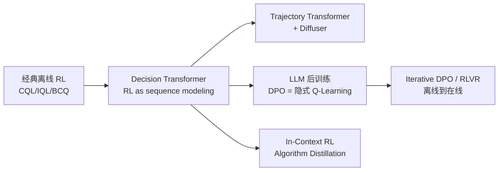

# 12.3 离线 RL 实验与 LLM 视角

> [12.2](./sequence-modeling) 把 RL 写成序列建模。本节把视角拉回 LLM 时代——你会发现 **DPO 本质上就是离线 RL 的特例**，理解这一点就能解释 LLM 后训练中的许多经验现象。

## LLM 时代的离线 RL 与 DPO 与偏好数据

至此读者可能已经意识到一个事实——**LLM 后训练的偏好数据集本质上就是一个离线 RL 数据集**。

### DPO 作为隐式 Q-Learning

[第 2 章 DPO](../chapter17_dpo/principles) 推导的 DPO 目标：

$$\mathcal{L}_{\text{DPO}} = -\mathbb{E}_{(x, y_w, y_l)}\left[\log \sigma\left(\beta \log \frac{\pi_\theta(y_w \mid x)}{\pi_{\text{ref}}(y_w \mid x)} - \beta \log \frac{\pi_\theta(y_l \mid x)}{\pi_{\text{ref}}(y_l \mid x)}\right)\right]$$

其形式上是分类损失。但 Rafailov et al. 2024（DPO 原作者）在后续论文 "From $r$ to $Q^*$" 里揭示了它的 RL 本质：**DPO 等价于一个隐式的、带 KL 约束的 Q-Learning**。

定义隐式优势函数：

$$\hat{A}(x, y) = \beta \log \frac{\pi_\theta(y \mid x)}{\pi_{\text{ref}}(y \mid x)}$$

注意这里没有显式 reward model——但可以证明存在一个隐式 reward 函数 $\hat{r}(x, y) = \beta \log(\pi_\theta / \pi_{\text{ref}}) + \beta \log Z(x)$，使得 $\hat{A}$ 是该 reward 下的优势函数。进一步，定义 token-level 价值：

$$Q^*(s_t, a_t) = \hat{r}(s_t, a_t) + \gamma \mathbb{E}_{s_{t+1}}\left[\max_{a'} Q^*(s_{t+1}, a')\right]$$

DPO 损失变为：

$$\mathcal{L} = -\mathbb{E}\left[\log \sigma\left(\hat{A}(x, y_w) - \hat{A}(x, y_l)\right)\right]$$

这正是 **preferential Bradley-Terry 模型对隐式优势的 softmax 损失**。DPO 训练完成时，$\hat{A}$ 自动满足一个隐式 Bellman 方程（推导见 Rafailov et al. 2024）。这意味着：

- **DPO 是离线 RL**：训练时不与 reward model 或 environment 交互，只用固定的 $(x, y_w, y_l)$ 数据集
- **DPO 的约束**：KL 到参考模型 $\pi_{\text{ref}}$，对应离线 RL 里的"不偏离行为策略太远"
- **DPO 没有外推误差**：因为它根本不用 max 算子——它直接从偏好数据学相对值，每个 $(x, y_w, y_l)$ 都来自行为策略 $\pi_{\text{ref}}$（即 SFT 模型），训练时新策略 $\pi_\theta$ 偏离 $\pi_{\text{ref}}$ 的程度被 KL 项 $\beta$ 严格限制。这与 CQL/IQL 的"保守约束"在数学结构上完全同构

理解了这一对应，就能解释 LLM 后训练中许多经验现象：$\beta$ 太小 → $\pi_\theta$ 偏离 $\pi_{\text{ref}}$ 太远 → reward hacking（相当于离线 RL 中策略飞向 OOD 区域）；$\beta$ 太大 → 保守过头 → 学不到东西。这与离线 RL 中 $\alpha$ 调节 CQL 保守性的 trade-off 完全一致。

### Preference Data 作为离线轨迹数据集

把 LLM 偏好数据集和 [第 12 章](../chapter11_continuous_control/intro) 的 D4RL 离线数据集对比：

| 维度 | D4RL (MuJoCo) | LLM Preference Data |
|------|---------------|----------------------|
| 状态 $s$ | 机器人关节角 | prompt $x$ |
| 动作 $a$ | 关节力矩 | response $y$ |
| 奖励 $r$ | 标量 reward | 偏好 $y_w \succ y_l$（隐式 reward） |
| 数据来源 | 某行为策略 $\pi_\beta$ | 人类标注 / RM 模型 |
| 训练目标 | $\max Q^\pi$ s.t. $\pi \approx \pi_\beta$ | $\max$ 隐式 reward s.t. $\pi \approx \pi_{\text{ref}}$ |
| 离线 RL 算法 | CQL / IQL / DT | DPO / IPO / KTO |

这种对应关系不是巧合——**DPO 本质上是离线 RL 在 LLM 上的特例**。理解了这一点，你就能理解为什么 LLM 后训练社区大量借鉴离线 RL 的工具：

- **IPO（Identity Preference Optimization）**：把 DPO 的 softmax 改为 squared loss，相当于离线 RL 中改变保守正则形式
- **KTO（Kahneman-Tversky Optimization）**：用单点（非偏好对）数据训练，相当于 advantage-weighted regression
- **Iterative DPO**：多轮采数据再训，本质是离线到在线（offline-to-online）RL 的 LLM 版本
- **RLHF with PPO**：本质上是用 RM 当环境做在线 RL，但每次采样仍受 KL 约束——和离线 RL 的"行为策略约束"一脉相承

### 序列建模视角的回归

DT 的思想在 LLM 时代获得了第二次生命。现代 LLM 本身就是序列模型，把 RL 后训练重新表述为"条件序列生成"几乎是自然的：

- **Process Reward Model + Search**（[第 21 章](../chapter20_prm_search/inference-time-search)）：把 reasoning trajectory 当作决策序列，PRM 作为 step-level reward，beam search 类似 Trajectory Transformer
- **Expert Iteration / STaR**：用当前模型生成 trajectory，过滤高 reward 轨迹，再 SFT——本质是 DT 的 iterative 版本
- **In-Context RL（Algorithm Distillation, Laskin et al. 2022）**：把整个 RL 学习历史作为 prompt，让 transformer 学会"在 context 里做 RL"——直接继承 DT 的"RL as sequence modeling" 哲学

::: tip 一句话总结
**离线 RL 是 LLM 后训练的母学科**。CQL/IQL 处理外推误差的智慧，DPO 用 KL 约束 + 偏好学习继承了下来；Decision Transformer 把 RL 重写为序列建模的洞察，让 RL 训练栈和 LLM 训练栈合二为一。理解本章，是理解 [第 13 章 模仿学习与反向 RL](../chapter13_imitation_meta_rl/intro)、[第 21 章 PRM 搜索](../chapter20_prm_search/inference-time-search)、以及 [第 26 章 Code World Model](../chapter23_rl_based_swe/world-model-and-deep-swe) 的前提。
:::

## 本章总结

1. **离线 RL 的核心矛盾是分布偏移**：固定数据集 + Q-Learning 的 max 算子 = 外推误差爆炸。所有算法都在解决"如何约束新策略不偏离数据分布"
2. **三大保守路线**：BCQ 约束动作空间、CQL 惩罚 OOD 的 Q 值、IQL 完全规避 max；以及工程化的 BC 正则路线（TD3+BC、AWAC）
3. **Decision Transformer 是范式革命**：抛弃 Bellman，把 RL 写成条件序列生成。RTG 作为控制变量，GPT 架构直接处理轨迹
4. **Trajectory Transformer + Diffuser** 进一步把"序列建模"推到联合轨迹分布建模与扩散生成
5. **DPO 本质上是离线 RL**：偏好数据集 = 离线轨迹数据集，KL 约束 = 行为策略约束，隐式 Q-Learning = DPO 损失

下一章 [第 13 章 模仿学习、反向 RL 与元 RL](../chapter13_imitation_meta_rl/intro) 我们处理另一类"无 reward signal" 的设定——只能观察专家行为，如何反推 reward 或策略；这与本章的离线 RL、以及 LLM 的 SFT/模仿学习有深厚联系。

## 延伸阅读

- [Fujimoto et al. 2019 "Off-Policy Deep Reinforcement Learning without Exploration" (BCQ)](https://arxiv.org/abs/1812.02900)
- [Kumar et al. 2020 "Conservative Q-Learning for Offline Reinforcement Learning" (CQL)](https://arxiv.org/abs/2006.04779)
- [Kostrikov et al. 2022 "Offline Reinforcement Learning with Implicit Q-Learning" (IQL)](https://arxiv.org/abs/2110.06169)
- [Fujimoto & Gu 2021 "A Minimalist Approach to Offline Reinforcement Learning" (TD3+BC)](https://arxiv.org/abs/2106.01345)
- [Nair et al. 2020 "AWAC: Accelerating Online Reinforcement Learning with Offline Data"](https://arxiv.org/abs/2006.09359)
- [Chen et al. 2021 "Decision Transformer: Reinforcement Learning via Sequence Modeling"](https://arxiv.org/abs/2106.01345)
- [Janner et al. 2021 "Offline Reinforcement Learning as One Big Sequence Modeling Problem" (Trajectory Transformer)](https://arxiv.org/abs/2106.02039)
- [Janner et al. 2022 "Planning with Diffusion for Flexible Behavior Synthesis" (Diffuser)](https://arxiv.org/abs/2205.09991)
- [Rafailov et al. 2023 "Direct Preference Optimization: Your Language Model is Secretly a Reward Model"](https://arxiv.org/abs/2305.18290)
- [Rafailov et al. 2024 "From r to Q*: Your Language Model is Secretly a Q-Function" (DPO 与 Q-Learning 的形式等价)](https://arxiv.org/abs/2404.12358)
- [Levine et al. 2020 "Offline Reinforcement Learning: Tutorial, Review, and Perspectives on Open Problems"](https://arxiv.org/abs/2005.01643)
- [Laskin et al. 2022 "In-Context Reinforcement Learning with Algorithm Distillation"](https://arxiv.org/abs/2210.07129)
