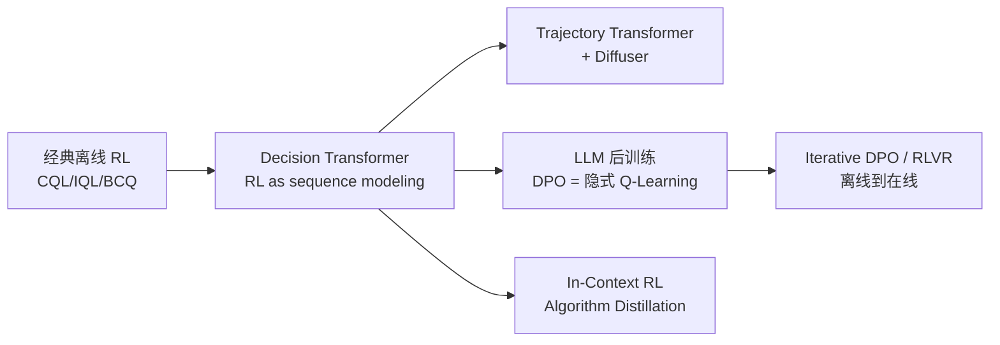

# 10.3 离线强化学习与偏好数据

## 本节导读

**核心内容**

- 理解为什么 DPO 本质上就是一种离线强化学习——偏好数据是固定数据集，参考策略对应"不偏离行为策略太远"的约束
- 把 LLM 偏好数据和传统 D4RL 离线数据集逐项对应起来，看清状态、动作、奖励在 LLM 场景下分别是什么
- 了解 Decision Transformer 开创的序列建模思路如何延伸到 LLM 推理搜索、in-context RL 等方向
- 理解这种跨领域类比能解释什么、又不能解释什么，避免把不同目标函数简单等同

上一节 [10.2](./sequence-modeling) 我们看到 Decision Transformer 如何把固定轨迹写成了序列建模问题，彻底抛开了 Bellman 方程。你可能会想：这思路和今天大语言模型的训练方式怎么这么像？都是用固定数据做监督学习，都是预测下一个 token……

让我们停下来想一下：LLM 的偏好优化（比如 DPO），是不是也符合"离线学习"的设定？是的！训练集已经给出了提示、较好回答和较差回答，训练期间你不能重新去问标注者"这两个回答到底哪个好"，也不能在线和环境交互修正——你只能用已经收集好的固定偏好数据。

这一节我们就来把这两个领域打通：先解释 DPO 与带 KL 约束的离线优化之间的深层联系，再把偏好数据和经典离线轨迹逐项对应起来，随后说明序列建模思路怎样进入 LLM 的推理搜索，最后指出这种类比能够解释什么、又不能替代什么——帮你建立一个统一的视角来看待机器人离线 RL 和大模型后训练。

## 1. 把 DPO 放回离线 RL

LLM 偏好数据和传统离线 RL 数据共享一个最关键的约束：训练只能使用已经收集好的样本，不能依靠新的环境交互立即修正分布外行为。这是它们最根本的共同点。不过，两类数据保存的反馈粒度很不一样，所以不能直接套用同一套目标函数——我们需要仔细看看它们之间是怎么对应的。

### 1.1 DPO 作为隐式 Q-Learning

我们在[第 14 章 DPO](../chapter17_dpo/dpo-objective-derivation)中推导过 DPO 的目标函数，先写出来回顾一下：

$$\mathcal{L}_{\text{DPO}} = -\mathbb{E}_{(x, y_w, y_l)}\left[\log \sigma\left(\beta \log \frac{\pi_\theta(y_w \mid x)}{\pi_{\text{ref}}(y_w \mid x)} - \beta \log \frac{\pi_\theta(y_l \mid x)}{\pi_{\text{ref}}(y_l \mid x)}\right)\right]$$

先别急着被这个式子吓到，我们只看括号里最核心的差值部分，一个符号一个符号来拆解：

- $x$：用户给的提示（prompt）
- $y_w$：偏好数据中标注为"较好"的那个回答（win）
- $y_l$：偏好数据中标注为"较差"的那个回答（lose）
- $\log(\pi_\theta(y \mid x) / \pi_{\text{ref}}(y \mid x))$：这是**对数概率比**，衡量当前模型 $\pi_\theta$ 相对于参考模型 $\pi_{\text{ref}}$（通常是 SFT 模型）把某个回答 y 的概率提高了多少倍
- $\beta$：温度系数，控制这个差值的尺度
- $\sigma(\cdot)$：sigmoid 函数，把差值映射到 0 到 1 之间，变成偏好概率

整个 loss 的作用很直观：让好回答 $y_w$ 相对于参考模型的对数概率比，减去坏回答 $y_l$ 相对于参考模型的对数概率比，这个差值越大越好——也就是**提高好回答的相对概率，同时降低坏回答的相对概率**。

这个目标看起来就是一个简单的二元分类损失（"好回答 vs 坏回答"分类），但 Rafailov et al. 2024 在后续论文 "From $r$ to $Q^*$" 中证明了一个非常深刻的结论：DPO 其实在隐式地学习一个带 KL 约束的 Q 函数——也就是说，**DPO 本质上就是一种隐式的离线 Q-Learning**。

我们来定义一个隐式优势函数（implicit advantage）：

$$\hat{A}(x, y) = \beta \log \frac{\pi_\theta(y \mid x)}{\pi_{\text{ref}}(y \mid x)}$$

注意，这里我们根本没有单独训练一个奖励模型！通过带 KL 约束的最优策略形式，我们可以反推出一个隐式奖励——而这个隐式奖励中和回答有关的部分，正好就是上面这个对数概率比。

如果我们把 LLM 生成回答的过程按 token 看成一段 MDP 中的序列决策（每生成一个 token 就是做一次动作选择），我们还可以进一步定义 token 级的 Q 函数：

$$Q^*(s_t, a_t) = \hat{r}(s_t, a_t) + \gamma \mathbb{E}_{s_{t+1}}\left[\max_{a'} Q^*(s_{t+1}, a')\right]$$

这样一来，DPO 损失就可以重写成我们非常熟悉的形式：

$$\mathcal{L} = -\mathbb{E}\left[\log \sigma\left(\hat{A}(x, y_w) - \hat{A}(x, y_l)\right)\right]$$

DPO 实际上是在使用回答对的相对顺序（好 vs 坏）来训练这个隐式优势函数——好回答的优势应该比坏回答的优势大，大越多越好。

::: details 加餐：DPO 与 Q-Learning 的完整等价性推导

完整的推导需要一些数学（从带 KL 约束的最优策略出发，利用 KL 散度的性质反推隐式奖励和 Q 函数），细节可以参考 Rafailov et al. 2024 的原论文。这里我们只需要记住三点最直接的结论，不需要死磕推导：

1. **DPO 确实是离线 RL**：训练时它既不和 reward model 在线交互，也不和环境交互，只能用固定的 $(x, y_w, y_l)$ 偏好数据集——这完全符合离线学习的定义
2. **DPO 的约束是什么？**：它要求当前策略不能偏离参考模型 $\pi_{\text{ref}}$ 太远（通过 KL 散度隐式约束）——这正好对应离线 RL 里"新策略不能偏离行为策略 $\pi_\beta$ 太远"的约束
3. **DPO 如何避开外推误差？**：它直接从偏好数据学习相对优劣关系，避免了显式的 $\max_a Q(s',a')$ 操作，也就避开了 Q-Learning 最容易出问题的外推路径。当然，偏好数据覆盖不足时仍然会有分布外泛化问题，所以独立评测永远是必要的
   :::

这个对应关系也帮我们理解了超参数 $\beta$ 的真正作用：它控制当前策略相对于参考策略的更新步长。

- β 太大：更新步子迈得太大，模型容易进入偏好数据没覆盖到的区域（OOD），生成奇怪的输出
- β 太小：更新太保守，好回答和坏回答的概率差拉不开，训练效果不明显

所以实践中调 DPO 的 β 时，不能只看训练集上的偏好准确率，还要同时监控 KL 散度（和参考模型的差距）、回答长度分布、以及最重要的——独立评测集上的实际效果。

## 2. 把偏好数据看作固定数据集

为了让这个对应关系更清楚，我们把 LLM 偏好数据集和[第 9 章](../chapter11_continuous_control/ddpg)里大家熟悉的 D4RL 离线数据集（MuJoCo 机器人控制任务）逐项对比：

| 维度             | D4RL (MuJoCo)                             | LLM Preference Data                                    |
| ---------------- | ----------------------------------------- | ------------------------------------------------------ |
| 状态 $s$         | 机器人关节角、速度等                      | prompt $x$（对话上下文）                               |
| 动作 $a$         | 关节力矩（控制信号）                      | response $y$（模型生成的回答）                         |
| 奖励 $r$         | 标量 reward（由环境给出）                 | 偏好 $y_w \succ y_l$（隐式 reward，只有相对顺序）      |
| 数据来源         | 某行为策略 $\pi_\beta$ 与环境交互         | 人类标注 / RM 模型打分给出偏好对                       |
| 训练目标         | $\max Q^\pi$ s.t. $\pi \approx \pi_\beta$ | $\max$ 隐式 reward s.t. $\pi \approx \pi_{\text{ref}}$ |
| 对应离线 RL 算法 | CQL / IQL / DT                            | DPO / IPO / KTO                                        |

是不是瞬间清晰了？一旦你建立了这张对应表，你会发现 LLM 后训练里的很多算法，其实都能在经典离线 RL 里找到对应的思路：

- **IPO（Identity Preference Optimization）**：把 DPO 的 sigmoid 交叉熵损失改成了平方损失，这本质上相当于离线 RL 中改变了保守正则的形式
- **KTO（Kahneman-Tversky Optimization）**：它不需要偏好对，只用单点数据（只要知道某个回答是好还是坏）就能训练，这对应于离线 RL 里的 advantage-weighted regression（就是我们上一节讲 IQL 和 AWAC 时用的 AWR）
- **Iterative DPO（迭代 DPO）**：多轮用当前模型生成回答、收集偏好、再训练，这让原本纯离线的优化逐步转向 Offline-to-Online 的更新方式（类似 AWAC 支持的离线预训练+在线微调）
- **RLHF with PPO**：它用奖励模型提供逐 token 的分数作为训练反馈，同时用 KL 约束限制策略偏移；但 PPO 会不断用当前策略采样新回答去和 RM 交互，所以它不再是纯离线训练了——这一点要和 DPO 区分开

## 3. 序列模型怎样连接推理与搜索

LLM 本身就是巨大的序列模型，所以上一节讲的 Decision Transformer 的轨迹表示思路，不仅能用在机器人控制上，还可以很自然地延伸到 LLM 的推理与搜索任务中。我们来看几个典型的例子：

- **Process Reward Model + 推理时搜索**（见[第 17 章](../chapter20_prm_search/inference-time-search)）：我们可以把 LLM 做数学推理的 thinking trajectory 看成一段决策序列，过程监督模型（PRM）给每一步推理打 step-level reward，然后用 beam search、MCTS 等方法搜索好的推理轨迹——这和 Trajectory Transformer 用 beam search 最大化整条轨迹回报几乎是一模一样的思路
- **Expert Iteration / STaR**：先用当前模型生成一批推理轨迹，过滤出能得到正确答案的高奖励轨迹，再用这些轨迹做 SFT 微调。它和 DT 一样依赖轨迹数据，但它会通过多轮"生成-过滤-训练"不断更新数据分布
- **In-Context RL（上下文强化学习，代表工作 Algorithm Distillation, Laskin et al. 2022）**：把一整个 RL 学习历史（多回合的训练数据）作为 prompt 喂给 transformer，让 transformer 学会"在 context 里直接做 RL"——给它一段新的交互历史，它就能自动输出越来越好的动作，完全不需要梯度更新。这直接继承了 Decision Transformer 开创的"RL as sequence modeling"哲学

我们用一张 mermaid 图把这些发展脉络串起来：

```mermaid
graph LR
  A[经典离线 RL<br/>CQL/IQL/BCQ] --> B[Decision Transformer<br/>RL as sequence modeling]
  B --> C[Trajectory Transformer<br/>+ Diffuser]
  B --> D[LLM 后训练<br/>DPO = 隐式 Q-Learning]
  B --> E[In-Context RL<br/>Algorithm Distillation]
  D --> F[Iterative DPO / RLVR<br/>离线到在线]
```

从这张图你可以清晰地看到：Decision Transformer 虽然是为机器人离线 RL 设计的，但它的"把序贯决策看成序列生成"的核心思想，实际上打通了传统 RL 和大语言模型这两个领域。

## 4. 离线视角能解释哪些后训练现象

离线 RL 给我们提供了一套非常有用的工具，来理解 LLM 后训练中出现的各种现象：

- 为什么纯 SFT 之后模型能力会到一个瓶颈？因为纯 BC 只会模仿数据的平均水平，不会主动偏向高回报动作
- 为什么 DPO 训练时 KL 很重要？因为 KL 控制策略偏移，这对应离线 RL 里的"不能离数据分布太远"约束——KL 爆了就会触发类似外推误差的问题，输出奇怪的东西
- 为什么 Iterative DPO/在线 RLHF 通常比一次纯离线 DPO 效果好？因为增加了在线交互/数据回流，类似 offline-to-online RL，能修正纯离线学习的分布局限
- 为什么推理时搜索（beam search、MCTS）往往能直接提升效果？因为这对应于 model-based planning，在不改变模型参数的情况下，通过搜索找到更好的轨迹——这就是 Trajectory Transformer 的思路

这些联系也为我们后面的章节提供了一个统一的数据视角：不管是[第 11 章模仿学习与逆向 RL](../chapter13_imitation_meta_rl/bc-dagger)、[第 17 章 PRM 推理搜索](../chapter20_prm_search/inference-time-search)，还是[第 20 章 Code World Model](../chapter23_rl_based_swe/world-model-and-deep-swe)，它们本质上都是在处理"怎样从固定的、有限的反馈数据中学习好策略"这个问题。

但是，这里必须给你一个重要提醒：**类比是帮助理解的工具，不是等同关系**。这些方法的训练信号并不相同：

- 经典离线 RL 通常保存了逐步的状态、动作和标量奖励
- DPO 这类偏好优化只有回答之间的相对顺序，没有逐 token 的绝对奖励
- 纯序列建模方法则只依赖轨迹中已经出现过的行为，连奖励信号都可能不需要

我们把它们放在同一张图里讨论，是为了比较"固定数据怎样限制策略更新"这个共同问题，**绝对不能把这三种目标函数简单视为同一种算法**——它们的数学形式、适用场景、实际效果都有很大差别。

## 本章总结

这一章我们完整走完了离线强化学习的两条主要路线，并且看到了它如何帮助我们理解大语言模型的后训练：

1. **固定数据会产生分布偏移**：Q-Learning 中的 max 算子可能选中数据集外的动作，神经网络在 OOD 区域的外推是任意的，这种误差还会通过 Bellman 备份被几何级数放大（γ=0.99 时约 100 倍），导致训练崩溃
2. **保守估值路线解决这个问题的三种方式**：BCQ 直接约束动作只能在数据分布附近选，CQL 主动加正则惩罚压低 OOD 动作的 Q 值，IQL 走得最彻底——用 expectile regression 学习 V，完全避免对数据外动作取 max
3. **工程化的 BC 正则路线同样有效**：TD3+BC 直接在 Actor loss 上加 L2 行为克隆项，简单且效果强；AWAC 用优势加权做"非均匀模仿"，还支持离线到在线的平滑过渡；它们和 IQL 的策略损失很像，核心区别在是否还会在 target 里 max OOD 动作
4. **序列建模路线完全跳出 Bellman 框架**：Decision Transformer 用 return-to-go 作为条件，把轨迹排成 (R,s,a) 三元组，用 GPT 做纯监督学习，实现简单且兼容 LLM 训练栈；Trajectory Transformer 用 beam search 做显式规划；Diffuser 用扩散模型直接生成整条轨迹，stitching 能力更强
5. **离线 RL 视角可以帮我们理解 LLM 后训练**：偏好数据就是固定数据集，参考模型的 KL 约束对应"不偏离行为策略太远"，DPO 可以看作隐式的离线 Q-Learning；Decision Transformer 的序列建模思想还延伸到了 PRM 搜索、in-context RL 等方向

学完这一章你应该建立一个概念：**凡是"不能在线交互、只能用已有历史数据学习策略"的问题，本质上都是离线学习问题，都需要考虑分布偏移和保守性**——这个原则不管是在机器人控制、推荐系统、还是大语言模型对齐中，都是通用的。

下一章[第 11 章模仿学习、逆强化学习与元强化学习](../chapter13_imitation_meta_rl/bc-dagger)，我们来处理另一类缺少奖励信号的设定：如果连标量奖励或者偏好对比都没有，只能观察到专家的行为，我们要怎么学习策略，甚至反过来推断出专家背后的奖励函数？

## 延伸阅读

- [Fujimoto et al. 2019 "Off-Policy Deep Reinforcement Learning without Exploration" (BCQ)](https://arxiv.org/abs/1812.02900)
- [Kumar et al. 2020 "Conservative Q-Learning for Offline Reinforcement Learning" (CQL)](https://arxiv.org/abs/2006.04779)
- [Kostrikov et al. 2022 "Offline Reinforcement Learning with Implicit Q-Learning" (IQL)](https://arxiv.org/abs/2110.06169)
- [Fujimoto & Gu 2021 "A Minimalist Approach to Offline Reinforcement Learning" (TD3+BC)](https://arxiv.org/abs/2106.06860)
- [Nair et al. 2020 "AWAC: Accelerating Online Reinforcement Learning with Offline Data"](https://arxiv.org/abs/2006.09359)
- [Chen et al. 2021 "Decision Transformer: Reinforcement Learning via Sequence Modeling"](https://arxiv.org/abs/2106.01345)
- [Janner et al. 2021 "Offline Reinforcement Learning as One Big Sequence Modeling Problem" (Trajectory Transformer)](https://arxiv.org/abs/2106.02039)
- [Janner et al. 2022 "Planning with Diffusion for Flexible Behavior Synthesis" (Diffuser)](https://arxiv.org/abs/2205.09991)
- [Rafailov et al. 2023 "Direct Preference Optimization: Your Language Model is Secretly a Reward Model"](https://arxiv.org/abs/2305.18290)
- [Rafailov et al. 2024 "From r to Q\*: Your Language Model is Secretly a Q-Function" (DPO 与 Q-Learning 的形式等价)](https://arxiv.org/abs/2404.12358)
- [Levine et al. 2020 "Offline Reinforcement Learning: Tutorial, Review, and Perspectives on Open Problems"](https://arxiv.org/abs/2005.01643)
- [Laskin et al. 2022 "In-Context Reinforcement Learning with Algorithm Distillation"](https://arxiv.org/abs/2210.14215)
