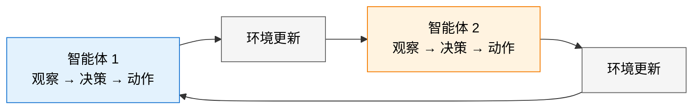

# 动手：用 PettingZoo 做多智能体 RL

到目前为止，我们所有的实验都只有一个智能体：一个 DQN 学打游戏，一个 PPO 学对齐大模型。但真实世界很少是单打独斗的——自动驾驶车辆需要在车流中协调，机器人团队需要分工合作，大模型系统可能需要多个角色（Coder、Reviewer、Tester）协同工作。

这就是**多智能体强化学习（Multi-Agent RL, MARL）**的领域。而 [PettingZoo](https://github.com/Farama-Foundation/PettingZoo) 就是 MARL 的 Gymnasium——由同一个团队（Farama 基金会）维护，提供统一的多智能体环境 API。

## 从单智能体到多智能体：什么变了？

|            | 单智能体（Gymnasium）  | 多智能体（PettingZoo）               |
| ---------- | ---------------------- | ------------------------------------ |
| 智能体数量 | 1 个                   | 2 个到数百个                         |
| 环境平稳性 | 平稳（环境规则不变）   | 非平稳（其他智能体也在学习改变）     |
| 信用分配   | 无需（好坏都是自己的） | 核心难题（团队成功，功劳归谁？）     |
| 探索策略   | ε-greedy / 熵正则      | 还要考虑其他智能体是否会利用你的探索 |
| 代表算法   | DQN / PPO / SAC        | QMIX / MAPPO / MADDPG                |

最大的质变是**非平稳性**：当你学习新策略时，对手/队友也在学习，导致你面对的"环境"在不断变化。这打破了单智能体 RL 的基本假设——固定 MDP。

## PettingZoo 环境概览

PettingZoo 提供了多个环境家族：

```bash
pip install pettingzoo
```

| 家族        | 类型      | 代表环境                                      | 描述                       |
| ----------- | --------- | --------------------------------------------- | -------------------------- |
| `classic`   | 博弈论    | `chess_v3`, `connect_four_v3`, `tictactoe_v3` | 经典棋盘游戏，回合制对抗   |
| `butterfly` | 合作/竞争 | `cooperative_pong_v5`, `pistonball_v6`        | 需要多个智能体协作完成目标 |
| `mpe`       | 混合      | `simple_adversary_v3`, `simple_spread_v3`     | 多粒子环境，沟通与导航     |
| `sisl`      | 对抗/合作 | `pursuit_v4`, `waterworld_v4`                 | 追逃、资源收集             |
| `atari`     | 对抗      | `pong_v3`                                     | 多智能体版 Atari           |

## 快速上手：四子棋

四子棋（Connect Four）是最简单的多智能体环境之一——两个智能体轮流落子：

```python
from pettingzoo.classic import connect_four_v3

env = connect_four_v3.env(render_mode="human")
env.reset()

for agent in env.agent_iter():
    observation, reward, termination, truncation, info = env.last()

    if termination or truncation:
        action = None
    else:
        # observation 是一个字典，包含 observation 和 action_mask
        mask = observation["action_mask"]
        valid_actions = [i for i, m in enumerate(mask) if m == 1]
        action = valid_actions[0]  # 简单策略：选第一个合法位置

    env.step(action)

env.close()
```

PettingZoo 使用 **AEC（Agent Environment Cycle）模型**：智能体轮流行动，每次只有一个智能体执行动作。这和 Gymnasium 的"单步交互"模式不同。



## 实战：多粒子环境中的协作导航

`simple_spread` 是多智能体 RL 的经典基准：N 个智能体需要协作覆盖地图上的 N 个目标点，同时避免碰撞。

```python
from pettingzoo.mpe import simple_spread_v3
import numpy as np

env = simple_spread_v3.env(N=3, local_ratio=0.5, max_cycles=100)
env.reset()

total_rewards = {agent: 0 for agent in env.agents}

for agent in env.agent_iter():
    obs, reward, termination, truncation, info = env.last()

    if termination or truncation:
        action = None
    else:
        # 随机策略作为基线
        action = env.action_space(agent).sample()

    env.step(action)
    if reward is not None:
        total_rewards[agent] += reward

print("各智能体累积奖励:")
for agent, reward in total_rewards.items():
    print(f"  {agent}: {reward:.2f}")

env.close()
```

关键参数 `local_ratio=0.5` 控制奖励中"全局奖励"和"局部奖励"的比例——这正是多智能体信用分配问题的体现。

## 训练多智能体策略

多智能体 RL 的训练比单智能体复杂得多。以下是使用独立 PPO（IPPO）的简单方案——每个智能体用独立的 PPO 策略，彼此不共享参数：

```python
from pettingzoo.mpe import simple_spread_v3
from stable_baselines3 import PPO
from stable_baselines3.common.vec_env import DummyVecEnv
import supersuit as ss

# 创建环境
env = simple_spread_v3.env(N=3)

# 使用 SuperSuit 将 PettingZoo 环境转换为 Stable-Baselines3 兼容格式
# 每个 agent 获得独立的观测，训练独立的策略
env = ss.pettingzoo_env_to_vec_env_v1(env)
env = ss.concat_vec_envs_v1(env, 8, num_cpus=1, base_env="single")

# 训练（所有 agent 共享同一个策略网络）
model = PPO("MlpPolicy", env, verbose=1, learning_rate=3e-4, n_steps=2048)
model.learn(total_timesteps=200_000)
model.save("./models/ippo_simple_spread")
```

::: tip
这里所有智能体共享同一个策略网络（参数共享，Parameter Sharing），这在智能体角色相同的环境（如 simple_spread）中是标准做法。如果智能体角色不同（如追逃游戏中的追捕者和逃跑者），则需要各自独立的网络。
:::

## 多智能体 RL 的核心算法谱系

| 算法       | 核心思路                           | 适用场景                |
| ---------- | ---------------------------------- | ----------------------- |
| **IPPO**   | 每个智能体独立运行 PPO             | 基线方法，角色相同      |
| **MAPPO**  | PPO + 全局价值函数（CTDE）         | 需要协作的团队任务      |
| **QMIX**   | 混合网络保证局部 Q 值与全局 Q 单调 | 合作型任务              |
| **MADDPG** | 每个智能体用 DDPG + 全局 Critic    | 连续动作，混合合作/竞争 |

其中 **CTDE（集中式训练，分布式执行）** 是当前 MARL 的主流范式：

- **训练时**：Critic 可以看到所有智能体的观测和动作（"上帝视角"）
- **执行时**：每个智能体只能根据自己的局部观测做决策

这解决了非平稳性问题——训练时 Critic 知道全局信息，可以稳定地评估每个智能体的动作价值。

## 从多智能体到 Agentic RL

PettingZoo 中的多智能体是"同一环境中多个 RL 智能体"。而第 12 章讨论的 Agentic RL 则是"一个智能体与外部工具和环境交互"。两者的交汇点是**多智能体大模型协作**——多个 LLM Agent 扮演不同角色，通过 RL 学会协作完成复杂任务。这被认为是 2025-2026 年 RL 最前沿的研究方向之一。

## 小结

- PettingZoo 是 MARL 的标准环境库，提供经典博弈、合作任务、粒子导航等多种环境
- 多智能体 RL 的核心挑战是非平稳性和信用分配
- CTDE（集中式训练，分布式执行）是当前主流范式
- IPPO 是最简单的起步方案，MAPPO/QMIX 是更强的进阶选择
