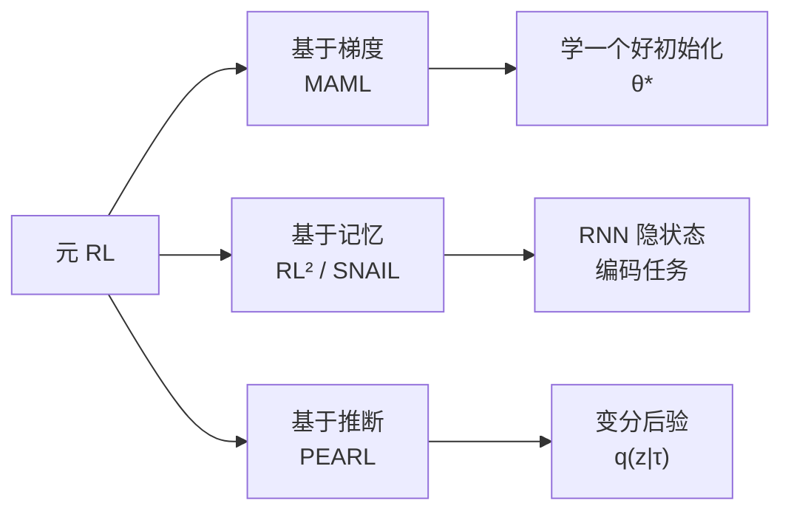
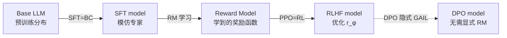

# 13.3 元 RL 与 MAML、RL²、PEARL、In-Context RL

> [13.2](./irl-gail) 讲了从专家反推 reward。本节处理另一种特殊场景：**环境本身在不断变化**。元 RL（Meta-RL）让 agent 学会"快速适应新任务"的能力——在多个相关任务上预训练后，面对新任务时只需几次交互就能掌握。

## MAML、RL²、PEARL

前面所有算法假设任务是固定的。但真实场景中任务常变：机器人换工件、自动驾驶换城市、LLM 换领域。**元 RL**（Meta-RL）的目标是**学习如何快速学习**——用大量相似任务训练，让智能体在新任务上用极少样本适应。

### 三种元 RL 范式



### 学一个好初始化

Model-Agnostic Meta-Learning（Finn et al. 2017）的核心思想：找一个初始化 $\theta^*$，使得**一两步梯度下降就能适应新任务**。

外层目标：

$$\min_{\theta} \; \mathbb{E}_{T_i \sim p(T)}\left[\mathcal{L}_{T_i}\left(\theta - \alpha \nabla_\theta \mathcal{L}_{T_i}(\theta)\right)\right]$$

内层用一步 SGD 得到 $\theta_i' = \theta - \alpha \nabla_\theta \mathcal{L}_{T_i}(\theta)$，外层评估 $\theta_i'$ 在 $T_i$ 上的损失。需要**二阶梯度**（梯度下降的梯度）：

$$\nabla_\theta \mathcal{L}_{T_i}(\theta_i') = \nabla_{\theta_i'} \mathcal{L}_{T_i}(\theta_i') \cdot (I - \alpha \nabla^2_\theta \mathcal{L}_{T_i}(\theta))$$

实践中常用**一阶近似 FOMAML**：忽略 Hessian 项，只保留 $\nabla_{\theta_i'} \mathcal{L}_{T_i} \cdot (-\alpha \nabla_\theta)$，大幅降低计算成本。

```python
def maml_meta_update(meta_policy, tasks, inner_lr=0.1, outer_lr=0.001):
    meta_grad = 0
    for task in tasks:
        # === 内层：复制参数，几步 SGD 适应 ===
        theta_prime = meta_policy.params.clone()
        for _ in range(n_inner_steps):
            inner_loss = task.compute_loss(theta_prime)
            theta_prime -= inner_lr * grad(inner_loss, theta_prime)

        # === 外层：评估 adapted 参数，反传到 meta 参数 ===
        outer_loss = task.compute_loss(theta_prime)
        # 这里用 autograd 自动处理二阶梯度
        g = grad(outer_loss, meta_policy.params)
        meta_grad += g

    meta_policy.params -= outer_lr * meta_grad / len(tasks)
```

### 把任务编码进 RNN 隐状态

Duan et al. 2016 提出的 RL² 走另一条路：**整个 RL 算法被压缩进 RNN 的隐状态转移**。

设定：跨多个 episode 训练一个 RNN 策略 $\pi_\theta(a_t \mid h_t)$，其中 $h_t = f_\theta(h_{t-1}, s_{t-1}, a_{t-1}, r_{t-1}, \text{done})$。一个 episode 内的交互历史（reward、transition）通过隐状态积累，让策略在**同一任务的后几步**做出更优决策——这等价于策略在"学习"当前任务。

关键：跨 episode 时**不重置隐状态**（在 meta-training 时），让 RNN 学会"用前几轮的 reward 推断任务"。这就是**算法学习的隐式版本**——RL² 不指定学习算法，让网络自己学。

### PEARL 与 变分任务推断

Probabilistic Embeddings for Actor-Critic RL（Rakelly et al. 2019）显式建模"任务后验"。设任务由隐变量 $z \sim p(z)$ 决定（如目标位置、摩擦系数），策略 $\pi_\theta(a \mid s, z)$ 条件于 $z$。

适应就是推断后验 $q_\phi(z \mid \tau_{1:K})$——给定少量经验 $\tau$，输出任务嵌入 $z$。训练目标结合 ELBO 与 RL 损失：

$$\mathcal{L} = -\mathbb{E}_{z \sim q_\phi}\left[\sum_t r(s_t, a_t, z)\right] + \beta \cdot D_{\text{KL}}\left(q_\phi(z \mid \tau) \,\|\, p(z)\right)$$

PEARL 在 Meta-World（50 个机器人任务）上仅用 5 步适应就能达到 80% 性能，远超 MAML（需要 50+ 步）。

| 方法 | 适应机制 | 是否二阶梯度 | 样本效率 | 推断方式 |
|------|---------|-------------|----------|---------|
| MAML | 梯度下降 | ✅（一阶近似可避免） | 中 | 显式更新参数 |
| RL² | RNN 隐状态 | ❌（端到端训练） | 高 | 隐式（黑盒） |
| PEARL | 变分后验 $q(z\mid\tau)$ | ❌ | 最高 | 显式（可解释） |

### 元 RL 与 few-shot 学习

元 RL 与监督 few-shot learning 共享思想：**用大量相似任务训练先验，新任务上少量样本快速适应**。这一思想直接启发了 LLM 的 in-context learning——见下一节。

## In-Context RL 与 Algorithm Distillation 与 Algorithm Distillation

RL² 的隐式"任务推断"在 transformer 时代迎来复兴。DeepMind 2022 的两篇论文——**Algorithm Distillation**（Laskin et al.）与 **Decision Pretrained Transformer**（Lee et al.）——证明：**transformer 的 in-context 能力可以蒸馏整个 RL 算法**。

### 把 RL 历史当作序列建模

给定一个跨多任务的 RL 训练 run，每条轨迹 $\tau = (s_0, a_0, r_0, s_1, a_1, r_1, \ldots)$。Algorithm Distillation 的关键洞察：

> 沿一个 RL 训练 run 的进度看，**早期 episode 是菜鸟策略，后期 episode 是专家策略**。如果让 transformer 预测"给定前 $k$ 个 episode 的历史，下一个 action 是什么"，它必须**在上下文中学到从菜鸟到专家的改进过程**——即隐式学到 RL 算法本身。

数据组织：

```
[episode_1 (poor policy): s0 a0 r0 s1 a1 r1 ... | 
 episode_2 (slightly better): s0 a0 r0 ... |
 ...
 episode_N (expert): s0 a0 r0 ...]
            ↑
     transformer 输入：concat 所有历史
     目标：预测每个 episode 内的 next action
```

### 与 RL² 的区别

| 维度 | RL² | Algorithm Distillation |
|------|------|----------------------|
| 模型 | 小 RNN（LSTM/GRU） | 大 transformer |
| 数据 | 在线 meta-training | **离线**学习历史 |
| in-context 学什么 | 任务 ID（隐式） | **RL 算法本身** |
| 跨算法泛化 | 单一算法 | 可蒸馏 DQN、PPO、A2C 等 |

AD 的关键实验：训练时只用 PPO 的历史，但 transformer 在测试时**能执行从未见过的 RL 算法的功能**——因为它学到了"如何用 reward 改进策略"的通用机制。

```python
def algorithm_distillation_data_generate(env, rl_algorithm, n_runs=1000, n_episodes_per_run=200):
    """收集 AD 训练数据：跨多个 run，每个 run 是一段 RL 学习过程"""
    dataset = []
    for run in range(n_runs):
        policy = init_random_policy()
        run_history = []
        for ep in range(n_episodes_per_run):
            trajectory = rollout(env, policy)
            run_history.append(trajectory)
            # 在线 RL 算法更新策略（DQN/PPO/A2C 任选）
            policy = rl_algorithm.update(policy, trajectory)
        # 每个 run 是一个训练样本：完整学习曲线
        dataset.append(run_history)
    return dataset


def ad_inference(transformer, env, n_adapt_episodes=10):
    """测试时 transformer 在新环境上 in-context 学习"""
    context = []  # 累积历史
    for ep in range(n_adapt_episodes):
        s = env.reset()
        done = False
        while not done:
            # 关键：action 由 transformer 基于 context 预测
            a = transformer.predict_next_action(context, s)
            s_next, r, done = env.step(a)
            context.append((s, a, r))
            s = s_next
        # 注意：transformer 参数不更新！只在 context 中"学习"
```

### Decision Transformer 与 另一条路线

Decision Transformer（Chen et al. 2021）更早揭示了 RL 可以转化为序列建模：把 $(R, s, a)$ 三元组喂给 transformer，$R$ 是 return-to-go。条件于目标回报 $R^*$，模型生成能达到该回报的动作。

$$a_t = \text{Transformer}\left(R_t, s_t, a_{t-1}, R_{t-1}, s_{t-1}, \ldots\right)$$

DT 不是 in-context RL——它是**条件策略**。但它启发了后续的 Online DT、Elastic DT 等，逐步与 in-context RL 合流。

### In-Context RL 与 LLM 的连接

LLM 的 in-context learning 历史与 in-context RL 高度平行：

- **GPT-3 的 in-context learning**（2020）：在 prompt 里给几个例子，模型不更新参数就学会任务——这是**监督学习**的 in-context 版本
- **Algorithm Distillation 的 in-context RL**（2022）：在 context 里给几条带 reward 的轨迹，模型不更新参数就学会 RL——这是**强化学习**的 in-context 版本

两者都依赖 transformer 的**归纳推理**能力。这解释了为什么 LLM 在 RLHF 之后会涌现"在上下文中改善"的能力——transformer 编码了某种隐式的 RL 机制。

## 与 LLM SFT/RLHF 的连接

把前五节的概念映射到 LLM 训练，会发现**整个 LLM 后训练栈是模仿学习 + RL 的组合**。

### SFT 就是行为克隆

回顾 [第 15 章 RLHF](../chapter15_rlhf/base-model-to-assistant)的 SFT 损失：

$$\mathcal{L}_{\text{SFT}}(\theta) = -\sum_{t=1}^T \log \pi_\theta(y_t \mid x, y_{<t})$$

这正是 14.1 节的行为克隆损失——$(x, y)$ 是"专家示范"，$\pi_\theta$ 是策略。SFT 的所有问题都是 BC 的经典问题：

- **分布偏移**：训练时专家状态是高质量指令-回答，部署时模型生成的下一步 token 会偏离
- **错误累积**：一旦生成 token 偏离，后续 token 在"未见过的状态"上更易出错
- **覆盖不足**：SFT 数据集无法覆盖模型部署时会访问的所有状态

RLHF 的 PPO 阶段本质上是在做"DAgger 的自动化版本"——让模型在自己生成的轨迹上接受奖励反馈，逐步把训练分布拉回部署分布。

### InstructGPT 三阶段重读

InstructGPT（Ouyang et al. 2022）的三阶段可以重新解读为：



1. **SFT 阶段 = 行为克隆**：从人类示范学行为格式
2. **RM 阶段 = 反向 RL 的近似**：从偏好数据反推"奖励函数"——这是 LLM 版本的 MaxEnt IRL 思想（虽然具体用 Bradley-Terry 模型而非最大熵）
3. **PPO 阶段 = 前向 RL**：用学到的奖励函数做 on-policy 优化，解决 SFT 的分布偏移

[第 9 章 DPO](../chapter17_dpo/dpo-theory-and-family)可以看作 GAIL 的简化版本：DPO 的隐式奖励 $\log \pi_\theta(y_w \mid x) - \log \pi_\theta(y_l \mid x) - \log \pi_{\text{ref}}(y_w \mid x) + \log \pi_{\text{ref}}(y_l \mid x)$ 正是把"专家 vs 非专家"的判别学习内化进策略本身。

### 元 RL 视角下的 LLM 适应

LLM 的 few-shot in-context learning 可以看作"**RL² 的零样本版本**"：

- RL²：跨任务 meta-training，RNN 隐状态隐式编码任务
- LLM in-context：跨语料预训练，context window 隐式编码任务

两者都是"**不更新参数，只看 context 就能适应**"。Algorithm Distillation 揭示了 transformer 的 in-context 能力可以编码完整 RL 算法——这暗示**RLHF 训练后的 LLM 在某种程度上"内化了 RL 过程"**，能在推理时通过 context 持续改进。

### 离线模仿学习与 DPO 的家族

[第 12 章 离线 RL](../chapter12_offline_rl/intro)与本章合流：当只有**专家示范 + 次优数据**时，离线模仿学习（DemoDICE、SMILe、DWBC）用保守估计避免高估次优动作，与 DPO 的"显式参考策略正则"思想同源。

::: tip 为什么本章重要
理解本章，你会看清 LLM 后训练的本质：
- SFT 不是魔法，是 30 年前的行为克隆
- RLHF 不是凭空发明的奖励，是反向 RL 的工业实现
- DPO 不是新理论，是 GAIL 在 LLM 上的对偶形式
- In-context RL 揭示了 LLM 的 few-shot 能力本质上是一种隐式 RL
:::

## 本章总结

模仿学习、反向 RL、元 RL 三大主题回答了经典 RL 之外的核心问题：

1. **行为克隆（BC）** 把模仿学习当作监督学习，但受**分布偏移**困扰；**DAgger** 通过迭代收集失败状态修复
2. **MaxEnt IRL** 从专家示范反推奖励函数，但配分函数 $Z$ 计算昂贵
3. **GAIL** 用 GAN 对抗训练隐式表达奖励，是 LLM 时代 DPO 的理论前身
4. **元 RL** 学习"如何快速学习"：MAML 学好初始化、RL² 把算法压缩进 RNN、PEARL 显式推断任务后验
5. **In-Context RL / Algorithm Distillation** 把整个 RL 算法蒸馏进 transformer 的 in-context 能力，连接到 LLM 的 few-shot 学习
6. **LLM 后训练**可重写为 BC（SFT）+ 反向 RL（RM）+ 前向 RL（PPO），DPO 是 GAIL 的对偶形式

下一章 [第 15 章 探索、MARL 与分层 RL](../chapter14_exploration_marl_hierarchical/intro)转向另外三个进阶主题：当奖励稀疏时如何探索、当多个智能体互动时如何训练、当 horizon 极长时如何分层规划。

## 延伸阅读

- [Pomerleau 1989 "ALVINN: An Autonomous Land Vehicle in a Neural Network"（最早的 BC）](https://papers.nips.cc/paper/95-alvinn-an-autonomous-land-vehicle-in-a-neural-network)
- [Ross, Gordon & Bagnell 2011 "A Reduction of Imitation Learning and Structured Prediction to No-Regret Online Learning"（DAgger）](https://arxiv.org/abs/1011.0686)
- [Ziebart et al. 2008 "Maximum Entropy Inverse Reinforcement Learning"](https://www.aaai.org/Papers/AAAI/2008/AAAI08-227.pdf)
- [Ho & Ermon 2016 "Generative Adversarial Imitation Learning"（GAIL）](https://arxiv.org/abs/1606.03476)
- [Finn, Abbeel & Levine 2017 "Model-Agnostic Meta-Learning for Fast Adaptation of Deep Networks"（MAML）](https://arxiv.org/abs/1703.03400)
- [Duan et al. 2016 "RL²: Fast Reinforcement Learning via Slow Reinforcement Learning"](https://arxiv.org/abs/1611.02779)
- [Rakelly et al. 2019 "Efficient Off-Policy Meta-Reinforcement Learning via Probabilistic Context Variables"（PEARL）](https://arxiv.org/abs/1903.08254)
- [Laskin et al. 2022 "In-Context Reinforcement Learning with Algorithm Distillation"](https://arxiv.org/abs/2210.07139)
- [Lee et al. 2022 "Decision Pretrained Transformer"](https://arxiv.org/abs/2206.15474)
- [Chen et al. 2021 "Decision Transformer: Reinforcement Learning via Sequence Modeling"](https://arxiv.org/abs/2106.01345)
