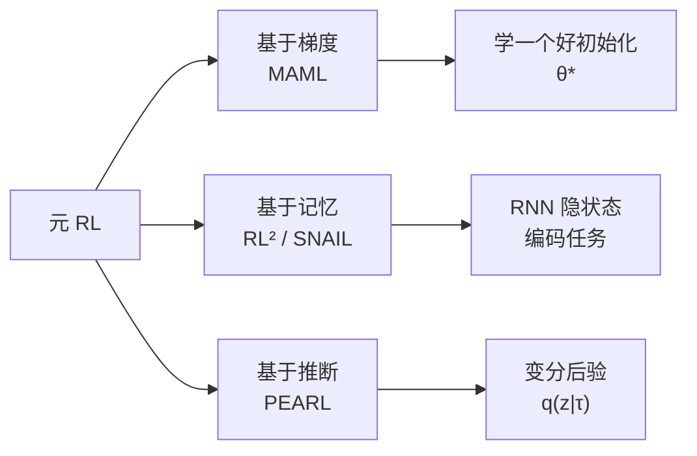
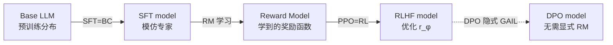

# 11.3 元强化学习与上下文适应

## 本节导读

**核心内容**

- 理解元 RL（Meta-RL）的核心问题：不是学一个任务的策略，而是学"如何快速学习新任务"——也就是学会学习
- 掌握三种经典元 RL 机制：MAML 学一个好的初始化、RL² 把学习过程编码进 RNN 隐状态、PEARL 显式推断任务隐变量
- 理解 Algorithm Distillation 如何把整个 RL 学习过程蒸馏进 Transformer 的上下文窗口，实现 in-context RL
- 看到 Decision Transformer 如何把 RL 转化为序列建模问题，以及它和 LLM 中 in-context learning 的深刻联系
- 最后把这些概念全部映射回 LLM 后训练：SFT=BC、奖励模型=IRL、PPO=前向 RL、DPO=GAIL 的隐式版本

前面两节我们讨论的模仿学习（BC、DAgger、GAIL）都有一个共同前提：**训练和部署面对的是同一个任务**。专家在这个任务上示范，策略在这个任务上学，然后部署到同一个任务上。

但是——让我们停下来想一下。人不是这样学习的。你学开车，不是只学会在一条路上开——你学会了"怎么开车"这件事，然后换到一辆新车、一座新城市，你只需要一点点时间适应，就能开得很好。你学骑自行车，不是只学会骑一辆特定的车——换一辆大小不同的车，你调整几分钟就能骑。

这就是**元强化学习**（Meta-Reinforcement Learning）要解决的问题：训练期间让智能体看大量相关但不同的任务，学会"快速适应新任务"的能力；部署时给它少量新任务的经验，它就能立刻适应并表现良好。这是"学会学习"（learning to learn）。

本节先比较 MAML、RL² 与 PEARL 的三种适应机制，再解释 Algorithm Distillation 怎样把学习过程放进上下文，随后连接 Decision Transformer 与 LLM，最后把这些概念放回 SFT、奖励模型和偏好优化流程。

## 1. 用三种机制适应新任务

固定任务上的策略只需学会一种行为。机器人换了工件、车辆进入新城市或语言模型换到新领域时，策略还要从少量新经验中判断"当前是哪一种任务"。**元 RL**（Meta-RL）在一组相关任务上训练，使模型学会这一步适应过程。

在元 RL 设定中，我们有一个任务分布 $p(T)$——比如不同目标位置的导航任务、不同物理参数的机器人控制任务、不同用户偏好的对话任务。训练时从中采样很多任务，每个任务给一点点交互经验；测试时给一个从未见过的新任务，用少量经验快速适应。

### 1.1 三种适应机制

元 RL 的核心问题是："适应"发生在哪里？不同方法给出了不同答案：


```mermaid
graph LR
    A["元 RL"] --> B["基于梯度<br/>MAML"]
    A --> C["基于记忆<br/>RL² / SNAIL"]
    A --> D["基于推断<br/>PEARL"]
    B --> B1["学一个好初始化<br/>θ*"]
    C --> C1["RNN 隐状态<br/>编码任务"]
    D --> D1["变分后验<br/>q(z|τ)"]
```

- **基于梯度**（MAML）：适应发生在模型参数上——学一个"容易微调"的初始化
- **基于记忆**（RL²）：适应发生在隐状态上——RNN 用隐状态记录交互历史，不更新参数
- **基于推断**（PEARL）：适应发生在任务变量上——显式推断"当前任务是什么"

让我们一个一个来看。

### 1.2 MAML：学习容易适应的初始化

Model-Agnostic Meta-Learning（Finn et al. 2017）的想法非常朴素：既然我们希望测试时能用少量梯度步快速适应新任务，那训练时就**直接为这个目标优化**——找到一个初始化参数 $\theta$，使得从 $\theta$ 出发，在任意任务上走一步（或几步）梯度，就能在该任务上表现很好。

对每个训练任务 $T_i$，先用该任务的数据做一步内层更新：

$$\theta_i'=\theta-\alpha\nabla_\theta\mathcal L_{T_i}(\theta)$$

让我们拆开这个式子：

- $\theta$：我们要学习的元初始化参数
- $\alpha$：内层学习率（adaptation learning rate）
- $\mathcal{L}_{T_i}(\theta)$：在任务 $T_i$ 上，用参数 $\theta$ 的损失
- $\theta_i'$：在任务 $T_i$ 上适应一步后的参数

这一步很简单——就是普通的 SGD。但关键在外层：外层再检查 $\theta_i'$ 在同一任务的新数据上是否表现良好：

$$\min_{\theta} \; \mathbb{E}_{T_i \sim p(T)}\left[\mathcal{L}_{T_i}\left(\theta - \alpha \nabla_\theta \mathcal{L}_{T_i}(\theta)\right)\right]$$

外层目标的意思是：我们希望找到这样一个 $\theta$，使得**从它出发，在任务 $T_i$ 上做一步梯度得到的 $\theta_i'$，在该任务上的损失很小**。

我们用一个具体任务族看 MAML 在找什么。考虑一族迷你迷宫：迷宫结构相同，出口位置每一局随机——任务 A 的出口在左上，任务 B 的出口在右下。比较两个初始化：

- 初始化一：参数已经把策略练成"直奔左上角"。它在任务 A 上开局就接近满表现；但在任务 B 上这个偏好完全是错的，一步梯度掰不回来。
- 初始化二：参数停在"不偏向任何出口"的位置，但从它出发，无论任务 A 还是任务 B，一步梯度都能把策略带到八成水平。

只看任务 A 的起点分数，初始化一更高；但 MAML 的外层目标评价的是**适应一步之后**的表现，所以它会选中初始化二。"学一个容易适应的初始化"，指的就是这样的参数位置。

因为 $\theta_i'$ 本身由 $\theta$ 计算而来，外层对 $\theta$ 求梯度时会经过内层更新——这是通过梯度的梯度（二阶梯度）实现的：

$$\nabla_\theta \mathcal{L}_{T_i}(\theta_i') = \nabla_{\theta_i'} \mathcal{L}_{T_i}(\theta_i') \cdot (I - \alpha \nabla^2_\theta \mathcal{L}_{T_i}(\theta))$$

括号里的 Hessian $\nabla_\theta^2\mathcal L$（二阶导数）会增加计算和显存开销。**FOMAML**（First-Order MAML）直接忽略这一项，把适应后参数上的梯度近似当作元梯度，从而大幅降低成本——实践中一阶近似通常效果也很好。

```python
def maml_meta_update(meta_policy, tasks, inner_lr=0.1, outer_lr=0.001):
    meta_grad = 0
    for task in tasks:
        # === 内层：复制参数，几步 SGD 适应 ===
        theta_prime = meta_policy.params.clone()
        for _ in range(n_inner_steps):
            inner_loss = task.compute_loss(theta_prime)
            theta_prime -= inner_lr * grad(inner_loss, theta_prime)

        # === 外层：评估 adapted 参数，反传到 meta 参数 ===
        outer_loss = task.compute_loss(theta_prime)
        # 这里用 autograd 自动处理二阶梯度
        g = grad(outer_loss, meta_policy.params)
        meta_grad += g

    meta_policy.params -= outer_lr * meta_grad / len(tasks)
```

MAML 的优点是它**模型无关**（Model-Agnostic）——只要是可微的模型，不管是 CNN、RNN 还是 Transformer，都能用 MAML。缺点是二阶梯度计算开销大，而且内循环步长等超参数敏感。

### 1.3 RL²：把任务编码进 RNN 隐状态

MAML 在测试时需要更新参数，Duan et al. 2016 提出的 RL² 走了一个更激进的路线：**测试时完全不更新参数**，让一个 RNN 自己用隐状态"记住"交互历史，从而隐式地实现适应。

设定很简单：跨多个 episode 训练一个 RNN 策略 $\pi_\theta(a_t \mid h_t)$，其中 $h_t = f_\theta(h_{t-1}, s_{t-1}, a_{t-1}, r_{t-1}, \text{done})$。

让我们看看隐状态 $h_t$ 里都放了什么：

- $h_{t-1}$：前一步的隐状态（历史的压缩）
- $s_{t-1}$：前一状态
- $a_{t-1}$：前一动作
- $r_{t-1}$：前一奖励——这很关键！通过奖励，RNN 能知道刚才那个动作做得好不好
- $\text{done}$：上一个 episode 是否结束了

一个 episode 内的交互历史（奖励、转移）通过隐状态积累，让策略在**同一任务的后几步**做出更优决策——这等价于策略在"学习"当前任务。

在同一个任务的多个 episode 之间不重置隐状态，RNN 因而可以用前几轮的状态、动作和奖励调整后续行为。参数 $\theta$ 从头到尾没有变化——适应完全发生在隐状态中。训练目标只要求后面的 episode 获得更高回报，并不预先规定网络必须实现哪一种更新算法——RNN 自己去发现怎么利用历史。

想象一个寻宝迷宫：迷宫结构不变，宝箱位置每一局重新随机。一个 RL² 训练好的智能体进入新的一局——第 1 个 episode 四处摸索，碰巧撞到宝箱拿到奖励；第 2 个 episode 路线直接了一些；第 3 个 episode 已经近乎直线奔向宝箱。三个 episode 之间参数一个数字都没动，表现变好的依据全在隐状态里：RNN 把"上一局往东走有奖励"这类经验写进 $h_t$，策略随后读着 $h_t$ 行动。

::: details 加餐：RL² 的名字由来
RL² 的全称是 "Fast Reinforcement Learning via Slow Reinforcement Learning"。意思是：慢的 RL（外循环，在很多任务上训练 RNN 权重）学会了快的 RL（内循环，在一个任务上通过隐状态快速适应）。
:::

### 1.4 PEARL：显式推断任务变量

MAML 在参数上适应，RL² 在隐状态上适应，PEARL（Probabilistic Embeddings for Actor-Critic RL, Rakelly et al. 2019）走了第三条路：**显式建模任务本身**。

它假设每个任务可以用一个隐变量 $z \sim p(z)$ 来描述（比如目标位置、摩擦系数、用户偏好类型）。策略不是只看状态 $s$，而是同时看 $s$ 和 $z$：$\pi_\theta(a \mid s, z)$。

适应过程就是根据少量经验 $\tau$（上下文）推断后验分布 $q_\phi(z\mid\tau)$——"看了这几条轨迹，当前任务的 z 应该是什么"——得到当前任务的嵌入 $z$，然后用这个 $z$ 做决策。

问诊就是这样一套流程：病人最初描述的两三个症状是上下文 $\tau$；医生据此判断这是哪一类病，得到推断 $z$；接下来做什么检查、开什么药（动作），同时取决于当前症状 $s$ 和诊断 $z$。症状看得越多，$z$ 推断越准，后续动作也越有针对性。PEARL 的任务分布 $p(z)$ 里，每种"病"对应一个任务，$z$ 就是被推断出来的那个任务变量。

训练同时要求策略获得高回报，并限制后验不要无约束地偏离先验：

$$\mathcal{L} = -\mathbb{E}_{z \sim q_\phi}\left[\sum_t r(s_t, a_t, z)\right] + \beta \cdot D_{\text{KL}}\left(q_\phi(z \mid \tau) \,\|\, p(z)\right)$$

让我们拆开这个目标：

- 第一项：负回报——最小化它会提高策略在推断出的 $z$ 下的表现
- 第二项：KL 散度正则，让后验 $q(z|\tau)$ 不要离先验 $p(z)$ 太远——$\beta$ 控制任务信息压缩的强度，类似 VAE 里的 KL 权重

PEARL 的好处是它把"任务推断"和"策略学习"分开了，而且是 off-policy 的（可以用经验回放），样本效率比 MAML 和 RL² 高很多。实际适应速度取决于任务分布、上下文长度和实现，不能只由方法名称判断。

让我们把三种方法放在一起对比：

| 方法  | 适应发生在哪里              | 是否需要二阶梯度     | 测试时怎样使用新经验 |
| ----- | --------------------------- | -------------------- | -------------------- |
| MAML  | 模型参数                    | 可用，也可做一阶近似 | 做少量梯度更新       |
| RL²   | RNN 隐状态                  | 不需要               | 继续输入交互历史     |
| PEARL | 任务变量后验 $q(z\mid\tau)$ | 不需要               | 更新任务变量后验     |

### 1.5 元 RL 与 Few-Shot 学习

你可能已经发现了：元 RL 的思想和监督学习里的 few-shot learning（少样本学习）是完全平行的。

- 监督 few-shot：在很多分类任务上训练（比如 ImageNet 里的很多类），然后新类别给 5 个样本（5-way 5-shot）就能分类
- 元 RL：在很多控制任务上训练，然后新任务给几条轨迹就能快速适应

两者共享核心思想：**用大量相似任务训练先验，新任务上少量样本快速适应**。这一思想直接启发了 LLM 的 in-context learning——让我们继续往下看。

## 2. 把学习过程放进上下文

RL² 用隐状态承载适应过程，Algorithm Distillation（Laskin et al. 2022，简称 AD）则更进一步——把一段完整的 RL 学习历史直接交给 Transformer，让模型预测学习过程中的下一步动作。

### 2.1 Algorithm Distillation 的训练数据

AD 的关键洞察来自一个非常简单的观察。想象一段用 DQN 从零练到通关的完整训练记录：第 1 个 episode 得 52 分就丢命，第 50 个学会躲子弹，第 200 个稳定通关。把这段"从差到好"的历史——每一步的状态、动作、奖励——按顺序交给 Transformer，让它预测每一步的下一个动作：

> 早期 episode 的回报低，后期 episode 的表现逐渐改善。Transformer 若要根据前 $k$ 个 episode 预测下一动作，就必须利用历史中的状态、动作和奖励，判断行为怎样随经验变化。

也就是说——Transformer 只要看足够多"从差到好"的学习历史，它就能在上下文里自己"学会学习"。

数据组织方式是这样的：把一次完整 RL 训练（从随机策略到专家策略的整个过程）中所有 episode 按顺序拼接起来，作为 Transformer 的一个训练样本：

```
[episode_1 (poor policy): s0 a0 r0 s1 a1 r1 ... |
 episode_2 (slightly better): s0 a0 r0 ... |
 ...
 episode_N (expert): s0 a0 r0 ...]
            ↑
     transformer 输入：concat 所有历史
     目标：预测每个 episode 内的 next action
```

注意这里 episode 之间的 `|` 分隔符对应 done 标志——和 RL² 输入给 RNN 的信息完全一样，但这次用的是 Transformer，而且上下文窗口里放的是**整个学习过程**（几百个 episode），而不只是几步。

### 2.2 Algorithm Distillation 与 RL² 的差别

AD 和 RL² 看起来很像，但有几个关键区别：

| 维度              | RL²                | Algorithm Distillation  |
| ----------------- | ------------------ | ----------------------- |
| 模型              | 小 RNN（LSTM/GRU） | 大 transformer          |
| 数据              | 在线 meta-training | **离线**学习历史        |
| in-context 学什么 | 任务 ID（隐式）    | **RL 算法本身**         |
| 跨算法泛化        | 单一算法           | 可蒸馏 DQN、PPO、A2C 等 |

RL² 训练时在线与环境交互，它只能学会"在这类任务上怎么适应"——本质上是隐式地推断任务身份。AD 用离线数据，可以把任何 RL 算法（DQN、PPO、A2C）的训练过程都蒸馏进去。Transformer 看到的是"奖励高了以后动作怎么变"这种更一般的模式——它学会的不是某个特定任务，而是**RL 更新规则本身**。

AD 的实验关心 Transformer 能否从训练历史中恢复"获得奖励以后怎样改变动作"的规律。它模仿的是轨迹中表现出来的学习过程，泛化能力取决于训练任务和学习历史是否覆盖测试时需要的变化。

```python
def algorithm_distillation_data_generate(env, rl_algorithm, n_runs=1000, n_episodes_per_run=200):
    """收集 AD 训练数据：跨多个 run，每个 run 是一段 RL 学习过程"""
    dataset = []
    for run in range(n_runs):
        policy = init_random_policy()
        run_history = []
        for ep in range(n_episodes_per_run):
            trajectory = rollout(env, policy)
            run_history.append(trajectory)
            # 在线 RL 算法更新策略（DQN/PPO/A2C 任选）
            policy = rl_algorithm.update(policy, trajectory)
        # 每个 run 是一个训练样本：完整学习曲线
        dataset.append(run_history)
    return dataset


def ad_inference(transformer, env, n_adapt_episodes=10):
    """测试时 transformer 在新环境上 in-context 学习"""
    context = []  # 累积历史
    for ep in range(n_adapt_episodes):
        s = env.reset()
        done = False
        while not done:
            # 关键：action 由 transformer 基于 context 预测
            a = transformer.predict_next_action(context, s)
            s_next, r, done = env.step(a)
            context.append((s, a, r))
            s = s_next
        # 注意：transformer 参数不更新！只在 context 中"学习"
```

注意 inference 阶段最关键的一点：**Transformer 参数完全不更新**！学习完全发生在上下文里——每多走一个 episode，context 就长一点，Transformer 就能根据更多历史做出更好的决策。这和大语言模型的 in-context learning 是一个原理。

## 3. 从 Decision Transformer 连接到 LLM

在 AD 之前，Decision Transformer（Chen et al. 2021）已经揭示了 RL 可以完全转化为序列建模问题。

### 3.1 Decision Transformer 的条件策略路线

Decision Transformer（简称 DT）走的是条件生成路线。它不直接学策略，而是把 $(R, s, a)$ 三元组喂给 transformer，其中 $R$ 是 **return-to-go**（从当前时刻到回合结束的剩余回报）：

$$a_t = \text{Transformer}\left(R_t, s_t, a_{t-1}, R_{t-1}, s_{t-1}, \ldots\right)$$

DT 的训练目标很简单：给你历史、当前状态、以及"我想要未来拿到 $R_t$ 回报"，预测应该采取什么动作 $a_t$。

用数字看一下 $R_t$。一局游戏里专家总共拿了 900 分，前 20 步已经拿到 300 分，那么 $R_{20} = 900 - 300 = 600$——从当前时刻到回合结束还剩多少分可拿。训练数据里每个状态旁边都标着这样一个剩余回报，DT 学的是"在这样的历史和状态下，配得上这个剩余回报的下一步动作是什么"。

部署时，你给它一个目标回报 $R^*$（比如我想要 1000 分），它就生成能达到这个回报的动作序列。如果你给的目标回报比专家还高，它可能做不到；但如果你给一个合理的目标，它能生成对应的行为。

DT 不是 in-context RL——它是**条件策略**。但它启发了后续的 Online DT、Elastic DT 等工作，逐步与 in-context RL 合流。更重要的是，它证明了一件事：**RL 不一定需要 Bellman 备份，用序列建模也能做决策**。

### 3.2 In-Context RL 与 LLM 的连接

你可能已经发现了：LLM 的 in-context learning 历史与 in-context RL 高度平行——几乎是同一件事在监督学习和强化学习两个领域的独立发现：

- **GPT-3 的 in-context learning**（2020）：在 prompt 里给几个例子，模型不更新参数就学会任务——这是**监督学习**的 in-context 版本
- **Algorithm Distillation 的 in-context RL**（2022）：在 context 里给几条带 reward 的轨迹，模型不更新参数就学会 RL——这是**强化学习**的 in-context 版本

两者都把示例或交互历史放进上下文，再预测下一步输出。是否真正实现了某种 RL 更新，需要通过新任务上的适应曲线检验——不能仅凭模型在上下文中改变回答就下结论。但它们的机制是完全一致的。

## 4. 把模仿与适应放回 LLM 后训练

让我们把前面三节讲的所有概念——行为克隆、逆强化学习、GAIL、元学习、in-context RL——全部放回 LLM 后训练的框架里，你会发现它们几乎是一一对应的。

### 4.1 SFT 与行为克隆

回顾第 13 章 RLHF 的 SFT 损失：

$$\mathcal{L}_{\text{SFT}}(\theta) = -\sum_{t=1}^T \log \pi_\theta(y_t \mid x, y_{<t})$$

这个目标与 11.1 节的行为克隆形式完全相同：

- $(x,y)$ 是示范（指令 $x$，回答 $y$）
- $\pi_\theta$ 是待训练策略（语言模型）
- 最大化专家 token 的对数概率，就是 BC

行为克隆中的几个问题也会在自回归生成中一一出现：

- **分布偏移**：训练时看到的是高质量指令-回答（专家状态），部署时模型生成的下一步 token 可能偏离分布
- **错误累积**：一旦生成 token 偏离，后续 token 在"未见过的状态"上更易出错——这就是语言模型的"幻觉滚雪球"
- **覆盖不足**：SFT 数据集无法覆盖模型部署时会访问的所有状态——你不可能为所有问题都准备好完美回答

RLHF 的 PPO 阶段与 DAgger 共享一个数据特征：训练信号来自当前策略实际访问的状态。区别在于，DAgger 要求专家给出正确动作，PPO 使用奖励与优势更新当前动作的概率——一个是监督，一个是 RL。

### 4.2 用模仿学习视角理解三阶段训练

InstructGPT（Ouyang et al. 2022）的三阶段训练可以从模仿学习视角重新解读：


```mermaid
graph LR
    A["Base LLM<br/>预训练分布"] -->|SFT=BC| B["SFT model<br/>模仿专家"]
    B -->|RM 学习| C["Reward Model<br/>学到的奖励函数"]
    C -->|PPO=RL| D["RLHF model<br/>优化 r_φ"]
    D -.->|"DPO 隐式 GAIL"| E["DPO model<br/>无需显式 RM"]
```

1. **SFT 阶段 = 行为克隆**：从人类示范学行为格式——就这么简单。
2. **RM 阶段 = 逆强化学习的近似**：从偏好数据（"回答 A 比回答 B 好"）反推"奖励函数"——这是 LLM 版本的 MaxEnt IRL 思想（虽然具体用 Bradley-Terry 模型而非最大熵原理）。
3. **PPO 阶段 = 前向 RL**：用学到的奖励函数做 on-policy 优化，解决 SFT 的分布偏移问题——这和用 IRL 学到的奖励训练策略是一个道理。

第 14 章的 DPO 可以看作 GAIL 的简化版本：DPO 的隐式奖励

$$\log \pi_\theta(y_w \mid x) - \log \pi_\theta(y_l \mid x) - \log \pi_{\text{ref}}(y_w \mid x) + \log \pi_{\text{ref}}(y_l \mid x)$$

正是把"专家 vs 非专家"的判别学习内化进策略本身——不需要单独训练判别器/奖励模型。

### 4.3 元 RL 视角下的 LLM 适应

LLM 的 few-shot in-context learning 可以看作"**RL² 的大规模版本**"：

- RL²：跨任务 meta-training，RNN 隐状态隐式编码任务，不更新参数就能适应
- LLM in-context：跨海量语料预训练，context window 隐式编码任务，不更新参数就能适应

两者都是"**不更新参数，只看 context 就能适应**"。Algorithm Distillation 进一步揭示了：transformer 的 in-context 能力可以编码完整的 RL 算法——这暗示**RLHF 训练后的 LLM 在某种程度上"内化了 RL 过程"**，能在推理时通过与用户的交互（获得反馈）在 context 中持续改进。

### 4.4 离线模仿学习与 DPO 家族

第 10 章的离线 RL 与本章合流：当只有**专家示范 + 次优数据**时（这正是 RLHF 的典型设定——有高质量回答，也有模型自己生成的较差回答），离线模仿学习（DemoDICE、SMILe、DWBC）用保守估计避免高估次优动作，这与 DPO 的"显式参考策略正则"思想同源——不要让策略偏离参考模型太远。

### 4.5 这些对应关系的边界

需要注意的是，这些对应关系是**概念层面的类比**，不是严格的数学等价：

- SFT 与行为克隆使用相同的条件似然目标——这个是精确的等价。
- 奖励模型和逆向 RL 都从人的行为或偏好中恢复训练信号，但具体目标与数据假设不同（RM 用成对偏好，IRL 用完整轨迹）。
- DPO 与 GAIL 都避免先训练一个独立奖励模型，但二者的优化形式不能直接等同——DPO 是偏好优化，GAIL 是分布匹配。
- In-Context RL 展示了序列模型怎样在不更新参数时利用带奖励的历史，但普通 few-shot 提示（只给输入输出示例，没有奖励）并不一定执行了完整 RL 算法。

## 本章总结

这一章我们从"没有奖励，只有专家示范"出发，走过了模仿学习、逆向 RL、元 RL 三条路线，最后回到了 LLM 后训练——你会发现所有概念都是连通的：

1. **行为克隆（BC）** 把模仿学习当作监督学习，但受**分布偏移**困扰，误差 $O(T^2\epsilon)$ 累积；**DAgger** 通过迭代收集失败状态让专家标注，把误差界改进到 $O(T\epsilon)$，但需要专家在线交互。
2. **MaxEnt IRL** 从专家示范反推奖励函数，用最大熵原则解决 IRL 的不适定问题，但配分函数 $Z$ 难以计算，每次更新都需要解内层 RL。
3. **GAIL** 用 GAN 对抗训练隐式表达奖励，绕开了配分函数计算，是 LLM 时代 DPO 的理论前身。
4. **元 RL** 学习"如何快速学习"：MAML 学一个容易微调的初始化、RL² 把适应能力压缩进 RNN 隐状态、PEARL 显式推断任务后验。
5. **In-Context RL / Algorithm Distillation** 把整个 RL 算法蒸馏进 transformer 的 in-context 能力，参数不更新就能通过上下文学习。
6. **LLM 后训练**可以借助 BC、逆向 RL 与前向 RL 的概念理解：SFT=BC、RM=IRL、PPO=前向 RL、DPO=隐式 GAIL；LLM 的 few-shot learning 本质上就是大规模的 in-context meta-RL。

下一章 [第 12 章 探索、MARL 与分层 RL](../chapter14_exploration_marl_hierarchical/intrinsic-motivation-exploration) 转向另外三个进阶主题：当奖励稀疏时如何探索、当多个智能体互动时如何训练、当 horizon 极长时如何分层规划。

## 延伸阅读

- [Pomerleau 1989 "ALVINN: An Autonomous Land Vehicle in a Neural Network"（最早的 BC）](https://www.ri.cmu.edu/publications/alvinn-an-autonomous-land-vehicle-in-a-neural-network/)
- [Ross, Gordon & Bagnell 2011 "A Reduction of Imitation Learning and Structured Prediction to No-Regret Online Learning"（DAgger）](https://arxiv.org/abs/1011.0686)
- [Ziebart et al. 2008 "Maximum Entropy Inverse Reinforcement Learning"](https://www.aaai.org/Papers/AAAI/2008/AAAI08-227.pdf)
- [Ho & Ermon 2016 "Generative Adversarial Imitation Learning"（GAIL）](https://arxiv.org/abs/1606.03476)
- [Finn, Abbeel & Levine 2017 "Model-Agnostic Meta-Learning for Fast Adaptation of Deep Networks"（MAML）](https://arxiv.org/abs/1703.03400)
- [Duan et al. 2016 "RL²: Fast Reinforcement Learning via Slow Reinforcement Learning"](https://arxiv.org/abs/1611.02779)
- [Rakelly et al. 2019 "Efficient Off-Policy Meta-Reinforcement Learning via Probabilistic Context Variables"（PEARL）](https://arxiv.org/abs/1903.08254)
- [Laskin et al. 2022 "In-Context Reinforcement Learning with Algorithm Distillation"](https://arxiv.org/abs/2210.14215)
- [Chen et al. 2021 "Decision Transformer: Reinforcement Learning via Sequence Modeling"](https://arxiv.org/abs/2106.01345)
