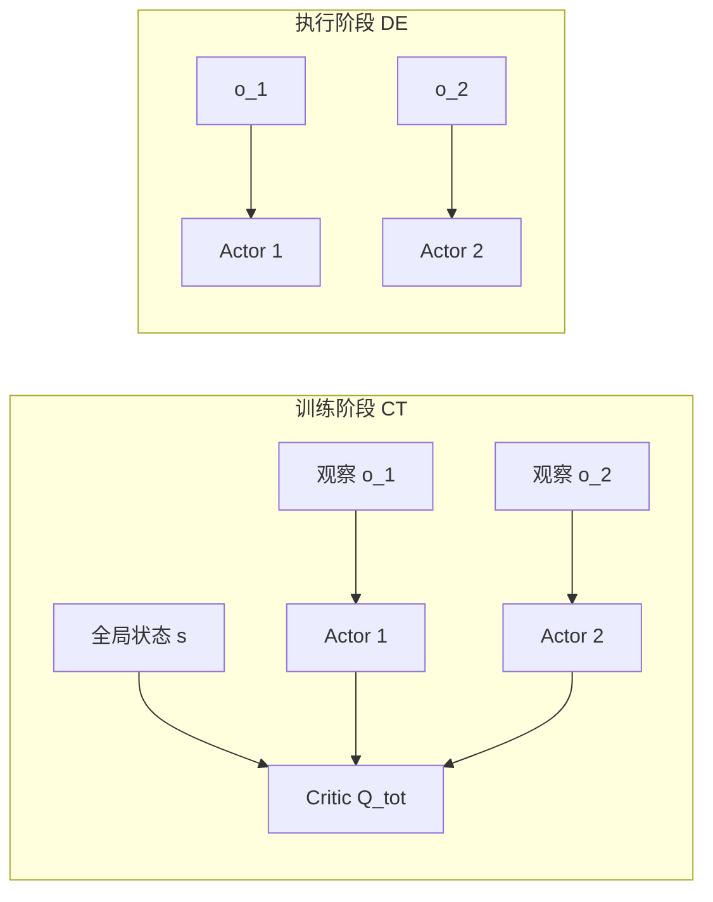

# 14.2 多智能体 RL 与 CTDE、MADDPG、MAPPO

> [14.1](./intro) 讲了单 agent 的 hard-exploration 问题。本节转向多 agent 场景——当环境里有多个智能体同时学习，每个智能体看到的环境都在变（因为其他智能体在变），这就打破了 MDP 的平稳性假设。**CTDE**（Centralized Training Decentralized Execution）范式是工业级多智能体 RL 的标准答案。

## 多智能体 RL 与 CTDE 框架

当环境里有多个智能体同时学习，标准的 MDP 假设被打破。从单个智能体 $i$ 的视角看，转移 $P(s' \mid s, a_i)$ 不再是固定的——它依赖其他智能体 $a_{-i}$ 当前的策略，而其他智能体的策略在不断变化。这种**非平稳性**让 Q 值估计永不收敛，独立学习（每个智能体把自己的对手当环境）在合作任务上常陷入"你进一步退一步"的震荡。

### 从 NFG 到 MARL

最简洁的多智能体形式化是**正则形式博弈**（Normal-Form Game）：联合动作 $a = (a_1, \ldots, a_n)$，每个智能体有自己的奖励 $r_i(a)$。纳什均衡是没有任何智能体能单方面改变策略提升期望收益的联合策略。但博弈论解法假设对手理性且模型已知，深度 MARL 要面对的是高维观察、未知奖励、对手也在学习。

### 集中训练，分散执行

**Centralized Training Decentralized Execution** 是工业界最实用的折衷方案。训练时所有智能体的观察和动作都可见，critic 可以接入全局信息；执行时每个智能体只能看自己的观察，actor 必须分散决策。

形式上，分散策略 $\pi_i(a_i \mid o_i)$ 只依赖局部观察 $o_i$，而集中式 critic $Q_i^{\text{tot}}(s, a_1, \ldots, a_n)$ 依赖全局状态和联合动作。这同时满足两个约束：

- **训练信号丰富**：critic 看全局，规避了"对手当环境"的非平稳性
- **执行可行**：actor 只看局部，部署到真实多机系统时无需通信



CTDE 范式下产生了三大类算法：价值分解（VDN、QMIX）、actor-critic 型（MADDPG、MAPPO）、通信型（CommNet、TarMAC）。下面重点介绍 actor-critic 型的两个代表。

## MADDPG 与 MAPPO

### MADDPG 与 每个智能体一个集中 critic

Multi-Agent DDPG（Lowe et al. 2017）直接把 DDPG 扩展到多智能体设定。每个智能体 $i$ 持有自己的 actor $\mu_{\theta_i}(o_i)$ 和**集中式 critic** $Q_i(o_1, a_1, \ldots, o_n, a_n)$。Critic 的梯度：

$$\nabla_{\theta_i} J(\mu_{\theta_i}) = \mathbb{E}\left[\nabla_{\theta_i} \mu_{\theta_i}(o_i) \cdot \nabla_{a_i} Q_i(o_1, a_1, \ldots, o_n, a_n)\big|_{a_i = \mu_{\theta_i}(o_i)}\right]$$

注意 critic 的输入维度随智能体数线性增长，且**只为自己的 $a_i$ 求梯度**，其他智能体的动作当作已知条件。这种"我学我对别人的最佳响应"的结构让 MADDPG 在混合合作-竞争任务（如 *Particle Environments* 的 predator-prey）上稳定收敛。

```python
class MADDPG:
    def __init__(self, n_agents, obs_dim, action_dim):
        # 每个智能体一组 actor + 集中 critic
        self.actors = [Actor(obs_dim, action_dim) for _ in range(n_agents)]
        self.critics = [Critic(n_agents * (obs_dim + action_dim), 1)
                        for _ in range(n_agents)]

    def update(self, batch):
        obs, actions, rewards, next_obs = batch  # 所有智能体的轨迹
        for i in range(self.n_agents):
            # 集中 critic target：所有智能体的下一动作
            next_actions = [self.actors_target[j](next_obs[j])
                            for j in range(self.n_agents)]
            target_q = self.critics_target[i](
                torch.cat([*next_obs, *next_actions], -1))
            y = rewards[i] + self.gamma * target_q
            # critic 拟合 y
            current_q = self.critics[i](
                torch.cat([*obs, *actions], -1))
            critic_loss = F.mse_loss(current_q, y.detach())

            # actor 只对自己的动作求梯度
            pred_action_i = self.actors[i](obs[i])
            all_actions = list(actions)
            all_actions[i] = pred_action_i
            actor_loss = -self.critics[i](
                torch.cat([*obs, *all_actions], -1)).mean()
            ...
```

MADDPG 的弱点：(1) 集中 critic 的输入维度随智能体数爆炸，几十个智能体时不可行；(2) DDPG 系列的稳定性问题（见 [第 11 章](../chapter11_continuous_control/intro#_12-3-td3-ddpg-的稳定性补丁)）全部继承。

### MAPPO 与 PPO 的多智能体扩展

Multi-Agent PPO（Yu et al. 2022）把 PPO 的 on-policy actor-critic 扩展到 CTDE：每个智能体一个分散 actor $\pi_{\theta_i}(a_i \mid o_i)$，共享一个集中 critic $V_\phi(s)$（或带联合动作输入的 $Q_\phi$）。PPO 的 clip 目标天然适用于多智能体，因为策略比 $\pi_{\theta_i}/\pi_{\theta_i}^{\text{old}}$ 是每个智能体独立计算的，clip 防止单智能体策略跳得太远导致联合分布崩溃。

```python
def mappo_update(actors, critic, buffer, n_agents, clip_eps=0.2):
    for epoch in range(E):
        for batch in buffer.iter():
            s, obs_list, a_list, old_logp_list, adv, ret = batch
            # 集中 critic：估 V(s)
            values = critic(s)
            new_logp_list = [log_prob(actors[i](obs_list[i]), a_list[i])
                             for i in range(n_agents)]
            for i in range(n_agents):
                ratio = (new_logp_list[i] - old_logp_list[i]).exp()
                s1 = (ratio * adv[i]).mean()
                s2 = torch.clamp(ratio, 1 - clip_eps, 1 + clip_eps) * adv[i]
                policy_loss = -torch.min(s1, s2).mean()
                entropy_bonus = -new_logp_list[i].mean()
                update(actors[i], policy_loss + 0.01 * entropy_bonus)
            value_loss = F.mse_loss(values, ret)
            update(critic, value_loss)
```

MAPPO 的工程优势让它在过去两年成为 MARL 的**事实标准**：

- **稳定性**：PPO 的 clip 比 DDPG 的 off-policy 更新更鲁棒
- **超参统一**：单组超参在 *StarCraft Multi-Agent Challenge* (SMAC)、*Hanabi*、*Multi-Agent MuJoCo* 上都接近 SOTA
- **扩展性**：critic 共享、actor 可分布式训练，适合大集群

### CTDE 算法对比

| 算法 | critic 输入 | actor 输入 | on/off-policy | 代表任务 |
|------|------------|-----------|---------------|----------|
| IQL（独立学习） | $o_i$ | $o_i$ | off | 弱基线 |
| VDN / QMIX | $s$（线性/单调分解） | $o_i$ | off | 合作任务 |
| MADDPG | $(o_1,a_1,\ldots,o_n,a_n)$ | $o_i$ | off | 合作-竞争混合 |
| MAPPO | $s$ | $o_i$ | on | SMAC、Hanabi |

::: tip 价值分解是什么
VDN 假设 $Q_{\text{tot}} = \sum_i Q_i(o_i, a_i)$，QMIX 推广为 $Q_{\text{tot}}$ 是各 $Q_i$ 的单调函数（保证 $\arg\max$ 可分解）。它们也是 CTDE，但属于"价值分解"分支，不在本章主线。MAPPO 在大多数合作任务上已超过 QMIX。
:::

## 本节总结

多智能体 RL 的核心挑战是非平稳性——每个 agent 看到的环境都在变。CTDE（Centralized Training Decentralized Execution）范式用集中式 critic 解决训练时的非平稳性，分布式 actor 保证部署时每个 agent 独立决策。MADDPG 把 DDPG 扩展到多 agent，MAPPO 把 PPO 扩展到多 agent——后者是 StarCraft 多智能体微操的 SOTA。

下一节 [14.3 分层 RL 与生成式世界模型引子](./hierarchical) 处理第三种被回避的情形——**任务 horizon 极长**，需要分层 RL 把长程决策分解为 option 序列。
