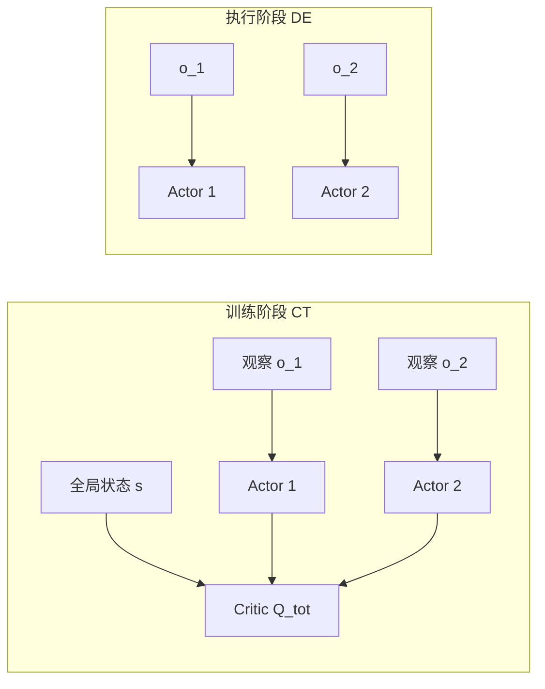

# 12.2 多智能体强化学习

## 本节导读

**核心内容**

- 理解多智能体学习的核心困难：**非平稳性**——当其他智能体也在学习时，从单个智能体的视角看，环境变得"一边玩一边改规则"了。
- 掌握 CTDE（集中训练分散执行）范式：为什么这是工业界最实用的折衷方案？训练时可以"开上帝视角"，执行时必须各做各的决策。
- 理解 MADDPG 如何把 DDPG 扩展到多智能体：每个智能体有自己的 Actor，但 Critic 要看到所有人的观察和动作。
- 理解 MAPPO 为什么能成为多智能体合作任务的强基线：PPO 的裁剪更新天然适合多智能体，稳定、好调参、效果好。
- 对比不同 CTDE 算法的适用场景，知道什么时候用价值分解、什么时候用 Actor-Critic。

<OnlineTraining studios="multiagent" compact />

上一节 [12.1](./intrinsic-motivation-exploration) 我们解决了稀疏奖励下怎么让单个智能体自己"好奇探索"的问题。现在我们把问题再推进一步：如果环境里不止一个智能体呢？

你可能会想：这有什么难的？让每个智能体自己学自己的不就行了？大家都用 PPO，各学各的，最后一起完成任务——这听起来很合理啊？

让我们停下来想一下：如果所有智能体都在同时更新自己的策略，会发生什么？

## 1. 多智能体为什么使环境变得非平稳

从单个智能体 $i$ 的视角看，环境是怎么工作的？在单智能体 MDP 里，下一状态 $s'$ 只取决于当前状态 $s$ 和我自己的动作 $a_i$——转移概率 $P(s' \mid s, a_i)$ 是固定不变的，只要环境规则不变，这个概率就不会变。

但是在多智能体设定下，下一状态不仅取决于我自己的动作 $a_i$，还取决于其他所有智能体的联合动作 $a_{-i}$（也就是除了 i 之外所有人的动作）：

$$P(s' \mid s, a_i) \quad \text{变成了} \quad P(s' \mid s, a_i, a_{-i})$$

问题就出在这里：其他智能体的策略也在不断更新啊！第一轮的时候，队友还在随机瞎走；第一百轮的时候，队友已经学会配合了。那就算我站在**完全相同的状态** $s$、做**完全相同的动作** $a_i$，结果也可能完全不一样——因为队友变了。

用一个双人协作游戏把它落到具体画面上：房间里有两个按钮和一扇门，门只有在两个人**同时**按下按钮时才会打开。你练熟了自己的分工——站在左边按钮前，看到队友伸手就按。第 1 轮，队友还在乱跑，你按下按钮，门纹丝不动；训练到第 100 轮，队友学会了卡时机，你还在同一个位置按下同一个按钮，门开了。对你来说观察相同、动作相同，结果完全不同——变的"环境规则"，其实就是队友的策略。

这就是多智能体 RL 的核心困难——**非平稳性**（non-stationarity）：从单个智能体的视角看，环境转移概率一直在变。旧的数据更快过时，独立 Q-Learning（每个智能体自己学自己的 Q 函数）的学习目标会不断移动，就像你在追一个一直在跑的靶子。

### 1.1 从正则形式博弈到多智能体 RL

让我们从最简单的多智能体形式化开始——**正则形式博弈**（Normal-Form Game），也就是大家在博弈论入门课上学过的"矩阵博弈"。

在正则形式博弈中：

- 有 $n$ 个智能体（玩家）
- 每个智能体 $i$ 选择自己的动作 $a_i$
- 所有人的动作合在一起形成联合动作 $a = (a_1, a_2, \ldots, a_n)$
- 根据联合动作，每个智能体拿到自己的奖励 $r_i(a)$

最经典的例子就是"囚徒困境"：

|            | 对方坦白 | 对方抵赖 |
| ---------- | -------- | -------- |
| **你坦白** | (-3, -3) | (0, -5)  |
| **你抵赖** | (-5, 0)  | (-1, -1) |

你可能还记得博弈论里的"纳什均衡"概念：没有任何智能体能通过**单方面**改变自己的策略来提升期望收益，这时候的联合策略就是一个纳什均衡。

但是——经典博弈论解法有两个很强的假设：

1. 假设对手是"理性"的，会按照最优策略玩
2. 假设奖励矩阵是已知的，可以做推理

而深度 MARL（多智能体强化学习）面对的是什么？是高维视觉观察、未知的奖励函数、最重要的是——**对手也在学习，对手也在变**。

你可能会问：那让所有智能体直接合在一起，当成一个"超级智能体"来学行不行？把所有智能体的观察拼起来当状态，把所有动作拼起来当联合动作，直接用单智能体算法学联合策略？

这在理论上可以，但在实践中根本不可行：

- 动作空间随智能体数量**指数爆炸**：2 个智能体各有 6 个动作，联合动作就是 $6^2=36$ 个；10 个智能体就是 $6^{10} \approx 6000$ 万个——根本没法学
- 执行的时候，如果智能体分布在不同的机器上，它们可能根本无法通信，没法实时"商量"出一个联合动作
- 就算能通信，这种集中式策略完全没有扩展性——加一个智能体就得重新训一遍

那怎么办？这就引出了 MARL 里最重要的范式——CTDE。

## 2. 用 CTDE 分开训练与执行

**Centralized Training, Decentralized Execution**（集中训练，分散执行，简称 CTDE）是目前工业界最实用的折衷方案。这个思路其实很符合直觉：

- **训练阶段（CT）**：我们是在实验室里训模型，这时候可以"开上帝视角"——所有智能体的观察、动作、甚至全局状态我们都能拿到，可以用来训练一个更好的 Critic
- **执行阶段（DE）**：模型要部署到真实场景了，这时候每个智能体可能在不同的机器上，不能依赖实时通信，必须只根据自己的局部观察做决策

形式化一下：

- 每个智能体有自己的**分散策略** $\pi_i(a_i \mid o_i)$，只依赖自己的局部观察 $o_i$——这是执行时真正用的
- 我们训练一个**集中式 Critic** $Q_i^{\text{tot}}(s, a_1, \ldots, a_n)$，它可以看到全局状态 $s$ 和所有智能体的联合动作 $(a_1,\ldots,a_n)$——这是训练时用来给 Actor 提供梯度的

这样设计同时满足了两个约束：

1. **训练信号丰富**：Critic 看全局信息，知道其他智能体在做什么，就不会把其他智能体的策略变化当成"环境随机噪声"，规避了非平稳性问题
2. **执行可行**：Actor 只看自己的局部观察，部署到真实多机系统的时候，智能体之间不需要通信，各做各的决策就行

我们用一张 mermaid 图把这个流程画清楚：


```mermaid
graph LR
  subgraph 训练阶段 CT
    O1[观察 o_1] --> A1[Actor 1]
    O2[观察 o_2] --> A2[Actor 2]
    S[全局状态 s] --> C[Critic Q_tot]
    A1 --> C
    A2 --> C
  end
  subgraph 执行阶段 DE
    O1d[o_1] --> A1d[Actor 1]
    O2d[o_2] --> A2d[Actor 2]
  end
```

看这张图你就能明白：训练的时候，Critic 像一个"教练"，站在场地边看全局，能看到所有球员的位置和球在哪里，所以能给出准确的评价；而真正上场比赛（执行）的时候，每个球员只能看自己眼前的情况，自己做决策。

CTDE 范式下有几类主流方法：

1. **价值分解方法**（VDN、QMIX 等）：把总 Q 函数分解成每个智能体自己的 Q 函数之和或单调组合
2. **Actor-Critic 方法**（MADDPG、MAPPO 等）：每个智能体有自己的 Actor，共享或各自有集中式 Critic
3. **显式通信方法**（CommNet、TarMAC 等）：让智能体在执行时也能学习怎么互相发消息

我们这一节重点看两个最常用的 Actor-Critic 代表：MADDPG 和 MAPPO。

## 3. 用 MADDPG 学习集中式 Critic

### 3.1 每个智能体怎样更新自己的 Actor

Multi-Agent DDPG（MADDPG，Lowe et al. 2017）是最早把 CTDE 思想落地的经典算法之一，它直接把单智能体的 DDPG 扩展到了多智能体设定。

回忆一下单智能体 DDPG 是怎么更新 Actor 的？Actor 的目标是选一个动作 $a = \mu_\theta(s)$，让 Critic 给出的 Q 值 $Q(s, a)$ 尽可能大，所以梯度是：

$$\nabla_\theta J(\mu_\theta) = \mathbb{E}\left[\nabla_\theta \mu_\theta(s) \cdot \nabla_a Q(s, a)\big|_{a=\mu_\theta(s)}\right]$$

MADDPG 把这个思路直接推广：每个智能体 $i$ 持有自己的 Actor $\mu_{\theta_i}(o_i)$，以及自己的**集中式 Critic** $Q_i(o_1, a_1, \ldots, o_n, a_n)$。注意这个 Critic 的输入——它要看到**所有智能体**的观察和动作，而不只是智能体 i 自己的。

那么 Actor $i$ 的更新梯度是什么样的？链式法则告诉我们：

$$\nabla_{\theta_i} J(\mu_{\theta_i}) = \mathbb{E}\left[\nabla_{\theta_i} \mu_{\theta_i}(o_i) \cdot \nabla_{a_i} Q_i(o_1, a_1, \ldots, o_n, a_n)\big|_{a_i = \mu_{\theta_i}(o_i)}\right]$$

让我们把这个式子拆开解释清楚：

- 第一项 $\nabla_{\theta_i} \mu_{\theta_i}(o_i)$：Actor 参数 $\theta_i$ 变化一点点，Actor 输出的动作 $a_i$ 会怎么变？
- 第二项 $\nabla_{a_i} Q_i(\ldots)$：Critic 看到所有人的观察和动作，如果我的动作 $a_i$ 变一点点，Critic 预测的总回报会怎么变？
- 两项相乘：梯度就能把 Critic 的全局评价传回给 Actor，告诉 Actor "你刚才那个动作改一点点，全队的收益会往哪个方向变"

这里有一个关键细节：更新 Actor $i$ 的时候，我们只对**自己的动作** $a_i$ 求导，其他智能体的动作 $(a_{-i})$ 都当作这批数据里的已知常量——我们不需要知道其他 Actor 的参数，也不需要把梯度传给它们。

放到一场具体的比赛里：智能体 $i$ 是持球的前锋，可选动作是"射门"或"分边"。Critic 看到的是全场——门将站位、队友跑位都取自这批数据，固定不动，只把前锋的动作换成"如果换成射门"。Critic 的评价因此能回答"在队友当前这套跑位下，射门和分边哪个全队期望得分更高"——这正是分散决策的前锋需要、又靠自己拿不到的信息。

让我们看代码骨架，理解得更清楚：

```python
class MADDPG:
    def __init__(self, n_agents, obs_dim, action_dim):
        # 每个智能体一组 actor + 集中 critic
        self.actors = [Actor(obs_dim, action_dim) for _ in range(n_agents)]
        self.critics = [Critic(n_agents * (obs_dim + action_dim), 1)
                        for _ in range(n_agents)]

    def update(self, batch):
        obs, actions, rewards, next_obs = batch  # 所有智能体的轨迹
        for i in range(self.n_agents):
            # === 更新 Critic i ===
            # 计算 target：需要所有智能体的下一动作
            next_actions = [self.actors_target[j](next_obs[j])
                            for j in range(self.n_agents)]
            target_q = self.critics_target[i](
                torch.cat([*next_obs, *next_actions], -1))
            y = rewards[i] + self.gamma * target_q
            # 当前 Q 值：用所有智能体的当前观察和动作
            current_q = self.critics[i](
                torch.cat([*obs, *actions], -1))
            critic_loss = F.mse_loss(current_q, y.detach())

            # === 更新 Actor i ===
            # 我自己的动作用当前 Actor 预测，其他人的动作直接用 replay buffer 里的
            pred_action_i = self.actors[i](obs[i])
            all_actions = list(actions)
            all_actions[i] = pred_action_i  # 只把我的动作换成预测的
            actor_loss = -self.critics[i](
                torch.cat([*obs, *all_actions], -1)).mean()
            ...
```

看代码你就明白了：更新 Actor i 的时候，我们只把第 i 个智能体的动作换成"当前 Actor 会选的动作"，其他智能体的动作直接用 replay buffer 里采样出来的旧动作。这样 Critic 就能告诉 Actor i："如果你在这个观察下稍微改一下动作，Q 值会怎么变。"

MADDPG 是一个里程碑式的工作，但它也有明显的弱点：

1. **维度灾难**：集中式 Critic 的输入维度是 $n \times (\text{obs\_dim} + \text{action\_dim})$，随智能体数量线性增长——如果有几十个智能体，Critic 输入会非常大，很难训
2. **继承了 DDPG 的稳定性问题**：回忆 [第 9 章](../chapter11_continuous_control/ddpg#_12-3-td3-ddpg-的稳定性补丁) 讲过的 DDPG 的问题——过估计、超参数敏感、训练容易崩溃——这些问题在多智能体设定下会被进一步放大

那有没有办法用更稳定的 on-policy 算法（比如 PPO）来做 CTDE？这就是 MAPPO 要解决的问题。

## 4. 用 MAPPO 稳定更新多个策略

Multi-Agent PPO（MAPPO，Yu et al. 2022）把我们熟悉的 PPO（从第 7 章开始就一直在用的强基线算法）扩展到了 CTDE 设定。事实证明，这个"简单"的扩展效果惊人的好——直到今天，MAPPO 仍然是绝大多数合作型多智能体任务的首选基线。

MAPPO 的设计非常直接：

- 每个智能体有自己的**分散 Actor** $\pi_{\theta_i}(a_i \mid o_i)$，只看自己的局部观察——和 MADDPG 的 Actor 一样
- 但我们不是每个智能体一个 Critic，而是**所有智能体共享一个集中式 Critic** $V_\phi(s)$，输入是全局状态 $s$（也可以用带联合动作输入的 $Q_\phi$，但实践中 $V(s)$ 就够了）

为什么 PPO 特别适合多智能体？回忆 PPO 的核心——**裁剪的策略梯度目标**：

$$L^{\text{CLIP}}(\theta) = \mathbb{E}\left[\min\left(r_t(\theta) A_t,\ \text{clip}(r_t(\theta), 1-\epsilon, 1+\epsilon) A_t\right)\right]$$

其中策略比 $r_t(\theta) = \frac{\pi_\theta(a_t \mid s_t)}{\pi_{\theta_{\text{old}}}(a_t \mid s_t)}$。

在多智能体设定下，这个策略比是**每个智能体独立计算的**——智能体 i 只需要算自己的新策略和旧策略的比值，不需要管其他智能体。PPO 的 clip 机制天然防止单个智能体的策略更新得太猛，导致整个联合策略分布崩溃。这比 DDPG 那种 off-policy 的确定性更新稳定得多。

我们来看 MAPPO 的更新代码骨架：

```python
def mappo_update(actors, critic, buffer, n_agents, clip_eps=0.2):
    for epoch in range(E):
        for batch in buffer.iter():
            s, obs_list, a_list, old_logp_list, adv, ret = batch
            # 集中 critic：用全局状态 s 估 V(s)
            values = critic(s)
            # 每个 actor 计算新策略下的 log probability
            new_logp_list = [log_prob(actors[i](obs_list[i]), a_list[i])
                             for i in range(n_agents)]
            # 逐个更新每个智能体的 actor
            for i in range(n_agents):
                ratio = (new_logp_list[i] - old_logp_list[i]).exp()
                s1 = (ratio * adv[i]).mean()
                s2 = torch.clamp(ratio, 1 - clip_eps, 1 + clip_eps) * adv[i]
                policy_loss = -torch.min(s1, s2).mean()
                entropy_bonus = -new_logp_list[i].mean()
                update(actors[i], policy_loss + 0.01 * entropy_bonus)
            # 最后更新共享的 critic
            value_loss = F.mse_loss(values, ret)
            update(critic, value_loss)
```

你看，这和单智能体 PPO 几乎一模一样——唯一的区别是我们有 n 个 Actor，每个算自己的 ratio 和 loss，但它们共享同一个 Critic，用同一个全局优势函数 adv。

MAPPO 为什么这么成功？因为它有几个非常大的优势：

- **稳定性好**：PPO 的 clip 机制比 DDPG 的 off-policy 更新鲁棒得多，超参数也不那么敏感——经常一套超参数能在很多任务上直接用
- **超参复用性强**：论文作者发现，几乎相同的配置可以直接用在 _StarCraft Multi-Agent Challenge_（星际争霸多智能体微操）、_Hanabi_（花火卡牌游戏）、_Multi-Agent MuJoCo_（多机器人连续控制）等完全不同的任务上，不需要怎么调参就能拿到很好的结果
- **扩展性好**：Critic 是共享的，不需要每个智能体一个；Actor 之间是独立的，可以很方便地分布式训练，适合大规模集群

::: details 加餐：MAPPO 的实现细节与技巧
MAPPO 看起来简单，但要真正训好还是有一些工程细节的：

1. **值函数归一化（Value Normalization）**：和 R2D2 类似，对 Critic 的输出做归一化能显著稳定训练
2. **Agent-Specific 全局状态**：有时候给 Critic 输入的"全局状态"里，可以加入一些和当前智能体相关的额外信息，效果更好
3. **动作掩码（Action Masking）**：在很多环境里，某些状态下有些动作是非法的（比如卡牌游戏里你没有某张牌就不能出），这时候要在 Actor 输出层把非法动作的 logit 设为负无穷
4. **共享参数还是独立参数**：如果智能体是同质的（比如星际争霸里的几个机枪兵），可以让它们共享 Actor 参数，减少训练量；如果是异质的（比如一个加血一个输出），就需要各自独立的 Actor

原文《The Surprising Effectiveness of PPO in Cooperative Multi-Agent Games》最有意思的一点是：它证明了"简单"的 on-policy 方法只要实现得好，效果能超过当时那些复杂的 off-policy 方法（比如 QMIX）。这和单智能体领域里 PPO 成为默认基线的轨迹是一样的。
:::

MAPPO 因为训练稳定、实现清晰、效果好，现在已经成为合作型多智能体任务的**默认强基线**——不管你提出什么新的 MARL 算法，都得先和 MAPPO 比一比，要是连 MAPPO 都打不过就不用看了。

### 4.1 比较常见的 CTDE 算法

我们把这一章提到的几种 CTDE 算法放在一起对比，方便你在实践中选择：

| 算法            | critic 输入                | actor 输入 | on/off-policy | 代表任务      |
| --------------- | -------------------------- | ---------- | ------------- | ------------- |
| IQL（独立学习） | $o_i$                      | $o_i$      | off           | 弱基线        |
| VDN / QMIX      | $s$（线性/单调分解）       | $o_i$      | off           | 合作任务      |
| MADDPG          | $(o_1,a_1,\ldots,o_n,a_n)$ | $o_i$      | off           | 合作-竞争混合 |
| MAPPO           | $s$                        | $o_i$      | on            | SMAC、Hanabi  |

### 4.2 价值分解解决什么问题

我们顺便简单提一下价值分解类方法（VDN、QMIX），它们也属于 CTDE 范式，但走的是另一条路线。

VDN（Value Decomposition Networks）做了一个很强的假设：**总 Q 函数可以分解成每个智能体 Q 函数的和**：

$$Q_{\text{tot}}(s, a_1, \ldots, a_n) = \sum_{i=1}^n Q_i(o_i, a_i)$$

这样训练时只需要训练每个智能体自己的 $Q_i$，执行时每个智能体只要选能最大化自己 $Q_i$ 的动作，加起来就自动最大化了总 $Q_{\text{tot}}$。

以两个机器人抬桌子为例：$Q_1$ 评估"左边机器人抓左边桌沿"的价值，$Q_2$ 评估"右边机器人抓右边桌沿"的价值，团队总价值就是两者之和——各自选让自己 $Q_i$ 最大的抓握点，桌子自然被平稳抬起。

QMIX 把这个假设放宽了一点：总 Q 不一定是和，但只要是各 $Q_i$ 的**单调函数**就行，也就是满足：

$$\frac{\partial Q_{\text{tot}}}{\partial Q_i} \geq 0, \quad \forall i$$

这个条件保证了 $\arg\max_{a} Q_{\text{tot}}$ 可以通过分别 $\arg\max_{a_i} Q_i$ 得到——执行时仍然可以分散选动作。

还是抬桌子：QMIX 允许总价值以更复杂的方式组合两个人的 $Q_i$（只要保持单调），比如两个机器人配合到位时有额外加成；但只要"任何一方自己的动作价值变高，团队总价值不会反而变低"这条单调性成立，各自选局部最优的抓握点，就仍然是全局最优的组合。

价值分解方法在某些合作任务上效果不错，但它们有个共同限制：只能用于**完全合作**的设定（所有智能体共享同一个团队奖励）。而 MADDPG 和 MAPPO 更灵活，可以处理合作、竞争、混合等多种奖励结构。另外，随着 MAPPO 的兴起，在大多数合作任务上 MAPPO 的效果已经超过了 QMIX，实现还更简单。

## 本节总结

多智能体强化学习的核心困难是**非平稳性**：当其他智能体的策略也在更新时，从单个智能体的视角看，环境转移概率一直在变，就像在追一个移动的靶子。

CTDE（集中训练分散执行）是目前最实用的范式：训练时 Critic 可以用全局信息当"教练"，提供稳定准确的学习信号；执行时每个 Actor 只看自己的局部观察，不需要通信就能独立决策。

我们看了两个经典的 CTDE Actor-Critic 算法：

- **MADDPG**：把 DDPG 扩展到多智能体，每个智能体有自己的集中式 Critic，可以处理合作和竞争混合的任务，但继承了 DDPG 训练不稳定的问题，扩展性也不好
- **MAPPO**：把 PPO 扩展到 CTDE，所有智能体共享一个集中式 Value 函数，用 PPO 的裁剪目标稳定更新多个策略。它实现简单、训练稳定、超参数鲁棒，现在是 StarCraft 多智能体微操、Hanabi 等合作任务的默认强基线。

好，现在我们能让多个智能体一起学习了。但是——回到单个智能体的场景，如果任务特别长怎么办？比如让机器人打扫一整栋房子，可能需要上千步连续动作，最终的奖励很难传到最前面的步骤。就算有内在奖励，这么长的 horizon 还是很难训。怎么解决这个问题？

这就是下一节的主题——**分层强化学习**：把长任务拆成"高层选子目标，底层执行动作"的多层结构，把长 horizon 切成短 horizon。

下一节 [12.3 分层强化学习与世界模型](./hierarchical) 处理长程任务，说明高层子目标与低层动作怎样缩短奖励传播距离，以及生成式世界模型怎样把环境本身也变成学习对象。
