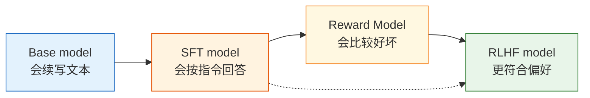

# 13.1 基座模型到指令对齐

## 本节导读

**核心内容**

- 理解 base model 的训练目标为什么只是“续写”，不是“当助手”。
- 把大语言模型生成过程重新写成一个序列决策问题：状态、动作、策略、奖励分别是什么。
- 看清 SFT 和 RLHF 分别解决什么问题：一个教行为格式，一个调偏好边界。

**核心公式**

$$
\mathcal{L}_{LM}(\theta) = -\sum_{t=1}^{T}\log \pi_\theta(x_t \mid x_{<t})
\quad \text{（预训练语言模型目标：预测下一个 token）}
$$

$$
\pi_\theta(a_t \mid s_t) = P_\theta(y_t \mid x, y_{<t})
\quad \text{（LLM 策略：在当前上下文中选择下一个 token）}
$$

$$
R(x,y) \approx \text{human preference}(x,y)
\quad \text{（RLHF 奖励：回答是否符合人类偏好）}
$$

> **先记住一句话**
>
> Base model 学到的是“在互联网文本里，下一段通常怎么写”；assistant 需要学到的是“面对用户请求，我应该如何负责地回答”。

上一章我们把 PPO 的核心机制讲清楚了：策略不能一步走太远，所以要用裁剪、优势估计和 KL 约束来稳定更新。现在要把这套算法搬到大语言模型上，第一步不是马上写 PPO 代码，而是先问一个更基本的问题：**为什么一个已经很会写字的预训练模型，还不能直接当助手？**

这个问题看起来像产品问题，本质却是训练目标问题。

Base model 在预训练阶段看到的是大量自然文本。它的任务很朴素：给定前面的 token，预测下一个 token。这个目标非常强大，所以模型能学到语法、知识、风格、代码结构和推理模式。但它没有被明确训练成“用户说一句，我按意图给出帮助”。如果 prompt 是“请用三句话解释什么是强化学习”，base model 的自然反应不一定是回答；它也可能继续补全一段教材、论坛帖、考试题，甚至把用户的话接着往下写。

这就像一个读过全网文本的续写器，离一个稳定可靠的助手还差三步：

1. **知道这是指令，不是待续写文本。**
2. **知道什么样的回答更好，而不是只知道什么文本更常见。**
3. **知道哪些内容应该拒绝、承认不确定或请求澄清。**

RLHF 的作用，就是把“会续写的模型”改造成“更像助手的策略”。



## Base model 的训练目标

预训练语言模型的目标函数是最大化文本序列的似然。把一段文本写成 $x_1, x_2, \ldots, x_T$，模型训练时最小化：

$$
\mathcal{L}_{LM}(\theta)
= -\sum_{t=1}^{T}\log \pi_\theta(x_t \mid x_1,\ldots,x_{t-1})
$$

这条公式读成大白话就是：

> 前面已经写了这些字，真实文本的下一个 token 是 $x_t$。模型给这个 token 的概率越高，loss 越低。

它没有区分“用户输入”和“助手回答”，也没有内置“诚实”“有帮助”“安全”“按 JSON 输出”这些目标。它只在学习文本分布。

拿一个极简例子看：

```text
用户：请用三句话解释什么是强化学习。
```

对 assistant 来说，合理输出应该是三句话解释。但对 base model 来说，这只是一个文本前缀。互联网语料里它后面可能跟着：

- 一篇教程的正文；
- 一个问答网站的答案；
- 一段聊天记录；
- 另一个用户的追问；
- 甚至是“助手：当然可以……”这种格式。

这些续写都可能在语言模型目标下是“合理文本”，但不一定是“好助手行为”。

## 把 LLM 生成写成 MDP

第 3 章我们用 MDP 五元组描述 CartPole、老虎机和一般 RL 问题。大语言模型生成也可以放进同一套语言里，只是状态和动作变成了 token 序列。

| MDP 要素          | 传统 RL 例子                | LLM 生成中的对应物                         |
| ----------------- | --------------------------- | ------------------------------------------ |
| 状态 $s_t$        | CartPole 的位置、速度、角度 | prompt 加上已经生成的 token：$(x, y_{<t})$ |
| 动作 $a_t$        | 向左推 / 向右推             | 从词表中选择下一个 token $y_t$             |
| 策略 $\pi_\theta$ | 神经网络输出动作概率        | 语言模型输出 next-token 分布               |
| 转移 $P$          | 物理环境更新状态            | 把新 token 拼到上下文后面                  |
| 奖励 $R$          | 存活 +1，失败 0             | RM / 人类 / 规则对完整回答打分             |
| episode           | 一局游戏                    | 从开始回答到生成 EOS 或长度上限            |

注意这里有一个和 CartPole 不同的地方：LLM 的“环境转移”几乎是确定的。动作选了 token `强化`，下一状态就是上下文后面多了 `强化`。真正困难的不是物理环境随机性，而是**奖励很晚才出现**：用户通常不评价每个 token，而是看完整回答好不好。

所以 RLHF 中经常把奖励写成：

$$
R(x, y) = r_{RM}(x, y)
$$

其中 $x$ 是 prompt，$y$ 是完整回答。奖励模型看到完整的 $(prompt, response)$ 后，输出一个标量分数。

这会带来一个信用分配问题：如果回答得了低分，究竟是第 3 个 token 错了，还是第 80 个 token 开始跑偏了？PPO 和 Critic 的作用之一，就是把这个整段奖励尽量稳定地传回 token 级别的策略更新。

## Base model 与 Assistant

最小实验可以很简单：同一个 prompt，用 base model 采样几次，看它是否稳定满足要求。

```python
# ==========================================
# 观察 base model 是否真的像 assistant
# ==========================================
from transformers import AutoModelForCausalLM, AutoTokenizer

model_name = "HuggingFaceTB/SmolLM2-360M"
tokenizer = AutoTokenizer.from_pretrained(model_name)
model = AutoModelForCausalLM.from_pretrained(model_name, device_map="auto")

prompts = [
    "请用三句话解释什么是强化学习。",
    "请输出一个 JSON，字段包括 name 和 reason。",
    "如果你不知道答案，请直接说不知道：2029 年诺贝尔物理学奖得主是谁？",
]

for prompt in prompts:
    inputs = tokenizer(prompt, return_tensors="pt").to(model.device)
    outputs = model.generate(
        **inputs,
        max_new_tokens=120,
        do_sample=True,
        temperature=0.7,
        top_p=0.9,
    )
    print("=" * 80)
    print(tokenizer.decode(outputs[0], skip_special_tokens=True))
```

你要观察的不是“它有没有说出几个相关词”，而是下面这些 assistant 能力：

| 维度     | base model 常见问题         | 后训练目标                  |
| -------- | --------------------------- | --------------------------- |
| 指令遵循 | 继续补全 prompt，而不是回答 | 明确回应用户请求            |
| 格式稳定 | 要 JSON 却输出自然语言      | 按要求输出段落、列表或 JSON |
| 诚实性   | 不知道也硬编                | 能承认不确定                |
| 安全性   | 对高风险请求缺少边界        | 知道拒绝或转向安全建议      |
| 有帮助性 | 空泛、散乱                  | 具体、结构化、可执行        |
| 语气     | 像语料片段，不像对话对象    | 稳定、清楚、不过度奉承      |

这里特别要看“稳定”两个字。一个模型偶尔答对，不等于它已经是 assistant。用户需要的是在各种 prompt 下都比较可靠。

## 三个模型版本分别学到了什么

本章会始终比较三个版本：Base、SFT、RLHF。它们不是简单的“越来越大”，而是优化目标不同。

| 版本       | 训练信号              | 学到的能力                 | 主要风险                           |
| ---------- | --------------------- | -------------------------- | ---------------------------------- |
| Base model | next-token prediction | 语言、知识、风格、代码模式 | 不稳定地续写，不一定回答           |
| SFT model  | 指令-回答监督数据     | 按格式回答、模仿高质量示范 | 只会模仿，不会主动区分多个回答好坏 |
| RLHF model | 偏好奖励 + PPO        | 更贴近偏好，减少坏回答     | reward hacking、能力回退、过度迎合 |

SFT 的训练目标是：

$$
\mathcal{L}_{SFT}(\theta) = -\sum_{t=1}^{T}\log \pi_\theta(y_t \mid x, y_{<t})
$$

这和预训练的形式很像，但数据分布变了：输入是用户指令 $x$，目标输出是人工或高质量模型写好的助手回答 $y$。SFT 教模型“应该怎么回答”。

RLHF 再往前走一步：它不只给模型一个标准答案，而是告诉模型“两个回答里哪个更好”。这对应偏好学习和奖励建模。最后 PPO 用奖励模型给出的分数继续优化策略。

## SFT 之后的 RLHF

SFT 已经能把 base model 教得很像 assistant，为什么还需要 RLHF？这里有四个原因。

**第一，SFT 只模仿单个示范，不直接学习偏好边界。**  
一个 prompt 可能有很多可接受回答。SFT 只告诉模型“这条示范可以学”，但没有告诉它“这个回答比另一个回答好在哪里”。偏好数据更适合表达细微差别：准确但冷冰冰 vs 友好但空泛，简洁但漏掉关键点 vs 详细但冗长。

**第二，SFT 数据覆盖不了模型自己会犯的错。**  
SFT 训练时模型只看人工示范；部署时它会生成自己的回答。一旦走到示范数据没覆盖的区域，就可能出现分布漂移。RLHF 会让模型在自己生成的回答上接受奖励反馈，纠正它真实会走到的地方。

**第三，很多目标很难写成唯一标准答案。**  
“更有帮助”“更诚实”“更安全”“更符合语气”这些目标很难用一个精确标签表达，但人类更容易比较两个回答哪个更好。RLHF 正是利用了这种比较能力。

**第四，SFT 容易学到表面格式。**  
模型可能学会“分点回答”“语气礼貌”，但没有真正学会“信息密度高”“不胡编”“遇到风险要拒绝”。偏好训练可以把这些质量维度重新拉进目标函数。

## 补全、回答与对齐

假设 prompt 是：

```text
请给初学者解释 PPO 中的 KL 惩罚，要求不要超过 100 字。
```

三种模型的典型行为可能是：

| 模型 | 可能输出                                                                                             | 问题或优点                    |
| ---- | ---------------------------------------------------------------------------------------------------- | ----------------------------- |
| Base | “请给初学者解释 PPO 中的 KL 惩罚，要求不要超过 100 字。PPO 是一种强化学习算法……”                     | 可能重复 prompt，未必遵守字数 |
| SFT  | “KL 惩罚像一根安全绳，防止新策略离旧策略太远。离得越远，惩罚越大，所以训练更稳定。”                  | 基本像助手，遵守要求          |
| RLHF | “KL 惩罚是在奖励里扣掉‘偏离旧策略太多’的部分。它像安全绳，让 PPO 学得更好时也别突然变成另一个模型。” | 更贴近偏好，类比更清楚        |

这个例子说明：RLHF 不一定让模型“知道更多知识”，它主要改变的是回答的选择偏好。模型原本就可能生成好回答，但好回答的概率不够高；RLHF 让它更常选择人类偏好的那类回答。

## 实验选用的 Base model

教学实验建议从小模型开始。目标不是训练一个强助手，而是看懂 RLHF 的每个部件。

| 模型                         | 为什么适合                                   |
| ---------------------------- | -------------------------------------------- |
| `HuggingFaceTB/SmolLM2-360M` | 参数小，适合跑通完整流程                     |
| `Qwen/Qwen2.5-0.5B`          | 中文表现更友好，方便观察指令遵循             |
| `EleutherAI/pythia-410m`     | 经典小型 base，便于理解从 base 到 SFT 的变化 |

不要一上来就用 7B 或 70B。RLHF 有四个模型角色：Actor、Reference、Reward Model、Critic。模型越大，越容易把“算法没理解清楚”和“系统跑不动”混在一起。

本章把预训练模型当作输入 artifact：

```text
公开 base checkpoint
  -> 观察原始行为
  -> SFT：训练成 assistant 起点
  -> RM：训练偏好裁判
  -> PPO：按裁判奖励继续优化
  -> Eval：确认真的变好
```

## 常见误解

### Base model 很强，所以直接加 chat prompt 就够了

Chat prompt 能改善格式，但不能改变模型参数里的行为偏好。它像临时说明书，不是训练。对简单任务可能够用，对稳定产品不够。

### SFT 就是 RLHF

SFT 是监督学习，不是强化学习。它用标准答案训练模型；RLHF 用偏好奖励训练策略。两者都属于后训练，但训练信号不同。

### RLHF 会让模型凭空获得新知识

RLHF 主要改变模型在已有能力空间里的选择倾向。它可能让模型更愿意承认不知道、更少输出坏格式、更常给出有帮助回答，但它不是知识注入的主力。需要新知识时，仍然要靠预训练、继续预训练、检索增强或高质量 SFT 数据。

### Reward 越高，模型越好

Reward Model 只是人类偏好的近似。模型可能学会讨好 RM，而不是学会真正回答得更好。后面的评估章节会专门处理这个问题。

## 本节小结

Base model 和 assistant 的差别，不是“会不会说话”，而是“优化目标是不是对齐”。Base model 优化 next-token prediction，所以它擅长续写；assistant 需要稳定理解指令、按格式回答、承认不确定、遵守安全边界，并让人类更偏好它的输出。

接下来我们把这个改造过程拆成标准 RLHF 流水线：SFT、Reward Model、PPO 和评估分别接收什么输入，产出什么 artifact——[标准 RLHF 流水线](./standard-rlhf-pipeline)。

## 练习

1. 选 5 个 prompt 测试同一个 base model，记录它在哪些维度不像 assistant。
2. 把其中一个 prompt 的输出改写成高质量 assistant 回答，标出你修改了哪些维度：准确性、格式、语气、长度还是安全性。
3. 思考：如果只用 SFT 训练这 5 条改写数据，模型可能学到什么？又学不到什么？
