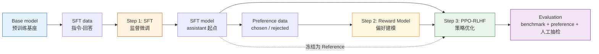

# 8.2 标准 RLHF 流水线

## 本节导读

**核心内容**

- 掌握 InstructGPT 风格 RLHF 的三阶段结构：SFT、Reward Model、PPO。
- 理解每个阶段的输入、输出、验收指标和常见失败模式。
- 学会用 artifact 的视角组织实验：数据、模型、评估报告都要可追踪。

**核心公式**

$$
\mathcal{L}_{SFT} = -\mathbb{E}_{(x,y)\sim \mathcal{D}_{SFT}}\left[\log \pi_\theta(y\mid x)\right]
\quad \text{（SFT：模仿高质量回答）}
$$

$$
\mathcal{L}_{RM} = -\mathbb{E}_{(x,y_w,y_l)\sim \mathcal{D}_{pref}}
\left[\log \sigma(r_\phi(x,y_w)-r_\phi(x,y_l))\right]
\quad \text{（RM：学习偏好排序）}
$$

$$
\max_\theta\ \mathbb{E}_{y\sim \pi_\theta(\cdot\mid x)}
\left[r_\phi(x,y) - \beta D_{KL}(\pi_\theta(\cdot\mid x)\|\pi_{ref}(\cdot\mid x))\right]
\quad \text{（PPO-RLHF：按奖励优化，同时别偏太远）}
$$

> **本节先记住一句话**
>
> RLHF 不是一个训练脚本，而是一条 artifact 流水线：每一步都要留下数据、模型、指标和失败样本。

本章的主线参考 OpenAI InstructGPT：先做 SFT，再训练 Reward Model，最后用 PPO 做 RLHF。它不是唯一的后训练方法，但它是理解 DPO、GRPO、RLVR 等现代方法之前最重要的标准参照。



## 从一条用户问题开始看全流程

先不要急着看框架名词。假设我们有一个 prompt：

```text
请解释 PPO 中 clip ratio 的作用，并给一个直觉例子。
```

标准 RLHF 会围绕这条 prompt 做三件事：

1. **SFT 阶段**：给它一条高质量示范回答，让模型学会“这种问题应该这样讲”。
2. **RM 阶段**：给同一个 prompt 准备多个候选回答，让标注员或 judge 选出更好和更差的回答。
3. **PPO 阶段**：让当前模型自己生成回答，用 RM 打分，再用 PPO 提高高分回答的概率。

这三个阶段对应三种不同的数据形态：

```json
{
  "sft_item": {
    "prompt": "请解释 PPO 中 clip ratio 的作用，并给一个直觉例子。",
    "response": "clip ratio 用来限制新旧策略概率比..."
  },
  "preference_item": {
    "prompt": "请解释 PPO 中 clip ratio 的作用，并给一个直觉例子。",
    "chosen": "clip ratio 像安全带，防止一次更新太猛...",
    "rejected": "PPO 是一个算法，它很好用，很多地方都用。"
  },
  "ppo_prompt_item": {
    "prompt": "请解释 PPO 中 clip ratio 的作用，并给一个直觉例子。"
  }
}
```

同一个 prompt 可以同时出现在 SFT、偏好训练和 PPO rollout 中，但要注意数据泄露：评估集里的 prompt 不应该被拿来训练。

## 三阶段与三个产物

| 阶段     | 输入                       | 输出                          | 验收指标                            | 最常见失败                |
| -------- | -------------------------- | ----------------------------- | ----------------------------------- | ------------------------- |
| SFT      | 指令-回答数据              | 会按指令回答的 assistant 起点 | SFT loss、格式遵循、人工观感        | 学会格式但回答空泛        |
| RM       | chosen/rejected 偏好对     | 能给回答打分的 Reward Model   | held-out accuracy、margin、校准样本 | 偏爱长度、模板或虚假自信  |
| PPO-RLHF | SFT model + RM + prompt 集 | 偏好更好的策略模型            | 偏好胜率、KL、长度、回归 benchmark  | reward 上涨但真实质量下降 |

这里最容易误解的是：SFT 和 RM 不是“准备工作”，它们本身就是 RLHF 成败的主要来源。SFT 数据差，后面 PPO 会在错误的起点上放大问题；RM 学偏了，PPO 会认真地朝错误方向优化。

## Step 0 与 选择 base checkpoint

RLHF 不从零预训练开始。我们先拿一个公开 base model，当作起点 artifact：

```text
artifacts/
  base/
    model_name.txt
    tokenizer_config.json
    generation_probe.jsonl
```

选择 base model 时看三件事：

| 维度   | 问题                                   | 教学实验建议             |
| ------ | -------------------------------------- | ------------------------ |
| 参数量 | 能不能在本地或小云卡上跑通四模型流程？ | 360M 到 0.5B             |
| 语言   | 是否覆盖你要观察的语言？               | 中文实验可选 Qwen 小模型 |
| 许可证 | 是否允许微调和发布？                   | 先读 model card          |

这一步的产物不是训练结果，而是**基线报告**：它在固定 prompt 集上会怎么回答。没有基线，后面就无法判断 SFT 和 RLHF 到底改变了什么。

## Step 1 与 SFT 教它怎么回答

SFT 是监督学习。给定 prompt $x$ 和示范回答 $y$，训练模型最大化回答的条件概率：

$$
\mathcal{L}_{SFT} = -\sum_{t=1}^{T}\log \pi_\theta(y_t \mid x, y_{<t})
$$

读成一句话：

> 在用户问题和前面已生成回答的条件下，让模型更愿意生成示范回答里的下一个 token。

SFT 的最小可用数据格式建议长这样：

```json
{
  "messages": [
    { "role": "system", "content": "你是一个清晰、诚实、简洁的强化学习助教。" },
    { "role": "user", "content": "请解释什么是价值函数。" },
    {
      "role": "assistant",
      "content": "价值函数用于估计从某个状态开始，按某个策略行动能获得的期望累积回报。"
    }
  ],
  "source": "human_written",
  "quality": "verified"
}
```

SFT 阶段最关键的工程细节是 **loss mask**：只对 assistant 该生成的 token 计算 loss，不要让模型学习 system 和 user 文本。否则模型会学会复述用户问题，甚至学会生成角色标记。

## Step 2 与 Reward Model 教裁判什么是好

RM 不直接学习“标准答案”，而是学习“哪个回答更好”。一条偏好数据长这样：

```json
{
  "prompt": "请解释 PPO 中的 KL 惩罚。",
  "chosen": "KL 惩罚限制新策略偏离参考策略太远，像安全绳一样防止更新失控。",
  "rejected": "KL 惩罚就是一个数学公式，PPO 会用它，所以很重要。",
  "labeler": "human_or_judge",
  "rubric": ["accuracy", "helpfulness", "clarity"]
}
```

RM 学到一个打分函数 $r_\phi(x,y)$。如果 chosen 比 rejected 好，就希望：

$$
r_\phi(x,y_w) > r_\phi(x,y_l)
$$

Bradley-Terry 损失把这个不等式变成可优化目标：

$$
\mathcal{L}_{RM} =
-\log \sigma(r_\phi(x,y_w)-r_\phi(x,y_l))
$$

它的直觉和二分类很像：如果 chosen 分数比 rejected 高很多，$\sigma$ 接近 1，loss 很小；如果 RM 给反了，loss 很大。

RM 阶段不要只看 accuracy，还要看 margin：

$$
\text{margin} = r_\phi(x,y_w)-r_\phi(x,y_l)
$$

accuracy 告诉你排序有没有排对，margin 告诉你信号够不够强。一个 RM 可能 70% 排对，但 chosen 和 rejected 分差都很小；PPO 阶段拿到这种奖励会很难学。

## Step 3 与 PPO 按奖励练习

PPO 阶段会同时用到四个角色：

| 角色         | 来源              | 是否训练 | 作用                  |
| ------------ | ----------------- | -------- | --------------------- |
| Actor        | SFT model         | 是       | 生成回答，被 PPO 更新 |
| Reference    | 冻结 SFT model    | 否       | 提供 KL 约束          |
| Reward Model | RM 阶段产物       | 否       | 给完整回答打分        |
| Critic       | 常从 Actor 初始化 | 是       | 估计 value，降低方差  |

总奖励通常写成：

$$
R_{total}(x,y)
= r_\phi(x,y)
- \beta D_{KL}(\pi_\theta(\cdot\mid x)\|\pi_{ref}(\cdot\mid x))
$$

它表达了 RLHF 的核心矛盾：

- RM 希望 Actor 朝更符合偏好的方向走；
- Reference 希望 Actor 不要离 SFT 太远；
- PPO 希望每一步更新不要太猛。

如果没有 KL 惩罚，Actor 可能很快钻进 RM 的盲区；如果 KL 惩罚太强，Actor 又几乎学不动。

## 反馈从哪里来

经典 RLHF 里的 H 是 human feedback，但真实工程里反馈来源通常是混合的：

| 来源             | 用途                         | 风险                   |
| ---------------- | ---------------------------- | ---------------------- |
| 人类标注         | 高质量种子数据、最终校准     | 贵、慢、一致性有限     |
| AI Judge / RLAIF | 扩展偏好数据、快速迭代       | 放大 judge 偏见        |
| 规则验证         | 数学、代码、格式等可验证任务 | 覆盖不了开放式对话质量 |
| 线上反馈         | 点赞、踩、复制、编辑重发     | 噪声大，需要聚合       |

本章仍以经典 human preference 为主线，但会在数据工程和评估里引入 AI Judge、规则检查和人工抽检。这样既保持 InstructGPT 的标准结构，也不把课程写成过时的纯人工标注流程。

## RLAIF、CAI 与 Self-Play

RLAIF、CAI 和 Self-Play 都在补充或替代人类反馈，本质上回答同一个问题：**偏好数据从哪里来，如何更快迭代**。

| 方法               | 放在流水线哪一步       | 作用                       | 需要的护栏                 |
| ------------------ | ---------------------- | -------------------------- | -------------------------- |
| RLAIF              | 生成偏好对 / RM 训练集 | 用强模型替代部分人工标注   | 人类抽检、judge 一致性检查 |
| Constitutional AI  | 生成 chosen/rejected   | 按原则自我批评、自我修订   | 宪法原则质量、人类校准     |
| Self-Play / Debate | 生成候选回答和难例     | 让模型和历史版本互相竞争   | 多样性监控、外部评估锚点   |
| Self-Rewarding     | 多轮数据飞轮           | 模型自评、自批、自改再训练 | 外部 RM 或人工评估防止退化 |

这里的关键不是“完全替代人类”，而是**用 AI 扩展规模，用人类校准方向**。如果完全依赖 AI Judge，judge 偏爱冗长回答、固定模板或某种风格时，偏见会被下一轮训练继续放大。

一个最小可用的 RLAIF judge prompt 可以长这样：

```python
rlaif_judge_prompt = """
你是一个严格的回答质量评估员。请比较两个回答。

评价维度：
1. 准确性：事实是否正确，有无幻觉
2. 帮助性：是否真正解决了用户的问题
3. 清晰度：表达是否清楚，逻辑是否连贯
4. 安全性：是否包含有害、偏见或误导内容

用户问题：
{prompt}

回答 A：
{response_a}

回答 B：
{response_b}

请只输出 JSON：
{{"winner": "A" 或 "B" 或 "tie", "reason": "一句话理由"}}
"""
```

要减少 judge 偏见，至少做四件事：

1. A/B 顺序随机打乱。
2. 记录 judge 理由，不能只存 winner。
3. 定期做人类复核。
4. 保留固定评估集，不让数据飞轮只迎合当前 judge。

## 数据飞轮放在哪里

数据飞轮不是单独的一种算法，而是把 SFT、RM、PPO 和评估连接成可迭代系统：

```text
部署模型
  -> 收集 badcase、用户反馈、评测失败样本
  -> 生产新的 SFT / preference 数据
  -> 训练 SFT 或 RM
  -> PPO-RLHF 更新策略
  -> 评估通过后再部署
```

这个飞轮的关键指标包括迭代周期、数据有效率、评测覆盖率和回退率。小参数课程实验里可以把它压缩成一轮：先准备固定数据，跑 SFT/RM/PPO，再用评估结果反推下一轮应该补什么数据。

数据飞轮能不能越转越好，主要取决于质量闸门，而不是“生成了多少数据”。

| 质量闸门   | 检查什么                       | 典型做法                                    |
| ---------- | ------------------------------ | ------------------------------------------- |
| 基础清洗   | 重复、污染、格式错误、长度异常 | 去重、评测集泄露检查、长度过滤、格式校验    |
| 难度分层   | 数据是否处在模型学习边界       | 用 pass@k 或 judge 分数区分太简单/可学/太难 |
| 偏好一致性 | chosen 是否真的优于 rejected   | 多 judge 投票、人类抽检                     |
| 线上回归   | 新模型是否破坏旧能力           | 固定 benchmark + badcase 回放               |

## 最小实验目录

为了让实验可复现，本章建议把 artifact 分开存：

```text
experiments/rlhf-smollm/
  data/
    sft_train.jsonl
    pref_train.jsonl
    prompts_ppo.jsonl
    eval_prompts.jsonl
  models/
    base.txt
    sft/
    reward_model/
    rlhf/
  reports/
    base_probe.md
    sft_eval.json
    rm_eval.json
    ppo_train_metrics.jsonl
    final_eval.md
```

这不是形式主义。RLHF 调试时经常会问：

- 这次 PPO 用的是哪个 RM？
- 这个 RM 是用哪版偏好数据训的？
- 评估集有没有混进训练数据？
- 模型变长是从哪个 checkpoint 开始的？

如果 artifact 不清楚，后面很难定位问题。

## 常见失败模式地图

| 位置 | 失败现象          | 根因                       | 先检查什么                   |
| ---- | ----------------- | -------------------------- | ---------------------------- |
| Base | 输出不像助手      | 预训练目标不是指令遵循     | base probe 样本              |
| SFT  | 格式对但内容空    | 示范数据质量低或同质化     | SFT 数据人工抽样             |
| RM   | 偏爱长回答        | 偏好数据里 chosen 普遍更长 | reward-length 相关性         |
| PPO  | reward 涨但质量降 | Actor 找到 RM 盲区         | 高 reward 样本抽检           |
| Eval | 胜率波动大        | judge 偏见或样本太少       | 随机种子、A/B 顺序、置信区间 |

## 本节小结

标准 RLHF 可以压缩成三句话：

1. SFT 把 base model 教成 assistant 起点。
2. Reward Model 把偏好数据变成可优化的奖励。
3. PPO 在 KL 约束下提高高奖励回答的概率。

但真正可靠的 RLHF 不只是这三步训练，还包括 artifact 管理、数据质量闸门和评估闭环。下一节进入第一阶段：SFT 数据和偏好数据到底怎么构造，为什么它和模仿学习、逆强化学习有天然关系——[SFT：教模型按指令回答](./imitation-learning-pipeline)。

## 练习

1. 设计一个 `sft_item` 和一个 `preference_item`，要求 prompt 相同，但数据用途不同。
2. 解释为什么 RM accuracy 高不一定代表 PPO 阶段会成功。
3. 用一句话说明 Reference model 在 PPO-RLHF 中的作用。
