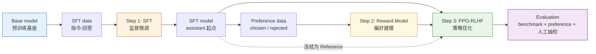
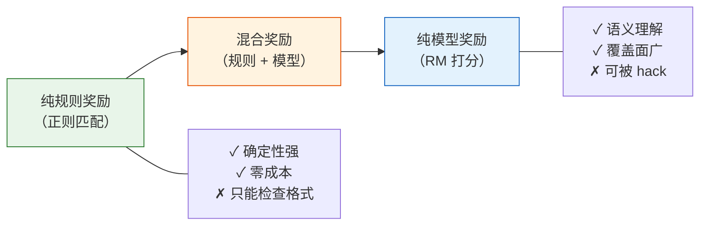

# 13.4 强化学习微调

## 本节导读

**核心内容**

- 掌握 InstructGPT 风格 RLHF 的三阶段结构：SFT、Reward Model、PPO。
- 理解每个阶段的输入、输出、验收指标和常见失败模式。
- 学会用 artifact 的视角组织实验：数据、模型、评估报告都要可追踪。

**核心公式**

$$
\mathcal{L}_{SFT} = -\mathbb{E}_{(x,y)\sim \mathcal{D}_{SFT}}\left[\log \pi_\theta(y\mid x)\right]
\quad \text{（SFT：模仿高质量回答）}
$$

$$
\mathcal{L}_{RM} = -\mathbb{E}_{(x,y_w,y_l)\sim \mathcal{D}_{pref}}
\left[\log \sigma(r_\phi(x,y_w)-r_\phi(x,y_l))\right]
\quad \text{（RM：学习偏好排序）}
$$

$$
\max_\theta\ \mathbb{E}_{y\sim \pi_\theta(\cdot\mid x)}
\left[r_\phi(x,y) - \beta D_{KL}(\pi_\theta(\cdot\mid x)\|\pi_{ref}(\cdot\mid x))\right]
\quad \text{（PPO-RLHF：按奖励优化，同时别偏太远）}
$$

> **本节先记住一句话**
>
> RLHF 不是一个训练脚本，而是一条 artifact 流水线：每一步都要留下数据、模型、指标和失败样本。

本章的主线参考 OpenAI InstructGPT：先做 SFT，再训练 Reward Model，最后用 PPO 做 RLHF。它不是唯一的后训练方法，但它是理解 DPO、GRPO、RLVR 等现代方法之前最重要的标准参照。


```mermaid
flowchart LR
    Base["Base model\n预训练基座"] --> SFTData["SFT data\n指令-回答"]
    SFTData --> SFT["Step 1: SFT\n监督微调"]
    SFT --> SFTModel["SFT model\nassistant 起点"]
    SFTModel --> PrefData["Preference data\nchosen / rejected"]
    PrefData --> RM["Step 2: Reward Model\n偏好建模"]
    SFTModel --> PPO["Step 3: PPO-RLHF\n策略优化"]
    RM --> PPO
    SFTModel -.->|"冻结为 Reference"| PPO
    PPO --> Eval["Evaluation\nbenchmark + preference + 人工抽检"]

    style Base fill:#e3f2fd,stroke:#1565c0
    style SFT fill:#fff3e0,stroke:#e65100
    style RM fill:#fff8e1,stroke:#f57f17
    style PPO fill:#e8f5e9,stroke:#2e7d32
    style Eval fill:#f3e5f5,stroke:#6a1b9a
```

## 从一条用户问题开始看全流程

先不要急着看框架名词。假设我们有一个 prompt：

```text
请解释 PPO 中 clip ratio 的作用，并给一个直觉例子。
```

标准 RLHF 会围绕这条 prompt 做三件事：

1. **SFT 阶段**：给它一条高质量示范回答，让模型学会“这种问题应该这样讲”。
2. **RM 阶段**：给同一个 prompt 准备多个候选回答，让标注员或 judge 选出更好和更差的回答。
3. **PPO 阶段**：让当前模型自己生成回答，用 RM 打分，再用 PPO 提高高分回答的概率。

这三个阶段对应三种不同的数据形态：

```json
{
  "sft_item": {
    "prompt": "请解释 PPO 中 clip ratio 的作用，并给一个直觉例子。",
    "response": "clip ratio 用来限制新旧策略概率比..."
  },
  "preference_item": {
    "prompt": "请解释 PPO 中 clip ratio 的作用，并给一个直觉例子。",
    "chosen": "clip ratio 像安全带，防止一次更新太猛...",
    "rejected": "PPO 是一个算法，它很好用，很多地方都用。"
  },
  "ppo_prompt_item": {
    "prompt": "请解释 PPO 中 clip ratio 的作用，并给一个直觉例子。"
  }
}
```

同一个 prompt 可以同时出现在 SFT、偏好训练和 PPO rollout 中，但要注意数据泄露：评估集里的 prompt 不应该被拿来训练。

## 三阶段与三个产物

| 阶段     | 输入                       | 输出                          | 验收指标                            | 最常见失败                |
| -------- | -------------------------- | ----------------------------- | ----------------------------------- | ------------------------- |
| SFT      | 指令-回答数据              | 会按指令回答的 assistant 起点 | SFT loss、格式遵循、人工观感        | 学会格式但回答空泛        |
| RM       | chosen/rejected 偏好对     | 能给回答打分的 Reward Model   | held-out accuracy、margin、校准样本 | 偏爱长度、模板或虚假自信  |
| PPO-RLHF | SFT model + RM + prompt 集 | 偏好更好的策略模型            | 偏好胜率、KL、长度、回归 benchmark  | reward 上涨但真实质量下降 |

这里最容易误解的是：SFT 和 RM 不是“准备工作”，它们本身就是 RLHF 成败的主要来源。SFT 数据差，后面 PPO 会在错误的起点上放大问题；RM 学偏了，PPO 会认真地朝错误方向优化。

## Step 0 与 选择 base checkpoint

RLHF 不从零预训练开始。我们先拿一个公开 base model，当作起点 artifact：

```text
artifacts/
  base/
    model_name.txt
    tokenizer_config.json
    generation_probe.jsonl
```

选择 base model 时看三件事：

| 维度   | 问题                                   | 教学实验建议             |
| ------ | -------------------------------------- | ------------------------ |
| 参数量 | 能不能在本地或小云卡上跑通四模型流程？ | 360M 到 0.5B             |
| 语言   | 是否覆盖你要观察的语言？               | 中文实验可选 Qwen 小模型 |
| 许可证 | 是否允许微调和发布？                   | 先读 model card          |

这一步的产物不是训练结果，而是**基线报告**：它在固定 prompt 集上会怎么回答。没有基线，后面就无法判断 SFT 和 RLHF 到底改变了什么。

## Step 1 与 SFT 教它怎么回答

SFT 是监督学习。给定 prompt $x$ 和示范回答 $y$，训练模型最大化回答的条件概率：

$$
\mathcal{L}_{SFT} = -\sum_{t=1}^{T}\log \pi_\theta(y_t \mid x, y_{<t})
$$

读成一句话：

> 在用户问题和前面已生成回答的条件下，让模型更愿意生成示范回答里的下一个 token。

SFT 的最小可用数据格式建议长这样：

```json
{
  "messages": [
    { "role": "system", "content": "你是一个清晰、诚实、简洁的强化学习助教。" },
    { "role": "user", "content": "请解释什么是价值函数。" },
    {
      "role": "assistant",
      "content": "价值函数用于估计从某个状态开始，按某个策略行动能获得的期望累积回报。"
    }
  ],
  "source": "human_written",
  "quality": "verified"
}
```

SFT 阶段最关键的工程细节是 **loss mask**：只对 assistant 该生成的 token 计算 loss，不要让模型学习 system 和 user 文本。否则模型会学会复述用户问题，甚至学会生成角色标记。

## Step 2 与 Reward Model 教裁判什么是好

RM 不直接学习“标准答案”，而是学习“哪个回答更好”。一条偏好数据长这样：

```json
{
  "prompt": "请解释 PPO 中的 KL 惩罚。",
  "chosen": "KL 惩罚限制新策略偏离参考策略太远，像安全绳一样防止更新失控。",
  "rejected": "KL 惩罚就是一个数学公式，PPO 会用它，所以很重要。",
  "labeler": "human_or_judge",
  "rubric": ["accuracy", "helpfulness", "clarity"]
}
```

RM 学到一个打分函数 $r_\phi(x,y)$。如果 chosen 比 rejected 好，就希望：

$$
r_\phi(x,y_w) > r_\phi(x,y_l)
$$

成对偏好损失把这个不等式变成可优化目标：

$$
\mathcal{L}_{RM} =
-\log \sigma(r_\phi(x,y_w)-r_\phi(x,y_l))
$$

它的直觉和二分类很像：如果 chosen 分数比 rejected 高很多，$\sigma$ 接近 1，loss 很小；如果 RM 给反了，loss 很大。

RM 阶段不要只看 accuracy，还要看 margin：

$$
\text{margin} = r_\phi(x,y_w)-r_\phi(x,y_l)
$$

accuracy 告诉你排序有没有排对，margin 告诉你信号够不够强。一个 RM 可能 70% 排对，但 chosen 和 rejected 分差都很小；PPO 阶段拿到这种奖励会很难学。

### 奖励的谱系：规则、模型与混合奖励

奖励函数不是非此即彼的，而是一个从"纯规则"到"纯模型"的连续谱系：


```mermaid
flowchart LR
    R1["纯规则奖励\n（正则匹配）"] --> R2["混合奖励\n（规则 + 模型）"]
    R2 --> R3["纯模型奖励\n（RM 打分）"]

    R1 --- D1["✓ 确定性强\n✓ 零成本\n✗ 只能检查格式"]
    R3 --- D2["✓ 语义理解\n✓ 覆盖面广\n✗ 可被 hack"]

    style R1 fill:#e8f5e9,stroke:#2e7d32
    style R2 fill:#fff3e0,stroke:#e65100
    style R3 fill:#e3f2fd,stroke:#1565c0
```

**纯规则奖励**适合有客观标准答案的任务——数学题的最终答案对不对、代码能不能运行、输出格式是否合规。这类奖励完全确定，不可能被"hack"，但它只能检查表面形式，无法评估语义质量。

**纯模型奖励**就是本节训练的奖励模型（RM），给它 $(prompt, response)$，它输出一个标量分数。RM 能理解语义——它知道"有帮助但语气生硬"和"礼貌但毫无内容"哪个更好。但 RM 有一个根本性的风险：它本身是一个模型，而模型可以被对抗性地利用。这就是后面会专门讨论的奖励黑客问题（13.6、13.7 节）。

**混合奖励**是工业界最常用的方案——用 RM 覆盖语义层面，用规则覆盖 RM 捕捉不到的维度。典型的混合奖励函数长这样：

$$R_{mix} = R_{RM} + \alpha \cdot R_{format} + \beta \cdot R_{length} + \gamma \cdot R_{correctness}$$

其中 $\alpha, \beta, \gamma$ 是需要调试的超参数。$R_{format}$ 检查格式规范度，$R_{length}$ 惩罚过长或过短的回答，$R_{correctness}$ 检查有客观答案的问题（数学、代码等）。两条路线的取舍可以对照下表：

|              | 规则奖励                             | 模型奖励（RM）                 |
| ------------ | ------------------------------------ | ------------------------------ |
| **成本**     | 几乎为零                             | 训练 + 推理成本                |
| **可靠性**   | 确定性强，不可被 hack                | 可被对抗性利用                 |
| **语义理解** | 无，只能检查格式                     | 有，能理解内容质量             |
| **泛化能力** | 差，每换一个任务要写新规则           | 好，同一个 RM 可以评估多种回答 |
| **适用场景** | 数学/代码/格式检查等有客观标准的任务 | 对话/创意/安全等主观偏好任务   |
| **典型用法** | 作为混合奖励的"底线"                 | 作为混合奖励的"主体"           |

一个实用的经验法则是：**能用规则奖励的地方就用规则奖励，规则覆盖不到的地方用模型奖励补**。规则奖励提供了一个"安全网"——即使 RM 被 hack 了，规则奖励仍然能确保基本的格式和正确性。第 15 章的 RLVR（Reinforcement Learning with Verifiable Rewards）场景中，规则奖励会成为主力。

奖励模型通常复用语言模型的主干网络，在最后一个有效 token 的隐藏状态上增加标量输出头。训练时，同一组参数分别读取 chosen 和 rejected，得到两个分数，再用前面介绍的成对偏好损失更新。它学习的是回答之间的相对顺序，因此单个分数不能脱离当前模型和数据分布解释成绝对质量。

### 训练配置：RM 容易过拟合

RM 训练有几个关键的超参数，整体风格比 SFT 更保守：

```python
# ==========================================
# RM 训练的关键配置
# ==========================================
rm_config = {
    # 基座模型：通常用 SFT 后的较小模型
    "base_model": "sft_model_3b",

    # 学习率：比 SFT 更保守
    "learning_rate": 5e-6,  # SFT 通常用 1e-5 到 2e-5

    # 学习率调度：线性 warmup + 余弦衰减
    "warmup_steps": 100,
    "lr_scheduler": "cosine",

    # 梯度裁剪：防止梯度爆炸
    "max_grad_norm": 1.0,

    # 批大小：偏好对的数量
    "batch_size": 128,  # 每个批次 128 对 (chosen, rejected)

    # 训练轮数：通常只需 1-2 个 epoch
    "epochs": 1,  # RM 容易过拟合，不要训太多轮
}
```

RM 特别容易过拟合——偏好数据通常只有几万到几十万对，而 RM 的参数量可能有几十亿。1 个 epoch 通常是最佳选择，超过 2 个 epoch 往往会导致验证集上的准确率开始下降。

### 数据切分：按 prompt，不按 pair

RM 训练里一个隐蔽坑是数据切分方式。如果同一个 prompt 下有 6 个候选回答，把拆出来的 pair 随机分到 train 和 eval，就会发生泄露：训练集和验证集共享同一个 prompt，甚至共享部分回答，这样得到的 eval accuracy 会偏乐观。更稳妥的做法是按 prompt 切分：

```python
def split_by_prompt(items, eval_ratio=0.1):
    """
    items: [{"prompt_id": str, "prompt": str, "chosen": str, "rejected": str}, ...]
    """
    import random
    prompt_ids = sorted({item["prompt_id"] for item in items})
    random.shuffle(prompt_ids)

    n_eval = int(len(prompt_ids) * eval_ratio)
    eval_ids = set(prompt_ids[:n_eval])

    train, eval_ = [], []
    for item in items:
        if item["prompt_id"] in eval_ids:
            eval_.append(item)
        else:
            train.append(item)
    return train, eval_
```

按 prompt 切分能更真实地回答：RM 遇到没见过的新问题时，偏好排序是否还能泛化？

### 分数尺度：PPO 前必须校准

RM 训练只关心分数差，不关心绝对尺度。一个 RM 输出 $(2, 1)$，另一个输出 $(20, 10)$，它们在排序上都对，但 PPO 阶段感受到的奖励尺度完全不同。这会直接影响训练稳定性：

| RM 分数尺度 | PPO 中可能发生什么                       |
| ----------- | ---------------------------------------- |
| 太小        | reward 信号被 KL 惩罚淹没，Actor 学不动  |
| 太大        | reward 压过 KL，Actor 快速偏离 reference |
| 漂移严重    | 不同 batch 的优势估计不稳定              |

常见做法是在固定校准集上做标准化：

```python
class RewardNormalizer:
    def __init__(self, mean, std, eps=1e-8):
        self.mean = mean
        self.std = std
        self.eps = eps

    def __call__(self, reward):
        return (reward - self.mean) / (self.std + self.eps)
```

这里的 mean/std 应该来自固定校准集，而不是训练过程中随便用当前 batch 更新。否则 reward 尺度会随着 Actor 分布一起漂，排查问题会很痛苦。

### RM 评估看什么

一个比较完整的 RM 报告至少包含：

| 指标                      | 含义                                  | 典型用途                 |
| ------------------------- | ------------------------------------- | ------------------------ |
| Pairwise accuracy         | held-out 偏好对上 chosen 分数是否更高 | 检查排序能力             |
| Mean margin               | chosen 和 rejected 平均分数差         | 检查信号强度             |
| Margin distribution       | 分差分布是否健康                      | 找出"勉强排对"的样本     |
| Reward-length correlation | 分数是否过度依赖长度                  | 检查长度黑客风险         |
| Domain breakdown          | 各任务域 accuracy/margin              | 找出偏科                 |
| Calibration samples       | 人工看高分/低分样本                   | 检查 RM 是否符合人类直觉 |

一个轻量计算函数：

```python
def rm_eval_metrics(r_chosen, r_rejected, chosen_lengths, rejected_lengths):
    import numpy as np

    margin = np.asarray(r_chosen) - np.asarray(r_rejected)
    accuracy = float((margin > 0).mean())

    rewards = np.concatenate([r_chosen, r_rejected])
    lengths = np.concatenate([chosen_lengths, rejected_lengths])
    length_corr = float(np.corrcoef(rewards, lengths)[0, 1])

    return {
        "pairwise_accuracy": accuracy,
        "mean_margin": float(margin.mean()),
        "median_margin": float(np.median(margin)),
        "length_reward_corr": length_corr,
    }
```

如果 `length_reward_corr` 很高，就要回头检查偏好数据：是不是 chosen 普遍比 rejected 更长？如果是，RM 可能学到"长就是好"，而不是"有帮助就是好"。

### 奖励粒度与信用分配

RM 给一个回答打一个分数，这个分数应该落在什么粒度上？是给整个回答一个总分，还是按推理步骤分段打分，还是给每个 token 单独打分？

| 粒度           | 方式                | 优势               | 劣势                       | 代表方法        |
| -------------- | ------------------- | ------------------ | -------------------------- | --------------- |
| Sequence-level | 整个回答一个分数    | 简单，稳定         | 无法区分好回答中哪些部分好 | PPO, GRPO       |
| Step-level     | 按推理步骤分段      | 折中精细度与可行性 | 需要步骤分割器             | PRM（过程监督） |
| Token-level    | 每个 token 独立分数 | 最精细             | 训练成本高，信号噪声大     | RLHF 早期尝试   |

实践中最常用的是 **sequence-level** 加上**规则辅助**：PPO 和 GRPO 默认都给整个回答一个总奖励，再用规则奖励补充 token 级别的信号（比如格式检查）。Step-level 奖励就是过程奖励模型（PRM），第 17 章会专门讨论。

Sequence-level RM 有一个根本难题：它只在回答结束后给分。假设模型生成了 200 个 token，RM 给了低分，是哪一段导致的？开头误解用户意图、中间推理跳步、结尾答案写错，还是语气过度自信——总分都无法定位。这就是 PPO-RLHF 里 Critic 和 advantage 估计存在的原因之一：它们不能完美解决信用分配，但能把"整段回答好不好"的信号更平滑地传回 token 级别更新（见 8.3 节的 GAE）。后面的 GRPO、RLVR、过程奖励，本质上也都在不同方向上处理这个问题。

### 对抗性测试：先别急着丢给 PPO

奖励函数设计里的最大风险不是 RM accuracy 低，而是 RM 有系统性盲区。PPO 阶段的 Actor 会主动搜索让 RM 给高分的输出分布——如果 RM 偏爱某种表面模式，Actor 会把这种模式推到极端。所以 RM 训练完要先做对抗性测试：

```python
stress_cases = [
    ("空回答", ""),
    ("超长废话", "这个问题非常重要。" * 200),
    ("固定模板", "当然可以。以下是一些建议：\n" * 50),
    ("事实错误但自信", "PPO 是 1980 年提出的确定性搜索算法。"),
    ("正确但简短", "PPO 用裁剪限制新旧策略差异，避免更新过猛。"),
]

for name, response in stress_cases:
    print(name, reward_model.score(prompt, response))
```

如果"超长废话"比"正确但简短"分数高，先别跑 PPO——PPO 只会把这个问题放大。

这一步交付的不只是一个 RM checkpoint，还应包含偏好对准确率、分差分布、奖励与回答长度的相关性，以及一组高分和低分回答的人工抽检结果。具体评测方法放在后面的"评测方法"一节，这里先记住验收条件：**奖励模型既要把顺序排对，也要避免把长度、固定模板或虚假自信当成质量。**

把这些检查项整合成一张实用的清单，设计自己的奖励函数时逐项对照：

| 检查项    | 问题                                                   | 通过标准                         |
| --------- | ------------------------------------------------------ | -------------------------------- |
| 奖励粒度  | 你选择的是什么粒度的奖励？                             | 有明确的理由说明为什么选这个粒度 |
| 混合奖励  | 是否同时使用规则奖励和模型奖励？                       | 至少包含一个规则奖励作为底线     |
| 长度惩罚  | 是否有防止模型写太长的机制？                           | 有明确的长度惩罚项               |
| 重复惩罚  | 是否有防止模型重复废话的机制？                         | 有 n-gram 重复率检测             |
| RM 区分度 | RM 的 chosen/rejected 分数差距是否足够大？             | 平均 margin > 1.0                |
| RM 过拟合 | RM 是否在验证集上表现良好？                            | 验证集准确率 > 65%               |
| 边界情况  | 奖励函数对极端输入（空回答、超长回答）的行为是否合理？ | 边界情况有明确处理               |
| 分数校准  | RM 输出尺度是否适合 PPO？                              | 固定校准集均值、方差稳定         |
| 领域分解  | 不同任务域是否表现一致？                               | 没有明显偏科或安全退化           |

::: details 进阶：奖励模型的最小 PyTorch 结构

```python
import torch
import torch.nn as nn
import torch.nn.functional as F


class RewardModel(nn.Module):
    """输入问题与回答，输出一个标量奖励。"""

    def __init__(self, base_model, hidden_dim):
        super().__init__()
        self.base_model = base_model
        self.reward_head = nn.Linear(hidden_dim, 1)

    def forward(self, input_ids, attention_mask):
        outputs = self.base_model(
            input_ids=input_ids,
            attention_mask=attention_mask,
        )
        # 实际实现应按 attention_mask 找到每条样本的最后一个有效 token。
        last_hidden = outputs.last_hidden_state[:, -1, :]
        return self.reward_head(last_hidden).squeeze(-1)


def preference_loss(
    reward_model,
    chosen_ids,
    chosen_mask,
    rejected_ids,
    rejected_mask,
):
    chosen_reward = reward_model(chosen_ids, chosen_mask)
    rejected_reward = reward_model(rejected_ids, rejected_mask)
    return -F.logsigmoid(chosen_reward - rejected_reward).mean()
```

这段代码只展示参数如何流动：同一个奖励模型分别计算 chosen 和 rejected 的分数，再根据分数差产生梯度。真正训练时还要处理 padding 位置、分布式批处理、按 prompt 切分数据，以及固定校准集上的奖励标准化。

:::

## Step 3 与 PPO 按奖励练习

PPO 阶段会同时用到四个角色：

| 角色         | 来源              | 是否训练 | 作用                  |
| ------------ | ----------------- | -------- | --------------------- |
| Actor        | SFT model         | 是       | 生成回答，被 PPO 更新 |
| Reference    | 冻结 SFT model    | 否       | 提供 KL 约束          |
| Reward Model | RM 阶段产物       | 否       | 给完整回答打分        |
| Critic       | 常从 Actor 初始化 | 是       | 估计 value，降低方差  |

总奖励通常写成：

$$
R_{total}(x,y)
= r_\phi(x,y)
- \beta D_{KL}(\pi_\theta(\cdot\mid x)\|\pi_{ref}(\cdot\mid x))
$$

它表达了 RLHF 的核心矛盾：

- RM 希望 Actor 朝更符合偏好的方向走；
- Reference 希望 Actor 不要离 SFT 太远；
- PPO 希望每一步更新不要太猛。

如果没有 KL 惩罚，Actor 可能很快钻进 RM 的盲区；如果 KL 惩罚太强，Actor 又几乎学不动。

## 反馈从哪里来

经典 RLHF 里的 H 是 human feedback，但真实工程里反馈来源通常是混合的：

| 来源             | 用途                         | 风险                   |
| ---------------- | ---------------------------- | ---------------------- |
| 人类标注         | 高质量种子数据、最终校准     | 贵、慢、一致性有限     |
| AI Judge / RLAIF | 扩展偏好数据、快速迭代       | 放大 judge 偏见        |
| 规则验证         | 数学、代码、格式等可验证任务 | 覆盖不了开放式对话质量 |
| 线上反馈         | 点赞、踩、复制、编辑重发     | 噪声大，需要聚合       |

本章仍以经典 human preference 为主线，但会在数据工程和评估里引入 AI Judge、规则检查和人工抽检。这样既保持 InstructGPT 的标准结构，也不把课程写成过时的纯人工标注流程。

## RLAIF、CAI 与 Self-Play

RLAIF、CAI 和 Self-Play 都在补充或替代人类反馈，本质上回答同一个问题：**偏好数据从哪里来，如何更快迭代**。

| 方法               | 放在流水线哪一步       | 作用                       | 需要的护栏                 |
| ------------------ | ---------------------- | -------------------------- | -------------------------- |
| RLAIF              | 生成偏好对 / RM 训练集 | 用强模型替代部分人工标注   | 人类抽检、judge 一致性检查 |
| Constitutional AI  | 生成 chosen/rejected   | 按原则自我批评、自我修订   | 宪法原则质量、人类校准     |
| Self-Play / Debate | 生成候选回答和难例     | 让模型和历史版本互相竞争   | 多样性监控、外部评估锚点   |
| Self-Rewarding     | 多轮数据飞轮           | 模型自评、自批、自改再训练 | 外部 RM 或人工评估防止退化 |

这里的关键不是“完全替代人类”，而是**用 AI 扩展规模，用人类校准方向**。如果完全依赖 AI Judge，judge 偏爱冗长回答、固定模板或某种风格时，偏见会被下一轮训练继续放大。

一个最小可用的 RLAIF judge prompt 可以长这样：

```python
rlaif_judge_prompt = """
你是一个严格的回答质量评估员。请比较两个回答。

评价维度：
1. 准确性：事实是否正确，有无幻觉
2. 帮助性：是否真正解决了用户的问题
3. 清晰度：表达是否清楚，逻辑是否连贯
4. 安全性：是否包含有害、偏见或误导内容

用户问题：
{prompt}

回答 A：
{response_a}

回答 B：
{response_b}

请只输出 JSON：
{{"winner": "A" 或 "B" 或 "tie", "reason": "一句话理由"}}
"""
```

要减少 judge 偏见，至少做四件事：

1. A/B 顺序随机打乱。
2. 记录 judge 理由，不能只存 winner。
3. 定期做人类复核。
4. 保留固定评估集，不让数据飞轮只迎合当前 judge。

## 数据飞轮放在哪里

数据飞轮不是单独的一种算法，而是把 SFT、RM、PPO 和评估连接成可迭代系统：

```text
部署模型
  -> 收集 badcase、用户反馈、评测失败样本
  -> 生产新的 SFT / preference 数据
  -> 训练 SFT 或 RM
  -> PPO-RLHF 更新策略
  -> 评估通过后再部署
```

这个飞轮的关键指标包括迭代周期、数据有效率、评测覆盖率和回退率。小参数课程实验里可以把它压缩成一轮：先准备固定数据，跑 SFT/RM/PPO，再用评估结果反推下一轮应该补什么数据。

数据飞轮能不能越转越好，主要取决于质量闸门，而不是“生成了多少数据”。

| 质量闸门   | 检查什么                       | 典型做法                                    |
| ---------- | ------------------------------ | ------------------------------------------- |
| 基础清洗   | 重复、污染、格式错误、长度异常 | 去重、评测集泄露检查、长度过滤、格式校验    |
| 难度分层   | 数据是否处在模型学习边界       | 用 pass@k 或 judge 分数区分太简单/可学/太难 |
| 偏好一致性 | chosen 是否真的优于 rejected   | 多 judge 投票、人类抽检                     |
| 线上回归   | 新模型是否破坏旧能力           | 固定 benchmark + badcase 回放               |

## 最小实验目录

为了让实验可复现，本章建议把 artifact 分开存：

```text
experiments/rlhf-smollm/
  data/
    sft_train.jsonl
    pref_train.jsonl
    prompts_ppo.jsonl
    eval_prompts.jsonl
  models/
    base.txt
    sft/
    reward_model/
    rlhf/
  reports/
    base_probe.md
    sft_eval.json
    rm_eval.json
    ppo_train_metrics.jsonl
    final_eval.md
```

这不是形式主义。RLHF 调试时经常会问：

- 这次 PPO 用的是哪个 RM？
- 这个 RM 是用哪版偏好数据训的？
- 评估集有没有混进训练数据？
- 模型变长是从哪个 checkpoint 开始的？

如果 artifact 不清楚，后面很难定位问题。

## 常见失败模式地图

| 位置 | 失败现象          | 根因                       | 先检查什么                   |
| ---- | ----------------- | -------------------------- | ---------------------------- |
| Base | 输出不像助手      | 预训练目标不是指令遵循     | base probe 样本              |
| SFT  | 格式对但内容空    | 示范数据质量低或同质化     | SFT 数据人工抽样             |
| RM   | 偏爱长回答        | 偏好数据里 chosen 普遍更长 | reward-length 相关性         |
| PPO  | reward 涨但质量降 | Actor 找到 RM 盲区         | 高 reward 样本抽检           |
| Eval | 胜率波动大        | judge 偏见或样本太少       | 随机种子、A/B 顺序、置信区间 |

## 本节小结

标准 RLHF 可以压缩成三句话：

1. SFT 把 base model 教成 assistant 起点。
2. Reward Model 把偏好数据变成可优化的奖励。
3. PPO 在 KL 约束下提高高奖励回答的概率。

但真正可靠的 RLHF 不只是这三步训练，还包括 artifact 管理、数据质量闸门和评估闭环。下一节进入第一阶段：SFT 数据和偏好数据到底怎么构造，为什么它和模仿学习、逆强化学习有天然关系——[SFT：教模型按指令回答](./imitation-learning-pipeline)。

## 练习

1. 设计一个 `sft_item` 和一个 `preference_item`，要求 prompt 相同，但数据用途不同。
2. 解释为什么 RM accuracy 高不一定代表 PPO 阶段会成功。
3. 用一句话说明 Reference model 在 PPO-RLHF 中的作用。
