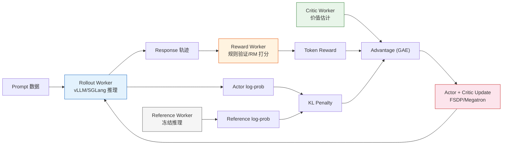

# 13.7 veRL PPO 训练 GSM8K

8.5 节我们讲了 PPO-RLHF 的四模型协作原理——Actor、Reference、Reward Model、Critic 各自的角色，以及 KL 惩罚、token-level reward、advantage 估计的数学关系。这一节我们换一个姿势：用工业级框架 [veRL](https://github.com/volcengine/verl)，在 GSM8K 数学推理数据集上跑通 PPO 训练。

手写伪代码帮你理解原理；veRL 帮你跑真实验。两者的关系类似第 5 章用 Stable Baselines3 跑 PPO——算法一样，但框架帮你处理了分布式调度、显存优化、推理加速等工程细节。

## veRL 简介

[veRL](https://github.com/volcengine/verl)（Volcano Engine Reinforcement Learning）由字节跳动 Seed 团队发起，是当前社区最活跃的 LLM RL 训练框架之一（GitHub 10k+ stars），其论文 HybridFlow 发表于 EuroSys 2025。

和 8.5 节提到的小参数 TRL 实验相比，veRL 的核心增值点：

| 特性       | TRL 小参数实验          | veRL                                         |
| ---------- | ----------------------- | -------------------------------------------- |
| 推理引擎   | `model.generate()` 逐条 | vLLM / SGLang continuous batching            |
| 训练引擎   | 单卡 AdamW              | FSDP / FSDP2 / Megatron-LM                   |
| 多模型调度 | 同进程，共享内存        | Ray 远程调用，Actor/RM/Critic/Ref 分角色部署 |
| 显存优化   | LoRA 或单卡             | ZeRO、梯度检查点、3D-HybridEngine 权重重分片 |
| 分布式     | 单进程                  | Ray 集群，支持多机多卡                       |
| 算法       | PPO                     | PPO / GRPO / DAPO / RLOO / ReMax 等 10+ 种   |
| 奖励类型   | Reward Model            | Reward Model + 规则奖励（verifiable reward） |

veRL 的核心设计思想是**混合控制器编程模型**：把 RL 训练中的推理（rollout）、训练（update）、奖励计算（reward）解耦为独立的 worker，通过 Ray 调度在同一组 GPU 上交替执行。这种设计让同一套代码可以在单卡上跑 0.5B 小模型，也可以无缝扩展到多机多卡跑 70B+ 大模型。



## 为什么选 GSM8K

[GSM8K](https://huggingface.co/datasets/openai/gsm8k)（Grade School Math 8K）是 OpenAI 发布的小学数学应用题数据集，包含约 7,500 道训练题和 1,319 道测试题。它成为 RL for LLM 的标准 benchmark 有三个原因：

1. **天然有规则奖励**——答案是否正确可以自动验证，不需要训练 Reward Model。这和 8.5 节的 RLHF 不同：那里需要单独训练一个 RM 来提供偏好信号，而数学题直接比较数值就行。
2. **推理链长度适中**——典型回答 50~200 token，不会像长代码那样撑爆显存，也不会像单句回答那样让 PPO 的 token-level advantage 失去意义。
3. **社区基线丰富**——火山引擎官方在 VKE 集群上提供了完整的 Qwen2.5-0.5B PPO 训练教程和评测结果（42.08% → 54.89%），可以对照。

这个实验的重点不是追求 SOTA 分数，而是让你在真实数据集上看到 PPO 训练的完整生命周期：数据准备 → 奖励函数设计 → 配置调参 → 训练循环 → 指标解读。

## 环境准备

### 硬件要求

本节配置针对**单张 GPU**（24GB 显存，如 RTX 3090 / 4090 / A5000）：

| 模型              | 参数量 | 训练方案    | 显存需求       |
| ----------------- | ------ | ----------- | -------------- |
| Qwen/Qwen2.5-0.5B | 0.5B   | 全参训练    | ~16 GB（单卡） |
| Qwen/Qwen2.5-0.5B | 0.5B   | 全参 + vLLM | ~18 GB（单卡） |
| Qwen/Qwen2.5-1.5B | 1.5B   | 全参训练    | ~22 GB（单卡） |
| Qwen/Qwen2.5-1.5B | 1.5B   | LoRA + vLLM | ~20 GB（单卡） |

PPO-RLHF 需要同时加载 Actor、Critic（可训练）和 Reference、Reward（冻结推理），所以显存压力比纯 SFT 大。0.5B 模型 + 全参训练是最安全的单卡起点。

### 安装 veRL

推荐使用 conda 环境 + pip 安装：

```bash
# 创建环境
conda create -n verl python==3.10 -y
conda activate verl

# 安装 PyTorch（CUDA 12.x）
pip install torch torchvision --index-url https://download.pytorch.org/whl/cu121

# 安装 veRL
git clone https://github.com/volcengine/verl.git
cd verl
pip install -e .

# 安装 vLLM（推理引擎）
pip install vllm==0.8.3

# 安装 Flash Attention
pip install flash-attn --no-build-isolation
```

安装完成后，验证环境：

```bash
python -c "import verl; print(verl.__version__)"
python -c "import vllm; print(vllm.__version__)"
```

::: details 常见安装问题

**Flash Attention 编译失败**：需要 CUDA toolkit 和 GCC。如果编译时间过长或报错，可以跳过——veRL 会自动回退到 PyTorch 原生 attention，速度慢一点但功能不受影响。

**vLLM 版本冲突**：veRL 要求 vLLM >= 0.8.2。如果遇到 `ImportError: cannot import name 'ForkingPickler'`，升级 `tensordict` 到 0.6.2：`pip install tensordict==0.6.2`。
:::

### 数据准备

veRL 提供了内置的 GSM8K 数据预处理脚本，一行命令即可完成下载和格式转换：

```bash
# 使用 veRL 内置脚本预处理 GSM8K
python3 examples/data_preprocess/gsm8k.py --local_dir ~/data/gsm8k
```

这个脚本会自动下载 GSM8K 数据集，提取 `####` 后的标准答案作为 `ground_truth`，并转换为 veRL 要求的 parquet 格式。处理完成后 `~/data/gsm8k/` 下会生成 `train.parquet` 和 `test.parquet` 两个文件。

::: details parquet 文件内部结构

如果你想手动处理或自定义数据格式，parquet 文件的每一行包含三个关键字段：

```json
{
  "prompt": "Natalia sold clips to 48 of her friends in April, and then she sold half as many clips in May. How many clips did Natalia sell altogether in April and May?",
  "reward_model": { "ground_truth": "72" },
  "data_source": "openai/gsm8k"
}
```

- **`prompt`**：题目文本，PPO 训练时作为 Actor 的输入
- **`reward_model`**：字典格式，`ground_truth` 是标准答案，reward function 会通过这个字段验证回答
- **`data_source`**：数据来源标识，用于日志分组

等效的手动预处理脚本：

```python
from datasets import load_dataset

ds = load_dataset("openai/gsm8k", "main")
for split in ["train", "test"]:
    df = ds[split].to_pandas()
    df = df.rename(columns={"question": "prompt", "answer": "reward_model"})
    df["reward_model"] = df["reward_model"].apply(
        lambda x: {"ground_truth": x.split("####")[-1].strip()}
    )
    df["data_source"] = "openai/gsm8k"
    df.to_parquet(f"~/data/gsm8k/{split}.parquet")
```

推荐优先使用 veRL 内置脚本——它会跟随 veRL 版本更新，避免格式不兼容的问题。
:::

## Reward 函数设计

GSM8K 的 reward 不需要训练 Reward Model——直接用规则验证答案即可。这和 8.5 节讲的 RLHF 不同：RLHF 用 RM 提供偏好信号，而数学推理用**可验证奖励**（verifiable reward）。9.4 节会详细讨论 RLVR 范式，这里先用一个简单的实现。

本仓库已经提供了课程适配版本：[`code/chapter15_rlhf/verl_gsm8k/gsm8k_reward.py`](../../../code/chapter15_rlhf/verl_gsm8k/gsm8k_reward.py)。如果你在 veRL 仓库内操作，也可以按下面内容创建同名文件：

```python
# gsm8k_reward.py

import re
from typing import Any

REWARD_NAME = "gsm8k"
REWARD_TYPE = "sequential"


def extract_answer(response: str) -> str | None:
    """从模型输出中提取最终答案。

    支持 \\boxed{} 格式和 <answer> 标签格式。
    """
    # 优先匹配 \\boxed{...}
    boxed = re.findall(r"\\boxed\{([^}]+)\}", response)
    if boxed:
        return boxed[-1].strip()

    # 其次匹配 <answer>...</answer>
    ans = re.search(r"<answer>(.*?)</answer>", response, re.DOTALL)
    if ans:
        return ans.group(1).strip()

    # 最后取最后一行数字
    lines = response.strip().split("\n")
    for line in reversed(lines):
        nums = re.findall(r"-?\d+\.?\d*", line)
        if nums:
            return nums[-1]

    return None


def check_answer(predicted: str | None, ground_truth: str) -> float:
    """比较预测答案和标准答案。"""
    if predicted is None:
        return 0.0
    try:
        # 统一转成数值比较，消除格式差异
        pred_val = float(predicted.replace(",", ""))
        gt_val = float(ground_truth.replace(",", ""))
        return 1.0 if abs(pred_val - gt_val) < 1e-6 else 0.0
    except (ValueError, TypeError):
        return 1.0 if predicted.strip() == ground_truth.strip() else 0.0


def compute_score(reward_input: dict[str, Any], **kwargs) -> dict[str, float]:
    """主 reward 函数。veRL 会自动传入 reward_input 字典。"""
    response = reward_input["response"]
    ground_truth = reward_input["ground_truth"]

    predicted = extract_answer(response)
    accuracy = check_answer(predicted, ground_truth)

    return {
        "overall": accuracy,
        "accuracy": accuracy,
        "format": 1.0 if predicted is not None else 0.0,
    }
```

这个 reward 函数的设计要点：

- **`extract_answer`**：从模型输出中提取最终答案。支持 `\\boxed{}` 格式（数学推理常用）、`<answer>` 标签格式（prompt 模板引导），以及最后兜底的"取最后一行数字"。
- **`check_answer`**：数值比较。`1,000` 和 `1000` 会被视为相同，`42` 和 `42.0` 也相同。
- **`compute_score`**：返回 `overall`（PPO 使用的总奖励）和两个辅助指标（`accuracy` 和 `format`），后者会记录到训练日志。

为什么不需要 Reward Model？因为 GSM8K 的答案是**客观可验证**的——答对就是 1.0，答错就是 0.0。这个信号虽然稀疏（整段回答只有一个 0/1），但它是精确的、无噪声的、不可被 hack 的。这正是 9.4 节 RLVR 的核心思想。

## 单卡训练脚本

基于 veRL 官方的 PPO 脚本，本仓库已经提供了适配单卡 + 0.5B 模型的启动脚本：[`code/chapter15_rlhf/verl_gsm8k/run_qwen2_5_0_5b_ppo_single_gpu.sh`](../../../code/chapter15_rlhf/verl_gsm8k/run_qwen2_5_0_5b_ppo_single_gpu.sh)。完整内容如下：

```bash
#!/bin/bash
# run_qwen2.5_0.5b_ppo_single_gpu.sh
# PPO | GSM8K | 单卡 | Qwen2.5-0.5B-Instruct

set -xeuo pipefail

# ==================== 可调参数 ====================
MODEL_PATH=${MODEL_PATH:-Qwen/Qwen2.5-0.5B-Instruct}
CRITIC_MODEL_PATH=${CRITIC_MODEL_PATH:-$MODEL_PATH}  # Critic 通常从同一模型初始化

# 单卡设置
NNODES=${NNODES:-1}
NDEVICES_PER_NODE=${NDEVICES_PER_NODE:-1}

# 训练参数（单卡需要调小）
TRAIN_BATCH_SIZE=${TRAIN_BATCH_SIZE:-128}      # 每步 rollout 的 prompt 数量
PPO_MINI_BATCH_SIZE=${PPO_MINI_BATCH_SIZE:-64}  # PPO 更新时的 mini-batch
MAX_PROMPT_LENGTH=${MAX_PROMPT_LENGTH:-512}     # prompt 最大长度
MAX_RESPONSE_LENGTH=${MAX_RESPONSE_LENGTH:-256}  # 回答最大长度

# 学习率
ACTOR_LR=${ACTOR_LR:-1e-6}
CRITIC_LR=${CRITIC_LR:-1e-5}

# 推理参数
ROLLOUT_TP=${ROLLOUT_TP:-1}                     # 张量并行度（单卡=1）
ROLLOUT_GPU_MEM_UTIL=${ROLLOUT_GPU_MEM_UTIL:-0.4}  # vLLM 显存占用
ROLLOUT_N=${ROLLOUT_N:-1}                       # 每个 prompt 生成几条回答

# 训练控制
TOTAL_EPOCHS=${TOTAL_EPOCHS:-20}
SAVE_FREQ=${SAVE_FREQ:-20}
TEST_FREQ=${TEST_FREQ:-5}

# 数据路径
GSM8K_TRAIN_FILE=${GSM8K_TRAIN_FILE:-$HOME/data/gsm8k/train.parquet}
GSM8K_TEST_FILE=${GSM8K_TEST_FILE:-$HOME/data/gsm8k/test.parquet}

# 实验名称
EXPERIMENT_NAME=${EXPERIMENT_NAME:-qwen2.5_0.5b_ppo_gsm8k_$(date +%Y%m%d_%H%M)}
# ==================== 可调参数结束 ====================

# ---- 数据配置 ----
DATA=(
    algorithm.adv_estimator=gae
    data.train_files="['$GSM8K_TRAIN_FILE']"
    data.val_files="['$GSM8K_TEST_FILE']"
    data.train_batch_size=${TRAIN_BATCH_SIZE}
    data.max_prompt_length=${MAX_PROMPT_LENGTH}
    data.max_response_length=${MAX_RESPONSE_LENGTH}
    data.filter_overlong_prompts=True
)

# ---- 模型配置 ----
MODEL=(
    actor_rollout_ref.model.path="$MODEL_PATH"
    actor_rollout_ref.model.use_remove_padding=True
    actor_rollout_ref.model.enable_gradient_checkpointing=True
)

# ---- Actor 配置 ----
ACTOR=(
    actor_rollout_ref.actor.optim.lr=${ACTOR_LR}
    actor_rollout_ref.actor.ppo_mini_batch_size=${PPO_MINI_BATCH_SIZE}
    actor_rollout_ref.actor.use_dynamic_bsz=True
    actor_rollout_ref.actor.ppo_max_token_len_per_gpu=16384
    actor_rollout_ref.actor.entropy_coeff=0
    actor_rollout_ref.actor.clip_ratio=0.2
    actor_rollout_ref.actor.fsdp_config.param_offload=False
    actor_rollout_ref.actor.fsdp_config.optimizer_offload=False
)

# ---- Rollout 配置 ----
ROLLOUT=(
    actor_rollout_ref.rollout.name=vllm
    actor_rollout_ref.rollout.tensor_model_parallel_size=${ROLLOUT_TP}
    actor_rollout_ref.rollout.gpu_memory_utilization=${ROLLOUT_GPU_MEM_UTIL}
    actor_rollout_ref.rollout.n=${ROLLOUT_N}
    actor_rollout_ref.rollout.log_prob_use_dynamic_bsz=True
    actor_rollout_ref.rollout.log_prob_max_token_len_per_gpu=16384
)

# ---- Reference 配置 ----
REF=(
    actor_rollout_ref.ref.log_prob_use_dynamic_bsz=True
    actor_rollout_ref.ref.log_prob_max_token_len_per_gpu=16384
    actor_rollout_ref.ref.fsdp_config.param_offload=True
)

# ---- Critic 配置 ----
CRITIC=(
    critic.model.path="$CRITIC_MODEL_PATH"
    critic.model.use_remove_padding=True
    critic.model.enable_gradient_checkpointing=True
    critic.optim.lr=${CRITIC_LR}
    critic.use_dynamic_bsz=True
    critic.ppo_max_token_len_per_gpu=16384
    critic.fsdp.param_offload=False
    critic.fsdp.optimizer_offload=False
)

# ---- Trainer 配置 ----
TRAINER=(
    trainer.balance_batch=True
    trainer.critic_warmup=0
    trainer.logger='["console","wandb"]'
    trainer.project_name=verl_ppo_gsm8k
    trainer.experiment_name=${EXPERIMENT_NAME}
    trainer.n_gpus_per_node=${NDEVICES_PER_NODE}
    trainer.nnodes=${NNODES}
    trainer.save_freq=${SAVE_FREQ}
    trainer.test_freq=${TEST_FREQ}
    trainer.total_epochs=${TOTAL_EPOCHS}
)

# ---- 启动训练 ----
python3 -m verl.trainer.main_ppo \
    "${DATA[@]}" \
    "${MODEL[@]}" \
    "${ACTOR[@]}" \
    "${ROLLOUT[@]}" \
    "${REF[@]}" \
    "${CRITIC[@]}" \
    "${TRAINER[@]}" \
    "$@"
```

### 配置解读

这个脚本看起来参数很多，但核心只有四个决策：

**1. 训练规模：`TRAIN_BATCH_SIZE=128, PPO_MINI_BATCH_SIZE=64`**

每步 PPO 更新从 128 个 prompt 中采样，分成 2 个 mini-batch（128/64）分别计算梯度。火山引擎官方在 2 节点 × 2 GPU 环境下使用 `train_batch_size=256`，单卡环境缩小一半。如果显存充裕（A100 80GB），可以把 batch size 增大到 256，训练会更稳定。

**2. 序列长度：`MAX_PROMPT_LENGTH=512, MAX_RESPONSE_LENGTH=256`**

GSM8K 题目通常 50~150 token，回答通常 50~200 token。火山引擎官方使用 `max_response_length=256`，对 GSM8K 已够用。这两个值直接决定了显存消耗——越长越吃显存。

**3. 推理引擎：`ROLLOUT_GPU_MEM_UTIL=0.4`**

vLLM 的 KV cache 会预分配显存。单卡场景下 vLLM 和训练模型共用一张卡，所以 vLLM 只能用 40% 显存。如果遇到 OOM，可以降到 0.3。

**4. Critic 学习率 > Actor 学习率：`ACTOR_LR=1e-6, CRITIC_LR=1e-5`**

这是 PPO-RLHF 的常见实践。Critic 需要快速学会准确估计 value function（否则 advantage 估计噪声大），所以学习率比 Actor 高一个量级。Actor 学习率低，是为了让策略更新更保守，配合 PPO clip 和 KL 约束防止走偏。

### 和 8.5 节四模型结构的对应

回顾 8.5 节的四模型协作表，每个配置项在 veRL 中都有对应：

| 8.5 节角色 | veRL 配置                       | 说明                               |
| ---------- | ------------------------------- | ---------------------------------- |
| Actor      | `actor_rollout_ref.actor.*`     | 可训练策略，负责生成和更新         |
| Reference  | `actor_rollout_ref.ref.*`       | 冻结的 SFT 模型，计算 KL 约束      |
| Critic     | `critic.*`                      | 可训练价值函数，GAE 估计 advantage |
| RM/Reward  | `gsm8k_reward.py:compute_score` | 规则验证（GSM8K 不需要训练 RM）    |
| KL 约束    | 默认 KL reward penalty          | 防止 Actor 偏离 Reference          |
| PPO clip   | `actor.clip_ratio=0.2`          | 限制策略更新幅度                   |
| GAE        | `algorithm.adv_estimator=gae`   | advantage 估计方法                 |

注意一个关键区别：本实验用**规则 reward**（答案对错自动验证）代替了 8.5 节的 **Reward Model**。这意味着我们不需要训练一个 RM，也不需要偏好数据。代价是 reward 信号只有 0/1 二值（没有"这个回答比那个好多少"的细粒度信息），但对于数学推理来说，0/1 信号已经足够。

## 启动训练

### 直接运行脚本

```bash
# 给脚本加执行权限
chmod +x run_qwen2.5_0.5b_ppo_single_gpu.sh

# 使用默认参数运行
bash run_qwen2.5_0.5b_ppo_single_gpu.sh
```

### 通过环境变量覆盖参数

veRL 的脚本设计允许通过环境变量快速切换配置，不需要修改脚本：

```bash
# 换用 1.5B 模型
MODEL_PATH=Qwen/Qwen2.5-1.5B-Instruct \
TRAIN_BATCH_SIZE=64 \
PPO_MINI_BATCH_SIZE=16 \
bash run_qwen2.5_0.5b_ppo_single_gpu.sh
```

```bash
# 调小 batch size 省显存
TRAIN_BATCH_SIZE=64 \
PPO_MINI_BATCH_SIZE=16 \
ROLLOUT_GPU_MEM_UTIL=0.4 \
bash run_qwen2.5_0.5b_ppo_single_gpu.sh
```

Ray 会在 `main_ppo` 内自动初始化——不需要手动启动 Ray 集群。单卡场景下，所有 worker（actor、critic、rollout、ref、reward）都在同一张 GPU 上交替执行，通过 3D-HybridEngine 共享模型权重，避免显存翻倍。

### 训练输出

训练开始后，终端会输出关键指标：

```
[Step 1]  train | reward/overall=0.05 | reward/accuracy=0.05 | kl=0.000 | actor_loss=0.82 | critic_loss=2.41
[Step 5]  val   | reward/overall=0.12 | reward/accuracy=0.12
[Step 6]  train | reward/overall=0.18 | reward/accuracy=0.18 | kl=0.002 | actor_loss=0.67 | critic_loss=1.89
[Step 10] val   | reward/overall=0.31 | reward/accuracy=0.31
...
```

如果开启了 WandB，这些指标会自动上传，可以在 WandB dashboard 上看曲线。

## 训练指标分析

PPO-RLHF 的训练曲线不是"reward 一路冲天"就完事。8.5 节讲过的多个指标必须同时看：

### 关键指标解读

| 指标              | 健康信号               | 危险信号              |
| ----------------- | ---------------------- | --------------------- |
| `reward/accuracy` | 缓慢上升               | 长期不动或突然暴涨    |
| `kl`              | 缓慢增长，增速逐渐放缓 | 持续飙升或突然跳变    |
| `actor_loss`      | 在 0.5~1.0 之间波动    | 爆炸到 >10 或变成 NaN |
| `critic_loss`     | 逐渐下降并趋于稳定     | 不降或爆炸            |
| `response_length` | 稳定或略微增长         | 和 reward 同步暴涨    |
| `entropy`         | 缓慢下降               | 快速降到接近 0        |

### GSM8K 上的典型训练曲线

**阶段 1：随机探索（step 1~10）**。`accuracy` 在 5%~15% 之间波动，模型还没学会解数学题。`kl` 接近 0，说明策略几乎没偏离 reference。`critic_loss` 快速下降——Critic 在学习估计 value function。

**阶段 2：能力提升（step 10~40）**。`accuracy` 开始稳步上升，达到 30%~50%。`kl` 缓慢增长到 0.01~0.05 之间。这个阶段是 PPO 最有效的窗口——Actor 在 reference 附近找到了更好的回答策略。

**阶段 3：边际收益递减（step 40+）**。`accuracy` 增速放缓，曲线趋于平坦。这通常意味着模型接近了 0.5B 参数量的能力天花板——剩余的错误不是因为 RL 训练不够，而是模型本身的语言理解和推理能力不足。

### 和 veRL 官方 baseline 的对照

火山引擎团队在 VKE 集群（2 节点 × 2 × NVIDIA L20）上用 veRL 跑了 20 个 epoch（580 steps）的 PPO 训练，使用 [EvalScope](https://github.com/modelscope/evalscope) 做独立评测：

| 模型                                   | 方法          | GSM8K 准确率 |
| -------------------------------------- | ------------- | ------------ |
| Qwen2.5-0.5B-Instruct（原始）          | 预训练基线    | 42.08%       |
| Qwen2.5-0.5B-Instruct + PPO（step580） | veRL PPO 训练 | 54.89%       |

从 42.08% 到 54.89%，PPO 让这个 0.5B 小模型的数学推理能力提升了 **12.8 个百分点**。这个提升的来源不是"学到了新的数学知识"，而是 PPO 帮助模型更好地利用已有的知识——通过 reward 信号，模型学会了更规范的推理格式、更少犯计算错误、以及更少的"放弃回答"行为。理论上增加训练步数和使用更多训练数据还有进一步提升空间。

> **注意**：上表数据来自火山引擎官方在 VKE 集群（2 节点 × 2 × NVIDIA L20，`train_batch_size=256`）上的实验结果。本节的单卡脚本将 batch size 缩小为 128，训练动态（收敛速度、最终 accuracy）可能略有差异，但算法流程和参数比例与官方配置一致。

## 模型评估

训练完成后，需要对 checkpoint 做独立评测，确认 PPO 训练确实带来了能力提升。推荐使用 [EvalScope](https://github.com/modelscope/evalscope)（魔搭社区出品）对 GSM8K 做 zero-shot 评测：

```bash
# 安装 EvalScope
pip install evalscope

# 执行 GSM8K 评测
evalscope eval \
    --model /path/to/merged_model \
    --datasets gsm8k
```

评估时需要注意：

- **使用 test 集**：评测必须用 GSM8K 的 test split（1319 条），不能用在训练集上评测，否则分数虚高。
- **对比 baseline**：同时评测 RL 前的 SFT 模型（即 `Qwen/Qwen2.5-0.5B-Instruct`），才能量化 PPO 带来的真实提升。
- **关注推理过程**：除了准确率，还要抽检模型的回答——PPO 训练后模型的推理步骤应该更清晰、语言更简洁。

### Checkpoint 导出

veRL 保存的 checkpoint 包含 Actor 和 Critic 的权重分片（FSDP 格式）。需要用 veRL 提供的合并脚本导出为标准 HuggingFace 格式：

```bash
# 合并 FSDP 分片为标准 HF 模型
python scripts/model_merger.py merge \
    --backend fsdp \
    --local_dir /path/to/checkpoints/global_step_580/actor \
    --target_dir ./merged_model
```

合并后就可以用标准 transformers 加载：

```python
from transformers import AutoModelForCausalLM

model = AutoModelForCausalLM.from_pretrained("./merged_model")
```

## veRL 的配置架构

理解了单卡脚本后，可以更系统地看 veRL 的配置组织方式。所有配置通过 Hydra override 语法传入，分为六大模块：

```mermaid
flowchart TD
    Entry["python3 -m verl.trainer.main_ppo"] --> Data["data\n数据路径与预处理"]
    Entry --> Model["actor_rollout_ref.model\n模型路径"]
    Entry --> Actor["actor_rollout_ref.actor\nActor 训练参数"]
    Entry --> Rollout["actor_rollout_ref.rollout\n推理引擎参数"]
    Entry --> Ref["actor_rollout_ref.ref\nReference 参数"]
    Entry --> Critic["critic\nCritic 模型与训练"]
    Entry --> Trainer["trainer\n训练循环控制"]

    Data --> D1["train_files, val_files"]
    Data --> D2["train_batch_size"]
    Data --> D3["max_prompt/response_length"]

    Actor --> A1["optim.lr, clip_ratio"]
    Actor --> A2["ppo_mini_batch_size"]
    Actor --> A3["fsdp_config"]

    Rollout --> R1["name (vllm/sglang)"]
    Rollout --> R2["tensor_model_parallel_size"]
    Rollout --> R3["gpu_memory_utilization"]

    Critic --> C1["model.path, optim.lr"]
    Critic --> C2["ppo_max_token_len_per_gpu"]

    Trainer --> T1["total_epochs, save_freq"]
    Trainer --> T2["logger (wandb/console)"]
    Trainer --> T3["n_gpus_per_node, nnodes"]

    style Entry fill:#e3f2fd,stroke:#1565c0
    style Data fill:#fff3e0,stroke:#e65100
    style Actor fill:#e8f5e9,stroke:#2e7d32
    style Critic fill:#f3e5f5,stroke:#6a1b9a
    style Rollout fill:#e1f5fe,stroke:#0277bd
```



这种点号分隔的扁平配置语法（如 `actor_rollout_ref.actor.optim.lr=1e-6`）直接映射到 Hydra 的 OmegaConf 配置树。好处是不需要创建 YAML 文件就能快速切换实验配置，坏处是参数多时命令行会很长。

::: details 从单卡扩展到多卡的参数变化

理解了单卡配置后，扩展到多卡只需要修改几个关键参数：

```bash
# 8 卡单机
NNODES=1 NDEVICES_PER_NODE=8 \
TRAIN_BATCH_SIZE=1024 \
PPO_MINI_BATCH_SIZE=256 \
ROLLOUT_TP=2 \
bash run_qwen2.5_0.5b_ppo_single_gpu.sh
```

| 参数                   | 单卡 | 8 卡 | 说明                                 |
| ---------------------- | ---- | ---- | ------------------------------------ |
| `NDEVICES_PER_NODE`    | 1    | 8    | GPU 数量                             |
| `TRAIN_BATCH_SIZE`     | 128  | 1024 | 总 batch（会被 FSDP 自动切分到各卡） |
| `PPO_MINI_BATCH_SIZE`  | 64   | 256  | 同上                                 |
| `ROLLOUT_TP`           | 1    | 2    | vLLM 张量并行度                      |
| `ROLLOUT_GPU_MEM_UTIL` | 0.4  | 0.6  | 多卡时每卡可以多用一点               |

其他参数（学习率、clip_ratio、GAE 参数等）**不需要改**——它们是算法参数，不随硬件规模变化。
:::

## Reward 函数进阶

上面的 `gsm8k_reward.py` 只使用了 0/1 的 accuracy reward。在真实训练中，通常还会加入格式奖励来引导模型输出规范。本仓库提供了进阶版本：[`code/chapter15_rlhf/verl_gsm8k/gsm8k_reward_advanced.py`](../../../code/chapter15_rlhf/verl_gsm8k/gsm8k_reward_advanced.py)。

```python
# gsm8k_reward_advanced.py

import re
from typing import Any

REWARD_NAME = "gsm8k_advanced"
REWARD_TYPE = "sequential"


def format_reward(response: str) -> float:
    """检查回答是否包含规范的推理过程。

    好的数学回答通常包含：
    1. 逐步推理过程（非纯答案）
    2. 最终答案被明确标记（如 #### 或 <answer>）
    """
    # 有推理步骤（至少两行且不只是数字）
    lines = [l.strip() for l in response.strip().split("\n") if l.strip()]
    has_reasoning = len(lines) >= 2

    # 有明确答案标记
    has_answer_marker = bool(
        re.search(r"####|\\boxed|<answer>", response)
    )

    score = 0.0
    if has_reasoning:
        score += 0.3
    if has_answer_marker:
        score += 0.2
    return score


def accuracy_reward(response: str, ground_truth: str) -> float:
    """检查最终答案是否正确。"""
    # 提取 #### 后的内容（GSM8K 标准格式）
    answer_match = re.search(r"####\s*(.+)", response)
    if answer_match:
        predicted = answer_match.group(1).strip()
    else:
        # 兜底：取最后一个数字
        nums = re.findall(r"-?\d+\.?\d*", response)
        predicted = nums[-1] if nums else None

    if predicted is None:
        return 0.0

    try:
        pred_val = float(predicted.replace(",", ""))
        gt_val = float(ground_truth.replace(",", ""))
        return 1.0 if abs(pred_val - gt_val) < 1e-6 else 0.0
    except (ValueError, TypeError):
        return 1.0 if predicted.strip() == ground_truth.strip() else 0.0


def compute_score(reward_input: dict[str, Any], **kwargs) -> dict[str, float]:
    """进阶 reward：accuracy 占 75%，format 占 25%。"""
    response = reward_input["response"]
    ground_truth = reward_input["ground_truth"]

    acc = accuracy_reward(response, ground_truth)
    fmt = format_reward(response)

    return {
        "overall": 0.75 * acc + 0.25 * fmt,
        "accuracy": acc,
        "format": fmt,
    }
```

使用进阶 reward 函数时，需要修改脚本中的数据预处理——把 reward 函数路径通过配置传入。veRL 支持通过 `custom_reward_function.path` 和 `custom_reward_function.name` 指定自定义 reward 函数。

### Reward 权重的设计权衡

| 权重方案          | `accuracy` | `format` | 效果                                       |
| ----------------- | ---------- | -------- | ------------------------------------------ |
| 纯 accuracy       | 1.0        | 0.0      | 模型可能输出混乱格式但答案正确             |
| accuracy + format | 0.75       | 0.25     | 引导规范输出，accuracy 仍是主要信号        |
| accuracy + format | 0.5        | 0.5      | 格式权重太高，模型可能花精力学格式而非解题 |

**一般建议**：accuracy 权重不低于 0.7。format reward 是辅助信号，帮助 PPO 更好地做信用分配（告诉模型"推理过程有价值"），但不应该压过正确性本身。

## PPO 关键超参数调优

基于 veRL 在 GSM8K 上的实验经验，以下是最影响训练效果的参数排序：

### 第一优先级 与 学习率

```bash
ACTOR_LR=1e-6    # Actor 学习率：1e-7 ~ 5e-6 范围内搜索
CRITIC_LR=1e-5   # Critic 学习率：通常是 Actor 的 5~10 倍
```

Actor 学习率是最敏感的参数。太大（>1e-5）会导致 KL 爆炸和训练崩溃；太小（<1e-7）会导致 reward 不动。单卡小模型建议从 `1e-6` 开始。

### 第二优先级 与 KL 控制

veRL PPO 默认使用 KL reward penalty。相关配置：

```bash
# 在脚本中追加这些 override
algorithm.use_kl_in_reward=True
algorithm.kl_ctrl.kl_coef=0.001
algorithm.kl_ctrl.type=fixed
```

`kl_coef` 控制KL 惩罚的强度。8.5 节讲过 $\beta$ 旋钮：太大则学不动，太小则 reward hacking。GSM8K 上因为 reward 是 0/1 信号（不可 hack），KL 惩罚可以适当放松。

### 第三优先级 与 PPO 更新强度

```bash
actor_rollout_ref.actor.ppo_epochs=1       # 每批 rollout 只更新 1 轮
actor_rollout_ref.actor.clip_ratio=0.2     # 标准裁剪范围
```

`ppo_epochs=1` 是 on-policy RL 的保守选择。PPO 需要当前策略生成的数据来更新，`ppo_epochs` 太大时虽然看起来更"充分训练"，但实际上会让策略在旧 rollout 上过拟合。

### 失败排查速查表

| 现象                         | 可能原因              | 修复                            |
| ---------------------------- | --------------------- | ------------------------------- |
| Loss 变 NaN                  | 梯度爆炸 / 学习率太大 | 降低 `ACTOR_LR`，检查梯度范数   |
| accuracy 长期 0              | 学习率太小或 KL 太大  | 增大 `ACTOR_LR`，降低 `kl_coef` |
| KL 持续飙升                  | 策略偏离 reference    | 增大 `kl_coef`，降低 `ACTOR_LR` |
| 回答越来越长但 accuracy 不涨 | 长度 hack             | 检查 reward 是否和长度相关      |
| 训练速度极慢                 | vLLM 显存不够         | 降低 `ROLLOUT_GPU_MEM_UTIL`     |

## 和 8.5 节的对照总结

本节用 veRL 跑的 PPO 训练，和 8.5 节讲的 PPO-RLHF 原理完全一致，但有三点工程层面的差异值得注意：

**1. Reward 来源不同**：8.5 节用 Reward Model 提供偏好信号（连续值，训练得到），本节用规则验证提供正确性信号（0/1 二值，自动计算）。这是 RLVR 的核心思想——9.4 节会详细展开。

**2. 四模型共存方式不同**：8.5 节的 TRL 实验在同一进程内管理四个模型，简单但显存效率低。veRL 通过 Ray + FSDP 把 Actor/Critic（可训练）和 Reference/Reward（冻结）分配到同一组 GPU 上，用 3D-HybridEngine 在训练和推理之间切换，显存效率更高。

**3. 推理引擎不同**：TRL 用 `model.generate()` 逐条生成，veRL 用 vLLM 做 continuous batching，生成吞吐量可以提升 5~10 倍。在 on-policy RL 中，生成速度直接影响训练效率——PPO 需要不断用当前策略生成新回答，生成是训练循环的瓶颈。

从算法角度看，本节实验就是 8.5 节讲的六步循环：采样 prompt → Actor 生成 → Reward 打分 → Reference 算 KL → Critic 算 advantage → PPO 更新。只是每一步都被 veRL 的工程优化加速了。

## 扩展实验

1. **换大模型**：把 `MODEL_PATH` 改为 `Qwen/Qwen2.5-1.5B-Instruct`，对比训练曲线和最终 accuracy。更大的模型通常 accuracy 上限更高。
2. **开 LoRA**：如果只有 24GB 显存想跑 1.5B 或 3B 模型，可以在脚本中追加 `actor_rollout_ref.actor.lora.rank=16` 开启 LoRA，配合 `param_offload=True` 进一步省显存。
3. **换算法**：把 `algorithm.adv_estimator` 从 `gae`（PPO）改为 `grpo`，对比 PPO 和 GRPO 在同一数据集上的训练曲线。GRPO 不需要 Critic，显存更省，但优势估计方式不同。
4. **多卡扩展**：增加 `NDEVICES_PER_NODE` 和 `TRAIN_BATCH_SIZE`，观察训练曲线是否更平滑、最终 accuracy 是否更高。
5. **加入 MATH 数据集**：在 `data.train_files` 中同时加入 GSM8K 和 MATH 的训练数据，看混合数据集对训练效果的影响。

## 本仓库代码索引

本节依赖外部 veRL，不复制 veRL 源码。本仓库只保存课程适配层：

| 文件                                                                                                                                              | 作用                          |
| ------------------------------------------------------------------------------------------------------------------------------------------------- | ----------------------------- |
| [`code/chapter15_rlhf/verl_gsm8k/README.md`](../../../code/chapter15_rlhf/verl_gsm8k/README.md)                                                   | 外部 veRL 索引与使用说明      |
| [`code/chapter15_rlhf/verl_gsm8k/gsm8k_reward.py`](../../../code/chapter15_rlhf/verl_gsm8k/gsm8k_reward.py)                                       | 基础 0/1 accuracy reward      |
| [`code/chapter15_rlhf/verl_gsm8k/gsm8k_reward_advanced.py`](../../../code/chapter15_rlhf/verl_gsm8k/gsm8k_reward_advanced.py)                     | accuracy + format 组合 reward |
| [`code/chapter15_rlhf/verl_gsm8k/run_qwen2_5_0_5b_ppo_single_gpu.sh`](../../../code/chapter15_rlhf/verl_gsm8k/run_qwen2_5_0_5b_ppo_single_gpu.sh) | 单卡 0.5B PPO 启动脚本        |
| [`code/chapter15_rlhf/verl_gsm8k/run_qwen2_5_0_5b_ppo_8gpu.sh`](../../../code/chapter15_rlhf/verl_gsm8k/run_qwen2_5_0_5b_ppo_8gpu.sh)             | 单机 8 卡 PPO 启动脚本        |

## 练习

1. 为什么 GSM8K 上 PPO 的 reward 信号是 0/1 二值，而 8.5 节 RLHF 的 reward 是连续值？这两种信号对 PPO 更新有什么不同的影响？
2. 把 `ACTOR_LR` 从 `1e-6` 改为 `1e-4`，观察训练曲线变化。用 8.5 节的稳定性分析框架解释发生了什么。
3. 在 `compute_score` 中增加一个"推理步骤数"的辅助指标，统计模型回答中包含多少行推理。这个指标和 accuracy 有什么相关性？
4. 设计一个实验：对比"纯 accuracy reward"和"accuracy + format reward"两组配置，哪个最终 accuracy 更高？为什么？
5. 阅读 veRL 的 `verl/trainer/main_ppo.py` 源码，画出 main function 的执行流程图，标注出 8.5 节讲的六步循环分别对应哪些代码。
