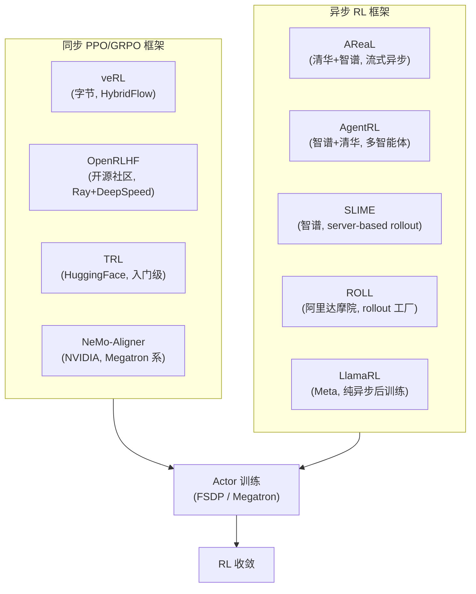

# 第 17 章 · LLM RL 工业实战

[第 16 章 RLHF](../chapter15_rlhf/intro) 给出了对齐训练的完整闭环：Reward Model 训练、PPO 主循环、KL 约束、评测方法。那里的实验跑在 7B 模型、单机 8 卡上。但当训练对象换成 671B 的 MoE、上下文拉到 128K、rollout 跑在千卡集群上时，每一处工程细节都会决定训练能否收敛。本章把视角从"算法层面"提升到"工业系统层面"——讲清训练框架选型、奖励信号设计、训练成本核算和工业面试里反复出现的核心推导。

为了保持章节连贯，本章把同一主题的不同侧面分散到四个文件，本文件覆盖 17.1、17.3、17.5、17.7 四节。其余三节按下表跳转：

| 小节                                                                | 主题                       | 文件                                                       |
| ------------------------------------------------------------------- | -------------------------- | ---------------------------------------------------------- |
| [17.2 现代后训练流水线范式](../chapter17_dpo/industrial-post-training) | 国内外大厂后训练全景       | `chapter17_dpo/industrial-post-training.md`          |
| [17.4 优化器与训练稳定性](../chapter17_dpo/modern-industrial-practice)   | GLM-4.6、Llama 4、MuonClip | `chapter17_dpo/modern-industrial-practice.md`        |
| [17.6 动手 veRL 代码生成 RL](../chapter18_grpo/verl-code-sandbox)         | 代码题 verifier + PPO 实战 | `chapter18_grpo/verl-code-sandbox.md`                 |

## 17.1 训练框架对比

LLM RL 训练框架要同时编排多个模型（Actor、Critic、Reference、Reward Model、Rollout Engine），还要处理 on-policy 数据流、分布式训练、推理引擎权重同步等工程问题。这些需求超出了 HuggingFace `Trainer` 或 `Accelerate` 的设计边界，因此 2024 年起出现了专门面向 LLM RL 的训练框架。本节对比七个有代表性的开源框架，给出选型决策依据。

### 框架全景



### veRL、OpenRLHF、TRL、NeMo-Aligner

#### veRL

[veRL](https://github.com/volcengine/verl)（Volcano Engine Reinforcement Learning，字节跳动，2024）是事实上的主流 LLM RL 训练框架，配套论文 [HybridFlow, arXiv:2409.19256](https://arxiv.org/abs/2409.19256)。它的核心抽象是 **single-controller + multi-model orchestration**：一个 Driver 进程编排 Actor、Critic、Reference、Reward Model、Rollout Engine 五个 Worker，每个 Worker 跑在一组 GPU 上（ResourcePool）。

veRL 的工程亮点是把训练栈和推理栈解耦：Actor 用 FSDP/Megatron 训练，Rollout 用 vLLM 推理，二者通过权重同步接口 `sync_weights` 衔接。这种解耦让 vLLM 的 PagedAttention、Continuous Batching、Tensor Parallelism 等推理优化能直接接入 RL 训练，rollout 吞吐比朴素 HuggingFace 生成高 5-10 倍。

veRL 是 Qwen3、DeepSeek-R1、Llama 4、Mistral 等开源训练脚本的事实选择。详细架构参考 [第 36 章 36.1 veRL 架构深度解析](../chapter36_distributed_rl_training/intro)。

#### OpenRLHF

[OpenRLHF](https://github.com/OpenRLHF/OpenRLHF)（开源社区，2024）走的是 Ray + DeepSpeed 路线。它把 Actor、Critic、Reward Model、Reference 都包装成 Ray Actor，用 Ray 的分布式调度做跨节点通信。训练后端是 DeepSpeed ZeRO，支持 ZeRO-1/2/3 三种零冗余优化器。

OpenRLHF 的优势是**社区友好**——配置文件接近 HuggingFace 风格，算法覆盖最全（PPO、GRPO、DPO、KTO、SimPO、Rejection Sampling、Iterative DPO），文档详尽，适合学术复现。劣势是大规模训练的吞吐不如 veRL——OpenRLHF 的 rollout 没有原生 vLLM 集成（需要外挂），权重同步开销大。

#### TRL

[TRL](https://github.com/huggingface/trl)（Transformer Reinforcement Learning，HuggingFace 官方）是入门级框架。它直接基于 `transformers.Trainer`，支持 PPO、DPO、GRPO 等算法。TRL 的定位是"让任何 HuggingFace 用户 5 分钟内跑通 RLHF"，因此**牺牲了大规模训练能力**——没有 vLLM 集成、没有 ResourcePool 调度、没有多节点编排。TRL 适合 7B 以下的单机实验和教学场景。

#### NeMo-Aligner

[NeMo-Aligner](https://github.com/NVIDIA/NeMo-Aligner)（NVIDIA）是 NeMo 训练栈的 RL 扩展，底层是 Megatron-LM。它的特点是和 NVIDIA 硬件栈深度绑定：支持 TensorRT-LLM 推理加速、TransformerEngine 的 FP8 训练、NVLink 全互联优化。NeMo-Aligner 在 H100/H200 集群上有最佳单卡吞吐，但配置复杂度高、社区生态比 veRL/OpenRLHF 小。

### AReaL、AgentRL、SLIME、ROLL、LlamaRL

同步框架（veRL/OpenRLHF/NeMo）在 RLHF/GRPO 任务上工作良好，因为单次 rollout 短（数学题平均 500-2000 token）。但 Agentic RL 任务（SWE、Browser、DeepResearch）的 rollout 耗时差异巨大——快的几秒，慢的要跑测试、调工具、等待环境响应，可能几分钟。同步训练会让整个 GPU 集群等待最慢的 episode，利用率掉到 30% 以下。

异步框架解决的就是这个问题：把 rollout generation 和 training 解耦，让不同速度的经验持续进入训练队列。

#### AReaL

[AReaL](https://github.com/inclusionAI/AReaL)（Ant Group + 清华，2025）是清华 + 智谱联合的异步 RL 框架，论文 [arXiv:2510.23748](https://arxiv.org/abs/2510.23748)。它的核心创新是 **fully asynchronous rollout**：rollout worker 7×24 持续生成经验，训练 worker 异步消费。AReaL 用 staleness-aware importance sampling 处理"训练时策略已经更新了 K 步"的偏移问题：

$$\rho_t^{\text{stale}} = \frac{\pi_\theta(a_t \mid s_t)}{\pi_{\theta_{\text{gen}}}(a_t \mid s_t)}$$

其中 $\pi_{\theta_{\text{gen}}}$ 是生成时的旧策略。当训练落后太多时，AReaL 会丢弃过于陈旧的经验。AReaL 在 SWE-bench 多轮 agent 训练上把 GPU 利用率从同步方案的 35% 提升到 85%。

#### AgentRL

[AgentRL](https://github.com/zhipuai-llm/AgentRL)（智谱 + 清华）是面向多智能体场景的异步框架。它和 AReaL 共享底层异步原语，但额外支持：multi-agent rollout（多个模型实例并行探索不同 scaffold）、tool execution sandbox（独立容器跑代码、SQL、浏览器）、environment branching（同一任务可以分支探索不同工具调用顺序）。AgentRL 是 GLM-5 agentic RL 阶段的主力框架。

#### SLIME

[SLIME](https://github.com/THUNLP/slime)（清华 THUNLP）是 server-based rollout 框架。它把 rollout 抽象为 HTTP 服务：训练器把 prompt 发给 rollout server，server 返回 trajectories。这种设计让 custom rollout logic（多轮工具调用、环境交互、verifier-guided branching）可以独立于训练栈开发。SLIME 的接口被 GLM-5、AReaL 等框架复用。

#### ROLL

[ROLL](https://github.com/alibaba/ROLL)（阿里达摩院）是 rollout factory，专注于把各种环境（SWE-bench、BrowserGym、OSWorld）封装成统一的 rollout 接口。它的特色是 **environment recipe system**——把"任务定义 + 工具集 + 数据库 schema + verifier"打包成可复用的 recipe，让 agent 训练数据可以批量化生产。

#### LlamaRL

[LlamaRL](https://github.com/meta-llama/llama-rl)（Meta, 2025）是 Llama 4 后训练使用的纯异步框架。它的设计哲学是 **完全 disaggregated**：rollout generation、policy training、reward evaluation 三个阶段用独立的 GPU 集群，通过分布式参数服务器（parameter server）做异步权重同步。LlamaRL 的设计假设是万亿参数 MoE 模型——在这个规模下，单集群无法承载所有模型，必须物理分离。

### 框架对比表

下表把七个框架的关键维度对齐：

| 框架          | 出处        | 训练后端      | 推理引擎   | 异步支持 | 典型规模   | 算法覆盖                | GitHub Stars (2026Q2) | 社区活跃度 |
| ------------- | ----------- | ------------- | ---------- | -------- | ---------- | ----------------------- | --------------------- | ---------- |
| **veRL**      | 字节跳动    | FSDP/Megatron | vLLM       | 部分     | 千卡       | PPO/GRPO/DPO/SPIN/RS    | 9.8k                  | 极高       |
| **OpenRLHF**  | 开源社区    | DeepSpeed ZeRO| vLLM/SGLang| 否       | 百卡       | PPO/GRPO/DPO/KTO/SimPO  | 5.2k                  | 高         |
| **TRL**       | HuggingFace | Accelerate    | 无原生     | 否       | 单机/小集群 | PPO/GRPO/DPO            | 11k                   | 高         |
| **NeMo**      | NVIDIA      | Megatron-LM   | TRT-LLM    | 否       | 千卡       | PPO/DPO/SteerLM         | 1.8k                  | 中         |
| **AReaL**     | 清华+智谱   | FSDP          | vLLM/SGLang| 全异步   | 百-千卡    | PPO/GRPO + 异步         | 1.1k                  | 中         |
| **AgentRL**   | 智谱+清华   | FSDP          | vLLM       | 全异步   | 千卡       | PPO/GRPO + multi-agent  | 0.8k                  | 中         |
| **LlamaRL**   | Meta        | Megatron      | 自研       | 全异步   | 万卡       | 内部 PPO 变体           | 0.5k                  | 低（内部） |

### 选型决策树

```text
你的训练规模？
├── 单机/单卡（7B 以下）
│   └── TRL（最简单，文档好）
├── 小集群（8-32 卡，7B-30B）
│   └── OpenRLHF（社区好，算法全）
├── 中等集群（32-256 卡，30B-100B）
│   ├── 同步任务（数学、代码 RLVR）→ veRL
│   └── 异步任务（Agent、长 rollout）→ AReaL
└── 大集群（256+ 卡，100B+）
    ├── MoE + 长上下文 → veRL + Megatron
    ├── 万亿参数 + 物理分离 → LlamaRL 风格
    └── 多智能体 + 工具环境 → AgentRL / SLIME
```

实战中一个反复出现的模式是：**先用 TRL/OpenRLHF 做算法验证，再用 veRL 做规模放大**。算法正确性验证不需要大规模集群，TRL 单卡 30 分钟能跑通 GRPO。验证通过后再切到 veRL 做大规模训练，避免在工程问题上浪费算法迭代时间。

## 17.3 双轨奖励设计

[17.2 节](../chapter17_dpo/industrial-post-training) 已经提到，现代后训练把奖励分成两类——**Verifiable Reward**（可验证奖励）和 **Pairwise Preference Reward**（成对偏好奖励）。本节深入讨论二者的数学结构、适用边界和工业级的混合策略。

### 两条奖励路线的本质差异

**Verifiable Reward（VR）** 来自一个**确定性的验证函数**：给定 prompt $q$ 和 response $o$，验证器输出二值（或连续）分数：

$$r_{\text{VR}}(q, o) = \mathbb{1}[\text{extract}(o) == \text{answer}(q)]$$

数学题用答案对比，代码题用测试用例，逻辑题用规则验证器。VR 的核心特征是**无噪声、无主观性**——答案对就是对，错就是错。

**Pairwise Preference Reward（PPR）** 来自一个学到的 Reward Model $R_\phi$，它从人类偏好数据 $(o_w, o_l)$（chosen 和 rejected）中训练：

$$\mathcal{L}_{\text{RM}} = -\mathbb{E}\left[\log \sigma\left(R_\phi(q, o_w) - R_\phi(q, o_l)\right)\right]$$

训练好后，$R_\phi(q, o)$ 给出标量分数作为 RL 的奖励。PPR 的特征是**有噪声、有主观偏差**——它学的是"人类平均喜欢什么"，容易 reward hacking，也容易在 minority 偏好上犯错。

| 维度       | Verifiable Reward      | Pairwise Preference Reward  |
| ---------- | ---------------------- | --------------------------- |
| 奖励来源   | 规则验证器 / 执行环境  | 学到的 Reward Model         |
| 噪声水平   | 零（确定性）           | 高（依赖 RM 质量）          |
| 标注成本   | 接近零（自动验证）     | 高（需 pairwise 比较）      |
| 适用任务   | 数学、代码、逻辑、工具 | 开放对话、写作、安全、风格  |
| Hacking 风险 | 低（验证器权威）       | 高（RM 可被钻空子）         |
| 训练稳定性 | 高                     | 中（需要 KL 约束）          |

### Pre-PPO 的 Prompt 选择策略

VR 训练的成功率高度依赖 prompt 质量。一个关键观察来自字节 Seed-Thinking 论文 [arXiv:2504.13914](https://arxiv.org/abs/2504.13914)：**并非所有可验证 prompt 都有训练价值**。如果一道题对当前策略来说太简单（全部 rollout 都对）或太难（全部都错），组内 reward 方差为零，advantage 也为零，这批数据**对梯度没有贡献**。

Seed-Thinking 给出 prompt 选择的三条标准：

1. **可学性（Learnability）**：当前策略的通过率 $\in [0.1, 0.9]$。全对或全错的题过滤掉。
2. **多样性（Diversity）**：题目覆盖不同推理模式（代数、几何、组合、数论），避免策略坍缩到单一解题模板。
3. **难度分级（Difficulty Stratification）**：按 base model 的 pass rate 分桶（easy/medium/hard），curriculum learning 时按桶调度。

具体实现是 rejection sampling：先用 base model 对每道题采样 $N=16$ 个 rollout，统计通过率 $p_i$。然后按以下规则筛选：

```python
def filter_prompts(prompts, base_model, num_rollouts=16):
    learnable = []
    for prompt in prompts:
        rollouts = [base_model.generate(prompt) for _ in range(num_rollouts)]
        rewards = [verifier(prompt, r) for r in rollouts]
        pass_rate = sum(rewards) / num_rollouts
        # 只保留通过率在 [0.1, 0.9] 的 prompt
        if 0.1 <= pass_rate <= 0.9:
            learnable.append((prompt, pass_rate))
    # 按通过率分桶（curriculum）
    easy = [p for p, r in learnable if r >= 0.5]
    hard = [p for p, r in learnable if r < 0.5]
    return {"easy": easy, "hard": hard}
```

这条策略让 RL 信号集中到"边界题"上——模型刚好能解一部分、错一部分的题。DAPO 的 **Dynamic Sampling** 也是同一思想：训练中持续监控每个 prompt 的组内 reward 方差，方差过低的 prompt 被丢弃或加采样。

### Hybrid Reward 与 VR + GenRM 联合训练

真实产品模型不会只用 VR 或只用 PPR。**Hybrid Reward** 把两者按任务类型混合：

$$R_{\text{total}}(q, o) = \alpha \cdot R_{\text{VR}}(q, o) + (1 - \alpha) \cdot R_{\text{GenRM}}(q, o)$$

其中 $\alpha$ 是任务相关权重——数学/代码题 $\alpha = 1.0$（纯 VR），开放对话 $\alpha = 0.0$（纯 GenRM），中间任务按比例混合。

#### GenRM vs 判别式 RM

**判别式 RM**（Discriminative RM）是传统做法：训练一个分类头预测"哪个回答更好"，输出标量分数 $R_\phi(q, o) \in \mathbb{R}$。

**Generative RM（GenRM）** 是 2024 年的新趋势：把 RM 重新表述为生成任务。给定 prompt $q$ 和两个 response $o_1, o_2$，让 LLM 生成一个 token "A" 或 "B" 表示哪个更好：

$$P_{\text{GenRM}}(o_1 \succ o_2 \mid q) = \frac{\pi_\theta(\text{"A"} \mid q, o_1, o_2)}{\pi_\theta(\text{"A"} \mid q, o_1, o_2) + \pi_\theta(\text{"B"} \mid q, o_1, o_2)}$$

GenRM 的优势：

- **复用预训练能力**：不需要从头训分类头，直接用强 LLM 的 in-context 推理能力。
- **支持 chain-of-thought 判断**：让 RM 先生成推理再给判断，准确率比直接打分高 10-20%。
- **可解释**：判断过程是文本，可审计、可调试。

劣势是推理成本高（每次判断要生成几百 token），因此 GenRM 通常**离线**生成偏好数据，再训练一个轻量级判别 RM 用于在线 RL。这个流程在 Qwen3、Llama 4、ERNIE 4.5 中都有出现。

#### Rule + Test + Verifier 的三层结构

对于代码任务，纯单元测试 reward 不够鲁棒——模型可能写出"只通过测试用例但不通用"的硬编码答案。**RTV（Rule-Test-Verifier）** 是一种三层奖励：

```python
def rtv_reward(prompt, code, test_cases):
    # Layer 1: Rule reward - 检查代码格式、长度、是否包含 forbidden pattern
    rule_score = check_format(code) + check_no_hardcode(code)
    
    # Layer 2: Test reward - 运行公开测试用例
    test_score = run_tests(code, test_cases["public"])
    
    # Layer 3: Verifier reward - 运行隐藏测试 + LLM judge 评分
    hidden_score = run_tests(code, test_cases["hidden"])
    judge_score = llm_judge(prompt, code, rubric="correctness, style, efficiency")
    
    return 0.1 * rule_score + 0.5 * test_score + 0.3 * hidden_score + 0.1 * judge_score
```

RTV 的设计动机是**反 reward hacking**——单层奖励容易被钻空子（硬编码测试、长度作弊、格式空转），多层冗余让 hacking 难度指数级上升。MiniMax M2.1、Cursor Composer 2、GPT-5-Codex 都采用了类似的多层 reward 结构。

### 奖励尺度的归一化

混合多种 reward 时最大的工程问题是**尺度不一致**。数学题 reward 是 $\{0, 1\}$，代码题通过率是 $[0, 1]$，GenRM 分数可能是 $[-3, 3]$，length penalty 是 $[-0.5, 0.5]$。直接相加会让大尺度 reward 主导梯度。

ERNIE 4.5 的 **Unified Rewarding System** 给出标准做法——按任务域做 z-score 归一化：

$$\tilde{r}_{\text{domain}} = \frac{r - \mu_{\text{domain}}}{\sigma_{\text{domain}}}$$

其中 $\mu_{\text{domain}}, \sigma_{\text{domain}}$ 是当前 batch 内同域 reward 的均值和标准差。归一化后所有 reward 都在 $[-3, 3]$ 量级，可以安全相加。

另一种做法是 **GRPO 的组内归一化**——同一 prompt 的 $G$ 个 rollout 内部做 z-score。这天然消除了跨 prompt 的尺度差异，是 GRPO 相比 PPO 的一个隐含优势。

## 17.5 训练成本估算

工业 LLM 训练的成本核算是融资、招聘、算力采购的决策依据。本节给出从预训练到 RL 的完整成本模型，并用 DeepSeek、Qwen、Llama 公开数据校准估算公式。

### 成本模型的基本公式

LLM 训练的 GPU 小时数大致服从：

$$\text{GPU-hours} \approx \frac{6 \cdot N_{\text{params}} \cdot N_{\text{tokens}}}{\text{GPU\_FLOPS} \cdot \text{MFU}}$$

其中：

- $N_{\text{params}}$ 是模型参数量
- $N_{\text{tokens}}$ 是训练 token 数
- 系数 6 来自前向 + 反向的 FLOPs 估算（2 倍前向 + 4 倍反向，每 token 每参数约 6 FLOPs）
- $\text{GPU\_FLOPS}$ 是单卡理论峰值（H100 BF16 约 989 TFLOPS）
- $\text{MFU}$（Model FLOPs Utilization）是实际利用率，典型值 30%-50%

例如 DeepSeek-V3（671B 参数，14.8T tokens，H800 集群）的估算：

$$\text{GPU-hours} = \frac{6 \cdot 671 \times 10^9 \cdot 14.8 \times 10^{12}}{989 \times 10^{12} \cdot 0.45} \approx 2.664 \times 10^6 \text{ H800-hours}$$

这与 [DeepSeek-V3 技术报告](https://arxiv.org/abs/2412.19437) 公开的 **2.664M H800 小时**完全吻合，说明上述公式在千亿参数规模下是可靠的。

### 各训练阶段的成本占比

下表汇总了几个公开模型的训练成本（来自技术报告或可信估算）：

| 模型                | 参数量     | 预训练 tokens | 预训练 GPU-hours | 后训练 GPU-hours | 总成本（H100 等价，$2/小时） |
| ------------------- | ---------- | ------------- | ---------------- | ---------------- | ----------------------------- |
| Llama 3 8B          | 8B         | 15T           | 1.3M             | 0.13M（10%）     | $2.86M                        |
| Llama 3 70B         | 70B        | 15T           | 6.4M             | 0.64M（10%）     | $14.1M                        |
| Llama 3 405B        | 405B       | 15T           | 30.8M            | 3.1M（10%）      | $67.8M                        |
| Qwen2.5 72B         | 72B        | 18T           | 7.7M             | 1.5M（~20%）     | $18.4M                        |
| DeepSeek-V3         | 671B (MoE) | 14.8T         | 2.664M (H800)    | ~0.3M            | ~$5.9M                        |
| DeepSeek-R1-Zero    | 671B (MoE) | -             | -                | ~128K GPU-hours  | ~$0.26M                       |
| GPT-4（推测）       | ~1.8T      | ~13T          | ~80M             | ~10M             | ~$180M                        |

几个值得关注的观察：

1. **预训练占绝对大头**：典型模型预训练占总成本 80%-90%。RL 只是"调味"——但这一勺调味决定模型能否成为产品。
2. **MoE 显著降本**：DeepSeek-V3 用 671B MoE（37B 激活），实际计算量相当于 100B 量级 dense 模型，成本只有 Llama 3 405B 的 1/10。
3. **R1-Zero 极致省钱**：DeepSeek 报告 R1-Zero 的 RL 阶段只用了约 128K GPU 小时（约 13 天 × 512 卡），相对预训练成本可忽略。这是为什么开源社区能快速复现 R1-Zero。

### RL 阶段的成本拆解

RL 训练成本比 SFT 复杂，因为它包含多个模型的计算开销。以 veRL 跑 GRPO 为例，单步成本可拆解为：

$$C_{\text{RL-step}} = C_{\text{rollout}} + C_{\text{actor-update}} + C_{\text{ref-forward}} + C_{\text{reward}}$$

典型配比（7B 模型，每步 batch=512 prompts × 8 rollouts）：

| 组件              | 计算量占比 | 说明                                       |
| ----------------- | ---------- | ------------------------------------------ |
| Rollout generation | 50%-60%    | 4096 个 2K-token rollout，vLLM 推理        |
| Actor update      | 20%-25%    | FSDP 反向传播                              |
| Reference forward | 10%-15%    | 计算 KL 散度（no_grad）                    |
| Reward computation| 5%-10%     | VR 是 CPU 计算；GenRM 需要额外推理         |

**Rollout generation 是瓶颈**——这也是为什么 veRL/AReaL 都把 vLLM 集成和异步 rollout 当作核心工程。

### 成本估算的工程经验

下面给出几个实用的经验公式：

**1. SFT 成本估算**

$$C_{\text{SFT}} \approx \frac{2 \cdot N_{\text{params}} \cdot N_{\text{tokens}}}{\text{GPU\_FLOPS} \cdot \text{MFU}_{\text{SFT}}}$$

系数 2（只有前向 + 反向，无 RL 的多轮采样），$\text{MFU}_{\text{SFT}}$ 典型 40%-50%。

**2. RLHF 成本估算（PPO）**

RLHF 每步需要：rollout $G$ 个回答 + 训练 Actor/Critic/RM。粗略估计 RLHF 总成本是同等 token 数 SFT 的 **5-10 倍**：

$$C_{\text{RLHF}} \approx (5 \sim 10) \cdot C_{\text{SFT}}^{\text{equiv}}$$

这是因为 PPO 要做 4 个模型的 forward/backward，且每个 prompt 要采样多个 rollout。

**3. RLVR 成本估算（GRPO）**

GRPO 省掉了 Critic 和 Reward Model 训练，成本约为 PPO 的 60%：

$$C_{\text{RLVR}} \approx 0.6 \cdot C_{\text{RLHF}}$$

这也是为什么 R1-Zero 能用极少算力训出强推理模型——critic-free 设计把 RL 成本压到最低。

**4. 推理成本估算（部署阶段）**

部署后的推理成本常常被忽略，但对长期 TCO 影响巨大：

$$C_{\text{inference}} = \text{requests} \cdot \text{avg\_tokens} \cdot \frac{2 \cdot N_{\text{active}}}{\text{GPU\_FLOPS} \cdot \text{MFU}_{\text{infer}}}$$

注意这里用 $N_{\text{active}}$（激活参数）而非总参数——MoE 模型推理时只激活部分 expert，成本比 dense 模型低得多。这是 MoE 在产品部署上的核心优势。

### 实战成本控制策略

1. **数据筛选优先于算力堆叠**：用高质量 10K 样本胜过低质量 100K 样本，但筛选本身需要算力（rejection sampling）。
2. **小模型先验证**：7B 模型验证算法和超参，再放大到 70B/400B，避免大模型上的失败重训。
3. **混合精度训练**：BF16 训练比 FP32 快 2 倍；FP8（H100 支持）再快 1.5-2 倍。但低精度训练对稳定性要求更高，需要 QK-clip 等技巧。
4. **Checkpoint 复用**：pretraining → SFT → RL 各阶段保留 checkpoint，避免从零重训。DeepSeek 的多阶段训练流水线就是基于 checkpoint 复用设计的。

## 17.7 中国对齐团队面试常见考点

本节梳理 2025-2026 年智谱、字节 Seed、Moonshot、阿里通义、DeepSeek、腾讯混元等中国对齐团队面试中反复出现的核心考点。这些考点不是"考题集锦"，而是反映工业团队真正关心的能力维度——**算法推导能力、工程系统理解、训练资源推算**。

### PG → REINFORCE → TRPO → PPO → GRPO 完整推导链

这是智谱、字节 Seed 反复考查的核心推导。面试官会从策略梯度定理开始，要求候选人完整推导到 GRPO，并解释每一步的工程动机。

#### 第 1 步 与 策略梯度定理（Policy Gradient Theorem）

从期望回报出发：

$$J(\theta) = \mathbb{E}_{\tau \sim \pi_\theta}\left[\sum_t \gamma^t r_t\right]$$

对 $\theta$ 求梯度，利用 log-derivative trick：

$$\nabla_\theta J(\theta) = \mathbb{E}_{\tau \sim \pi_\theta}\left[\nabla_\theta \log \pi_\theta(\tau) \cdot R(\tau)\right] = \mathbb{E}\left[\sum_t \nabla_\theta \log \pi_\theta(a_t \mid s_t) \cdot G_t\right]$$

其中 $G_t = \sum_{t' \geq t} \gamma^{t'-t} r_{t'}$ 是 return。详细推导见 [第 5 章 REINFORCE](../chapter08_policy_gradient/reinforce)。

#### 第 2 步 与 REINFORCE 的方差问题

直接用 $G_t$ 作为权重方差极大——单次 rollout 的 return 波动剧烈。**引入 baseline** 降低方差：

$$\nabla_\theta J(\theta) = \mathbb{E}\left[\nabla_\theta \log \pi_\theta(a_t \mid s_t) \cdot (G_t - b(s_t))\right]$$

理论分析表明最优 baseline 是 $b(s_t) = V^\pi(s_t)$（状态价值函数），此时 $(G_t - V^\pi(s_t))$ 就是**优势函数** $A_t$。这就是 Actor-Critic 的雏形——需要一个 Critic 网络估计 $V^\pi$。

#### 第 3 步 与 TRPO 的信任区域

REINFORCE 和 vanilla PG 有个工程问题：步长太大策略就崩溃。TRPO（Schulman et al. 2015）用 KL 散度约束更新幅度：

$$\max_\theta \; \mathbb{E}\left[\frac{\pi_\theta(a_t \mid s_t)}{\pi_{\theta_{\text{old}}}(a_t \mid s_t)} A_t\right] \quad \text{s.t.} \quad \bar{D}_{\text{KL}}(\pi_{\theta_{\text{old}}} \| \pi_\theta) \leq \delta$$

TRPO 用共轭梯度法 + line search 求解这个约束优化，工程复杂。详细推导见 [第 7 章 PPO](../chapter10_ppo/intro)。

#### 第 4 步 与 PPO 的 clip 近似

PPO（Schulman et al. 2017）发现 TRPO 的约束优化可以用简单 clip 近似：

$$\mathcal{L}_{\text{PPO}} = \mathbb{E}\left[\min\left(\rho_t A_t, \; \text{clip}(\rho_t, 1-\epsilon, 1+\epsilon) A_t\right)\right]$$

其中 $\rho_t = \pi_\theta(a_t \mid s_t) / \pi_{\theta_{\text{old}}}(a_t \mid s_t)$ 是重要性采样比。clip 防止 $\rho_t$ 偏离 1 太远，等价于软约束的 TRPO。

#### 第 5 步 与 GRPO 省掉 Critic

PPO 要训练 Critic 估计 $A_t$，但在 LLM 场景下 Critic 是和 Actor 同等大小的网络，显存翻倍。GRPO（DeepSeek, 2024）的关键洞察：**同一 prompt 采样一组 rollout，用组内均值替代 Critic**：

$$A_i = \frac{r_i - \text{mean}(r_1, \ldots, r_G)}{\text{std}(r_1, \ldots, r_G)}$$

其中 $r_i$ 是第 $i$ 个 rollout 的 reward，$G$ 是组大小。这样省掉了 Critic 网络，advantage 直接从组内 reward 统计得到。详细推导见 [9.4 节 GRPO 核心机制](../chapter18_grpo/grpo-practice-and-mechanism)。

#### 面试加分项

完整推导后，面试官常追问"每一步解决了什么问题"：

| 演进         | 解决的问题               | 代价                       |
| ------------ | ------------------------ | -------------------------- |
| PG → REINFORCE | 形式化策略梯度           | 方差大                     |
| REINFORCE → AC | 引入 baseline 降方差     | 需要 Critic 网络           |
| AC → TRPO    | 限制策略更新幅度         | 约束优化复杂               |
| TRPO → PPO   | 简化约束为 clip          | 超参 $\epsilon$ 敏感       |
| PPO → GRPO   | 省掉 Critic              | 组大小敏感、丢失 token 级信号 |

能讲清楚"为什么 GRPO 在数学上等价于用一个数据驱动的 baseline"，是从能背公式到真正理解的分水岭。

### DPO 家族与正则化

DPO 家族是另一个高频考点。常见问题：DPO 的推导、IPO/SimPO/KTO 的差异、DPO 训练时的正则化。

#### DPO 的核心推导

从 RLHF 的 KL 约束优化目标出发：

$$\max_\pi \; \mathbb{E}_{(q, o) \sim \pi}[r(q, o)] - \beta \cdot \text{KL}(\pi \| \pi_{\text{ref}})$$

DPO 的关键观察：这个优化问题有**闭式解**。对每个 $q$，最优策略满足：

$$\pi^*(o \mid q) = \frac{1}{Z(q)} \pi_{\text{ref}}(o \mid q) \exp\left(\frac{r(q, o)}{\beta}\right)$$

反解出 $r$：

$$r(q, o) = \beta \log \frac{\pi^*(o \mid q)}{\pi_{\text{ref}}(o \mid q)} + \beta \log Z(q)$$

代入 Bradley-Terry 偏好模型 $P(o_w \succ o_l) = \sigma(r(o_w) - r(o_l))$，$Z(q)$ 项相消：

$$P(o_w \succ o_l \mid q) = \sigma\left(\beta \log \frac{\pi^*(o_w \mid q)}{\pi_{\text{ref}}(o_w \mid q)} - \beta \log \frac{\pi^*(o_l \mid q)}{\pi_{\text{ref}}(o_l \mid q)}\right)$$

对 $\theta$ 极大似然就得到 **DPO loss**：

$$\mathcal{L}_{\text{DPO}} = -\mathbb{E}\left[\log \sigma\left(\beta \log \frac{\pi_\theta(o_w \mid q)}{\pi_{\text{ref}}(o_w \mid q)} - \beta \log \frac{\pi_\theta(o_l \mid q)}{\pi_{\text{ref}}(o_l \mid q)}\right)\right]$$

详细推导见 [第 18 章 DPO 入门](../chapter17_dpo/dpo-theory-and-family)。

#### DPO 家族对比

| 方法    | 核心改动                       | 解决的问题                 |
| ------- | ------------------------------ | -------------------------- |
| **DPO** | BT 模型 + KL 约束闭式解        | 免去 RM 训练和 RL 循环     |
| **IPO** | 用 squared loss 替代 log-sigmoid | DPO 在偏好强时过拟合       |
| **KTO** | 用 Kahneman-Tversky 效用函数   | 不需要成对数据，只需好坏标签 |
| **SimPO**| 移除 reference model，用长度归一化 | 省掉 ref 模型，部署简单    |
| **ORPO**| SFT 和偏好优化合二为一         | 不需要单独 SFT 阶段        |

#### DPO 的正则化

DPO 训练中常见的失败模式：

1. **Reward Hacking**：模型让 $\pi_\theta(o_w)$ 远大于 $\pi_{\text{ref}}(o_w)$，但泛化差。
2. **Length Bias**：DPO 倾向让 chosen 比 rejected 长。
3. **Distribution Shift**：DPO 是离线算法，训练数据分布和当前策略脱节。

工业级的正则化包括：

- **KL 正则**：$\mathcal{L}_{\text{DPO+KL}} = \mathcal{L}_{\text{DPO}} + \lambda \cdot \text{KL}(\pi_\theta \| \pi_{\text{ref}})$
- **Length normalization**：在 log-ratio 中除以 $|o|$，消除长度偏差
- **Conservative DPO (cDPO)**：在标签上做 label smoothing，避免过度自信
- **Iterative DPO**：用当前策略生成新偏好数据，再训练，缓解分布偏移

### DeepSpeed vs Megatron 工程对比

这是字节、阿里、华为面试中常问的分布式训练工程问题。两个框架代表了 LLM 训练的两种哲学。

#### DeepSpeed 与 ZeRO 系列的显存优化

[DeepSpeed](https://github.com/microsoft/DeepSpeed)（Microsoft）的核心创新是 **ZeRO（Zero Redundancy Optimizer）**，把训练状态分片到多卡：

- **ZeRO-1**：分片 optimizer states（约 16 bytes/param，对应 Adam 的 m, v）
- **ZeRO-2**：分片 optimizer states + gradients
- **ZeRO-3**：分片 optimizer states + gradients + parameters（最激进）

ZeRO-3 让单卡显存从 $O(N)$ 降到 $O(N / \text{GPUs})$，代价是通信开销增大。DeepSpeed 还集成了 MoE、Pipeline Parallelism、Long Sequence Attention 等。

#### Megatron-LM 与 3D 并行

[Megatron-LM](https://github.com/NVIDIA/Megatron-LM)（NVIDIA）走的是 **3D Parallelism** 路线：

- **Data Parallelism (DP)**：不同 GPU 处理不同 batch
- **Tensor Parallelism (TP)**：单层权重矩阵按列切分到多卡（如 Q/K/V 矩阵按 head 分）
- **Pipeline Parallelism (PP)**：把模型按层切成多段，每段放一组 GPU，做流水线

3D 并行的优势是显存效率高、通信模式清晰，特别适合超大模型。Megatron 的 TP 实现对 NVLink/RoCE 互联带宽要求高。

#### 工程对比

| 维度        | DeepSpeed ZeRO             | Megatron 3D Parallel          |
| ----------- | -------------------------- | ----------------------------- |
| 核心思想    | 状态分片（数据并行扩展）   | 维度正交（DP + TP + PP）      |
| 通信模式    | All-gather / Reduce-scatter | All-reduce / All-to-all / P2P |
| 互联要求    | 中（InfiniBand 即可）      | 高（NVLink 全互联最佳）       |
| 显存效率    | ZeRO-3 最高                | 中（TP 切权重）               |
| 易用性      | 配置简单                   | 配置复杂（需手调 TP/PP 维度） |
| 典型用户    | 开源社区、HuggingFace      | NVIDIA、Llama、Qwen           |
| MoE 支持    | 有（DeepSpeed-MoE）        | 有（Megatron-Core MoE）       |
| 长上下文    | 有（DeepSpeed-Ulysses）    | 有（Megatron-Context）        |

#### 选型经验

工业团队的典型选择：

- **小模型（<10B）**：DeepSpeed ZeRO-2，简单够用
- **中等模型（10B-100B）**：DeepSpeed ZeRO-3 + Megatron TP（混合并行）
- **超大模型（100B+）**：Megatron 3D 并行 + Megatron-Core MoE
- **国产芯片（昇腾、寒武纪）**：DeepSpeed 兼容性更好，Megatron 依赖 NVIDIA 栈

veRL 同时支持 FSDP（DeepSpeed 风格）和 Megatron 后端，用户可以按规模选择。

### 训练资源现场推算

这是面试中最实战的考查——给一个具体训练任务，现场估算需要多少 GPU、多少天、多少钱。

#### 典型题目

> "用 Qwen2.5-7B 做 GRPO，10 万道数学题，每题采样 8 个 rollout，每个 rollout 平均 1024 token，训练 3 个 epoch。需要多少 GPU？训多久？"

**推算步骤**：

**Step 1：估算总 token 数**

$$N_{\text{tokens}} = 10^5 \times 8 \times 1024 \times 3 = 2.46 \times 10^9 \text{ tokens}$$

注意这是 rollout 的 token 数，加上 actor update 的反向传播 token 数（相同量级），总计算量翻倍。

**Step 2：估算总 FLOPs**

GRPO 每步需要：rollout generation（推理）+ actor update（训练）+ ref forward（KL）。粗略估计总 FLOPs：

$$\text{FLOPs} = 6 \cdot N_{\text{params}} \cdot N_{\text{tokens}} \cdot k$$

其中 $k$ 是 RL 系数（GRPO 约 3-4，包含 rollout + update + ref）。7B 模型：

$$\text{FLOPs} = 6 \times 7 \times 10^9 \times 2.46 \times 10^9 \times 3.5 \approx 3.6 \times 10^{20}$$

**Step 3：估算 GPU 小时**

假设用 A100 80GB（BF16 312 TFLOPS，MFU 35%）：

$$\text{GPU-hours} = \frac{3.6 \times 10^{20}}{312 \times 10^{12} \times 0.35} \approx 3300 \text{ GPU-hours}$$

**Step 4：换算到实际资源**

8 卡 A100 节点能跑约 250 GPU-hours/天（24h × 8 × 0.7 利用率 + 故障时间）：

$$\text{天数} = \frac{3300}{250} \approx 13 \text{ 天}$$

如果用 4 节点（32 卡），约 3-4 天。

**Step 5：成本估算**

按 A100 云端价格 $2/小时：

$$\text{成本} = 3300 \times 2 = \$6,600$$

#### 面试加分点

能主动指出几个工程细节，加分：

1. **显存检查**：7B 模型 + GRPO，单卡需要约 60GB（Actor 14GB + Ref 14GB + Rollout 14GB + Activations + KV cache）。A100 80GB 单卡能放下；如果是 40GB A100，需要 2 卡 TP。
2. **MFU 校准**：小 batch 时 MFU 只有 20%；大 batch 才能达到 40%。给出 MFU 估计范围，不要拍脑袋。
3. **失败重训预算**：实际训练要预留 30% 的失败重训预算，所以最终采购要按 4300 GPU-hours 估。
4. **成本对比**：能用 H100 替代吗？H100 BF16 是 A100 的 3 倍 FLOPs，单价约 $3/小时。$3300 \times 3 / 3 = $3300，但 H100 数量少一半——如果集群紧张，H100 更划算。

### 开放问题与系统设计

高级面试会问开放问题，考查候选人对整个 RL 系统的理解。典型问题：

**"设计一个 RLHF 训练系统，支持 70B 模型，1000 万条偏好数据，要求训练时间 < 2 周。"**

回答框架：

1. **数据层**：偏好数据存储、采样、去重、质量过滤
2. **训练层**：RM 训练（70B RM）+ Actor PPO 训练
3. **推理层**：vLLM rollout engine，权重同步策略
4. **监控层**：reward 曲线、KL 散度、response length、reward hacking 检测
5. **资源分配**：RM 训练用多少卡，Actor 用多少卡，rollout 用多少卡
6. **失败恢复**：checkpoint 策略、断点续训、预热启动

回答这类问题的核心是**系统性思维**——不只是"用 PPO 算法"，而是从数据到部署的全链路设计。

## 本章总结

第 17 章把视角从算法层面提升到工业系统层面：

1. **训练框架对比**（17.1）：veRL、OpenRLHF、TRL、NeMo-Aligner 同步阵营 vs AReaL、AgentRL、SLIME、ROLL、LlamaRL 异步阵营。同步框架适合短 rollout 的 RLHF/GRPO；异步框架适合长 rollout 的 Agentic RL。
2. **现代后训练流水线**（[17.2](../chapter17_dpo/industrial-post-training)）：cold-start SFT → reasoning RL → agentic RL → general preference 回填，是 2025 年工业界的事实范式。
3. **双轨奖励设计**（17.3）：Verifiable Reward（数学、代码、规则）与 Pairwise Preference Reward（开放对话、安全、风格）按任务类型混合，配合 z-score 归一化避免尺度冲突。
4. **优化器与训练稳定性**（[17.4](../chapter17_dpo/modern-industrial-practice)）：MuonClip、QK-clip、低精度训练是万亿参数模型的关键稳定性工具。
5. **训练成本估算**（17.5）：预训练占 80%-90% 总成本，RL 阶段虽然算力占比小但决定模型能否上线。MoE 显著降本——DeepSeek-V3 用 671B MoE 只花了 2.664M H800 小时。
6. **动手 veRL 代码 RL**（[17.6](../chapter18_grpo/verl-code-sandbox)）：三层 verifier（格式 + 编译 + 测试）是代码 RLVR 的标准做法。
7. **中国对齐团队面试考点**（17.7）：PG → GRPO 推导链、DPO 家族、DeepSpeed vs Megatron、训练资源推算是高频考点，反映工业团队真正关心的能力维度。

这一章的真正价值不在于记住每个框架的细节——而在于建立**系统性判断力**：看到一个新模型或新论文，能立刻判断它用了什么训练栈、什么奖励设计、成本量级、训练稳定性挑战。这种判断力是从"读论文"到"能动手做工业级 RL"的关键一步。

下一章 [第 18 章 DPO 家族](../chapter17_dpo/dpo-theory-and-family) 深入推导 DPO 及其变体；[第 36 章 分布式 RL 训练系统](../chapter36_distributed_rl_training/intro) 从系统架构层面解析 veRL/AReaL/LlamaRL 的工程设计。

## 延伸阅读

### 训练框架

- [HybridFlow: A Flexible and Efficient RLHF Framework (veRL, arXiv:2409.19256)](https://arxiv.org/abs/2409.19256)
- [OpenRLHF: An Easy-to-use, Scalable and High-performance RLHF Framework](https://arxiv.org/abs/2405.11143)
- [AReaL: Fully Asynchronous RL System (arXiv:2510.23748)](https://arxiv.org/abs/2510.23748)
- [LlamaRL: A Distributed Asynchronous Reinforcement Learning Framework for LLMs (arXiv:2507.21240)](https://arxiv.org/abs/2507.21240)
- [NeMo-Aligner: Scalable Toolkit for Efficient Model Alignment](https://arxiv.org/abs/2402.01969)

### 奖励设计与数据策略

- [Seed1.5-Thinking: Advancing Superb Reasoning Models with Reinforcement Learning (arXiv:2504.13914)](https://arxiv.org/abs/2504.13914)
- [Generative Reward Models](https://arxiv.org/abs/2410.12840)
- [Skywork-OR1: Mitigating Premature Entropy Collapse in RL (arXiv:2505.22312)](https://arxiv.org/abs/2505.22312)
- [DAPO: An Open-Source LLM RL System at Scale](https://arxiv.org/abs/2503.14476)

### 训练成本与基础设施

- [DeepSeek-V3 Technical Report (arXiv:2412.19437)](https://arxiv.org/abs/2412.19437)
- [DeepSeek-R1: Incentivizing Reasoning Capability via RL (arXiv:2501.12948)](https://arxiv.org/abs/2501.12948)
- [Llama 3 Herd of Models](https://arxiv.org/abs/2407.21783)
- [Qwen2.5 Technical Report (arXiv:2412.15115)](https://arxiv.org/abs/2412.15115)

### 分布式训练系统

- [Megatron-LM: Training Multi-Billion Parameter Language Models Using Model Parallelism](https://arxiv.org/abs/1909.08053)
- [DeepSpeed: System Optimizations Enable Training Deep Learning Models with Over 100 Billion Parameters](https://arxiv.org/abs/2007.00072)
- [ZeRO: Memory Optimizations Toward Training Trillion Parameter Models](https://arxiv.org/abs/1910.02054)
