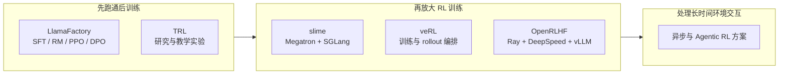

# 18.1 从单机实验到工业训练

从 RLHF 到 DPO，再到 GRPO、推理模型训练和过程奖励，我们已经学会了一套套后训练算法：怎么让模型对齐人类偏好，怎么省掉 Critic 做组内比较，怎么让模型学会长程推理，怎么在推理时搜索更好的答案。

这些算法在小模型上做实验时看起来很简单：一个脚本就能把生成、打分、更新串起来。但真要训练一个 7B、70B 甚至更大的生产模型时，你会立刻遇到新问题：Actor、Reference、Reward Model 加起来几十上百亿参数，单张卡根本装不下；生成一条回答要几秒钟，但参数更新只要几百毫秒，训练 GPU 大部分时间在空等；刚更新完的权重怎么及时同步到生成端，也是个麻烦事。

第 18 章就解决这些"算法跑起来"的问题：本节先看单机实验为什么需要扩展；[18.2](./industrial-post-training) 把数据、训练、评测和数据回流接成完整流程；[18.3](./modern-industrial-practice) 解释训练为什么会失稳；[18.4](./distributed-sync) 说明多张 GPU 如何协同执行这条流程；[18.5](./data-engineering) 再把任务、环境、轨迹和验证结果整理成可持续使用的数据资产。

先用一个最简单的例子看一次训练在做什么。假设训练数据里有个问题："为什么天空看起来是蓝色的？"不管用 PPO 还是 GRPO，一轮训练都会经过这几步：

1. **Actor 生成回答。** 它就是正在训练的语言模型。
2. **Reward Model 给回答打分。** 分数越高，说明回答越符合人类偏好；可验证任务（如数学题）也可以直接用规则验证器打分。
3. **Reference Model 提供参照。** 它是训练前冻结的模型副本，用来计算 KL 惩罚，避免 Actor 一次更新得太远。
4. **Critic 估计优势。** PPO 需要它来估计"这个回答比预期好多少"；GRPO 省掉了 Critic，改用同组回答的相对分数。
5. **训练进程更新 Actor。** 算出梯度、更新参数后，新权重交给下一轮生成使用。

模型只有几亿参数时，这五个角色可以在同一台机器上依次运行——生成完了打分，打完分更新，更新完再生成，慢是慢点，但能跑通。一旦模型和数据规模增大，问题首先出在执行方式上：多个模型无法同时装进有限显存；生成回答通常比一次参数更新慢得多；训练得到的新参数还要及时同步回生成进程。这三个环节只要有一步等待过久，其他 GPU 就会闲置。

**训练框架的作用，就是安排这些角色在什么设备上运行、何时交换数据、何时同步新参数。** 它没有改变 PPO、GRPO 或奖励模型的数学定义，只是让同一条训练流程能够稳定地跑在多张卡和多台机器上。

## 1. 从单机训练认识系统规模

### 1.1 训练规模与框架选择

选择工具之前，先看模型能不能在现有机器上完成训练。

- **第一次训练自己的模型**：先用 LlamaFactory。准备数据和配置，依次运行 SFT、奖励模型、PPO 或 DPO。先用它看清数据怎样进入训练、每个阶段会产出什么模型。
- **模型太大，单机放不下或跑得慢**：再用 slime 或 veRL。把模型训练和回答生成分配到多张 GPU，并在每轮更新后同步最新模型参数。

等到单机显存不足，或者生成回答占用大量时间，再学习分布式框架如何安排多张 GPU。这样可以先解决训练方法的问题，再处理多机系统的问题。

本课程后面仍会使用 veRL 完成代码生成 RL 实验。veRL 与 slime 都能承担规模化 RL 训练，二者采用的训练与生成后端不同。OpenRLHF 则是基于 Ray、DeepSpeed 和 vLLM 的另一套方案，放在进阶对比中了解即可。

### 1.2 同步训练与异步训练

假设一批任务里有九道短数学题和一道需要反复调用工具的任务。前九道题很快结束，最后一道却要运行几分钟。

- **同步训练**会等整批任务全部完成，再统一计算奖励和更新模型。数据较新，流程也容易理解，但所有进程都要等待最慢的任务。
- **异步训练**让已经完成的结果先进入队列，训练进程可以持续取数据更新。设备等待更少，但数据可能来自稍早的模型，因此还要控制经验陈旧的问题。

数学和代码题的生成时长较接近，通常先用同步方案。工具调用、浏览器操作和长时间环境交互的耗时差别很大，更容易从异步方案中受益。

::: tip 第一次阅读到这里即可
先记住一条线：**生成回答 → 计算奖励 → 更新模型 → 同步新参数**。后面的框架、奖励、成本和系统设计，都在解释这四步怎样扩展到更大的模型与集群。
:::

### 1.3 从训练脚本到分布式框架

先从一台机器上的数学题训练开始。程序取出一批题目，让模型生成回答，用答案验证器计算奖励，再根据奖励更新模型。模型较小、回答较短时，这几步可以写在同一个训练脚本里。此时最重要的是确认三件事：数据格式是否正确，奖励是否真的反映答案质量，参数更新后正确率是否提高。

LlamaFactory 和 TRL 适合完成这个阶段。LlamaFactory 用统一配置组织 SFT、奖励模型、DPO 和 PPO；TRL 用 Trainer 接口提供 SFT、DPO、GRPO 和 PPO 等实现。第一次实验时，框架的价值是把数据、算法和模型接起来，让学习者能够看清一次训练怎样完成。

模型增大后，同一个脚本会遇到新的问题。Actor 负责生成和更新，Reference Model 负责计算 KL，PPO 还需要 Critic；生成阶段又要为每道题采样多条回答。这些模型和中间结果可能无法同时装入一组 GPU，回答生成也会让训练 GPU 长时间等待。框架这时需要决定：每个模型放在哪些 GPU 上，生成结果交给哪个进程，Actor 更新后怎样把新权重同步回生成端。

veRL 把 Actor、Critic、Reference Model、Reward Model 和 rollout 引擎表示为可以调度的角色，Driver 再按照 PPO 或 GRPO 的顺序调用它们。OpenRLHF、NeMo-Aligner 和 slime 也解决这类问题，只是采用的底层组件不同：OpenRLHF 使用 Ray、DeepSpeed 和 vLLM，NeMo-Aligner 使用 NeMo 与 Megatron，slime 使用 Megatron 与 SGLang。它们之间的区别主要在资源调度和训练、生成后端，算法仍然是前面学过的 PPO、DPO 或 GRPO。



#### 长任务为什么需要异步训练

数学题的回答长度通常比较接近。一批题目开始生成后，往往能在相近时间结束。代码仓库和浏览器任务则不同：有的任务第一次测试就通过，有的任务需要反复读取文件、调用工具和等待外部环境。同一批任务可能相差几分钟甚至更久。

同步训练必须等最慢的任务结束，才能把整批轨迹交给训练进程。异步训练会把已经完成的轨迹先放进队列，生成进程继续处理新任务，训练进程则持续从队列取数据。这样可以减少 GPU 等待，但会带来一个新问题：某条轨迹生成时使用的是旧版 Actor，等它进入训练时，Actor 可能已经更新了几轮。

AReaL 和 LlamaRL 都在处理生成与训练异步推进的问题。AReaL 为每条轨迹记录生成它的策略版本，并用重要性采样比较生成策略与当前策略。设生成轨迹时的策略为 $\pi_{\theta_{\text{gen}}}$，训练时的策略为 $\pi_\theta$，某一步动作的修正比率为：

$$\rho_t^{\text{stale}} = \frac{\pi_\theta(a_t \mid s_t)}{\pi_{\theta_{\text{gen}}}(a_t \mid s_t)}$$

分子表示当前模型选择动作 $a_t$ 的概率，分母表示生成这条轨迹的旧模型当时选择该动作的概率。若两者都是 0.2，比率就是 1，这条经验与当前策略一致；若分别是 0.1 和 0.2，比率就是 0.5，说明当前模型已经不太会产生这个动作。比率偏离 1 越远，轨迹越陈旧。系统可以降低它的训练权重；版本相差过大时，也可以直接丢弃。

#### Agent 训练还要管理环境

普通问答的环境很简单：程序给出问题，验证器检查答案。代码 Agent 的一次轨迹却可能包含读取文件、修改代码、运行测试和处理报错；浏览器 Agent 还要保存网页状态、工具返回和终止原因。训练框架因此要管理两条线：模型怎样更新，以及外部环境怎样创建、交互、复位和回收。

AgentRL 使用 Controller 和 Task Worker 管理多轮、多任务环境，并用 rollout、Actor 和 Reference worker 完成异步 GRPO。slime 把工具调用、沙箱交互和验证器反馈接入数据生成流程，再写入 rollout 缓冲区。阿里的 ROLL 同样提供环境与 rollout 接口，并把训练和 Agent 部署放在一套生命周期中。它们增加环境管理，是因为 Agent 轨迹已经包含外部状态，无法只保存一段模型回答。

#### 按当前问题选择框架

现在可以把框架放回它所解决的问题：

- **跑通后训练**：LlamaFactory、TRL——首先要解决的是数据、奖励与算法配置能否正确运行
- **扩展到分布式 RL**：veRL、OpenRLHF、NeMo-Aligner、slime——解决多模型放置、生成吞吐与权重同步
- **训练长轨迹 Agent**：AReaL、LlamaRL、AgentRL、ROLL——解决异步经验、环境生命周期与策略版本

先判断实验停在哪一层，再看团队已经使用的训练和推理后端：

```text
你现在要解决什么问题？
├── 第一次跑后训练
│   └── LlamaFactory / TRL
├── 需要灵活编排多模型和多种后端
│   └── veRL
├── 使用 Megatron + SGLang 放大 RL
│   └── slime
├── 使用 Ray + DeepSpeed + vLLM
│   └── OpenRLHF
├── 已经使用 NVIDIA NeMo / Megatron 训练栈
│   └── NeMo-Aligner
└── 长时间工具或环境交互造成大量等待
    └── 比较 AReaL / LlamaRL / AgentRL / ROLL
```

学习时不必同时掌握所有框架。先用 LlamaFactory 或 TRL 跑通一轮训练，确认数据、奖励和算法正确；模型放不下或生成太慢时，再学习 veRL、slime 或 OpenRLHF；任务开始调用工具并出现长短不一的轨迹后，最后进入 AReaL、LlamaRL、AgentRL 或 ROLL。这个顺序对应问题出现的顺序。

---

## 2. 训练奖励设计

后训练常用两类奖励：可验证任务由程序或规则判断结果，开放任务则依赖人类偏好或奖励模型。两类信号的来源不同，混合训练前需要先理解各自的误差和适用范围。奖励设计的细节决定了模型到底学到什么，是流水线中最容易出错的环节之一。

### 2.1 两类奖励的定义与适用范围

**Verifiable Reward（VR）** 来自一个确定性的验证函数：给定 prompt $q$ 和 response $o$，验证器输出二值（或连续）分数：

$$r_{\text{VR}}(q, o) = \mathbb{1}[\text{extract}(o) == \text{answer}(q)]$$

$q$ 是题目，$o$ 是模型回答，$\text{extract}(o)$ 从回答中抽取最终结果。指示函数 $\mathbb 1[\cdot]$ 在等式成立时取 1，否则取 0。例如标准答案是 42，抽取结果也是 42，奖励就是 1；抽取失败或答案不同，奖励就是 0。

数学题可以对比最终答案，代码题可以运行测试，逻辑题可以使用规则验证器。验证过程可以重复，但仍要防止答案解析错误、测试覆盖不足和环境故障。

**Pairwise Preference Reward（PPR）** 来自一个学到的 Reward Model $R_\phi$，它从人类偏好数据 $(o_w, o_l)$（chosen 和 rejected）中训练：

$$\mathcal{L}_{\text{RM}} = -\mathbb{E}\left[\log \sigma\left(R_\phi(q, o_w) - R_\phi(q, o_l)\right)\right]$$

$o_w$ 是偏好数据中较好的回答，$o_l$ 是较差的回答。奖励差 $R_\phi(q,o_w)-R_\phi(q,o_l)$ 越大，$\sigma$ 输出的偏好概率越接近 1，损失越小。训练完成后，$R_\phi(q,o)$ 给出标量奖励。它学习的是标注数据中的偏好分布，因此会受到标注一致性、样本覆盖和泛化能力影响。

两类奖励的核心区别可以这样理解：

- **奖励来源**：VR 来自规则验证器或执行环境；PPR 来自学到的 Reward Model
- **噪声来源**：VR 的噪声在解析器、测试与执行环境；PPR 的噪声在标注分歧与 RM 泛化误差
- **标注成本**：VR 接近零（自动验证）；PPR 成本高（需 pairwise 比较）
- **适用任务**：VR 适合数学、代码、逻辑、工具；PPR 适合开放对话、写作、安全、风格
- **奖励漏洞**：VR 要防测试覆盖不足、规则绕过；PPR 要防利用 RM 偏差
- **训练约束**：VR 需要校验验证器与执行环境；PPR 需要监控 KL 与独立评测

### 2.2 训练 Prompt 的难度筛选

VR 训练的成功率高度依赖 prompt 质量。一个关键观察来自字节 Seed-Thinking 论文：**并非所有可验证 prompt 都有训练价值**。如果一道题对当前策略来说太简单（全部 rollout 都对）或太难（全部都错），组内 reward 方差为零，advantage 也为零，这批数据对梯度没有贡献。

Seed-Thinking 给出 prompt 选择的三条标准：

1. **可学性（Learnability）**：当前策略的通过率在 $[0.1, 0.9]$ 之间。全对或全错的题过滤掉。
2. **多样性（Diversity）**：题目覆盖不同推理模式（代数、几何、组合、数论），避免策略坍缩到单一解题模板。
3. **难度分级（Difficulty Stratification）**：按 base model 的 pass rate 分桶（easy/medium/hard），curriculum learning 时按桶调度。

具体实现是 rejection sampling：先用 base model 对每道题采样 $N=16$ 个 rollout，统计通过率 $p_i$，只保留通过率在 $[0.1, 0.9]$ 的 prompt，再按通过率分桶。

这条策略把算力集中到当前模型有时成功、有时失败的题目上。DAPO 的 Dynamic Sampling 也会持续监控每个提示的组内奖励方差，并降低低方差提示的采样比例。

### 2.3 可验证奖励与生成式奖励的组合

产品模型通常同时面对可验证任务和开放任务，可以按任务类型组合奖励：

$$R_{\text{total}}(q, o) = \alpha \cdot R_{\text{VR}}(q, o) + (1 - \alpha) \cdot R_{\text{GenRM}}(q, o)$$

其中 $\alpha\in[0,1]$ 决定两种奖励的占比。数学或代码任务可以令 $\alpha$ 接近 1，开放写作任务可以令它接近 0。混合以前还要先对齐两种奖励的尺度。

**生成式奖励模型（Generative RM）** 是 2024 年的新趋势：把 RM 重新表述为生成任务。给定 prompt $q$ 和两个 response $o_1, o_2$，让 LLM 生成一个 token "A" 或 "B" 表示哪个更好。相比传统判别式 RM，它有三项特点：复用预训练能力，不需要从头训分类头；支持 chain-of-thought 判断，准确率比直接打分高 10-20%；判断过程是文本，可审计、可调试。它的代价是每次判断都要生成额外 token，工程上可以先离线生成偏好和解释，再训练较小的判别式奖励模型供在线 RL 使用。

代码任务只使用公开单元测试时，模型可能通过硬编码绕过检查。RTV（Rule-Test-Verifier）把格式规则、公开测试和隐藏验证分成三层：规则层过滤格式与明显硬编码，测试层验证已知行为，隐藏测试和模型裁判检查泛化、风格与效率。分项结果也应单独记录，便于发现奖励漏洞来自哪一层。

### 2.4 奖励尺度对齐

混合多种 reward 时最大的工程问题是**尺度不一致**。数学题 reward 是 $\{0, 1\}$，代码题通过率是 $[0, 1]$，GenRM 分数可能是 $[-3, 3]$，length penalty 是 $[-0.5, 0.5]$。直接相加会让大尺度 reward 主导梯度。

标准做法是按任务域做 z-score 归一化：

$$\tilde{r}_{\text{domain}} = \frac{r - \mu_{\text{domain}}}{\sigma_{\text{domain}}}$$

其中 $\mu_{\text{domain}}, \sigma_{\text{domain}}$ 是当前 batch 内同域 reward 的均值和标准差。归一化后所有 reward 都在 $[-3, 3]$ 量级，可以安全相加。

另一种做法是对同一提示的 $G$ 条 rollout 进行组内标准化。GRPO 使用这项统计量构造相对优势，使不同提示的原始奖励尺度不会直接进入同一次组内比较。

---

## 3. 训练成本估算

训练成本影响模型、算法和数据规模的选择。估算的目的不是精确到几小时，而是快速判断一个方案在现有资源下是否可行。

### 3.1 成本模型的基本公式

先估算训练总 FLOPs，再除以单卡每秒实际完成的 FLOPs，最后把秒换算成小时：

$$\text{GPU-hours} \approx \frac{6 \cdot N_{\text{active}} \cdot N_{\text{tokens}}}{\text{GPU\_FLOPS} \cdot \text{MFU} \cdot 3600}$$

- $N_{\text{active}}$ 是每个 token 实际参与计算的参数量；Dense 模型等于总参数量，MoE 模型只计算被路由到的专家
- $N_{\text{tokens}}$ 是训练 token 数
- 系数 6 来自前向 + 反向的 FLOPs 估算（2 倍前向 + 4 倍反向）
- $\text{MFU}$（Model FLOPs Utilization）是实际利用率，典型值 30%-50%

举个容易复算的例子：7B Dense 模型训练 10 亿 token，单卡峰值 989 TFLOPS、MFU 为 40%，则总工作量约为 29.5 GPU-hours。真实训练还会增加通信、数据加载、检查点和流水线空闲时间。

### 3.2 RL 训练的成本构成

RL 训练成本比 SFT 复杂，因为它包含多个模型的计算开销。以 veRL 跑 GRPO 为例，单步成本可拆解为：

$$C_{\text{RL-step}} = C_{\text{rollout}} + C_{\text{actor-update}} + C_{\text{ref-forward}} + C_{\text{reward}}$$

四项分别是生成回答、更新 Actor、运行参考模型和计算奖励的成本。典型配比中（7B 模型，每步 batch=512 prompts × 8 rollouts），rollout generation 占总计算量的 50%-60%，因此框架都会单独优化生成吞吐、异步调度和参数同步。

### 3.3 成本控制策略

- **数据筛选优先于算力堆叠**：用高质量 10K 样本胜过低质量 100K 样本，但筛选本身需要算力。
- **小模型先验证**：7B 模型验证算法和超参，再放大到 70B/400B，避免大模型上的失败重训。
- **混合精度训练**：BF16 训练比 FP32 快 2 倍；FP8（H100 支持）再快 1.5-2 倍。但低精度训练对稳定性要求更高。
- **Checkpoint 复用**：pretraining → SFT → RL 各阶段保留 checkpoint，避免从零重训。

---

## 本节小结

- 从单机实验放大到工业训练时，PPO、GRPO 和奖励模型的基本定义没有改变，执行它们需要更多设备与进程。
- 训练框架负责生成、奖励计算、参数更新和权重同步之间的资源安排与数据流动。
- 奖励分为可验证奖励和偏好奖励两类，二者噪声来源不同，混合前需要做尺度对齐。
- 并非所有题目都有训练价值，应优先保留当前策略有时对、有时错的题目。
- LlamaFactory 适合先跑通后训练；slime、veRL 和 OpenRLHF 用不同技术栈处理规模化 RL 的数据流与资源编排。
- 同步训练等待整批生成结束；异步训练持续消费已完成的数据，更适合耗时差别较大的长任务。

[18.2 工业后训练流水线](./industrial-post-training) 会继续说明这些步骤如何组成完整的后训练过程；[18.4 分布式 RL 训练](./distributed-sync) 展开多机系统的实现细节；[18.5 大规模 RL 数据工程](./data-engineering) 则说明训练所需的任务、环境和轨迹怎样进入同一条数据生产线。

## 延伸阅读

### 训练框架

- [HybridFlow: A Flexible and Efficient RLHF Framework (veRL, arXiv:2409.19256)](https://arxiv.org/abs/2409.19256)
- [OpenRLHF: An Easy-to-use, Scalable and High-performance RLHF Framework](https://arxiv.org/abs/2405.11143)
- [AReaL: A Large-Scale Asynchronous Reinforcement Learning System for Language Reasoning (arXiv:2505.24298)](https://arxiv.org/abs/2505.24298)
- [LlamaRL: A Distributed Asynchronous Reinforcement Learning Framework for LLMs (arXiv:2505.24034)](https://arxiv.org/abs/2505.24034)

### 奖励设计与数据策略

- [Seed1.5-Thinking: Advancing Superb Reasoning Models with Reinforcement Learning (arXiv:2504.13914)](https://arxiv.org/abs/2504.13914)
- [Generative Reward Models](https://arxiv.org/abs/2410.12832)
- [DAPO: An Open-Source LLM RL System at Scale](https://arxiv.org/abs/2503.14476)
