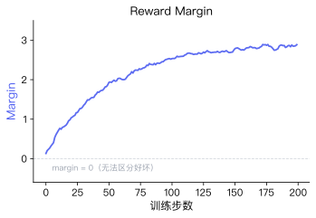

# 2.2 Loss、Reward Margin 与 Accuracy

在上一节 2.1.4.2 中，我们推导了 DPO 的损失函数。本节回到实验层面，解读 `DPOTrainer.train()` 在训练过程中输出的各项指标。

与第 1 章中 CartPole 仅仅关注 `Episode Reward`（存活步数）不同，偏好对齐任务缺乏明确的环境标量奖励，因此训练日志的指标也更加丰富。运行 `trainer.train()` 时，控制台会逐步输出类似这样的日志：

```
Step  Training Loss  Rewards/Margins  Rewards/Chosen  Rewards/Rejected  Rewards/Accuracies
  5       0.6821          0.0312          -0.0156          -0.0468              0.52
 10       0.6543          0.1247           0.0891          -0.0356              0.58
 15       0.5987          0.3421           0.2314          -0.1107              0.72
 ...
 45       0.2103          1.5632           0.9201          -0.6431              0.92
```

如果你在训练中接入了 SwanLab 或 TensorBoard，还会看到对应的可视化曲线。下面逐个解读每一列的含义。

### Training Loss（训练损失）

Training Loss 就是上一节推导的 DPO 损失函数 $\mathcal{L}_{DPO}$ 在每个训练步骤上的值——对应控制台日志中的 `Training Loss` 列。

训练开始时，模型尚未学会区分好坏，$\pi_\theta$ 与 $\pi_{ref}$ 的概率分布几乎相同，因此括号内的奖励差距接近 0，$\sigma(0) = 0.5$，Loss 初始值约为 $-\ln(0.5) = \ln 2 \approx 0.693$。对照上面的日志，第 5 步的 `0.6821` 确实接近这个值。

**曲线持续下降并趋于稳定，即表明训练正常。** 但 Loss 并非越低越好——如果降得极低，模型可能陷入了过拟合（Overfitting），不再是"理解了什么是好的回复"，而仅仅是记忆了训练集里的句子。


一条健康的 Loss 曲线应呈现以下特征：

- **从 $\ln 2 \approx 0.69$ 附近开始下降**：初始值接近随机猜测水平，说明模型确实是从零开始学习的。
- **持续下降后趋于稳定**：模型逐步学会区分好坏回答。
- **最终稳定在某个正值**：由于偏好数据中不可避免地存在标注噪声，Loss 通常不会降到 0。

| 异常现象                   | 可能原因                   | 严重程度 |
| -------------------------- | -------------------------- | -------- |
| 始终不降（卡在 0.69 附近） | 学习率过低或数据问题       | 严重     |
| 下降后突然反弹             | 学习率过大或批次数据质量差 | 中等     |
| 快速降到接近 0             | 过拟合，模型记忆了训练数据 | 中等     |

<details>
<summary><strong>如果偏好数据标注错了（例如把刻薄的回答标记为 chosen），Loss 曲线会发生什么？</strong></summary>

Loss 依然会正常下降。因为模型只是在机械地拟合数据中给定的偏好关系，它并不"知道"谁对谁错——它只按照损失函数的要求拉大 chosen 和 rejected 的差距。这也意味着微调后的模型会迅速学到不良的回复模式。

这引出了 Post-Training 的一个核心法则：**对齐的效果高度依赖数据质量，garbage in, garbage out。**

</details>

### Reward Margin（奖励边界）

Reward Margin 是损失函数中 Sigmoid 内部的奖励差距项，直接反映模型的区分能力——对应日志中的 `Rewards/Margins` 列：

$$\text{Margin} = \beta \ln \frac{\pi_\theta(y_w | x)}{\pi_{ref}(y_w | x)} - \beta \ln \frac{\pi_\theta(y_l | x)}{\pi_{ref}(y_l | x)}$$

Margin 为正且越大，说明模型越确信"好回答比坏回答好得多"。一条健康的曲线应该**从零附近逐步上升并趋于稳定**。



- **健康状态**：Margin 从零附近逐步上升并趋于稳定，说明模型越来越确信好回答优于坏回答。
- **异常状态**：Margin 变为负数或在零附近剧烈震荡，说明模型完全无法区分两种回答的优劣。常见原因包括：好坏回答的长度差异过大、数据本身存在歧义、或学习率设置不当。

<details>
<summary><strong>如果把 <code>beta</code> 参数从 0.1 改成 1.0，Reward Margin 会怎样变化？</strong></summary>

`beta` 控制模型偏离参考模型的惩罚强度——也就是 [3-train_dpo.py](../../code/chapter17_dpo/3-train_dpo.py) 中 `DPOConfig(beta=0.1)` 的那个参数。

- `beta` 很大（如 1.0）：惩罚极强，模型几乎不敢改变原来的输出分布，Margin 增长极慢甚至不增长。
- `beta` 很小（如 0.01）：模型为了拉大 Margin 而大幅偏离参考分布，可能输出人类无法理解的文本来迎合优化目标。

> **动手实验**：打开 [3-train_dpo.py](../../code/chapter17_dpo/3-train_dpo.py)，找到 `DPOConfig` 里的 `beta` 参数，分别修改为 0.01 和 0.5，重新运行训练，观察 Margin 曲线的差异。

</details>

### Reward Accuracy（偏好准确率）

Reward Accuracy 对应日志中的 `Rewards/Accuracies` 列。它衡量的是：在一个训练批次中，模型给好回答的隐式奖励高于坏回答隐式奖励的样本占比：

$$\text{Accuracy} = \frac{\#\{i \in B : r(x_i, y_w^{(i)}) > r(x_i, y_l^{(i)})\}}{|B|}$$

其中 $\#\{\cdot\}$ 表示满足条件的样本数量，$|B|$ 是批次大小。这个指标不需要梯度计算，只需逐条比较两个奖励值的大小关系。


训练开始时，模型对好坏回答给出的隐式奖励几乎相同，Accuracy 在 0.5 附近（相当于随机猜测）。对照上面的日志，第 5 步的 `0.52` 正好处于这个水平。随着训练推进，Accuracy 应该稳步上升，最终收敛在 0.8 ~ 0.95 之间。如果 Accuracy 长期停留在 0.5 附近，说明模型完全没有学到偏好关系。

Accuracy 和 Margin 提供了不同粒度的信息。Accuracy 只看"谁大谁小"（二值判断），而 Margin 还看"大多少"（连续值）。一个健康的训练过程中，两者应该同步改善：Accuracy 上升的同时 Margin 也在增长。如果 Accuracy 很高但 Margin 很小，说明模型虽然能区分好坏，但区分的信心不足。

### Chosen Reward 与 Rejected Reward（拆开看 Margin）

Reward Margin 是两个奖励的差值，但只看差值会丢失信息。Margin 从 0 增长到 2.0，可能对应多种情况：

- 好回答的奖励上升了 2.0，坏回答没变——模型更偏好"好的"。
- 好回答没变，坏回答的奖励下降了 2.0——模型更排斥"坏的"。
- 好回答上升了 3.0，坏回答也上升了 1.0——两者概率都在升高，但差距在拉大。

这三种情况的 Margin 相同，但训练动态完全不同。因此，TRL 将 Chosen Reward 和 Rejected Reward 拆开记录——对应日志中的 `Rewards/Chosen` 和 `Rewards/Rejected` 列。它们的定义分别是：

$$r_{\text{chosen}} = \beta \ln \frac{\pi_\theta(y_w | x)}{\pi_{ref}(y_w | x)}, \quad r_{\text{rejected}} = \beta \ln \frac{\pi_\theta(y_l | x)}{\pi_{ref}(y_l | x)}$$

一个健康的训练过程中，$r_{\text{chosen}}$ 应该逐步上升（模型越来越偏好好回答），$r_{\text{rejected}}$ 应该逐步下降（模型越来越排斥坏回答）。如果两者同时上升或同时下降，需要结合 Margin 和 Loss 综合判断训练是否正常。

<details>
<summary><strong>补充：将 log 概率比进一步拆开</strong></summary>

隐式奖励 $r_{\text{chosen}}$ 可以进一步展开为：

$$\beta \ln \frac{\pi_\theta(y_w | x)}{\pi_{ref}(y_w | x)} = \beta \ln \pi_\theta(y_w | x) - \beta \ln \pi_{ref}(y_w | x)$$

其中 $\ln \pi_{ref}(y_w | x)$ 是常数（参考模型不更新），所以 $r_{\text{chosen}}$ 的变化完全由 $\ln \pi_\theta(y_w | x)$ 驱动。TRL 的 DPOTrainer 默认会记录 `logps/chosen` 和 `logps/rejected` 两个指标，对应 $\ln \pi_\theta(y_w)$ 和 $\ln \pi_\theta(y_l)$ 的批次均值，可以更直接地观察模型对每种回答的概率变化。

</details>

---

## 指标速查表

| 指标                  | TRL 日志 Key         | 健康表现                     | 异常信号                   |
| --------------------- | -------------------- | ---------------------------- | -------------------------- |
| **Training Loss**     | `loss`               | 从 ln2 ≈ 0.69 下降并趋于稳定 | 卡在 0.69 / 快速降到接近 0 |
| **Reward Margin**     | `rewards/margins`    | 从 0 上升并趋于稳定          | 为负 / 在零附近震荡        |
| **Reward Accuracy**   | `rewards/accuracies` | 从 0.5 上升至 0.8~0.95       | 长期停留在 0.5             |
| **Chosen Reward**     | `rewards/chosen`     | 逐步上升                     | 下降或不变                 |
| **Rejected Reward**   | `rewards/rejected`   | 逐步下降                     | 上升                       |
| **Chosen Log Prob**   | `logps/chosen`       | 随训练逐步变化               | —                          |
| **Rejected Log Prob** | `logps/rejected`     | 随训练逐步变化               | —                          |

---

## 本章小结

在第 2 章中，我们完成了以下内容：

1. **运行了现代 RL 微调**：用 DPO 算法对一个 5 亿参数的大模型进行了偏好对齐，在几分钟内让模型学会了在用户观点有误时礼貌地反驳，而不是盲目附和。
2. **梳理了 Post-Training 流水线**：理解了 Pre-training → SFT → RL 三阶段的递进关系，以及 DPO 在其中的位置。
3. **推导了 DPO 损失函数**：从 RLHF 的奖励模型出发，理解了 DPO 如何通过概率比值跳过奖励模型训练，将偏好优化转化为对比损失函数。
4. **掌握了评估指标**：读懂了 Training Loss、Reward Margin、Reward Accuracy、Chosen/Rejected Reward 的数学定义和判读方法。

无论是第 1 章的 CartPole 还是本章的大模型微调，核心目标都是让模型学会做出更优的决策。接下来，我们将正式进入理论篇，系统地拆解强化学习底层的数学逻辑。

## 参考文献

[^1]: Schulman, J., et al. (2017). Proximal Policy Optimization Algorithms. _arXiv preprint_. [arXiv:1707.06347](https://arxiv.org/abs/1707.06347)

[^2]: Ouyang, L., et al. (2022). Training language models to follow instructions with human feedback. _arXiv preprint_. [arXiv:2203.02155](https://arxiv.org/abs/2203.02155)

[^3]: Rafailov, R., et al. (2023). Direct Preference Optimization: Your Language Model is Secretly a Reward Model. _arXiv preprint_. [arXiv:2305.18290](https://arxiv.org/abs/2305.18290)

[^4]: Christiano, P. F., et al. (2017). Deep reinforcement learning from human preferences. _Advances in Neural Information Processing Systems_, 30.
