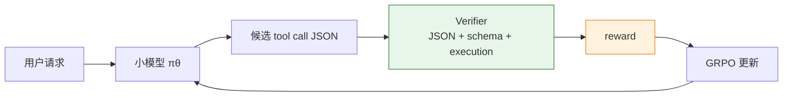

# 9.5 动手 与 用 GRPO 训练小模型稳定调用金融 API

上一节我们用数学题理解了 RLVR：只要答案能被规则验证，就不一定需要训练 Reward Model。现在把这个想法换到一个更像企业应用的场景里：用户用自然语言提出金融查询，小模型需要选择正确的 API，填对参数，并且在工具返回后给出正确答案。

先看直觉。数学题的动作是“写出答案”，金融助手的动作则是“调用工具”。例如用户问：

> What was AAPL's closing price on 2025-01-03?

一个可靠的工具调用模型不应该凭记忆回答股价，而应该生成结构化调用：

```json
{
  "name": "get_stock_price",
  "arguments": { "ticker": "AAPL", "date": "2025-01-03" }
}
```

这一步的含义是：模型不再只是语言生成器，而是在一个受控 API 菜单里选择动作。真正的问题在于，小模型经常会犯三类错：函数名选错、参数填错、JSON 格式坏掉。对于企业 API 来说，这些错误比普通文本回答更危险，因为错误的工具调用可能查错客户、下错订单、改错数据库。

这一节参考 AWS 的 financial tool-calling GRPO + TRL 示例[^aws-financial-tool-grpo]，做一个更小的可复现实验：先用少量合成金融 API 数据定义任务，再用 verifier 给工具调用打分，最后用 TRL 的 `GRPOTrainer` 训练小模型。目标不是复刻云上完整吞吐，而是把“企业 API 调用也可以做 RLVR”这件事讲清楚。

## 从自然语言到 API 调用

我们先把环境压到最小。假设企业内部只有三个金融 API：

| 工具               | 作用                       | 必要参数                                 |
| ------------------ | -------------------------- | ---------------------------------------- |
| `get_stock_price`  | 查询某只股票在某天的收盘价 | `ticker`, `date`                         |
| `get_revenue`      | 查询某家公司某一财年的收入 | `company`, `fiscal_year`                 |
| `convert_currency` | 按给定汇率换算金额         | `amount`, `from_currency`, `to_currency` |

同一个自然语言请求可能对应一个工具调用，也可能根本不该调用工具。例如：

| 用户请求                                      | 正确动作              |
| --------------------------------------------- | --------------------- |
| “Get MSFT close price on 2025-01-02.”         | 调 `get_stock_price`  |
| “What was Tesla revenue in fiscal year 2024?” | 调 `get_revenue`      |
| “Convert 120 USD to EUR.”                     | 调 `convert_currency` |
| “Write a poem about markets.”                 | 不调用工具            |

这里的 RLVR 信号来自一个可执行 verifier：模型生成 JSON 后，我们检查它是否能解析、函数名是否存在、参数是否符合 schema、执行结果是否匹配标准答案。不是“看起来像不像”，而是“能不能真的调用对”。



## 小而完整的训练集

真实企业里，数据通常来自三处：历史 API 调用日志、人工整理的业务用例、强模型合成的 query-call 对。为了把实验跑通，我们先手写一个小型数据生成器。每条样本包含三部分：

- `prompt`：用户请求和可用工具说明。
- `gold_call`：标准工具调用。
- `expected_result`：执行工具后的标准结果。

```python
import json
from datasets import Dataset

TOOLS = [
    {
        "name": "get_stock_price",
        "description": "Get the closing stock price for a ticker on a date.",
        "parameters": {
            "ticker": {"type": "string"},
            "date": {"type": "string", "format": "YYYY-MM-DD"},
        },
        "required": ["ticker", "date"],
    },
    {
        "name": "get_revenue",
        "description": "Get annual revenue for a company and fiscal year.",
        "parameters": {
            "company": {"type": "string"},
            "fiscal_year": {"type": "integer"},
        },
        "required": ["company", "fiscal_year"],
    },
    {
        "name": "convert_currency",
        "description": "Convert money between currencies.",
        "parameters": {
            "amount": {"type": "number"},
            "from_currency": {"type": "string"},
            "to_currency": {"type": "string"},
        },
        "required": ["amount", "from_currency", "to_currency"],
    },
]

STOCK_DB = {
    ("AAPL", "2025-01-02"): 243.85,
    ("AAPL", "2025-01-03"): 243.36,
    ("MSFT", "2025-01-02"): 418.58,
    ("MSFT", "2025-01-03"): 423.35,
}

REVENUE_DB = {
    ("Apple", 2024): 391_035_000_000,
    ("Microsoft", 2024): 245_122_000_000,
    ("Tesla", 2024): 97_690_000_000,
}

FX_DB = {
    ("USD", "EUR"): 0.92,
    ("EUR", "USD"): 1.09,
    ("USD", "JPY"): 157.2,
}


def execute_tool(name: str, arguments: dict):
    if name == "get_stock_price":
        return STOCK_DB[(arguments["ticker"], arguments["date"])]
    if name == "get_revenue":
        return REVENUE_DB[(arguments["company"], arguments["fiscal_year"])]
    if name == "convert_currency":
        rate = FX_DB[(arguments["from_currency"], arguments["to_currency"])]
        return round(arguments["amount"] * rate, 2)
    raise ValueError(f"Unknown tool: {name}")


def build_prompt(user_query: str) -> str:
    return (
        "You are a financial assistant. Choose exactly one tool call if a tool "
        "is needed. Return only JSON with this shape: "
        '{"name": "...", "arguments": {...}}. '
        "If no tool is needed, return "
        '{"name": "no_call", "arguments": {}}.\n\n'
        f"Available tools:\n{json.dumps(TOOLS, ensure_ascii=False, indent=2)}\n\n"
        f"User request: {user_query}\n"
    )


def make_dataset() -> Dataset:
    rows = []
    examples = [
        (
            "What was AAPL's closing price on 2025-01-03?",
            {"name": "get_stock_price",
             "arguments": {"ticker": "AAPL", "date": "2025-01-03"}},
        ),
        (
            "Get MSFT close price on 2025-01-02.",
            {"name": "get_stock_price",
             "arguments": {"ticker": "MSFT", "date": "2025-01-02"}},
        ),
        (
            "How much revenue did Tesla report in fiscal year 2024?",
            {"name": "get_revenue",
             "arguments": {"company": "Tesla", "fiscal_year": 2024}},
        ),
        (
            "Convert 120 USD to EUR.",
            {"name": "convert_currency",
             "arguments": {"amount": 120, "from_currency": "USD",
                           "to_currency": "EUR"}},
        ),
    ]

    for query, gold_call in examples:
        rows.append({
            "prompt": build_prompt(query),
            "gold_call": json.dumps(gold_call, ensure_ascii=False),
            "expected_result": str(execute_tool(
                gold_call["name"], gold_call["arguments"]
            )),
        })

    rows.append({
        "prompt": build_prompt("Write a short poem about financial markets."),
        "gold_call": json.dumps({"name": "no_call", "arguments": {}}),
        "expected_result": "no_call",
    })
    return Dataset.from_list(rows)
```

这个数据集很小，只适合讲清楚训练闭环。真实实验至少要把每个工具扩展到几十到几百个 query 模板，并加入负样本：缺参数、日期格式错误、没有可用工具、相似工具混淆等。AWS 示例使用的思路也是如此：把企业 API 调用转成可验证任务，让模型通过 GRPO 学会更稳定的函数选择和参数生成。

## Reward 与 把工具调用拆成四个可验证分数

数学 RLVR 通常只有“答案对不对”。工具调用更细，需要把奖励拆开，否则模型很难知道自己错在哪里。

| 子奖励           | 解决的问题               | 分数  |
| ---------------- | ------------------------ | ----- |
| JSON 可解析      | 输出是不是机器可读       | `0.2` |
| 函数名正确       | 是否选对 API             | `0.3` |
| 参数 schema 正确 | 参数是否齐全、类型是否对 | `0.3` |
| 执行结果正确     | 调用后是否得到目标结果   | `0.2` |

注意这里的奖励不是主观评价，而是规则检查。它们加起来就是一个 RLVR verifier。

```python
def parse_call(text: str) -> dict | None:
    try:
        return json.loads(text.strip())
    except json.JSONDecodeError:
        return None


def schema_ok(call: dict, gold: dict) -> bool:
    if call.get("name") != gold.get("name"):
        return False
    if not isinstance(call.get("arguments"), dict):
        return False
    for key, gold_value in gold["arguments"].items():
        if key not in call["arguments"]:
            return False
        if not isinstance(call["arguments"][key], type(gold_value)):
            return False
    return True


def tool_reward(completions, gold_call, expected_result, **kwargs):
    rewards = []
    for completion, gold_raw, expected in zip(
        completions, gold_call, expected_result
    ):
        gold = json.loads(gold_raw)
        call = parse_call(completion)
        if call is None:
            rewards.append(0.0)
            continue

        reward = 0.2
        if call.get("name") == gold["name"]:
            reward += 0.3
        if schema_ok(call, gold):
            reward += 0.3

        if gold["name"] == "no_call":
            if call.get("name") == "no_call":
                reward += 0.2
            rewards.append(reward)
            continue

        try:
            result = execute_tool(call["name"], call["arguments"])
            if str(result) == expected:
                reward += 0.2
        except Exception:
            pass

        rewards.append(reward)
    return rewards
```

换个角度看，这个 reward 函数其实定义了一个小型企业 API 测试框架。它不关心模型“解释得漂不漂亮”，只关心模型有没有做出可执行、正确、可审计的动作。对于工具调用，**可执行性就是奖励的第一性原理**。

## 用 TRL 的 GRPOTrainer

有了数据和 verifier，就可以进入 GRPO。下面的代码展示最小训练骨架。实际跑的时候，如果显存有限，可以先把模型换成 `Qwen/Qwen2.5-0.5B-Instruct`；如果要贴近 AWS 示例，可以使用 `Qwen/Qwen3-1.7B`。

```python
from peft import LoraConfig
from trl import GRPOConfig, GRPOTrainer


dataset = make_dataset()

peft_config = LoraConfig(
    r=16,
    lora_alpha=32,
    lora_dropout=0.05,
    target_modules=["q_proj", "k_proj", "v_proj", "o_proj",
                    "gate_proj", "up_proj", "down_proj"],
    task_type="CAUSAL_LM",
)

training_args = GRPOConfig(
    output_dir="outputs/financial-tool-grpo",
    learning_rate=5e-6,
    per_device_train_batch_size=1,
    gradient_accumulation_steps=4,
    num_generations=4,
    max_prompt_length=2048,
    max_completion_length=256,
    temperature=0.8,
    logging_steps=1,
    save_steps=50,
    max_steps=100,
)

trainer = GRPOTrainer(
    model="Qwen/Qwen3-1.7B",
    args=training_args,
    train_dataset=dataset,
    reward_funcs=tool_reward,
    peft_config=peft_config,
)

trainer.train()
```

这段代码背后的训练逻辑和上一节数学 RLVR 完全一致：

1. 对同一个 prompt 采样 `num_generations=4` 个工具调用。
2. `tool_reward()` 给每个候选调用打分。
3. GRPO 在同组内部计算相对优势。
4. 高分工具调用的概率上升，低分工具调用的概率下降。

区别只在 reward 的形态：数学题验证最终答案，工具调用验证 JSON、schema 和执行结果。

## 不要只看平均 reward

工具调用训练最容易出现一种错觉：训练 reward 上升了，但模型仍然不能安全接入生产 API。原因是 reward 可以被某个子项撑高，比如模型学会输出合法 JSON，却仍然经常选错函数。

因此评估要拆成至少四项：

```python
def evaluate_tool_call(predictions: list[str], examples: list[dict]) -> dict:
    total = len(examples)
    valid_json = 0
    name_match = 0
    schema_match = 0
    exact_match = 0

    for pred, ex in zip(predictions, examples):
        gold = json.loads(ex["gold_call"])
        call = parse_call(pred)
        if call is None:
            continue

        valid_json += 1
        if call.get("name") == gold["name"]:
            name_match += 1
        if schema_ok(call, gold):
            schema_match += 1

        try:
            if gold["name"] == "no_call":
                if call.get("name") == "no_call":
                    exact_match += 1
            else:
                result = execute_tool(call["name"], call["arguments"])
                if str(result) == ex["expected_result"]:
                    exact_match += 1
        except Exception:
            pass

    return {
        "response_validity": valid_json / total,
        "function_name_accuracy": name_match / total,
        "schema_match": schema_match / total,
        "exact_match": exact_match / total,
    }
```

这四个指标分别回答不同问题：

- `response_validity`：模型输出能不能被系统解析。
- `function_name_accuracy`：模型有没有选对工具。
- `schema_match`：参数名和类型是否符合预期。
- `exact_match`：工具调用执行后，结果是否真的正确。

AWS 的 financial tool-calling 示例报告了类似的提升：Qwen3-1.7B 经过 GRPO/RLVR 后，exact match 从约 `0.62` 提升到 `0.96`，response validity 从约 `0.78` 提升到 `0.99`，schema match 从约 `0.90` 提升到 `0.95`[^aws-financial-tool-grpo]。这些数字说明一个关键点：小模型不是不能做企业 API 调用，而是需要把“调用是否正确”变成明确、可优化的训练信号。

## 和普通 SFT 的区别

到这里很容易问：为什么不用 SFT？直接给模型看标准 JSON，不也能学会吗？

SFT 当然有用，尤其适合先教模型输出格式。但 SFT 学的是“模仿标准答案”，GRPO/RLVR 学的是“在尝试中比较好坏”。这两者的差异在工具调用任务上很明显：

| 训练方式  | 学到什么                           | 容易失败的地方                                 |
| --------- | ---------------------------------- | ---------------------------------------------- |
| SFT       | 标准 JSON 形式、常见函数选择模式   | 没见过的新参数组合、相似工具混淆、缺参数时乱猜 |
| GRPO/RLVR | 哪些调用真的可执行、哪些错误会扣分 | verifier 设计不完整时会 reward hacking         |

实际工程里常见的顺序是：先用 SFT 让模型学会工具调用格式，再用 GRPO/RLVR 纠正调用错误。不是 A 取代 B，而是 B 给 A 提供更精确的后训练信号。

## 常见坑

**第一，奖励不能只看 JSON 合法。** 如果合法 JSON 就给高分，模型会学会输出固定模板，而不是学会选择正确工具。

**第二，必须加入 no-call 样本。** 否则模型会把所有问题都硬塞给某个 API。企业助手最重要的能力之一，是知道什么时候不该动手。

**第三，训练集要制造相似工具。** 如果每个问题只有一个明显工具，模型不会学会细粒度区分。真实系统里，`get_revenue`、`get_profit`、`get_cash_flow` 往往非常接近，错误通常发生在这里。

**第四，执行 reward 要隔离副作用。** 查询类 API 可以直接执行，写入类 API 必须用沙盒、mock 或 dry-run。RL 训练会大量探索，不能让模型真的改生产数据库。

## 小结

这一节把 RLVR 从数学答案扩展到了企业工具调用。核心变化不是算法，而是 verifier 的形态：

- 数学 RLVR 验证最终答案；
- 代码 RLVR 跑单元测试；
- 工具调用 RLVR 验证 JSON、schema、工具选择和执行结果。

这也解释了为什么 tool-calling 是 RLVR 进入企业场景的自然入口。企业 API 本来就有 schema、参数类型、权限边界和可执行结果；这些东西天然适合变成 verifier。只要能把业务动作写成可验证环境，小模型就可以通过 GRPO 学会更稳定地调用工具。

[^aws-financial-tool-grpo]: AWS Builder Center, [Fine-tune Small Language Models for Production-Grade Tool Calling with GRPO using Hugging Face TRL on Amazon SageMaker AI](https://builder.aws.com/content/35x6VR6kZYSn3JgNQmcNmIVK32Y/fine-tune-small-language-models-for-production-grade-tool-calling-with-grpo-using-hugging-face-trl-on-amazon-sagemaker-ai).
