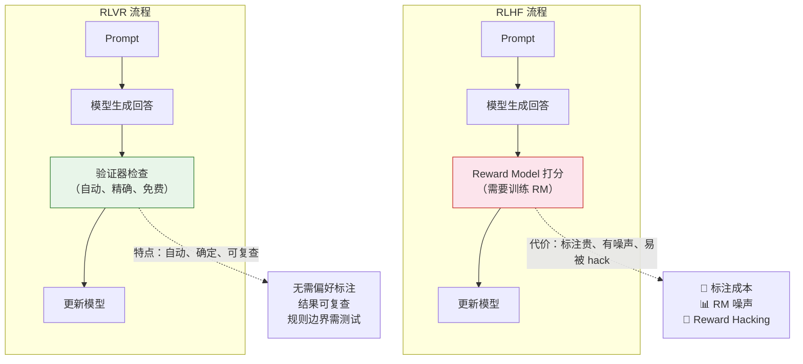
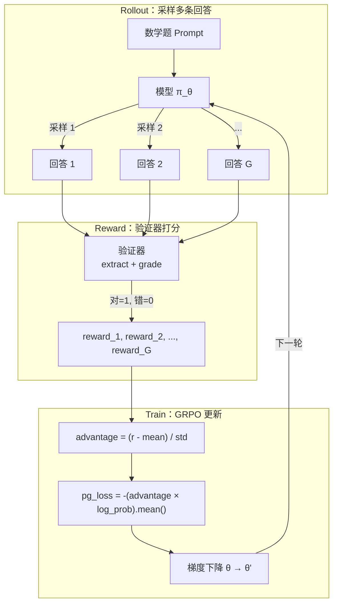

# 15.3 动手：构建 RLVR 奖励

> **本节目标**：为数学推理实现一个可验证奖励函数，并把它接入最小 GRPO 训练循环，检查格式奖励、答案奖励和总奖励是否符合预期。

> **学习路径**：[15.1 GRPO 训练机制](./grpo-practice-and-mechanism) → [15.2 DeepSeek-R1-Zero 与 DAPO](./deepseek-dapo) → **15.3 构建 RLVR 奖励**

> **本节代码与资源**：[规则奖励](https://github.com/walkinglabs/hands-on-modern-rl/blob/main/code/chapter09_grpo_rlvr/rule_based_reward.py) · [GRPO 数学推理](https://github.com/walkinglabs/hands-on-modern-rl/blob/main/code/chapter09_grpo_rlvr/grpo_math_reasoning.py) · [依赖](https://github.com/walkinglabs/hands-on-modern-rl/blob/main/code/chapter09_grpo_rlvr/requirements.txt)

GRPO 和 DAPO 都依赖可靠的奖励信号。数学题给出了一个清楚的起点：模型可以自由生成推理过程，最终答案则能由规则检查。本节先写验证器，再把奖励接入训练循环，最后用错误样例检查验证器是否会误判。

先运行不需要模型的奖励函数检查：

```bash
cd code/chapter09_grpo_rlvr
pip install -r requirements.txt
python rule_based_reward.py
```

确认答案提取、格式奖励和边界样例通过后，再运行需要下载模型的 GRPO 实验：

```bash
python grpo_math_reasoning.py
```

第二条命令需要可用的 PyTorch 设备和模型下载空间。首次学习时可以先完成奖励函数检查，再决定是否运行完整训练。

## 15.3.1 RLVR 的核心思想

传统 RLHF 使用奖励模型给出训练信号，这需要先收集偏好数据并训练奖励模型。数学和代码任务已经有客观检查方法，因此可以直接把答案匹配或单元测试写成奖励。这种做法称为**可验证奖励强化学习**（RLVR）。


```mermaid
flowchart TD
    subgraph rlhf ["RLHF 流程"]
        R1["Prompt"] --> R2["模型生成回答"]
        R2 --> R3["Reward Model 打分\n（需要训练 RM）"]
        R3 --> R4["更新模型"]
    end

    subgraph rlvr ["RLVR 流程"]
        V1["Prompt"] --> V2["模型生成回答"]
        V2 --> V3["验证器检查\n（自动、精确、免费）"]
        V3 --> V4["更新模型"]
    end

    R3 -.->|"代价：标注贵、有噪声、易被 hack"| COST1["💸 标注成本\n📊 RM 噪声\n🤖 Reward Hacking"]
    V3 -.->|"特点：自动、确定、可复查"| COST2["无需偏好标注\n结果可复查\n规则边界需测试"]

    style R3 fill:#fce4ec,stroke:#c62828
    style V3 fill:#e8f5e9,stroke:#2e7d32
```

### 与传统 RLHF 的对比

| 方面             | RLHF                       | RLVR                         |
| ---------------- | -------------------------- | ---------------------------- |
| **数据成本**     | 需要人工标注偏好对         | 需要标准答案或测试用例       |
| **奖励质量**     | 受标注一致性与 RM 误差影响 | 受验证器覆盖范围影响         |
| **可扩展性**     | 受标注速度限制             | 受验证速度和任务覆盖限制     |
| **适用范围**     | 主观偏好（礼貌、安全）     | 客观任务（数学、代码、逻辑） |
| **训练稳定性**   | 受 RM 质量影响             | 受奖励稀疏度影响             |
| **被 Hack 风险** | 可能利用 RM 漏洞           | 可能利用验证器遗漏条件       |

## 15.3.2 RLVR 的关键设计

不同领域有不同的验证方式：

| 领域       | 验证方式   | 示例                        |
| ---------- | ---------- | --------------------------- |
| 数学       | 答案匹配   | `\boxed{42}` == 标准答案    |
| 代码       | 单元测试   | 代码执行 + test case 通过率 |
| 逻辑推理   | 形式化验证 | Lean/Coq 定理证明器         |
| 多语言翻译 | 自动评分   | BLEU/COMET 分数             |

验证器的设计是 RLVR 的关键。好的验证器需要满足三个条件：**确定性**（同样的输入永远得到同样的结果）、**正确性**（验证器的判断确实反映了回答的质量）、**高效性**（验证速度要快，不能成为训练瓶颈）。

正确性需要通过边界样例检查。标准答案 $\frac{22}{7}$ 和回答 $3.1428\ldots$ 在允许近似时可以判为相等；$(x+1)(x-2)$ 和 $x^2-x-2$ 则需要先化简再比较。数学验证器通常同时使用数值容差和符号化简来处理这些等价表示。

## 15.3.3 1-Shot RLVR：少量数据能做什么

一些研究观察到，极少量可验证样本也可能让策略在未见题目上发生可测量变化。这类结果说明预训练模型已经包含部分解题模式，RL 更新可以改变这些模式被调用的概率。

这不表示训练数据量可以忽略。效果仍取决于基座模型、奖励函数、组大小和训练步数；要覆盖多种题型并稳定泛化，仍需要足够多样的训练与独立测试数据。

<details>
<summary>思考题：如果 RLVR 只需要 1 个样本就能工作，那为什么实际训练中仍然需要大量数据？</summary>

1 个样本能"启动"训练过程，但要让模型在多样化的场景下都表现好，仍然需要不同类型、不同难度的训练数据。原因包括：

- **泛化性**：只用 1 个样本训练，模型可能只在那道题的"邻域"内表现好。要覆盖广泛的题目类型，需要多样化的数据。
- **避免过拟合**：如果训练数据太少，模型可能只记住了那道题的特定解法，而不是学会了通用的推理策略。
- **统计稳定性**：1 个样本的成功有偶然性。大量数据的统计平均能确保训练方向是正确的。

1-Shot RLVR 的真正意义是理论上的——它证明了 RL 的价值不在于"注入新知识"，而在于"激活已有能力"。这改变了我们对 RL 在 LLM 训练中角色的理解。

</details>

## 15.3.4 最小 RLVR 训练实现

前面的讨论把 RLVR 的概念理清了。现在用可运行的代码把它变成具体实现。

具体来说，我们将在 MATH 数据集上训练一个 0.6B 的 Qwen3 模型：给它一道数学题，模型生成推理过程和最终答案，验证器检查答案是否正确，然后用 GRPO 更新模型。整个实现控制在 200 行以内，使用单 GPU 即可运行。

本节实现参照 Sebastian Raschka 的 [reasoning-from-scratch](https://github.com/rasbt/reasoning-from-scratch) 项目第 6 章脚本，用较少代码保留“采样回答、验证答案、计算组内优势、更新策略”四个步骤。

### RLVR 训练循环长什么样

RLVR 的训练循环和传统 GRPO 一样，但奖励来自验证器而非 RM：


```mermaid
flowchart TD
    subgraph Rollout ["Rollout：采样多条回答"]
        P["数学题 Prompt"]
        M["模型 π_θ"]
        P --> M
        M -->|"采样 1"| R1["回答 1"]
        M -->|"采样 2"| R2["回答 2"]
        M -->|"..."| R3["回答 G"]
    end
    subgraph Reward ["Reward：验证器打分"]
        R1 --> V["验证器\nextract + grade"]
        R2 --> V
        R3 --> V
        V -->|"对=1, 错=0"| Scores["reward_1, reward_2, ..., reward_G"]
    end
    subgraph Train ["Train：GRPO 更新"]
        Scores --> Adv["advantage = (r - mean) / std"]
        Adv --> Loss["pg_loss = -(advantage × log_prob).mean()"]
        Loss --> Update["梯度下降 θ → θ'"]
    end
    Update -->|"下一轮"| M
```

具体来说：

- **Rollout 阶段**：对每道数学题，模型以当前策略 $π_θ$ 采样 $G$ 条回答（例如 $G=4$）。每条回答包含推理过程和 `\boxed{}` 格式的最终答案。
- **Reward 阶段**：验证器从回答中提取 `\boxed{}` 内的答案，与标准答案比较。答对给 1 分，答错（或提取不到答案）给 0 分。
- **Train 阶段**：用 GRPO 组内归一化计算 advantage，然后做策略梯度更新。

### 从回答中提取并判断对错

RLVR 的"可验证"体现在验证器上。数学题的验证器做两件事：从模型输出中提取最终答案，然后与标准答案比较。

```python
import re

def extract_boxed_answer(text: str) -> str | None:
    """从模型输出中提取 \\boxed{...} 内的答案。

    模型被训练为在推理过程末尾用 \\boxed{} 标注最终答案。
    如果提取不到，返回 None（reward = 0）。
    """
    match = re.search(r"\\boxed\{([^}]*)\}", text)
    if match:
        return match.group(1).strip()
    return None

def grade_answer(predicted: str, ground_truth: str) -> bool:
    """判断预测答案是否正确。

    简化版：直接字符串比较 + 数值比较。
    生产级验证器会处理等价表示（如分数化简、多项式展开等）。
    """
    predicted = predicted.strip().replace(" ", "")
    ground_truth = ground_truth.strip().replace(" ", "")
    if predicted == ground_truth:
        return True
    # 尝试数值比较（处理 "22/7" vs "3.1428..." 等情况）
    try:
        return abs(float(predicted) - float(ground_truth)) < 1e-6
    except ValueError:
        return False

def reward_rlvr(response: str, ground_truth: str) -> float:
    """RLVR 奖励函数：提取答案 + 判断对错。

    这是 RLVR 的核心——不需要 RM，不需要人工标注，
    只需要一条规则就能给出精确的 0/1 奖励。
    """
    predicted = extract_boxed_answer(response)
    if predicted is None:
        return 0.0  # 没有提取到答案，直接 0 分
    return float(grade_answer(predicted, ground_truth))
```

设计要点：

- `extract_boxed_answer()` 只认 `\boxed{}` 格式。如果模型没按格式输出，reward 直接为 0——这本身也是一种训练信号，迫使模型学会正确的输出格式。
- `grade_answer()` 先做字符串匹配，再做数值比较。生产级验证器（如 [reasoning-from-scratch](https://github.com/rasbt/reasoning-from-scratch) 使用的 `sympy` 等价判断）会更复杂，但核心逻辑一样。
- 这个简化验证过程是确定且可重复的，但覆盖范围有限。正式实验还需要为嵌套括号、单位、近似值和代数等价式增加测试。

### GRPO 训练循环

有了验证器，下一步是把 "采样多条回答 → 计算奖励 → GRPO 更新" 串成训练循环。

```python
import torch
import torch.nn.functional as F


def compute_grpo_loss(model, tokenizer, prompt, ground_truth,
                      device, num_rollouts=4, max_new_tokens=512,
                      temperature=0.8):
    """一个 GRPO 训练步：rollout → reward → compute loss。

    参数：
        model: 策略模型
        tokenizer: 分词器
        prompt: 数学题的提示文本
        ground_truth: 标准答案
        num_rollouts: 每题采几条回答（GRPO 组大小）
        max_new_tokens: 最大生成长度
        temperature: 采样温度

    返回：
        dict: 包含 loss、rewards、advantages 等训练信息
    """
    roll_rewards, rollout_data = [], []

    # ==================== 阶段 1: Rollout ====================
    # 对同一道题采样 num_rollouts 条独立回答
    with torch.no_grad():
        for _ in range(num_rollouts):
            input_ids = torch.tensor(
                tokenizer.encode(prompt), device=device
            ).unsqueeze(0)
            output_ids = model.generate(
                input_ids,
                max_new_tokens=max_new_tokens,
                temperature=temperature,
                do_sample=True,
            )
            # 提取生成部分（不含 prompt）
            response = tokenizer.decode(
                output_ids[0, input_ids.shape[1]:],
                skip_special_tokens=True,
            )
            # 用验证器计算 reward：答对=1, 答错=0
            reward = reward_rlvr(response, ground_truth)
            roll_rewards.append(reward)
            rollout_data.append((output_ids[0], input_ids.shape[1]))

    # ==================== 阶段 2: GRPO Advantage ====================
    # 核心：同一道题的多条回答做组内归一化
    # advantage = (reward - mean) / std
    rewards = torch.tensor(roll_rewards, device=device)
    advantages = (rewards - rewards.mean()) / (rewards.std() + 1e-8)

    # 所有 advantage 为 0 时（全部答对或全部答错），跳过更新
    if torch.allclose(advantages, torch.zeros_like(advantages), atol=1e-8):
        return {"loss": 0.0, "loss_tensor": None, "rewards": roll_rewards}

    # ==================== 阶段 3: 计算 log prob ====================
    roll_logps = []
    for token_ids, prompt_len in rollout_data:
        logits = model(token_ids.unsqueeze(0)).logits.squeeze(0).float()
        logprobs = torch.log_softmax(logits, dim=-1)
        # 只取 response 部分的 log prob
        targets = token_ids[1:]
        selected = logprobs[:-1].gather(1, targets.unsqueeze(-1)).squeeze(-1)
        roll_logps.append(selected[prompt_len - 1:].sum())

    logps = torch.stack(roll_logps)

    # ==================== 阶段 4: 策略梯度 loss ====================
    # pg_loss = -(advantage × log_prob).mean()
    # advantage > 0 的回答概率提升，advantage < 0 的降低
    pg_loss = -(advantages.detach() * logps).mean()

    return {
        "loss": pg_loss.item(),
        "loss_tensor": pg_loss,
        "rewards": roll_rewards,
        "advantages": advantages.tolist(),
    }


def train_rlvr(model, tokenizer, train_data, device,
               steps=100, num_rollouts=4, lr=1e-5, **kwargs):
    """RLVR 训练主循环。

    参数：
        train_data: 训练数据列表，每条包含 "problem" 和 "answer"
        steps: 训练步数
        num_rollouts: GRPO 组大小
        lr: 学习率
    """
    optimizer = torch.optim.AdamW(model.parameters(), lr=lr)
    model.train()

    for step in range(steps):
        example = train_data[step % len(train_data)]
        prompt = f"Solve the following problem. Put your final answer within "
                 f"\\boxed{{}}.\n\nProblem: {example['problem']}"

        stats = compute_grpo_loss(
            model, tokenizer, prompt, example["answer"],
            device, num_rollouts=num_rollouts, **kwargs,
        )

        if stats["loss_tensor"] is not None:
            optimizer.zero_grad()
            stats["loss_tensor"].backward()
            torch.nn.utils.clip_grad_norm_(model.parameters(), 1.0)
            optimizer.step()

        reward_avg = sum(stats["rewards"]) / len(stats["rewards"])
        if (step + 1) % 5 == 0:
            print(f"Step {step+1:3d} | loss={stats['loss']:.4f} | "
                  f"reward_avg={reward_avg:.3f}")

    return model
```

设计要点：

- `compute_grpo_loss()` 把 GRPO 的四个阶段封装在一个函数中：rollout → advantage → log prob → loss。这是 [reasoning-from-scratch](https://github.com/rasbt/reasoning-from-scratch) 的核心设计——每个训练步就是一个完整的 GRPO 迭代。
- **reward 来自验证器，不来自 RM。** `reward_rlvr()` 只做答案提取 + 对比，没有可训练参数，不会 reward hacking。
- **all-zero advantage 跳过。** 如果一道题所有 rollout 都答对或都答错，advantage 全为 0，梯度也为 0。跳过更新可以节省计算，这在训练初期（模型还很弱、大部分题都答错时）尤其有用。
- 这里实现了最简的 GRPO（无 KL 惩罚），对应 DAPO 和 Dr. GRPO 的建议：数学推理任务中 KL 项反而有害。

### 跑起来

```python
from transformers import AutoModelForCausalLM, AutoTokenizer

# 使用一个小模型（0.6B 参数），单 GPU 即可运行
model_name = "Qwen/Qwen3-0.6B"
model = AutoModelForCausalLM.from_pretrained(
    model_name, torch_dtype=torch.bfloat16, device_map="auto"
)
tokenizer = AutoTokenizer.from_pretrained(model_name)

# MATH 训练数据（示例格式）
train_data = [
    {"problem": "What is the value of $x$ if $2x + 3 = 11$?",
     "answer": "4"},
    {"problem": "Compute $\\sum_{k=1}^{10} k$.", "answer": "55"},
    # ... 更多题目
]

model = train_rlvr(
    model=model,
    tokenizer=tokenizer,
    train_data=train_data,
    device=model.device,
    steps=100,
    num_rollouts=4,
    lr=1e-5,
    max_new_tokens=512,
)
```

### 与生产级实现的差距

上面的实现跑通了 RLVR + GRPO 的最小循环。与 [reasoning-from-scratch](https://github.com/rasbt/reasoning-from-scratch) 的生产脚本以及 veRL/OpenRLHF 等框架相比，主要差距在：

| 方面      | 本节最小实现                | 生产级 RLVR 训练                                |
| --------- | --------------------------- | ----------------------------------------------- |
| 验证器    | 字符串匹配 + 数值比较       | sympy 等价判断、LaTeX 解析、多格式兼容          |
| 采样引擎  | `model.generate()` 逐条生成 | continuous batching、KV cache、vLLM/SGLang      |
| GRPO 变体 | 无 KL 惩罚（最简版）        | clip、KL 惩罚、length reward、Dr. GRPO 等改进   |
| 分布式    | 单卡                        | FSDP / Megatron、多 GPU、gradient accumulation  |
| 评估      | 训练时 reward 均值          | MATH-500 等标准评测集、定期 checkpoint + eval   |
| 显存优化  | 无                          | gradient checkpointing、序列截断、zero-adv 跳过 |

每个差距都是一个独立的优化方向。[reasoning-from-scratch](https://github.com/rasbt/reasoning-from-scratch) 的 Chapter 7 详细讨论了多种 GRPO 改进（Olmo3 修正、DeepSeek-V3.2 修正、GDPO 等），并在 MATH-500 上给出了系统的对比实验。

## 15.3.5 RLVR 的局限与争议

RLVR 不是万能的，它有几个重要的局限：

1. **只适用于有客观答案的领域**：数学、代码、逻辑推理这些领域有明确的对错标准。但"更礼貌""更有创意""更安全"这类主观偏好，RLVR 没有办法给出精确的奖励信号。在这些领域，仍然需要 RM 或偏好数据。

2. **验证器可能被 hack**：即使奖励是规则生成的，模型仍然可能找到"满足规则但不真正理解"的捷径。比如在数学题中，模型可能学会了一种"特殊技巧"能通过特定类型的验证，但换个问法就答不对了。

3. **"RLVR 真的提升推理能力吗？"**：这是 2025 年 NeurIPS 的一篇 oral 论文提出的尖锐问题。他们质疑 RLVR 可能只是在提高搜索效率（让模型在推理时更高效地找到正确答案），而非真正注入新的推理能力。这是一个开放的前沿争议。

## 本节小结

- RLVR 用确定性验证器替代奖励模型，适合数学、代码和形式逻辑等具有客观答案的任务。
- 最小训练循环需要同时检查答案抽取、等价判断、组内优势和策略更新，训练奖励不能替代独立测试集评估。
- 验证器覆盖不完整时仍可能被利用；主观偏好任务也仍然需要偏好数据或奖励模型。

GRPO 不使用单独的 Critic，RLVR 不使用训练得到的奖励模型。两者结合后，系统仍需处理采样效率、验证器覆盖和长回答训练等问题。[RL Scaling](../chapter32_selfplay/rl-scaling-outlook) 将继续讨论训练规模和推理时计算。
