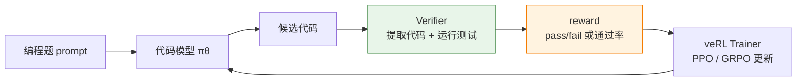

# 16.8 veRL 代码生成 RL 实验

上一节讲 OPD 时，我们把 teacher 当成密集奖励来源。本节回到 RLVR 的路线，换一个更硬的场景：**代码生成**。

代码题和数学题一样有一个关键优势：答案不是靠人主观打分，而是可以运行测试来验证。能通过测试，就给正奖励；不能通过，就给低奖励或零奖励。和数学 RLVR 相比，代码任务的 reward 更硬——不仅看输出对不对，还要把模型生成的代码真正跑起来。

本节用 veRL 在代码生成任务上跑通 PPO 训练。8.7 节已经在 GSM8K 数学题上用过 veRL，本节换到代码题，最大的变化是 reward 函数：数学只需要抽取最终数字做对比，代码必须把模型输出执行一遍。

本节参考了火山引擎的 veRL Code Sandbox 教程[^volcengine-verl-code-sandbox]，具体参考了以下内容：

- **训练配置**：Eurus-2-RL-Data 数据集 + Qwen2.5 系列模型 + PPO（GAE advantage 估计）的整体方案。
- **数据处理**：filter 超长 prompt、随机采样 1000 条训练数据的流程。
- **Reward 设计思路**：格式检查 → 编译/语法检查 → 单元测试的三层验证结构。
- **评测方法与数据**：使用 EvalScope 在 GSM8K、HumanEval、LiveCodeBench 上的评测流程，以及 RL 训练前后的对比数据。

火山引擎原始教程使用 VKE 集群 + SandboxFusion 云沙箱做大规模分布式训练。本节把这些方案适配到**本地 GPU 环境**：用子进程隔离代替云沙箱，用单卡/多卡脚本代替集群部署，保留相同的算法逻辑和参数配置。完整的工业级代码 Agent 实验放在 [10.5 用 rLLM 训练 DeepCoder Agent](../chapter22_agentic/rllm-deepcoder-lab)，那里更关注 AgentFlow 和 sandbox cookbook；本节更关注如何把代码 verifier 接进 veRL 训练框架。



## 为什么代码生成适合 RLVR

普通聊天任务很难定义"正确答案"。同一句回复，可能有人喜欢简洁，有人喜欢详细，Reward Model 也可能被模型钻空子。

代码任务简单很多。比如题目要求写一个 `two_sum(nums, target)`：

```python
def two_sum(nums, target):
    ...
```

我们可以准备测试：

```python
assert two_sum([2, 7, 11, 15], 9) == [0, 1]
assert two_sum([3, 2, 4], 6) == [1, 2]
assert two_sum([3, 3], 6) == [0, 1]
```

模型写得再漂亮，如果测试不过，reward 就低。模型解释得再长，如果没有给出可执行代码，reward 也低。这种反馈比"看起来像正确答案"的文本打分可靠得多。

代码 RLVR 的 reward 通常有三层：

| 层级          | 检查什么                         | 典型 reward |
| ------------- | -------------------------------- | ----------- |
| 格式检查      | 是否提取到代码块、函数名是否存在 | 0.0–0.2     |
| 编译/语法检查 | 能否 import 或执行               | 0.0–0.3     |
| 单元测试      | 通过多少测试用例                 | 0.0–1.0     |

最重要的是第三层。前两层只是让训练早期不至于完全没有信号。

## 环境准备

### 硬件要求

本节配置针对**单张 GPU**（24GB 显存，如 RTX 3090 / 4090 / A5000）或**多卡**环境：

| 模型                     | 参数量 | 训练方案         | 显存需求          |
| ------------------------ | ------ | ---------------- | ----------------- |
| Qwen2.5-Coder-0.5B      | 0.5B   | 全参 + vLLM      | ~18 GB（单卡）    |
| Qwen2.5-Coder-1.5B      | 1.5B   | LoRA + vLLM      | ~20 GB（单卡）    |
| Qwen2.5-Coder-7B        | 7B     | 全参训练         | ~80 GB（A100 单卡或多卡） |

和 8.7 节一样，PPO 需要同时加载 Actor、Critic（可训练）和 Reference（冻结），加上 vLLM 推理引擎，所以显存压力比纯 SFT 大。0.5B 代码模型 + 全参训练是最安全的单卡起点。

### 安装 veRL

如果已经按 8.7 节安装过 veRL，可以跳过。否则：

```bash
# 创建环境
conda create -n verl python==3.10 -y
conda activate verl

# 安装 PyTorch（CUDA 12.x）
pip install torch torchvision --index-url https://download.pytorch.org/whl/cu121

# 安装 veRL
git clone https://github.com/volcengine/verl.git
cd verl
pip install -e .

# 安装 vLLM（推理引擎）
pip install vllm==0.8.3

# 安装 Flash Attention
pip install flash-attn --no-build-isolation
```

### 数据准备

本节使用 [Eurus-2-RL-Data](https://huggingface.co/datasets/PRIME-RL/Eurus-2-RL-Data) 数据集，来自 PRIME-RL 项目，是一个专门为代码强化学习设计的数据集。每条样本包含一道编程题的完整信息：题目描述、函数签名和对应的测试用例。数据集已经分好了 train 和 validation 两个 split。

第一步，下载数据并转为 veRL 要求的 parquet 格式：

```python
# download_data.py
from datasets import load_dataset
from pathlib import Path

output_dir = Path.home() / "data" / "eurus2"
output_dir.mkdir(parents=True, exist_ok=True)

ds = load_dataset("PRIME-RL/Eurus-2-RL-Data")

for split in ["train", "validation"]:
    df = ds[split].to_pandas()
    df.to_parquet(output_dir / f"{split}.parquet")
    print(f"{split}: {len(df)} 条样本，字段: {list(df.columns)}")
```

下载完成后，`~/data/eurus2/` 下会生成两个文件。先看一下数据长什么样：

```python
import pandas as pd

df = pd.read_parquet("~/data/eurus2/train.parquet")
print(f"训练集总条数: {len(df)}")
print(f"字段列表: {list(df.columns)}")
print(f"prompt 平均长度: {df['prompt'].str.len().mean():.0f}")
print(f"prompt 最大长度: {df['prompt'].str.len().max():.0f}")

# 看一条样本
example = df.iloc[0]
print(f"\n=== 样本 0 ===")
print(f"prompt:\n{example['prompt'][:500]}...")
print(f"\ntests:\n{str(example.get('tests', ''))[:300]}...")
```

第二步，处理数据。Eurus-2-RL-Data 的部分样本 prompt 非常长（超过 `max_prompt_length=512`），如果不做 filter，这些样本会被截断或报错。参考火山引擎教程的做法，过滤超长样本后随机采样 1000 条：

```python
# prepare_data.py — 过滤超长样本 + 随机采样
import pandas as pd
from pathlib import Path

data_dir = Path.home() / "data" / "eurus2"

df = pd.read_parquet(data_dir / "train.parquet")
print(f"原始训练集: {len(df)} 条")

# 过滤 prompt 超过 512 token 的样本
# 1 token ≈ 4 字符
MAX_PROMPT_CHARS = 512 * 4
df = df[df["prompt"].str.len() < MAX_PROMPT_CHARS]
print(f"过滤超长 prompt 后: {len(df)} 条")

# 随机采样 1000 条（设置 random_state 确保可复现）
n_samples = min(1000, len(df))
subset_df = df.sample(n=n_samples, random_state=42)
subset_df.to_parquet(data_dir / "train1000.parquet")
print(f"已保存 {len(subset_df)} 条样本到 train1000.parquet")
```

处理完成后，`train1000.parquet` 就是我们的训练数据。数据里的每条样本至少包含：

| 字段           | 含义                                 | 示例                                        |
| -------------- | ------------------------------------ | ------------------------------------------- |
| `prompt`       | 题目描述和输出格式要求               | "Write a function `two_sum(nums, target)`…" |
| `entry_point`  | 需要实现的函数名                     | `"two_sum"`                                 |
| `tests`        | 可执行测试用例（Python assert 语句） | `assert two_sum([2,7,11,15], 9) == [0,1]`   |
| `ground_truth` | 可选，代码任务通常不直接用           | —                                           |

训练时模型只看到 `prompt`，reward 函数拿到模型回答后再调用 `tests` 做验证。这就是代码 RLVR 的核心——**reward 函数不评价文字风格，只评价代码能否跑通测试**。

## Reward 函数设计

8.7 节的 GSM8K reward 只需要从模型输出中提取最终数字，做一次数值比较。代码任务完全不同：需要从 markdown 中提取代码块，放到隔离环境中执行测试，处理编译错误、运行异常和超时。

这是本节和 8.7 节最大的工程差异。下面逐模块讲解 reward 函数的设计。

### 从模型输出中提取代码

模型的输出通常是一段包含解释和代码的 markdown 文本。我们需要从中提取出 Python 代码部分：

```python
import re


def extract_code(response: str) -> str:
    """从模型输出中提取 Python 代码块。

    模型通常输出类似这样的文本：
        "这道题用哈希表解决：\n```python\ndef two_sum(nums, target):\n    ..."
    我们只需要 ```python 和 ``` 之间的部分。
    如果模型没有用代码块格式输出，则把整个回答当作代码（兜底）。
    """
    match = re.search(r"```(?:python)?\n(.*?)```", response, re.DOTALL)
    if match:
        return match.group(1).strip()
    return response.strip()
```

如果模型没按格式输出代码块，`extract_code` 会把整个回答当作代码返回——但这通常会导致语法错误，reward 为 0。这本身就是一种训练信号，迫使模型学会用正确的格式输出代码。

### 在隔离环境中运行测试

提取到代码后，下一步是运行测试。这里有一个关键的安全问题：模型生成的代码可能包含死循环、文件操作、网络请求等危险操作。不能直接在主进程中 `exec`，否则一条 `while True: pass` 就能让整个训练卡死。

解决方案是用 `multiprocessing.Process` 在子进程中执行，配合超时机制：

```python
import multiprocessing as mp


def run_tests(code: str, tests: str, queue: mp.Queue) -> None:
    """在独立进程中执行代码和测试。

    流程：
    1. exec(code, namespace) — 执行模型生成的代码，定义函数
    2. exec(tests, namespace) — 执行测试用例，调用断言
    3. 如果全部通过，通过 queue 传回 passed=True
    4. 如果任何步骤出错，传回错误信息

    注意：这里用 exec 而不是 subprocess，是因为我们需要在 Python
    层面直接操作 namespace，而不是通过文件或命令行。代价是隔离性
    不如 Docker 容器，但对训练实验够用。
    """
    namespace = {}
    try:
        exec(code, namespace)
        exec(tests, namespace)
        queue.put({"passed": True, "error": ""})
    except Exception as exc:
        queue.put({"passed": False, "error": repr(exc)})
```

### 组合成完整的评分函数

有了提取和执行，组合起来就是完整的评分函数：

```python
def score_code(response: str, tests: str, timeout_s: float = 3.0) -> float:
    """对模型输出评分：提取代码 → 运行测试 → 返回分数。

    返回 0/1 二值 reward：测试全过=1.0，否则=0.0。
    如果 3 秒内没有执行完（死循环），强制 kill 并返回 0。
    """
    code = extract_code(response)

    # 第一层 reward：格式检查
    if not code:
        return 0.0

    # 创建子进程执行
    queue = mp.Queue()
    process = mp.Process(target=run_tests, args=(code, tests, queue))
    process.start()
    process.join(timeout=timeout_s)

    # 超时处理：kill 子进程
    if process.is_alive():
        process.kill()
        process.join()
        return 0.0

    if queue.empty():
        return 0.0

    result = queue.get()
    return 1.0 if result["passed"] else 0.0
```

超时设为 3 秒。大部分 LeetCode 级别的函数实现都能在 1 秒内完成，3 秒已经留了余量。如果超时，说明模型可能写了死循环或极其低效的代码，直接返回 0 分。

### 包装成 veRL 的 reward 接口

veRL 的 reward 函数需要遵循统一的接口规范。`compute_score` 是 veRL 调用的入口函数：

```python
from typing import Any


def compute_score(reward_input: dict[str, Any], **kwargs) -> dict[str, float]:
    """veRL reward 入口函数。

    veRL 会自动传入 reward_input 字典，包含：
    - response: 模型生成的完整回答
    - extra_info: 数据集中的附加信息（包含 tests 字段）
    - ground_truth: 标准答案（代码任务通常不用）

    返回字典中：
    - overall: PPO 使用的总奖励
    - pass_rate: 测试通过率（用于日志分析）
    - format: 是否提取到代码（用于日志分析）
    """
    response = reward_input["response"]
    extra_info = reward_input.get("extra_info", {})
    tests = extra_info.get("tests", "")

    score = score_code(response, tests)
    return {
        "overall": score,
        "pass_rate": score,
        "format": 1.0 if extract_code(response) else 0.0,
    }
```

### 完整代码

把上面四步合在一起就是完整的 reward 文件：

```python
# code_reward.py
# 代码生成 RLVR 的 reward 函数
# veRL 通过 custom_reward_function 配置加载

import multiprocessing as mp
import re
from typing import Any

REWARD_NAME = "code_rlvr"
REWARD_TYPE = "sequential"


def extract_code(response: str) -> str:
    """从模型输出中提取 Python 代码块。"""
    match = re.search(r"```(?:python)?\n(.*?)```", response, re.DOTALL)
    if match:
        return match.group(1).strip()
    return response.strip()


def run_tests(code: str, tests: str, queue: mp.Queue) -> None:
    """在独立进程中执行代码和测试。"""
    namespace = {}
    try:
        exec(code, namespace)
        exec(tests, namespace)
        queue.put({"passed": True, "error": ""})
    except Exception as exc:
        queue.put({"passed": False, "error": repr(exc)})


def score_code(response: str, tests: str, timeout_s: float = 3.0) -> float:
    """对模型输出评分：提取代码 → 运行测试 → 返回分数。"""
    code = extract_code(response)

    if not code:
        return 0.0

    queue = mp.Queue()
    process = mp.Process(target=run_tests, args=(code, tests, queue))
    process.start()
    process.join(timeout=timeout_s)

    if process.is_alive():
        process.kill()
        process.join()
        return 0.0

    if queue.empty():
        return 0.0

    result = queue.get()
    return 1.0 if result["passed"] else 0.0


def compute_score(reward_input: dict[str, Any], **kwargs) -> dict[str, float]:
    """veRL reward 入口。"""
    response = reward_input["response"]
    extra_info = reward_input.get("extra_info", {})
    tests = extra_info.get("tests", "")

    score = score_code(response, tests)
    return {
        "overall": score,
        "pass_rate": score,
        "format": 1.0 if extract_code(response) else 0.0,
    }
```

这个 reward 函数的核心思想是：**不评价文字风格，只评价代码能否跑通测试**。模型写了再长的解释，如果代码跑不通，reward 就是 0。这种硬信号比 RM 的软分数可靠得多。

## Prompt 模板

训练代码模型时，prompt 要尽量约束输出格式。早期不要让模型自由写长解释，否则 verifier 需要花很多精力抽取代码。

````text
You are a competitive programming assistant.

Solve the following problem in Python.
Return only one Python code block.

Function name: {entry_point}

Problem:
{problem_statement}

Your answer:
```python
```
````

如果要训练 Chat 模型，可以把系统提示和用户题目分开；如果要训练 base coder，则可以直接拼成纯文本 prompt。关键是保持训练和评测模板一致。

## 单卡训练脚本

基于 8.7 节的 veRL PPO 脚本结构，适配代码生成任务。整体框架不变，关键差异有三处：数据集换成 Eurus-2-RL-Data、reward 函数换成代码验证、`max_response_length` 从 256 增大到 512（代码回答通常比数学推理更长）。

脚本的设计思路和 8.7 节完全一致：所有参数通过环境变量设置默认值，需要调整时不用改脚本，直接在命令行覆盖就行。

```bash
#!/bin/bash
# run_qwen_coder_ppo_single_gpu.sh
# PPO | Eurus-2 代码生成 | 单卡 | Qwen2.5-Coder-0.5B

set -xeuo pipefail

# ==================== 可调参数 ====================
# Qwen2.5-Coder 是代码专用变体，比通用 Instruct 更适合代码任务
MODEL_PATH=${MODEL_PATH:-Qwen/Qwen2.5-Coder-0.5B-Instruct}
CRITIC_MODEL_PATH=${CRITIC_MODEL_PATH:-$MODEL_PATH}  # Critic 从同一模型初始化

# 硬件设置
NNODES=${NNODES:-1}
NDEVICES_PER_NODE=${NDEVICES_PER_NODE:-1}

# 训练参数
# batch_size=128 表示每步从 128 个 prompt 中采样回答
# mini_batch=64 表示 PPO 更新时分 2 个 mini-batch（128/64）
TRAIN_BATCH_SIZE=${TRAIN_BATCH_SIZE:-128}
PPO_MINI_BATCH_SIZE=${PPO_MINI_BATCH_SIZE:-64}

# 序列长度
# 代码任务的 max_response_length 需要比 GSM8K 大（512 vs 256）
# 因为一个函数实现通常比一道数学题的推理过程更长
MAX_PROMPT_LENGTH=${MAX_PROMPT_LENGTH:-512}
MAX_RESPONSE_LENGTH=${MAX_RESPONSE_LENGTH:-512}

# 学习率
# Actor lr 比 Critic lr 小一个量级，这是 PPO 的常见实践
# Actor 需要保守更新，Critic 需要快速学会 value function
ACTOR_LR=${ACTOR_LR:-1e-6}
CRITIC_LR=${CRITIC_LR:-1e-5}

# 推理参数
# vLLM 张量并行度，单卡=1
ROLLOUT_TP=${ROLLOUT_TP:-1}
# vLLM 预分配显存比例，单卡需要和训练模型共享显存
ROLLOUT_GPU_MEM_UTIL=${ROLLOUT_GPU_MEM_UTIL:-0.4}
# 每个 prompt 生成几条回答（PPO 组大小）
ROLLOUT_N=${ROLLOUT_N:-1}

# 训练控制
TOTAL_EPOCHS=${TOTAL_EPOCHS:-20}
SAVE_FREQ=${SAVE_FREQ:-20}
TEST_FREQ=${TEST_FREQ:-5}

# 数据路径
TRAIN_FILE=${TRAIN_FILE:-$HOME/data/eurus2/train1000.parquet}
VAL_FILE=${VAL_FILE:-$HOME/data/eurus2/validation.parquet}

EXPERIMENT_NAME=${EXPERIMENT_NAME:-coder_ppo_eurus2_$(date +%Y%m%d_%H%M)}
# ==================== 可调参数结束 ====================

# ---- 数据配置 ----
# filter_overlong_prompts=True: 过滤超过 max_prompt_length 的样本
# truncation='error': 超长样本直接报错而不是截断，防止训练数据被静默截断
DATA=(
    algorithm.adv_estimator=gae
    data.train_files="['$TRAIN_FILE']"
    data.val_files="['$VAL_FILE']"
    data.train_batch_size=${TRAIN_BATCH_SIZE}
    data.max_prompt_length=${MAX_PROMPT_LENGTH}
    data.max_response_length=${MAX_RESPONSE_LENGTH}
    data.filter_overlong_prompts=True
    data.truncation='error'
)

# ---- 模型配置 ----
# enable_gradient_checkpointing=True: 用时间换显存，单卡必备
# use_remove_padding=True: 去掉 padding token 的冗余计算
MODEL=(
    actor_rollout_ref.model.path="$MODEL_PATH"
    actor_rollout_ref.model.use_remove_padding=True
    actor_rollout_ref.model.enable_gradient_checkpointing=True
)

# ---- Actor 配置 ----
# clip_ratio=0.2: PPO 标准裁剪范围，限制策略更新幅度
# param_offload=False: 单卡不开启参数卸载（卸载到 CPU 更慢）
ACTOR=(
    actor_rollout_ref.actor.optim.lr=${ACTOR_LR}
    actor_rollout_ref.actor.ppo_mini_batch_size=${PPO_MINI_BATCH_SIZE}
    actor_rollout_ref.actor.use_dynamic_bsz=True
    actor_rollout_ref.actor.ppo_max_token_len_per_gpu=16384
    actor_rollout_ref.actor.clip_ratio=0.2
    actor_rollout_ref.actor.fsdp_config.param_offload=False
    actor_rollout_ref.actor.fsdp_config.optimizer_offload=False
)

# ---- Rollout 配置 ----
# name=vllm: 使用 vLLM 做 continuous batching 推理
# gpu_memory_utilization=0.4: vLLM 只用 40% 显存，剩下的给训练
ROLLOUT=(
    actor_rollout_ref.rollout.name=vllm
    actor_rollout_ref.rollout.tensor_model_parallel_size=${ROLLOUT_TP}
    actor_rollout_ref.rollout.gpu_memory_utilization=${ROLLOUT_GPU_MEM_UTIL}
    actor_rollout_ref.rollout.n=${ROLLOUT_N}
)

# ---- Reference 配置 ----
# param_offload=True: Reference 是冻结的，可以卸载到 CPU 省显存
REF=(
    actor_rollout_ref.ref.log_prob_use_dynamic_bsz=True
    actor_rollout_ref.ref.log_prob_max_token_len_per_gpu=16384
    actor_rollout_ref.ref.fsdp_config.param_offload=True
)

# ---- Critic 配置 ----
# Critic 学习率比 Actor 高一个量级（1e-5 vs 1e-6）
# Critic 需要快速收敛才能给 Actor 提供准确的 advantage 估计
CRITIC=(
    critic.model.path="$CRITIC_MODEL_PATH"
    critic.model.use_remove_padding=True
    critic.model.enable_gradient_checkpointing=True
    critic.optim.lr=${CRITIC_LR}
    critic.use_dynamic_bsz=True
    critic.ppo_max_token_len_per_gpu=16384
    critic.fsdp.param_offload=False
    critic.fsdp.optimizer_offload=False
)

# ---- Trainer 配置 ----
TRAINER=(
    trainer.balance_batch=True
    trainer.critic_warmup=0
    trainer.logger='["console","wandb"]'
    trainer.project_name=verl_ppo_code
    trainer.experiment_name=${EXPERIMENT_NAME}
    trainer.n_gpus_per_node=${NDEVICES_PER_NODE}
    trainer.nnodes=${NNODES}
    trainer.save_freq=${SAVE_FREQ}
    trainer.test_freq=${TEST_FREQ}
    trainer.total_epochs=${TOTAL_EPOCHS}
)

# ---- 启动训练 ----
python3 -m verl.trainer.main_ppo \
    "${DATA[@]}" \
    "${MODEL[@]}" \
    "${ACTOR[@]}" \
    "${ROLLOUT[@]}" \
    "${REF[@]}" \
    "${CRITIC[@]}" \
    "${TRAINER[@]}" \
    "$@"
```

### 配置解读

和 8.7 节 GSM8K 的 PPO 配置相比，几个关键差异：

| 配置项                    | GSM8K（8.7 节） | 代码生成（本节） | 原因                                   |
| ------------------------- | --------------- | ---------------- | -------------------------------------- |
| 数据集                    | GSM8K 数学题    | Eurus-2-RL-Data  | 代码任务需要函数签名和测试用例         |
| reward 函数               | `gsm8k_reward`  | `code_reward`    | 代码需要提取 + 执行 + 测试             |
| `max_response_length`     | 256             | 512              | 代码回答通常比数学推理更长             |
| 基座模型                  | Qwen2.5-0.5B    | Qwen2.5-Coder    | 代码生成用 coder 变体效果更好          |

其他参数（学习率、clip_ratio、GAE 等）和 8.7 节保持一致——它们是 PPO 的算法参数，不随任务类型变化。

### 和 8.7 节四模型结构的对应

和 8.7 节一样，PPO 训练涉及四个模型角色：

| 8.7 节角色 | 本节对应                          | 说明                               |
| ---------- | --------------------------------- | ---------------------------------- |
| Actor      | `actor_rollout_ref.actor.*`       | 可训练策略，生成候选代码并更新     |
| Reference  | `actor_rollout_ref.ref.*`         | 冻结的 SFT 模型，计算 KL 约束      |
| Critic     | `critic.*`                        | 可训练价值函数，GAE 估计 advantage |
| RM/Reward  | `code_reward.py:compute_score`    | 代码验证：提取 + 执行 + 测试       |

关键区别是最后一行：8.7 节用数学答案匹配（抽取数字做数值比较），本节用代码执行验证（提取代码 → 子进程运行 → 断言测试）。reward 信号都是 0/1 二值，但代码 reward 的工程复杂度更高。

## 启动训练

### 直接运行脚本

```bash
chmod +x run_qwen_coder_grpo_single_gpu.sh
bash run_qwen_coder_grpo_single_gpu.sh
```

### 通过环境变量覆盖参数

```bash
# 换用 1.5B coder 模型
MODEL_PATH=Qwen/Qwen2.5-Coder-1.5B-Instruct \
TRAIN_BATCH_SIZE=64 \
PPO_MINI_BATCH_SIZE=16 \
bash run_qwen_coder_grpo_single_gpu.sh
```

```bash
# 多卡扩展（8 卡）
NNODES=1 NDEVICES_PER_NODE=8 \
TRAIN_BATCH_SIZE=1024 \
PPO_MINI_BATCH_SIZE=256 \
ROLLOUT_TP=2 \
bash run_qwen_coder_grpo_single_gpu.sh
```

Ray 会在 `main_ppo` 内自动初始化。单卡场景下，所有 worker 在同一张 GPU 上交替执行；多卡时 Ray 自动分配，不需要手动管理集群。

### 训练输出

训练开始后，终端会输出关键指标：

```
[Step 1]  train | reward/overall=0.03 | reward/pass_rate=0.03 | reward/format=0.15 | kl=0.000
[Step 5]  val   | reward/overall=0.08 | reward/pass_rate=0.08
[Step 6]  train | reward/overall=0.12 | reward/pass_rate=0.12 | reward/format=0.45 | kl=0.002
[Step 10] val   | reward/overall=0.21 | reward/pass_rate=0.21
```

注意 `format` 指标通常比 `pass_rate` 先上升——模型先学会"按格式输出代码块"，然后才逐渐学会"写出能通过测试的代码"。这是代码 RLVR 的典型训练动态。

## 训练指标分析

### 关键指标解读

| 指标              | 健康信号               | 危险信号              |
| ----------------- | ---------------------- | --------------------- |
| `reward/pass_rate`| 缓慢上升               | 长期为 0 或突然暴涨   |
| `reward/format`   | 先于 pass_rate 上升    | 一直很低（模型不输出代码） |
| `kl`              | 缓慢增长               | 持续飙升              |
| `actor_loss`      | 在 0.5~1.0 之间波动    | 爆炸到 >10 或 NaN     |
| `response_length` | 稳定或略微增长         | 和 reward 同步暴涨    |

### 代码 RLVR 的典型训练曲线

**阶段 1：学格式（step 1~10）**。`pass_rate` 接近 0，但 `format` 开始上升。模型正在学会"把代码放在 \`\`\`python 代码块里输出"，但写出来的代码大部分还跑不通。`kl` 接近 0。

**阶段 2：学写代码（step 10~40）**。`pass_rate` 开始稳步上升。模型已经稳定输出代码格式，开始学会写能编译的代码，然后是能通过部分测试的代码。这个阶段是 PPO 最有效的窗口。

**阶段 3：边际收益递减（step 40+）**。`pass_rate` 增速放缓。剩余的错误通常是因为模型能力天花板——题目本身太难，模型参数量不够。

### 参考评测结果

以下是基于火山引擎官方实验（Qwen2.5-7B-Instruct-1M，Eurus-2-RL-Data 约 1000 条训练数据，130 steps PPO）的评测数据[^volcengine-verl-code-sandbox]，使用 [EvalScope](https://github.com/modelscope/evalscope) 在三个 benchmark 上评测：

| 模型                                      | GSM8K | HumanEval | LiveCodeBench |
| ----------------------------------------- | ----- | --------- | ------------- |
| Qwen2.5-7B-Instruct-1M（原始）            | 0.82  | 0.59      | 0.50          |
| Qwen2.5-7B-Instruct-1M-step130（RL 后）   | 0.83  | 0.59      | 0.53          |

可以看到：

- **LiveCodeBench 提升最明显**（0.50 → 0.53），这是代码能力的直接体现——RL 训练让模型在动态编程题上表现更好。
- **GSM8K 小幅提升**（0.82 → 0.83），说明代码 RL 训练也有一定的数学推理迁移效果。
- **HumanEval 保持不变**（0.59），这个 benchmark 的题目相对固定，1000 条训练数据的覆盖范围有限。

经过 RL 训练后，模型数学推理步骤逻辑更加清晰，语言更简洁，更能按提示词要求输出答案格式。理论上增加训练步数和使用更多训练数据，还有进一步提升空间。

> **注意**：上表数据来自火山引擎官方在多 GPU 环境上的实验结果。本节的单卡脚本模型更小、训练步数更少，具体数值会有差异，但训练动态和趋势一致。

## 模型评测

训练完成后，对 checkpoint 做独立评测，确认 PPO 训练确实带来了能力提升。

### Checkpoint 合并

veRL 使用 FSDP 训练，保存的 checkpoint 是按 GPU 分片的。需要合并为标准 HuggingFace 格式：

```bash
python scripts/model_merger.py merge \
    --backend fsdp \
    --local_dir /path/to/checkpoints/global_step_20/actor \
    --target_dir ./merged_model
```

### EvalScope 评测

使用 [EvalScope](https://github.com/modelscope/evalscope) 做独立评测：

```bash
# 安装 EvalScope
pip install evalscope

# 评测代码能力（HumanEval + LiveCodeBench）
evalscope eval \
    --model ./merged_model \
    --datasets humaneval livecodebench \
    --limit 100

# 评测数学推理（作为对照）
evalscope eval \
    --model ./merged_model \
    --datasets gsm8k \
    --limit 100
```

评估时注意：

- **使用 test 集**：不能用在训练集上评测，否则分数虚高。
- **对比 baseline**：同时评测 RL 前的原始模型，才能量化 PPO 带来的真实提升。
- **多 benchmark 对照**：只看 HumanEval 不够，LiveCodeBench 更能反映代码模型的实际能力。

## 从单卡扩展到多卡

理解了单卡配置后，扩展到多卡只需要修改几个关键参数：

| 参数                    | 单卡 | 8 卡 | 说明                                 |
| ----------------------- | ---- | ---- | ------------------------------------ |
| `NDEVICES_PER_NODE`     | 1    | 8    | GPU 数量                             |
| `TRAIN_BATCH_SIZE`      | 128  | 1024 | 总 batch（FSDP 自动切分到各卡）      |
| `PPO_MINI_BATCH_SIZE`   | 64   | 256  | 同上                                 |
| `ROLLOUT_TP`            | 1    | 2    | vLLM 张量并行度                      |
| `ROLLOUT_GPU_MEM_UTIL`  | 0.4  | 0.6  | 多卡时每卡可以多用一点               |

学习率、clip_ratio、GAE 参数等**不需要改**——它们是算法参数，不随硬件规模变化。

## 和 10.5 DeepCoder 实验的关系

本节和 [10.5](../chapter22_agentic/rllm-deepcoder-lab) 讲的是同一个大方向：用 sandbox reward 训练代码模型。区别在于关注点不同：

| 小节     | 框架 | 重点                                       |
| -------- | ---- | ------------------------------------------ |
| 9.7 本节 | veRL | 把代码 verifier 接进 PPO/GRPO 训练框架     |
| 10.5     | rLLM | 用 DeepCoder cookbook 跑完整 Agentic 实验  |

如果你想先跑通一个端到端案例，优先看 10.5。如果你已经熟悉 veRL，想把数学 RLVR 扩展到代码任务，就沿着本节的 data、reward、trainer 三个接口补齐。

## 实验检查清单

正式训练前，至少检查这些点：

- 测试集不能出现在训练数据里。
- reward 函数必须设置超时，避免死循环卡住 rollout。
- reward 日志要记录三类错误：编译失败、运行失败、测试失败。
- 不要只看训练 reward，要固定一份独立 eval set 看 Pass@1。
- 如果加入格式奖励，权重不要超过测试通过奖励。

代码生成 RL 的好处是反馈硬、可复现；难点是工程边界更复杂。把 verifier 写稳，比调 PPO/GRPO 超参更重要。

[^volcengine-verl-code-sandbox]: 火山引擎，"veRL Code Sandbox 代码生成强化学习"，https://www.volcengine.com/docs/6460/1756203
