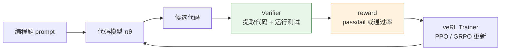

# 15.8 动手：使用 veRL 训练代码生成

> **本节目标**：把代码执行验证器接入 veRL，用测试通过率训练代码模型，并完成数据准备、沙箱检查、PPO 训练和训练前后评测。

> **学习路径**：[15.3 RLVR 奖励](./rlvr) → [13.8 veRL 训练 GSM8K](../chapter15_rlhf/verl-ppo-gsm8k) → **15.8 veRL 训练代码生成**

> **本节代码与资源**：[数据准备](https://github.com/walkinglabs/hands-on-modern-rl/blob/main/code/chapter18_grpo/verl_code_rlvr/prepare_data.py) · [代码奖励](https://github.com/walkinglabs/hands-on-modern-rl/blob/main/code/chapter18_grpo/verl_code_rlvr/code_reward.py) · [单卡训练脚本](https://github.com/walkinglabs/hands-on-modern-rl/blob/main/code/chapter18_grpo/verl_code_rlvr/run_qwen_coder_ppo_single_gpu.sh)

13.8 节已经用 veRL 训练数学模型，只需抽取最终数字并与标准答案比较。代码任务多了一步：模型生成的程序必须进入隔离环境，经过语法检查、执行和单元测试，测试通过率再变成奖励。下面沿用同一套 veRL 训练框架，只替换数据处理和奖励链路。

本节参考了火山引擎的 veRL Code Sandbox 教程[^volcengine-verl-code-sandbox]，具体参考了以下内容：

- **训练配置**：Eurus-2-RL-Data 数据集（仅 code 样本）+ Qwen2.5 系列模型 + PPO（GAE advantage 估计）的整体方案。
- **数据处理**：filter 超长 prompt、随机采样 1000 条训练数据的流程。
- **Reward 设计思路**：把模型生成的代码当独立程序，跑 stdin/stdout 测试算通过率（详见下文 Reward 函数设计）。
- **评测方法与数据**：使用 EvalScope 在 GSM8K、HumanEval、LiveCodeBench 上的评测流程，以及 RL 训练前后的对比数据。

火山引擎原始教程使用 VKE 集群 + SandboxFusion 云沙箱做大规模分布式训练。本节用本地子进程演示 reward 接线，再用单卡/多卡脚本替代集群部署。子进程只隔离解释器状态，无法代替安全沙箱；运行训练前仍要把任务放进最小权限的容器或虚拟机。完整的工业级代码 Agent 实验放在 [19.8 用 rLLM 训练 DeepCoder Agent](../chapter22_agentic/rllm-deepcoder-lab)，那里更关注 AgentFlow 和 sandbox cookbook；本节更关注如何把代码 verifier 接进 veRL 训练框架。


```mermaid
flowchart LR
    P["编程题 prompt"] --> M["代码模型 πθ"]
    M --> C["候选代码"]
    C --> S["Verifier\n提取代码 + 运行测试"]
    S --> R["reward\npass/fail 或通过率"]
    R --> T["veRL Trainer\nPPO / GRPO 更新"]
    T --> M

    style S fill:#e8f5e9,stroke:#2e7d32
    style R fill:#fff3e0,stroke:#f57c00
```

## 15.8.1 为什么代码生成适合 RLVR

普通聊天任务很难定义"正确答案"。同一句回复，可能有人喜欢简洁，有人喜欢详细，Reward Model 也可能被模型钻空子。

代码任务可以由测试程序给出明确反馈。比如题目要求写一个 `two_sum(nums, target)`：

```python
def two_sum(nums, target):
    ...
```

我们可以准备测试：

```python
assert two_sum([2, 7, 11, 15], 9) == [0, 1]
assert two_sum([3, 2, 4], 6) == [1, 2]
assert two_sum([3, 3], 6) == [0, 1]
```

模型写得再漂亮，如果测试不过，reward 就低。模型解释得再长，如果没有给出可执行代码，reward 也低。这种反馈比"看起来像正确答案"的文本打分可靠得多。

代码 RLVR 的 reward 通常有三层：

| 层级          | 检查什么                         | 典型 reward |
| ------------- | -------------------------------- | ----------- |
| 格式检查      | 是否提取到代码块、函数名是否存在 | 0.0–0.2     |
| 编译/语法检查 | 能否 import 或执行               | 0.0–0.3     |
| 单元测试      | 通过多少测试用例                 | 0.0–1.0     |

最重要的是第三层。前两层只是让训练早期不至于完全没有信号。

## 15.8.2 环境准备

### 硬件要求

本节配置针对**单张 GPU**（24GB 显存，如 RTX 3090 / 4090 / A5000）或**多卡**环境：

| 模型               | 参数量 | 训练方案    | 显存需求                  |
| ------------------ | ------ | ----------- | ------------------------- |
| Qwen2.5-Coder-0.5B | 0.5B   | 全参 + vLLM | ~18 GB（单卡）            |
| Qwen2.5-Coder-1.5B | 1.5B   | LoRA + vLLM | ~20 GB（单卡）            |
| Qwen2.5-Coder-7B   | 7B     | 全参训练    | ~80 GB（A100 单卡或多卡） |

和 13.8 节一样，PPO 需要同时加载 Actor、Critic（可训练）和 Reference（冻结），加上 vLLM 推理引擎，所以显存压力比纯 SFT 大。0.5B 代码模型 + 全参训练是最安全的单卡起点。

### 安装 veRL

如果已经按 13.8 节安装过 veRL，可以跳过。否则：

```bash
# 创建环境
conda create -n verl python==3.10 -y
conda activate verl

# 安装 PyTorch（CUDA 12.x）
pip install torch torchvision --index-url https://download.pytorch.org/whl/cu121

# 安装 veRL
git clone https://github.com/volcengine/verl.git
cd verl
pip install -e .

# 安装 vLLM（推理引擎）
pip install vllm==0.8.3

# 安装 Flash Attention
pip install flash-attn --no-build-isolation
```

### 数据准备

本节使用 [Eurus-2-RL-Data](https://huggingface.co/datasets/PRIME-RL/Eurus-2-RL-Data) 数据集，来自 PRIME-RL 项目，是一个专门为强化学习设计的**数学 + 代码**推理数据集。

> **注意（issue #53）**：Eurus-2-RL-Data **没有** `entry_point`、`tests` 这类顶层字段。它的真实结构是 veRL 原生格式，验证信息存在 `reward_model` 列里：
>
> | 字段           | 含义                                                                                                                                                 |
> | -------------- | ---------------------------------------------------------------------------------------------------------------------------------------------------- |
> | `prompt`       | chat 消息数组：`[{"role":"system",...}, {"role":"user",...}]`。system 是 PRIME 推理动作模板（`[ASSESS]`/`[ADVANCE]`/…），user 才是题目               |
> | `ability`      | `"math"` 或 `"code"`，本实验只取 `code`                                                                                                              |
> | `reward_model` | `{"ground_truth": <答案>, "style": "rule"}`。code 样本的 `ground_truth` 是 JSON 字符串 `{"inputs": [...], "outputs": [...]}`，即 stdin/stdout 测试对 |
> | `data_source`  | 题目来源：`codecontests` / `taco` / `apps` / `codeforces`                                                                                            |
> | `extra_info`   | `{"index": ..., "split": ...}`                                                                                                                       |

也就是说，这些 code 样本是**"读 stdin、写 stdout"的竞赛编程题**，不是"实现某个函数签名"的题目——所以没有 `entry_point`，测试也不是 assert 语句，而是输入输出对。reward 函数要把模型生成的代码当独立程序运行，喂入输入、比对输出。

数据集已分好 split：train 48 万条（其中 `ability=="code"` 2.5 万条），validation 2048 条（其中 code 1024 条）。

处理数据的脚本见 [code/chapter18_grpo/verl_code_rlvr/prepare_data.py](https://github.com/walkinglabs/hands-on-modern-rl/blob/main/code/chapter18_grpo/verl_code_rlvr/prepare_data.py)，一键生成 veRL 需要的 parquet：

```bash
conda activate test
python code/chapter18_grpo/verl_code_rlvr/prepare_data.py
```

脚本做的事：

1. **过滤 code 样本**：`ability == "code"`，得到 2.5 万条代码题。
2. **重建 prompt**：去掉 system 消息里的 PRIME 推理动作模板（对代码生成没有意义），只保留 user 的题目，重建为 **chat 消息格式** `[{"role":"system","content":"You are a competitive programming assistant."}, {"role":"user","content":"读 stdin 写 stdout 指令 + 题目"}]`。⚠️ 不要用纯文本字符串——veRL 会对 prompt 做 `apply_chat_template`，字符串会被丢弃（见下方字段表注意事项）。
3. **过滤 + 采样**：过滤 prompt 超过 512 token 的样本（1 token ≈ 4 字符），然后随机采样 1000 条，存为 `~/data/eurus2/train1000.parquet`；validation 直接存为 `~/data/eurus2/validation.parquet`。

处理完成后，`train1000.parquet` 的列就是 veRL 原生格式：

| 字段           | 含义                                               | 示例                                                                                                                          |
| -------------- | -------------------------------------------------- | ----------------------------------------------------------------------------------------------------------------------------- |
| `prompt`       | **chat 消息列表**（system 指令 + user 题目）       | `[{"role":"system","content":"You are a competitive programming assistant."}, {"role":"user","content":"Read the problem…"}]` |
| `reward_model` | `{"ground_truth": I/O 测试 JSON, "style": "rule"}` | `'{"inputs": [...], "outputs": [...]}'`                                                                                       |
| `data_source`  | 题目来源                                           | `"codecontests"` / `"taco"` / `"apps"`                                                                                        |
| `ability`      | `"code"`                                           | `"code"`                                                                                                                      |
| `extra_info`   | `{index, split}`                                   | `{"index": 0, "split": "dummy"}`                                                                                              |

> **为什么 prompt 必须是 chat 消息格式，而不是纯文本？** veRL 的 RLHFDataset 会把 `prompt` 交给模型的 `apply_chat_template`。如果 `prompt` 是纯字符串，Qwen 的模板会直接丢弃内容，只生成 system + assistant 两个特殊 token（实测只有 24 个 token），模型根本看不到题目、reward 恒为 0。所以 `prepare_data.py` 重建 prompt 时用的是 `[{"role": "system", ...}, {"role": "user", ...}]` 结构。

训练时模型只看到 `prompt`，veRL 会把 `reward_model.ground_truth` 传给 reward 函数做验证。这就是代码 RLVR 的核心——**reward 函数不评价文字风格，只评价代码能否跑通测试**。

## 15.8.3 Reward 函数设计

13.8 节的 GSM8K reward 只需要从模型输出中提取最终数字，做一次数值比较。代码任务完全不同：需要从 markdown 中提取代码块，放到隔离环境中执行测试，处理编译错误、运行异常和超时。

这是本节和 13.8 节最大的工程差异。下面逐模块讲解 reward 函数的设计。

### 从模型输出中提取代码

模型的输出通常是一段包含解释和代码的 markdown 文本。我们需要从中提取出 Python 代码部分：

````python
import re

_CODE_BLOCK_RE = re.compile(r"```(?:python)?\n(.*?)```", re.DOTALL)


def extract_code(response: str) -> str:
    """从模型输出中提取 Python 代码块。

    模型通常输出类似这样的文本：
        "```python\nimport sys\n\nfor line in sys.stdin: ...```"
    我们只需要 ```python 和 ``` 之间的部分。
    如果模型没有用代码块格式输出，则把整个回答当作代码（兜底）。
    """
    match = _CODE_BLOCK_RE.search(response)
    if match:
        return match.group(1).strip()
    return response.strip()
````

如果模型没按格式输出代码块，`extract_code` 会把整个回答当作代码返回——但这通常会导致语法错误，reward 为 0。这本身就是一种训练信号，迫使模型学会用正确的格式输出代码。

### 运行 stdin/stdout 测试（I/O 验证）

这里是本节和 13.8 节最大的差异。Eurus-2-RL-Data 的 code 样本**没有 `tests`（assert 语句）**，`reward_model.ground_truth` 是 JSON 字符串 `{"inputs": [...], "outputs": [...]}`——也就是**把生成的代码当独立程序跑**：对每个 input 喂入 stdin，比对 stdout 和期望 output。

`subprocess` 可以隔离解释器状态并设置超时，但它仍继承当前用户的文件、网络和环境变量权限。下面的执行器只适合放在已经隔离的容器或虚拟机中运行；代码默认拒绝执行，只有设置 `HOMRL_ALLOW_UNSAFE_CODE_EXECUTION=1` 才会启用：

```python
import json
import subprocess
import sys
import tempfile
from pathlib import Path


def run_io_tests(code: str, ground_truth_json: str, timeout_s: float = 10.0):
    """把 code 作为独立程序运行，用 ground_truth 里的 inputs/outputs 测试。

    返回 (pass_rate, 前几个测试的详细结果)。任何异常（语法错误、崩溃、
    超时、输出不匹配）都只影响对应用例，不会中断打分。
    """
    tests = json.loads(ground_truth_json)
    inputs, outputs = tests["inputs"], tests["outputs"]

    with tempfile.NamedTemporaryFile("w", suffix=".py", delete=False) as f:
        f.write(code)
        tmp_path = f.name

    try:
        passed = 0
        for inp, expected in zip(inputs, outputs):
            try:
                proc = subprocess.run(
                    [sys.executable, tmp_path],
                    input=inp, capture_output=True, text=True, timeout=timeout_s,
                )
                got = proc.stdout.strip()
                if proc.returncode == 0 and got == expected.strip():
                    passed += 1
            except subprocess.TimeoutExpired:
                pass  # 超时（死循环/低效代码）只算这一题不过
        return passed / len(inputs)
    finally:
        Path(tmp_path).unlink(missing_ok=True)
```

超时设为 10 秒。大部分竞赛题的单测都能在 1 秒内完成，10 秒留足了余量。如果超时，说明模型可能写了死循环或极其低效的代码，只扣这一题的分。

### 包装成 veRL 的 reward 接口

veRL 的 RewardManager（`verl/workers/reward_manager/naive.py`）调用 reward 函数的签名是：

```python
score = self.compute_score(
    data_source=data_source,   # 数据集 data_source 列
    solution_str=response_str, # 模型生成的完整回答
    ground_truth=ground_truth, # 数据集 reward_model["ground_truth"]
    extra_info=extra_info,     # 数据集 extra_info 列
)
```

所以 `compute_score` 要按这个签名写。返回 dict 时，veRL 以 `"score"` 作为 PPO 的主奖励，其余 key（`pass_rate`、`format`）会作为日志附加信息：

```python
def compute_score(data_source, solution_str, ground_truth, extra_info=None):
    """veRL reward 入口函数。

    Args:
        data_source: 数据集来源（codecontests/taco/apps/codeforces）
        solution_str: 模型生成的完整回答（markdown 文本）
        ground_truth: reward_model["ground_truth"]，code 样本是 I/O 测试的 JSON 字符串
        extra_info: 数据集 extra_info 列（本数据集只有 index/split，未使用）

    Returns:
        {"score": pass_rate, "pass_rate": pass_rate, "format": 是否提取到代码}
    """
    match = _CODE_BLOCK_RE.search(solution_str)
    format_ok = 1.0 if match else 0.0
    code = extract_code(solution_str)
    if not code:
        return {"score": 0.0, "pass_rate": 0.0, "format": 0.0}

    pass_rate, _ = run_io_tests(code, ground_truth)
    return {"score": pass_rate, "pass_rate": pass_rate, "format": format_ok}
```

### 完整代码

完整文件见 [code/chapter18_grpo/verl_code_rlvr/code_reward.py](https://github.com/walkinglabs/hands-on-modern-rl/blob/main/code/chapter18_grpo/verl_code_rlvr/code_reward.py)。可以直接自检（不依赖训练环境）：

```bash
HOMRL_ALLOW_UNSAFE_CODE_EXECUTION=1 \
  python code/chapter18_grpo/verl_code_rlvr/code_reward.py
```

输出示例：

```
正确代码 -> score=1.00 pass_rate=1.00 format=1
错误代码 -> score=0.00 pass_rate=0.00 format=1
无代码   -> score=0.00 pass_rate=0.00 format=0
```

这个 reward 函数的核心思想是：**不评价文字风格，只评价代码能否跑通测试**。模型写了再长的解释，如果代码跑不通，reward 就是 0。这种硬信号比 RM 的软分数可靠得多。

## 15.8.4 Prompt 模板

训练代码模型时，prompt 要尽量约束输出格式。早期不要让模型自由写长解释，否则 verifier 需要花很多精力抽取代码。

Eurus-2-RL-Data 的 code 样本是"读 stdin、写 stdout"的竞赛题，**没有** `entry_point`/`problem_statement` 这种字段拆分。`prepare_data.py` 重建 prompt 时用 **chat 消息格式**（见 [prepare_data.py](https://github.com/walkinglabs/hands-on-modern-rl/blob/main/code/chapter18_grpo/verl_code_rlvr/prepare_data.py) 里的 `CODE_GEN_SYSTEM` / `CODE_GEN_USER_TEMPLATE`）：

```json
[
  {
    "role": "system",
    "content": "You are a competitive programming assistant."
  },
  {
    "role": "user",
    "content": "Read the problem below and write a Python solution that reads from stdin and writes to stdout.\nReturn only one Python code block, with no explanations.\n\nProblem:\n{problem}"
  }
]
```

其中 `{problem}` 是数据集 user 消息里的题目（保留 Input/Output 格式说明和示例）。相比文档早期的方案，这里去掉了 `Function name: {entry_point}`——因为这类题目不要求实现某个函数签名，而是要求程序自己读 stdin 并写 stdout。

**为什么必须是 chat 格式？** veRL 会把 `prompt` 交给 `apply_chat_template`。纯文本字符串会被 Qwen 模板直接丢弃（只留下 system + assistant 特殊 token），模型看不到题目。所以即使训练 base coder，也建议保持 chat 结构，让模板能正确拼出完整 prompt。关键是保持训练和评测模板一致。

## 15.8.5 单卡训练脚本

基于 13.8 节的 veRL PPO 脚本结构，适配代码生成任务。整体框架不变，关键差异有三处：数据集换成 Eurus-2-RL-Data（只取 code 样本）、reward 函数换成代码验证、`max_response_length` 从 256 增大到 512（代码回答通常比数学推理更长）。

脚本的设计思路和 13.8 节完全一致：所有参数通过环境变量设置默认值，需要调整时不用改脚本，直接在命令行覆盖就行。完整脚本见 [code/chapter18_grpo/verl_code_rlvr/run_qwen_coder_ppo_single_gpu.sh](https://github.com/walkinglabs/hands-on-modern-rl/blob/main/code/chapter18_grpo/verl_code_rlvr/run_qwen_coder_ppo_single_gpu.sh)。

和 13.8 节 GSM8K 脚本相比，本节新增的关键配置是 **Reward 接线**——不配 `custom_reward_function` 的话 reward 根本不会生效（这是文档早期版本漏掉的）：

```bash
# ---- Reward 配置 ----
# 用 code_reward.py 做规则奖励（跑 stdin/stdout 测试），不训练 Reward Model
# 这是本节和 13.8 节最大的不同：reward 来自代码执行验证，而不是预训练的 RM
REWARD=(
    reward_model.enable=False
    custom_reward_function.path="$REWARD_FILE"
    custom_reward_function.name=compute_score
)
```

其中 `$REWARD_FILE` 默认指向和脚本同目录的 `code_reward.py`，`custom_reward_function.name=compute_score` 告诉 veRL 调用 `code_reward.py` 里的 `compute_score` 函数。启动训练时把 `${REWARD[@]}` 加进 `main_ppo` 的参数列表：

```bash
python3 -m verl.trainer.main_ppo \
    "${DATA[@]}" "${MODEL[@]}" "${ACTOR[@]}" "${ROLLOUT[@]}" \
    "${REF[@]}" "${CRITIC[@]}" "${REWARD[@]}" "${TRAINER[@]}" "$@"
```

脚本其余部分（数据、模型、Actor/Reference/Critic、Trainer 配置）和 13.8 节基本一致。

### 配置解读

和 13.8 节 GSM8K 的 PPO 配置相比，几个关键差异：

| 配置项                | GSM8K（13.8 节） | 代码生成（本节）                | 原因                                   |
| --------------------- | ---------------- | ------------------------------- | -------------------------------------- |
| 数据集                | GSM8K 数学题     | Eurus-2-RL-Data（仅 code 样本） | 代码任务需要可验证的测试用例           |
| reward 函数           | `gsm8k_reward`   | `code_reward`                   | 代码需要提取 + 运行 stdin/stdout 测试  |
| `max_response_length` | 256              | 512                             | 代码回答通常比数学推理更长             |
| 基座模型              | Qwen2.5-0.5B     | Qwen2.5-Coder                   | 代码生成用 coder 变体效果更好          |
| reward 接线           | —                | `custom_reward_function`        | 代码 reward 是自定义函数，必须显式接线 |

其他参数（学习率、clip_ratio、GAE 等）和 13.8 节保持一致——它们是 PPO 的算法参数，不随任务类型变化。

### 和 13.8 节四模型结构的对应

和 13.8 节一样，PPO 训练涉及四个模型角色：

| 13.8 节角色 | 本节对应                       | 说明                                        |
| ----------- | ------------------------------ | ------------------------------------------- |
| Actor       | `actor_rollout_ref.actor.*`    | 可训练策略，生成候选代码并更新              |
| Reference   | `actor_rollout_ref.ref.*`      | 冻结的 SFT 模型，计算 KL 约束               |
| Critic      | `critic.*`                     | 可训练价值函数，GAE 估计 advantage          |
| RM/Reward   | `code_reward.py:compute_score` | 代码验证：提取 + 子进程跑 stdin/stdout 测试 |

关键区别是最后一行：13.8 节用数学答案匹配（抽取数字做数值比较），本节用代码执行验证（提取代码 → 子进程运行 → 比对输入输出）。reward 信号按测试通过率给 0~1 的分数，但代码 reward 的工程复杂度更高。

## 15.8.6 启动训练

### 直接运行脚本

```bash
chmod +x run_qwen_coder_ppo_single_gpu.sh
bash run_qwen_coder_ppo_single_gpu.sh
```

### 通过环境变量覆盖参数

```bash
# 换用 1.5B coder 模型
MODEL_PATH=Qwen/Qwen2.5-Coder-1.5B-Instruct \
TRAIN_BATCH_SIZE=64 \
PPO_MINI_BATCH_SIZE=16 \
bash run_qwen_coder_ppo_single_gpu.sh
```

```bash
# 多卡扩展（8 卡）
NNODES=1 NDEVICES_PER_NODE=8 \
TRAIN_BATCH_SIZE=1024 \
PPO_MINI_BATCH_SIZE=256 \
ROLLOUT_TP=2 \
bash run_qwen_coder_ppo_single_gpu.sh
```

Ray 会在 `main_ppo` 内自动初始化。单卡场景下，所有 worker 在同一张 GPU 上交替执行；多卡时 Ray 自动分配，不需要手动管理集群。

### 训练输出

训练开始后，终端会输出关键指标：

```
[Step 1]  train | reward/score=0.03 | reward/pass_rate=0.03 | reward/format=0.15 | kl=0.000
[Step 5]  val   | reward/score=0.08 | reward/pass_rate=0.08
[Step 6]  train | reward/score=0.12 | reward/pass_rate=0.12 | reward/format=0.45 | kl=0.002
[Step 10] val   | reward/score=0.21 | reward/pass_rate=0.21
```

> 指标名用的是 `reward/score`（即 `compute_score` 返回字典里的 `score` 键，veRL 以它作为 PPO 主奖励），`pass_rate` 和 `format` 是额外的日志指标。

注意 `format` 指标通常比 `pass_rate` 先上升——模型先学会"按格式输出代码块"，然后才逐渐学会"写出能通过测试的代码"。这是代码 RLVR 的典型训练动态。

## 15.8.7 训练指标分析

### 关键指标解读

| 指标               | 健康信号            | 危险信号                   |
| ------------------ | ------------------- | -------------------------- |
| `reward/pass_rate` | 缓慢上升            | 长期为 0 或突然暴涨        |
| `reward/format`    | 先于 pass_rate 上升 | 一直很低（模型不输出代码） |
| `kl`               | 缓慢增长            | 持续飙升                   |
| `actor_loss`       | 在 0.5~1.0 之间波动 | 爆炸到 >10 或 NaN          |
| `response_length`  | 稳定或略微增长      | 和 reward 同步暴涨         |

### 代码 RLVR 的典型训练曲线

**阶段 1：学格式（step 1~10）**。`pass_rate` 接近 0，但 `format` 开始上升。模型正在学会"把代码放在 \`\`\`python 代码块里输出"，但写出来的代码大部分还跑不通。`kl` 接近 0。

**阶段 2：学写代码（step 10~40）**。`pass_rate` 开始稳步上升。模型已经稳定输出代码格式，开始学会写能编译的代码，然后是能通过部分测试的代码。这个阶段是 PPO 最有效的窗口。

**阶段 3：边际收益递减（step 40+）**。`pass_rate` 增速放缓。剩余的错误通常是因为模型能力天花板——题目本身太难，模型参数量不够。

### 参考评测结果

以下是基于火山引擎官方实验（Qwen2.5-7B-Instruct-1M，Eurus-2-RL-Data 约 1000 条训练数据，130 steps PPO）的评测数据[^volcengine-verl-code-sandbox]，使用 [EvalScope](https://github.com/modelscope/evalscope) 在三个 benchmark 上评测：

| 模型                                    | GSM8K | HumanEval | LiveCodeBench |
| --------------------------------------- | ----- | --------- | ------------- |
| Qwen2.5-7B-Instruct-1M（原始）          | 0.82  | 0.59      | 0.50          |
| Qwen2.5-7B-Instruct-1M-step130（RL 后） | 0.83  | 0.59      | 0.53          |

可以看到：

- **LiveCodeBench 提升最明显**（0.50 → 0.53），这是代码能力的直接体现——RL 训练让模型在动态编程题上表现更好。
- **GSM8K 小幅提升**（0.82 → 0.83），说明代码 RL 训练也有一定的数学推理迁移效果。
- **HumanEval 保持不变**（0.59），这个 benchmark 的题目相对固定，1000 条训练数据的覆盖范围有限。

经过 RL 训练后，模型数学推理步骤逻辑更加清晰，语言更简洁，更能按提示词要求输出答案格式。理论上增加训练步数和使用更多训练数据，还有进一步提升空间。

> **注意**：上表数据来自火山引擎官方在多 GPU 环境上的实验结果。本节的单卡脚本模型更小、训练步数更少，具体数值会有差异，但训练动态和趋势一致。

## 15.8.8 模型评测

训练完成后，对 checkpoint 做独立评测，确认 PPO 训练确实带来了能力提升。

### Checkpoint 合并

veRL 使用 FSDP 训练，保存的 checkpoint 是按 GPU 分片的。需要合并为标准 HuggingFace 格式：

```bash
python scripts/model_merger.py merge \
    --backend fsdp \
    --local_dir /path/to/checkpoints/global_step_20/actor \
    --target_dir ./merged_model
```

### EvalScope 评测

使用 [EvalScope](https://github.com/modelscope/evalscope) 做独立评测：

```bash
# 安装 EvalScope
pip install evalscope

# 评测代码能力（HumanEval + LiveCodeBench）
evalscope eval \
    --model ./merged_model \
    --datasets humaneval livecodebench \
    --limit 100

# 评测数学推理（作为对照）
evalscope eval \
    --model ./merged_model \
    --datasets gsm8k \
    --limit 100
```

评估时注意：

- **使用 test 集**：不能用在训练集上评测，否则分数虚高。
- **对比 baseline**：同时评测 RL 前的原始模型，才能量化 PPO 带来的真实提升。
- **多 benchmark 对照**：只看 HumanEval 不够，LiveCodeBench 更能反映代码模型的实际能力。

## 15.8.9 从单卡扩展到多卡

理解了单卡配置后，扩展到多卡只需要修改几个关键参数：

| 参数                   | 单卡 | 8 卡 | 说明                            |
| ---------------------- | ---- | ---- | ------------------------------- |
| `NDEVICES_PER_NODE`    | 1    | 8    | GPU 数量                        |
| `TRAIN_BATCH_SIZE`     | 128  | 1024 | 总 batch（FSDP 自动切分到各卡） |
| `PPO_MINI_BATCH_SIZE`  | 64   | 256  | 同上                            |
| `ROLLOUT_TP`           | 1    | 2    | vLLM 张量并行度                 |
| `ROLLOUT_GPU_MEM_UTIL` | 0.4  | 0.6  | 多卡时每卡可以多用一点          |

学习率、clip_ratio、GAE 参数等**不需要改**——它们是算法参数，不随硬件规模变化。

## 15.8.10 和 19.8 DeepCoder 实验的关系

本节和 [19.8](../chapter22_agentic/rllm-deepcoder-lab) 讲的是同一个大方向：用 sandbox reward 训练代码模型。区别在于关注点不同：

| 小节      | 框架 | 重点                                      |
| --------- | ---- | ----------------------------------------- |
| 15.8 本节 | veRL | 把代码 verifier 接进 PPO/GRPO 训练框架    |
| 19.8      | rLLM | 用 DeepCoder cookbook 跑完整 Agentic 实验 |

初次接触端到端训练时，可以先完成 13.8 节的 GSM8K 实验。已经熟悉 veRL 后，可以沿本节的数据、奖励和训练器三个接口把数学 RLVR 扩展到代码任务。

## 15.8.11 实验检查清单

正式训练前，至少检查这些点：

- 测试集不能出现在训练数据里。
- 在容器或虚拟机中关闭网络、移除凭据，并以非特权用户运行 verifier。
- reward 函数必须设置超时，避免死循环卡住 rollout。
- reward 日志要记录三类错误：编译失败、运行失败、测试失败。
- 不要只看训练 reward，要固定一份独立 eval set 看 Pass@1。
- 如果加入格式奖励，权重不要超过测试通过奖励。

代码生成 RL 的好处是反馈硬、可复现；难点是工程边界更复杂。把 verifier 写稳，比调 PPO/GRPO 超参更重要。

## 本节小结

- 代码 RLVR 的奖励来自实际执行和测试通过率，格式与语法奖励只用于补充早期信号。
- 子进程不能代替安全沙箱；外层必须限制文件、网络、凭据与资源访问。
- 判断训练效果要比较基座模型与训练后模型的独立 Pass@1，并按编译、运行和测试失败分类诊断。

[^volcengine-verl-code-sandbox]: 火山引擎，"veRL Code Sandbox 代码生成强化学习"，https://www.volcengine.com/docs/6460/1756203
