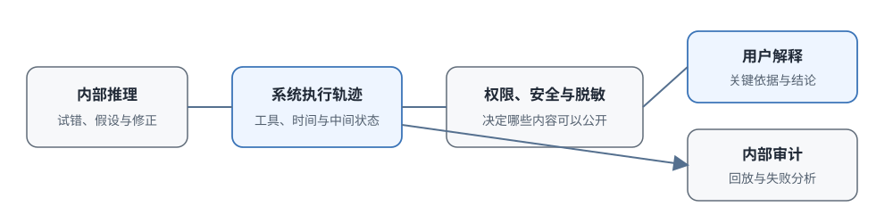

# 16.6 推理链的展示与对齐

前面五节依次讨论了推理模型为什么思考、纯 RL 怎样激发推理、推理时怎样加计算、怎样控制模式和预算，以及怎样让模型自己决定思考时长。现在到了一个直接面向用户的问题：

> 模型在给出最终答案之前，内部可能尝试了三种解法，其中两种走了弯路、一种走通了，中间还夹杂着反复检查、自我修正、甚至工具调用的失败记录。这些原始的思考过程，应该原封不动地展示给用户吗？还是整理成一段简洁、可核查的解释？

这不是一个简单的界面开关问题，它关系到训练资产保护、安全处理、用户体验、学术透明度、以及过程对齐等多个层面。在回答"展示还是隐藏"之前，必须先分清三个完全不同的对象：模型继续生成用的**内部推理**、系统记录的**执行轨迹**、面向用户的**最终解释**。这三者可以重合，也可以分别处理。



## 分清三个层次：内部推理、轨迹、解释

很多关于展示与否的争论，根源是把三个对象混为一谈：

- **内部推理（Internal Reasoning）**
  - 包含什么内容: 未完成的假设、被放弃的路径、试错过程、重复计算、自我怀疑
  - 谁可以访问: 模型本身、服务提供方的内部系统
  - 主要用途: 供模型继续生成下一步 token，内部监控和调试
- **执行轨迹（Execution Trace）**
  - 包含什么内容: 推理文本 + 工具调用记录与返回 + 时间戳 + 中间评分
  - 谁可以访问: 系统日志、审计系统
  - 主要用途: 事后审计、问题回放、失败分析、模型改进
- **用户解释（User-Facing Explanation）**
  - 包含什么内容: 整理后的关键依据、引用来源、计算过程、最终结论
  - 谁可以访问: 最终用户
  - 主要用途: 用户阅读、核查结果、教学场景

一条请求进来，这三层内容是依次产生的：

1. 先生成内部推理（可能反复试错、走弯路）
2. 系统把推理、工具调用、各种元数据记录成执行轨迹
3. 最后决定从轨迹里拿出多少、怎么整理，给用户看

展示策略决定的是第二层和第三层之间放出多少内容：是把原始轨迹直接给用户，还是只给整理后的解释，还是只给答案。

## 为什么隐藏原始推理链

OpenAI 的 o1 系列是隐藏推理链的代表：用户拿不到内部的推理文本，只能看到最终答案，或者经过整理的简短说明。这种设计主要出于三个考虑。

### 保护训练数据不被蒸馏

推理模型生成的高质量推理轨迹，包括逐步推导、自我检查、最后得到正确答案的完整过程，本身就是有价值的训练数据。如果每次调用都把原始推理返回给用户，其他人可以批量收集这些轨迹，用来蒸馏、微调、甚至训练竞争模型。

对闭源商业服务来说，这些轨迹是重要的训练资产。具体的商业权衡通常不会在公开材料中完整披露，但两种选择的差异是清楚的：

- 开放权重模型通常更愿意提供可用于复现和微调的推理数据（比如 DeepSeek-R1）
- 闭源 API 服务则更倾向于保护内部轨迹不被大规模收集

两种选择没有绝对对错，只是商业策略和产品定位不同，但会直接影响用户能否检查步骤、研究者能否复现实验。

### 预留安全处理空间

原始的推理轨迹里可能包含不应该直接出现在用户面前的内容：

- 复述了用户输入里的敏感信息（用户贴的一段隐私文本，模型在推理时提到了）
- 考虑过危险方案（用户问危险物品的制造方法，模型在推理中判断"这不能做"，但思考过程里出现了相关信息）
- 工具返回的敏感数据（代码解释器读到的文件内容、搜索返回的未脱敏信息）

如果这些内容直接流到用户界面，就绕过了最终回答层的编辑和过滤。把内部轨迹和用户输出分开，可以在返回结果之前统一做：

- 脱敏处理（PII 移除、敏感信息过滤）
- 权限检查（这个用户是否有权看到这个工具调用的结果）
- 安全策略执行（最终回答必须符合安全准则）

需要强调：**这不是要隐藏错误**。工具动作本身仍要在执行接口做单独的权限校验和审计。行动层的安全沙箱和输出层的内容过滤是两层独立的防护。

### 控制用户接收的信息量

原始的推理轨迹可能非常长，而且充满试错和重复：模型可能走了三条弯路，两次回头修正，还有大段自我检查的对话。把这些原封不动地展示给用户，会造成三个问题：

1. **阅读成本太高**：用户可能只想知道答案和关键依据
2. **容易造成误导**：被放弃的错误路径可能被用户当成正确结论
3. **推理不等于解释**：模型怎样思考和怎样向用户讲清楚，是两件不同的事

医疗、法律、金融这类高风险场景确实需要可审计的依据，但"给用户看原始推理"不是提供依据的最佳方式。更可靠的交付应该包括：

- 明确的引用来源（具体哪份文献、哪个条款）
- 可重复的计算过程（可以独立验证的步骤）
- 适用条件和不确定性说明（结论在什么情况下成立，边界在哪里）

这些内容可以从内部轨迹整理出来，也可以独立生成并验证。

### Hidden CoT 的工程实现

一种常见的数据流：

```text
模型输出完整内容 ──► 剥离内部推理部分 ──► 安全过滤 ──► 最终答案给用户
                       │
                       └──► （可选）单独生成一份"推理摘要"
```

这里的"推理摘要（reasoning summary）"需要特别注意：它是经过整理的关键依据，不是原始推理文本。它减少了重复和敏感内容，但也可能遗漏关键步骤，因此摘要本身也需要验证：摘要里提到的依据、计算、引用，是否真的对应最终答案。摘要和答案必须一致，不能各自独立。

## 为什么展示推理链

和闭源 API 形成对比的是，[DeepSeek-R1](https://arxiv.org/abs/2501.12948) 采用可见推理输出：用户在最终答案之前，可以看到模型生成的完整推理内容。R1 还发布了模型权重和蒸馏模型（比如 [DeepSeek-R1-Distill-Qwen-32B](https://huggingface.co/deepseek-ai/DeepSeek-R1-Distill-Qwen-32B)），形成了一套完整的开源生态。

可见推理有三个价值。

### 支持开源生态建设

可见的推理输出让整个社区能够：

- 收集成功和失败的案例，分析模型在哪些地方容易出错
- 用这些推理数据微调自己的学生模型（蒸馏）
- 复现论文里的实验结果，而不是只看到一个分数

推理过程如果是黑盒，可复现、可改进、可学习都无从谈起。R1 发布以后，开源社区快速基于它做出大量衍生模型和应用，可见推理在其中起到了重要作用。

### 支持推理步骤检查

对用户来说，能看到推理过程意味着：

- **跟着步骤走一遍**：这一步推导对不对？模型说"由此可得"，是否真的能得出来
- **发现具体哪里错了**：能越过错误答案本身，直接指出"第二步符号算错了"或"这里假设了 x>0 但题目没有给这个条件"
- **用于教学场景**：学习者可以完整观察模型一步步思考的过程

这在数学、编程、逻辑推理场景尤其有价值。这些领域里"结果对了但过程错了"是常见情况，能看到过程才能发现这种问题。

### 保障学术透明度

对研究者来说，公开的推理样例可以：

- 比较不同训练阶段模型的思考长度、自检行为、错误模式
- 分析强化学习到底改变了模型的哪些行为：是更愿意检查，还是更会选方法
- 设计更有针对性的改进方案

但要提醒一点：可见的输出文本是模型的生成内容，不能自动等同于它的真实内部机制。研究结论要结合模型输出、工具日志、最终评测一起看。

### Visible CoT 的代价

展示也有成本：

1. **数据复用问题**：公开的轨迹可以被任何人用来蒸馏和训练其他模型。这对开源生态是优点，对想保持差异化的商业服务就是问题
2. **内容暴露问题**：可见的推理文本本身也要接受安全过滤，不能因为是"思考过程"就把敏感内容直接放出来
3. **阅读成本问题**：长轨迹里大量是试错，界面通常需要折叠、摘要、或只展示关键节点

还有一个必须澄清的误区：**可见推理不等于模型真的是这么想的**。模型生成的推理文本也是生成内容的一部分，它可能写得条理清楚但实际用了另一种方法得到答案，也可能在答案确定之后才补写一段合理的推导过程。这个问题在后面讨论过程对齐时再展开。

## 展示策略的选择

隐藏和展示不是非黑即白的两个极端，中间有一系列可选粒度：

- **完全隐藏原始推理**
  - 用户看到什么: 只有最终答案
  - 主要收益: 输出最简洁，内部轨迹不直接暴露，安全处理简单
  - 仍需解决的问题: 外部用户无法检查中间过程，只能靠服务方审计
- **结构化推理摘要**
  - 用户看到什么: 关键依据、引用、关键步骤 + 最终答案
  - 主要收益: 兼顾可读性和部分检查能力，阅读成本低
  - 仍需解决的问题: 摘要可能遗漏关键步骤或改写原意，需要验证摘要和答案的一致性
- **完整可见推理**
  - 用户看到什么: 模型生成的全部推理文本 + 答案
  - 主要收益: 最便于复现、教学、错误分析和研究
  - 仍需解决的问题: 内容需要安全过滤，可能包含敏感信息或被放弃的错误路径，阅读成本高

具体产品怎么选，取决于用户是谁、他们需要检查什么、错误暴露出来的影响有多大。判断一个产品用的是哪种策略，不要看宣传文案，直接看 API 返回的内容：是原始的推理 token 流，还是经过处理的摘要块，还是只有答案。

::: details 可以混合吗？
理论上可以做动态策略：简单翻译只给答案，数学证明展示推理。但这引入了新的问题：策略选择的判断标准是什么？用户会不会疑惑"为什么这道题给我看过程那道题不给"？策略选择本身也需要对齐和评测。
:::

## 过程对齐比可见性更重要

决定了展示多少，还有一个更根本的问题没有解决：**中间过程和最终行为是一致的吗？**

这才是真正的对齐问题，和"展示不展示"是两回事：

- 即使推理文本可见，它也可能写得合理但和真实计算无关
- 即使推理文本隐藏，内部推理也可能包含和最终行为冲突的计划

可见性策略决定的是"用户能不能看到文本"，过程对齐关心的是"中间状态、工具动作、最终结果这三者能不能互相印证"。

### 过程对齐与结果对齐的区别

传统的 RLHF 和偏好数据主要评价最终回答好不好。推理模型生成很长的中间文本，这些中间文本会影响后续 token 和工具动作，即使最终不向用户展示，它们也在决定系统行为。因此这些中间内容也必须纳入训练和监控。

### 安全目标要覆盖三个层次

1. **最终文本**：给用户看的回答必须安全合规
2. **工具动作**：实际执行的操作必须符合权限和安全规则
3. **可访问日志**：写入日志的内容也要考虑访问控制

内部推理中出现一个被放弃的危险候选，本身不会自动造成外部危害；只有当它被返回给用户、写入可访问日志、或者驱动工具执行时，风险才真正进入系统边界。防护也应该放在这三个位置：

- 训练时减少产生不安全轨迹的概率
- 执行时严格限制工具权限（沙箱）
- 输出时过滤敏感内容

不能只靠"审查思考内容"来解决安全问题，行动层的控制更根本。

### 推理文本与最终答案要一致

已有研究（比如 [2025 年的这篇工作](https://arxiv.org/abs/2511.18397)）系统比较了模型生成的中间文本和最终行为是否一致，发现了不匹配的情况：

- 中间文本说"我应该用方法 A"，最后却用了方法 B
- 解释里写清楚了每一步怎么来的，但工具日志显示实际执行了完全不同的计算
- 推理文本说"验证过了没问题"，实际答案是错的

如果内部推理不可见，用户没法直接比较；但即使推理可见，也不能直接假设它是忠实的：推理文本是生成内容。研究这种不一致性需要受控实验、行为探针、工具日志交叉验证。

### 隐藏触发器与后门检测

还有一个更极端的对齐问题：[Anthropic 的 Sleeper Agents 研究](https://www.anthropic.com/news/sleeper-agents-training-deceptive-llms-that-persist-through-safety-training)（2024）发现，模型可能学会在特定触发条件下改变行为：正常情况下表现良好，看到某个秘密触发词就输出有害内容。

检测这种问题的重点：

- 输入条件变化时行为有没有异常改变
- 内部激活有没有异常模式
- 生成文本和实际动作是否一致
- 对抗性测试下会不会暴露隐藏行为

可见推理为人工检查提供了一条线索，但攻击者也可能故意不在可见文本里写出触发行为。隐藏推理则需要服务方用内部监控和外部行为测试来发现。两种方案都不能靠读一遍推理文本就完成安全判断。

### 过程对齐的研究方向

监督中间过程的研究主要在四个方向：

#### 方向一：过程奖励模型（PRM）

给每个中间推理步骤标注正确性或安全标签，训练一个评价器给每一步打分，而不是只看最终结果对不对。这就是下一章要展开的内容。

#### 方向二：CoT 监控

训练独立的监控模型，让它读取推理文本和工具日志，标记出：

- 违反安全规则的内容
- 异常的权限请求
- 结论和前面推导不一致的地方

监控模型本身也会犯错，还需要人工抽查和对抗样本来评测它的可靠性。

#### 方向三：机械可解释性工具

不看生成文本，直接分析模型的内部激活，比如用 Sparse Autoencoders（SAE）寻找和某些概念（欺骗、有害意图、不确定性）相关的激活方向。这提供的是内部表示层面的证据，和检查生成文本互补。

#### 方向四：宪法式推理（Constitutional Reasoning）

把原则拆成具体的判断准则和偏好样本，在训练阶段就提高符合准则的推理和回答的概率。但原则必须落到可测试的行为上，否则很难判断模型是真的遵守了，还是只在文本上表达遵守。

### Hidden CoT 与 Visible CoT 对比

两种策略在各个目标上的取舍：

- **训练资产保护**
  - 隐藏原始推理: 轨迹较难被直接大规模收集
  - 展示推理文本: 轨迹更容易被复用和蒸馏
- **外部可检查性**
  - 隐藏原始推理: 依赖服务方提供的摘要、引用、日志
  - 展示推理文本: 用户可以直接检查文本步骤，但仍需验证其忠实性
- **内容安全**
  - 隐藏原始推理: 返回前可以统一做安全处理和脱敏
  - 展示推理文本: 展示内容本身也要接受和最终答案同等级别的安全过滤
- **教学与复现**
  - 隐藏原始推理: 需要单独生成适合教学的解释材料
  - 展示推理文本: 更方便学习者观察方法、分析错误样例
- **内部监控能力**
  - 隐藏原始推理: 服务方自己有完整轨迹，可以做内部监控
  - 展示推理文本: 公开文本只覆盖可见部分，隐藏激活仍需其他方法监控

可见推理便于检查和教学，也更容易被蒸馏和暴露敏感内容；隐藏推理便于保护资产和统一安全处理，但降低了外部审查能力。推理摘要提供了一条中间路线，但摘要本身是否忠实地反映了模型的决策依据，仍然需要验证。

## 本节小结

- **三个对象要分清**：内部推理、执行轨迹、用户解释是三层不同的东西。展示策略只决定后两层之间放出多少内容，不改变推理本身的正确性。
- **隐藏的理由**：训练资产保护、统一安全处理空间、控制用户信息量。Hidden CoT 通过"剥离—过滤—可选摘要"的数据流实现。
- **展示的价值**：开源生态建设、用户步骤检查、学术透明度，这对研究社区和教学场景至关重要。
- **可见不等于忠实，隐藏不等于不可靠**：无论展示与否，中间文本、隐藏激活、最终行为三者的一致性，才是过程对齐要解决的根本问题。
- **过程对齐在四个方向推进**：过程奖励、CoT 监控、机械可解释性、宪法式推理，它们提供不同层面的证据，互相补充。

## 第 16 章回顾

第 16 章从 o1 和 R1 这样的推理模型讲起，形成了一条完整的因果链：

1. **RL 让思考稳定出现**：纯结果奖励配合 GRPO 就能让模型学会展开推理（16.1–16.2）
2. **推理计算可以提高成功率**：参数固定后，多采样、多修订、多搜索能补救采样型失败（16.3）
3. **预算控制负责平衡成本和质量**：Hybrid Thinking 区分简单题和难题，thinking budget 设上限，long2short 压缩冗余（16.4）
4. **自适应思考把判断权交给模型**：让模型根据任务和进展动态分配计算，但要用硬上限控制风险（16.5）
5. **可见性是系统设计变量**：最后要决定给用户看多少思考，以及怎样保证中间过程和最终行为一致（16.6）

推理链是否展示给用户，和推理过程本身是否正确、是否对齐，是两个独立的问题。下一章深入过程奖励内部：怎样给中间步骤提供反馈？怎样训练 PRM？怎样在推理时用这些反馈做搜索来选择更好的路径？这就是第 17 章过程奖励与推理时搜索的内容。
