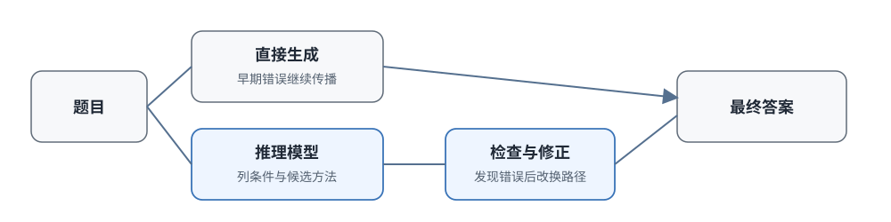

# 16.1 从语言模型到推理模型

前面的章节从 PPO、DPO 到 GRPO，我们一直在讨论如何用强化学习让语言模型更符合人类偏好、在数学和代码任务上取得更高分数。观察一条稍有难度的解题轨迹，会看到一个常见现象：模型读完题目就直接往下写答案。如果第一步公式选错，后面的几百个 token 都会沿着这条错误路径继续。

这很像一个学生考试时不打草稿直接写答案：一开始方向错了，写得越多错得越远。人在解难题时会先列条件、试两种方法、发现不对再划掉重来、把结果代回去验算。**推理模型**（reasoning model）做的就是这件事：在给出最终答案之前，先在同一条生成轨迹里展开中间思考，比较候选方法，调用工具检查结果，必要时推翻重来。

有了这套中间计算，新的问题也随之而来：训练目标要怎么变，才能让这些中间步骤真正提高成功率而非浪费算力？推理时投入多少计算才划算？简单翻译和复杂证明是否应该用同样长的思考？模型自己生成的推理过程，应该展示给用户看吗？第 16 章就沿着这条变化展开。本节先说明产品形态发生了什么变化，再看研究中观察到的推理行为、RL 在其中到底强化了什么，最后看系统怎样区分"思考"和"答案"。



## 普通语言模型的串行生成局限

先看一个最常见的失败场景。假设模型面对一道二次方程题：

> 求方程 $x^2 - 5x + 6 = 0$ 的解。

一个普通语言模型读完题目后，可能的生成过程是：

```text
这是一个二次方程，可以用求根公式。
求根公式是 x = (-b ± √(b²-4ac)) / 2a。
代入 a=1, b=-5, c=6。
判别式 = 25 - 24 = 1。   ← 如果这里算成 -1
所以 x = (5 ± √-1)/2。    ← 后面全部在复数域继续
x = (5 ± i)/2。
```

第一步代入或计算出错，后面的每一步都在延续这个错误。模型不会停下来检查"判别式怎么会是负数"，也不会回退到因式分解重新试一遍。根源在传统自回归生成的机制：token 一个接一个生成，一旦前面的 token 确定了，后面只能在条件概率下继续。

代码任务里同样如此。模型可以一次写出一个完整补丁，却不会先运行测试定位问题，再根据报错修改方案。几百行代码很难一次写对；可靠的软件开发依赖编译、测试、报错定位和局部修改。LLM 的一次连续生成缺少的正是这个“检查—修正”循环。

## o1 把思考做成产品接口

2024 年 9 月，OpenAI 发布 o1，推理模型由研究概念进入可调用的产品。o1 在给出答案前使用内部推理，并允许系统通过更多推理时计算换取复杂任务上的更高成功率；后续接口进一步把推理投入抽象为可调档位。

### 长推理链的训练

OpenAI 在 [o1 发布说明](https://openai.com/index/learning-to-reason-with-llms/) 中公开的重点是训练与推理计算：模型用大规模 RL 学习怎样组织较长的内部推理，训练计算和单题思考时间增加时，评测表现都随之提高。官方没有公开完整奖励构成，因此不能把 o1 简化为"只用最终答案奖励"；能够确定的是，RL 直接优化了思考链在复杂任务中的有效性。

o1 发布时在几项推理基准上明显超过 GPT-4o。这里需要特别注意评测方式，因为**采样次数本身也会影响分数**：

- **AIME 2024**
  - 评测方式: 单次回答
  - GPT-4o: 约 12%
  - o1: 约 74%
- **AIME 2024**
  - 评测方式: 64 次共识
  - GPT-4o: 约 56%
  - o1: 约 83%
- **Codeforces**
  - 评测方式: Elo 等级
  - GPT-4o: —
  - o1: 1673
- **GPQA Diamond**
  - 评测方式: 单次回答
  - GPT-4o: 约 51%
  - o1: 约 78%

其中 Codeforces 的 Elo 为 1673，位于参评人类选手的第 89 百分位。

这里最容易误读的是第二组数字。GPT-4o 单次约为 12%，采满 64 条回答做多数选择后可以达到约 56%。采样确实能提高分数，但这部分差异来自评测时投入了更多计算。o1 单次达到约 74%，已经高于 GPT-4o 的 64 次共识；再给 o1 64 次共识，则达到约 83%。单次回答、多数选择和重排序使用的推理计算不同，报告指标时必须保留评测方式。

用一个具体数字感受这个差距：如果模型单次正确率是 $p=0.12$，采 64 次至少有一条正确回答的概率是 $1-(1-0.12)^{64}\approx 99.97\%$。然而，“候选中出现正确答案”和“系统能够选中正确答案”是两个问题；多数投票仍会受到相关错误和答案归并方式的影响。o1 单次 74% 表示一次内部推理已经显著提高了解题成功率，不能由这组结果进一步推断每次都经历了相同的检查步骤。

o1 不向用户展示内部 CoT（Chain of Thought），只返回最终答案或经过整理的说明。这样可以减少内部推理被直接复制的风险，也使用户无法逐步检查模型实际经历的推理过程。系统需要用可验证答案、引用和外部评测来建立可信度。

### reasoning_effort：推理预算接口

模型能够从更多思考中获益以后，服务端还需要决定每次请求投入多少计算。OpenAI 在 2024 年 12 月发布正式版 o1 时加入 `reasoning_effort`，开发者可以选择较低或较高的推理投入。这个参数没有承诺固定 token 数，它表达的是质量、延迟和费用之间的档位。

可以用日常场景理解这三个档位：

- **低**
  - 思考长度: 短
  - 单题延迟: 低
  - 适用请求: 翻译、改写、简单问答、格式转换
- **中**
  - 思考长度: 中
  - 单题延迟: 中
  - 适用请求: 常规代码编写、中等难度数学题
- **高**
  - 思考长度: 长
  - 单题延迟: 高
  - 适用请求: 竞赛题、多约束规划、复杂调试

三个档位的差别可以这样理解：把"hello"翻译成中文，短思考就足够；常规代码编写需要中等长度的检查；竞赛题和多约束规划则值得等待更长的推导。OpenAI 同月预告 o3，随后在 2025 年 4 月正式发布。官方报告 o3 继续扩大了 RL 训练计算与推理计算，并在相同延迟和成本条件下超过 o1。这里重要的变化不在某一个不断更新的榜单数字，而在产品接口已经允许系统按任务调节推理投入。

第 16.3—16.5 节会依次把这个接口拆开：额外计算可以怎样使用，固定预算怎样设置，模型又怎样根据任务动态选择预算。

### o3 与 o4-mini：工具接入推理循环

2025 年 4 月发布的是 [o3 和 o4-mini](https://openai.com/index/introducing-o3-and-o4-mini/)，并不存在同次发布的"完整 o4"。这两个模型把网页搜索、Python 执行、文件读取和图像分析等工具放进同一条解题过程，形成了一个闭环：

- 模型在推理过程中可以**主动调用工具**（搜索、代码执行、图像分析）
- 工具调用的结果**反过来影响下一步推理**
- 形成"思考 → 调工具 → 再思考 → 再调工具"的循环

举一个具体的循环：模型证明一道组合题时，先用推理猜出递推关系，接着调用 Python 对前 20 项验算，发现第 17 项不满足递推公式，于是回到推理修改猜想，再验算一次直到所有项都吻合。工具结果像环境反馈一样进入生成过程，推理不再只依赖参数内部的知识。

这种工作方式通常称为 **agentic reasoning**：模型在多轮推理中读取外部环境的反馈，再决定下一步动作。它与 [第 22 章 Agentic RL](../chapter22_agentic/overview) 讨论的工具调用和环境交互直接相关。

## 竞赛编程里观察到的推理行为

基准分数只能说明结果提高了，还不能解释模型在解题过程中做了什么。竞赛编程（Competitive Programming）提供了一个特别适合观察的环境：代码能否编译、测试是否通过、修改以后结果是否改善，都可以由工具自动记录。

o1 发布后，一个直接的问题是：这些行为（检查、修正、切换方法）来自大量人工编写的推理链 SFT 数据，还是可以通过结果反馈强化出来？

2025 年 2 月，OpenAI 发表 [Competitive Programming with Large Reasoning Models](https://arxiv.org/abs/2502.06807)（arXiv:2502.06807）。论文没有公开完整训练细节，因此下面只讨论可以从实验直接观察到的行为和计算分配。

### 端到端 RL 与专用流水线对比

传统上，Codeforces 这类竞赛任务通常使用专门设计的流水线，每个模块负责一个环节：

```text
问题理解 → 测试用例生成 → 候选程序合成 → 编译执行 → 选择最优解
```

这个流水线里的每一步都由专门模块负责，例如搜索算法、程序生成和测试筛选。论文中的推理模型把这些行为放进同一条生成轨迹：模型自己决定什么时候生成候选、什么时候运行测试、什么时候根据测试结果修改方案，并在报告的 Codeforces 设置上取得了更好的结果。这个对比说明，端到端训练可以学会组织候选生成、执行测试和修改方案，但结论仍受模型、任务和计算预算限制。

### 多阶段推理行为的出现

论文记录了 o1 / o3 解决 Codeforces 题目时出现的多阶段推理行为，这些行为并非在训练中被显式编程：

- **生成多个候选解**：模型自己生成多个不同解法，比较它们的思路和复杂度
- **执行验证**：主动用工具执行代码，用测试用例看结果是否符合预期
- **自我修正**：发现测试不通过后，重新阅读报错、定位问题并修改代码
- **策略切换**：从贪心算法切换到动态规划，再切换到回溯搜索，直到找到可行方案

训练过程没有把"先尝试贪心，再尝试动态规划"写成固定流程，但高质量预训练数据可能已经让基座模型见过这些算法范式。RL 的作用是提高能够通过测试的轨迹概率，使候选比较、执行验证和错误修正更稳定地出现。清晰的结果奖励提供了选择信号，基座模型已有的知识与采样覆盖范围则决定了有哪些行为可供强化。

用一个简单的数值例子理解这个选择过程。设 $\pi(k)$ 是模型生成第 $k$ 类轨迹的概率，$s_k$ 是这类轨迹的成功率，平均成功率是各类轨迹的加权平均：

$$
S = \sum_k \pi(k)\, s_k.
$$

假设面对一道题，模型以概率 $\pi(\text{短})=0.05$ 生成"直接写答案"的短路径（成功率 $0.01$），以概率 $\pi(\text{长})=0.1$ 生成"先写测试再调试"的长路径（成功率 $0.4$），其余概率生成其他路径。训练初期这两类对平均成功率的贡献是 $0.05\times0.01+0.1\times0.4\approx0.04$。RL 根据结果奖励更新后，概率分布向高成功率轨迹倾斜，比如变成 $\pi(\text{短})=0.02$、$\pi(\text{长})=0.35$，同样的贡献变成 $0.02\times0.01+0.35\times0.4\approx0.14$。单条轨迹的成功率 $s_k$ 没有变，变的是模型选择轨迹的概率，整体成功率却提高了三倍多。这就是 [16.2 节](./r1-zero-pure-rl-reasoning) 要详细展开的 GRPO 组内比较机制。

### 训练算力与推理算力的分工

论文还报告了一个关键的权衡（trade-off）：

- **增加训练算力**：模型的基础能力提升（见过更多算法范式、掌握更多编程模式），但每道题的推理 token 数基本不变
- **增加推理算力**（让模型思考更久）：在固定训练算力下，可以进一步提升表现，因为模型能在同一道题上尝试更多候选、做更多次验证

训练算力决定模型"已经掌握哪些武器"，推理算力决定模型"在当前题目上开多少枪"。例如同一个模型，训练加倍后能看懂更多算法范式（如网络流、线段树）；推理预算加倍后，能在同一道题上多验证两个候选实现。这和考试的道理一样：平时学得好（训练充分）是基础，但考场上留时间检查（推理预算）也能多拿分。16.3 节会进一步比较这两类算力。

## 涌现与激活：RL 的作用

观察到模型会检查和修正以后，一个自然的问题是：这些能力从哪来？若把所有变化都归结为 RL"从零创造了推理能力"，就会忽略基座模型已经从预训练数据中学到的数学、代码和语言模式。o1 和 R1-Zero 报告的"涌现"（emergence）需要分成两层理解：

**第一层含义：推理行为在训练数据中没有显式出现过**

R1-Zero 没有使用人工标注的 CoT 作为 RL 冷启动数据，但训练后会自主生成长思维链、做反思、做验证。这种“涌现”是相对于该训练阶段的监督数据而言的：模型没有在这一阶段被逐条示范何时检查、何时改换方法。

**第二层含义：推理能力是否全部由 RL 阶段从零创造**

后续复现实验（如 SimpleRL-Zoo、Open-R1）表明，基座模型在 RL 以前已经能以一定概率生成正确推理，只是概率很低。RL 根据奖励重新分配这些轨迹的概率，使有效方法更常出现，也可能在已有行为的组合上形成新的策略。

用一个类比理解这个区别：一个学生已经知道怎样验算，但考试时很少实际执行。若评分机制让经过有效验算的解答更容易取得高分，这种低频行为就可能逐渐稳定下来。RL 在这里更接近对已有候选行为重新分配概率，不能仅凭输出变化断言它从零创造了验证能力。

因而，分析 RL 效果时要同时检查三个要素：

- **基座能力**：先在基座模型上进行多次采样，估计正确轨迹是否已经存在（哪怕概率很低）
- **采样覆盖**：训练中的采样温度和组大小 $G$ 是否足够大，能采到那些低概率但正确的轨迹
- **概率变化**：RL 前后成功率和行为分布的变化，判断问题主要是"完全不会"还是"会但不稳定"

根据这三点可以决定后续方向：基座完全不会解时，应先补预训练或 SFT；基座偶尔能答对时，RL 负责放大这些轨迹的概率。DeepSeek-R1 的实验也支持这种区分：预训练提供知识和基本推理能力，RL 让能够获得奖励的推理行为更稳定地出现。

:::details 看一个具体的基座采样例子
假设对同一道数学题用基座模型采样 100 次：

- **直接给出错误答案**
  - 出现次数: 72 次
  - 特征: 没有中间步骤，直接猜结果
- **有推理但计算错误**
  - 出现次数: 22 次
  - 特征: 列了公式但代数运算出错
- **推理完整且答案正确**
  - 出现次数: 6 次
  - 特征: 包含检查和验证，结果正确

基座不是"完全不会"，它有 6% 的概率生成正确轨迹。RL 不需要从零创造这种能力，只需要让第三类轨迹的概率从 6% 提升到更高，同时压低前两类轨迹。这正是为什么 [16.2 节](./r1-zero-pure-rl-reasoning) 的 GRPO 要求"同一道题采一组回答、组内有对有错"：没有这 6 条正确样本作为正样本，组内比较就没有学习信号。
:::

## 推理模型的输出组织

训练能够强化检查和修正以后，系统还要把这些行为组织成稳定的接口。至少要区分三类内容，混在一个文本流里会出问题：

1. **模型内部用于继续计算的推理状态**（草稿、被放弃的路径、中间验算）
2. **可以交给工具执行的动作**（运行代码、搜索网页、读取文件）
3. **最终返回给用户的答案**

如果三者混在一起，验证器就难以抽取答案，工具也难以判断"这句话是要我执行还是只是思考"。

公开模型采用了不同接口，可以按三个独立问题比较：

- **是否进入长思考**
  - 代表做法: DeepSeek V3.1、Qwen3 在同一模型中支持思考与非思考模式
  - 需要继续解决的问题: 怎样判断当前任务需要哪一种模式
- **投入多少计算**
  - 代表做法: OpenAI `reasoning_effort`、Qwen3 thinking budget、Claude effort
  - 需要继续解决的问题: 怎样让预算与任务难度匹配
- **向用户展示什么**
  - 代表做法: OpenAI 提供推理摘要，DeepSeek-R1 等模型可输出推理文本
  - 需要继续解决的问题: 展示内容能否检查、是否泄露敏感信息

模型名称和接口会更新，这三个问题却保持稳定。它们分别对应 16.4 的模式与预算、16.5 的自适应分配，以及 16.6 的推理链展示。展示方式会影响用户检查、数据蒸馏和安全监控，16.6 节会单独展开。这里先看训练格式怎样把推理段与答案段分开。

### 用特殊 token 分隔思考与答案

传统 LLM 输出只有一个 token 序列：`<答案 token>`。推理模型输出多了一个"推理 token"段，结构变成：`<推理 token> <分隔符> <答案 token>`。

在工程实现上，这通常通过特殊 token（special tokens）实现：

```text
<|begin_of_thought|>
用户的问题是解方程 x²-5x+6=0...让我先理解题意。
这是二次方程，可以用求根公式或因式分解。
先试试因式分解：找两个数乘积为6、和为-5...-2和-3。
所以可以写成 (x-2)(x-3)=0。
等等，让我验证一下：(x-2)(x-3) = x²-5x+6 ✓
让我再用求根公式确认...
两种方法都得到 x=2 或 x=3。
<|end_of_thought|>
<|begin_of_solution|>
方程 x²-5x+6=0 的解是 x=2 或 x=3。
<|end_of_solution|>
```

分隔以后，系统可以：

- **只抽取答案段**交给结果验证器，避免把推理文字误当作答案
- **对推理段施加长度约束**，限制思考 token 的上限
- **对推理段做过程评价**（PRM），对答案段做结果评价
- **在展示时隐藏推理段**，只给用户看整理后的答案

分隔符本身不会自动提供正确性标签，但它为后续的 Hybrid Thinking、思考预算和 long2short 压缩建立了清楚的数据边界：系统知道哪段是"草稿"，哪段是"交卷"。

## 本节小结

- 普通语言模型一次连续生成，第一步出错后只能在错误路径上继续；推理模型在答案之前展开中间计算，比较候选方法、检查结果、必要时推翻重来。
- o1 把更长思考变成可调用的产品能力，`reasoning_effort` 让推理预算成为接口参数；o3 与 o4-mini 进一步把工具反馈接入推理过程。
- 竞赛编程研究记录了候选生成、执行验证、自我修正与策略切换四种行为；预训练提供知识与基本推理能力，RL 提高能通过验证的轨迹概率。分析训练收益时应先估计基座的采样成功率，区分"完全不会"和"会但不稳定"。
- 推理段与答案段用特殊 token 分开，为答案抽取、预算控制、过程评价和展示策略建立了清楚的数据边界。

[16.2 R1-Zero：纯强化学习如何激发出推理](./r1-zero-pure-rl-reasoning) 将沿着奖励设计、组内比较和行为变化这条线，具体说明不经过 SFT 冷启动时，这些推理行为怎样在训练中一步步形成。
