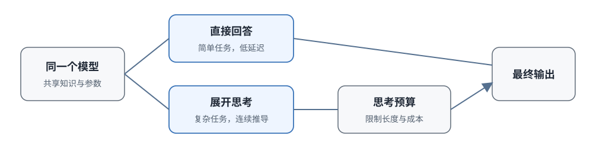

# 16.4 Hybrid Thinking 与预算控制

上一节讲了 Test-Time Scaling：参数固定后，可以靠多采样、多修订、多搜索来提高成功率。但这带来一个直接的工程问题：不能对所有请求都给满预算。

设想推理服务同时进来两条请求：

1. "把 hello 翻译成中文"，不需要展开推理，直接回答即可
2. "证明数列 $a_n = (1+\frac{1}{n})^n$ 收敛"，需要展开好几步推导，还要验证

如果都进入长思考模式，翻译请求会白白增加几秒延迟和几千 token 的费用；如果都直接回答，证明题大概率会在中间步骤出错。

这就是 **Hybrid Thinking**（混合思考）要解决的问题：同一个模型同时支持两种模式，简单题直接回答，复杂题展开长推理，并且让预算可以控制。本节依次看四个问题：两种模式怎样在同一模型中共存，预算怎样设置，同样的预算该给一条长链还是多条短回答，以及模型学会长思考以后怎样压缩冗余的思考步骤。



## 同一模型支持两种思考模式

一个容易想到的方案是维护两个模型：一个"快模型"负责简单问答，一个"思考模型"负责复杂推理。但这会带来三个代价：

- 两套权重要分别部署、分别维护
- 知识更新不同步：快模型学到的新东西，思考模型可能还不知道，反之亦然
- 显存占用翻倍，成本也翻倍

Hybrid Thinking 的做法是：**共享同一组参数，用训练样本或控制标记来指定当前应该用哪种模式输出**。

### DeepSeek V3.1：双接口设计

2025 年 8 月发布的 [DeepSeek V3.1](https://api-docs.deepseek.com/news/news250821) 是把这种双模式做成公开产品接口的一个例子。它在同一个模型版本上暴露了两个 API 端点：

- `deepseek-chat`：Non-Think 模式，直接回答
- `deepseek-reasoner`：Think 模式，展开长推理

从公开说明可以确认三件事：

1. **确实是同一个模型**，不是两个独立模型
2. **模式在请求时切换**，由路由决定走哪条路
3. **知识和工具能力共享**，两个模式同步更新

公开资料没有披露每一种训练数据和损失的细节，无法从"双模式"这个结果反推具体的训练流程。能够确定的是：训练数据必须同时覆盖长推理回答和直接回答，否则一种模式会把另一种模式挤掉。只用长文训练，模型的短回答能力会退化。

### Qwen3：系统化的双模式方案

更早发布的 [Qwen3 技术报告](https://arxiv.org/abs/2505.09388)（2025 年 5 月）提出了更系统的方案。Qwen3 全系列模型（从 0.6B 到 235B）都支持两种模式，训练方法也描述得更清楚。

它的核心做法是**混合训练数据加模板控制**：

- 训练数据里混合两类样本：
  - **thinking 样本**：完整的长推理链加最终答案
  - **non-thinking 样本**：直接给短答案，不输出中间推理
- 推理时通过聊天模板或用户设置告诉模型：当前应该生成长推理，还是直接回答

参数是同一套，控制标记激活不同的行为模式：看到思考标记就逐步展开推理，看到直接回答标记就输出结论。

共享参数避免了维护两套模型的代价，但还有一个问题没有解决：**谁来决定当前该用哪种模式？** 完全靠用户手动选，体验不好；让模型自己判断，又可能判断错。这个问题留到 16.5 节讨论自适应思考时再解决。本节先假设模式选择已经由用户或路由器完成，看预算怎样控制。

### Thinking Budget：控制思考长度

即使进入了思考模式，也不能让模型无限推导下去。Qwen3 提出了 **thinking budget**：部署时给推理过程分配一个 token 预算上限，用同一个模型就能形成不同的"质量—延迟"工作点。

不同服务的参数名和实现可能不一样，用伪代码表示它的含义：

```python
# thinking budget 接口示意
response = client.chat.completions.create(
    model="qwen3-235b-a22b",
    messages=[{"role": "user", "content": "证明根号2是无理数"}],
    extra_body={"thinking_budget": 2000}  # 思考部分最多用 2000 token
)
```

这个上限直接影响三个部署指标：

- **小预算**（如 500 token）：高频的简单请求不会被长思考拖慢，p99 延迟可控
- **成本上界**：单次调用在最坏情况下的费用有了上限
- **大预算**（如 8000 token）：竞赛题、证明题有足够空间展开推导、检查错误、回头修订

同一个模型配合不同预算，相当于在同一条"正确率—延迟"曲线上取不同的工作点：翻译摘要用小预算快速返回，竞赛编程和数学证明用大预算保证正确率。

但这里有一个容易误用的地方：**预算上限不等于模型会正确收尾**。如果在证明中间直接截断，模型可能来不及写出最终答案：前面思考了 3000 token，最后的结论还没有输出就被切断了。因此训练和部署必须分别处理：

- 训练时让模型在不同预算条件下都能合理收尾
- 部署时要么为最终答案预留 token，要么在接近预算时触发收束

## 一条长链与多条短答

难题给更多预算、简单题给更少预算，这个原则确定以后，还有一个选择问题：进入"需要更多计算"的任务以后，预算该怎样花？

同样是 4000 token 的总预算，有两种极端花法：

1. **Thinking 模式**：生成一条约 4000 token 的长推理链，沿一条路径深入
2. **NoThinking 模式**：跳过显式长推理，生成八条约 500 token 的短回答，再投票选最好的

2025 年 4 月 Ma 等人的论文 [Reasoning Models Can Be Effective Without Thinking](https://arxiv.org/abs/2504.09858) 系统比较了这两种分配。

### 相同预算下的对比

论文的实验设计是：**控制总 token 预算（或墙钟延迟），比较两种分配方式的效果**。他们用 DeepSeek-R1-Distill-Qwen 系列模型，在数学、形式证明、代码等七类任务上做了对比。

用具体数字理解"相同预算"：总预算 4000 token 时，

- Thinking 模式：1 × 4000 token，保留完整的连续推导过程
- NoThinking 模式：8 × 500 token，八次独立尝试，用投票或验证器选答案

实验结论集中在**低预算区间**，不能把结论外推为"NoThinking 在所有任务上都更好"。

### 什么时候多条短答更好

一条长链把所有预算集中在同一个解法上。风险在于：如果早期方向选错，后面的几千 token 都在错误的前缀上继续推导，越走越远。

多个短回答把预算分散到不同起点，覆盖的解题方法更丰富。它依赖两个条件：

1. 短回答本身要有一定的单次成功率（$p$ 不能太低）
2. 系统要有能力判断哪个答案更好（验证器可靠，或投票机制有效）

这两个条件满足时，比如知识问答、简单数学题，多条短回答投票可能比一条长链更划算。

反过来，如果任务需要**连续的状态保留**，一条能保留中间状态的长链就更有价值。写一个复杂算法，前面定义的函数后面要调用；做一个多步证明，每一步都依赖上一步的结论。长证明不能拆成八个独立的短证明来投票，因为后面的推导依赖前面的结论。

因此这是根据任务类型选择计算分配方式的问题：

- **是否需要连续推导依赖？**
  - 更适合 Thinking（一条长链）: 是（证明、代码、多步规划）
  - 更适合 NoThinking（多条短回答）: 否（问答、选择题、简单计算）
- **单次短回答成功率？**
  - 更适合 Thinking（一条长链）: 低
  - 更适合 NoThinking（多条短回答）: 中高
- **有没有可靠验证器？**
  - 更适合 Thinking（一条长链）: 没有也能工作
  - 更适合 NoThinking（多条短回答）: 最好有

## Long2Short：压缩长推理链

长思考训练有一个副作用：模型为了提高正确率，可能学会反复检查、重复表述，甚至绕圈子。部署时用硬截断解决长度问题风险很大：截断点落在结论之前，模型来不及输出答案。需要的是：**让模型在训练阶段就学会保留必要步骤、删除冗余步骤，同时不损失正确率**。这就是 long2short 问题。

### 推理链为什么会变长

在推理 RL 训练中，回答变长是常见现象，有三个直接原因：

1. **答对的奖励信号鼓励长轨迹**：更长的推理链意味着更多检查机会，答对概率更高，模型倾向于想得更久
2. **反思和验证行为被强化**：检查确实能发现错误，因此被结果奖励间接选择
3. **没有显式长度约束**：奖励里只有"答对"没有"省 token"时，模型没有动机压缩回答

长度增加只有在确实提高正确率时才有价值。重复表述和无效检查只会增加部署成本。long2short 要把长推理中学到的规划和修正能力，转移到更短的回答中。

Kimi k1.5 技术报告（2025）比较了四种方法，分别从四个层面入手：

- **模型权重合并**
  - 作用层面: 参数层面
  - 核心思路: 直接平均长 CoT 模型和短 CoT 模型的权重
- **Shortest Rejection Sampling**
  - 作用层面: 监督数据（SFT）
  - 核心思路: 从多条正确回答中选最短的那条做监督微调
- **DPO**
  - 作用层面: 偏好数据
  - 核心思路: 把"短而正确"作为 chosen，"更长或错误"作为 rejected
- **long2short RL**
  - 作用层面: RL 奖励
  - 核心思路: 在 RL 中加入组内长度奖励，同时缩短 rollout 上限

### 监督式压缩

前三种方法都从"已经有一个能做对但输出很长的长模型"出发，得到一个"输出更短但仍能做对"的短模型。

**Shortest Rejection Sampling** 最直接：同一道题让长模型生成多条回答，筛选出正确的，再从正确回答里挑**最短**的那条做 SFT 数据。短模型学到的就是"既能做对又尽量简洁"的范例。

**DPO**（直接偏好优化）走偏好学习路线：对同一道题，把"短且正确"的回答作为偏好样本（chosen），把"更长但也正确"或"错误"的回答作为被拒样本（rejected）。模型学会的偏好是：在都能做对的情况下，优先选短的。

**模型权重合并**直接平均长 CoT 模型和短 CoT 模型的权重。它不生成新的压缩文本，也不保证合并后的每项能力都处在两者之间，因此使用后必须做完整评测。

### 用强化学习压缩

最精细的方法是 long2short RL：从已经取得较好正确率与长度平衡的模型继续训练，一边缩短允许的 rollout 长度上限，一边在奖励里加入长度项。

Kimi k1.5 的长度奖励在同一道题的一组回答里做相对比较，**避免给所有回答设一个固定的目标长度**（比如要求所有题都用 1000 token 以内）：

1. 同一道题采样 $G$ 条回答，先标记哪些正确、哪些错误
2. 在正确回答内部做长度比较：越短的，长度奖励越高
3. 错误回答不能仅凭"更短"得到正奖励，先保证答对，再谈简洁

长度项系数为

$$
\lambda_i=0.5-\frac{\operatorname{len}(i)-l_{\min}}{l_{\max}-l_{\min}},
$$

其中 $\operatorname{len}(i)$ 是第 $i$ 条回答的 token 长度，$l_{\min}$、$l_{\max}$ 是这组回答的最短和最长长度。最短的正确回答得到 $+0.5$，最长得到 $-0.5$；如果一组回答长度都相同，长度项设为 0。

用三条同题回答走一遍这个公式。假设三条回答的长度分别是 800、1200、2000 token，那么 $l_{\min}=800$，$l_{\max}=2000$：

- **回答甲**长 800 token。归一化长度为 $0$，所以 $\lambda_i=0.5$。
- **回答乙**长 1200 token。归一化长度为 $400/1200\approx0.33$，所以 $\lambda_i\approx0.17$。
- **回答丙**长 2000 token。归一化长度为 $1$，所以 $\lambda_i=-0.5$。

分两种情况看最终奖励：

- **情况 1：甲、乙正确，丙错误**，长度项和正确项同向：最短且正确的甲拿最高奖励，最长且错误的丙同时受到长度惩罚和错误惩罚。这是最理想的情况。
- **情况 2：丙才是唯一正确的**，此时正确项必须盖过长度项：丙虽然长，但它是唯一正确的，仍应得到高奖励。长度奖励与正确性奖励配合即可做到这一点：先保证答案正确，长度奖励只在"都对"的情况下偏好更短的。

::: details 为什么用组内相对长度而不是绝对长度
为什么不直接奖励"所有回答都不超过 1000 token"？因为不同题目需要的长度本来就不一样：一道简单选择题可能 200 token 说清楚，一道竞赛证明题可能需要 5000 token。设一个固定的绝对长度目标，模型可能为了凑短而省略必要步骤。

组内相对比较解决了这个问题：同一道题的多个回答之间比长短，不同题目之间不直接比较。模型学到的是"对于这道题，在能答对的前提下尽量短"，而不是"所有题都必须短"。
:::

Kimi k1.5 报告 long2short RL 模型在 AIME 2024 上达到 60.8 的 Pass@1，平均只用 3,272 token。这个数字只是实验中的一个质量—长度工作点；选择部署模型时应该绘制完整的"长度—正确率"曲线，而不是只比较一个点的分数。

### 训练压缩与推理预算配合

long2short 和 thinking budget 是互补的两层控制，作用在不同阶段：

- **long2short 是训练阶段的压缩**：改变模型本身的输出分布，让模型倾向于生成更紧凑的推理链，把常用工作点向低长度方向移动
- **thinking budget 是推理阶段的控制**：不改变模型，只在服务端设一个硬上限，截断最坏情况下的尾部长度

两者可以组合：先用 long2short RL 把模型训练得更高效，再在部署时用 thinking budget 设安全上限。前者改分布，后者截尾部。

## 部署时的模式与预算

训练出双模式能力、把长链压缩得更高效之后，最后轮到服务接口的细节。一次请求进入服务后，需要依次完成三个决定：

1. **要不要进入思考模式？**
2. **进入思考后，最多给多少预算？**
3. **预算快用完时，怎样保证输出完整答案？**

模式开关确定以后，还有三个工程问题必须处理好。

### 谁来判断要不要思考

模式选择有三种实现：

- **用户显式选择**：API 参数里传一个标记，由调用方决定
- **路由器自动判断**：根据任务类型、历史成功率、延迟目标训练一个小路由器
- **模型自己判断**：让模型读一遍输入，自己决定要不要展开思考

无论采用哪种方式，都应该把决定记录下来，并且分别评测两类错误的代价：

- **误开长思考**（简单题进了思考模式）：浪费的是延迟和费用
- **误关思考**（难题用了直接回答）：损失的是任务成功率

两类错误的代价完全不同，路由阈值也应该不同：宁可让部分简单题多花一点思考，也不要把难题错判成简单题直接答错。

### 双模式答案要一致

同一个确定性问题，比如"1+1等于几"，如果在 Think 模式下回答 2、Non-Think 模式下回答 3，说明至少有一个模式不可靠。

训练时可以加入共享数据或一致性目标来减少这种冲突，但部署时不能假设"共享参数就自然保证答案一致"。两种模式的输出必须分别评测，对关键事实性问题做一致性校验。

对开放性问题（比如写一段散文），两种模式输出不同是正常的，评价重点应放在事实正确性和任务完成度上，而不是逐字一致。

### 预算快用完时怎样收尾

硬截断的问题最大：回答停在"接下来要证明……"中间，结论没有输出，用户拿到的是不完整的文本。

更稳妥的接口设计会做三件事：

1. **为最终答案预留 token**：thinking budget 设 4000 时，思考最多用 3500，留 500 给最终答案
2. **接近预算时触发收束**：监控已用 token，接近上限时让模型开始收尾而不是继续展开新步骤
3. **训练数据覆盖不同预算条件**：让模型在训练时见过预算紧张的情况，学会在有限长度内做出总结

如果预算耗尽仍没有可靠结论，系统应该返回未完成状态，或降级到更简单的回答，**不能把中间步骤的任意猜测包装成确定答案**返回给用户。

## 本节小结

Hybrid Thinking 解决的是一个实际的部署问题：不让简单题浪费思考成本，也不让难题因为预算不够而答错。

- **单模型双模式**：DeepSeek V3.1 用同一模型暴露 Think/Non-Think 两个接口，Qwen3 用混合训练数据和模板标记让两种输出共存。共享参数避免了维护两套模型的代价，但模式选择仍需要路由或用户判断。
- **Thinking Budget**：给思考设 token 上限，同一个模型形成不同的质量—延迟工作点。注意硬截断的问题，必须为最终答案留空间。
- **深度与广度的取舍**：NoThinking 实验说明，低预算区间内多条短回答投票可以和一条长链竞争，前提是短回答有足够单次成功率、聚合方式可靠；需要连续推导的任务仍更适合长链。
- **long2short 压缩**：四种方法从参数、监督、偏好、RL 四个层面压缩推理链。Kimi k1.5 的组内长度奖励 $\lambda_i$ 学习的是"同样答对的前提下偏好更短者"，而不是强行要求所有题都短。
- **两层控制配合**：训练阶段用 long2short 改变长度分布，推理阶段用 budget 设硬上限，两者互补。
- **部署三件事**：模式判断要分别评测两类误判的代价，双模式答案要单独评测一致性，预算耗尽时要预留答案 token 或诚实返回未完成。

四个案例各管一层：**DeepSeek V3.1** 在产品层面用同一个模型提供两种接口；**Qwen3** 在训练层面用混合数据、模板控制和 thinking_budget 组成完整方案；**Kimi k1.5** 在效率层面用 long2short RL 主动压缩推理链长度；**NoThinking 研究**在策略层面比较了相同预算下长链和并行短答的取舍。

无论是固定的模式开关还是固定的 budget 上限，都需要用户或路由器预先判断任务难度。如果判断错了，一道题看起来很短其实很难，或看起来很长其实答案很直接，怎么办？下一节的**自适应思考**把这个判断权交给模型：让模型根据输入和当前进展动态决定思考多久。
