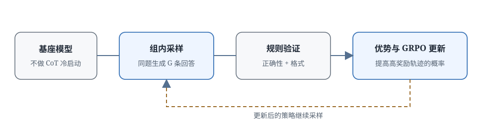

# 16.2 R1-Zero 纯强化学习推理

[16.1 节](./emergence-and-o1) 说明了推理模型怎样进入产品，以及 o1 如何通过大规模 RL 让模型学会在答案前展开思考。但 o1 没有公开完整训练细节，一个关键问题始终悬而未决：如果完全不给模型看人工编写的思维链（CoT），只给题目和可以自动验证的答案，强化学习到底能不能让模型自己学会展开推理？

[DeepSeek-R1 论文](https://arxiv.org/abs/2501.12948)在 2025 年 1 月公开了 R1-Zero 实验。它直接从预训练基座模型出发，不经过人工思维链的 SFT 冷启动，只用正确性奖励和格式奖励做 GRPO 训练。训练过程中，较晚的中间版本出现了更长的推理、自我检查和改换方法等行为；论文把其中一段主动重新评估解法的轨迹称为 "aha moment"。

[第 15 章](../chapter18_grpo/grpo-practice-and-mechanism) 已经介绍过 GRPO、RLVR 与 DAPO 的算法细节。本节不重复算法家族的一般介绍，而是沿着 R1-Zero 的训练线回答四个具体问题：训练从什么样的模型和数据开始，GRPO 怎样利用结果奖励更新策略，长推理与自我检查这种"没有被直接奖励"的行为为什么会出现，以及纯 RL 为什么仍然需要冷启动与后续对齐。

贯穿本节的是同一道题的反复采样。假设模型面对方程 $x^2-5x+6=0$：有的回答直接猜 $x=2$，有的完整算出 $x=2$ 或 $3$，有的公式正确但代入出错。验证器只检查最终解集，GRPO 再比较同组回答的奖励高低。随着训练一轮轮进行，能够稳定得到正确结果的推导方式会越来越常出现。



## 纯 RL 训练的起点

要让结果奖励提供有效的学习信号，训练起点必须同时具备三个条件：基座模型能生成候选解，题目有可靠的自动验证器，同一道题的采样结果有对有错。缺了任何一项，纯 RL 都无法启动。

R1-Zero 从预训练基座模型开始，没有先用人工思维链进行 SFT。训练数据主要是数学、代码和逻辑题；每道题都能通过标准答案、测试程序或规则验证器判断结果。

一次训练迭代包含四步：

```text
从题库采样问题 x
      ↓
当前策略 π_θ 对每个 x 生成 G 个回答 y_1,...,y_G
      ↓
规则验证器计算每个回答的正确性奖励与格式奖励
      ↓
GRPO 根据组内相对优势更新策略参数 θ
      └────────────► 下一轮采样
```

这条流程与传统 RLHF 的关键差别在奖励来源。RLHF 常用从人类偏好训练出来的奖励模型（RM）给整条回答打分；R1-Zero 使用**可验证奖励**（verifiable reward）：答案对不对可以用程序或规则确定判断，减少了奖励模型本身的判断误差。

### 基座需要具备候选生成能力

基座模型必须已经理解题目语言，并且能够输出看起来像解答的内容。完全随机的输出无法从结果奖励中学到任何东西，因为"怎样得到正确答案"根本不在模型的输出分布里。

这就是为什么 [16.1 节](./emergence-and-o1) 要区分"RL 创造能力"和"RL 激活能力"：如果基座在多次采样中偶尔能生成正确轨迹（哪怕概率只有 5%），RL 就有东西可以放大；如果基座 100 次采样全错，GRPO 也无从比较。

### 题目需要有自动验证器

数学题可以抽取最终答案并与标准答案比对，代码题可以运行单元测试，逻辑题可以用规则检查答案格式。验证器 $v(x,y)$ 必须满足：如果答案正确，它几乎一定判对；如果答案错误，它几乎一定判错。验证器本身有漏洞时，模型可能学会"欺骗验证器"而非真正解题。

### 同组采样需要有对有错

这是 GRPO 最关键的前提。如果对一道题采样 $G$ 次，结果全对或者全错，这道题在这一轮就提供不了学习信号，组内优势全部接近零，参数不会更新。

用 16.1 节那个二次方程的例子：基座模型 100 次采样中有 6 次正确、94 次错误，那么取 $G=8$ 时，一组里"有对有错"的概率非常高；正是这些同时包含正负样本的组，驱动了策略更新。

### 正确性奖励

数学题可以抽取最终答案并与标准答案比较，代码题可以运行测试。把验证器记为 $v(x,y)$，其中 $x$ 是问题，$y$ 是完整回答，最简单的奖励就是二值的：

$$
r_{\text{acc}}(x,y)=
\begin{cases}
1,& v(x,y)=\text{correct},\\
0,& v(x,y)=\text{incorrect}.
\end{cases}
$$

这个奖励的设计哲学很重要：它**只判断最终结果，没有指定模型必须用哪一种解法**，也没有提供每一步应该怎样推理的指导。模型需要在多次采样中自己发现：哪种行为模式更容易最终得到正确答案。奖励只看答案对错，不区分解法，模型因此会自行摸索出"先验算一遍不容易出错"这类策略。

### 格式奖励

训练还需要把推理部分与最终答案分开，否则验证器无法稳定地从长文本中抽取答案。格式奖励检查回答是否使用了约定的思考与答案标记：

```text
<think>
推理过程...
</think>
<answer>
最终答案...
</answer>
```

格式奖励解决的是机器解析问题，它不能替代正确性奖励。如果只优化格式，模型会产出结构完整但内容错误的回答。

一条回答的总奖励通常写成正确性奖励和格式奖励的加权和：

$$
r_i = r_{\text{acc}}(x,y_i) + \lambda_{\text{fmt}} \cdot r_{\text{fmt}}(x,y_i),
$$

其中 $r_{\text{fmt}}$ 是格式项，$\lambda_{\text{fmt}}$ 是格式奖励的权重。正确性主导方向，格式保证解析边界；两者的具体权重由训练配置决定。实际训练中正确性奖励的权重通常远大于格式奖励，避免模型"格式漂亮但答案错误"。

## GRPO 的组内比较机制

验证器给出了每条回答的分数后，下一步是把"这一组谁更好"变成参数更新的信号。GRPO 不训练独立的 Critic 网络来估计价值，而是直接在同一道题的 $G$ 个回答之间做相对比较。

对同一道题 $x$，当前策略生成 $G$ 个回答 $y_1,\ldots,y_G$，验证器分别给出奖励 $r_1,\ldots,r_G$。GRPO 用组内均值和标准差构造相对优势：

$$
\hat A_i=\frac{r_i-\operatorname{mean}(r_1,\ldots,r_G)}
{\operatorname{std}(r_1,\ldots,r_G)+\epsilon}.
$$

先把公式里每个符号的含义固定下来：

- **$r_i$:** 第 $i$ 条回答的奖励（正确性 + 格式）
- **$\operatorname{mean}(r_1,\ldots,r_G)$:** 组内平均奖励，代表"当前策略在这道题上的平均水平"
- **$r_i-\operatorname{mean}$:** 这条回答比组内平均水平好多少（正的 = 比平均好，负的 = 比平均差）
- **$\operatorname{std}+\epsilon$:** 用组内奖励的离散程度做归一化，让不同难度题目的优势信号可比

同组中高于平均奖励的回答得到正优势（$\hat A_i > 0$），低于平均奖励的回答得到负优势（$\hat A_i < 0$）。策略更新提高前者的生成概率，降低后者的生成概率。PPO 式的裁剪（clip）限制一次更新的幅度，KL 惩罚项则约束当前策略不要在一轮中离参考策略（SFT 模型或初始基座）过远。

### 四个回答的微缩例子

用四个回答走一遍这个公式，建立具体的数值感觉。

**例子 1：均衡组（两对对错）**

假设对一道题采样 4 个回答，奖励是 $(1,1,0,0)$（两个对、两个错）。

先算均值：
$$\operatorname{mean} = \frac{1+1+0+0}{4} = 0.5$$

再算标准差：
$$\operatorname{std} = \sqrt{\frac{(1-0.5)^2 + (1-0.5)^2 + (0-0.5)^2 + (0-0.5)^2}{4}} = \sqrt{0.25} = 0.5$$

标准化后的优势：
$$\hat A = \frac{(1-0.5,\ 1-0.5,\ 0-0.5,\ 0-0.5)}{0.5} = (1, 1, -1, -1)$$

前两个正确回答得到正权重 +1，后两个错误回答得到负权重 -1。直觉很清楚：做对比平均好，做错比平均差。

**例子 2：不均衡组（三对一错）**

再算一组更不均衡的情况。若奖励是 $(1,1,1,0)$（三个对、一个错）。

$$\operatorname{mean} = \frac{1+1+1+0}{4} = 0.75$$

$$\operatorname{std} = \sqrt{\frac{3\times(1-0.75)^2 + (0-0.75)^2}{4}} = \sqrt{\frac{3\times0.0625 + 0.5625}{4}} = \sqrt{0.1875} \approx 0.433$$

$$\hat A = \frac{(0.25,\ 0.25,\ 0.25,\ -0.75)}{0.433} \approx (0.58,\ 0.58,\ 0.58,\ -1.73).$$

唯一错误的回答得到很强的负优势 -1.73，它离组内平均最远，受到的惩罚也最重。三个正确回答都得到正优势，但数值不大（0.58），因为它们在这个组里只是"略高于平均"。

**例子 3：全对或全错**

若奖励变成 $(1,1,1,1)$，每个回答减去均值后都是 0，优势 $\hat A_i = 0$ 对所有 $i$。这道题在当前批次就不再提供区分信号。同样，如果奖励是 $(0,0,0,0)$，均值为 0，标准差为 0，公式中的 $\epsilon$ 用来避免除零错误，结果优势也接近 0。

:::details 用 Python 验证这三个例子

```python
import numpy as np

def grpo_advantage(rewards, eps=1e-6):
    mean = np.mean(rewards)
    std = np.std(rewards)
    return (rewards - mean) / (std + eps)

print("例子1（两对错）:", grpo_advantage([1, 1, 0, 0]))
print("例子2（三对一错）:", grpo_advantage([1, 1, 1, 0]))
print("例子3（全对）:", grpo_advantage([1, 1, 1, 1]))
```

:::output
例子1（两对错）: [ 1. 1. -1. -1.]
例子2（三对一错）: [ 0.57735 0.57735 0.57735 -1.73205]
例子3（全对）: [0. 0. 0. 0.]
:::
:::

### 什么样的题目提供学习信号

从上面的例子 3 可以看到：如果一组回答全部正确或者全部错误，这道题在这一轮就不提供梯度。有效题目通常处在当前模型"有时答对、有时答错"的难度区间。

设单题答对概率为 $p$、组大小为 $G$，一组全部同号（全对或全错）的概率是 $p^G+(1-p)^G$。取 $G=8$ 时：

- **$0.9$（简单题）**
  - 全对或全错的概率 $p^8+(1-p)^8$: 约 $0.43$
  - 组内学习信号: 经常消失
- **$0.7$**
  - 全对或全错的概率 $p^8+(1-p)^8$: 约 $0.06$
  - 组内学习信号: 大部分时候有
- **$0.5$（中等题）**
  - 全对或全错的概率 $p^8+(1-p)^8$: 约 $0.008$
  - 组内学习信号: 几乎总有
- **$0.3$**
  - 全对或全错的概率 $p^8+(1-p)^8$: 约 $0.06$
  - 组内学习信号: 大部分时候有
- **$0.1$（难题）**
  - 全对或全错的概率 $p^8+(1-p)^8$: 约 $0.43$
  - 组内学习信号: 经常消失

难度居中的题目（$p$ 在 $0.3\sim0.7$ 之间）让组内几乎总会出现对错混合，这正是梯度的主要来源。因此，纯 RL 训练还需要管理题目难度的分布：

- **过易题**（$p>0.9$）保留少量用于能力回归测试，大部分降低采样权重
- **难度适中的题**（$0.2<p<0.8$）提供主要的梯度信号
- **过难题**（$p<0.1$）需要拆分、补充工具，或等待基座模型能力提高后再加入

这与 [第 15 章 DAPO](../chapter18_grpo/deepseek-dapo) 的动态采样属于同一问题：把计算集中到仍有组内差异的题目上，而不是在已经会做或完全不会做的题上浪费算力。

## 自我检查如何被间接强化

组内比较能够提高正确回答的概率，但 GRPO 的奖励函数里没有出现"反思""检查""验算"这些词。为什么训练后模型会自发学会这些行为？要理解这一点，需要观察哪些生成行为会让最终结果奖励更高。

训练早期，回答通常很短，模型倾向于直接猜一个结果，因为短回答生成速度快，而且模型还没有"验算能提高正确率"的经验。高奖励样本逐渐让策略发生变化：列出条件、展开代数、检查计算、尝试替代方法的轨迹，最终答对的概率更高。

用一个具体的因果链说明：假设训练进行到某个阶段，模型有两种生成长度的倾向：

- **短：直接猜答案**
  - 生成概率: $0.7$
  - 最终正确率: $0.1$
  - 对总奖励的贡献: $0.7\times0.1=0.07$
- **长：推导后再验算**
  - 生成概率: $0.3$
  - 最终正确率: $0.6$
  - 对总奖励的贡献: $0.3\times0.6=0.18$

当前策略的平均正确率约为 $0.07+0.18=0.25$。长模式的贡献（0.18）已经大于短模式（0.07），但模型仍然更倾向于输出短回答。经过多轮 GRPO 更新后，长模式因为最终更容易得到奖励 1，其生成概率会逐渐提高，短模式被抑制。这不需要奖励函数明确写"长回答 = 好"，只需要"长回答更容易答对"这个因果关系成立。

随着训练继续，可以观察到几类可识别的推理行为逐步出现：

1. **推理链变长**：模型在给答案以前展开更多中间步骤，不再直接猜结果。
2. **重新检查**：模型会回看前面的计算，如"等等，让我再算一遍判别式"，发现矛盾后修改结论。
3. **切换方法**：当前路线走不通时（如因式分解看不出规律），转向另一种方法（求根公式）。
4. **自我验证**：把得到的答案代回原方程，检查是否满足题目条件。

这些行为没有被逐步标注，却受到最终正确性奖励的间接选择。某种行为只要持续提高成功率，就会在后续采样中更常出现。用训练循环的伪代码把这条因果链连起来：

```python
for step in range(num_steps):
    # 1. 采样一批题目，每题生成 G 条回答
    batch = sample_problems()
    responses = {q: [policy.generate(q) for _ in range(G)] for q in batch}

    # 2. 验证器只看最终答案与格式，没有"检查"这个标签
    rewards = {q: [accuracy_reward(q, y) + format_reward(y)
                   for y in responses[q]] for q in batch}

    # 3. 组内标准化得到相对优势（无需独立 Critic）
    advantages = {q: group_normalize(rewards[q]) for q in batch}

    # 4. 沿优势方向更新策略：正优势的整条轨迹更常出现
    policy.update(responses, advantages)
```

注意第 2 步：奖励函数里没有"反思""检查""验算"这些词。检查行为是在第 4 步被强化的：包含检查步骤的整条回答（从 `<think>` 到 `</think>` 再到 `<answer>`）更容易答对，因此整条轨迹的生成概率被提高，包括其中那些"等等，我再验算一下"的文字。

### Aha Moment 是什么

R1-Zero 报告中最引人注目的现象是 Aha Moment：模型在一段推理中主动停下来检查，并写出类似"等等，我刚才好像算错了，让我换一种方法重新验证"的内容。这是结果奖励间接强化反思行为的可见证据。

但需要正确理解 Aha Moment 的含义：它说明结果奖励可以强化反思行为，但**不能证明强化学习从零创造了推理能力**。基座模型已经通过预训练见过证明、代码调试和自我修正的文本，比如教材里的"我们来验证一下"、代码教程里的"让我们测试一下"。纯 RL 的作用是让这些潜在的、低概率的行为更稳定地服务于可验证任务，而不是凭空教会模型什么是"验证"。

[16.1 节](./emergence-and-o1) 因此区分了"相对于训练数据的涌现"和"相对于基座能力的创造"。

## 纯 RL 的局限与后续对齐

R1-Zero 展示了一个激动人心的结果：不依赖人工思维链 SFT，纯 RL 也能强化出推理行为。但 R1-Zero 本身是一次训练机制的验证实验，还不是完整的产品后训练流程。结果奖励回答了"答案是否通过验证"这一个问题，没有回答更多产品层面的问题。

公开结果同时暴露了纯 RL 的几个边界：

- **语言混合问题**：推理链可能混合多种语言（中文、英文、代码片段），阅读体验不稳定。
- **长度失控**：回答为了提高正确率会不断变长（"多验算几次总没错"），增加延迟和部署成本。
- **格式漂移**：经过多轮更新后，模型可能不严格遵守约定的 `<think>`/`<answer>` 格式，使答案抽取失效。
- **覆盖范围有限**：规则奖励只覆盖可验证任务（数学、代码），不能直接处理写作、帮助性与安全偏好等开放问题。
- **奖励漏洞**：验证器存在漏洞时，模型可能学会利用规则（如输出特定格式字符串骗过抽取器）而没有提高真实能力。

完整的 DeepSeek-R1 因此在 R1-Zero 的基础上增加了几个阶段：

1. **冷启动 SFT**：用少量高质量（包括人工编写和模型生成的）推理样本做微调，建立可读格式与基本行为模式
2. **推理 RL**：继续用纯 RL 提高可验证任务能力（即 R1-Zero 阶段）
3. **拒绝采样**：用模型生成大量样本，筛选正确且高质量的作为 SFT 数据
4. **通用对齐**：加入人类偏好数据，修正语言风格、有用性和安全性

冷启动样本负责建立"及格线"，纯 RL 负责在可验证任务上冲高，后续数据回流和对齐再把语言、风格与安全问题修正到产品可用水平。这一分工也说明后续各节为什么必要：

- **推理时多算是否总能提高正确率:** [16.3 推理时计算扩展：Test-Time Scaling](./test-time-scaling)
- **怎样限制思考长度并在快慢模式切换:** [16.4 Hybrid Thinking：双模式与预算控制](./hybrid-thinking)
- **模型能否根据问题自动分配计算:** [16.5 自适应思考：模型自己决定算多久](./adaptive-thinking)
- **推理链是否应该展示和接受过程对齐:** [16.6 推理链的可见性与过程对齐](./cot-visibility-alignment)

## 本节小结

R1-Zero 用一次公开实验说明：不给人工思维链、只给可验证的结果奖励，推理行为也能被强化出来。但这并不意味着 RL 从零创造了所有能力，它依赖基座模型已经具备的候选生成能力。

- **训练起点三条件**：基座模型能生成候选解、题目有可靠的自动验证器、同一道题采样能得到有对有错的结果，三者同时满足纯 RL 才能启动。
- **奖励构成**：正确性奖励只判断最终结果（对=1、错=0），格式奖励保证答案可以被稳定抽取；两者都不指定模型应该用什么解法。
- **组内比较机制**：GRPO 用组内均值和标准差构造相对优势，省去了独立 Critic；全对或全错的题目不提供信号，难度居中的题才是梯度来源。
- **行为的间接强化**：长推理、重新检查、方法切换和自我验证因为提高了最终正确率而被间接选择，Aha Moment 是这一过程的可见片段而非凭空创造。
- **纯 RL 的边界**：可读性、长度失控、格式漂移、开放任务覆盖和奖励漏洞，都需要冷启动 SFT、拒绝采样和后续对齐来补救。

训练端有了会展开推理的模型，下一个问题转移到部署端：参数已经固定不再更新时，额外的推理计算应该怎样花才能最有效地提高成功率？[16.3 推理时计算扩展：Test-Time Scaling](./test-time-scaling) 讨论并行采样、顺序修订和树搜索三种基本用法。
