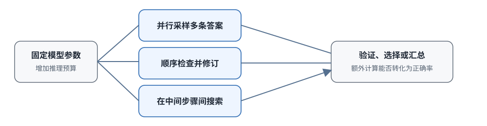

# 16.3 Test-Time Scaling

前两节里，我们看到推理模型为什么会在给答案之前展开思考（16.1），以及 R1-Zero 怎样只用结果奖励和 GRPO 就激发出推理能力（16.2）。训练出来的模型会主动展开思考了，但部署到服务里立刻会遇到一个实际问题：同一个模型面对两种请求："把 hello 翻译成中文"和一道 AIME 竞赛题。如果都让它生成一万个 token，前者白白浪费算力，后者的思考时间却还不一定够。

这就是**推理时计算扩展**（Test-Time Compute Scaling）要解决的问题：模型参数已经训练完固定不变，系统还能不能在推理阶段通过调整计算量来适配不同难度的任务。参数固定以后，增加推理计算有三种基本用法：**并行生成更多候选**、**让一条答案反复修订**、**在多个中间步骤之间做树搜索**。本节先回答"额外计算为什么可能有效"，再分别看这三种用法怎么工作，最后讨论收益什么时候会饱和。



## 推理时计算扩展能解决什么

先看一个最朴素的场景：让模型解二次方程 $x^2+5x+6=0$，它第一次算出 $x=-2$ 和 $x=-3$（正确），第二次却在符号上出错，写成 $x=2$ 和 $x=3$。模型掌握了解法：知道求根公式，也知道怎么因式分解，只是这次生成时中间某一步出了差错。让它再做一遍或者检查一遍，往往就能得到正确答案。

但并非所有失败都能这样补救。两种不同性质的失败必须区分开：

- **知识型失败**
  - 原因: 模型根本没掌握解题所需的知识或方法
  - 解决方法: 只能靠继续训练（更多数据、更大模型）解决
- **采样型失败**
  - 原因: 模型掌握了方法，但这次生成时选错了路线、算错了数字、或没检查
  - 解决方法: 可以靠增加推理计算（多采样、多修订、多搜索）补救

训练计算和推理计算发生在不同阶段，解决的问题也不同：

- **训练计算**：更新模型参数，让模型学会新的知识和策略，提高模型的能力上限。
- **推理计算**：参数完全不动，只在当前这道题上增加采样、检查、修订或搜索，让模型更接近自己的能力上限。

早期的语言模型"一次生成一条短答案"，推理计算近似固定成本，给什么题都用差不多的 token。推理模型改变了这一点：同一道题上可以生成更长的思考轨迹或更多候选答案，推理计算从固定开销变成了可以灵活分配的预算。问题随之变成：当模型能力已经确定时，怎样分配推理预算才能最有效地提高当前任务的成功率？

### Snell 等人的预算分配研究

2024 年，Snell 等人在论文 [Scaling LLM Test-Time Compute Optimally](https://arxiv.org/abs/2408.03314) 中系统回答了这个问题。他们做了一组干净的对照实验：

**实验设置**：固定一个基座模型（Llama-3-8B-Instruct），在不同难度的数学题上比较两种提升路径：

- **路径 A**：不换模型，但增加推理算力：让模型生成 $N$ 个候选解，再用验证器选最好的（best-of-N）
- **路径 B**：不增加推理计算，但改用参数更多、能力更强的模型

实验得到三个结论，至今仍在指导推理系统的设计：

1. **恰当分配推理计算，可以让小模型超过"分配不当"的更大模型**。在论文给定的实验条件下，给小模型足够的推理预算并配合好的验证器，效果能超过推理预算给得很死板的更大基线。
2. **如果基座模型根本产不出正确候选，继续加有限预算的收益会快速下降**。如果单次正确率 $p$ 本身接近 0，再多采样也覆盖不到正确答案。
3. **没有通用的分配策略**。简单题、中等题、难题适合的预算和分配方式都不一样；验证器越可靠，越值得把预算花在并行采样上。

这组实验第一次定量说明了训练计算和推理计算是互补关系：训练决定模型的能力上限，推理计算决定模型接近这个上限的程度。

## 三种推理计算的用法

固定了一份推理预算以后，有三种基本的花法。仍然用解数学题的场景来理解。

### 并行采样：Best-of-N

最直接的想法是一次可能出错，就独立生成 $N$ 个答案，再用验证器从中挑出正确的。这就是 **best-of-N** 的思路。

假设模型单次独立生成正确答案的概率是 $p$，$N$ 条候选全部错误的概率是 $(1-p)^N$，因此至少出现一条正确候选的概率为

$$
P(\text{至少一次正确})=1-(1-p)^N.
$$

这个量通常称为**覆盖率**，它给出并行采样的理论上限。取 $p=0.2$（单次正确率 20%），覆盖率随 $N$ 的变化如下：

- **$1$**
  - 至少一次正确的概率: $20.0\%$
  - 再增加一条候选的边际收益: $+16.0\%$
- **$2$**
  - 至少一次正确的概率: $36.0\%$
  - 再增加一条候选的边际收益: $+12.8\%$
- **$4$**
  - 至少一次正确的概率: $59.0\%$
  - 再增加一条候选的边际收益: $+8.2\%$
- **$8$**
  - 至少一次正确的概率: $83.2\%$
  - 再增加一条候选的边际收益: $+3.4\%$
- **$16$**
  - 至少一次正确的概率: $97.2\%$
  - 再增加一条候选的边际收益: $+0.6\%$

最后一列的边际收益有一个闭式表达。第 $N+1$ 条候选只有在前面 $N$ 条全部出错时才能带来新收益，因此它的贡献是

$$
P(N+1)-P(N) = p\,(1-p)^N.
$$

其中 $p$ 是单条候选正确的概率，$(1-p)^N$ 是前 $N$ 条全部错误的概率。代入 $p=0.2$：第 2 条的边际收益是 $0.2\times0.8=16\%$，和表里一致；到第 17 条只剩 $0.2\times0.8^{16}\approx 0.6\%$。每多加一条候选，边际收益就乘一次 $(1-p)$，按几何级数衰减，而每条候选的成本是固定的。这就是"边际收益递减"的具体含义，也给出了停止采样的定量依据：当 $p(1-p)^N$ 低于一条候选的成本时，继续采样不再划算。

并行采样的伪代码非常简单：

```python
# 并行采样示意
candidates = [model.generate(prompt) for _ in range(N)]  # 独立生成 N 个
scores = [verifier.score(prompt, c) for c in candidates] # 给每个打分
best = candidates[argmax(scores)]                        # 选分数最高的
```

这里有一个关键前提：必须有一个**可靠的验证器**（verifier）。覆盖率只保证"正确答案出现在候选里"，能不能把它挑出来取决于验证器。验证器把错的当成对的，$N$ 再大也没用。这正是第 17 章过程奖励模型（PRM）要解决的问题。

::: details 没有验证器时的替代：多数投票
没有好的验证器时，可以用**多数投票**（self-consistency）作为替代：生成多条回答，把最终答案规范化（统一成小数或最简分数），统计哪个答案出现次数最多就选哪个。

例如模型解同一道题给出 5 个答案：

```text
x = -3,  x = -2,  x = -3,  x = 3,  x = -3
```

规范化后统计：$-3$ 出现 3 次，$-2$ 出现 1 次，$3$ 出现 1 次，多数票投给 $-3$。

多数投票隐含一个假设：不同推理路径独立犯错时，正确答案更容易被多条路径共同到达。它对"一题多解、殊途同归"的题目有效，但对系统性错误无能为力：所有路径在同一个地方犯同一个错时，多数票选出的仍是错误答案。
:::

### 顺序修订：反复改错

并行采样每次都从题目重新开始，丢掉了已经做对的部分。模型解方程时前四步代数变形都对，只在最后一步合并同类项时出错，并行采样会把正确的四步一起扔掉重新生成。

顺序修订（sequential revision）换了个思路：先生成一个初始解，让模型（或另一个批评模型）找出其中的问题，再针对问题产生下一版，反复迭代 $K$ 轮：

```python
# 顺序修订示意
solution = model.generate(prompt)           # 先生成第一版
for _ in range(K):
    feedback = model.critique(prompt, solution)  # 批评：找出问题
    solution = model.revise(prompt, solution, feedback)  # 修订：改正问题
```

顺序修订**复用了上一版已经做对的工作**，只修改有问题的部分，适合局部错误容易定位、局部修改比从头生成便宜的任务：代码里有一个 bug 时，只需要修那一行，不必重写整个文件。

两种方法的成本结构也不一样。设一条完整解答的生成代价是 $L$ 个 token：并行采样生成 $N$ 条候选的总开销是 $N\cdot L$，但 $N$ 条可以分到不同 GPU 上同时跑；顺序修订的开销是 $L$ 加上 $K$ 轮批评与修订，每轮只针对局部问题，通常远短于 $L$，但 $K$ 轮只能串行等待。前者用总计算换并行度，后者用串行延迟换计算复用。

它的缺点同样明显：

1. **延迟累积**：每一轮都依赖上一轮的结果，$K$ 轮修订意味着串行等待时间变成 $K$ 倍。
2. **路径依赖**：如果第一步方向就错了，后续修订是在错误的基础上修补，可能越修越偏。
3. **批评可能出错**：批评模型判断失误、把对的当成错的改，后续修订就全部偏离。

两种方法在不同错误位置上的取舍：

- **最后一步符号错误**
  - 并行采样表现: 浪费：连正确步骤一起重生成
  - 顺序修订表现: 高效：只改最后一步
- **第一步方法选错**
  - 并行采样表现: 高效：换一条路就可能走对
  - 顺序修订表现: 低效：在错误前缀上修补，越走越远

### 树搜索：结合广度与深度

并行采样和顺序修订各有盲区：前者浪费前缀，后者困在单条路径上。**树搜索**（tree search）把两者结合起来：把推理过程展开成一棵树，每个节点是一个中间步骤，从同一个前缀可以尝试多个后续分支，用验证器给各个节点打分，把更多预算集中到评分高的路径上。

具体算法（Beam Search、Tree of Thoughts、MCTS 等）在 17.5 节展开。这里先记住它解决的核心问题：**怎样在复用中间结果的同时，不被困在单条路径上**。

## Deep Think 把并行思考做成产品

并行采样和顺序修订的原理都很直接，但做成产品还有一批工程问题：多条路径怎么共享 GPU？什么时候停止继续采样？最后由谁整合多条路径的结论？

Google 在 2025 年发布的 [Gemini Deep Think](https://blog.google/products-and-platforms/products/gemini/gemini-2-5-deep-think/) 是并行推理产品化的一个典型案例。

### Deep Think 的工作方式

根据 Google 的公开说明，Deep Think 系统会**同时考虑多个假设**，允许候选路径在最终回答之前被修订或组合。公开资料没有披露完整算法细节，无法断定内部用的是 best-of-N、树搜索还是某种跨路径机制，但从接口行为可以抽象出三项核心系统工作：

1. **同时生成多条独立的推理路径**
2. **比较或组合不同路径中的信息**（不是简单选一个，可能包含交叉验证或信息整合）
3. **在预算内决定何时停止并生成最终回答**

如果这 $N$ 条路径被分配到独立的计算资源上，它们可以并行生成。但要注意一个常见误区：

> 并行缩短的是**墙钟等待时间**，不会消除**总计算量**。该花的计算量一点不少，只是被摊到多个 GPU 上同时执行。

路径越多，系统要处理的工程问题也越多：GPU 调度、候选去重、评价器吞吐量、停止条件判断。

### 产品分数的正确解读

Google 报告专用 Deep Think 版本在 2025 年 IMO（国际数学奥林匹克）达到金牌区间，后续版本也公布了 HLE、ARC-AGI-2、Codeforces 等基准的成绩。这些结果说明并行思考是有效的推理预算方案，但要注意：

> 这些分数不能单独证明收益来自"多少条路径"或"哪种聚合算法"。

评测时可能同时使用了代码执行、外部搜索和不同的预算设置。比较两个系统时，必须把这些条件一并记录，否则分数对比没有意义。

### 什么时候停止继续采样

最简单的实现是固定生成 $N$ 条路径，不管题目难易都跑满 $N$ 条。这样简单题也会浪费预算：已经有 5 条路径得出同一个可验证的答案（解出 $x=2$ 并代入验证正确），继续生成第 6、7、8 条没有意义。

动态停止策略会在每一批候选结束后检查三件事：

1. **是否已经出现可验证的正确答案**：数学题答案代入验证通过、代码所有测试通过。
2. **高分候选之间是否已经一致**：前三名候选答案都相同时，继续采样出新答案的概率很低。
3. **继续增加候选还能带来新解法吗**：新生成的候选都在重复旧思路时，可以停止。

答案已经通过外部检查且候选趋于一致时可以提前停止；如果候选仍然互相冲突、验证器又分不出对错，继续采样的价值通常也很低，这时更需要工具、外部搜索或人工规则来补充反馈。

停止逻辑必须和**任务验证器**、**最大 token 限制**、**墙钟超时**、**失败回退策略**一起设计。

## 什么时候停止加计算

候选数、修订次数、搜索节点都可以继续增加，但正确率不会永远按同样的比例上升。部署系统时，要比较的是：下一份计算还能提高多少成功率，它会增加多少延迟和费用。

额外计算会增加生成 token、验证器调用和硬件占用，但**延迟不一定和总计算量同比增长**：并行采样用更多 GPU 可以换来更短的墙钟等待，但总 token 费用仍在增长；顺序修订按轮数直接增加串行延迟，无法靠加 GPU 解决。

部署时应该同时监控五个指标：

- 任务成功率
- 墙钟延迟（用户等待时间）
- 总 token 消耗
- 验证器调用次数
- 单次请求费用

### 边际收益一定会递减

无论采用哪种分配方式，额外计算的边际收益最终都会下降：

- **简单题**：少量计算后已经答对，继续生成只是在重复已有的正确路径，不会再提升成功率。
- **中等题**：更多候选或一次修订可能纠正偶然错误，收益先升后降。
- **超出基座能力的难题**：模型产不出正确路径，增加采样只是在产生更多相似的错误，收益从一开始就很低。

前面的覆盖率表已经给出并行采样的定量例子：$p=0.2$ 时，第 16 条候选的边际收益只剩 0.6 个百分点。顺序修订和树搜索遵循同样的规律：修订轮数越多，剩余可修复的错误越少；搜索越深，未探索分支的期望价值越低。

因此，推理时计算永远不能无限替代训练计算。两者的关系是：

> - **训练计算**决定能力上限：模型最多能做到什么。
> - **推理计算**决定接近上限的程度：模型这次实际发挥出了多少。

基座模型没有掌握解题所需的知识或操作（$p \approx 0$）时，再多采样和修订也难以产生正确路径。推理计算必须建立在基座能力已经具备的基础上。

::: details 任务类型对预算设置的影响
预算设置不能只看"这是数学题还是翻译题"这种表面分类，还要看三个因素：

1. **验证器是否可靠**：有可靠验证器（可以运行代码并通过测试）时，best-of-N 非常有效；没有验证器时，多数投票是保底方案。
2. **单次成功率是多少**：$p$ 太低时，先提升 $p$（训练或换模型）比增加 $N$ 更划算。
3. **任务失败的代价是多少**：医疗、法律、代码生产等场景失败代价高，可以给更多预算；闲聊和简单问答场景，快速给出一个合格答案更重要。
   :::

## 本节小结

推理时计算扩展提供三种可以调节的推理资源：并行候选数量、单条推理链的修订次数、搜索树的规模。它们都在"模型已经会，但这次没发挥好"时给模型更多发挥的机会。

- **两类失败要分清**：缺知识的失败只能靠训练解决；选错路线、算错数字这类采样型失败才能用推理计算补救。
- **覆盖率公式** $1-(1-p)^N$ 给出并行采样的理论上限，实际收益还取决于验证器能否把正确答案挑出来；边际收益随 $N$ 递减。
- **三种计算分配**：并行采样换广度，适合方法可能选错的早期步骤；顺序修订换深度，适合局部错误容易定位的场景；树搜索复用中间结果，结合两者。
- **并行不省总算力**：Deep Think 这类系统用更多 GPU 换更短的等待时间，总计算量不会消失。
- **停止条件是设计出来的**：部署时同时监控成功率、延迟、token 和费用，在边际收益低于边际成本的地方停下。

任务越难、模型单次成功率越高但又不到 100% 时，增加推理资源越可能带来收益；基座能力不足或者任务已经很简单时，收益会快速降低。

下一节把这条规律用到真实部署中：同一个模型怎样在"直接回答"和"深度思考"之间切换，又怎样用思考预算来限制延迟和成本。这就是 Hybrid Thinking 要解决的问题。
