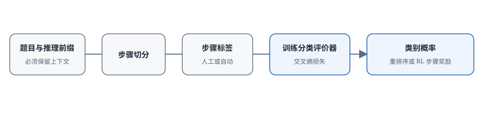

# 17.2 判别式 PRM

上一节我们看到了那个九步证明的问题：前五步都对，第六步漏了一个平方，后面又碰巧绕回了正确结论，结果奖励给整条轨迹打 1 分，中间的错误就被掩盖了。最直接的解决办法是在每一步旁边判断对错：不需要写长篇评语，只需要告诉模型："这步对了，可以继续"，或者"这步错了，从这里重新来"。

这就是判别式 PRM 的核心思路：把"这一步能不能继续"变成一个**分类问题**。给它看题目、前面已经写好的推理，再加上当前这一步，它输出 good（正确）、bad（错误）、neutral（中性）三个概率。训练好以后，它看一眼新的步骤，几毫秒就能给出分数，适合大规模 RL 训练或者给几十上百个候选解排序。

但问题也跟着来了：怎么把一条完整的推理切成能标注的"步骤"？标注 80 万个步骤要花多少成本？训练出来的分类器换个领域（比如从数学换到代码）还能用吗？本节沿着一条完整的数据生产线走一遍：先收集标注数据，再训练分类器，然后看这些分数怎么用，最后讨论哪些环节会出问题。

判别式 PRM 把逐步检查改写成分类任务：输入题目 $q$ 和截至当前步骤的推理前缀 $o_{\leq i}$，输出 good、bad、neutral 三类的概率。为什么必须带前缀？因为单独看"所以 $p$ 是偶数"这句话没有意义。它对不对，完全取决于前面推导出了什么条件。输出是概率，因此可以把各步分数聚合成整条回答的排序分，也可以直接作为 RL 的步骤奖励。



## 如何收集过程监督数据

分类器要判断步骤对错，先看大量带标签的例子。还是用 $\sqrt{2}$ 证明的第六步来说：标注员需要看到题目和前五步，才能判断第六步那个等式变换对不对。

为什么不让标注员直接看完整条推理？因为如果他们看到最后结论是对的，判断就会受影响，心里会想"答案都对了，中间应该没问题吧"。这叫后见偏差。也不能只给看当前这一句话，因为脱离了上下文，"所以 $q$ 是偶数"根本没法判断。所以标注界面通常只显示到当前步骤为止。

### 标注成本差多少

OpenAI 在 2023 年的论文 [Let's Verify Step by Step](https://arxiv.org/abs/2305.20050) 里系统比较了两种监督方式。差别不在于模型大小，而在于把监督信号放在哪里：

- **ORM（结果奖励）**
  - 标注什么: 最终答案对错
  - 一条解答有几个标签: 1 个
- **PRM（过程奖励）**
  - 标注什么: 中间每步对不对
  - 一条解答有几个标签: 好几个甚至十几个

两种评价器都用来给模型生成的候选解排序。论文发现，随着模型规模和标注量增大，过程监督在他们的实验里持续优于结果监督；用完整数据训练的 PRM 在 MATH 测试集的一个代表性子集上，配合 Best-of-N 搜索解决了 78% 的问题。注意这个 78% 不是说模型一次就能做对 78%。它是生成了很多候选，再用 PRM 挑最好的那个，不能直接当成单生成准确率，也不能外推到其他任务。

### PRM800K 怎样记录步骤标签

[PRM800K](https://github.com/openai/prm800k) 是 OpenAI 公开的步骤级标注数据集，也是后面很多工作的基础。它的规模是：

- **800K** 个步骤级标注
- 来自 MATH 数据集里题目的模型解题过程
- 每个步骤标成三种状态之一：
  - **good**（正确）：这步推理没问题，可以继续
  - **bad**（错误）：这里出错了，应该停下或者回退
  - **neutral**（中性）：可能是个过渡步骤，没明显错但也没推进，不评价对错

数据收集沿着一条解题轨迹一步步进行：

1. 先让基座模型生成候选步骤或者完整解题过程
2. 把这些候选整理成可以独立判断的步骤（切分方式后面讨论）
3. 标注员看着原题和前面的步骤，给当前这步打 $+1$、$0$ 或 $-1$
4. 发现第一个错误以后可以停，也可以改写后面的步骤，那些容易混淆的样本留到下一轮主动学习

::: details 80 万步标注是多大的工作量
OpenAI 没有公开 PRM800K 的具体成本，可以粗略估算一下：假设一个熟练标注员平均每步检查 30 秒（包括读上下文、判断、选标签），那么

- 80 万步 × 30 秒/步 = 24,000 小时
- 按一个人一年工作 2000 小时算，大约是 **12 人年**的工作量

这还没有算培训标注员、复核争议样本、抽检质量的管理成本。实际项目里，标注预算应该优先花在最容易出错、最能区分好坏候选的步骤上。
:::

## 如何训练步骤分类器

有了带标签的步骤数据，接下来训练分类器。这个分类器本质上是一个语言模型，因为它需要读懂长前缀的上下文。关键是训练目标的设计。

### 模型架构

分类器可以直接用现成的语言模型架构，利用它处理长上下文的能力，在当前步骤的末尾输出一个分类结果或者标量分数。输入格式大致是 `<题目> <截至第i步的解答>`，输出是三个类别的概率。

公开论文的重点是比较过程监督和结果监督的效果，具体的基座模型没有公开。后面的开源工作比如 [Math-Shepherd](https://arxiv.org/abs/2312.08935) 也用开源 LLM 做过类似的过程奖励模型。无论基座多大、评分头怎么设计，有一个要求是必须的：分类器要能看到当前步骤之前的所有上下文。

### 训练目标

对第 $i$ 个步骤，模型输出 good、bad、neutral 三个概率。训练用交叉熵损失，目标是让人工标注的那个类别的概率尽可能高：

$$\mathcal{L}_{\text{PRM}} = -\sum_{i} \sum_{c \in \{good, bad, neutral\}} y_{i,c} \log p_\theta(c \mid q, o_{\leq i}, s_i)$$

其中 $y_{i,c}$ 是人工标注的 one-hot 标签：如果第 $i$ 步标了 good，只有 good 对应的位置是 1，其他都是 0，整个求和就剩一项 $-\log p_\theta(\text{good} \mid \cdots)$。模型给 good 的概率越接近 1，损失越小。

用几个具体的概率值感受一下损失大小。当标签是 good 时，损失是 $-\log p_\theta(\text{good})$：

- **$0.95$**
  - 损失 $-\log p$: $\approx 0.05$
  - 含义: 几乎不惩罚，判断很准
- **$0.70$**
  - 损失 $-\log p$: $\approx 0.36$
  - 含义: 温和惩罚，还能更好
- **$0.10$**
  - 损失 $-\log p$: $\approx 2.30$
  - 含义: 强烈惩罚，严重错判

注意梯度分布：从 0.7 提到 0.95，损失只减少约 0.31；但从 0.1 提到 0.7，损失减少约 1.94。这个不对称直接来自 $-\log p$ 的导数：

$$
\frac{d}{dp}(-\log p) = -\frac{1}{p}.
$$

$p$ 越小，曲线的斜率越陡：在 $p=0.1$ 处斜率是 $-10$，在 $p=0.95$ 处只有约 $-1.05$，相差近 10 倍。也就是说，把概率从 0.1 推高一点换来的损失下降，远大于在 0.95 附近再推一点。交叉熵因此会把大部分梯度花在纠正严重错判上，已经判断得差不多的样本，得到的更新很小。

### 训练数据增强

人工标注很贵，80 万步不是谁都标得起。标签不够的时候，有几种常见的补充方法：

- **自动标注（银标签）**：用更强的评价模型，或者让模型多 rollout 几次看结果，给未标注的步骤估计一个标签。这种标签带有噪声
- **合成负样本**：从已知正确的解题过程里，故意生成一些"看起来像对但其实错了"的步骤当负例
- **数据混合**：把 PRM800K 和 Math-Shepherd 等其他开源数据集混在一起用

这些方法各有优劣：银标签省钱但有噪声，合成数据可控但可能不够真实，实际使用时要在验证集上检验。

## 如何用于答案选择与 RL

分类器输出的是每一步的类别概率，系统拿到这些概率以后主要有两大场景：推理时给多条候选解排序（选最好的输出），训练时把步骤分数转成 RL 的奖励信号。两种用法用的是同一个 PRM，但聚合方式和风险不一样。

### Token 级与步骤级重排序

最直接的用法是**重排序（Re-ranking）**：先生成 $N$ 条完整的候选推理（$N$ 通常是 4 到 64，也有更大的），然后用 PRM 给每条的每一步打分，聚合成总分，选总分最高的那条当最终答案。

流程三步：

1. **生成**：让基座模型对一道题生成 $N$ 个候选解
2. **打分**：PRM 给每个候选的每一步打分
3. **选择**：挑总分最高的那个输出

这里 PRM 只负责排序，不替代生成模型。候选越多，出现至少一条正确解的概率就越高，但生成和打分的成本也跟着涨。这就是为什么论文用 Best-of-N 曲线比较 ORM 和 PRM，而不是直接拿一个多候选结果当单次准确率。在那个代表性 MATH 子集上，用完整过程监督的模型在论文的大规模候选设置下达到了 78%，并且在不同候选预算下都优于对应的结果监督模型。

#### Token 级打分与步骤级打分

PRM 重排序有两种打分粒度：

- **Token 级**：每个 token 都打一个分，整条回答的总分是所有 token 分数的聚合（mean、sum、min）
- **步骤级**：每个推理步骤打一个分，总分是各步骤分数的聚合

PRM800K 对应的是步骤级判断：评价器在每个步骤末尾给分，再把这些分数合成整条解答的排序依据。

#### 聚合方式怎么选：mean、min 还是 product

有了每步的分数，还要决定怎么把它们合成一个总分。设一条解答共 $T$ 步，第 $i$ 步的分数是 $p_i$，三种常见聚合写成公式是：

$$
\text{mean} = \frac{1}{T}\sum_{i=1}^{T} p_i, \qquad \min = \min_{1\le i\le T}\ p_i, \qquad \text{product} = \prod_{i=1}^{T} p_i.
$$

三种方式的差别在于它们对错误步骤的容忍度：

- **Mean（平均分）**：所有步骤的分数取平均。鲁棒性好，但可能把关键错误步骤的影响稀释掉
- **Min（最低分）**：取所有步骤里最低的那个分。很保守，只要有一步错了，整条都不行
- **Product（乘积）**：所有步骤分数乘起来。比 min 还严格，一步错就把总分拉很低

product 还有一种概率解释：如果把每个 $p_i$ 看成"第 $i$ 步正确的概率"，并且假设各步独立，那么乘积正好是整条解答全部步骤都正确的联合概率。这个假设在数学证明里并不成立（后面的步骤依赖前面的结论），但它解释了为什么 product 对低分步骤如此敏感。

聚合规则直接决定选哪个候选。看一个具体例子，两个候选的四步分数：

- **甲**
  - 步骤分数: $[0.9,\ 0.8,\ 0.2,\ 0.9]$
  - Mean: $0.70$
  - Min: $0.2$
  - Product: $0.130$
- **乙**
  - 步骤分数: $[0.6,\ 0.6,\ 0.6,\ 0.6]$
  - Mean: $0.60$
  - Min: $0.6$
  - Product: $0.130$

Mean 选甲（0.70 > 0.60），Min 选乙（0.6 > 0.2），Product 打平（都是 0.1296）。甲的第三步只有 0.2 分。这到底是个笔误还是致命错误？选哪种聚合，就是系统对这个问题的表态。

在前面提到的数学实验里，最低步骤分数（min）效果最好。数学证明的逻辑链条很严，一个等式错了整条证明就毁了。但开放写作任务没有这么严格的逻辑依赖，不能直接照搬 min。聚合规则应该在目标任务的验证集上测出来。

### 把步骤分数用于 RL 训练

重排序是推理时用的，PRM 也可以在训练时用，把步骤级分数直接当 RL 的密集奖励。

最简单的做法：

```python
def prm_reward(prompt, response):
    # 先把response切成推理步骤
    steps = split_into_steps(response)

    # 对每一步打分
    step_scores = [prm(prompt, steps[:i+1]) for i in range(len(steps))]

    # 聚合为整条response的reward
    # 数学里常用min：一步错就全否
    return min(step_scores)
```

这个奖励函数可以替代 RLHF 里的 ORM，用在 PPO、GRPO 这些训练算法里。对照 17.1 节的公式 $r_t=\text{PRM}(q,o,\text{step}(t))$：这里用 `min` 聚合是把整条回答压成一个标量（轨迹级奖励）；也可以让每个 token 按它所属的步骤直接领步骤分数（token 级奖励），梯度位置更细。两种做法都有人用。

[Math-Shepherd](https://arxiv.org/abs/2312.08935) 用自动构造的过程标签训练奖励模型，既用于候选选择，也用于强化学习。具体能提升多少，取决于基础模型、数据集、采样设置，因此要在相同计算预算下和 ORM 基线对比。

::: details 步骤级奖励和 token 级奖励的区别
假设一个步骤有 20 个 token，步骤分数是 0.8：

- **轨迹级（min 聚合）**：整条轨迹最后拿到一个标量奖励，再用 GAE 等方式往回传梯度
- **Token 级**：这 20 个 token 每个都直接拿到 0.8 的奖励，不需要额外往回传

Token 级奖励的信用分配更直接，但可能让同一步骤内的所有 token 不管对错都拿一样的分；轨迹级更灵活，但需要额外的价值函数估计。实际用哪种，取决于 RL 算法和工程实现。
:::

## 标注与步骤切分如何影响效果

到这里，PRM 的整条数据流就完整了：切步骤 → 标标签 → 训练分类器 → 聚合分数。风险也正好对应这四个环节：标注员可能看错，换个领域分类器可能失效，步骤切得太长或太短都会改变标签的含义。

### 标注成本

逐步标注需要读上下文、做判断、处理争议，成本明显高于只核对最终答案。不是所有新领域都需要复制一个 PRM800K。可以先标少量高价值样本，看分类器主要在哪些步骤失效，再决定是否扩大标注。代码或生物医学任务是否值得这么做，要先估算成本。

### 跨领域泛化

数学里的等式变换，和代码里的状态修改，需要的知识完全不同。在 MATH 上训出来的 PRM，直接拿去评 LeetCode 解题过程，大概率不好用。迁移到新领域时，要重新检查步骤切分方式、标签定义、分类准确率；不行就补目标领域的标注数据。

下一节要讲的生成式 PRM 可以用自然语言说明判断依据，看起来更容易迁移到新任务，但这不代表它天然就有更强的跨领域准确率，仍然需要实测。

### 标注噪声

即使有 PRM800K，标注也不是 100% 准确的：

- 不同标注员对同一步骤可能有不同判断
- 复杂推理步骤的对错本身就有主观性
- neutral（中性）这个类别的边界特别模糊

缓解方法包括：重复标注、争议样本复核、用多个模型集成，降低单个标签或单个评价器出错的影响。

### 步骤切分

判别式 PRM 需要把回答切成"步骤"，但怎么切本身就有讲究：

- **按换行符切**：太机械，一个完整推理可能跨好几行
- **按句号切**：太碎，一个完整推导可能有好几个句号
- **用 LLM 切**：效果可能好，但引入新的 LLM 调用成本

步骤切太短，分类器看不到完整操作；切太长，一个标签覆盖了好几个判断，错了也不知道具体错在哪。切分规则应该和任务里可验证的动作对应，一旦定了就作为数据规范固定下来，不要在训练中途改标准。

### 怎样组合过程分数与结果分数

公开论文里比较可靠的做法可以归为三类：

1. **ORM 和 PRM 都保留**：结果分防止模型只写"看起来合理"的过程，步骤分负责定位中间错误，两者加权
2. **按领域校准评价器**：数学、代码、工具调用分别训练或校准，让标签含义一致
3. **先自动标注再人工抽查**：先用强模型或规则生成候选标签，再人工抽检困难样本

加权的式子为

$$r = \alpha r_{\text{process}} + \beta r_{\text{outcome}},$$

其中 $r_{\text{process}}$ 是步骤分聚合，$r_{\text{outcome}}$ 是最终结果分，$\alpha$ 和 $\beta$ 是权重。这个式子没有给出最佳权重。它只是提醒：训练时要分别监控"过程分是不是变高了"和"任务是不是真的完成了"，不要让评价器的偏差被策略模型放大。

## 本节小结

判别式 PRM 把"这一步能不能继续"建模成分类问题：输入题目和推理前缀，输出步骤类别的概率。整条数据生产线依次是步骤切分、人工或自动标注、分类训练、分数聚合。任何一个环节的定义变了，最终排序结果和 RL 奖励都会跟着变。

- **数据生产线**：PRM800K 用 80 万个步骤标签定义了 good/bad/neutral 三分法，输入必须截止到当前步骤以避免后见偏差。80 万步大约是 12 人年的标注量，这是硬成本。
- **训练目标**：交叉熵损失把梯度集中在纠正严重错判上：从 0.1 的概率修正到 0.7，减少的损失是从 0.7 到 0.95 的 6 倍多。
- **两种核心用法**：推理时重排序把步骤分数聚合成总分（mean/min/product 会选出完全不同的候选），RL 训练时把分数作为轨迹级或 token 级奖励。数学里 min 聚合效果好，但不能直接套到开放任务上。
- **四个风险点**：标注成本、跨领域泛化、标注噪声、步骤切分，正好对应数据生产的四个环节。

判别式 PRM 适合步骤边界明确、需要快速评价大量候选的场景，比如大规模 RL 训练。但逐步标注和跨领域迁移的成本高，而且它只给一个分数，不说明错在哪里。下一节看生成式 PRM。它不只说这步错了，还会用自然语言说明错在哪。
