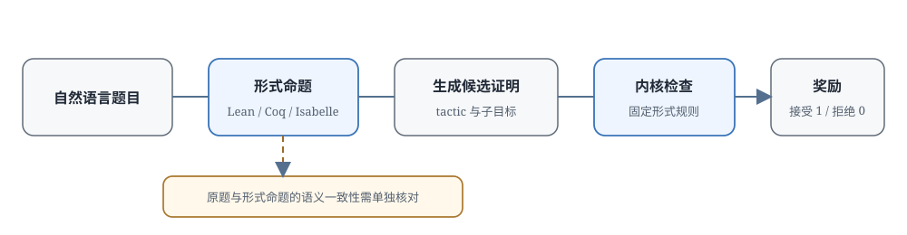

# 17.4 形式化 Verifier

前面两节讲了两种 PRM：判别式 PRM 给一个分数，生成式 PRM 给一段解释，但它们本质上都是模型，都可能学到训练数据里的错误标签，都可能在不熟悉的领域给出流畅但错误的判断。17.1 节那个漏平方的错误，人类一眼就能看出来；但如果是几十步的复杂代数证明，或者需要引用冷门引理的数论题，评价模型自己可能也算错，然后给出看似合理但错误的判断。

当题目已经写成 Lean4、Coq、Isabelle 这类形式语言时，候选证明可以交给**证明检查器**。检查器不判断证明“看起来是否合理”，而是按照选定形式系统的规则验证证明项。对同一个环境、同一个命题和同一段证明，检查结果具有确定性，不再依赖评价模型输出的概率。

但这也带来了一个新的前置任务：自然语言的题目必须先被正确地翻译成形式语言。翻译本身就是个难题。翻译错了，后面就算证明通过，证明的也是一个和原题不一样的命题。本节沿着"自然语言题目 → 形式命题 → 候选 tactic → 内核检查"这条线走一遍：先看这种确定性反馈到底从哪来，再看 AlphaProof、AlphaGeometry 和 DeepSeek-Prover-V2 怎样搜索证明，最后讨论形式化方法的边界。

形式化 Verifier 用 Lean4、Coq 这类证明检查器替代模型判断，它的奖励是二值的：

$$
r = \mathbb{1}[\text{Lean 内核接受证明}]
$$

候选证明是一串 tactic 组成的 Lean4 代码，内核检查会验证这些 tactic 产生的证明项是否合法。$\mathbb{1}[\cdot]$ 是指示函数：检查通过取 1，未通过取 0。和 17.2 的步骤分类相比，这个奖励没有人工步骤标签带来的概率噪声，但仍依赖形式化翻译、定理库、公理和受信任内核的正确实现。检查器只验证“形式命题已经被证明”，不会验证该命题是否忠实表达了自然语言原题。



## 为什么形式检查能提供确定反馈

生成式 PRM 判断一句话对不对，靠的是模型学到的统计规律，本质还是概率。形式检查器不一样，它要求候选证明必须实际构造出目标命题的证明项。对比同一段证明在自然语言和 Lean4 里分别省略了什么，就能看清确定性从哪来。

### 形式化语言与自然语言的差别

同样是"$\sqrt{2}$ 是无理数"的证明，两种语言写出来差别很大。

**自然语言版本**：

```text
证明√2是无理数：
假设√2 = p/q，p和q互质。
那么p² = 2q²，所以p是偶数。
设p = 2k，代入得2k² = q²，所以q也是偶数。
这与p,q互质矛盾。所以√2是无理数。
```

人类读起来很顺畅，但里面的"所以"省略了大量中间步骤：为什么 $p^2=2q^2$ 就能推出 $p$ 是偶数？为什么一个数的平方是偶数它自己就是偶数？互质的定义到底是什么？这些都依赖读者的数学常识，不需要写出来。

**形式化版本**（Lean4 代码，这里只展示开头）：

```lean
theorem sqrt_two_irrational : Irrational (√2) := by
  intro h
  rcases h with ⟨p, q, h1, h2⟩
  -- 假设√2 = p/q
  have h3 : p^2 = 2 * q^2 := by
    have : (√2)^2 = (p/q)^2 := by rw [h1]
    simp at this
    rw [div_pow] at this
    field_simp at this
    linarith
  -- ... 后面还有很多行
  sorry  -- 这里是"暂未给出证明"的占位符
```

注意这段代码里的 `sorry`。它只是占位符，不算真的证明。提交给 verifier 的证明必须把所有 `sorry` 都去掉，让 Lean 内核逐步检查每个 tactic 产生的证明项。检查通过意味着：在当前选定的公理、定理库、以及形式化命题的前提下，这个证明项符合规则。它不保证自然语言原题一定被翻译正确，也不排除所选公理本身有问题。

### Lean4 Verifier 的特点

Lean4 这类证明检查器有几个特性，使它特别适合提供过程反馈：

- **确定性检查**：在给定形式系统、公理和实现的前提下，同一个证明重复检查会得到相同结果
- **全自动化**：检查过程在编译时自动完成，不需要人工判断
- **可扩展**：可以定义新的数学结构、证明新的定理、加入新的定理库
- **社区基础**：[Mathlib](https://github.com/leanprover-community/mathlib4) 已经形式化了大量大学水平的数学知识，不需要从零开始

### 形式化的适用边界

形式检查的确定性很强，但代价也很大：

- **领域非常受限**：Lean4 主要用于数学。自然语言推理、开放领域问答这类任务，没有成熟的形式化系统
- **数据极度稀缺**：Lean4 代码的总量比通用自然语言语料小好几个数量级，LLM 在这上面的预训练数据严重不足
- **门槛很高**：写 Lean4 代码需要专门训练，大部分数学家都不熟悉，更别说普通工程师

::: details Lean4 里的 tactic 是什么
tactic 可以理解为"证明指令"。比如：

- `rw [h1]`：把假设 h1 代入当前目标
- `simp`：用简单的化简规则自动简化目标
- `linarith`：用线性算术自动解关于整数/实数的简单不等式
- `intro h`：引入一个假设 h

每个 tactic 执行后，证明状态会发生变化：目标可能被解决了，也可能被分解成几个更小的子目标。Lean 内核会验证每个 tactic 的执行是否合法，不合法就直接报错。
:::

## AlphaProof 与 AlphaGeometry 如何搜索证明

证明检查器只能回答"这一步合不合法"，它不会主动告诉系统下一步该写什么 tactic。要自动解新题，还需要：一个策略模型推荐下一步用什么 tactic，一个价值模型估计当前证明状态离成功还有多远，再加上一个搜索算法在候选动作之间分配计算资源。

2024 年 7 月，DeepMind 宣布 [AlphaProof 和 AlphaGeometry 2](https://deepmind.google/discover/blog/ai-solves-imo-problems-at-silver-medal-level/) 组合起来，解决了国际数学奥林匹克（IMO）2024 的 4 道题，总分达到银牌区间。AlphaProof 负责代数和数论这类形式化证明，AlphaGeometry 2 专门负责几何题。

### AlphaProof 的架构

AlphaProof 把 AlphaZero 风格的强化学习、证明搜索、和 Lean 检查连接成了一个闭环：

```text
┌────────────────────────────────────────────────────┐
│ 1. 问题形式化：把自然语言数学题翻译成Lean4命题       │
│                                                    │
│ 2. AlphaZero风格搜索：                              │
│    - 策略网络：推荐下一步用什么Lean4 tactic         │
│    - 价值网络：评估当前证明状态值不值得继续搜索     │
│    - 搜索算法：在候选tactic之间分配计算资源         │
│                                                    │
│ 3. Lean4 verifier：每个tactic执行后自动验证合法性   │
│                                                    │
│ 4. 自我博弈训练：把搜索出来的成功证明用来更新网络   │
└────────────────────────────────────────────────────┘
```

这个结构沿用了 [AlphaGo Zero](https://www.nature.com/articles/nature24270) 的经典架构：策略网络提出动作，价值网络评估状态，搜索产生比单步贪婪更好的训练目标。区别在于围棋里的动作是落子，形式证明里的动作是 tactic；证明状态、终止条件、数据生成方式都和棋局不同。

### AlphaProof 怎样构造训练与搜索闭环

**设计一：怎么得到形式化的训练问题？**

自然语言题目必须先变成 Lean 命题，这一步无法跳过。训练阶段，DeepMind 用形式化器把约一百万道非形式化问题自动转换成形式问题，形成不同难度的训练库。但注意：IMO 2024 的六道正式赛题，是由专家手工翻译的。不要把训练数据的自动形式化和比赛输入混为一谈。

自动形式化器可能犯各种错误：误解量词、弄错变量范围、漏掉题目里的隐含条件。Lean 只能检查"翻译后的命题有没有被证明"，因此系统还要单独验证形式命题是否忠实对应原题。翻译错了，后面做得再多都是无用功。

**设计二：大规模 Lean4 训练数据怎么来？**

训练库里不仅有从自然语言问题自动转换来的形式命题，还有搜索过程中自己产生的相关问题。AlphaProof 会不断尝试证明或者证伪这些命题，把通过 Lean 检查的结果再用来更新策略和价值网络。公开材料没有给出足够复现全部数据配比的细节。

**设计三：Lean 检查直接进入搜索循环**

搜索树上每个节点对应当前证明状态，每条边对应一个候选 tactic。Lean 检查器在每个节点先做第一步过滤：不合法的 tactic 直接淘汰，不用继续往下搜；走到叶子节点完成证明的整条轨迹，才作为强化学习的正样本。

把三个设计连起来看：形式化器决定"题目对不对"，搜索算法决定"往哪个方向试"，Lean 内核决定"这一步合不合法"。二值奖励虽然只在整条轨迹完成时才出现，但合法性检查在每个节点都在即时发生。这正是 17.1 说的过程反馈，只不过提供反馈的是确定性的检查器，不是神经网络。

### AlphaProof 的成绩

在 IMO 2024 总共 6 道题里，AlphaProof 解决了 2 道代数题和 1 道数论题，AlphaGeometry 2 解决了 1 道几何题，两套系统合计拿了 28 分（满分 42），达到了当届银牌区间。剩下 2 道题没做出来，失败原因可能是形式化错了、候选生成没覆盖到正确路径、或者搜索预算不够。不能只看最终没通过就断定是哪一环出了问题。

### AlphaGeometry 怎样处理几何题

几何题和代数数论不一样，AlphaProof 在几何上效果不好，所以 DeepMind 专门做了 [AlphaGeometry 2](https://www.nature.com/articles/s41586-024-07819-5)。

它走的是神经—符号结合的路线：神经语言模型负责提出辅助构造（辅助线、辅助点），符号推理引擎负责做演绎推理和确定性检查。系统还自己生成了大量合成几何问题补充训练数据。很多几何题做不出来，卡在没想到要加哪条辅助线；辅助线一加进去，后面的演绎推理符号系统自己就能跑完。

在 IMO 2024 里，AlphaGeometry 2 拿到人工形式化好的题目后，只用 19 秒就解决了第 4 题。这个案例说明专用形式系统可以非常快地检查和组合几何关系，但自然语言题目到形式输入的翻译，仍然是在系统边界外由人工完成的。

::: details 为什么几何要单独做一套系统
几何证明和代数证明有一个很大的不同：代数证明主要是等式、不等式的重写和变换，tactic 基本都是重写规则；但几何证明经常需要"添加辅助构造"，比如连一条线、作一个高、取一个中点。这些构造在原问题里不存在，要靠系统自己想出来加在哪。纯符号搜索加辅助线的空间太大，所以需要语言模型来提出可能有用的辅助构造，再交给符号系统验证。
:::

## DeepSeek-Prover-V2 如何生成可检查证明

AlphaProof 展示了搜索和检查器协作的可能性，但它没有开源。开源社区需要回答：训练数据怎么构造？复杂定理怎么拆成小的？二值通过信号怎么用于 RL？DeepSeek-Prover-V2 给出了一套可复现的开源实现。

[DeepSeek-Prover-V2](https://arxiv.org/abs/2504.21801)（2025 年 4 月）是 DeepSeek 开源的形式化证明工作，目标是：

- 用 Lean4 加 RL 训练一个能解数学竞赛题的开源模型
- 推进形式化过程反馈的工业可用性

### Prover-V2 的方法

**改进一：递归证明搜索，把大定理拆成小引理**

遇到复杂定理，直接一次性证出来太难。Prover-V2 用**递归定理证明**的思路：把一个难定理分解成若干个子目标，每个子目标如果还难，就继续分解，直到子目标简单到可以直接证明为止。

```text
主目标：证明A
  ├── 子目标1：证明B（如果B成立，A就成立）
  │     ├── 子子目标1.1：证明C
  │     └── 子子目标1.2：证明D
  └── 子目标2：证明E
```

这种分解把一个长证明变成了依赖关系清晰的小引理。前面已经证出来的子目标，可以直接作为前提用来证后面的子目标，最后再把所有通过检查的局部证明拼成完整证明。

**改进二：最纯粹的二值奖励**

Prover-V2 用的是最干净的二值结果奖励：证明通过 Lean 检查给 1，失败给 0，没有中间分数。对同一个形式化命题和同一段证明，Lean4 的检查结果是完全确定的。但要再强调一遍：如果自然语言题目被错误形式化了，就算证明通过，奖励对应的也是一个错误的命题。检查器消除了证明判定的噪声，但消除不了数据错误和翻译错误。

**改进三：用通过检查的证明自动生成训练数据**

DeepSeek 自动生成了大量 Lean4 定理和证明用来训练，流程大致是：

- 用 LLM 把自然语言数学题翻译成 Lean4 命题
- 用证明模型递归分解并解决子目标
- 把成功找到的、通过 Lean 检查的证明作为训练数据

### Prover-V2 的成绩

论文报告 671B 模型在 MiniF2F-test 上用 Pass@32 达到 82.4%，把候选预算提高到 Pass@8192 时达到 88.9%；还解决了 PutnamBench 658 题中的 47 题。这里的候选数量差了两个数量级，88.9% 不能当成单次证明成功率。

这里必须讲清楚 Pass@k 的含义：它衡量的是"$k$ 次独立尝试中至少有一次成功"的概率。如果单次成功率是 $p$，那么

$$\text{Pass}@k = 1-(1-p)^k$$

这正是 16.3 节讲过的覆盖率公式。反过来算一下这组数字对应的单次成功率：

- Pass@32 = 82.4%：单次成功率约 $p=5.3\%$（因为 $(1-0.053)^{32}\approx0.176$）
- Pass@8192 = 88.9%：单次成功率只需要约 $p=0.03\%$（因为 $(1-0.0003)^{8192}\approx0.111$）

两个口径差了 100 多倍。报告形式证明成绩的时候，必须写清楚候选预算，否则数字没有意义。这个数字也说明：增加形式证明的搜索预算确实能覆盖更多题目，但计算成本也随候选数线性增长。

## 形式化验证可以用到哪里

形式检查把"判断步骤是否正确"这件事变得非常可靠，但它没有自动解决所有问题。它甚至没有解决"题目是什么"这个问题。要应用形式化过程反馈，需要依次检查：任务能不能写出精确定义？自然语言输入能不能可靠翻译？证明搜索成本能不能接受？

### 领域受限

Lean4 这类系统目前主要覆盖数学。其他领域：

- **代码逻辑**：可以用 Dafny、F\*、Coq 这类工具，但需要先写出完整的形式化规格和不变量。大部分代码连精确规格都没有，更别说形式化证明
- **自然语言推理**：只有极小一部分任务能转成逻辑约束，开放领域问题无法完整形式化
- **多模态推理**：感知结果（图像、语音）本身就带不确定性，通常只能形式化其中纯符号推理的一小部分

目前覆盖最好的是数学证明，以及有明确规格的程序验证；开放语言任务最多只能形式化其中边界特别清楚的部分。

### 形式化数据稀缺

Lean4 语料和定理库的规模比通用自然语言语料小好几个数量级，而且"代码行"和"文本 token"不能直接换算。模型能学到的 tactic 用法、库接口、证明模式都受数据覆盖限制，容易在语法、定理检索、证明搜索这几个地方失败。自动形式化的质量和检查成本，又进一步限制了能覆盖的题目范围。

### 翻译成本

形式化反馈要求把任务翻译成 Lean4。这一步的工作量不小：量词翻译错、类型弄错、漏掉一个隐含条件，都可能让检查器去证明一个和原题完全不同的命题。可靠的系统必须保留自然语言题目和形式命题之间的对应关系，还要有人工、测试、或另一套翻译检查来发现语义偏差。翻译错了，后面所有证明都没有意义。

### 训练成本

证明搜索过程中会反复生成 tactic、调用 Lean 检查，分支数和证明深度一大，检查次数就会快速增长。实际成本取决于缓存策略、并行度、定理库大小、搜索预算，公开资料不足以用一个固定倍数概括所有系统。

### 怎样扩大形式检查的覆盖范围

想让形式检查用得更广，要分别解决三个问题：输入翻译、证明生成、领域规格。

#### 方向一：自动形式化

让 LLM 学会把自然语言自动翻译成 Lean4。这就是 AlphaProof 的形式化器，以及 [Autoformalization with Large Language Models](https://arxiv.org/abs/2205.12615) 这类研究的方向。自动翻译质量是目前最大的瓶颈之一。

#### 方向二：Lean4 和 LLM 混合验证

折中的办法：让 LLM 先提出自然语言的证明思路，再把其中能形式化的关键引理翻译成 Lean4 检查。但要注意：部分引理通过检查，不代表整条自然语言推理就正确了。没有形式化的那些步骤仍要单独评估。

#### 方向三：扩展到其他领域

代码可以用 Dafny、F\* 这类工具检查规格和不变量；物理、生物这类任务只有当研究对象、假设、规则都能精确定义的时候，才能交给形式系统。感知数据和开放语义问题，仍然要靠概率模型或人工判断。

#### 方向四：神经符号集成

目前最实用的模式是：语言模型负责提出引理、推荐候选步骤、提出辅助构造，形式系统负责按规则检查。两者之间必须保留完整的失败信息：哪个 tactic 不合法？哪个子目标没解决？自然语言命题和形式命题翻译一致吗？只有"生成—检查—修正"这个闭环完整了，形式反馈才能真正指导下一次搜索。

## 本节小结

形式化过程反馈用 Lean4 这类证明检查器替代神经网络判断：候选证明必须构造出目标命题的证明项，内核按照固定规则检查。AlphaProof 与 DeepSeek-Prover-V2 的结果说明，生成模型负责提出候选和搜索方向、证明检查器负责验证形式规则的组合，已经能够处理一部分高难度竞赛数学问题；覆盖范围仍受形式化数据、翻译质量和搜索预算限制。

但形式反馈的边界也非常清楚：Lean 数据比自然语言语料少得多，自动形式化可能改变题意，证明搜索需要大量候选，而且只覆盖能形式化的领域。它适合规则精确的任务，不能直接替代开放语言任务里的结果奖励或模型评价。

到这里，PRM 的三条技术路线就都看完了：

- **判别式 PRM**（17.2）：标注成本高，但推理快、吞吐量高，适合大规模训练
- **生成式 PRM**（17.3）：能解释判断依据，标注效率高，但推理成本也高，依赖评价模型能力
- **形式化验证**（17.4）：反馈确定（在形式系统内），但只覆盖能形式化的任务，翻译和搜索成本高

接下来两节，把这些评价器放回生成过程中：17.5 讲怎么用步骤分数引导 Beam Search、ToT、MCTS 这类搜索算法，17.6 讲怎么比较多条完整推理、汇总答案。
