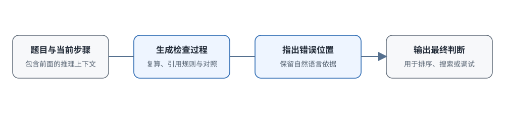

# 17.3 生成式 PRM

上一节讲的判别式 PRM 看到第六步那个漏平方的错误，只输出一个 `bad: 0.96`。这个分数用来排序没问题，但训练模型时它什么也不解释：到底是平方丢了？还是前提用错了？还是其实前面一步就已经错了，到这里才显现出来？

换到新领域时这个问题更明显：拿数学上训好的 PRM 去评代码，它给某行代码打了个低分，但无法判断它是真的看出了 bug，还是只因为代码风格和训练数据不一样。固定的 good/bad/neutral 标签，暴露不了评价器到底缺了什么知识。

**生成式 PRM** 换了个思路：不让评价器只输出一个分数，让它先把检查过程写出来："这一步想两边除以 2，应该得到 $2k^2=q^2$，但写成了 $4k=q^2$，等式不成立"，最后再给一个明确的判断。评价器本身也是一个生成模型：先写一段自然语言的检查过程，最后给出可抽取的结论。

代价是什么？为什么它只需要约 1% 的过程标签？生成一段解释会不会太慢？本节以 ThinkPRM 为例，看自然语言评价怎样工作，少量标签为什么够用，验证计算怎样扩展，以及什么时候该用它、什么时候还是用判别式 PRM。



## 如何生成自然语言评价

生成式 PRM 要完成的任务和判别式 PRM 一样：读题目、读前面的推理、读当前步骤，判断这一步能不能成立。变的只是输出端：三分类概率，被换成了"检查依据加最终标签"的文本。

### 判别式与生成式输出的差别

把两种输出并排放在一起：

**判别式 PRM**（比如 OpenAI PRM800K）：

```text
输入：题目 + 第i步推理前缀
输出：good / bad / neutral（三个概率）
```

模型结构是一个读得懂长前缀的语言模型，最后加一个分类头或者打分头，输出三个数。

**生成式 PRM**（比如 ThinkPRM）：

```text
输入：题目 + 第i步推理前缀 + "请评价这一步"
输出：自然语言的检查过程 + 最终判断
```

模型结构是一个标准的 decoder-only LLM，输出的是文本。

还是 $\sqrt{2}$ 证明第六步的错误，两种输出的对比：

```text
判别式输出：
bad: 0.96

生成式输出：
这一步想把4k² = 2q²两边同除以2，应该得到2k² = q²；
写成4k = q²相当于只对左边的k²做了开方，右边没做对应变换，等式不再成立。
判断：INCORRECT
```

前者可以直接进入排序管线，几毫秒出结果；后者把错误位置和错误原因一并交出来了，但要等它把整段解释生成完。

### 生成式评价怎样复用已有能力

生成式 PRM 有两个优势，这也是它能用更少标签训练的原因。

**第一，直接复用 LLM 的预训练知识。**

判别式 PRM 需要从头训练一个分类头，还要用大量步骤标签来校准 good、bad、neutral 三个类别的边界：什么算对，什么算错，什么算中性，都要靠标签提供。生成式 PRM 用的是已经完成预训练的语言模型，它本来就会做数学、会看代码、懂基本逻辑，微调时主要是教它按照统一格式检查步骤、最后给出结论。它的知识大部分来自预训练，不是来自微调数据。

**第二，自然语言把判断依据保留下来了。**

判别式 PRM 输出 good/bad/neutral，排序很快，但不说明为什么给这个分。生成式 PRM 会明确指出它用了什么规则、代入了什么数值、错误具体发生在哪个位置，训练者可以直接核对它的理由对不对。

比如它可以输出这样的评价："这一步想使用因式分解，但把 `x² - 1` 写成了 `(x-1)(x-2)`，正确展开应该是 `(x-1)(x+1)`，因此当前步骤错误。"读到这段话就能判断：它是真的理解因式分解，还是在生成看似合理的错误解释。解释本身也可能是错的。但至少可以检查，不用对着一个 0.96 的分数猜测原因。

### ThinkPRM 怎样构造训练数据

[ThinkPRM](https://arxiv.org/abs/2504.16828)（2025 年 4 月）是生成式 PRM 的代表工作。它的起点仍是 PRM800K 的题目、解题前缀和人工步骤标签，但这些标签的用途变了：不再直接用来训练分类头，而是用来筛选语言模型自己生成的检查过程。

#### 生成分步评价是什么样的

训练样本要求模型逐步核对每一步的依据，最后给出可抽取的正确/错误判断。看一个具体例子：

```text
Prompt: 评估以下推理的第3步：
问题：求方程 x² - 5x + 6 = 0 的解
推理：
  Step 1: 这是二次方程，可以用求根公式
  Step 2: 求根公式：x = (-b ± √(b²-4ac)) / 2a
  Step 3: 代入 a=1, b=-5, c=6，x = (5 ± √(25-24)) / 2 = (5 ± 1) / 2
  Step 4: x = 3 或 x = 2
请评估 Step 3。

ThinkPRM输出：
让我检查Step 3：
- a=1, b=-5, c=6，核对一下：原方程确实是x²-5x+6，没错 ✓
- 求根公式是x = (-b ± √(b²-4ac))/2a ✓
- 代入数值：x = (5 ± √((-5)² - 4·1·6)) / (2·1)
       = (5 ± √(25 - 24)) / 2
       = (5 ± √1) / 2
       = (5 ± 1) / 2 ✓
Step 3的代入和计算都是正确的。
判断：CORRECT
```

注意这个输出的三段结构：先重读题目条件确认没看错，再重算关键量（这里是判别式 $25-24=1$），最后给结论。中间的检查过程本身就是给人读的证据，最后那句"判断：CORRECT"是留给程序抽取的接口，用简单的正则就能把结果取出来。

#### 关键技巧：先生成，再筛选，最后微调

ThinkPRM 的数据构造分三步，这是它省标签的核心：

1. **生成候选**：用 QwQ-32B-Preview 这类强推理模型，给 PRM800K 里的每个解题前缀生成多条验证推理
2. **筛选过滤**：只保留格式能解析、逐步判断结果和 PRM800K 的人工标签一致、长度不超过上限的样本
3. **微调训练**：用筛选出来的高质量验证文本，微调 R1-Distill-Qwen、QwQ 这些推理模型

第三步的微调目标就是标准的下一个 token 预测。设筛选出的验证文本是 $y=(y_1,\dots,y_m)$，损失为

$$
\mathcal{L} = -\sum_{t=1}^{m} \log p_\theta(y_t \mid q,\, o_{\le i},\, y_{<t}),
$$

其中 $q$ 是题目，$o_{\le i}$ 是待检查的推理前缀，求和只在验证文本的 token 上进行，输入里的题目和前缀部分不计入损失。和 17.2 的判别式损失对比：判别式训练的是三个类别上的一个概率分布，生成式训练的是一整段检查文字的生成过程，"会检查"这件事由预训练权重提供，微调只负责固定检查的格式和输出结论的位置。

论文最后只用了约 1000 条验证样本，包含约 8000 个步骤判断。但注意：为了得到这 1000 条能用的样本，系统先生成了约 5000 条候选，再用 PRM800K 的人工标签筛选。这里节省的是**用于微调的过程标签数量**，不是说高质量步骤标签完全不需要了。如果没有人工标签，也可以用 rollout 结果估计银标签来筛选，但噪声会跟着进来。

因此"约 1% 的标签"要正确理解：这是一笔交换。人工标签没有消失，只是从"直接训练分类头"变成了"给生成的评价质量把关"。把关用的标签量变小了，但质量要求变高了：筛错一条，错误的评价就会被当成正确样本放进微调数据里。

::: details 逐步评价和整条评价怎么选
部署时有两个选择：

- **逐步评价**：每次只评一个步骤，评完再生成下一个。好处是注意力始终集中在一个边界清楚的动作上，容易定位第一个错误；坏处是每一步都要调一次模型，调用次数多
- **整条评价**：把完整推理一次性交给模型，让它依次输出各步的判断。好处是只读一次上下文，吞吐量高；坏处是轨迹一长可能漏掉中间的小错误

实际使用时可以两者结合：先用整条评价快速筛掉明显低分的轨迹，再对疑似出错的位置做逐步精细复核。选择时不要只比单次调用速度，要一起看首错定位率、每条轨迹平均用多少 token、总延迟这些指标。
:::

## 标签与验证计算如何影响效果

生成式 PRM 减少了微调需要的步骤标签，但增加了每次评价的生成成本。论文从三个角度检查这笔交换是否划算。

### 少量过程标签能否训练有效评价器

ThinkPRM 只用了约 8000 个过程标签，大约是论文里判别式基线用的 71.2 万个标签的 1%。在 ProcessBench、MATH-500 和 AIME 2024 的给定实验设置下，它在步骤验证、Best-of-N 排序、verifier 引导搜索这几个任务上，都超过了同基座的判别式基线，也超过了没微调直接用 LLM-as-a-Judge 的效果。

但这个结论有两个前提：第一，基座模型本身已经具备较强的推理能力；第二，有人工标签对生成的评价做了高质量筛选。如果基座模型推理能力弱，或者筛选标签质量差，1% 的数据可能根本不够用。

### 数学训练能否迁移到科学与代码

论文还在 GPQA-Diamond（科学题）和 LiveCodeBench（代码题）的子集上测了领域迁移效果。相对用完整 PRM800K 训练的判别式 verifier，ThinkPRM 分别高了 8 个和 4.5 个百分点。这个结果支持"生成式评价可以更好地复用基座知识"的判断，但评测只覆盖了数据子集；用到新的代码库或新的科学领域时，仍然需要重新校准。

### Verifier 也可以增加推理计算

这和 16.3 节讲的规律一致：生成式 verifier 也可以靠增加计算来提升效果，主要有两条路：

- **并行**：同时采样多条验证推理，最后聚合判断结果
- **串行**：让同一条检查过程继续自我复核、自我修正

论文在相同 token 预算下比较了这两种方式，整体差距不大，部分预算下并行方式略好；在 ProcessBench 子集上，ThinkPRM 相对未微调的 LLM-as-a-Judge 高了 7.2 个百分点。

但要注意：更多验证计算只有在评价模型确实能产生互补的检查路径时才有用。如果模型本身就缺某个领域的知识，生成 100 条检查可能都在重复同一种错误判断，只是说法不一样。

## 何时选择判别式或生成式 PRM

前面的结果说明生成式评价能提高标签效率，但它不能在所有场景下替代分类器。RL 训练中每秒要评几万、几十万步的时候，让模型每步都生成一段解释可能慢到无法接受；但做调试、做教学反馈的时候，一个孤立的分数又完全不够用。

两种 PRM 的对比：

- **输出**
  - 判别式 PRM: 步骤类别或概率
  - 生成式 PRM: 检查过程文本 + 可抽取判断
- **单次评价速度**
  - 判别式 PRM: 一次前向传播，吞吐量高
  - 生成式 PRM: 需要自回归生成，延迟高
- **数据需求**
  - 判别式 PRM: 需要足够标签校准分类边界
  - 生成式 PRM: 仍需标签筛选生成评价，但微调样本少
- **领域迁移**
  - 判别式 PRM: 取决于训练数据覆盖和基座
  - 生成式 PRM: 能调用基座文本知识，但也可能生成流畅的错误解释
- **增加验证计算**
  - 判别式 PRM: 模型集成、多模型投票
  - 生成式 PRM: 增加生成长度、复核轮数、并行采样数
- **可检查性**
  - 判别式 PRM: 只能看分数和误差样本
  - 生成式 PRM: 能直接阅读判断依据，但依据不一定忠实或正确

### 任务规模与推理成本怎样影响选择

- **大规模 RL 训练**：每轮要评价上百万步，通常优先选吞吐量更高的判别式模型
- **线上重排序**：64 个候选以内，生成式的延迟通常还能接受，取决于具体延迟预算
- **调试错误样本**：分析模型为什么在某 10 道题上失败时，判别式只能给一组分数，生成式能逐条说明它认为错在哪里，价值明显更大

这里有一个重要的提醒：**数据预算少不等于推理预算少**。生成式 PRM 可能省了标注费，但每次调用都要生成几百上千 token，推理成本可能高一个量级。一张示意性的成本对比表（数字是量级示意）：

- **RL 训练，每轮百万步**
  - 判别式（一次前向）: 百万次前向，可批量
  - 生成式（自回归检查）: 百万段生成，成本高一个量级
- **线上重排序 64 候选**
  - 判别式（一次前向）: 完全可以接受
  - 生成式（自回归检查）: 取决于延迟预算
- **调试 10 条失败样本**
  - 判别式（一次前向）: 只能看到分数
  - 生成式（自回归检查）: 逐条给出错误原因

### 混合两类 PRM

没有公开训练细节时，不能从产品输出反推内部是否使用了生成式 PRM。从公开方法来看，至少三种组合方式是可行的：

1. **PRM 和 ORM 混合**：PRM 评过程，ORM 评结果，加权求和，上一节已经讨论过
2. **生成式加判别式混合**：用生成式 PRM 生成高质量的带解释评价，再把这些评价蒸馏给一个小的判别式 PRM，用判别式做大规模训练，需要解释的时候再用生成式
3. **Self-PRM**：让模型自己评价自己的推理，思路和 [Self-Rewarding Language Models](https://arxiv.org/abs/2401.10020) 一致

::: details 过程奖励是不是总是必要的
即使 verifier 能逐步解释，也要先问一个问题：真的需要训练 PRM 吗？

答案容易自动验证、模型又能大量采样的时候，结果奖励也可能间接强化自我检查行为。[DeepSeek-R1](https://arxiv.org/abs/2501.12948) 是一个很好的对照：R1-Zero 主要用结果正确性奖励和格式奖励（也就是 ORM），训练后也观察到了自我检查、修改答案这类行为。原因是：结果奖励会提高最终答对轨迹的概率，如果带自检的轨迹确实更容易答对，这类行为也会被间接强化。

选择奖励方式时可以这样判断：

- 答案容易自动验证、采样预算充足：结果奖励可能就够了
- 长轨迹中间错误难定位、训练预算有限：PRM 能更早指出错误位置
- 跨领域使用：要单独评测 PRM 是否真的覆盖新领域

PRM 是定位中间错误的有效方法，但不是产生自检行为的唯一途径。
:::

## 本节小结

ThinkPRM 展示了怎样用自然语言评价减少逐步人工标注，同时把判断依据保留下来给训练者检查。但它不是免费的，只是把成本从标注端转移到了推理端。

- **输出结构**：生成式评价 = 逐步检查的自然语言 + 可抽取的判断 token。前者给人读，方便核对；后者给程序用，方便排序。
- **数据构造逻辑**：人工标签的角色从"直接训练分类头"变成了"筛选生成评价的把关人"。"约 1% 标签"换来的是标签用途的转变：数量更少，对筛选质量的要求更高。
- **验证计算可扩展**：并行采样多条验证推理和串行复核都能提升效果，前提是评价模型能产生互补的检查路径；如果多条检查都在重复同一种错误，增加计算也得不到提升。
- **选择标准**：判别式赢在吞吐量和成本，适合大规模训练；生成式赢在可检查性和标签效率，适合调试和教学场景。两者可以通过蒸馏组合使用。

但生成式 PRM 的可靠性仍受评价模型自身能力限制。评价模型不熟悉某个领域时，完全可能写出一段看起来完整、有道理，但实际错误的解释。有没有一种评价器没有这个问题，对就是对，错就是错？下一节讲形式化 Verifier：把可形式化的步骤交给 Lean4 这类外部证明检查器，用确定性的规则检查替代模型的概率判断。
