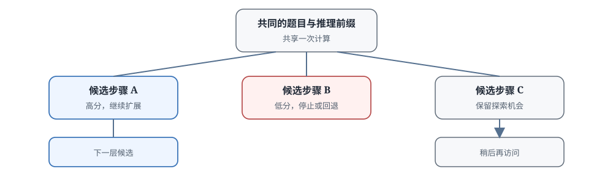

# 17.5 推理时搜索

上一节讲的形式化验证器能给每一步推导一个确定的对错判断，PRM 也能给中间步骤打分。有了步骤级的评价器，生成过程就不必从开头一口气写到结尾，可以在每一步判断当前方向是否值得继续，走错了就回退重来。

还是用二次方程 $x^2 + 5x + 6 = 0$ 来说明。让模型解这道题，它可能走三条不同的路：第一条用因式分解，顺利写出 $(x+2)(x+3)=0$；第二条用求根公式，算判别式的时候把 $25-24$ 算成了 $-1$，已经走进了死路；第三条尝试配方法，写了很久还停在配方阶段。

如果用 Best-of-N，独立采样 $N$ 条完整路径，最后选最好的，会发生两件浪费的事：第二条路在算判别式那一步就已经错了，却还要等它把整条回答写完，花掉几千个 token；第一条路和第二条路虽然解法不同，但"这是二次方程，要求它的根"这段理解是相同的，却被重复生成了两遍。

这一节要解决的就是这个问题：把生成过程组织成一棵树，正确的前缀只算一次，发现走错了及早回头，把计算资源集中到最有希望的方向上。从最简单的 **Beam Search**，到支持回退的 **Tree of Thoughts**，再到用访问次数平衡探索与利用的 **MCTS**，沿着同一道题看这些搜索算法怎么工作，最后讨论什么时候付出额外的搜索算力是划算的。



## 为什么需要复用中间推理

把二次方程的例子展开一点。模型对这道题可以生成多种推理路径：

```text
路径A：用求根公式
  → x = (-5 ± √(25-24)) / 2 = (-5 ± 1) / 2
  → x = -2 或 x = -3

路径B：用因式分解
  → x² + 5x + 6 = (x+2)(x+3) = 0
  → x = -2 或 x = -3

路径C：尝试配方法
  → x² + 5x = -6
  → x² + 5x + 25/4 = 25/4 - 6 = 1/4
  → (x + 5/2)² = 1/4
  → x + 5/2 = ±1/2
  → x = -2 或 x = -3
```

三条路径都得到正确答案。但如果模型在某条路径上出错，比如路径 A 算判别式时把 $25-24$ 算成 $-1$，单次采样的结果就是错的。

Best-of-N 的处理方式是生成 $N$ 条独立路径，再用 PRM 选最好的。但这种方式有两个明显的浪费：

- **没有利用路径间的相似性**：两条路径前半段相同（比如都先判断"这是二次方程，可以因式分解"），Best-of-N 会把这段相同的前缀重复生成两遍
- **无法在中间回退**：一条路径走到一半发现走错了（判别式算错），Best-of-N 只能把它写完，没法退回去重算

本质上，$N$ 条独立采样是暴力枚举，算力分配很粗放。推理时搜索把这些重复工作改成一棵显式的状态树：

- **共享前缀**：相同的前缀推理只算一次，不重复生成
- **中间评估**：每写一步就用 PRM 打分，决定继续走还是回退
- **资源分配**：把搜索算力集中到最有希望的方向上

接下来的三种算法，差别主要在两个问题上：每轮保留多少节点，以及被暂时淘汰的路径以后还有没有机会回来。

::: details 人类解数学题时的搜索过程
人类解二次方程时，其实已经在做类似的过程：

- 看到题目先想"这题能因式分解吗"，试探第一条路
- 发现 $6=2\times3$ 且 $2+3=5$，可以分解，继续走这条路
- 走到"令两个因子分别为零"，快要出答案了，投入更多注意力
- 如果先试配方法，写了两步发现太麻烦，退回来换因式分解
- 如果有两条路都可行，各走几步比较哪条更顺

人不会等配方法完整算完才发现它麻烦，也不会把题目重复读三遍。搜索算法把的就是共享前缀、中间评估、资源分配这三件事机械化。
:::

## Beam Search 与 ToT 如何扩展推理树

**Beam Search（集束搜索）** 采用最直接的规则：任何时刻只维护 $K$ 个得分最高的部分推理。每轮扩展这些节点，用 PRM 重新评分，再留下新的前 $K$ 个。

### Beam Search 的算法

```python
def beam_search_thoughts(prompt, model, prm, K=4, expansions=2, max_steps=10):
    # 初始beam：只有一个空状态
    beams = [{"thought": "", "score": 1.0}]

    for step in range(max_steps):
        # 扩展每个beam：让模型生成下一步推理
        candidates = []
        for beam in beams:
            for _ in range(expansions):
                next_thought = model.generate_next(prompt, beam["thought"])
                score = prm.score(prompt, beam["thought"] + next_thought)
                candidates.append({
                    "thought": beam["thought"] + next_thought,
                    "score": score
                })

        # 选top-K作为新的beams
        beams = sorted(candidates, key=lambda x: x["score"], reverse=True)[:K]

        # 如果找到完整答案，停止
        if any(is_complete(b["thought"]) for b in beams):
            break

    return beams[0]["thought"]  # 返回最优beam
```

用 $K=2$ 在二次方程上走两轮，看看状态怎么变化。假设第一轮三个候选是"因式分解 0.9 分、求根公式 0.85 分、配方法 0.4 分"，第二轮各扩展一步后再评分：

- **1**
  - 候选（分数）: 因式分解 $0.9$、求根公式 $0.85$、配方法 $0.4$
  - 保留（$K=2$）: 因式分解、求根公式
- **2**
  - 候选（分数）: 因式分解→令因子为零 $0.92$、求根公式→算判别式出错 $0.3$、求根公式→算对 $0.88$
  - 保留（$K=2$）: 因式分解→令因子为零、求根公式→算对

配方法在第一轮就因分数太低被淘汰；求根公式路径中出错的那次扩展在第二轮被淘汰，算对的那次仍然保留。同一前缀的多次尝试只共享一次前缀计算。这是"复用中间结果"的直接收益。

### Beam Search 的特点与适用场景

固定宽度让 Beam Search 容易实现，$K$ 条路径可以并行扩展，速度很快。代价同样来自这个固定的 $K$：简单题可能维护了多余的路径（$K=4$ 但其实一条路就走通了），难题又可能过早删掉后来才显示价值的分支。被淘汰的节点不会重新进入 beam。如果早期 PRM 给分不准，误杀了一条后来能走通的路径，它就再也回不来了。

因此，当步骤边界清楚、单步分数可靠、每层只需保留少量候选时，Beam Search 是合适的起点。如果错误要到很后面才暴露，当前分数很难决定早期剪枝，固定 beam 的风险就会增大。

::: details Beam Search 在机器翻译里已经用了几十年
Beam Search 不是大模型时代的新发明，它在传统统计机器翻译和早期神经机器翻译里就是标准算法。原因是翻译任务每一步扩展的选择相对可控：词表虽然大，但真正合理的下一个词不多，而且通常不需要回退。长链数学推理不一样，第一步选错方法可能要到最后才发现，这时固定 beam 就不够用了。
:::

### ToT 如何保留分支与回退机会

[Tree of Thoughts（思维树）](https://arxiv.org/abs/2305.10601)（Yao et al. 2023）是 Beam Search 的自然扩展：它支持**分支、回退、DFS/BFS 混合**。

ToT 的核心结构：

```text
                Root
              /      \
            A1        A2
           /  \      /  \
         B1   B2   B3   B4
        / \    |    |   / \
       C1  C2  C3   C4 C5  C6

       搜索算法：BFS（广度优先）或DFS（深度优先）
       评估：每步用PRM打分
       回退：低分节点被剪枝，但可以回到祖先节点尝试新分支
```

算法实现：

```python
def tree_of_thoughts(prompt, model, prm, max_depth=10, breadth=4):
    # 从根开始DFS
    def dfs(thought, depth):
        if depth >= max_depth:
            return [{"thought": thought, "score": prm.score(prompt, thought)}]

        # 生成N个候选下一步
        candidates = []
        for _ in range(breadth):
            next_thought = model.generate_next(prompt, thought)
            full_thought = thought + next_thought
            score = prm.score(prompt, full_thought)
            candidates.append({"thought": full_thought, "score": score})

        # 按分数排序，剪枝低分
        candidates.sort(key=lambda x: x["score"], reverse=True)
        candidates = candidates[:breadth // 2]  # 剪枝一半

        # 对保留的candidate递归
        results = []
        for c in candidates:
            results.extend(dfs(c["thought"], depth + 1))

        return results

    return dfs("", 0)
```

ToT 允许系统先把推理切成较粗的 thought，再用 BFS、DFS 或受限 beam 扩展。它能回到尚未删除的中间节点尝试新后续，但并不天然比 Best-of-N 更省计算；收益取决于共享前缀和中间评分是否真的有用。如果每层完整保留 $B$ 个分支，节点数会随深度指数增长。$B=4$、深度 $D=5$ 时就是 $4^5=1024$ 个节点。实现时必须设置宽度、深度或总节点预算，否则算力很快耗尽。

### ToT 的实验结果

在 [24 Game](https://arxiv.org/abs/2305.10601)（24 点游戏）任务上：

- **Greedy decoding:** 7.3%
- **CoT prompting:** 4.0%
- **Self-consistency（多采样 + 投票）:** 9.0%
- **Tree of Thoughts：74.0%**

在这个任务和提示设置中，GPT-4 配合 ToT 从个位数成功率提高到 74%。24 点提升这么大，是因为它的中间状态特别容易判断：当前已用数字和剩余目标都可以机械核对，特别适合搜索。这个幅度不能直接外推到没有明确状态和验证规则的开放任务（比如写作文、开放式问答）。

## MCTS 如何利用验证反馈选择路径

Beam Search 每一层都只看当前分数，早期被低估的路径一旦淘汰就不会回来。MCTS（蒙特卡洛树搜索）增加了访问次数这个维度：既充分利用当前看起来高分的节点，也给尚未充分探索的节点保留机会。

MCTS 通过反复访问树来分配预算。在 LLM 推理中，可以让模型提出下一步，再用 rollout 结果、PRM 或外部检查器更新节点价值：

- 用结果奖励、PRM 或外部 verifier 评估节点
- 用模型作为 policy（推荐下一步）
- 用 UCB 公式平衡探索与利用

### MCTS 的四个步骤

每次迭代执行这四步，循环往复直到预算用完：

1. **Selection（选择）**：从根开始，用 UCB 公式选择最优子节点，一路走到叶子节点
2. **Expansion（扩展）**：在叶子节点生成 $N$ 个子节点
3. **Simulation（模拟）**：对子节点做 rollout（快速生成完整推理到结尾）
4. **Backpropagation（回传）**：把 rollout 得到的 reward 回传到路径上所有祖先节点，更新它们的平均分数和访问次数

四步写成伪代码：

```python
def mcts(root, budget, c):
    for _ in range(budget):
        # 1. 选择：从根出发，每层选 UCB 最大的子节点，直到叶子
        node, path = root, [root]
        while node.children:
            node = max(node.children, key=lambda n: ucb(n, node, c))
            path.append(node)

        # 2. 扩展：用模型在叶子处生成几个候选后续步骤
        for step in model.generate_steps(node.state, n=EXPAND_WIDTH):
            node.children.append(Node(state=step, parent=node))
        child = node.children[0]

        # 3. 模拟：从新节点快速 rollout 到结尾，用 verifier 拿 reward
        reward = verifier.score(rollout(child))

        # 4. 回传：沿路径更新每个祖先的访问次数和平均分
        for n in path + [child]:
            n.visits += 1
            n.q += (reward - n.q) / n.visits   # 增量式平均

    return best_answer(root)   # 按访问次数或平均分选最终答案
```

其中 `ucb(n, parent, c)` 就是下面的公式。回传那一步的增量式平均对应这条更新式：

$$
Q(n) \leftarrow Q(n) + \frac{r - Q(n)}{N(n)},
$$

其中 $r$ 是本次 rollout 的 reward，$N(n)$ 是更新后的访问次数。它不需要保存历史 reward，只用新结果修正旧估计，和 2.1 节 $\epsilon$-贪心实现里的更新式是同一个写法。另一个实现细节：最终选答案时通常看访问次数而不是 $Q$ 值，因为访问次数包含了探索项修正后的综合判断。

### UCB 公式

选择节点时需要兼顾两件事：当前平均分高的节点值得继续投入（利用），访问次数少的节点也应该得到尝试机会（探索）。UCB（Upper Confidence Bound，置信上界）公式把这两项直接相加：

$$\text{UCB}(n) = Q(n) + c \cdot \sqrt{\frac{\ln N(p)}{N(n)}}$$

其中：

- $Q(n)$：节点 $n$ 的平均 reward，来自 PRM、rollout 结果或外部验证器
- $N(n)$：节点 $n$ 被访问的次数。访问越少，说明对它越不了解，越需要去尝试
- $N(p)$：父节点被访问的次数。父节点被访问越多，整体探索越充分，子节点之间的比较越有意义
- $c$：探索常数，控制第二项的权重。$c$ 越大越愿意尝试新路径，$c$ 越小越保守

第一项 $Q(n)$ 是已观察到的平均价值。这一项高，说明这条路目前看起来走得通。第二项随父节点访问次数 $N(p)$ 增长而增大，随当前节点访问次数 $N(n)$ 增长而减小，因此会优先补充探索访问较少的子节点。选择规则是每步扩展 UCB 最大的子节点。实现时通常优先访问尚未探索的子节点（$N(n)=0$ 时 UCB 视为无穷大），或在分母加入很小的平滑项，避免除零错误。

用一组具体数字感受一下。设父节点被访问 $N(p)=100$ 次（$\ln 100 \approx 4.61$），取 $c=\sqrt{2} \approx 1.414$（经典 UCB1 的理论推荐值）：

- **A**
  - $Q(n)$: $0.8$
  - $N(n)$: $50$
  - 探索项 $c\sqrt{\ln N(p)/N(n)}$: $1.414 \times \sqrt{4.61/50} \approx 0.43$
  - UCB: $1.23$
- **B**
  - $Q(n)$: $0.7$
  - $N(n)$: $30$
  - 探索项 $c\sqrt{\ln N(p)/N(n)}$: $1.414 \times \sqrt{4.61/30} \approx 0.55$
  - UCB: $1.25$
- **C**
  - $Q(n)$: $0.6$
  - $N(n)$: $5$
  - 探索项 $c\sqrt{\ln N(p)/N(n)}$: $1.414 \times \sqrt{4.61/5} \approx 1.36$
  - UCB: $1.96$

节点 A 目前平均分最高（0.8），但访问次数最少的节点 C 凭借 1.36 的探索项，UCB 反而最高，下一轮会先扩展 C。等 C 被访问几十次后，如果平均分没有提高（还是 0.6 左右），探索项就会耗尽，预算自然回到真正高分的节点 A 和 B。UCB 的机制就是这样：不放弃任何看起来有希望的路，但也不会在一条路上持续投入没有回报的算力。

这里的 $Q$ 可以来自最终结果（完整 rollout 后答案对不对）、PRM 的逐步分数，或者二者的组合，取决于有什么样的 verifier。

### MCTS 的特点与代表工作

访问次数机制让 MCTS 能把更多预算分给高价值分支，同时继续试探访问较少的分支，不会因为早期误判就彻底放弃一条路。但要注意：经典 MCTS 的渐近收敛性质依赖有限动作空间、充分探索和可靠回报等假设；在开放文本生成中，动作候选由模型截断产生（并非穷举所有可能的下一个 token），评价器也会犯错，因此不能把经典 MCTS 的理论保证直接当成答案正确性的保证。它的主要代价是多次 rollout、状态缓存和价值更新，工程实现比 Beam Search 复杂不少。

代表工作：

- **rStar**（[arXiv:2408.06195](https://arxiv.org/abs/2408.06195)）：MCTS + 自我对弈，专门用于数学推理
- **AlphaProof**（[DeepMind 2024](https://deepmind.google/discover/blog/ai-solves-imo-problems-at-silver-medal-level/)）：AlphaZero 风格强化学习、证明搜索与 Lean verifier 结合，拿到了 IMO 银牌
- **RAP**（[Reasoning via Planning](https://arxiv.org/abs/2305.14992)）：MCTS + LLM 作为 world model，应用在更通用的推理任务上

### AlphaCodium 的代码生成搜索

[AlphaCodium](https://arxiv.org/abs/2401.08500)（2024 年 1 月）是一个特例。它把代码生成组织成"理解问题—生成测试—写初稿—执行—修复"的迭代流程，不完全是树搜索，但思路一脉相承：

- 代码任务天然有**单元测试**可以自动检查；模型自己生成的新测试只能补充覆盖，不能保证完整验证
- 用迭代式搜索：生成 → 测试 → 看错误信息 → 修复 → 再测试，而不是在每一步分叉做树搜索

流程如下：

```text
1. 问题理解：让LLM提取关键信息、生成测试用例
2. 初步解：生成一个候选解
3. 迭代修复：
   a. 运行测试用例
   b. 如果失败，分析错误信息
   c. 让LLM根据错误信息修复代码
   d. 重复直到所有测试通过
4. 输出最终解
```

已有测试可以直接充当结果 verifier。当然如果测试覆盖不足，仍可能漏掉错误实现。迭代式结构不需要维护复杂的树，简单高效。论文在 CodeContests 等基准上报告了相对直接生成的提升，具体幅度随模型和评测设置变化。

它与树搜索的分工可以这样看：树搜索在"下一步往哪走"上分配计算，AlphaCodium 在"这一版哪里错"上分配计算；前者需要步骤级的评分，后者只需要可执行的测试结果。

::: details AlphaGo 的 MCTS 与 LLM 推理的 MCTS 有什么不同
AlphaGo 下围棋用的也是 MCTS，两者的差别在：

- **动作空间**：围棋每步最多 361 个选点（有限），LLM 每步是整个词表（几万到几十万 token）
- **状态转移**：围棋落子是确定性的，LLM 生成是概率性的
- **最终回报**：围棋胜负完全确定，LLM 题目的对错可能有模糊地带
- **模拟成本**：围棋快速 rollout 一次很快，LLM 生成一整条推理很贵

所以围棋可以跑几百万次 MCTS 迭代，LLM 推理通常只能跑几十到几百次。这直接导致算法细节上的许多不同。
:::

## 搜索何时值得计算开销

搜索不会免费提高正确率。每扩展一个节点都要调用生成模型，很多方法还要调用 PRM、执行测试或运行证明检查器。是否采用搜索，取决于中间反馈的可靠程度和一次失败的代价。

先用"生成分支或扩展次数"粗略估算不同方法的开销：

- **Greedy decoding:** 1 条完整生成
- **Best-of-N:** $N$ 条完整生成与 $N$ 次结果评分
- **Beam Search（$K,D$）:** 约 $K\times D$ 组节点扩展与逐层评分
- **Tree of Thoughts（$B,D$）:** 完整展开为 $O(B^D)$，实际由剪枝和节点上限控制
- **MCTS:** 迭代次数、每次扩展数、rollout 长度与评分成本

Tree of Thoughts 的 $O(B^D)$ 是指数增长：每层保留 $B=4$ 个分支，深度 $D=6$ 时就是 $4^6=4096$ 个节点，每个节点生成几百 token，很快就是几百万 token 的开销。实际系统必须剪枝或设置节点预算。MCTS 不展开整棵树，计算量主要由迭代次数和每次扩展数决定，相对可控。两者都比独立采样多了状态维护和逐步评分的开销，因此是否使用搜索，关键要看中间反馈能否抵消这些额外成本。

科学计算、形式化证明和竞赛编程通常有可执行的检查器（数值验算、Lean 验证、单元测试），搜索每扩展一条路径都能得到比较可靠的反馈，对就是对，错就是错。此时额外计算更容易转化为更高的成功率。如果没有可靠 verifier，PRM 本身也经常判错，搜索反而可能沿着错误的评分反复扩展，越搜越偏。

### 训练时搜索与推理时搜索

还有一个重要的工程选择：搜索发生在训练阶段还是推理阶段？

**训练时使用搜索结果**（比如 AlphaProof 的强化学习循环）：

- 把搜索出来的正确轨迹作为训练数据
- 让模型直接提高高价值步骤的生成概率，把搜索得到的经验内化进模型
- 部署时如果需要，仍可以按任务难度继续搜索

**推理时搜索**（比如本节讲的 ToT、MCTS）：

- 模型训练完成后，推理时再用搜索提升性能
- 不需要重新训练就能改变搜索预算：简单题少搜，难题多搜
- 代价是每次推理都要付搜索的算力成本

两种方式也可以组合：训练时轻度搜索帮助模型更快收敛，推理时再根据任务难度和重要性决定要不要搜索、搜多深。这与[第 16 章 Test-time Compute Scaling](../chapter19_reasoning/test-time-scaling) 的思想一致：算力花在哪里、花多少，是一个工程权衡问题。

## 本节小结

PRM 在训练时提供过程奖励，在推理时为部分路径评分。搜索算法利用这些分数决定保留、扩展或放弃哪些中间步骤：

- **复用的动机**：独立采样会重复生成相同前缀，也无法中途放弃错误路径；显式状态树让前缀只算一次，错误及早停止
- **三种结构的差别**：Beam Search 固定保留前 $K$ 个且淘汰即永久，简单高效但怕早期误判；ToT 支持剪枝与回退，节点数按 $B^D$ 指数增长，必须设预算；MCTS 用 UCB 公式和访问次数，给低访问节点保留机会
- **UCB 的两项含义**：$Q(n)$ 利用已知高分，$c\sqrt{\ln N(p)/N(n)}$ 补偿探索不足；平均分相同时，访问次数少的节点会凭探索项优先被选中
- **开销判断**：从 1 条生成到 $O(B^D)$ 个节点，预算差好几个数量级；搜索是否划算，关键取决于中间反馈的可靠性

四种方法的适用场景：

- **Beam Search**：简单并行，适合中等难度、步骤评分可靠的任务
- **Tree of Thoughts**：支持回退和剪枝，适合状态明确、可以机械验证的任务（比如 24 点）
- **MCTS**：按访问次数在探索与利用之间动态分配预算，适合需要更精细权衡的复杂任务
- **AlphaCodium**：代码任务专用，用单元测试作为 verifier，迭代修复而不是树搜索

实际系统要根据任务价值、verifier 可靠性和算力预算，在 Best-of-N、受限搜索和直接生成之间做选择。

[17.6 并行推理与答案汇总](./parallel-reasoning-and-summary) 讨论另一种算力分配方式：不沿着一棵树深度搜索，而是并行生成多条完整推理，再让模型或 verifier 交换信息并聚合结果。
