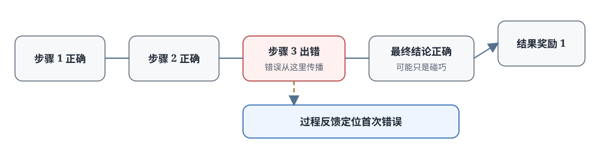

# 17.1 结果奖励与过程奖励

第 16 章我们让模型学会了展开思考，也学会了根据题目难度调整思考长度。但轨迹一变长，训练时立刻会遇到一个问题。还是用 $\sqrt{2}$ 是无理数的证明来说明。

设想模型写了一个九步证明：前五步都对，第六步代数变换时漏了一个平方（把 $4k^2=2q^2$ 错写成 $4k=q^2$），但后面几步碰巧又绕回了正确结论。最后答案"$\sqrt{2}$ 是无理数"是对的，但中间有一步错了。

如果只看最终结果，答案对就给 1 分，训练时会发生什么？第六步的错误会和前五步的正确、后面的巧合一起被强化。模型下次可能还会犯同样的错，只是这次运气好没影响结果；运气不好时，就会得到一个错答案。

代码和 Agent 任务里问题更突出：程序没通过测试，原因可能是第一行文件就读错了，也可能只是最后一行少了个分号；十次工具调用没完成任务，前九步到底有没有价值？结尾一个 0 分回答不了这个问题。

奖励只在序列末尾出现，中间动作没有直接反馈。这就是强化学习里经典的**稀疏奖励问题**，也是信用分配问题。**过程奖励模型**（Process Reward Model，PRM）要解决的就是这个问题：把评价从结尾移到中间每一步，让系统能定位"错误第一次出现在哪里"。

[Let's Verify Step by Step](https://arxiv.org/abs/2305.20050) 系统比较了结果监督与过程监督，并发布了 PRM800K 步骤标签数据。论文结论来自 MATH 数据集和特定的候选生成、重排序设置；本节先从信用分配问题推导两类奖励，再在 17.2 节回到该实验的具体数据与指标。

本节回答三个问题：为什么只看最终结果不够，过程奖励在数学上怎么定义，以及有了结果奖励以后，什么时候值得付出额外成本去标注步骤、训练 PRM。



## 最终奖励为什么不够

### 先区分"答对"和"推对"

结果奖励（outcome reward）只评价最终答案：答案正确给 1 分，错误给 0 分。它便宜、稳定、容易实现：数学题可以代回原式验证，代码可以跑单元测试，棋局可以看最终胜负。

过程奖励（process reward）评价解题过程：不只看最后答案对不对，还看中间每一步推导对不对。它能指出"这一步是对的，可以继续"，或者"从这一步开始错了"。

两者解决的问题不同：

- 结果奖励判断：**整件事完成了吗？**
- 过程奖励判断：**走到这里，还在正确方向上吗？**

短回答（一句话问答、简单分类）通常只需要前者；轨迹越长、错误传播越昂贵，后者越有价值。

### 一条错误轨迹的完整例子

把前面那个有错误的证明完整写出来：

```text
Step 1: 假设 √2 = p/q，其中 p, q 互质（没有公因数）
Step 2: 两边平方得 2 = p²/q²，即 p² = 2q²
Step 3: 所以 p² 是偶数
Step 4: 所以 p 是偶数（因为偶数的平方是偶数，奇数的平方是奇数）
Step 5: 设 p = 2k（k是整数）
Step 6: 代入得 4k² = 2q²，【这里出错了】写成 4k = q²（漏了k²的平方）
Step 7: 所以 q² 是偶数，q 也是偶数
Step 8: p和q都是偶数，与"p,q互质"矛盾
Step 9: 所以 √2 是无理数  ✓（结论正确）
```

最后答案是对的，但 Step 6 有明确的代数错误。如果结果验证器只核对最终结论，也就是"$\sqrt{2}$ 是无理数"这个陈述对不对，整条回答都会得到 $r=1$。训练时发生什么？

- Step 1–5 正确的定义和变形：和错误步骤一起得到正强化
- Step 6 的错误变换：不仅没被惩罚，反而因为"最终答对了"被一起强化
- Step 7–8 在错误前提下继续推导：也得到了正强化

模型既不知道 Step 6 应该被抑制，也无法判断前面的正确定义应该保留。下次它可能还会犯同样的漏平方错误。碰巧结论对了，它不知道为什么对；结论错了，它也不知道错在哪一步。

这就是**稀疏奖励的归因困难**：一条很长的轨迹只在结尾收到一个分数，当结果碰巧正确时，中间的错误步骤也会被一起强化。过程奖励补充的正是这个缺失信息：错误第一次出现在哪里。

### 从一个结尾分数走向逐步反馈

这个问题在强化学习里有个正式名字：**信用分配问题（credit assignment problem）**。给定一个序列决策任务，最终奖励是 $r_T$，怎么把这份功劳（或责任）分配回前面的每一步动作 $a_1, a_2, \ldots, a_T$？哪些动作促成了成功，哪些引入了错误？

经典强化学习已有几个工具试图解决这个问题，下面逐个看它们为什么不够。

## 如何把奖励分配到中间步骤

### 折扣回报

最经典的方法是折扣回报（discounted return）：把未来的奖励打折传回现在：

$$G_t = r_t + \gamma r_{t+1} + \gamma^2 r_{t+2} + \ldots + \gamma^{T-t} r_T$$

其中：

- $G_t$ 是从第 $t$ 步开始的折扣回报
- $\gamma \in [0,1]$ 是折扣因子，通常取 0.9 或 0.99
- 如果只有结尾奖励 $r_T=1$，第 $t$ 步得到的回报就是 $\gamma^{T-t}$，离结尾越远，权重越小

把九步证明代入，取 $\gamma=0.9$，只有最后一步 $r_9=1$：

- **Step 1（假设 $\sqrt{2}=p/q$）**
  - 距结尾步数: 8 步
  - 回报权重 $\gamma^{T-t}$: $0.9^8 \approx 0.43$
- **Step 5（设 $p=2k$）**
  - 距结尾步数: 4 步
  - 回报权重 $\gamma^{T-t}$: $0.9^4 \approx 0.66$
- **Step 6（出错的地方）**
  - 距结尾步数: 3 步
  - 回报权重 $\gamma^{T-t}$: $0.9^3 \approx 0.73$
- **Step 8（推出矛盾）**
  - 距结尾步数: 1 步
  - 回报权重 $\gamma^{T-t}$: $0.9^1 \approx 0.90$

反证法的第一步，"假设 $\sqrt{2}=p/q$ 且 $p,q$ 互质"，是整条证明的根基，后面所有推导都依赖它。但按折扣回报，第一步只拿到 0.43 的权重，反而是离结论越近的步骤权重越高，不管它们对错。

折扣回报隐含了一个假设：**越近的动作越该为结果负责**。这在控制任务（倒立摆、机器人行走）里是合理的，较早的动作对当前状态的影响确实比较小。但在证明、代码、规划这类任务里，结构恰好相反：早期的定义、选择、架构决定了后面所有内容，责任更重而不是更轻。

### GAE

第 8 章讲 PPO 时介绍过 GAE。它先算每步的 TD 残差，再用 $\lambda$ 把不同跨度的残差加权混合：

$$
\delta_t = r_t + \gamma V(s_{t+1}) - V(s_t), \qquad A_t^{\text{GAE}} = \sum_{l=0}^{T-t-1} (\gamma\lambda)^{l}\, \delta_{t+l}.
$$

其中 $V(s_t)$ 是 Critic 对状态价值的估计，$\delta_t$ 衡量实际奖励比预期多还是少，$\lambda \in [0,1]$ 控制偏差和方差之间的权衡：$\lambda$ 越接近 1，优势越接近完整的折扣回报；越接近 0，越依赖 Critic 的单步估计。

把九步证明代入这个式子：$r_1$ 到 $r_8$ 全是 0，唯一的奖励在 $r_9=1$。不管 $\lambda$ 取多少，整个 $\delta$ 序列里的信息都只来自结尾那一个分数，GAE 做的只是把这个分数更平滑地摊回前面各步。它回答的是"奖励怎么往回传更稳定"，不是"每一步本身对不对"。

GRPO（第 15 章）甚至省略了 Critic，改用组内相对比较构造优势，更不需要独立的步骤判断。

### Token-Level Loss

DAPO 等方法把损失计算到每个 token 级别，每个 token 获得不同的梯度权重。但注意：监督信号仍然来自整条回答的结果奖励。它只是把结尾那个分数的梯度更细致地分到 token 上，并没有一个独立的判断说"这一步本身是对是错"。

### PRM

折扣回报、GAE、token 级 loss 这三个工具，**都是从同一个结尾分数出发，想办法把它传回前面**。PRM 不一样，它训练一个独立的评价器，直接判断每一步本身是否正确，引入了全新的、独立的反馈来源。

四个工具的层次可以这样区分：

- 折扣回报和 GAE：回答"结尾分数怎么往回传"
- Token 级 loss：回答"梯度怎么分到每个 token"
- PRM：回答"这一步本身对不对"（新增的独立判断）

回到九步证明：ORM 给整条回答一个 $r=1$；PRM 会在 Step 6 位置给出低分（错误），在 Step 1–5 给出高分（正确）。Step 6 的 token 收到负梯度，正确前缀不再陪着一起受罚。这就是过程奖励解决归因困难的方式。

## Outcome Reward 与 Process Reward 的形式定义

### Outcome Reward Model

ORM 接受一个题目 $q$ 和一个完整回答 $o$，输出一个标量分数：

$$\text{ORM}(q, o) \in \mathbb{R}$$

数学任务里这个分数可以很简单：答案对是 1，错是 0。开放任务也可以是奖励模型输出的连续分数（0 到 1 之间的质量分）。无论形式如何，**整条回答只有一个结果分数**。

ORM 的训练数据格式：

```text
(prompt, complete_response, final_correctness_score)
```

例：（"证明 $\sqrt{2}$ 是无理数"，"\<完整九步证明\>"，1）

### Process Reward Model

PRM 接受题目 $q$、回答 $o$、和回答中的某个步骤位置 $i$，输出该步骤的分数：

$$\text{PRM}(q, o, i) \in \mathbb{R}$$

同样的问题、同样的回答，在不同步骤位置 $i$ 会得到不同分数。这正是它能定位错误的原因。在数学任务里，PRM 的输出可以是：

- 离散标签：+1（正确，可继续）、0（中性，不影响）、-1（错误，该停了）
- 连续概率：$[0,1]$ 之间的"这一步正确"的概率

PRM 的训练数据格式：

```text
(prompt, response_prefix_up_to_step_i, step_i_correctness)
```

例：（"证明 $\sqrt{2}$ 是无理数"，"\<前六步证明\>"，0）。第 6 步是错的。

一个关键差别：ORM 一条解答只产出一个标签，PRM 一条解答要产出**每个步骤**的标签，标注工作量按步骤数放大，这是后面要反复提到的成本。

### 两类奖励怎样进入 RL 训练

ORM 用于 RL 训练很直接：整条序列共享一个奖励。

$$r_{\text{ORM}} = \text{ORM}(q, o)$$

PRM 用于 RL 训练的一种常见做法是每个 token 按所属步骤领分数：

$$r_t = \text{PRM}(q, o, \text{step}(t))$$

比如一个推理步骤包含 20 个 token，这 20 个 token 都获得该步骤的 PRM 分数。

这里有一个实现细节需要注意：如果一个步骤包含多个 token，需要决定这些 token 是共享步骤分数，还是只在步骤结尾那个 token 领分数再用 GAE 往回传，或者采用别的方式。PRM 给的是步骤级分数，不会自动告诉系统"这一步里每个 token 都 100% 正确"。具体怎么分配到 token，是训练算法自己的选择。

## 什么时候需要过程奖励

PRM 是有成本的：需要标注步骤数据、训练额外的评价器、推理时还要调用它。而 DeepSeek-R1-Zero 主要靠规则化的正确性奖励和格式奖励（也就是 ORM），也训练出了长推理和自我检查能力。这说明结果奖励在某些条件下是够用的。

什么时候值得付出 PRM 的成本？可以依次检查三个条件。

### 步骤能稳定切分吗

PRM 需要定义"什么算一步"。如果任务可以自然切分成独立的、含义明确的判断单元：

- 数学证明：一次等式变换、一个引理应用
- 代码：一次编译通过、一个测试通过、一次函数修改
- Agent：一次工具调用、一次搜索查询

那么步骤边界清楚，标注员知道标什么，PRM 也知道评什么。

反过来，如果任务切不出稳定步骤，比如写一首诗、开放式创意写作，"这一步好不好"本身就是主观判断，硬切步骤也没有意义，PRM 就不太适用。

### 错误会向后传播吗

如果中间一步错了，后面所有生成都是在浪费算力。代码第一行就读错了文件，后面写再多逻辑都是白搭；证明第一步假设就错了，后面推得再漂亮也没用。这种场景下越早发现错误、越早反馈，节省的计算越多，PRM 价值越大。

反过来，如果任务很短（几百 token 以内）、错误位置离结尾很近、重新采样成本很低，比如简单问答，ORM 加多次采样就够了，PRM 带来的收益可能抵不过成本。

### 评价器足够可靠吗

这是最容易被忽略但最关键的条件：训练 PRM 是为了给生成模型纠错，所以评价器必须在"判断步骤对错"这件事上比生成模型自己更可靠，否则纠错信号本身就是噪声。

评价器更可靠的情形：

- 数学、代码有形式化规则或可执行验证，评价器可以利用规则
- 标注员是该领域专家，比生成模型的平均水平更可靠
- 可以用更强的模型给较弱模型的步骤打分

反过来，如果某一步的对错连人类专家都有争议，或者用来训练 PRM 的模型和生成模型水平相当，PRM 可能不仅帮不上忙，还会把自己的错误偏见传给生成模型。

三个条件同时成立时，PRM 才可能抵消数据标注、模型推理、误判带来的成本。不同任务情形的对比：

- **几百 token 以内的短回答**
  - 只用 ORM 会怎样: 错误位置离结尾近，重新采样成本低
  - PRM 可能增加的价值: 通常有限
- **包含多步变换的证明或程序**
  - 只用 ORM 会怎样: 最终失败时不知道哪一步该保留、哪一步该改
  - PRM 可能增加的价值: 定位首个错误，保留正确前缀，不用从头再来
- **数千 token 的工具调用轨迹**
  - 只用 ORM 会怎样: 早期错误会触发一连串无效工具调用，浪费大量时间和费用
  - PRM 可能增加的价值: 及早停止、回退到正确节点、换一条路走

这里的 token 数只是任务规模的示意，不是固定阈值。判断时仍然看那三个条件：步骤可切分吗？错误会传播吗？评价器可靠吗？

## 三类 PRM 怎样提供步骤反馈

确定需要中间反馈以后，还要选择反馈来自哪里。这正是本章后面三节要展开的内容。三种常见的 PRM 路线：

### 判别式 PRM

把 PRM 当成一个分类器：输入题目加截至当前步的推理前缀，输出该步 good/bad/neutral 的概率。代表工作是 OpenAI 的 Let's Verify Step by Step 和 PRM800K 数据集。优点是速度快、适合大规模训练；缺点是需要大量步骤标注，而且只给一个分数不说明为什么。

### 生成式 PRM

让大模型先生成一段自然语言的检查过程（"这一步想两边除以 2，应该得到 $2k^2=q^2$，但写成了 $k$"），最后再给出判断。代表工作是 ThinkPRM。优点是能说明错在哪里、需要的人工标注更少（复用了基座模型的知识）；缺点是评价本身也要生成 token，速度更慢，而且评价也可能出错。

### 形式化验证器

把推理步骤翻译成 Lean4、Coq 等形式语言，交给证明检查器按形式规则自动验证：通过就是对，不通过就是错，反馈是确定性的。代表工作是 DeepMind 的 AlphaProof 和 DeepSeek-Prover-V2。优点是反馈确定（在形式系统内），没有标注噪声；缺点是只能覆盖能形式化的任务（主要是数学），自然语言到形式语言的翻译本身就是难题。

## 本节小结

结果奖励判断任务最终完成没有，过程奖励判断走到每一步时是否还在正确方向上。长轨迹推理里，后者解决了前者无法处理的归因问题。

- **稀疏奖励的归因困难**：一条长轨迹只在结尾有分数时，碰巧答对会同时强化正确步骤和错误步骤。$\sqrt{2}$ 证明的例子里，Step 6 的漏平方错误被结尾 $r=1$ 完全掩盖了。
- **经典工具的局限**：折扣回报按距离衰减责任（反证法第一步只拿到 0.43 权重，越靠近结论的步骤权重反而越高），GAE 和 token 级 loss 仍然从同一个结尾分数出发，只有 PRM 引入了独立的步骤级判断来源。
- **数学形式**：$\text{ORM}(q,o)$ 给整条回答一个分数，$\text{PRM}(q,o,i)$ 给第 $i$ 步一个分数；进入 RL 时，每个 token 按它所属的步骤领取该步骤的 PRM 分数。
- **PRM 不是万能的**：需要三个条件同时成立才值得做：步骤能稳定切分、错误会传播、评价器比生成模型可靠。短任务、结果容易验证时，ORM 加采样就够了，DeepSeek-R1-Zero 已经证明了这一点。
- **三条 PRM 路线各有取舍**：判别式快但需要标注，生成式能解释但更慢，形式化最确定但只覆盖可形式化领域。

接下来三节分别展开这三种过程反馈：17.2 讲判别式 PRM 的标注和训练，17.3 讲生成式 PRM 怎样用自然语言做评价，17.4 讲形式化验证怎样提供确定性反馈。之后 17.5–17.6 再把这些评价器放回生成过程中，看怎样用它们做搜索和答案聚合。
