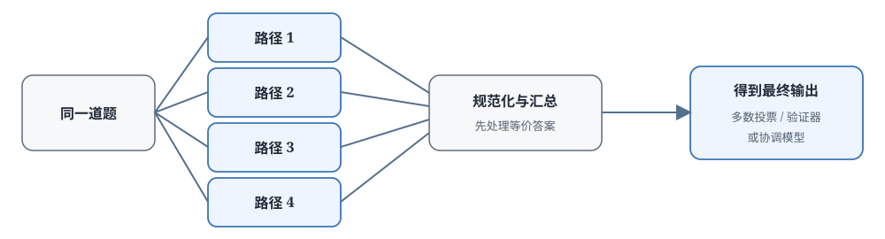

# 17.6 并行推理与答案汇总

上一节讲的推理时搜索是串行的：先生成一步，等 PRM 打分，再决定下一步扩展哪条路，每一步都要等上一步的结果。如果手上有多张 GPU、算力充足，就不必这样一步步等。

还是用二次方程的例子。假设有 4 张 GPU 可以同时跑，与其让一张 GPU 在搜索树上串行地做"生成—评分—扩展"，不如让 4 张 GPU 同时开工：第一张用因式分解，第二张用求根公式，第三张试配方法，第四张从几何意义入手。四条完整的推理同时跑完，最后再比较哪个结果对、哪个推导清楚。

这就是**并行推理**的思路：不急于在中间做决策，先让多条路都走完，再汇总选择。最朴素的汇总方式是**多数投票**：三个答案是 $-2$ 和 $-3$，一个答案是 $3$ 和 $-2$，多数票就是 $-2$ 和 $-3$。还可以做得更细：让一个协调器模型把四条推理都读一遍，看哪条路虽然答案对但中间算错了，哪条路解释更清楚，甚至把不同路径的优点整合起来给出更好的答案。

本节先比较串行深度和并行广度各适合什么任务，再用 PaCoRe 看协调器怎么读取多条路径并交换信息，然后把"让模型生成评价"的思路推广到 GenRM 和 LLM-as-Judge，最后把整章的 verifier 和推理策略串成一条可操作的决策线。



## 推理算力如何分配给深度与广度

假设总 token 预算固定，比如愿意为一道题花 10000 个 token，有两种花法：让一条路径想很久（深度），或者生成多条较短路径（广度）。前者保留连续的思考状态，后者增加解法的多样性。任务是否有多个可行解、各路径能不能并行执行、最后有没有可靠的聚合器，这三个问题共同决定选哪种。

[第 16 章 Test-time Compute Scaling](../chapter19_reasoning/test-time-scaling) 已经讨论过这两种花法，这里系统对比一下：

- **串行深度（Sequential Depth）**：让模型生成一条很长的 CoT，反复检查、修订、回溯
- **并行广度（Parallel Breadth）**：让模型生成多条独立的 CoT，最后用某种方式聚合结果

- **串行深度**
  - 代表: 长推理、顺序修订、树搜索
  - 算力分配: 一条路径连续保留状态
  - 适合的任务: 后一步依赖前一步的证明、代码调试与工具调用任务
  - 主要代价: 轮数增加会累积墙钟延迟（没法并行），早期错误也会传播
- **并行广度**
  - 代表: Best-of-N、Self-Consistency
  - 算力分配: 多条路径独立生成
  - 适合的任务: 存在多种独立解法且结果容易比较的任务
  - 主要代价: 总计算随路径数线性增加，还需要一个可靠的聚合器

并行广度的一个实际好处：硬件足够时，多条路径可以同时跑，墙钟延迟不会像串行搜索那样随步数线性增加。但它不会减少总计算量，该花的 token 还是要花。如果资源不足，多条路径也只能排队执行，并行的速度优势就没有了。

### 多数投票的工程细节

说到多数投票，有一个容易忽略的工程问题。假设五条路径的最终答案是：

```text
x = -3,  x = -2,  x = -3.0,  x = 3,  x = -3
```

如果直接按字符串做精确匹配统计，会把 $-3$ 和 $-3.0$ 当成两个不同的答案，统计结果就乱了。所以投票之前第一步永远是**答案规范化**：统一格式、约分、排序解集：比如都化成最简分数、解集按从小到大排。规范化之后，$-3$ 出现了 4 次，多数票很明确。但语义等价的问题（比如 $\frac{1}{2}$ 和 $0.5$、$(x-2)(x-3)$ 和 $x^2-5x+6$）没法只靠规则解决，需要语义判断。这正是训练过的协调器试图超越简单统计的地方。

多数投票什么时候可靠，有一个经典的定量结论。设每条路径独立得到正确答案的概率是 $p$，$N$ 条路径里答对的条数服从二项分布，多数票正确的概率是

$$
P(\text{多数正确}) = \sum_{k > N/2} \binom{N}{k}\, p^{k}\,(1-p)^{N-k}.
$$

只要 $p > 0.5$，这个概率随 $N$ 增大而上升：取 $p=0.6$，$N=5$ 时多数正确率约 0.68，$N=11$ 时升到约 0.75。但这个推导有两个强假设：各条路径的错误互相独立，且正确答案唯一、可以归并。系统性错误会同时破坏这两点：所有路径在同一个地方犯同一个错时，错误答案反而拿到全票，$N$ 再大也救不回来。这就是为什么难题上投票的提升经常远小于这个公式的预测。

::: details 补充：0.68 是怎样加出来的

取 $p=0.6$、$N=5$，多数正确意味着 5 条里至少 3 条答对。按二项分布逐项展开：

$$
P = \binom{5}{3} 0.6^3\, 0.4^2 + \binom{5}{4} 0.6^4\, 0.4 + \binom{5}{5} 0.6^5.
$$

三个因子各自的意思：$\binom{5}{3}=10$ 是组合数，表示 5 条路径里哪 3 条答对有多少种情况；$0.6^3$ 是这 3 条各自答对的概率；$0.4^2$ 是其余 2 条各自答错的概率。代入计算：

$$
P = 10 \times 0.216 \times 0.16 + 5 \times 0.1296 \times 0.4 + 0.078 \approx 0.346 + 0.259 + 0.078 = 0.683.
$$

单次正确率 0.6 的模型，5 条投票后正确率升到约 0.68，提升不到 9 个百分点。想要更明显的提升就要加路径数：$N=11$ 时要把 6 到 11 项全部加起来，得到约 0.75，代价是计算量翻倍还多。
:::

::: details 人类解题时的深度与广度权衡
做数学压轴题时的过程通常是：

1. 读完题，脑中同时出现两三个解题方向：几何法、代数法、坐标法
2. 每个方向在心算里往前走一两步，估计哪个更有希望（第一轮并行生成）
3. 选最有希望的方向深入计算，卡住了就退回来换另一个方向
4. 算完答案，再用另一种方法快速验算，两种方法结果一致才提交（多轮汇总）

既不在一条路上走到底，也不把每种方法都完整算一遍，大脑在自动做深度和广度的权衡。PaCoRe 这类工作把这个过程用代码实现了。
:::

### PaCoRe 怎样协调多条推理

[PaCoRe](https://github.com/stepfun-ai/PaCoRe)（StepFun，2026 技术报告）用多轮消息传递扩展了并行推理。每轮并行的路径数可以配置，比如典型配置 `[32, 4]` 表示：第一轮并行生成 32 条路径探索方向，把这 32 条的核心内容压缩成一条协调消息，第二轮带着这条消息再生成 4 条更深入的协调路径，最后输出答案。

每一轮的信息交换：

```text
┌─────────────────────────────────────────────────────┐
│ Step 1: 第r轮并行生成K_r条推理                       │
│   - 输入：原问题 + 上一轮压缩后的协调消息             │
│   - 各路径独立探索，互不干扰                          │
├─────────────────────────────────────────────────────┤
│ Step 2: 把本轮K_r条路径压缩成一条协调消息             │
│   - 保留：候选方法有哪些、哪里有冲突、关键中间结论    │
│   - 控制长度：太长了下一轮放不进上下文窗口            │
├─────────────────────────────────────────────────────┤
│ Step 3: 未到最后一轮就回到Step 1继续；最后一轮生成答案 │
│   - 训练时用outcome reward（最终答案对不对）评价      │
└─────────────────────────────────────────────────────┘
```

### 协调器与投票的差别

PaCoRe 和"Best-of-N + Majority Vote"看起来都是生成多条路再选，但信息流动的方式完全不同：

- **Majority Vote（多数投票）**：最后一步做一次简单统计：哪个答案出现次数最多就选哪个
- **PaCoRe 协调器**：每轮都把多条推理里的方法、冲突、关键结论压缩成消息，让后续一轮带着这些信息继续修正和综合，而不是只看最终答案出现几次

协调器理论上带来两点帮助：

- **处理等价答案**：多条路径写法不同但结论等价时（比如 $\frac{1}{2}$ 和 $0.5$），协调器可以做语义判断；多数投票只能靠预先写好的规范化规则
- **比较推理依据**：两条路径碰巧得到相同答案时，协调器仍可以检查中间步骤：一个是逐步推导出来的，一个是碰巧得到的，质量完全不同。当然，判断质量仍受协调模型自身能力限制，它也可能看走眼

### 训练 PaCoRe

PaCoRe 训练时只需要结果奖励（最终答案对不对给 1 分或 0 分），不要求逐步 PRM 标签。但这也带来一个信用分配问题：最后答案对了，是这一轮哪几条路径的功劳？奖励怎么分给它们？

```python
def pacore_reward(prompt, target_answer, round_widths):
    message = ""
    for round_id, width in enumerate(round_widths):
        reasonings = [model.generate(prompt, message) for _ in range(width)]
        if round_id < len(round_widths) - 1:
            message = coordinator.compact(prompt, reasonings)
        else:
            final_answer = coordinator.answer(prompt, reasonings)

    reward = 1.0 if final_answer == target_answer else 0.0
    return reward
```

这段伪代码只展示数据流。实际实现会区分中间协调消息和最终答案的生成概率，并用 GRPO 这类算法估计哪些路径和消息对最终结果贡献更大。一个结果奖励不会自动、等量地传给所有路径，那样信用分配就太粗糙了。

## 三种推理结构如何选择

协调器能利用多条完整路径，但不复用共同前缀：五条路径都先判断"这是二次方程"，这句话就要重复生成五遍；树搜索能复用节点，却增加了串行等待，每一步都要等评分。把 PaCoRe、并行思考和 MCTS 放在同一张表中，从计算结构的角度比较。

PaCoRe 论文报告了用同一个 8B 模型形成的三档推理配置：`[4]`（单轮 4 条）、`[16]`（单轮 16 条）和 `[32,4]`（两轮，第一轮 32 条、第二轮 4 条）。高档配置在 AIME 2025 上达到 93.7% 的正确率，总 test-time compute 约 187 万 token；在 HMMT 2025 上达到 94.5%，约 180 万 token。作为对比，训练起点的 RLVR-8B 单链生成分别是 84.1% 和 75.4%，但只使用约 5 万 token。

这组结果里有两个方向的变化要并排读，不能只看正确率：

- **单链 RLVR-8B**
  - 正确率（AIME 2025）: $84.1\%$
  - 总 token 约数: $5$ 万
- **`[4]`**
  - 正确率（AIME 2025）: —
  - 总 token 约数: 约 $20$ 万级
- **`[16]`**
  - 正确率（AIME 2025）: —
  - 总 token 约数: 约 $80$ 万级
- **`[32,4]`**
  - 正确率（AIME 2025）: $93.7\%$
  - 总 token 约数: $187$ 万

（中间两档的正确率论文按曲线报告，这里只列趋势方向。）

从单链到 `[32,4]`，正确率提高了约 9.6 个百分点，但 token 用量提高了约 37 倍。这组结果说明两件事：第一，训练后的协调模型确实能从更宽的并行计算中继续获益：模型到 8B 并非就到头了，靠推理策略还能提升不少；第二，提升并不便宜：高档配置用的 token 数比单链基线高了一个数量级以上。比较方案时必须把正确率、总 token、墙钟延迟和并行硬件需求放在一起报告，只说正确率是误导的。

### 三种推理结构的系统差别

- **推理结构**
  - PaCoRe: 多轮并行路径与压缩消息
  - 公开的 Deep Think 接口: 并行考虑多个假设，内部算法未完整公开
  - MCTS: 显式树形状态与重复访问
- **预算控制**
  - PaCoRe: 每轮路径数和轮数
  - 公开的 Deep Think 接口: 产品 effort 或模式选择
  - MCTS: 迭代数、扩展数与 rollout 长度
- **反馈**
  - PaCoRe: 训练主要使用结果奖励
  - 公开的 Deep Think 接口: 公开资料未披露完整结构
  - MCTS: 结果、PRM 或外部 verifier
- **主要代价**
  - PaCoRe: 大量完整轨迹与消息压缩
  - 公开的 Deep Think 接口: 难以复现内部协调机制
  - MCTS: 串行选择、状态维护与多次评分

### PaCoRe 适合哪些任务

PaCoRe 适合这类任务：能够并行尝试多种方法，又能用最终答案可靠判分（答案对就是对，错就是错）。它不要求训练逐步 PRM，省了 PRM 标注和训练的成本，但需要训练模型学会压缩信息和综合多条路径的结论。并行路径数增加时，总计算近似线性增长，但性能不会保证线性提高，边际收益是递减的。如果任务要求一条路径频繁读取工具状态（比如多轮工具调用），或者中间发现错误需要立刻停止（比如代码执行报错），17.5 节讲的树搜索与逐步验证通常更合适。

::: details 为什么两轮 [32,4] 比单轮 [16] 效果好
32+4=36 条路径，和直接单轮 36 条比，为什么要分两轮？关键在于协调消息：

- 第一轮 32 条是广撒网：尽可能多地探索不同的解题方向，把可能的方法和容易出错的位置都暴露出来
- 协调器把这 32 条里的有效信息压缩成一条消息：这题大概有哪几种思路、哪里容易错、哪个方向走不通
- 第二轮 4 条带着第一轮的经验教训，更聚焦地深入推导，不再在已知走不通的路上花算力

先自由发散，再汇总要点，最后基于汇总深入，质量比所有路径各自独立生成到底更高。
:::

## 生成式模型如何评价并汇总答案

协调器要完成两项工作：判断每条回答哪里有问题，以及把多条证据压缩成一个结论。如果它只输出一个标量分数（比如 0.8 分），系统出问题时很难检查它为什么给这个分。如果让模型先生成一段自然语言的评价，再从最后判断位置的 token 概率得到分数，就得到了更一般的 **GenRM（Generative Reward Model，生成式奖励模型）**。

传统的判别式奖励模型直接输出一个标量（比如 0 到 1 之间的分数）。GenRM 先生成评价文本或判断 token，再从生成概率中读出分数，因此可以同时保留两样东西：可解释的自然语言判断依据，以及可用于 RL 和排序的数值分数。

### GenRM 的输出形式

```text
输入：prompt + response + "请评价这个回答是否正确"
输出：自然语言评价（指出哪里对、哪里错）+ [GOOD/BAD]（最后给出明确判断）
```

GenRM 直接读取判断位置上 GOOD token 的生成概率，把生成判断转换成数值奖励：

$$\text{GenRM}(q, o) = P(\text{"good"} \mid q, o, \text{prompt})$$

其中 $q$ 是问题（比如"求 $x^2+5x+6=0$ 的解"），$o$ 是待评价的回答，`prompt` 是评价指令（比如"请仔细阅读下面的解题过程，判断是否正确。如果正确，最后输出 GOOD；如果错误，最后输出 BAD"），$P(\text{"good"} \mid \cdot)$ 是模型在判断位置生成 GOOD 的概率，这个概率就是数值奖励。

用一组数字感受一下：模型看完一段正确的推理，在判断位置生成 GOOD 的概率是 0.92，奖励就是 0.92；如果推理有明显错误，生成 GOOD 的概率只有 0.15，奖励就是 0.15。不用额外训练一个分类头，直接从生成概率读分数。这是 GenRM 的关键设计。比较两个回答哪个更好时，也可以让模型输出 A 或 B，再对两个 token 的概率归一化。自然语言解释部分主要供人类调试、检查判断依据，真正进入 RL 训练的是后面可比较的数值或标签。

### GenRM 与判别式 RM

- **输出**
  - 判别式 RM: 标量、类别或偏好概率
  - GenRM: 评价文字 + 判断 token
- **训练**
  - 判别式 RM: 回归、分类或排序损失
  - GenRM: 下一个 token 预测，可直接配合偏好数据
- **调试**
  - 判别式 RM: 主要依赖分数分布和错误样本
  - GenRM: 可以直接阅读评价依据，但仍要验证评价本身对不对
- **推理**
  - 判别式 RM: 一次前向传播即可得到分数
  - GenRM: 需要生成若干评价 token，通常更慢

GenRM 的价值在于：不一定需要从头训练一个专门的奖励模型：只要有一个能生成评价的模型，给它合适的提示词，它就能边写评价边给分。专门训练过的 GenRM 可靠性会更高。

### GenRM 与 PRM 的关系

GenRM 是一个更宽泛的框架：既可以做 ORM（给整条回答一个总体评价），也可以做 PRM（给每一步推理分别评价）。

[17.3 节的 ThinkPRM](./generative-prm) 就是 GenRM 做 PRM 的典型代表。其他 GenRM 相关工作：

- **Generative Verifiers**（[Zhang et al.](https://arxiv.org/abs/2408.15240)）：让模型用 Chain-of-Thought 的方式逐步评价推理过程
- **LLM-as-Judge**（[Zheng et al.](https://arxiv.org/abs/2306.05685)）：用强模型（比如 GPT-4）作为裁判评价其他模型的输出

### LLM-as-Judge 与 Self-Rewarding

LLM-as-Judge 是 GenRM 最常见的一种用法：用一个较强的 LLM 评价候选输出的质量。应用场景：

- **benchmark 评测**：现在很多对话基准（比如 MT-Bench、AlpacaEval）都用 GPT-4 作为自动裁判，给模型回复打分排序
- **训练数据筛选**：用 LLM 从大量候选里过滤高质量训练数据，或者给偏好对排序
- **RLHF 替代**：用 LLM 的偏好判断替代人类标注偏好数据，这就是 RLAIF（RL from AI Feedback）

[Self-Rewarding LM](https://arxiv.org/abs/2401.10020)（Meta 2024）走得更远：让模型评价它自己生成的候选回答，自己给自己当奖励模型。

```python
def self_reward_training(prompt, model):
    # 1. 生成多个候选回答
    responses = [model.generate(prompt) for _ in range(N)]

    # 2. 让模型自己评价每个回答
    rewards = [model.judge(prompt, r) for r in responses]

    # 3. 用自评价的分数做RL更新（DPO或PPO）
    model = rl_update(model, prompt, responses, rewards)
```

这种方法不用单独训练一个固定的奖励模型，一套模型既做生成又做评价。但它有一个根本性的问题：生成与评价来自相近的模型，自我评价可能强化模型已有的偏差：模型自己犯的错，它自己往往看不出来。实际使用时仍需要精心设计评价提示、初始的 SFT 冷启动，以及独立的外部评测来兜底。

## 如何组合 Verifier 与推理策略

把整章的内容串起来。面对一个新任务，可以沿一条决策线选方法：先确定什么结果能够可靠验证，再判断是否需要定位中间错误，最后决定额外计算是花在树的深度搜索上，还是花在并行路径的广度上。

四个维度的变化分别发生在不同层次：

### 从判别到生成

从输出形式看：判别式 PRM 输出固定的类别标签（good/bad/neutral），生成式 PRM 给出判断理由和自然语言依据，自我评价（Self-Rewarding）直接复用当前生成模型本身。越往后越灵活、越不需要训练专门的分类头，但也越依赖模型自身的判断能力，越要靠外部测试集和形式化检查器来发现系统性偏差。

### 从深度到广度

从推理结构看：Tree of Thoughts 和 MCTS 复用中间节点，适合逐步反馈可靠、一步错会步步错的任务（比如证明、长代码）；PaCoRe 和 Best-of-N 在广度上并行生成完整路径，适合有多种独立解法、最终答案容易验证的任务（比如竞赛数学、选择题）。

### 从静态到动态

从预算分配看：固定宽度 Beam Search 每轮都留 $K$ 个，不看当前状态；自适应搜索（比如 MCTS）会根据节点分数差异和访问次数动态决定把后续预算分给哪些路径：有希望的路多投入，已经试探充分的路少投入，没试过的路保留探索预算。

### 从单一到混合

从反馈来源看：结果奖励（答案对不对）、过程奖励（每步对不对）、形式化检查（Lean、单元测试）和 LLM 评价覆盖的错误类型不同。混合使用时要明确每个分数在哪一层生效，还要处理不同分数的量纲差异和可能的冲突，不能简单地把它们相加。

## 本章小结

第 17 章从一个具体的问题开始："第六步漏掉了一个平方，最后答案却碰巧正确。只看结果给分，模型永远学不会纠正中间的错误。"从这个问题出发，逐步补上了训练与推理需要的各种反馈机制：

- **17.1 结果奖励与过程奖励**：稀疏奖励问题与信用分配，为什么结尾一个 0/1 分不够用
- **17.2 判别式 PRM**：Let's Verify Step by Step 与 PRM800K，怎么把每步判断变成分类任务
- **17.3 生成式 PRM**：ThinkPRM 的自然语言评价与标签效率，让模型边写评价边给分
- **17.4 形式化 Verifier**：AlphaProof、Lean4 与 DeepSeek-Prover-V2，用证明检查器获得确定性的形式规则反馈
- **17.5 推理时搜索**：Beam Search、ToT、MCTS 与 AlphaCodium，有了中间反馈以后，怎么在生成时搜索
- **17.6 并行推理与答案汇总**：PaCoRe、GenRM 与 LLM-as-Judge，另一种算力分配：多路并行再汇总

面对一个全新的推理任务，可以依次问五个问题，顺着这条线选方案：

1. **最终答案能否自动验证？** 如果能（数学题可以验算、代码可以跑测试），先建立一个可靠的 ORM，这是成本最低的起点
2. **错误是否会在长轨迹中传播？** 如果轨迹很长、一步错后面全错（比如复杂证明、长代码），再考虑加步骤级反馈
3. **步骤能否稳定切分和判断？** 如果可以，训练判别式 PRM；如果需要评价理由，用生成式 PRM；如果有形式化 grammar，交给形式检查器
4. **中间状态是否值得复用？** 如果前缀共享多、中间错误需要早停，用 Beam Search、ToT 或 MCTS 做树搜索
5. **多条完整解法是否更容易并行？** 如果有多种独立解法、最终验证可靠，再考虑 Best-of-N、PaCoRe 或生成式协调器

这条顺序也解释了为什么 PRM 不是所有推理任务的默认答案：评价器自身也会犯错，搜索会放大它的偏差，并行协调会消耗大量 token。先建立可靠的反馈机制，再逐步扩大推理计算量，才能让更长或更多的思考轨迹转化为真实的能力提升，而不是单纯堆算力。

接下来的章节：

- [第 18 章工业实践](../chapter16_llm_rl_industrial/industrial-post-training)：把偏好优化、RLVR、推理模型和 PRM 接入完整训练闭环
- [第 19 章 Agentic RL](../chapter22_agentic/overview)：多步 trajectory 中的 PRM 与工具调用
- [第 25 章奖励黑客](../chapter30_alignment_failures/classical-failures)：PRM 也会被 reward hacking，评价器不是万能的
