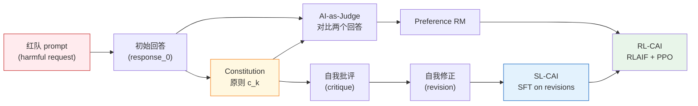
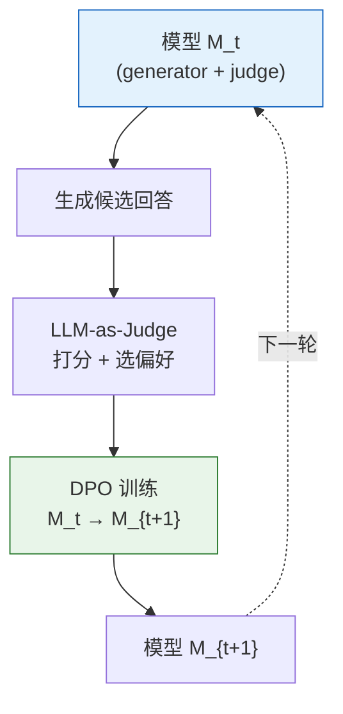

# 13.3 AI 反馈与安全原则

> 前面的 [13.1 从基座模型到指令对齐](../chapter15_rlhf/base-model-to-assistant) 和 [13.2 监督微调 SFT](../chapter15_rlhf/imitation-learning-pipeline) 已经说明如何收集人类偏好，并把 `chosen/rejected` 回答对变成奖励模型的训练信号。这条路线依赖一个前提：**偏好数据来自人类**。当模型能力逼近或超过标注员水平时，人类标注会同时遇到成本、速度和专业判断力的瓶颈。本节由此引出一个问题：**训练信号还能从哪里来？** Anthropic 2022 年提出 Constitutional AI，让 AI 按明确的安全原则评价回答、修订回答并生成偏好对；这也为后面的 RL 微调建立了另一种反馈来源。

## Constitutional AI 框架

RLHF 的痛点不是"训练算法不够好"，而是"标注数据不够用"。Anthropic 在 2022 年训练 Claude 初代时发现两个具体问题：

1. **有害内容标注成本爆炸**。让标注员给"如何制造武器"的两种回答打分，既慢、又心理负担重、又容易不一致。
2. **Helpful 与 Harmless 在 RLHF 里相互拉扯**。模型越想避免有害，就越容易回避一切稍敏感的问题，最后变成一个"什么都拒绝"的废柴助手。Anthropic 把这种现象叫 **evasiveness**（回避性）。

Constitutional AI（CAI, Bai et al. 2022）的核心洞察：**不要让人类回答"哪个回答更安全"这种问题，而是给模型一组明确的原则，让模型自己评估自己的回答**。这组原则就叫 _Constitution_（宪法），来自三处来源：

- 联合国《世界人权宣言》
- Trust & Safety 行业准则
- Anthropic 内部关于"非暴力、诚实、有用"的研究文档

### Constitution：自然语言原则

Constitution 不是数学公式，而是一段段**自然语言规则**，每条规则形如：

> "请挑选出最无害的回答。如果两个回答都无害，挑选更有用的那个。"

> "请评估回答是否在帮助用户从事非法或暴力活动；如果是，挑选拒绝得最礼貌、最坚定的回答。"

每条原则 $c_k$ 都是一个 prompt 模板，喂给模型让它对回答 $y$ 做评估。模型生成的评估文本就是 **AI feedback**。

### SL-CAI 与 RL-CAI 两条路线

CAI 在工程上拆成两个阶段。两个阶段共享同一份 Constitution，但训练信号的产生方式不同。



**SL-CAI（Supervised）**：让模型对红队 prompt $x$ 先生成一个原始回答 $y_0$；再用 Constitution $c_k$ 让模型批评自己 $\text{critique}(x, y_0, c_k)$；最后让它写出修正版 $y^* = \text{revise}(x, y_0, \text{critique}, c_k)$。把 $(x, y^*)$ 当作 SFT 数据训练模型。这条路线的好处是**直接教模型如何写出无害回答**。

**RL-CAI（Reinforcement Learning）**：对每个 prompt 生成两个回答 $y_1, y_2$，让模型（当作 judge）按 Constitution 选出更好的那个，产生偏好对 $(x, y_w, y_l)$；在这些偏好对上训一个奖励模型 $r_\phi$；最后用 PPO 最大化 $r_\phi$ 减去 KL 约束。这条路线复用了 [RLHF 的 PPO 循环](../chapter15_rlhf/ppo-rlhf-loop)，唯一替换的是"标注员"换成"AI judge"。因此 RL-CAI 通常也叫 **RLAIF**。

### 一个 SL-CAI 的最小伪代码

```python
def sl_cai_generate(base_model, redteam_prompts, constitution):
    sft_pairs = []
    for x in redteam_prompts:
        # 1. 让模型自由生成原始回答
        y0 = base_model.generate(x)

        # 2. 选一条宪法原则，让模型批评自己
        c = constitution.sample()
        critique = base_model.generate(
            f"{x}\n回答：{y0}\n"
            f"按以下原则批评上面的回答：{c}\n批评："
        )

        # 3. 让模型写修正版
        y_star = base_model.generate(
            f"{x}\n原始回答：{y0}\n批评：{critique}\n"
            f"请按 '{c}' 改写："
        )

        sft_pairs.append({"prompt": x, "response": y_star})

    return sft_pairs  # 用这份数据做 SFT
```

伪代码看起来朴素，但效果惊人。Anthropic 报告：CAI 训出的 Claude 在无害性上**超过**纯 RLHF 的版本，同时**有用性几乎不掉**——这恰好打破了 RLHF 里 "HH 互相拉扯"的诅咒。

## RLAIF：用 AI 反馈替代人类标注

RLAIF（Reinforcement Learning from AI Feedback）和 RLHF 共用 PPO 框架，差别只在偏好对的来源。下面把这条流水线逐步写清楚，并和 RLHF 做精确对比。

### 偏好对的生成

给定 prompt 集合 $\{x_i\}$，对每个 $x_i$：

1. 用当前模型 $\pi_t$ 采样两个回答 $y_1^{(i)}, y_2^{(i)} \sim \pi_t(\cdot \mid x_i)$。
2. 把 Constitution 里某条原则 $c_k$ 拼成 judge prompt：

   $$
   J(x, y_1, y_2, c_k) = \text{"Given the request } x \text{ and two responses } y_1, y_2, \text{choose the one that best follows: } c_k"
   $$

3. 让 judge 模型 $\pi_J$ 生成选择，解析出 $y_w, y_l$。
4. 把 $(x, y_w, y_l)$ 写进偏好数据集 $\mathcal{D}_{\text{AI}}$。

注意 judge 模型可以是 $\pi_t$ 自己（self-evaluation），也可以是一个更强的模型（distillation 模式）。

### 训练 Preference RM

RLAIF 仍然训练一个 RM，结构和 RLHF 完全一样，损失仍采用 [13.2 介绍的成对偏好形式](../chapter15_rlhf/imitation-learning-pipeline)：

$$
\mathcal{L}_{RM}(\phi) = -\mathbb{E}_{(x, y_w, y_l) \sim \mathcal{D}_{AI}} \log \sigma\big(r_\phi(x, y_w) - r_\phi(x, y_l)\big)
$$

唯一区别：$\mathcal{D}_{AI}$ 来自 AI judge，而 RLHF 的 $\mathcal{D}_{pref}$ 来自人类。

### PPO 循环

得到 $r_\phi$ 后，跑标准 RLHF-PPO：

$$
R_{\text{RLAIF}}(x, y) = r_\phi(x, y) - \beta \, D_{KL}\big(\pi_\theta(\cdot \mid x) \,\|\, \pi_{\text{ref}}(\cdot \mid x)\big)
$$

这一步和 [第 8 章 PPO](../chapter10_ppo/ppo-bipedal-walker) 一模一样，KL 系数 $\beta$ 仍然防止策略漂太远。

### RLHF vs RLAIF：本质区别

| 维度           | RLHF                                      | RLAIF                                          |
| -------------- | ----------------------------------------- | ---------------------------------------------- |
| 偏好来源       | 人类标注员 pairwise                       | AI judge 按 Constitution 打分                  |
| 标注成本       | 每条 $\$0.5\text{-}\$5$，需数百万条       | 仅推理成本，每条 $\sim\$10^{-4}$               |
| 标注速度       | 数周到数月                                | 每天千万条                                     |
| 标注一致性     | 标注员间 Cohen κ $\approx 0.4\text{-}0.6$ | 同一 judge 多次抽样 κ $\approx 0.7\text{-}0.9$ |
| 适合的能力域   | 价值观、风格、常识                        | 数学、代码、长上下文、专业知识                 |
| 不适合的能力域 | 超出标注员水平的推理                      | "模型本身也不知道答案"的开放问题               |

::: warning RLAIF 的能力上限
RLAIF 的质量受限于 judge 模型本身。在 Claude 2 阶段，让 Claude 2 judge Claude 2 会出现 **self-preference bias**——judge 倾向于选风格上更像自己的回答。当被 judge 的能力超出 judge 时，RLAIF 反而会强化错误答案。这正是 [第 25 章 Reward Hacking](../chapter30_alignment_failures/classical-failures) 重点讨论的"sycophancy"（谄媚）与"reward model over-optimization"问题。
:::

### 成本对比的粗算

假设要训一个 SOTA 助手，需要 50 万条偏好对。

- **RLHF 路线**：每条标注成本 $\$2$，总成本 $\$100$ 万，时间约 3 个月。
- **RLAIF 路线**：用 H100 集群推理，每条 prompt+2 个回答共 $\sim 8000$ token，H100 推理价 $\$0.002$/1k token $\Rightarrow$ 每条 $\sim\$0.016$，总成本 $\$8{,}000$，时间约 2 天。

成本差两个数量级，这是为什么 2024 年后几乎所有大模型对齐都转向 **RLAIF + 一小撮人类 high-quality 偏好** 的混合模式。

## 自我修正与自我奖励

CAI 的两个核心机制——**Self-Critique** 和 **Self-Revision**——本质上是把"思考"显式写进文本。这一节把它们的数学结构拆开看，并延伸到 Meta 2024 年的 Self-Rewarding Language Models。

### Self-Critique 形式化

给定 $(x, y_0, c_k)$，自我批评是一个条件生成：

$$
\text{critique} \sim \pi_\theta(\cdot \mid x, y_0, c_k, \text{"critique:"})
$$

它产出的不是分数，而是一段**文本批评**。这有两个好处：

1. **可解释**：批评文本能直接被人读到，比黑盒标量分数透明得多。
2. **Chain-of-Thought 效应**：让模型先写批评再写修正，相当于强迫它先"想清楚哪里错了"再"改"——这与 [CoT prompting](../chapter19_reasoning/r1-zero-pure-rl-reasoning) 是同一类机制。

经验上，**先 critique 再 revise** 比直接让模型重写质量高 10-20%（Lee et al. 2023, "Star" 自我修正实验）。

### Self-Revision 形式化

修正版回答也是条件生成：

$$
y^* \sim \pi_\theta(\cdot \mid x, y_0, \text{critique}, c_k, \text{"revision:"})
$$

整个 SL-CAI 的训练目标，就是让 $\pi_\theta$ 学会这个 $p(y^* \mid x, y_0, c_k)$ 的条件分布——具体实现就是 SFT：

$$
\mathcal{L}_{\text{SL-CAI}} = -\mathbb{E}_{(x, y_0, c_k)} \big[\log \pi_\theta(y^* \mid x, y_0, c_k)\big]
$$

注意这里有个微妙之处：SFT 数据里的 $y^*$ 是同一个模型生成的，**模型在学习"自己已经知道的最佳答案"**。这看起来循环论证，但它确实让模型把"如何修正"这个能力蒸馏进权重里，部署时不再需要显式 critique 步骤。

### Self-Rewarding Language Models

Meta 2024 年的 Self-Rewarding Language Models（Yuan et al., arXiv:2401.10020）把 CAI 的思路推到极致：**完全不要人类标注，也不要单独训 RM**，让模型在 DPO 循环里自己当 judge。

每轮迭代包含三步：



形式化：给定 prompt $x$，模型生成 $N$ 个候选 $\{y_1, \ldots, y_N\}$，再让模型自己按 "LLM-as-Judge" prompt 打分，得到分数 $\{s_1, \ldots, s_N\}$；挑出最高分 $y_w$ 和最低分 $y_l$，组成偏好对喂给 [DPO](../chapter17_dpo/dpo-theory-and-family)：

$$
\mathcal{L}_{\text{DPO}}(\theta) = -\log \sigma\Big(\beta \log \frac{\pi_\theta(y_w \mid x)}{\pi_{\text{ref}}(y_w \mid x)} - \beta \log \frac{\pi_\theta(y_l \mid x)}{\pi_{\text{ref}}(y_l \mid x)}\Big)
$$

关键观察：DPO 不需要显式 RM（[第 14 章证明](../chapter17_dpo/dpo-theory-and-family)），所以**整个流程是 self-contained 的**——模型同时是 generator、judge 和 learner。

### 三轮迭代的效果

Meta 用 Llama 2-70B 做了三轮 self-rewarding（M1 → M2 → M3），结果是：

- AlpacaEval 2 胜率：M1 55% → M2 65% → M3 72%
- Judge 能力（在 RewardBench 上）：M1 75% → M2 80% → M3 83%

::: details 为什么 Self-Rewarding 会收敛
理论上 self-rewarding 可能陷入"自吹自擂"——模型只学怎么让 judge 满意，judge 又是它自己。Meta 的实验表明前三轮还有效，但**第四轮之后基本停滞**。原因有二：

1. DPO 的参考模型 $\pi_{\text{ref}}$ 每轮更新，相当于 soft KL 约束，限制了 drift；
2. 混入一定比例真实 SFT 数据防止 capability collapse。

更深层的理论分析（Yuan et al. 2024 follow-up）显示：当 judge 能力 ≥ generator 能力时迭代有效，反之会"reward hacking"自我强化。这是为什么 self-rewarding 必须配合**外部验证信号**（如 RLVR）一起用。
:::

AI 已经可以生成偏好数据、批评回答并完成修订。接下来要解决的是判断标准：模型依据哪些原则区分有用、安全与诚实的回答？Anthropic 将这三个目标概括为 HHH——Helpful、Harmless、Honest。

## HHH 对齐原则

Constitutional AI 的底层价值框架是 **HHH**——Helpful, Harmless, Honest。这三者并非可有可无的口号，而是 Anthropic 用形式化的偏好函数刻画的三个可优化目标。

### Helpful：最大化用户效用

一个 helpful 的助手应当**真正解决用户的问题**，而不是回避或敷衍。形式化：

$$
\text{Helpful}(y \mid x) = \mathbb{E}_{u \sim \text{user}} \big[U_u(x, y)\big]
$$

其中 $U_u(x, y)$ 是用户 $u$ 对回答 $y$ 给 prompt $x$ 的效用。在 RLHF/RLAIF 里，$U$ 由偏好数据近似。

Helpful 的一个常见失败模式是**长度膨胀**（verbosity）——RM 容易给长回答高分，导致策略越训越长。Anthropic 在 Claude 训练中显式加入长度惩罚项：

$$
r_{\text{adj}}(x, y) = r_\phi(x, y) - \lambda_{\text{len}} \cdot |y|
$$

### Harmless：拒绝协助危险请求

Harmless 的形式化更微妙——不是"什么都不说"，而是"不帮助用户造成伤害"。一个典型定义：

$$
\text{Harmless}(y \mid x) = 1 - \mathbb{P}(\text{harm} \mid x, y)
$$

其中 $\mathbb{P}(\text{harm})$ 是该回答协助造成现实伤害的概率。这个量本身不可观测，CAI 用 Constitution + AI judge 来近似。

::: warning Helpful 与 Harmless 的张力
RLHF 训出的模型常出现 **evasiveness**：宁可拒绝也不冒险，于是"如何制作化肥"和"如何写一篇关于化肥的科普"都会被拒。CAI 的 Constitution 显式包含一条："如果请求本身无害（如科普、写作、研究），即使话题敏感也应该配合。"这是 CAI 相对纯 RLHF 的关键改进。
:::

### Honest：不输出错误信息

Honest 要求模型不撒谎、不假装知道、能表达不确定性。形式化：

$$
\text{Honest}(y \mid x) = 1 - D_{KL}\big(p_{\text{model}}(\cdot \mid x) \,\|\, p_{\text{true}}(\cdot \mid x)\big)
$$

这里 $p_{\text{true}}$ 是"客观真相分布"。实际中无法访问 $p_{\text{true}}$，所以用 **verifiable rewards**（数学答案、代码测试、事实检索）来近似。这也是 [RLVR](../chapter18_grpo/rlvr) 与 HHH 的连接点——RLVR 本质是 Honest 原则的硬验证版本。

### HHH 三者的联合优化

CAI 把三个目标加权组合：

$$
r_{\text{HHH}}(x, y) = \alpha_H \cdot \text{Helpful}(y \mid x) + \alpha_{HL} \cdot \text{Harmless}(y \mid x) + \alpha_{Ho} \cdot \text{Honest}(y \mid x)
$$

Constitution 的不同原则分别对应不同 $\alpha$：有些原则强调 Helpfulness（"如果请求合法请尽量配合"），有些强调 Harmlessness（"不要协助暴力"）。AI judge 在打分时把这些原则按 Constitution 权重组合，等价于一个 implicit 的 HHH 加权。

| 原则     | 典型失败模式             | CAI 的应对                              |
| -------- | ------------------------ | --------------------------------------- |
| Helpful  | 长度膨胀、模板坍缩       | 长度惩罚 + 多样性 reward                |
| Harmless | 过度回避（over-refusal） | Constitution 区分"敏感但合法" vs "危险" |
| Honest   | 幻觉、假装知道           | 显式 "I don't know" 训练 + RLVR 验证    |

## Claude 训练中的 CAI 实际应用

CAI 不是论文里的玩具，它是 Claude 全系列模型的真实训练流程。这一节梳理 Claude 2 → Claude 3 → Claude 3.5 的 CAI 演进，重点讲工业实践中的具体改动。

### Claude 2（2023）：第一版完整 CAI 落地

Claude 2 是第一个完整跑通 SL-CAI + RL-CAI 的产品级模型。关键技术细节：

- **Constitution 规模**：约 40 条原则，覆盖 HHH 三大类。
- **Self-Critique 长度**：每条 critique 限制在 200-400 token，避免太长拖慢训练。
- **Judge 模型**：使用一个比 generator 更大的模型当 judge（Claude 2 用内部 100B+ 模型 judge 50B 模型），避免 self-preference bias。
- **数据混合**：约 70% AI feedback + 30% 人类 high-quality feedback。人类 feedback 仍然保留，但只标注"AI 判断不确定"的边缘 case。

Anthropic 报告：Claude 2 相对纯 RLHF 版本，**有害性下降 50%+，过度回避率下降 30%**。

### Claude 3（2024）：Constitution 扩展与 Collective CAI

Claude 3 系列把 Constitution 从 40 条扩到 ~80 条，新增维度包括：

- **集体宪法（Collective Constitutional AI）**：Anthropic 与公开调查机构合作，让 1000+ 名不同文化背景的受访者投票决定 AI 该遵守哪些价值。结果发现全球受访者高度一致的几条：诚实、不协助暴力、尊重隐私。
- **减少过度回避**：增加原则 "拒绝请求应基于实际风险而非话题敏感度"。
- **多语言对齐**：Constitution 翻译成 20+ 语言，但保留**单一英文 master 版本**作为 ground truth，避免翻译引入的价值漂移。

工程上，Claude 3 延续 Constitutional AI 的 critique-revision 循环（Bai et al. 2022）：让模型对历史回答做事后批评，把这些批评作为额外的 SFT 数据。这相当于把部署数据闭环回训练。

### Claude 3.5（2024–2025）：CAI 与 RLVR 融合

Claude 3.5 时代的关键变化：**CAI 不再是独立流程，而是和 RLVR 融合**。具体做法：

1. **Helpfulness 训练**：以 RLVR 为主，数学/代码用规则验证，写作/指令跟随仍用 RLAIF。
2. **Harmlessness 训练**：以 CAI 为主，因为"安全"无法用规则验证，只能靠 Constitution + AI judge。
3. **Honesty 训练**：混合——事实性问题用检索增强 + verifier 模型，开放性问题用 AI judge + RLVR。

这三条线在 PPO 中以加权 reward 形式组合：

$$
R(x, y) = w_{\text{task}} r_{\text{RLVR}}(x, y) + w_{\text{safe}} r_{\text{CAI}}(x, y) + w_{\text{hon}} r_{\text{verifier}}(x, y) - \beta D_{KL}
$$

这种 **multi-objective RL** 是 Claude 3.5 / 4 的核心训练范式，也是 [第 17 章 PRM 引导搜索](../chapter20_prm_search/inference-time-search) 的奖励组合方式之一。

### Claude 3.5 的几个工程经验

::: tip 工业界共识（截至 2025）

1. **纯 RLAIF 不可靠**：必须有少量人类 high-quality feedback 锚定。
2. **Constitution 越长越难调**：80 条已经是边际收益递减点，更多原则会导致相互冲突。
3. **Judge 模型必须比 generator 强**：否则 self-preference bias 严重。
4. **安全训练和能力训练必须解耦**：否则 KL 约束会拖慢能力提升。
   :::

HHH 给出了目标，但几十条并列原则仍可能互相冲突。Claude 4 系列的 Constitution 进一步把原则组织成层级化价值框架，并用情境训练与审计机制把这些原则落实到工程系统中。

## 从原则清单到情境化价值观

Anthropic 2026 年公开发布了一份 80 页的 Claude 4 系列 Constitution 文档。它将宪法式对齐从“列举规则”推进到“社会化”（socialization）：模型需要在具体情境中理解价值冲突，并依据上层目标作出判断。

### 从规则列表到价值观框架

旧版 Constitution 主要由并列原则组成。新版引入层级结构：

```
顶层：北极星价值（North Star）
  ├── Helpful 子树
  │     ├── 真正解决问题
  │     ├── 区分请求与行动
  │     └── 主动澄清歧义
  ├── Harmless 子树
  │     ├── 不协助严重伤害
  │     ├── 比例原则（拒绝强度匹配风险）
  │     └── 保护弱势群体
  └── Honest 子树
        ├── 表达不确定性
        ├── 区分事实与推测
        └── 承认错误
```

每个叶子节点对应一条具体原则，冲突时由上层优先级仲裁。例如“Helpful 解决问题”和“Harmless 比例原则”发生冲突时，系统按照风险等级加权：低风险任务更强调提供帮助，高风险任务更强调控制伤害。

这种层级结构让 AI judge 获得明确的判断顺序，减少几十条并列原则互相冲突的问题。

### Socialization：让模型内化价值

Socialization 借用了社会学中的“社会化”概念。价值判断依靠在具体情境中观察、模仿和修正形成，无法只靠背诵规则获得。

工程实现上，Claude 4 训练引入了**情境化对齐（contextual alignment）**：

1. 不再让模型单独背诵原则 $c_k$，而是构造大量**情境—行为对**（scenario-action pairs），让模型在情境中体现价值。
2. Judge prompt 从“按原则 $c_k$ 评估”改成“在该情境下，一个理想助手应当怎么做”。
3. 训练损失从单一偏好损失扩展为偏好损失与情境一致性正则：

$$
\mathcal{L} = \mathcal{L}_{\text{pref}} + \lambda_{\text{ctx}} \cdot \mathcal{L}_{\text{context-consistency}}
$$

其中 $\mathcal{L}_{\text{context-consistency}}$ 衡量模型在不同情境下的回答是否与 Constitution 框架一致。

::: details 为什么 Socialization 比规则列表更鲁棒
规则无法穷尽真实部署中的情境。Socialization 训练的是价值判断能力，使模型能够处理训练数据没有覆盖的新情况。Anthropic 报告 Claude 4 在分布外安全情境上的鲁棒性高于规则列表版本。这与 [Computer Use](../chapter25_computer_use/training) 中模型需要在新环境中泛化的要求直接对应。
:::

### 可审计性

层级化 Constitution 还要求模型决策能够追溯到具体原则。这需要三个环节共同支持：

1. **Judge 决策可解释**：judge 除了给出分数，还要说明判断依据。
2. **训练数据可追溯**：每个偏好对标注触发了 Constitution 中的哪些节点。
3. **部署日志可审计**：记录模型作出价值判断时使用的依据，支持事后检查。

形式化地，模型输出 $y$ 附带归因 $a(y) \in \mathcal{P}(\text{Constitution})$，表示该回答依据的原则分布。Judge 的偏好损失可以写成：

$$
\mathcal{L}_{\text{audit}} = -\mathbb{E} \big[\log \sigma\big(r_\phi(x, y_w, a_w) - r_\phi(x, y_l, a_l)\big)\big] + \lambda_{\text{attr}} \cdot \text{Entropy}(a_w)
$$

熵项避免归因总是坍缩到同一条原则；当多条原则共同影响决策时，系统需要显式保留这些依据。

### Claude Constitution 的工程演进

| 维度       | Claude 2/3 Constitution | Claude 4 Constitution      |
| ---------- | ----------------------- | -------------------------- |
| 结构       | 并列原则列表            | 层级化价值树               |
| 学习方式   | 规则匹配 + AI judge     | 情境化 socialization       |
| 冲突处理   | 由 judge 隐式决定       | 按价值层级显式仲裁         |
| 可解释性   | 隐式奖励                | 原则归因与判断说明         |
| 分布外泛化 | 较弱                    | 通过情境训练提高泛化       |
| 审计能力   | 难以追溯                | 决策可以追溯到对应原则节点 |

这条路线和 [第 25 章的 AI 监督与失准研究](../chapter30_alignment_failures/classical-failures)、[附录 A.2 训练系统底座](../appendix_industrial_training/rl-infrastructure)共同构成工业级对齐系统。

## 本节总结

从人类反馈转向 AI 反馈，改变了偏好数据的生产方式，也引入了新的可靠性问题：

1. **Constitutional AI** 让模型依据自然语言原则自我批评和修订，SL-CAI 与 RL-CAI 分别通过 SFT 和 PPO 使用这些数据。
2. **RLAIF** 用 AI judge 扩展偏好标注，但 judge 的能力与偏差决定了数据质量，因此仍需要高质量人类反馈校准。
3. **自我修正与自我奖励**让模型同时承担生成者、评判者和学习者，外部验证信号用于限制自我强化错误。
4. **HHH** 将 Helpful、Harmless、Honest 组织成三个可优化目标，并通过多目标奖励处理它们之间的冲突。
5. **层级化 Constitution** 用情境训练和原则归因取代简单的规则罗列，使模型能够处理新情境并支持审计。

[第 15 章 强化学习环境与验证器](../chapter18_grpo/rl-environments)继续讨论奖励信号的另一部分：如何用可执行环境和验证器判断数学答案、代码与工具调用是否正确，从而把软偏好与硬规则结合起来。

## 延伸阅读

- [Bai et al. 2022 “Constitutional AI: Harmlessness from AI Feedback”](https://arxiv.org/abs/2212.08073)
- [Lee et al. 2023 “RLAIF: Scaling Reinforcement Learning from Human Feedback with AI Feedback”](https://arxiv.org/abs/2309.00267)
- [Yuan et al. 2024 “Self-Rewarding Language Models”](https://arxiv.org/abs/2401.10020)
- [Askell et al. 2021 “A General Language Assistant as a Laboratory for Alignment”](https://arxiv.org/abs/2112.00861)
- [Anthropic 2024 “Collective Constitutional AI: Aligning a Language Model with Public Input”](https://www.anthropic.com/research/collective-constitutional-ai-aligning-a-language-model-with-public-input)
- [Anthropic 2026 “Claude 4 Constitution”](https://www.anthropic.com/research/claudes-constitution)
- [Sharma et al. 2023 “Towards Understanding Sycophancy in Language Models”](https://arxiv.org/abs/2310.13548)
- [Gao et al. 2022 “Scaling Laws for Reward Model Overoptimization”](https://arxiv.org/abs/2210.10760)
