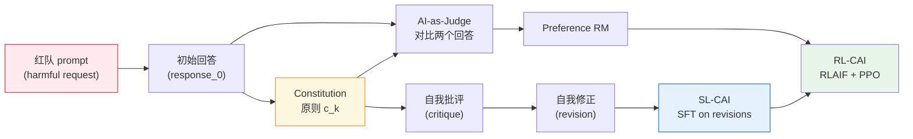
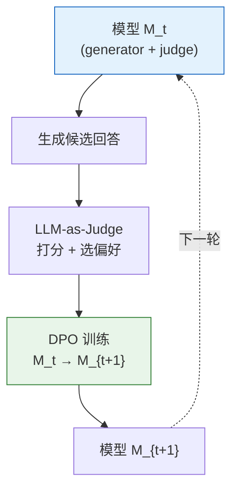

# 第 21 章 · Constitutional AI 与 RLAIF

> [第 15 章 RLHF](../chapter15_rlhf/intro) 把"人类标注偏好 → 奖励模型 → PPO"这条流水线讲通了；[第 17 章 DPO/GRPO](../chapter17_dpo/intro) 进一步把它精简成不需要 RM、不需要 Critic 的形式。但所有这些方法都默认一个前提：**偏好数据来自人类**。当模型能力逼近或超过标注员水平时，这个前提就崩了——人类既标不动（成本和速度），也标不准（在数学、代码、长上下文上判断力不够）。本章回答一个问题：**当人类标注成为对齐瓶颈时，训练信号从哪来？** Anthropic 2022 年的答案是 *Constitutional AI: Harmlessness from AI Feedback*——让 AI 自己当裁判、自己改作文、自己生成偏好对。

## 21.1 Constitutional AI 框架

RLHF 的痛点不是"训练算法不够好"，而是"标注数据不够用"。Anthropic 在 2022 年训练 Claude 初代时发现两个具体问题：

1. **有害内容标注成本爆炸**。让标注员给"如何制造武器"的两种回答打分，既慢、又心理负担重、又容易不一致。
2. **Helpful 与 Harmless 在 RLHF 里相互拉扯**。模型越想避免有害，就越容易回避一切稍敏感的问题，最后变成一个"什么都拒绝"的废柴助手。Anthropic 把这种现象叫 **evasiveness**（回避性）。

Constitutional AI（CAI, Bai et al. 2022）的核心洞察：**不要让人类回答"哪个回答更安全"这种问题，而是给模型一组明确的原则，让模型自己评估自己的回答**。这组原则就叫 *Constitution*（宪法），来自三处来源：

- 联合国《世界人权宣言》
- Trust & Safety 行业准则
- Anthropic 内部关于"非暴力、诚实、有用"的研究文档

### Constitution 的形式 与 自然语言原则

Constitution 不是数学公式，而是一段段**自然语言规则**，每条规则形如：

> "请挑选出最无害的回答。如果两个回答都无害，挑选更有用的那个。"

> "请评估回答是否在帮助用户从事非法或暴力活动；如果是，挑选拒绝得最礼貌、最坚定的回答。"

每条原则 $c_k$ 都是一个 prompt 模板，喂给模型让它对回答 $y$ 做评估。模型生成的评估文本就是 **AI feedback**。

### SL-CAI 与 RL-CAI 两条路线

CAI 在工程上拆成两个阶段。两个阶段共享同一份 Constitution，但训练信号的产生方式不同。



**SL-CAI（Supervised）**：让模型对红队 prompt $x$ 先生成一个原始回答 $y_0$；再用 Constitution $c_k$ 让模型批评自己 $\text{critique}(x, y_0, c_k)$；最后让它写出修正版 $y^* = \text{revise}(x, y_0, \text{critique}, c_k)$。把 $(x, y^*)$ 当作 SFT 数据训练模型。这条路线的好处是**直接教模型如何写出无害回答**。

**RL-CAI（Reinforcement Learning）**：对每个 prompt 生成两个回答 $y_1, y_2$，让模型（当作 judge）按 Constitution 选出更好的那个，产生偏好对 $(x, y_w, y_l)$；在这些偏好对上训一个奖励模型 $r_\phi$；最后用 PPO 最大化 $r_\phi$ 减去 KL 约束。这条路线复用了 [RLHF 的 PPO 循环](../chapter15_rlhf/ppo-rlhf-loop)，唯一替换的是"标注员"换成"AI judge"。因此 RL-CAI 通常也叫 **RLAIF**。

### 一个 SL-CAI 的最小伪代码

```python
def sl_cai_generate(base_model, redteam_prompts, constitution):
    sft_pairs = []
    for x in redteam_prompts:
        # 1. 让模型自由生成原始回答
        y0 = base_model.generate(x)

        # 2. 选一条宪法原则，让模型批评自己
        c = constitution.sample()
        critique = base_model.generate(
            f"{x}\n回答：{y0}\n"
            f"按以下原则批评上面的回答：{c}\n批评："
        )

        # 3. 让模型写修正版
        y_star = base_model.generate(
            f"{x}\n原始回答：{y0}\n批评：{critique}\n"
            f"请按 '{c}' 改写："
        )

        sft_pairs.append({"prompt": x, "response": y_star})

    return sft_pairs  # 用这份数据做 SFT
```

伪代码看起来朴素，但效果惊人。Anthropic 报告：CAI 训出的 Claude 在无害性上**超过**纯 RLHF 的版本，同时**有用性几乎不掉**——这恰好打破了 RLHF 里 "HH 互相拉扯"的诅咒。

## 21.2 RLAIF 与 用 AI 反馈替代人类标注

RLAIF（Reinforcement Learning from AI Feedback）和 RLHF 共用 PPO 框架，差别只在偏好对的来源。下面把这条流水线逐步写清楚，并和 RLHF 做精确对比。

### 偏好对的生成

给定 prompt 集合 $\{x_i\}$，对每个 $x_i$：

1. 用当前模型 $\pi_t$ 采样两个回答 $y_1^{(i)}, y_2^{(i)} \sim \pi_t(\cdot \mid x_i)$。
2. 把 Constitution 里某条原则 $c_k$ 拼成 judge prompt：

   $$
   J(x, y_1, y_2, c_k) = \text{"Given the request } x \text{ and two responses } y_1, y_2, \text{choose the one that best follows: } c_k"
   $$

3. 让 judge 模型 $\pi_J$ 生成选择，解析出 $y_w, y_l$。
4. 把 $(x, y_w, y_l)$ 写进偏好数据集 $\mathcal{D}_{\text{AI}}$。

注意 judge 模型可以是 $\pi_t$ 自己（self-evaluation），也可以是一个更强的模型（distillation 模式）。

### 训练 Preference RM

RLAIF 仍然训一个 RM，结构和 RLHF 完全一样，损失仍是 [Bradley-Terry 形式](../chapter15_rlhf/reward-function-design)：

$$
\mathcal{L}_{RM}(\phi) = -\mathbb{E}_{(x, y_w, y_l) \sim \mathcal{D}_{AI}} \log \sigma\big(r_\phi(x, y_w) - r_\phi(x, y_l)\big)
$$

唯一区别：$\mathcal{D}_{AI}$ 来自 AI judge，而 RLHF 的 $\mathcal{D}_{pref}$ 来自人类。

### PPO 循环

得到 $r_\phi$ 后，跑标准 RLHF-PPO：

$$
R_{\text{RLAIF}}(x, y) = r_\phi(x, y) - \beta \, D_{KL}\big(\pi_\theta(\cdot \mid x) \,\|\, \pi_{\text{ref}}(\cdot \mid x)\big)
$$

这一步和 [第 7 章 PPO](../chapter10_ppo/intro) 一模一样，KL 系数 $\beta$ 仍然防止策略漂太远。

### RLHF vs RLAIF 与 本质区别

| 维度           | RLHF                                       | RLAIF                                              |
| -------------- | ------------------------------------------ | -------------------------------------------------- |
| 偏好来源       | 人类标注员 pairwise                        | AI judge 按 Constitution 打分                      |
| 标注成本       | 每条 $\$0.5\text{-}\$5$，需数百万条        | 仅推理成本，每条 $\sim\$10^{-4}$                   |
| 标注速度       | 数周到数月                                 | 每天千万条                                         |
| 标注一致性     | 标注员间 Cohen κ $\approx 0.4\text{-}0.6$  | 同一 judge 多次抽样 κ $\approx 0.7\text{-}0.9$     |
| 适合的能力域   | 价值观、风格、常识                         | 数学、代码、长上下文、专业知识                     |
| 不适合的能力域 | 超出标注员水平的推理                       | "模型本身也不知道答案"的开放问题                   |

::: warning RLAIF 的能力上限
RLAIF 的质量受限于 judge 模型本身。在 Claude 2 阶段，让 Claude 2 judge Claude 2 会出现 **self-preference bias**——judge 倾向于选风格上更像自己的回答。当被 judge 的能力超出 judge 时，RLAIF 反而会强化错误答案。这正是 [第 33 章 Reward Hacking](../chapter30_alignment_failures/intro) 重点讨论的"sycophancy"（谄媚）与"reward model over-optimization"问题。
:::

### 成本对比的粗算

假设要训一个 SOTA 助手，需要 50 万条偏好对。

- **RLHF 路线**：每条标注成本 $\$2$，总成本 $\$100$ 万，时间约 3 个月。
- **RLAIF 路线**：用 H100 集群推理，每条 prompt+2 个回答共 $\sim 8000$ token，H100 推理价 $\$0.002$/1k token $\Rightarrow$ 每条 $\sim\$0.016$，总成本 $\$8{,}000$，时间约 2 天。

成本差两个数量级，这是为什么 2024 年后几乎所有大模型对齐都转向 **RLAIF + 一小撮人类 high-quality 偏好** 的混合模式。

## 21.3 自我修正与自我奖励

CAI 的两个核心机制——**Self-Critique** 和 **Self-Revision**——本质上是把"思考"显式写进文本。这一节把它们的数学结构拆开看，并延伸到 Meta 2024 年的 Self-Rewarding Language Models。

### Self-Critique 形式化

给定 $(x, y_0, c_k)$，自我批评是一个条件生成：

$$
\text{critique} \sim \pi_\theta(\cdot \mid x, y_0, c_k, \text{"critique:"})
$$

它产出的不是分数，而是一段**文本批评**。这有两个好处：

1. **可解释**：批评文本能直接被人读到，比黑盒标量分数透明得多。
2. **Chain-of-Thought 效应**：让模型先写批评再写修正，相当于强迫它先"想清楚哪里错了"再"改"——这与 [CoT prompting](../chapter19_reasoning/intro) 是同一类机制。

经验上，**先 critique 再 revise** 比直接让模型重写质量高 10-20%（Lee et al. 2023, "Star" 自我修正实验）。

### Self-Revision 形式化

修正版回答也是条件生成：

$$
y^* \sim \pi_\theta(\cdot \mid x, y_0, \text{critique}, c_k, \text{"revision:"})
$$

整个 SL-CAI 的训练目标，就是让 $\pi_\theta$ 学会这个 $p(y^* \mid x, y_0, c_k)$ 的条件分布——具体实现就是 SFT：

$$
\mathcal{L}_{\text{SL-CAI}} = -\mathbb{E}_{(x, y_0, c_k)} \big[\log \pi_\theta(y^* \mid x, y_0, c_k)\big]
$$

注意这里有个微妙之处：SFT 数据里的 $y^*$ 是同一个模型生成的，**模型在学习"自己已经知道的最佳答案"**。这看起来循环论证，但它确实让模型把"如何修正"这个能力蒸馏进权重里，部署时不再需要显式 critique 步骤。

### Self-Rewarding Language Models

Meta 2024 年的 Self-Rewarding Language Models（Yuan et al., arXiv:2401.10020）把 CAI 的思路推到极致：**完全不要人类标注，也不要单独训 RM**，让模型在 DPO 循环里自己当 judge。

每轮迭代包含三步：



形式化：给定 prompt $x$，模型生成 $N$ 个候选 $\{y_1, \ldots, y_N\}$，再让模型自己按 "LLM-as-Judge" prompt 打分，得到分数 $\{s_1, \ldots, s_N\}$；挑出最高分 $y_w$ 和最低分 $y_l$，组成偏好对喂给 [DPO](../chapter17_dpo/dpo-theory-and-family)：

$$
\mathcal{L}_{\text{DPO}}(\theta) = -\log \sigma\Big(\beta \log \frac{\pi_\theta(y_w \mid x)}{\pi_{\text{ref}}(y_w \mid x)} - \beta \log \frac{\pi_\theta(y_l \mid x)}{\pi_{\text{ref}}(y_l \mid x)}\Big)
$$

关键观察：DPO 不需要显式 RM（[第 17 章证明](../chapter17_dpo/dpo-theory-and-family)），所以**整个流程是 self-contained 的**——模型同时是 generator、judge 和 learner。

### 三轮迭代的效果

Meta 用 Llama 2-70B 做了三轮 self-rewarding（M1 → M2 → M3），结果是：

- AlpacaEval 2 胜率：M1 55% → M2 65% → M3 72%
- Judge 能力（在 RewardBench 上）：M1 75% → M2 80% → M3 83%

::: details 为什么 Self-Rewarding 会收敛
理论上 self-rewarding 可能陷入"自吹自擂"——模型只学怎么让 judge 满意，judge 又是它自己。Meta 的实验表明前三轮还有效，但**第四轮之后基本停滞**。原因有二：
1. DPO 的参考模型 $\pi_{\text{ref}}$ 每轮更新，相当于 soft KL 约束，限制了 drift；
2. 混入一定比例真实 SFT 数据防止 capability collapse。

更深层的理论分析（Yuan et al. 2024 follow-up）显示：当 judge 能力 ≥ generator 能力时迭代有效，反之会"reward hacking"自我强化。这是为什么 self-rewarding 必须配合**外部验证信号**（如 RLVR）一起用。
:::

## 本节总结

Constitutional AI（CAI）的核心是用 AI 反馈替代人类标注——让模型自己评判、自己改写、自己生成偏好对。RLAIF 把 CAI 生成的偏好对喂给标准 RLHF pipeline。Self-Correction 和 Self-Rewarding 进一步把"AI 评判 AI" 推到极致。

下一节 [21.2 HHH 原则与 Claude 实践](./hhh-practice) 讲解 Anthropic 实际在 Claude 训练中如何落地 HHH（Helpful, Harmless, Honest）三原则。
