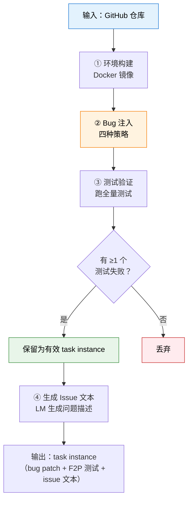

# 20.4 Agent 数据制造——以 SWE-smith 为例

前面几节讨论了 Agentic RL 的理论框架、工具调用策略和评测体系。现在面对一个更现实的问题：**训练数据从哪来？**

代码 Agent 的 RL 训练需要大量"问题→代码修改→测试验证"的三元组。但真实世界的 bug 报告和修复记录极为稀缺——SWE-bench 花了数百小时人工整理，最终只收集到 2294 条有效样本。这个规模远不足以训练一个强代码 Agent。

SWE-smith（Yang et al., 2025）给出了一条截然不同的路线：**不是等真实 bug 发生，而是自动制造 bug**。它为任意 Python 仓库自动生成数百到数千条 task instance，最终在 128 个 GitHub 仓库上制造了 50,000+ 条训练数据——比此前所有工作加起来还多一个数量级。

## 改代码、跑测试、筛有效

SWE-smith 的直觉可以用一句话概括：**故意往好代码里注入 bug，然后跑测试看哪些 bug 被检测到了**。

这背后有一个关键洞察——一个"好的训练样本"需要满足两个条件：

1. **代码确实被改坏了**：修改后的代码包含真实 bug
2. **测试确实能检测到**：仓库的测试套件中至少有一个测试因此失败

条件 2 尤其重要。如果注入的 bug 连测试都检测不到，那 Agent 学到的就是"随便改改就能通过"，而不是"找到并修复真正的 bug"。

整个流水线如下图所示：



下面逐一拆解每个环节。

## 环境构建——一个仓库一个 Docker 镜像

往代码里注入 bug 之前，先要确保能跑通原始仓库的测试。这一步看似简单，实则极其繁琐——不同仓库依赖不同的 Python 版本、系统库、数据库、环境变量……SWE-smith 的做法是：

1. 让 SWE-agent 自动尝试安装仓库并运行测试
2. 人工审查 SWE-agent 的操作记录，提炼出正确的安装步骤
3. 将安装步骤固化为 Dockerfile，构建 Docker 镜像

一个仓库只需构建一次镜像。所有后续的 bug 注入和测试验证都在这个镜像内执行。

::: tip 存储优化
SWE-bench 为每个 task instance 创建一个独立的 Docker 镜像，平均 1–3 GB。1000 个 task 就是 1 TB 存储。SWE-smith 改为**一个仓库一个镜像**，1000 个 task 只需 1 GB——存储开销降低 1000 倍。这是因为所有 task instance 共享同一个基础环境，只在代码层面有差异。
:::

## Bug 注入——四种策略

环境就绪后，开始向代码中注入 bug。SWE-smith 提供了四种互补的 bug 注入策略，覆盖从简单到复杂的各类场景。

### LM 生成——让模型写 bug

向 LM 提供一个函数的源码，要求它"把这个函数改坏"。这听起来简单，但 LM 有时会"不小心"把函数改对了，或者改出一个语法错误（这不算好的 bug——语法错误太容易被发现）。SWE-smith 的做法是明确提示 LM "引入一个微妙的逻辑错误"。

```
给 LM 的 prompt（简化版）：

你是一个软件测试工程师。下面是一个 Python 函数的源码：

{function_source}

请在保持函数签名不变的前提下，引入一个微妙的逻辑错误。
要求：
1. 不改变函数名和参数
2. 代码仍然可以正常运行（不抛异常）
3. 但在特定输入下会返回错误结果

输出修改后的完整函数。
```

以 Python 标准库 `collections.Counter` 的 `most_common` 方法为例：

```python
# 原始代码（简化）
def most_common(self, n=None):
    if n is None:
        return sorted(self.items(), key=_itemgetter(1), reverse=True)
    return _heapq.nlargest(n, self.items(), key=_itemgetter(1))

# LM 注入 bug 与 把 reverse=True 改为 False
# 排序方向反了——返回的是最不常见的元素，而非最常见的
def most_common(self, n=None):
    if n is None:
        return sorted(self.items(), key=_itemgetter(1), reverse=False)  # bug!
    return _heapq.nlargest(n, self.items(), key=_itemgetter(1))
```

这个 bug 的特点是：(1) 不改变函数签名，(2) 代码正常运行不报错，(3) 在大多数测试中返回的结果看起来"差不多"但顺序是反的。LM 生成的 bug 通常语义丰富，适合训练 Agent 的定位和推理能力。

### 程序化修改——AST 级变换

不依赖 LM，而是直接在抽象语法树（AST）层面做机械变换。SWE-smith 定义了 13 种变换技术，分为四大类：

| 类别                       | 变换方式             | 典型效果                      | 产率（产生有效 bug 的比例） |
| -------------------------- | -------------------- | ----------------------------- | --------------------------- |
| **类（Class）**            | 打乱类中方法定义顺序 | 破坏依赖初始化顺序的逻辑      | 1.93%                       |
| **控制流（Control Flow）** | 删除条件分支         | 跳过本应执行的逻辑            | ~30%                        |
|                            | 删除循环体           | 循环变成空操作                | ~20%                        |
|                            | 反转条件判断         | `if A` 变成 `if not A`        | 47.04%                      |
| **表达式（Expression）**   | 替换运算符           | `+` 变 `-`，`==` 变 `!=`      | ~25%                        |
|                            | 替换常量             | `0` 变 `1`，`True` 变 `False` | ~15%                        |
| **删除（Removal）**        | 删除函数体           | 函数变成 `pass` 或返回 `None` | ~35%                        |
|                            | 删除 return 语句     | 函数返回 `None`               | ~30%                        |

以 `django/utils/dateformat.py` 中的日期格式化函数为例：

```python
# 原始代码
def format(self, format_string):
    result = []
    for token in format_string:
        if token in self.format_mapping:
            result.append(str(self.format_mapping[token]))
        else:
            result.append(token)
    return ''.join(result)

# 反转条件判断后（invert conditional）
def format(self, format_string):
    result = []
    for token in format_string:
        if token not in self.format_mapping:  # 反转！
            result.append(str(self.format_mapping[token]))
        else:
            result.append(token)
    return ''.join(result)
```

反转条件后，格式化 token 被当成普通字符保留，普通字符反而被当作格式化 token 处理——日期格式化输出完全混乱。

::: warning 产率差异极大
"打乱类中方法顺序"只有 1.93% 的概率产生有效 bug——绝大多数时候测试照常通过。而"反转条件判断"高达 47.04%——几乎一半的修改都能被测试检测到。实践中需要根据仓库特点调整策略组合。
:::

### PR 镜像——撤销真实 PR

真实 PR（Pull Request）的修改是经过人工 review 的，本身代表了真实 bug 修复。SWE-smith 的做法是将 PR 的修回复原——相当于"把已经修好的 bug 再还原回去"。

```
原始仓库代码（PR 之前）→ 包含 bug
    ↓ PR 修复
修复后代码 → bug 已修
    ↓ SWE-smith 还原 PR
还原后代码 → bug 回来了（但这是一个"已知"的 bug）
```

PR 镜像的产率约 13.18%，比 SWE-bench 的 2.46% 高出 5 倍。原因是 SWE-smith 的环境是精心构建的（每个仓库一个镜像），而 SWE-bench 需要为每个 commit 搭建独立环境，失败率更高。

### Bug 组合——把简单 bug 拼成复杂 bug

前三类策略生成的 bug 只涉及单个函数或单个文件。SWE-smith 进一步将已验证的有效 bug 组合起来，构造跨函数、跨文件的复合 bug：

- **同文件组合**：把同一文件中两个函数的 bug 合并
- **跨模块组合**：把不同文件中的 bug 合并

组合后的 task instance 要求 Agent 同时定位并修复多个 bug，难度显著提升。这种策略的产率极高——因为组合的每个 bug 都已单独验证有效，组合后几乎必然导致测试失败。

## 测试验证——用测试套件当筛子

Bug 注入后，在 Docker 环境中运行仓库的全量测试套件。只保留满足以下条件的 task instance：

- **至少有 1 个 "Fail to Pass"（F2P）测试**：修改前失败、原始代码通过的测试。这证明注入的 bug 确实被测试检测到了
- **没有 "Pass to Fail"（P2F）的无关测试**：避免引入与 bug 无关的测试失败（比如因为环境配置问题）

这个验证步骤是整个流水线的质量关口。它确保了每一条训练数据都代表一个真实、可验证的代码修复任务。

## 生成 Issue 文本

验证通过的 bug patch 还缺少一个关键组件：自然语言描述。SWE-smith 用 LM 根据以下信息自动生成 GitHub Issue 风格的问题描述：

- bug 的 `.diff` patch（展示了代码具体被改了什么）
- 一个随机 F2P 测试的源码（展示了什么行为被破坏了）
- 应用 bug patch 后运行测试的输出（展示了具体的报错信息）

````
生成的 Issue 示例（简化）：

## Bug: Counter.most_common() returns results in wrong order

### Description
When calling `Counter('abracadabra').most_common(3)`, the method
returns `[('r', 2), ('b', 2), ('a', 5)]` instead of the expected
`[('a', 5), ('b', 2), ('r', 2)]`. The results appear to be sorted
in ascending rather than descending order.

### Reproduction
```python
from collections import Counter
c = Counter('abracadabra')
print(c.most_common(3))
# Expected: [('a', 5), ('b', 2), ('r', 2)]
# Actual:   [('r', 2), ('b', 2), ('a', 5)]
````

### Environment

Python 3.11, collections module

````

至此，一条完整的 task instance 包含三个要素：(1) bug patch，(2) F2P 测试，(3) Issue 文本。这三者共同构成一个 SWE-bench 格式的训练样本。

## 为一个仓库制造训练数据

下面用一个具体例子演示整个流程。以 `sympy/sympy`（Python 符号计算库）为例。

### 环境准备

```bash
# 安装 SWE-smith
pip install swesmith

# 构建 sympy 的 Docker 环境
python -m swesmith.build_repo sympy/sympy
````

这会生成一个 `sympy__sympy` 的 Docker 镜像，包含所有依赖和可运行的测试套件。

### LM 生成 Bug

```python
from swesmith.bug_gen.lm import generate_bug_lm

# 对 sympy 的指定函数生成 bug
task_instances = generate_bug_lm(
    repo="sympy__sympy",
    target_functions=["simplify", "expand", "factor"],
    model="gpt-4o",
    num_bugs_per_func=5,
)

print(f"Generated {len(task_instances)} candidate bugs")
```

### 程序化修改

```python
from swesmith.bug_gen.procedural import generate_bug_procedural

# 在 AST 层面做机械变换
task_instances = generate_bug_procedural(
    repo="sympy__sympy",
    strategies=["invert_conditional", "remove_loop", "change_operator"],
    num_candidates=100,
)
```

### 验证和过滤

```python
from swesmith.validate import validate_task_instances

# 运行测试验证，只保留有效 task instance
valid_instances = validate_task_instances(
    repo="sympy__sympy",
    candidates=task_instances,
    docker_image="sympy__sympy",
    timeout=300,  # 每个测试最多 5 分钟
)

print(f"Valid: {len(valid_instances)} / {len(task_instances)}")
```

### 生成 Issue

```python
from swesmith.issue_gen import generate_issue

for instance in valid_instances:
    instance.issue_text = generate_issue(
        patch=instance.bug_patch,
        test_source=instance.f2p_test_code,
        test_output=instance.test_output,
    )
```

### 一条完整的 Task Instance

经过上述流程，最终得到如下结构的训练数据：

````python
task_instance = {
    # 基本信息
    "repo": "sympy/sympy",
    "instance_id": "sympy__sympy-12345",

    # Bug 信息
    "bug_patch": """
diff --git a/sympy/simplify/simplify.py b/sympy/simplify/simplify.py
@@ -123,7 +123,7 @@
 def simplify(expr, **kwargs):
-    expr = sympify(expr)
+    expr = expand(expr)  # Bug: should be sympify, not expand
     ...
""",

    # F2P 测试（修复前失败、修复后通过的测试）
    "test_patch": """
diff --git a/sympy/simplify/tests/test_simplify.py
+def test_simplify_basic():
+    assert simplify("x^2 + 2*x + 1") == "(x+1)^2"
""",

    # Issue 文本（Agent 看到的问题描述）
    "problem_statement": """
## Bug: simplify() incorrectly expands instead of simplifying

When calling `simplify("x^2 + 2*x + 1")`, the result is
`x**2 + 2*x + 1` instead of the expected `(x+1)**2`.

### Reproduction
```python
from sympy import simplify
result = simplify("x^2 + 2*x + 1")
print(result)  # Expected: (x+1)**2, Got: x**2 + 2*x + 1
````

""",
}

````

## 四种策略的对比与选择

下表总结了四种 bug 注入策略的特点和适用场景：

| 策略 | 产率 | Bug 特点 | 计算开销 | 适用场景 |
| --- | --- | --- | --- | --- |
| **LM 生成** | 中等（~20%） | 语义丰富、贴近真实 bug | 高（需要 LM 推理） | 生成高质量、多样化的 bug |
| **程序化修改** | 差异大（2–47%） | 机械、可预测 | 极低（AST 操作） | 快速生成大量候选 |
| **PR 镜像** | 较高（~13%） | 真实、经过人工审查 | 中等（需要 PR 历史） | 对齐真实 bug 分布 |
| **Bug 组合** | 极高（>90%） | 多点故障、高难度 | 低（组合已有 bug） | 提升任务难度和多样性 |

实践中，推荐组合使用多种策略——先用程序化修改和 LM 生成大量基础 bug，再用 Bug 组合构造高难度样本。

## 数据规模与训练效果

SWE-smith 使用上述流水线，在 128 个流行的 Python 仓库上生成了 50,000+ 条 task instance。仓库覆盖 Web 框架（Django、Flask）、数据科学（scikit-learn、pandas）、开发工具（pytest、pip）等多个领域。

| 指标 | SWE-bench | SWE-gym | R2E-gym | **SWE-smith** |
| --- | --- | --- | --- | --- |
| Task instance 数量 | 2,294 | 1,283 | 1,468 | **50,000+** |
| 仓库数量 | 12 | 11 | 8 | **128** |
| 存储需求 | ~2.3 TB | ~1.3 TB | ~1.5 TB | **~128 GB** |
| 人工标注 | 数百小时 | 数十小时 | 数十小时 | **几乎为零** |

用这批数据训练的 SWE-agent-LM-32B 在 SWE-bench Verified 上达到 40.2% Pass@1，是当时开源模型中的最佳成绩。

## 从数据制造到 Agent 训练

制造出数据只是第一步。这些 task instance 如何用于 Agent 的 RL 训练？核心流程如下：

```mermaid
flowchart LR
    A["SWE-smith\nTask Instances"] --> B["Agent Rollout"]
    B --> C["Agent 读 Issue\n→ 定位 bug\n→ 生成修复 patch"]
    C --> D["测试验证\n（F2P 测试）"]
    D --> E{"测试通过？"}
    E -->|"是"| F["reward = 1.0"]
    E -->|"否"| G["reward = 0.0"]
    F --> H["GRPO / PPO\n更新策略"]
    G --> H

    style A fill:#fff3e0,stroke:#f57c00,color:#000
    style H fill:#e3f2fd,stroke:#1976d2,color:#000
````

训练循环包含三个关键步骤：

1. **Rollout**：Agent 读取 Issue 文本，在 Docker 环境中浏览代码、定位 bug、生成修复 patch
2. **验证**：运行 F2P 测试验证修复是否正确——这是 RLVR 的天然场景
3. **策略更新**：用 GRPO 或 PPO 根据测试结果更新 Agent 策略

这里有一个精妙的设计：**SWE-smith 的数据天然适配 RLVR（可验证奖励）范式**——不需要训练 Reward Model，直接用测试是否通过作为 reward。这大幅降低了训练复杂度，也避免了 Reward Hacking 的风险。

## SWE-smith 的启示与局限

### 启示

**数据制造 > 数据收集。** 传统做法是"等真实 bug 发生、收集 bug 报告、人工标注"。SWE-smith 证明了一条更高效的路线："主动制造 bug、自动验证、批量生成"。这个思路可以推广到其他 Agent 场景——不只是代码，任何有自动化验证手段的领域（数学证明、电路设计、游戏关卡）都可以用类似方法制造训练数据。

**验证是关键。** Bug 注入策略本身并不复杂——往代码里加 bug，本科生都会。SWE-smith 的真正贡献在于设计了一套严格的验证流程：只有被测试检测到的 bug 才是有效训练样本。这确保了数据质量，也解释了为什么"产率"如此重要——不是注入了多少 bug，而是多少 bug 通过了验证。

**环境复用降低门槛。** "一个仓库一个镜像"的设计将存储需求降低了 1000 倍，使得个人研究者也能用单台机器处理上百个仓库。

### 局限

**仅支持 Python。** SWE-smith 目前只处理 Python 仓库。扩展到 JavaScript、Java、C++ 等语言需要重新设计环境构建和测试验证流程。

**Bug 分布与真实 bug 有差异。** 程序化修改生成的 bug（如反转条件）偏机械，与真实开发中复杂的逻辑错误有差距。LM 生成的 bug 更接近真实，但产率更低且成本更高。

**测试覆盖率是天花板。** 如果一个仓库的测试覆盖率很低，很多 bug 注入后根本不会触发测试失败，这些 bug 就被过滤掉了。这意味着 SWE-smith 在测试覆盖率高的仓库上效果最好，而很多小型项目的测试并不充分。

## 本章小结

SWE-smith 代表了 Agent 数据工程的一个重要方向：**用算法自动制造训练数据，替代昂贵的人工标注**。它的核心流程——"注入 bug → 跑测试 → 筛有效 → 生成 Issue"——简洁、可扩展、适用于任何有测试套件的 Python 仓库。

这个思路与本书前面讨论的 RLVR（第 7 章）天然契合：制造出的 task instance 有明确的验证手段（测试是否通过），可以直接用作 RL 的 reward 信号，无需训练额外的 Reward Model。

在更广泛的 Agentic RL 数据工程中，SWE-smith 的方法论可以总结为一条通用原则：**找到领域中的自动化验证手段（测试、编译、运行、比较），围绕它构建数据制造流水线**。

::: details 参考资料

- Yang J, Lieret K, Jimenez CE, et al. "SWE-smith: Scaling Data for Software Engineering Agents." [arXiv:2504.21798](https://arxiv.org/abs/2504.21798), NeurIPS 2025 D&B Spotlight.
- SWE-smith 官方网站：[swesmith.com](https://swesmith.com)
- GitHub 仓库：[SWE-bench/SWE-smith](https://github.com/SWE-bench/SWE-smith)
- 数据集：[SWE-bench/SWE-smith on HuggingFace](https://huggingface.co/datasets/SWE-bench/SWE-smith)（50k+ task instances）
- 训练出的模型：[SWE-agent-LM-32B](https://huggingface.co/SWE-bench/SWE-agent-LM-32B)

  :::
