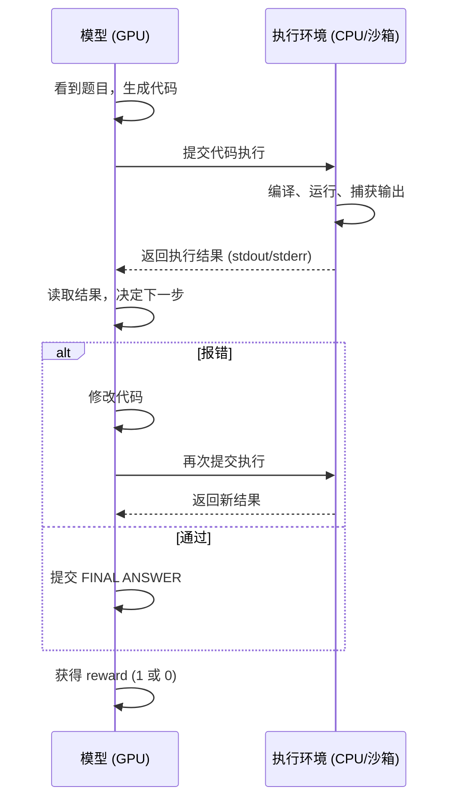
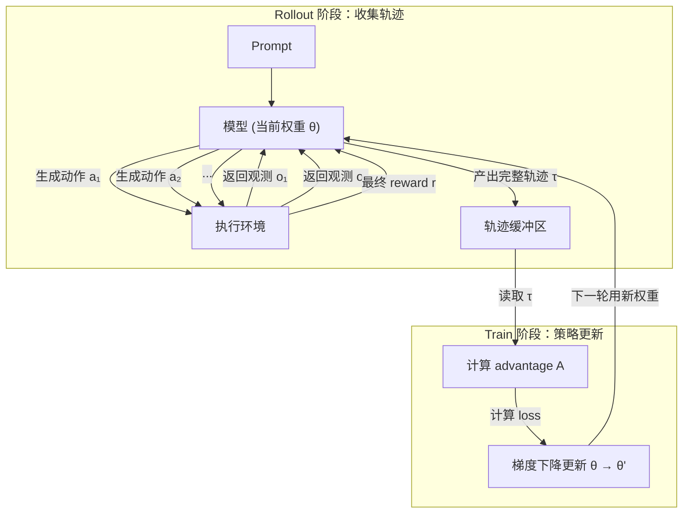
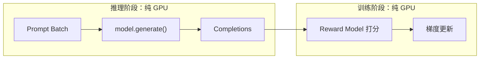
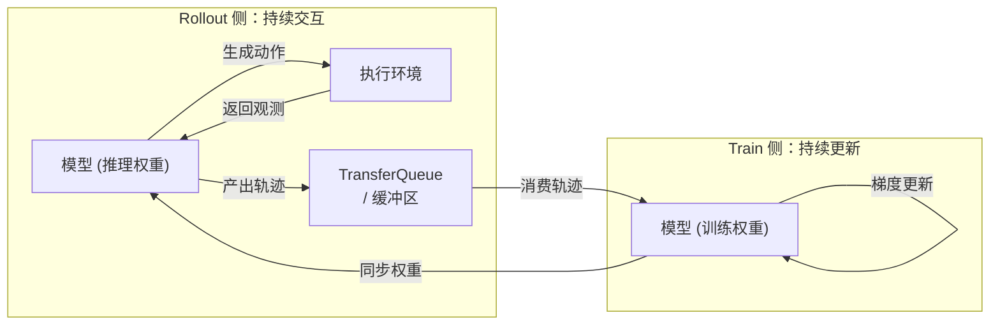
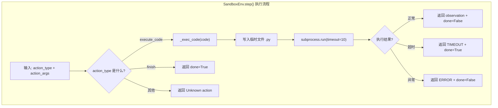
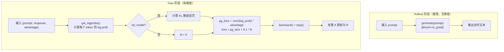
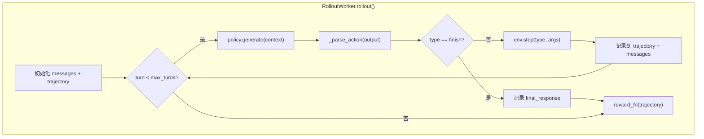
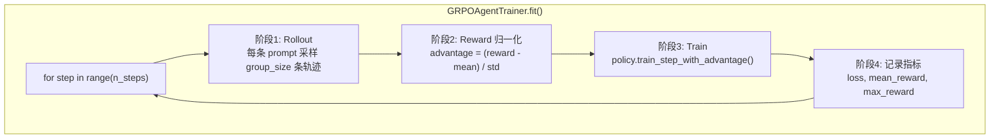
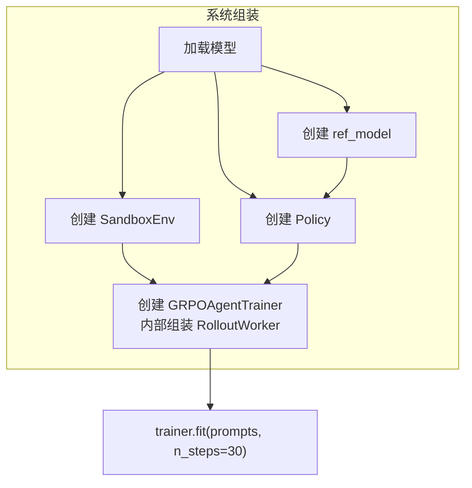

# 10.6 动手 与 从零实现一个 Agentic RL 训练系统

在 10.1 节和 10.2 节中，我们讨论了 Agentic RL 的决策框架和环境交互的设计思想；在 10.3 节至 10.5 节中，我们分析了 OpenRLHF、veRL、Relax 等框架的架构。本节将从这些讨论出发，用可运行的代码把这些概念变成具体实现。

具体来说，我们将训练一个语言模型 Agent，使其能够自主解决编程题：看到题目后自行编写代码、执行代码、读取输出，如果报错则修改代码并重新执行，直到给出正确答案。整个系统控制在 500 行以内，使用 CPU 即可运行。

本节实现参照了 [hyunwoongko/nanoRLHF](https://github.com/hyunwoongko/nanoRLHF) 的思路——用最少的代码还原核心结构。但我们的目标不只是"跑通"，而是**理解训练系统的结构是如何从训练循环本身自然推导出来的**。读完本节后再阅读 veRL 或 Relax 的源码，会对这些框架的抽象层有更清晰的理解。

本节的完整实现代码可以在本书 GitHub 仓库查看：`https://github.com/walkinglabs/hands-on-modern-rl/tree/main/docs/chapter22_agentic/code/`。

## Agentic RL 训练系统的 Infra 基础

要理解一个 Agentic RL 训练系统为什么长成 Relax 或 veRL 那样，我们需要先回到训练循环本身——不是看框架的类图，而是看**一个 episode 里到底发生了什么事**。

### 一个 episode 的流程

考虑 Agent 解决编程题的完整过程：



这个流程有两个关键特征：

1. **动作间依赖**：模型只有在拿到环境反馈后，才能决定下一步动作。第 $t$ 步的输出 $a_t$ 依赖于第 $t-1$ 步的观测 $o_{t-1}$，无法像文本生成那样一次性并行采样多个完整序列。
2. **跨设备延迟**：每轮交互都涉及 **GPU（模型推理）→ CPU（动作解析）→ 沙箱（代码执行）→ CPU（结果回传）→ GPU（下一步推理）** 的往返，其中沙箱执行的时间尺度是毫秒到秒级，远大于 GPU 内部的内存访问延迟。

### 训练循环的流程

单次 episode 的交互只是产生了一条轨迹。训练本身是一个反复循环的过程：



具体来说：

- **Rollout 阶段**：模型以当前策略 $π_θ$ 与环境交互，完成一个或多个 episode，产出完整的交互轨迹 $τ = (s_0, a_0, o_0, s_1, a_1, o_1, ..., r)$。这里的关键是**on-policy**：轨迹必须由当前策略生成，才能准确评估该策略的表现。
- **Reward 计算**：根据轨迹的最终结果（如答案是否正确）计算 reward。中间步骤没有即时反馈。
- **Advantage 估计**：使用 GRPO 等方法，对同一 prompt 的多个轨迹做组内归一化，计算每条轨迹的 advantage。
- **梯度更新**：基于 advantage 对策略参数 $θ$ 做梯度上升（提升高 advantage 轨迹的概率），得到更新后的权重 $θ'$。
- **循环**：下一轮 rollout 使用更新后的权重 $θ'$ 重新采样轨迹，如此反复。

这个循环就是经典的 **rollout → reward → train → repeat**。在传统 RLHF 中，rollout 和 train 可以在一个 batch 内紧凑完成；但在 Agentic RL 中，rollout 阶段被环境 I/O 频繁打断，如果串行执行，train 阶段会长时间等待。

### 与传统 RLHF 的对比

传统 RLHF（如摘要、对话场景的 PPO/GRPO）的训练流程完全不同：



在 RLHF 中：

- **推理**是对一个 batch 的 prompt **并行**生成 completion，过程完全在 GPU 内完成，不需要与外部环境交互。
- **训练**是对这一批 completion 统一计算 reward、advantage，然后做一次梯度更新。
- 两个阶段内部都是**连续的 GPU 运算**，中间没有 I/O 中断，可以高效地按 batch 对齐：一批推理 → 一批训练。

但在 Agentic RL 中，推理过程被环境交互频繁打断。如果我们把推理和训练**串行**执行——等一个 episode 全部交互完成后再做梯度更新——那么在整个 episode 期间，GPU 都处于**空闲等待**状态。

一个 episode 可能包含多轮交互，每轮都有环境延迟，累积的空闲时间会显著放大。在现代训练集群中，**GPU 是最稀缺的计算资源**，让 GPU 长时间等待 I/O 是不可接受的。

### 核心设计原则 与 推理与训练解耦

因此，Agentic RL 训练系统的核心设计原则是：**推理（rollout）和训练（train）必须解耦为两个独立的执行流**。



- **Rollout 侧**：持续与环境交互，不断产出完整的交互轨迹，推入缓冲区。
- **Train 侧**：持续从缓冲区中拉取轨迹数据，计算 advantage，执行梯度更新。
- 两者之间通过**缓冲区**（如 Relax 的 TransferQueue、veRL 的 ActorBuffer）解耦，各自以自己的节奏运行，而不是串行等待。

### 解耦带来的问题

这个"看似简单的解耦"，恰恰是所有复杂性的来源：

- **权重同步**：Train 侧更新后的权重，如何及时同步到 Rollout 侧？如果 Rollout 还在用旧权重生成轨迹，这些轨迹对当前策略的评估就不准确了。
- **队列管理**：Rollout 产出速度可能远快于 Train 消费速度，缓冲区会不会溢出？数据会不会堆积？
- **一致性**：Train 侧消费的轨迹，其生成时使用的模型权重与当前权重已经不同，如何处理这个**时间差**？

Relax、veRL 等生产框架中的 **DCS 权重同步**、**心跳机制**、**PlacementGroup 调度**、**流式队列** 等设计，本质上都是围绕这个"推理与训练异步执行"的核心问题展开的工程方案。

本节我们先不处理这些高级问题，而是写一个**同步版本**——rollout 完成后立即训练，训练完再做下一轮 rollout。这样做的目的是让四个核心组件各自的职责和交互方式在简单场景下清晰可见。理解同步版本后，再引入异步解耦、分布式、容错等扩展，方向会自然清晰。

## 从训练循环到组件设计

前面我们描述了训练循环的四个阶段：rollout → reward → train → repeat。在同步版本中，这四个阶段依次执行，构成了训练的主循环。现在我们来问：要实现这个循环，系统需要哪些组件？

### Rollout 阶段需要什么

Rollout 阶段的核心任务是"模型与环境交互，产出轨迹"。把这个任务拆开：

- **环境在哪里执行？** Agent 生成的代码需要被送到某个地方执行，执行结果需要安全地返回给模型。如果直接在训练进程中执行 `while True: pass`，整个进程会被卡死。因此我们需要一个**隔离的执行环境**——这就是 **Environment** 的职责。
- **谁来驱动多轮交互？** 单次 `generate()` 只输出一帧，但一个 episode 通常需要多轮"生成→执行→观察→再生成"。我们需要一个循环驱动器来把模型和环境串起来，收集完整的交互历史——这就是 **RolloutWorker** 的职责。
- **模型怎么生成动作、怎么接受梯度？** 模型需要一套接口用于推理（rollout 时生成代码），另一套接口用于训练（接收 advantage 做梯度更新）。同一份权重需要同时支持两种用法——这就是 **Policy** 的职责。

### Train 阶段需要什么

Train 阶段的核心任务是"从轨迹中计算 advantage，然后做梯度更新"。把这个任务拆开：

- **Advantage 怎么算？** GRPO 要求对同一个 prompt 采样多条轨迹，在组内做归一化。谁来组织"采样多条 → 计算 mean/std → 分配 advantage"这个流程？
- **梯度更新怎么触发？** Policy 提供了训练接口，但谁来决定什么时候调用、调用多少次、用什么数据？
- **整个训练循环怎么编排？** Rollout 产出轨迹、计算 advantage、调用 Policy 训练、记录指标——这些步骤的先后顺序和执行逻辑需要统一管理。

这就是 **Trainer** 的职责：编排整个"rollout → reward → train"循环，把其他三个组件组装成可运行的训练流程。

### 组件总览

| 组件              | 解决什么问题                                         | 对应训练阶段    |
| ----------------- | ---------------------------------------------------- | --------------- |
| **Environment**   | Agent 生成的代码在哪里安全执行？                     | Rollout         |
| **Policy**        | 谁生成动作？谁接受梯度更新？                         | Rollout + Train |
| **RolloutWorker** | 怎么把单步推理串成多轮交互循环？                     | Rollout         |
| **Trainer**       | 怎么组织"采样 → 算 advantage → 梯度更新"的训练循环？ | Train（编排）   |

下面我们先看一个完整的交互例子，然后逐个实现这四个组件。

## 一次完整交互长什么样

在动手写代码之前，我们先看一个具体例子。假设题目是"计算斐波那契数列第 10 项"。

理想情况下，Agent 一次写对：

| Turn | 角色  | 内容                               |
| ---- | ----- | ---------------------------------- |
| 0    | User  | "计算斐波那契数列第 10 项"         |
| 1    | Agent | 生成 Python 代码 `def fib(n): ...` |
| 1    | 环境  | 执行代码，返回 `55`                |
| 2    | Agent | FINAL ANSWER: 55                   |

但更多时候，Agent 会写出有 bug 的代码，在报错后修正：

| Turn | 角色  | 内容                        |
| ---- | ----- | --------------------------- |
| 0    | User  | "计算斐波那契数列第 10 项"  |
| 1    | Agent | 生成了有 bug 的代码         |
| 1    | 环境  | 返回 `ERROR: NameError`     |
| 2    | Agent | 看到 ERROR，修改代码        |
| 2    | 环境  | 执行修正后的代码，返回 `55` |
| 3    | Agent | FINAL ANSWER: 55            |

这个例子展示了 Agent 与环境交互的完整过程。在理想情况下 Agent 一次写对，但更多时候它需要多轮试错。无论哪种情况，交互模式都是固定的：Agent 生成动作 → 环境执行并返回观测 → Agent 根据观测决定下一步。

下面我们从 Rollout 阶段最基础的需求开始——**隔离执行**。

## Environment — 沙箱和工具执行

Agent 生成的代码要在哪里执行？一个自然的想法是直接在训练进程中运行。但如果 Agent 写出 `while True: pass` 这样的死循环，整个训练进程就会被卡住。更严重的是，Agent 可能生成删除文件的恶意代码。因此，我们需要一种机制，在隔离的环境中执行 Agent 的动作，同时将执行结果安全地返回给 Agent。

这种隔离环境需要满足三个条件：接收 Agent 的动作（代码）、安全执行并限制资源、返回执行结果和终止状态。这就是 **Environment** 组件的职责，也是 10.2 节讨论的沙箱问题的最小实现。



```python
# environment.py
import subprocess
import tempfile
import os


class SandboxEnv:
    """最轻量的沙箱：subprocess + 资源限制

    职责：接收 Agent 的动作，在隔离环境中执行，返回 (observation, done)。
    隔离方式：通过 subprocess 在独立进程中执行代码，防止死循环/恶意代码影响训练主进程。
    """

    def __init__(self, timeout=10, max_memory=256 * 1024 * 1024):
        self.timeout = timeout          # 超时限制：防止死循环
        self.max_memory = max_memory    # 内存限制（本最小实现中未强制，生产环境需用 cgroup）

    def step(self, action_type: str, action_args: dict) -> dict:
        """执行一步动作，返回观测和终止状态。

        对应 POMDP 的观测函数 O(s_t)：给定动作，返回 (observation, done)。
        支持两种动作类型：execute_code（执行代码）和 finish（结束 episode）。
        """
        if action_type == "execute_code":
            return self._exec_code(action_args["code"])
        elif action_type == "finish":
            return {"observation": "", "done": True}
        else:
            return {"observation": f"Unknown action: {action_type}", "done": False}

    def _exec_code(self, code: str) -> dict:
        """在子进程中执行代码，限制 CPU 时间和内存。

        核心隔离机制：
        1. 创建临时文件写入代码（避免污染主进程文件系统）
        2. subprocess.run() 在独立进程中执行
        3. timeout 参数限制执行时间，超时时抛出 TimeoutExpired
        4. 只返回 stdout/stderr 的最后 500 个字符（防止输出过长撑爆内存）
        """
        try:
            with tempfile.NamedTemporaryFile(mode="w", suffix=".py", delete=False) as f:
                f.write(code)
                f.flush()
                # 在独立子进程中执行，timeout 防止死循环
                result = subprocess.run(
                    ["python", f.name],
                    timeout=self.timeout,
                    capture_output=True,
                    text=True,
                )
                os.unlink(f.name)  # 执行完立即删除临时文件
                return {
                    "observation": (result.stdout + result.stderr)[-500:],  # 截断长输出
                    "done": False,
                }
        except subprocess.TimeoutExpired:
            # 超时：Agent 写了死循环，episode 应终止
            return {"observation": "TIMEOUT", "done": True}
        except Exception as e:
            # 其他异常：编译错误、语法错误等
            return {"observation": f"ERROR: {e}", "done": False}

    def reset(self):
        """重置环境状态（新 episode 开始时调用）。

        本最小实现中沙箱是无状态的，不需要清理。
        生产环境中可能需要清空文件系统、重置网络等。
        """
        pass
```

设计要点：

- `step()` 接受结构化的 action（`action_type` + `action_args`），不是纯文本。这对应 10.1 节的动作空间 $A = A_{\text{text}} \cup A_{\text{action}}$
- `_exec_code()` 用 subprocess 隔离，加 timeout 防止死循环——B.2 讨论的最轻量沙箱方案
- 返回值包含 `observation`（环境反馈）和 `done`（是否终止），对应 POMDP 的观测函数 $O(s_t)$

## Policy — 模型推理与训练

环境可以执行代码了，但谁来决定写什么代码？我们需要一个策略（Policy）来生成动作。这里使用一个 0.5B 参数的 Qwen2.5 作为策略模型。

但这里出现了一个关键问题：这个模型既要用于 rollout 阶段生成代码（推理），又要用于训练阶段接受梯度更新。同一份权重如何同时支持这两种截然不同的用法？这正是 B.1 节讨论的核心问题——我们需要对同一份权重提供两套接口：一套用于推理生成，一套用于梯度更新。



```python
# policy.py
import torch
import torch.nn.functional as F


class Policy:
    """包装一个语言模型，提供两套接口。

    核心问题：同一份权重需要同时支持推理（rollout）和训练（梯度更新）。
    解决方案：
      - generate() / get_logprobs()：rollout 阶段使用，@torch.no_grad() 不计算梯度
      - train_step_with_advantage()：训练阶段使用，计算梯度并更新权重
    """

    def __init__(self, model, tokenizer, lr=1e-5):
        self.model = model                # 主模型：推理 + 训练都用它
        self.tokenizer = tokenizer
        self.optimizer = torch.optim.AdamW(model.parameters(), lr=lr)
        self.ref_model = None             # KL 锚点：保存初始策略的拷贝

    def set_ref_model(self, ref_model):
        """保存一份初始权重的拷贝，用作 KL 散度计算的锚点。

        目的：防止训练后的策略偏离初始策略太远，保持输出分布的稳定性。
        """
        self.ref_model = ref_model

    @torch.no_grad()
    def generate(self, prompt: str, max_new_tokens=128) -> str:
        """推理模式：给定 prompt，生成文本。

        对应 rollout 阶段的 "模型生成动作"。
        使用 @torch.no_grad() 是因为 rollout 不需要计算梯度，节省显存。
        """
        inputs = self.tokenizer(prompt, return_tensors="pt").to(self.model.device)
        outputs = self.model.generate(**inputs, max_new_tokens=max_new_tokens)
        return self.tokenizer.decode(outputs[0], skip_special_tokens=True)

    @torch.no_grad()
    def get_logprobs(self, prompt: str, response: str) -> torch.Tensor:
        """计算模型对给定 response 中每个 token 的 log probability。

        rollout 阶段：用于计算当前策略对新轨迹的概率（重要性采样）。
        训练阶段：用于计算 new_logprobs（当前策略）和 ref_logprobs（旧策略）。

        关键细节：只取 response 部分（不包含 prompt）的 log prob。
        """
        full_text = prompt + response
        inputs = self.tokenizer(full_text, return_tensors="pt").to(self.model.device)
        logits = self.model(**inputs).logits

        # 计算 prompt 长度，用于切分 response 部分
        prompt_len = len(self.tokenizer(prompt, return_tensors="pt")["input_ids"][0])
        # response_logits[i] 对应 response 第 i 个 token 的预测分布
        response_logits = logits[:, prompt_len - 1:-1, :]
        response_ids = inputs["input_ids"][:, prompt_len:]

        # log_softmax 把 logits 转成 log 概率分布
        logprobs = F.log_softmax(response_logits, dim=-1)
        # gather：从分布中取出实际生成 token 对应的 log prob
        token_logprobs = logprobs.gather(2, response_ids.unsqueeze(-1)).squeeze(-1)
        return token_logprobs

    def train_step_with_advantage(self, trajectories: list):
        """一个 GRPO 训练步（REINFORCE + advantage + KL 惩罚）。

        参数：
            trajectories: list of (prompt, response, advantage)
                          prompt: 初始问题
                          response: Agent 生成的完整交互文本
                          advantage: GRPO 归一化后的优势值

        计算流程：
        1. 对每条轨迹计算 new_logprobs（当前策略的概率）
        2. 如果有 ref_model，计算 KL 散度惩罚
        3. 策略梯度 loss = -sum(log_prob) * advantage
        4. 总 loss = pg_loss + 0.1 * kl，取平均后反向传播
        """
        losses = []
        for prompt, response, advantage in trajectories:
            new_logprobs = self.get_logprobs(prompt, response)

            if self.ref_model is not None:
                with torch.no_grad():
                    # ref_logprobs：初始策略生成这段 response 的概率
                    ref_logprobs = self._get_ref_logprobs(prompt, response)
                # KL 散度（近似）：p * (log p - log q)
                kl = (new_logprobs.exp() * (new_logprobs - ref_logprobs)).sum()
            else:
                kl = 0.0

            # 策略梯度：advantage > 0 时提升该轨迹的概率，advantage < 0 时降低
            pg_loss = -(new_logprobs.sum() * advantage)
            loss = pg_loss + 0.1 * kl
            losses.append(loss)

        total_loss = torch.stack(losses).mean()
        self.optimizer.zero_grad()
        total_loss.backward()
        self.optimizer.step()
        return total_loss.item()
```

设计要点：

- `generate()` 和 `get_logprobs()` 是 rollout 阶段用的，`train_step_with_advantage()` 是训练阶段用的——同一份权重的两种用途
- `ref_model` 是 KL 惩罚的锚点，防止模型偏离初始策略太远
- 这里实现了最简的策略梯度（REINFORCE + advantage），没有 PPO 的 clipping——先跑通再优化

## RolloutWorker — 驱动 Agent Loop

Policy 可以生成单步动作，Environment 可以执行单个动作并返回结果。但回想前面的例子，Agent 做一道编程题往往需要多轮交互：写代码、看报错、修改、再执行。单次 `generate()` 只输出一帧，如何把它们串成"生成→执行→观察→再生成"的循环？

我们还需要一个组件来驱动这个循环，并在循环过程中收集完整的交互轨迹。这就是 **RolloutWorker** 的职责。



````python
# rollout_worker.py


class RolloutWorker:
    """驱动 Agent Loop，收集多轮交互轨迹。

    核心职责：把 "生成→执行→观察→再生成" 的多轮循环串起来。
    每次 rollout 产出一条完整轨迹，包含 prompt、所有交互轮次、最终回答、reward。
    """

    def __init__(self, policy, env, max_turns=5):
        self.policy = policy    # 策略模型：用于生成动作
        self.env = env          # 执行环境：用于执行动作并返回观测
        self.max_turns = max_turns  # 最大交互轮数：防止无限循环

    def rollout(self, prompt: str, reward_fn) -> dict:
        """执行一次完整的 Agent Loop，返回轨迹和 reward。

        对应训练循环中的 Rollout 阶段：
        1. 初始化对话历史（只有 prompt）
        2. 循环（最多 max_turns 轮）：
           - 把历史消息拼成 prompt → policy.generate() 生成动作
           - _parse_action() 解析动作类型和参数
           - 如果动作是 finish：episode 结束，记录最终回答
           - 否则：env.step() 执行动作，返回观测
           - 把 (动作, 观测) 加入轨迹和对话历史
        3. 用 reward_fn 计算整条轨迹的 reward
        """
        # 对话历史：维护多轮交互的完整上下文
        messages = [{"role": "user", "content": prompt}]
        # 轨迹结构：包含 prompt、交互列表、最终回答、reward
        trajectory = {"prompt": prompt, "interactions": []}

        for turn in range(self.max_turns):
            # Step 1: 把对话历史拼成模型能理解的 prompt
            context = self._format_context(messages)
            # Step 2: 模型生成动作（推理，不计算梯度）
            model_output = self.policy.generate(context)
            # Step 3: 从自由文本输出中解析结构化动作
            action = self._parse_action(model_output)

            if action["type"] == "finish":
                # Agent 决定结束 episode，提交最终答案
                trajectory["interactions"].append({
                    "turn": turn,
                    "response": model_output,
                    "action": action,
                    "observation": None,
                })
                trajectory["final_response"] = action.get("answer", model_output)
                break

            # Step 4: 环境执行动作，返回观测和终止状态
            obs = self.env.step(action["type"], action["args"])

            # Step 5: 记录本轮交互到轨迹
            trajectory["interactions"].append({
                "turn": turn,
                "response": model_output,      # Agent 生成的动作（原始文本）
                "action": action,              # 解析后的结构化动作
                "observation": obs["observation"],  # 环境返回的观测
            })

            # Step 6: 把本轮交互加入对话历史，供下一轮使用
            messages.append({"role": "assistant", "content": model_output})
            messages.append({"role": "user", "content": f"执行结果:\n{obs['observation']}"})

            if obs.get("done"):
                # 环境报告 episode 结束（如超时）
                break

        # Step 7: 计算整条轨迹的 reward（只有轨迹结束时才给）
        trajectory["reward"] = reward_fn(trajectory)
        return trajectory

    def _format_context(self, messages):
        """把多轮消息列表拼成模型能理解的 prompt。

        生产框架会用 tokenizer 的 chat_template，这里用最简单的字符串拼接。
        """
        parts = []
        for msg in messages:
            if msg["role"] == "user":
                parts.append(f"User: {msg['content']}")
            else:
                parts.append(f"Assistant: {msg['content']}")
        return "\n".join(parts)

    def _parse_action(self, model_output: str) -> dict:
        """从模型自由文本输出中解析结构化动作。

        支持两种动作格式：
        1. ```python ... ``` → execute_code（提取代码块内容）
        2. FINAL ANSWER: ... → finish（提取最终答案）
        3. 其他 → execute_code（把整个输出当作代码执行）

        生产框架会用特殊 token 做结构化解析，这里用字符串匹配足够理解概念。
        """
        if "```python" in model_output:
            code = model_output.split("```python")[1].split("```")[0]
            return {"type": "execute_code", "args": {"code": code}}
        elif "FINAL ANSWER:" in model_output:
            answer = model_output.split("FINAL ANSWER:")[1].strip()
            return {"type": "finish", "answer": answer}
        else:
            return {"type": "execute_code", "args": {"code": model_output}}
````

设计要点：

- `rollout()` 就是 Agent Loop 的代码版：每轮包含模型推理（`policy.generate()`）→ 动作解析（`_parse_action()`）→ 环境执行（`env.step()`）→ 观测回传
- 轨迹结构是 `{"prompt", "interactions": [...], "final_response", "reward"}`——比单轮 RL 的 `(prompt, completion, reward)` 复杂得多，但保留了完整的多轮交互信息
- `_parse_action()` 是简化版解析器。生产框架会用 tokenizer + 特殊 token 做结构化解析，这里用字符串匹配足够理解概念

## Trainer — 编排训练循环

到这一步，我们已经能收集完整的交互轨迹了。但光有轨迹还不够——我们需要把它们变成梯度，更新模型参数。回顾第 9 章，GRPO 的核心思想是对同一个 prompt 采样多条轨迹，在组内做比较来计算 advantage。

那么，谁来负责"采样多条轨迹 → 计算 advantage → 执行梯度更新 → 重复"这个完整的训练循环？这就是 **Trainer** 的职责。



```python
# trainer.py

from rollout_worker import RolloutWorker


class GRPOAgentTrainer:
    """编排 Agentic RL 训练循环：rollout -> reward -> train -> repeat。

    核心职责：把 Policy、Environment、RolloutWorker 组装成完整的训练流水线。
    每一轮训练包含四个阶段（对应 fit() 中的四个代码块）：
    1. Rollout：对每个 prompt 采样 group_size 条轨迹
    2. Reward 归一化：GRPO 组内比较，计算 advantage
    3. Train：用 advantage 做策略梯度更新
    4. 记录：打印训练指标
    """

    def __init__(self, policy, env, reward_fn, group_size=4, max_turns=5):
        self.policy = policy        # 策略模型：推理 + 训练
        self.env = env              # 执行环境：沙箱
        self.reward_fn = reward_fn  # 奖励函数：判断答案是否正确
        self.group_size = group_size  # GRPO 组大小：同一 prompt 采几条轨迹
        # 创建 RolloutWorker：把 policy 和 env 串成多轮循环
        self.worker = RolloutWorker(policy, env, max_turns=max_turns)
        self.history = []           # 训练历史：记录每步的 loss 和 reward

    def fit(self, prompts: list, n_steps: int = 50):
        """主训练循环：重复 n_steps 次 (rollout -> reward -> train)。

        参数：
            prompts: 训练用的编程题列表
            n_steps: 训练步数（每步 = 一轮完整的 rollout + train）
        """
        for step in range(n_steps):
            # ==================== 阶段 1: Rollout ====================
            # 对每个 prompt，采样 group_size 条独立轨迹
            # 这些轨迹组成一个 "group"，用于 GRPO 的组内比较
            batch_trajectories = []
            for prompt in prompts:
                group = []
                for _ in range(self.group_size):
                    # rollout 一条完整轨迹：多轮交互，直到 finish 或 max_turns
                    traj = self.worker.rollout(prompt, self.reward_fn)
                    group.append(traj)
                batch_trajectories.append(group)

            # ==================== 阶段 2: Reward 归一化 (GRPO) ====================
            # GRPO 核心：同一个 prompt 的多条轨迹做组内归一化
            # advantage = (reward - mean) / std
            # 这样每条轨迹的 advantage 表示它相对于"同组平均水平"的好坏
            all_rewards = []
            for group in batch_trajectories:
                group_rewards = [t["reward"] for t in group]
                mean_r = sum(group_rewards) / len(group_rewards)
                std_r = (sum((r - mean_r) ** 2 for r in group_rewards) / len(group_rewards)) ** 0.5 + 1e-8
                for t, r in zip(group, group_rewards):
                    t["advantage"] = (r - mean_r) / std_r
                all_rewards.extend(group_rewards)

            # ==================== 阶段 3: Train ====================
            # 把所有轨迹的 (prompt, response, advantage) 喂给 Policy 做梯度更新
            train_data = []
            for group in batch_trajectories:
                for traj in group:
                    # 把多轮交互序列化为一段文本，作为模型的 "response"
                    full_response = self._serialize_trajectory(traj)
                    train_data.append((
                        traj["prompt"],      # 初始问题
                        full_response,       # 完整的交互历史（Agent 的所有输出）
                        traj["advantage"],   # GRPO 计算的优势值
                    ))

            # 策略梯度更新：advantage > 0 的轨迹概率提升，advantage < 0 的降低
            loss = self.policy.train_step_with_advantage(train_data)

            # ==================== 阶段 4: 记录指标 ====================
            mean_reward = sum(all_rewards) / len(all_rewards)
            self.history.append({
                "step": step,
                "loss": loss,
                "mean_reward": mean_reward,
                "max_reward": max(all_rewards),
            })
            if step % 5 == 0:
                print(f"Step {step:3d} | loss={loss:.4f} | "
                      f"reward_mean={mean_reward:.3f} | "
                      f"reward_max={max(all_rewards):.3f}")

        return self.history

    def _serialize_trajectory(self, traj: dict) -> str:
        """把多轮轨迹序列化为一段文本，用于 train_step。

        序列化格式：
            Assistant: <动作1>
            Observation: <结果1>
            Assistant: <动作2>
            Observation: <结果2>
            ...

        注意：这里做了简化，所有 token 都参与 loss。
        生产框架会用 loss mask 区分模型生成的 token（参与 loss）
        和环境返回的 token（被 mask 掉），见 B.2 的讨论。
        """
        parts = []
        for interaction in traj["interactions"]:
            parts.append(f"Assistant: {interaction['response']}")
            if interaction["observation"]:
                parts.append(f"Observation: {interaction['observation']}")
        return "\n".join(parts)
```

设计要点：

- `fit()` 的主循环是 B.1 说的"生产者-消费者"模式：RolloutWorker 生产轨迹，Policy 消费轨迹做梯度更新
- GRPO 的组内比较在 Reward 归一化那段实现：同一 prompt 的多条轨迹计算 advantage = (reward - mean) / std
- `_serialize_trajectory()` 把多轮轨迹展成文本。这里做了简化——生产框架会用 loss mask 区分模型生成的 token 和环境返回的 token（见 B.2 的 loss mask 讨论）

## 拼起来跑

到这一步，四个组件都已各自实现。Environment 提供隔离执行，Policy 提供推理和训练接口，RolloutWorker 驱动多轮交互循环，Trainer 编排 GRPO 训练流程。但它们目前还是独立的模块。如何把它们组装成一个可运行的系统？



我们写一段入口代码来初始化各个组件并启动训练：

```python
# run.py
from transformers import AutoModelForCausalLM, AutoTokenizer

from environment import SandboxEnv
from policy import Policy
from trainer import GRPOAgentTrainer

# ==================== Step 1: 加载模型 ====================
# 使用一个小模型（0.5B 参数），CPU 即可运行
model_name = "Qwen/Qwen2.5-0.5B-Instruct"
model = AutoModelForCausalLM.from_pretrained(model_name)
tokenizer = AutoTokenizer.from_pretrained(model_name)

# ==================== Step 2: 初始化四个组件 ====================
# 2.1 Environment 与 沙箱，用于隔离执行 Agent 生成的代码
env = SandboxEnv(timeout=10)

# 2.2 Policy 与 包装模型，提供推理和训练两套接口
policy = Policy(model, tokenizer, lr=5e-5)

# 2.3 ref_model 与 KL 惩罚的锚点，保存初始策略的拷贝
# 这里用同一个 checkpoint 重新加载一份权重
ref_model = AutoModelForCausalLM.from_pretrained(model_name)
policy.set_ref_model(ref_model)

# ==================== Step 3: 定义 reward 函数 ====================
# reward 是稀疏的 与 只在轨迹结束时给出，中间步骤没有反馈
# 这里用简单规则 与 如果某轮执行没有报错/超时，认为答案正确，reward=1
def code_reward(trajectory):
    """判断轨迹中是否有成功的代码执行结果。

    注意：这是一个简化版的 reward。
    生产环境中 reward 可能由规则 + RM + LLM-as-Judge 组合给出。
    """
    for interaction in trajectory["interactions"]:
        obs = interaction.get("observation", "")
        # 如果某轮执行成功（没有 ERROR 和 TIMEOUT），认为答案正确
        if obs and "ERROR" not in obs and "TIMEOUT" not in obs:
            return 1.0
    return 0.0


# ==================== Step 4: 训练数据 ====================
# prompts 与 编程题列表，Agent 将在这些题目上训练
prompts = [
    "写一段 Python 代码计算斐波那契数列的第 10 项并输出结果。",
    "写一段代码检查字符串是否是回文。",
    "写一段代码对列表进行冒泡排序。",
]

# ==================== Step 5: 组装 Trainer 并启动训练 ====================
# Trainer 负责编排整个训练循环：
# rollout（每条 prompt 采样 4 条轨迹）-> reward（GRPO 归一化）-> train（梯度更新）
trainer = GRPOAgentTrainer(
    policy=policy,        # 策略模型
    env=env,              # 执行环境
    reward_fn=code_reward,  # 奖励函数
    group_size=4,         # GRPO 组大小：每条 prompt 采 4 条轨迹做比较
    max_turns=3,          # 每条轨迹最多 3 轮交互
)

# 在 3 个 prompts 上训练 30 步
history = trainer.fit(prompts, n_steps=30)
```

## 与生产框架的差距

跑通上面的代码后，你已经掌握了一个 Agentic RL 训练系统的基本骨架。但这个实现与 Relax、veRL 等生产框架之间还存在哪些差距？

| 方面      | 本节最小实现                | 生产框架（Relax / veRL）                               |
| --------- | --------------------------- | ------------------------------------------------------ |
| 推理引擎  | `model.generate()` 逐条生成 | vLLM / SGLang，continuous batching，KV cache           |
| 训练引擎  | 单卡 AdamW                  | FSDP / Megatron，3D parallelism，gradient accumulation |
| 分布式    | 单进程                      | Ray 集群，多机多卡，PlacementGroup                     |
| 异步训练  | rollout 和 train 串行       | TransferQueue 流式解耦，DCS 异步权重同步               |
| 沙箱      | subprocess + timeout        | Docker 容器池 / MicroVM，预热池，资源隔离              |
| Loss mask | 所有 token 都参与 loss      | 模型生成 token 参与 loss，工具返回 token 被 mask       |
| Reward    | 简单规则                    | 规则 + RM + LLM-as-Judge + verifier 组合               |
| 轨迹存储  | 内存中的 dict               | 分布式存储（Redis / S3），按任务/步骤检索              |
| 容错      | 无                          | 心跳监控，自动重启，checkpoint 恢复                    |

每个差距都是一个独立的工程优化方向。理解骨架之后，你可以按需深入任何一个方向。

## 扩展练习

1. **加 PPO clipping**：在 `train_step_with_advantage()` 中加入 PPO 的 clipped surrogate objective（参考第 7 章），对比 REINFORCE 和 PPO 的训练稳定性
2. **加 loss mask**：在 `_serialize_trajectory()` 中标记哪些 token 是模型生成的、哪些是环境返回的，只在模型生成的 token 上计算 loss
3. **加更多工具**：在 `SandboxEnv` 中加入搜索工具（mock 版本即可），让模型学会在代码执行和搜索之间做选择
4. **异步 rollout**：用 `multiprocessing` 把 rollout 和 train 拆到不同进程，用 `Queue` 传递轨迹数据，观察 GPU 利用率的变化

---

本节实现了一个最小但完整的 Agentic RL 训练系统。回顾整个过程，其核心结构可以概括为：**将 Agent Loop（10.1）和环境交互（10.2）嵌套进一个 rollout → reward → train 的 RL 循环中**。Relax、veRL 等生产框架的所有复杂性，都来自于将这个骨架扩展到多机多卡、高吞吐、长时间运行的生产环境。
