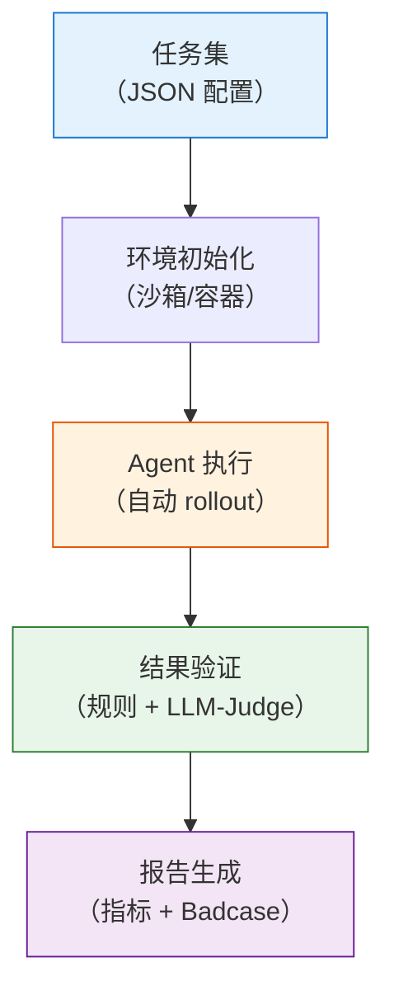

# 10.3 工业实践、评测与 Badcase

本节把原来的“工业实践”和“Benchmark 与评测”合并在一起。原因很简单：工业训练里遇到的问题，最终都要靠评测、监控、badcase 归因和回归测试来闭环。先看真实训练中的失稳、格式坍塌、幻觉和上下文问题，再看如何用 benchmark 与自建 eval 把这些问题测出来。

## Agentic RL 训练中的常见问题与解决方案

前面几节介绍了 Agentic RL 的通用工程原则和框架设计。然而，在实际训练过程中，研究者往往会遇到一系列工程问题——训练不稳定、输出长度失控、奖励指标与实际质量脱节等。这些问题在学术论文中通常不会详细讨论，但对于工程实践至关重要。

2025–2026 年间，多家团队（包括 Alibaba、Moonshot、LinkedIn、Bespoke Labs 等）陆续公开了他们在 Agentic RL 训练中的实践经验。本节不再按团队逐一介绍，而是**按照实际训练中可能遇到的问题场景**进行组织，将不同团队的发现和解决方案汇总在一起。

> **核心要点**：在 Agentic RL 中，训练的稳定性往往比算法选择更为重要。数据质量和环境的一致性是决定训练效果的关键因素。

---

### 训练数据的获取与环境构建

许多研究者在开始 Agentic RL 训练时，首先面临的问题是：如何为模型提供稳定且可复现的交互环境？

#### 真实 API 的局限性

如果直接接入真实的搜索引擎或代码执行环境进行训练，会遇到一个根本性的问题：**外部环境的输出是不可复现的**。

> **Moonshot AI** 在训练 Kimi-Researcher 时指出，Agent 所面对的环境是动态的——即使输入相同的查询，搜索引擎也可能返回不同的结果。他们在训练中主要采用了 **REINFORCE** 算法，并强调严格 On-policy 数据生成对训练稳定性的重要性 [\[参考\]](https://moonshotai.github.io/Kimi-Researcher/)。

#### 合成环境的构建

一个可行的替代方案是构建确定性的合成环境，让模型在受控的条件下进行训练。

> **Alibaba 通义团队** (Tongyi DeepResearch) 摒弃了充满噪声且不可控的在线 API，构建了一个以离线 Wikipedia 数据库和稳定工具沙盒为核心的合成训练环境。
>
> **核心方法与具体内容**：
>
> 1. **数据与环境合成 (WebShaper & AgentFounder)**：由于真实网页经常变动，导致相同 Query 在不同时间的搜索结果不一致，这严重破坏了强化学习的马尔可夫决策过程（MDP）假设。为此，他们开发了 **WebShaper**，将海量 Wikipedia 转化为静态且结构化的离线搜索环境；同时利用 **AgentFounder** 自动生成具有极高难度（PhD-level）的合成查询和基准答案。这种合成环境的**确定性**使得模型在多次 Rollout 时的动作与奖励映射关系绝对稳定。
> 2. **异步计算架构 (rLLM)**：Agentic RL 的 Rollout 阶段（即与环境交互生成长达几十步的动作轨迹）耗时极长。如果采用传统的同步 RL 架构（即训练和推理在同一批 GPU 上交替进行），由于环境交互的延迟，训练节点（GPU）将长时间处于空闲状态（GPU Idling）。他们开发的 **rLLM (Ray-based LLM)** 异步 Rollout 服务，在物理层面隔离了推理和训练：多个 Worker 节点利用高吞吐推理引擎（如 vLLM）不断与环境交互生成 Trajectory 并存入共享的 Replay Buffer，而专门的 Trainer 节点（基于 Megatron/FSDP）则持续从 Buffer 中采样并计算梯度更新模型。
>
> **深层原因与工程意义**：
> 实验证明，在高度受控、无噪声的合成环境中进行强化学习，其最终产出的模型在真实互联网环境下的泛化能力，反而**全面优于**直接使用带噪声的人类专家标注数据进行训练。其根本原因在于：模型在 RL 阶段真正需要学习的是“如何搜索、如何根据结果反思重试”的通用决策逻辑，而不是过拟合某些特定的搜索返回结果。稳定的环境信号是 RL 算法收敛的基石 [\[参考\]](https://tongyi-agent.github.io/blog/introducing-tongyi-deep-research/)。

#### 小规模数据的有效性

对于资源有限的研究者而言，高质量的小规模数据同样可以取得显著效果。

> **Amazon Science** 在复杂的 AppWorld 基准测试上验证了“极少样本定制”的可行性：他们并没有盲目收集几万条带噪声的人类交互轨迹，而是精心构建了仅 **72 个高质量训练样本**（覆盖了核心的工具调用模式、依赖关系，以及遇到 API 错误时的重试逻辑）。通过 RL 训练，成功将 Qwen-2.5-32B 的任务完成率从 39.2% 提升至 72%，一举超越了当时的最强闭源模型 Claude Sonnet 3.7/4.0。
>
> **核心方法与深层原因**：
> 这一反直觉的结果揭示了现代 Agentic RL 的一个核心洞察：对于 32B 以上参数量的基座模型，它们在预训练阶段已经具备了强大的世界知识和逻辑推理能力。此时，RL 的作用并非“向模型中注入新知识”，而是“激活（Elicit）并对齐”模型在特定环境下的交互范式与工具语法。只要这区区 72 个高质量样本能够作为“引子”，成功触发模型在环境中的有效探索（Exploration），RL 算法（如 PPO/GRPO）就能通过环境反馈的奖励信号，让模型在数万次的自我试错（Self-Play）中自行完善策略。这证明了**在基础能力达标的模型上，强化学习具有极高的数据效率，"少而精的数据 + RL 自主探索" 远胜于海量低质量的 SFT 数据** [\[参考\]](https://www.amazon.science/blog/customizing-multiturn-ai-agents-with-reinforcement-learning)。

---

### 梯度爆炸

在解决了数据和环境的准备问题后，训练启动阶段的梯度爆炸是另一个常见问题。在排查超参数之前，应当首先检查底层实现的正确性。

#### 推理引擎与训练引擎的实现差异

Agentic RL 的训练过程包含两个阶段：**推理（Rollout）** 阶段生成动作序列，**训练（Backward）** 阶段更新模型权重。这两个阶段通常由不同的引擎负责执行，而引擎之间的实现差异可能导致梯度计算不一致。

> **LinkedIn 团队** 在使用 GPT-OSS（一个 MoE 架构的开源模型）进行 RL 训练时，遇到了梯度爆炸和奖励不增长的问题。经过排查，他们发现根本原因是训练框架中 **Attention Sink 参数的反向传播未被实现**：推理引擎（SGLang 使用的 Triton kernel）支持 Attention Sink 的前向计算，但训练框架（FSDP 使用的 FlashAttention-v2）完全缺少对应的支持。他们从 vLLM 的 FlashAttention 分支中获取了前向实现，并自行编写了反向传播代码来计算 Sink 参数的梯度。修复该问题后，训练才恢复稳定 [\[参考\]](https://huggingface.co/blog/LinkedIn/gpt-oss-agentic-rl)。

**实践建议**：在使用复杂模型架构时，建议先在简单的单轮任务（如 GSM8K）上验证训练流程的正确性，确认 Loss 正常下降后，再切换到多轮 Agent 任务。

---

### 输出长度失控与格式坍塌

这是 Agentic RL 训练中最常见的问题之一：模型未能学会正确使用工具，反而开始生成大量无意义的 token，最终退化为重复的乱码输出。这种现象被称为**格式坍塌（Format Collapse）**：

```json
// 期望的输出格式：
{"action": "search", "query": "AAPL stock"}

// 格式坍塌后的输出：
{"action": "searchsearchAAPL stockAAAAA"
```

下面分析导致这一问题的三个主要原因及其对应的解决方案。

#### 奖励函数设计过于复杂

直觉上，研究者可能会设计多维度的奖励信号：工具调用成功给 +1，输出格式正确给 +1，最终答案正确给 +5。然而，这种细粒度的奖励设计可能适得其反。

**奖励博弈（Reward Hacking）** 是其中的核心问题。当奖励函数包含多个可被模型独立优化的子项时，模型可能找到只满足部分条件就能获得高奖励的策略。

> **Bespoke Labs** 的实验表明，包含工具调用次数奖励、格式检查奖励和正确性奖励的复合奖励函数，反而导致训练稳定性下降，推测原因正是奖励博弈。此外，他们还观察到输出长度持续膨胀、最终退化为无意义的乱码字符。他们最终采用的做法是：**仅保留"任务是否完成"这一个二值奖励信号**（通过 BFCL 的评估检查即为 1，否则为 0），删除所有中间过程的奖励项，训练稳定性反而显著提升 [\[参考\]](https://www.bespokelabs.ai/blog/improving-multi-turn-tool-use-with-reinforcement-learning)。

这一发现背后的逻辑是：二值的最终结果奖励不提供任何中间步骤的"捷径"，模型必须在整体上完成任务才能获得正向奖励，从而避免了针对单个奖励项的投机行为。此外，Bespoke Labs 还观察到复合奖励下输出长度持续膨胀并最终退化为乱码的现象，简化奖励设计后这一问题也得到了缓解。

#### 负样本处理不当

在训练过程中，并非所有未能完成任务的样本质量都相同。例如，模型可能因为交互步数达到上限而被环境截断，此时并未产生最终答案，但在此之前的输出可能是合理的。如果将这类样本不加区分地作为负样本给予惩罚，可能会损害模型已经习得的输出能力。

> **Alibaba 通义团队** 观察到，如果不加过滤地将所有未完成任务的轨迹视为负样本进行惩罚，在长时间训练后会导致严重的**格式坍塌**——模型为了规避因任务失败带来的整体惩罚，开始产生乱码，或者完全拒绝使用工具（因为多做多错）。
>
> **核心方法与深层原因**：
> 为解决这一长程信用分配（Credit Assignment）难题，他们在定制的 **On-policy GRPO（Group Relative Policy Optimization）算法**中，采取了以下两项核心设计：
>
> 1. **Token-level loss 与 Leave-one-out 优势估计**：相比于传统 PPO 将整个轨迹的奖励均摊到每一个动作上，GRPO 通过组内生成多个候选轨迹，计算每个动作相对于组内其他动作的相对优势（Relative Advantage），并在 Token 级别施加更精细的梯度更新，这大幅降低了奖励评估的方差。
> 2. **保守的负样本过滤策略（Conservative Negative Filtering）**：Agent 的动作具有极强的因果序列性。在长达 30 步的交互中，很多轨迹最终失败（例如超时或达到最大交互步数截断），往往只是因为最后几步的逻辑判断失误，而其前 20 步的思维链（CoT）和工具调用格式是完全正确的。如果对这类截断样本强行给予全局负奖励（如 `-1`），RL 优化器就会“倒洗澡水连孩子一起倒掉”，错误地惩罚了原本正确的格式输出。因此，他们**选择性地将这类截断样本从损失计算中剔除（Mask out）**，使得它们不贡献负向梯度。这一策略极为有效地保护了模型的基础对齐（Alignment）能力，维持了格式输出的长期稳定性 [\[参考\]](https://tongyi-agent.github.io/blog/introducing-tongyi-deep-research/)。

#### KL 散度约束的配置不当

在 RLHF/GRPO 中，通常使用 KL 惩罚项来限制当前策略模型与初始参考模型之间的偏离程度。KL 约束的作用是防止策略在训练过程中偏离初始模型太远，从而维持输出的基本质量。

这一约束的配置需要在"允许策略探索"和"维持稳定性"之间取得平衡：

- **KL 惩罚过小**：约束力不足，策略可能偏离初始模型太远，导致输出质量退化。
- **KL 惩罚过大**：约束过强，策略难以学到新的行为，训练效果受限。

> **Bespoke Labs** 在训练 Qwen2.5-7B-Instruct 时发现，将 KL 惩罚设为 0 时，模型在约 300 步后即出现输出退化。他们采用的策略是：
>
> 1. **设置微小的 KL 权重**（如 0.001），提供最小程度的约束。
> 2. **定期更新参考模型**：每隔一定步数（如 100 步），将当前策略模型复制为新的参考模型。这样，KL 约束的目标会随训练推进而动态调整，避免策略被"锚定"在过远的初始状态上 [\[参考\]](https://www.bespokelabs.ai/blog/improving-multi-turn-tool-use-with-reinforcement-learning)。

#### 输出长度控制 与 Gamma-decay 奖励

为了鼓励模型以更少的步数完成任务，可以引入基于步数衰减的奖励机制。

> **Moonshot** 提出了 **Gamma-decay Reward**。当模型正确完成任务时，奖励值随所用步数指数衰减：
>
> $$r_i = r \times \gamma^{T-i}, \quad \gamma < 1$$
>
> 其中 $T$ 是总步数，$i$ 是当前步数。这意味着：完成相同任务时，使用更少的步数会获得更高的奖励，从而引导模型学会更高效地执行任务 [\[参考\]](https://moonshotai.github.io/Kimi-Researcher/)。

---

### 长程交互中的上下文管理

Agentic RL 与传统 RL 的一个重要区别在于交互轮数可能非常长。在文献检索、代码编写、调试等复杂任务中，交互轮数可能超过 50 轮，此时上下文窗口会被大量历史信息填满，模型可能丢失对初始任务的关注。

#### 上下文管理机制

> **Moonshot** 的 Kimi-Researcher 引入了 **上下文管理（Context Management）** 机制，这是解决长程任务（Long-horizon tasks）中注意力稀释（Attention Dilution）和“迷失在中间（Lost in the Middle）”问题的关键工程实践。
>
> **核心方法与深层原因**：
> 在长达几十轮的 Agent 交互中，如果不加控制，网页的冗余 HTML 标签、成百上千行的代码执行日志等 Observation 文本，会迅速填满模型十几万 Token 的上下文窗口。随着上下文长度的急剧增加，LLM 的信噪比（SNR）会显著下降，导致模型在第 40 轮时“忘记”了用户在第 1 轮提出的原始需求。
>
> 为此，Kimi 引入了一个独立的 `context_manager` 机制。在每执行完一步（Step）后，系统会动态评估并**压缩上下文**：
>
> 1. **保留核心逻辑（Working Memory）**：将模型自身的思维链（Thought）、历史动作（Action）以及从网页中提取的关键事实保留在上下文的核心区。
> 2. **摘要或丢弃噪音**：将长篇累牍的原始网页替换为一两句话的摘要，或者直接丢弃那些已经被证明是死胡同（Dead-end）的无效搜索记录。
>
> 上下文管理本质上是在维护 Agent 的动态“工作记忆”，确保模型每一步决策的输入都是高密度的有效信息。消融实验显示，启用该机制后，不仅避免了灾难性的遗忘，还将单次 Rollout 的安全交互轮次延伸至 50 轮以上，模型能够获取更多线索，最终在复杂研究任务上取得显著更高的得分 [\[参考\]](https://moonshotai.github.io/Kimi-Researcher/)。

---

### 幻觉与事实性

在解决了训练稳定性和输出格式的问题之后，另一个需要关注的问题是 **Agent 幻觉（Hallucination）**：模型可能在搜索结果中引用不存在的文献，或者错误地使用 API 参数，却对后续推理表现出不恰当的"自信"。Agent 场景中的幻觉比纯对话场景更为复杂，因为模型不仅生成文本，还生成动作。

#### Agent 幻觉的四种类型

**工具选择幻觉。** 模型调用了一个不存在的工具，或者在不该调用工具时强制调用。例如用户询问天气信息，模型却调用了 `execute_sql`。

**参数幻觉。** 工具选择正确，但参数填写错误——编造了不存在的 API 端点、拼错了数据库名、或使用了格式不正确的参数值。最值得警惕的是：参数格式可能看起来"合理"，但实际值是虚构的。

**结果幻觉。** 这是最隐蔽的幻觉类型。模型调用了正确的工具并获得了真实的返回结果，但在解读结果时引入了偏差——将搜索结果中的无关信息当作支持自己论点的证据，或忽略了与假设矛盾的内容。

**引用幻觉。** 模型声称"根据某文献/某网站"得出某个结论，但该引用实际上不存在，或引用内容与原文不符。这在 Deep Research Agent 中尤为常见——模型可能编造论文标题、URL 和统计数据来使输出"看起来有据可查"。

#### Agent 幻觉的级联效应

在纯对话场景中，幻觉的后果通常限于提供错误信息。但在 Agent 场景中，幻觉会在多轮交互中**级联传播并自我强化**：

1. 第 3 轮：模型产生参数幻觉，调用了一个不存在的 API 参数 → 调用失败
2. 第 4 轮：模型未能识别幻觉，反而认为"该 API 存在缺陷" → 切换到另一个工具
3. 第 5 轮：新工具缺少关键功能 → 模型编造了一个看似合理的结论
4. 最终输出：一份表面上完整但建立在幻觉基础上的报告

更值得关注的是，如果 RL 的奖励仅基于最终输出质量（即 Outcome Reward），理论上模型可能发现"编造一个看似可信的答案"比"承认不确定"获得更高的奖励——这意味着 RL 训练反而可能**强化幻觉行为**。这一推断在逻辑上成立，但在已公开的工业界实践中尚未被明确报告为观察到的现象。

#### RL 训练中的幻觉惩罚机制

**引用感知评分奖励。** 清华大学与智谱 AI 联合提出的 CaRR[^carr_industrial]（Citation-aware Rubric Rewards）设计了一种细粒度的奖励机制来引导模型正确引用证据。其核心思路是将多跳问题分解为一系列原子事实陈述（Rubrics），然后通过三步流程计算奖励：（1）检查模型输出是否识别了关键实体；（2）提取输出中引用的 URL，获取网页内容，判断每条 Rubric 是否被引用内容所支持；（3）通过图上的广度优先搜索验证各 Rubric 是否在逻辑上与最终答案相连通。最终奖励为被满足且逻辑连通的 Rubric 数量占总 Rubric 数量的比率。这一机制鼓励模型为每个论断提供可验证的、逻辑连贯的引用证据。

**工具结果忠实度奖励。** 鼓励模型在解读工具返回结果时忠实于原始内容。如果模型的总结与工具实际返回的信息存在偏差（通过 NLI 模型或交叉验证检测），则给予惩罚。

**不确定性奖励。** 鼓励模型在不确定时主动表达"需要更多信息"或"该结果不确定"，而非编造答案。综合上述三种策略，可以设计一个幻觉感知的奖励函数作为示例：

> **注意**：以下代码为说明性示例，综合了多种惩罚思路，并非直接来自某一篇论文的具体实现。

```python
def hallucination_aware_reward(answer, tool_results, citations):
    """幻觉感知的奖励函数"""
    reward = base_task_reward(answer)

    # 1. 引用真实性检查
    for citation in citations:
        if not verify_citation_exists(citation):
            reward -= 0.5  # 虚假引用，惩罚
        elif not verify_citation_supports(citation, answer):
            reward -= 0.3  # 引用与论断不符

    # 2. 工具结果忠实度
    for claim in extract_claims(answer):
        if has_supporting_evidence(claim, tool_results):
            reward += 0.1  # 有据可查的论断
        elif claim_is_verifiable(claim) and not has_supporting_evidence(claim, tool_results):
            reward -= 0.2  # 可验证但无证据的论断

    # 3. 鼓励不确定性表达（诚实奖励）
    if is_complex_question and ("不确定" in answer or "需要更多信息" in answer):
        if not all_claims_supported(answer, tool_results):
            reward += 0.15  # 在确实缺乏证据时，承认不确定性是合理行为

    return reward
```

#### 基于验证的幻觉过滤

除了在奖励函数中惩罚幻觉外，还可以在**推理阶段**通过验证机制进行过滤：

**Self-RAG[^selfrag_industrial]** 提出了"自适应检索 + 自我评估"的框架。与传统 RAG 对每个查询都检索不同，Self-RAG 让模型在生成每个文本段**之前**，先通过特殊的反思 token（Reflection Token）判断是否需要检索外部信息。如果需要，则检索若干相关段落，为每条段落分别生成续写，并通过 [IsRel]（相关性）、[IsSup]（支撑度）、[IsUse]（有用性）等反思 token 对各候选续写进行打分，最终通过分段束搜索（Beam Search）选择综合得分最高的输出。该框架的核心特点是模型通过反思 token 实现了对自身输出的结构化自评估。

**CRITIC[^critic_industrial]** 提出了"工具辅助纠错"的幻觉过滤机制。模型生成初始回答后，主动调用外部工具（如搜索引擎、代码执行器）来验证关键论断，并基于工具反馈生成结构化的批评意见。如果批评意见表明回答存在问题，则模型基于批评意见重新生成修正后的回答。这一"验证→修正→验证"的循环可以迭代多轮，直到回答通过验证或达到最大迭代次数。与纯粹依赖模型自我评估的方法不同，CRITIC 引入了外部工具的客观反馈作为纠错依据。

#### 幻觉控制实践总结

| 幻觉类型     | 检测方法                | RL 惩罚策略                 |
| ------------ | ----------------------- | --------------------------- |
| 工具选择幻觉 | 工具白名单校验          | 调用不存在工具 → reward = 0 |
| 参数幻觉     | Schema 校验 + 类型检查  | 参数格式错误 → 负向 reward  |
| 结果幻觉     | NLI 模型 + 交叉验证     | 论断与工具结果矛盾 → 惩罚   |
| 引用幻觉     | URL 可达性 + 内容相关性 | 虚假引用 → 惩罚             |

一个重要的实践原则是：**幻觉惩罚应在训练早期即引入**。一旦幻觉行为通过 RL 被强化，后续消除将非常困难。

---

### 多工具协作

前面的场景是大多数 Agentic RL 训练中都会遇到的共性问题。此外，使用特定的模型架构（如 MoE）或在较小参数量的模型上进行训练时，还可能出现一些额外的问题。

#### MoE 模型的路由不确定性

MoE 模型（如 Mixtral、DeepSeek-V3）因推理成本较低而受到关注，但其路由机制可能破坏 RL 训练的基本假设。

PPO 等算法假设当前生成数据的模型与正在被训练的模型是同一个（即 On-policy），这在数学上表现为重要性采样比率等于 1。

> **LinkedIn 团队** 在使用 GPT-OSS 进行 RL 训练时发现，MoE 模型的路由网络（Gating Network）在两次前向传播中，可能为同一个 Token 选择不同的专家（Expert），导致 $\log \pi(a|s) \neq \log \pi_{\text{old}}(a|s)$，即 On-policy 假设被破坏。在排查过程中，他们曾尝试通过 `old_log_prob = log_prob.detach()` 的方式将两次概率强制对齐来验证这一假设。需要指出的是，该路由不一致问题虽真实存在，但在他们的调试中并非梯度爆炸的根本原因——根本原因在于上节所述的 Attention Sink 反向传播缺失 [\[参考\]](https://huggingface.co/blog/LinkedIn/gpt-oss-agentic-rl)。

#### MoE 模型的负载均衡问题

MoE 模型在 RL 训练中不仅面临上述路由一致性问题，还存在专家负载不均衡导致的 GPU 利用率低下。不同 Token 可能集中选择少数"热门"专家，导致负责这些专家的 GPU 成为瓶颈，而其他 GPU 则处于空闲状态。

> **Salesforce** 在其 SFR-RL 系统中提出了 **流水线同步 RL（Pipelined Synchronous）** 方案：所有 GPU 在 Rollout 和 Training 两个阶段之间交替切换，而非将 GPU 固定分配给某一阶段。此外，针对 MoE 模型，他们引入了 **Least-Loaded Expert Parallelism** 来优化专家的负载均衡。整体系统在内存效率上相比 VERL（FSDP + Context Parallelism）提升了约 250 倍，仅用 16 块 H200 即可训练 120B 参数的 MoE 模型 [\[参考\]](https://www.salesforce.com/blog/efficient-rl-training-agentic-era/)。

#### 小模型的推理能力上限

需要注意的是，RL 的本质是**激发模型已有的能力**，而非注入新的知识。模型的基础能力决定了 RL 能够达到的效果上限。

> **Amazon Science** 的实验显示：32B 参数量的模型从 RL 中获益显著，因为模型本身能够生成高质量的交互轨迹（Rollout），形成正反馈循环。但较小的模型面临基础推理能力的限制，例如无法识别不可回答的问题或从相关上下文中提取答案——这种能力的缺失，RL 训练难以弥补。对于基础能力不足的小模型，研究者的建议是通过蒸馏（Distillation）从更强的模型中获取能力，而非单纯增加 RL 训练强度 [\[参考\]](https://www.amazon.science/blog/customizing-multiturn-ai-agents-with-reinforcement-learning)。

#### 分阶段训练管线

考虑到不同规模模型的特点，一个更稳健的训练策略是采用分阶段管线，而非直接进行 RL 训练。

目前工业界对于是否需要 SFT 存在两种并行的训练范式：**SFT-RL 范式**与**Pure-RL 范式**。

> **SFT-RL 范式（主流路径）**：**Alibaba 通义团队**在 Tongyi DeepResearch 中设计了 **CPT → SFT → RL** 的三阶段训练管线。在预训练（CPT）阶段将工具调用的轨迹以文本形式融入；在 SFT 阶段利用人类或高质量合成数据培养模型的基本推理和工具使用能力；最后在 RL 阶段进行探索与优化。这种范式的核心在于：在非推理对齐（如复杂 API 调用、长程探索）场景下，SFT/RM 仍是**降低探索空间和克服冷启动难度**的最有效手段。如果模型在起步阶段不具备基本的工具使用格式，直接进行 RL 训练往往会在庞大的动作空间中迷失 [\[参考\]](https://tongyi-agent.github.io/blog/introducing-tongyi-deep-research/)。

> **Pure-RL 范式（前沿突破）**：与上述思路形成鲜明对比的是 **DeepSeek-R1-Zero** 带来的范式革命。它证明了在具备明确对错反馈（如数学、代码测试、客观推理）的场景下，**完全放弃 SFT 冷启动**，直接基于 Base Model 进行大规模强化学习是绝对可行的。在纯 RL 驱动下，模型能够自发涌现出长思维链（CoT）、自我验证、甚至自我反思等高级推理能力。这种无 SFT 偏见（Bias-free）的训练方式突破了人类标注数据的上限，但对奖励信号的客观性和环境的防作弊能力提出了极高要求。

这两种范式在 Agentic RL 中并不互斥，研究者应根据**环境是否具备完全确定性的客观奖励**来选择合适的管线。

---

### 实践总结 {#tricks}

下表汇总了各问题的对应解决方案：

| 问题                   | 解决方案                                                             | 参考             |
| ---------------------- | -------------------------------------------------------------------- | ---------------- |
| 训练环境不可复现       | 构建确定性的合成环境                                                 | Alibaba          |
| 小规模数据定制         | 高质量的小数据（如 72 条）结合 RL 也能取得显著效果                   | Amazon           |
| 训练初期梯度爆炸       | 检查推理引擎与训练引擎的底层实现一致性（如 Attention Sink 反向传播） | LinkedIn         |
| 输出退化为重复乱码     | 采用极简奖励设计（仅奖惩任务成败）；对过长的输出进行过滤             | Bespoke Labs     |
| 策略偏离初始模型       | 设置较小的 KL 惩罚（如 0.001）；定期将当前模型设为新的参考模型       | Bespoke Labs     |
| 输出效率低（步数过多） | 使用 Gamma-decay 衰减奖励，鼓励以更少步数完成任务                    | Moonshot         |
| 格式坍塌               | 采用保守的负样本处理策略，排除因超长截断而未产生最终答案的轨迹       | Alibaba          |
| 长任务上下文溢出       | 引入上下文管理机制，主动摘要或丢弃无用历史信息                       | Moonshot         |
| MoE 训练资源利用率低   | 流水线同步 RL + Expert Parallelism；16 块 H200 即可训练 120B MoE     | Salesforce       |
| MoE 路由不一致         | 注意 MoE 路由非确定性可能破坏 On-policy 假设；排查时需区分根因与表象 | LinkedIn         |
| 小模型训练效果不佳     | 通过蒸馏提升基础能力后再进行 RL；采用 CPT → SFT → RL 三阶段管线      | Amazon / Alibaba |

### 参考资料 {#references}

- Zhu J, Sang H, et al. "[Unlocking Agentic RL Training for GPT-OSS: A Practical Retrospective](https://huggingface.co/blog/LinkedIn/gpt-oss-agentic-rl)." Hugging Face Blog, 2026.
- Zhuang R, Vu T, et al. "[Improving Multi-Turn Tool Use with Reinforcement Learning](https://www.bespokelabs.ai/blog/improving-multi-turn-tool-use-with-reinforcement-learning)." Bespoke Labs Blog, 2025.
- Moonshot AI. "[Kimi-Researcher: End-to-End RL Training for Emerging Agentic Capabilities](https://moonshotai.github.io/Kimi-Researcher/)." 2025.
- Tongyi DeepResearch Team. "[Tongyi DeepResearch: From Chatbot to Autonomous Agent](https://tongyi-agent.github.io/blog/introducing-tongyi-deep-research/)." 2025. [GitHub](https://github.com/Alibaba-NLP/DeepResearch)
- Salesforce AI Research. "[Building Efficient RL Training for the Agentic Era](https://www.salesforce.com/blog/efficient-rl-training-agentic-era/)." 2026.
- Subramanian S, Xu P, Wang Y. "[Customizing Multiturn AI Agents with Reinforcement Learning](https://www.amazon.science/blog/customizing-multiturn-ai-agents-with-reinforcement-learning)." Amazon Science Blog, 2026.

[^carr_industrial]: Zhang J, Lv X, Feng L, Hou L, Li J. "[Chaining the Evidence: Robust Reinforcement Learning for Deep Search Agents with Citation-Aware Rubric Rewards](https://arxiv.org/abs/2601.06021)." arXiv, 2026.

[^selfrag_industrial]: Asai A, et al. "[Self-RAG: Learning to Retrieve, Generate, and Critique through Self-Reflection](https://arxiv.org/abs/2310.11511)." ICLR 2024.

[^critic_industrial]: Gou Z, et al. "[CRITIC: Large Language Models Can Self-Correct with Tool-Interactive Critiquing](https://arxiv.org/abs/2305.11738)." ICLR 2024.

---

本节梳理了 Agentic RL 训练中的常见工程问题及工业界的解决方案。下面继续进入评测体系：怎么判断这些训练改动真的让 Agent 变好了。

---

## Agentic 评测体系与 Benchmark 全景

标准 LLM 的评测是简单的。给模型一道题，它给出一个答案，答对就得分。MMLU 考常识，GSM8K 考数学，HumanEval 考代码。评测过程是一个"问→答→判"的三步循环。

Agent 的评测则不同。当你让一个 Agent "帮我修复这个 GitHub Issue"，它不会直接给你一个答案。它会先读代码，定位问题，写补丁，跑测试，发现测试不通过，改补丁，再跑测试。这是多步、多工具、多轮交互的过程。评测不仅看"最终结果对不对"，还要看"中间过程是否合理"。

训练指标和真实能力之间的鸿沟也比标准 LLM 大得多。在标准 RLHF 中，reward 曲线上升通常意味着模型在变好。但在 Agentic RL 中，reward 上升可能只是模型学会了硬编码测试用例、在搜索结果中挑最长的段落、或者反复调用同一个工具来刷分。这些策略都能骗取高 reward，但没有任何实际价值。

评测因此在 Agentic RL 中不是一个训练完再做的收尾工作，而是一个贯穿训练全过程的反馈回路。本节讨论三个问题：用什么 benchmark 衡量 Agent 的能力，怎么搭建自动化评测管线，以及如何将评测结果反哺训练形成闭环。

### Agent 的"好"不是一个数

标准 LLM 评测中，一个模型"好不好"通常可以概括为一个分数——MMLU 得分、HumanEval pass@1、MT-Bench 胜率。但 Agent 的行为是多层次的，单一分数无法捕捉全部信息。

考虑一个具体场景。让 Agent "调查某公司的财务状况并写一份报告"。要评估这次任务的完成质量，至少需要考察三个方面：

- 它是否选择了正确的工具？该搜索的时候搜索，该读 PDF 的时候读 PDF，而不是只用一种工具走到底。
- 它的搜索策略是否高效？是 3 轮搜索就找到了关键信息，还是漫无目的地搜了 20 轮。
- 最终报告的结论是否正确，数据是否真实，引用是否可靠。

这三个方面对应 Agentic 评测的三个核心维度：

| 维度     | 评估什么                  | 代表性基准                   |
| -------- | ------------------------- | ---------------------------- |
| 工具调用 | 模型能否正确调用 API/工具 | BFCL、ACEBench、API-Bank     |
| 任务完成 | Agent 能否完成端到端任务  | SWE-bench、WebArena、τ-bench |
| 综合能力 | 通用智能助手水平          | GAIA、Toolathlon             |

下面按维度逐一介绍主流 benchmark。

### 工具调用基准

工具调用是 Agent 最基础的能力。如果模型连"调用哪个函数、传什么参数"都做不对，后面的一切都无从谈起。

#### BFCL

**BFCL（Berkeley Function Calling Leaderboard）** 是目前业界最权威的工具调用排行榜，由 UC Berkeley 的 Gorilla 团队维护。它评估模型在各种场景下正确调用函数的能力——简单函数、多函数组合、RESTful API、Java 函数等。BFCL v3 包含 2,000+ 测试用例，覆盖从单工具到多工具、从简单参数到嵌套对象的各类场景。

BFCL 的评测方式是纯文本的：给定函数签名和用户请求，模型输出结构化的函数调用 JSON。评测不需要沙箱环境，成本低，适合快速验证。排行榜地址：[gorilla.cs.berkeley.edu/leaderboard.html](https://gorilla.cs.berkeley.edu/leaderboard.html)。

#### ACEBench

**ACEBench** 从更细的粒度评估工具使用能力。评测分为三个类别：Normal（基础调用）、Special（高级场景如并行调用、长上下文）和 Agent（多智能体协作）。ACEBench 被 EMNLP 2025 Findings 收录，是目前最全面的工具使用评测之一。

#### API-Bank

**API-Bank** 提供了 53 个常用 API 工具和 314 个工具使用对话，侧重评估 API 规划、检索和调用的完整能力链。与 BFCL 的"给定函数签名调用"不同，API-Bank 更接近真实场景：模型需要先找到正确的 API，再决定如何调用它。

### 端到端任务基准

工具调用正确只是基本功。Agent 的核心价值在于完成端到端的复杂任务——理解模糊的需求，规划执行路径，遇到挫折时调整策略，最终交付结果。

#### SWE-bench

**SWE-bench** 评估代码智能体解决真实 GitHub Issue 的能力。给定一个开源项目的 Issue 描述，Agent 需要理解代码库、定位问题、编写修复补丁。整个过程没有人为干预。Agent 自己决定读哪些文件、改哪些代码、跑哪些测试。

这是目前最难的代码 Agent 评测之一。顶级模型（如 Claude Opus）的解决率也仅在 50% 左右。真实软件工程任务的复杂度远超单文件代码生成。排行榜地址：[swebench.com](https://www.swebench.com/)。

#### WebArena

**WebArena** 提供了一个真实的 Web 环境让 Agent 执行任务——在电商网站购物、在论坛发帖、在 GitLab 上管理代码仓库。Agent 需要理解网页的视觉布局和 DOM 结构，执行点击、输入、导航等操作。

WebArena 的难度在于环境的动态性和不确定性。BFCL 的函数签名是固定的，SWE-bench 的代码库至少是静态的，但 WebArena 中的网页可能随时变化。Agent 需要在真实、动态的环境中行动。

#### τ-bench

**τ-bench（tau-bench）** 评估对话式智能体与用户协作完成领域任务的能力。它模拟航空订票、电商客服等真实场景。Agent 需要引导用户提供信息、查询数据库、执行操作。

τ-bench 的挑战在于状态维护和不确定性处理。用户可能给出模糊的信息（"我要一张去上海的票"——哪天？哪个机场？），Agent 需要在多轮对话中逐步澄清、更新状态、最终完成任务。这比 SWE-bench 的"单次提交补丁"和 WebArena 的"在网页上操作"多了一个维度：与人类用户的协作。

### 综合能力基准

工具调用基准考基本功，端到端基准考专项能力。如果想问一个更根本的问题——"这个 Agent 到底有多智能"——就需要综合能力基准。这类基准不局限于某一类任务，而是同时考察推理、工具使用、多模态理解等多种能力。

#### GAIA

**GAIA（General AI Assistants Benchmark）** 是目前最具挑战性的通用 AI 助手评测之一，包含 450 个需要推理、多模态理解、工具使用、Web 搜索等多种能力的问题。GAIA 分为三个难度等级：

- Level 1：不需要工具，纯推理即可解决
- Level 2：需要一到两个工具辅助
- Level 3：需要多步推理 + 多个工具协作

即使是顶级模型在 Level 3 上的表现也远未饱和。这个评测的天花板还没有人摸到。排行榜地址：[HuggingFace GAIA Leaderboard](https://huggingface.co/spaces/gaia-benchmark/leaderboard)。

#### Toolathlon

**Toolathlon** 专注于多工具、长时间工作流的评测，包含 108 个手选的复杂任务，每个任务平均需要与 20+ 个工具交互。它评估的不只是"能不能用工具"，而是"能不能编排复杂的工作流"——在多个工具之间协调状态、处理依赖关系、从失败中恢复。

### 特定场景的评测

上面三个维度覆盖了通用的 Agentic 能力。但不同类型的 Agent 还有各自特有的评估标准。以 Deep Research Agent 为例，它的"好"远不止最终答案的正确性。

一个 Deep Research 结果需要同时满足四个层次：

| 层次       | 含义                 | 评估方式                         |
| ---------- | -------------------- | -------------------------------- |
| 答案正确性 | 最终结论是否正确     | 与标准答案对比（Exact Match/F1） |
| 引用可靠性 | 每个论断是否有据可查 | 引用 URL 可访问性 + 内容相关性   |
| 过程严谨性 | 推理链条是否逻辑自洽 | 步骤级 PRM 评分                  |
| 执行效率   | 是否以最少的步骤完成 | 完成任务所需的交互轮数           |

主流评估基准包括：

- **GAIA**：真实世界复杂问答，需多步推理与工具使用，SOTA 模型约 50-60%
- **Humanity's Last Exam (HLE)**：多学科专家级难题，SFR-DeepResearch 达 28.7%
- **WebArena / Mind2Web**：网页环境中的操作成功率
- **BFCL**：工具/API 调用的精确性

更多细节见 [项目：Deep Research Agent](./deep-research-agent) 的评估体系部分。

### 怎么选基准？

面对这么多 benchmark，全部跑一遍既不现实也不必要。一个实用的选择路径是：

```
你要评估什么？                    推荐基准
├─ 基础函数调用能力               → BFCL
├─ 多场景工具使用                 → ACEBench
├─ 代码修复能力                   → SWE-bench
├─ Web 操作能力                   → WebArena
├─ 多轮对话协作                   → τ-bench
└─ 综合智能助手水平               → GAIA / Toolathlon
```

从 BFCL 开始。它最容易上手，评测成本最低（纯文本评测，不需要沙箱环境），可以快速验证 Agent 的基础工具调用能力。如果 BFCL 都没有达标，更复杂的基准也没有意义。工具调用是所有 Agent 能力的基石。

基础能力达标后，再用 SWE-bench 或 WebArena 评估端到端的任务完成能力。

### 构建你自己的评测

现有的 benchmark 覆盖的是通用能力。如果你的 Agent 面向特定领域——比如法律咨询、医疗问诊、财务分析——很可能找不到现成的 benchmark。这时候需要自己构建评测集。

构建一个 Agentic 评测集，需要回答两个问题：拿什么任务来考，以及怎么判断做得好不好。第一个问题相对容易，难的是第二个。

#### 结果评测与过程评测

标准 LLM 评测只看结果。数学题答案对了就得分，代码跑通了就通过。但 Agent 的任务通常是多步的，只看最终结果会漏掉大量信息。

回到"调查某公司财务状况并写报告"这个例子。两个 Agent 可能产出同样正确的结论，但一个只搜了 2 轮就找到了关键财报，另一个搜了 15 轮，其中 8 轮在重复查询同一个关键词。只看结果，两者没有区别。但前者的过程明显更合理。

Agent 评测需要同时考察两个层面。

**结果评测（Outcome Evaluation）** 检验最终交付物是否满足要求。报告的结论是否正确，数据是否准确，格式是否符合预期。这是最基本的检验。SWE-bench 就是典型的纯结果评测——只要补丁通过了测试用例就算成功，不管 Agent 中间折腾了多少轮。

**过程评测（Process Evaluation）** 检验 Agent 在完成任务过程中每一步的决策是否合理。工具选择是否恰当，搜索策略是否高效，遇到障碍时是否正确调整方向。Web-Shepherd（[项目：Deep Research Agent](./deep-research-agent)会详细讨论）是典型的过程评测——它对 Agent 在网页上的每一步操作独立打分。

过程评测并不是锦上添花。Berkeley RDI 的研究发现，几乎每一个主流 agentic benchmark 都可以被"钻空子"拿到接近满分的成绩，而根本不需要真正完成任务 [^benchmark-exploit]。SWE-bench、WebArena、GAIA 都不例外。如果没有过程评测，你可能只测到了模型钻空子的能力。

#### 把"质量"拆成可量化的维度

"质量"本身是不可量化的。但任何 Agent 任务的质量都可以拆解为若干个可量化的维度。不同任务的质量维度不同。

以三种常见 Agent 任务为例：

| 质量维度 | Code Agent       | Web Agent        | Research Agent       |
| -------- | ---------------- | ---------------- | -------------------- |
| 正确性   | 补丁通过测试     | 操作结果符合预期 | 核心结论与事实吻合   |
| 完整性   | 覆盖所有相关文件 | 完成所有子步骤   | 报告覆盖关键信息点   |
| 效率     | 总交互轮数       | 操作步骤数       | 搜索次数 / 总轮数    |
| 鲁棒性   | 处理边界情况     | 从页面错误恢复   | 冲突信息的交叉验证   |
| 引用     | —                | —                | 每个论断有可追溯来源 |

拆完维度之后，每个维度需要一个评分方法。正确性通常可以自动验证（跑测试、对比答案），效率可以直接计算（统计轮数），但完整性和鲁棒性往往需要人工或 LLM-as-Judge 判断。

#### 设计评分函数

将上面的维度组合成一个评分函数。最简单的做法是加权求和：

```python
def evaluate_trajectory(trajectory, task):
    """对一条 Agent 轨迹打分"""
    scores = {}

    # 正确性：自动验证
    scores["correctness"] = verify_result(
        trajectory.final_answer, task["expected"]
    )

    # 效率：统计交互轮数
    max_turns = task.get("max_turns", 20)
    scores["efficiency"] = 1.0 - (trajectory.num_turns / max_turns)

    # 完整性：检查关键信息点是否被覆盖
    scores["completeness"] = check_coverage(
        trajectory.final_answer, task["key_points"]
    )

    # 过程合理性：每一步的工具选择是否恰当
    scores["process"] = evaluate_process(trajectory.steps, task)

    # 加权求和
    weights = {
        "correctness": 0.4,
        "completeness": 0.2,
        "efficiency": 0.15,
        "process": 0.25
    }

    total = sum(scores[k] * weights[k] for k in weights)
    return total, scores
```

权重的分配反映你对不同维度的重视程度。Code Agent 可能更看重正确性（权重 0.5），Research Agent 可能更看重完整性和引用（权重各 0.25）。权重的选择没有标准答案，取决于业务场景。

权重的设定也不是一成不变的。Allen AI 在 Dr. Tulu 项目中发现，随着训练的推进，模型的弱项会变化——一开始是正确性不够，后来正确性上去了但效率变差。他们在训练过程中**动态调整 Rubric 的权重**，让评测始终对准当前的薄弱环节 [^rler]。

#### 过程评测怎么做

过程评测是 Agent 评测区别于标准 LLM 评测的关键。有三种做法，成本和精度依次递增。

**第一种：统计指标。** 最简单。只看总交互轮数、工具调用次数、重复操作比例等数字指标。不判断每一步"对不对"，但能捕捉明显的低效行为（比如同一个 query 搜了 5 次）。

```python
def process_stats(trajectory):
    """统计轨迹的过程指标"""
    return {
        "total_turns": len(trajectory.steps),
        "tool_calls": sum(1 for s in trajectory.steps if s.is_tool_call),
        "repeat_actions": count_repeats(trajectory.steps),
        "distinct_tools": len(set(s.tool_name for s in trajectory.steps
                                   if s.is_tool_call))
    }
```

**第二种：步骤级规则检查。** 为任务定义一组过程规则，检查 Agent 是否违反。比如：

- 禁止连续 3 次调用同一工具且参数相同（说明陷入了循环）
- 搜索之后必须在 3 步内使用搜索结果（说明没有浪费信息）
- 最终回答之前必须至少调用过一次搜索工具（说明不是凭空编造）

```python
def check_process_rules(trajectory, rules):
    """检查轨迹是否违反过程规则"""
    violations = []
    for rule in rules:
        if not rule.check(trajectory):
            violations.append(rule.name)
    return violations
```

成本低，可以自动运行，但只能捕捉已知的坏模式。

**第三种：步骤级 LLM 评分。** 对轨迹中的每一步，用一个 LLM 评估"这一步的决策是否合理"。这是最精细的做法，也是成本最高的。

```python
STEP_RUBRIC = """
给定当前状态和可用工具，评估 Agent 这一步的操作是否合理。
考虑：
1. 这一步是否推进了任务进展？
2. 工具选择是否恰当？参数是否合理？
3. 是否存在更好的替代方案？

评分 1-5 分。3 分及格，表示操作合理但不是最优。
"""

def score_step(step, context, judge_model):
    """对单步操作评分"""
    prompt = f"任务：{context.task}\n历史：{context.history}\n操作：{step}"
    return judge_model.score(prompt, STEP_RUBRIC)
```

第三种方法本质上是 PRM（Process Reward Model）的评测版本。训练时 PRM 提供梯度信号，评测时 PRM 提供质量评估。两者用的是同一个思路——对每一步独立打分——只是目的不同。

ICML 2025 收录的 **Agent-as-a-Judge** [^agent-judge] 进一步推进了这个思路。它不只用一个 LLM 给每步打分，而是部署一个**完整的 Agent 作为评审者**。这个评审 Agent 可以调用工具去验证被评测 Agent 的行为——比如被评测 Agent 声称某个 URL 包含某条信息，评审 Agent 可以真的去访问这个 URL 检查。Agent-as-a-Judge 在 DevAI 基准上与人类专家的吻合度达到约 90%，而普通 LLM-as-Judge 只有约 70%。

#### 任务从哪来？

评分方法解决了"怎么判断做得好不好"的问题。但还有另一个问题：拿什么任务来考？

任务的质量直接决定评测的有效性。NeurIPS 2025 的一项研究调查了 78 个 agentic benchmark，发现其中大部分存在任务设计缺陷——有的评测任务本身就有歧义，有的评测方法高估了 Agent 能力高达 100% [^abc]。这项研究提出了 **Agentic Benchmark Checklist（ABC）**，用于审查评测集的质量。

一个靠谱的做法是从真实用户需求中提取任务。Anthropic 在实践中建议：**从用户反馈、客服工单、失败日志中寻找真实任务** [^anthropic-eval]。这些任务天然具有生态效度——它们是用户真正关心的场景。比如 τ-bench 的任务设计来源于真实的航空订票和电商客服场景。τ-bench 的构建分三个阶段 [^tau-bench]：

1. 手动设计数据库 schema、API 和业务规则（模拟真实业务逻辑）
2. 用 LLM 批量生成数据条目（填充数据库）
3. 人工编写测试场景（用户模拟 + 预期目标状态）

另一个方向是用自动化方法生成任务。**TaskCraft** [^taskcraft]（ICLR 2026）的做法是：先定义一批原子任务（简单、可验证），然后通过**深度扩展**（增加步骤数）和**宽度扩展**（增加工具和约束）逐步合成复杂任务。每次扩展后用拒绝采样验证任务的可解性。TaskCraft 用这个方法生成了 41K 个多工具任务。

**APIGen-MT** [^apigen]（NeurIPS 2025）采用**模拟 Agent-人类交互**的方式生成多轮对话任务。先用一个 LLM 委员会生成任务蓝图，再模拟用户逐步透露信息、Agent 做出响应的交互过程。生成的模型（xLAM-2-fc-r）在 τ-bench 上超过了 GPT-4o。

**HardGen** [^hardgen]：从失败案例反向合成困难样本。整个 pipeline 分三步：

1. **构建 API Graph。** 让基线模型在工具环境中大量试跑，收集所有失败 case。从中抽取 API 调用及其依赖关系，构建一张动态的 API Graph——节点是工具/API，边是调用之间的隐式逻辑依赖（比如"必须先调用 `get_user_info` 拿到 user_id，才能调用 `query_order`"）。这张图编码了 Agent 容易在哪些调用链上犯错。
2. **采样并实例化。** 从 API Graph 上采样多条复杂调用链作为"困难 trace"。这些 trace 是抽象的——只规定了调用顺序和依赖关系，不涉及具体参数。然后用 LLM 将 trace 实例化：为每个 API 填写具体参数，为整条链生成用户查询。实例化时会故意引入高级工具（比如需要嵌套调用、需要处理异常返回值），让任务更加困难。
3. **生成 CoT 并闭环验证。** 用 LLM 根据查询和工具定义生成 Chain-of-Thought 推理过程，作为训练数据的"标准答案"。生成后把查询放回环境中实际执行，验证推理过程是否能得出正确结果。如果不通过，回炉重新生成。这个闭环保证了每条数据的可验证性。

HardGen 的核心洞察是：简单任务靠随机采样就能覆盖，但困难任务的结构必须从真实的失败模式中提取。用这个方法训练的 4B 模型在工具调用评测上超越了 GPT-5.2 和 Claude Opus 4.5。

**Evol-Instruct** [^evol-instruct]（WizardLM 系列）：对种子指令做进化操作，逐步提升复杂度。具体做法是定义一组**进化算子**，每个算子从不同维度把指令变难：

- **深化（In-depth）**：增加推理深度。比如把"列出北京市的人口"变成"比较北京、上海、广州近十年的人口变化趋势，分析导致差异的三个关键因素"。
- **拓宽（In-breadth）**：扩展到新的主题或场景，保持同等难度，增加覆盖面。
- **加约束（Constrained）**：给原始指令追加限制条件。比如"写一个排序算法"变成"写一个排序算法，要求时间复杂度不超过 O(n log n)，空间复杂度为 O(1)，且保持稳定性"。
- **简化（Simplified）**：反过来，把冗长复杂的指令浓缩成简洁版本，锻炼模型理解简短但信息密度高的指令。

实际操作时，用 LLM 执行进化：把种子指令和进化算子的描述一起输入 LLM，让它输出进化后的指令。每次进化后做一轮过滤——用另一个 LLM 或规则检查新指令是否合理（没有歧义、没有事实错误、确实是变难了而不是变简单了），不通过的丢弃。多轮进化可以叠加：一个简单指令经过"加约束 → 深化 → 再加约束"变成高难度指令。

WizardMath 把进化算子专门适配到数学领域（增加步骤数、引入子问题、添加验证条件），WizardCoder 适配到代码领域（增加边界条件、引入多文件依赖、要求处理异常）。**Tag-Evol** [^tag-evol] 进一步改进：在进化时注入结构化标签（比如 `[domain: finance]`、`[difficulty: hard]`、`[skill: multi-step-reasoning]`），让进化方向更可控。

**AgentTrek** [^agenttrek]（ICLR 2025 Spotlight）：从 Web 教程中合成 Agent 轨迹。核心思路是互联网上有大量"手把手教程"（比如"如何在淘宝设置满减活动"、"如何在 Figma 中创建组件变体"），这些教程天然包含了**正确的操作序列**。AgentTrek 的 pipeline：

1. **教程收集与解析。** 从互联网上收集 Web 操作教程，用 LLM 解析教程内容，提取出结构化的操作步骤：每步要访问哪个页面、点击什么按钮、填写什么内容、预期看到什么结果。
2. **轨迹回放（Guided Replay）。** 把解析出的操作步骤转化为 Agent 可以执行的格式（URL、动作、参数），让 Agent 在真实或模拟的 Web 环境中回放这些操作。回放过程中记录完整的交互轨迹——包括 Agent 的思考过程（CoT）、每一步的工具调用、环境的返回结果。
3. **轨迹过滤与质量提升。** 回放可能失败（页面结构变了、教程过时了）。AgentTrek 用 LLM Judge 检查轨迹质量：操作序列是否与教程一致、是否成功完成了目标。不通过的丢弃。通过的轨迹进一步用 LLM 做改写和增强，比如补充推理过程、增加异常处理的示范。

这种方法的优势在于数据质量高——每条轨迹都有"人类教程"作为正确性的锚点，不像纯合成数据那样容易出现"看似合理实则错误"的问题。

**Firefly** [^firefly]：直接从真实 API 生成可验证的工具调用数据。它解决了合成数据的一个关键痛点：**模拟 API 和真实 API 的行为差异**。很多合成方法用 LLM 模拟 API 返回值，但模拟行为可能和真实行为不一致——参数格式要求不同、边界条件不同、错误码不同。模型在模拟数据上训练后，部署到真实环境会失效。Firefly 的做法是：

1. **收集真实 API Schema。** 从 RapidAPI 等平台上收集大量公开 API 的文档（参数定义、返回格式、认证方式），构建 API 知识库。
2. **生成查询-调用对。** 用 LLM 根据 API Schema 生成用户查询和对应的工具调用计划。关键点是调用参数必须符合真实 API 的约束——参数类型、必填字段、取值范围都要严格匹配 Schema。
3. **真实执行并验证。** 把生成的工具调用发送到真实的 API 端点执行，记录真实的返回结果。如果 API 返回错误（参数不对、认证失败、超时），就把这条数据丢弃或重新生成。只有成功执行的调用才会被保留。
4. **构建 CoT 训练数据。** 用成功的调用记录反推 Chain-of-Thought：为什么选这个 API、为什么填这些参数、返回结果意味着什么。

这个"真实执行 + 验证"的闭环保证了数据的有效性。缺点是成本较高（真实 API 有调用限额和费用），且速度受限于 API 的响应时间。

**WebShaper** [^webshaper]（通义 DeepResearch 团队）：用信息寻求的形式化框架指导数据合成。它主要解决的是 Deep Research 类 Agent 的评测数据构建问题。pipeline 如下：

1. **信息寻求形式化（ISF）。** 将一个研究问题分解为结构化的信息寻求图（Information-Seeking Graph）：图的节点是需要查找的事实片段，边是事实之间的依赖关系（比如要回答"A 公司营收增长的原因"，需要先查到"A 公司的营收数据"和"行业平均增速"）。
2. **Wikipedia 离线化。** 把海量 Wikipedia 文章转化为静态的离线搜索环境——每篇文章是一个可被搜索和检索的文档，搜索结果完全确定，不受真实搜索引擎排序变化的影响。这保证了 RL 训练中的 MDP 稳定性。
3. **查询-轨迹合成。** 根据 ISF 图，自动生成研究查询和对应的多步搜索轨迹。每条轨迹包含：搜索关键词选择、文档检索、信息提取、综合推理。轨迹的"标准答案"直接从 Wikipedia 内容中提取，天然可验证。

WebShaper 的核心贡献是把"什么信息需要被检索"这个问题从隐式变成显式——ISF 图明确规定了每个查询需要找到哪些信息片段、信息之间如何关联，这让合成数据的可控性和可验证性大幅提升。

这些方法可以按"数据从哪来"分成几类：

| 方法 | 数据来源 | 核心思路 | 适用场景 |
|------|---------|---------|---------|
| TaskCraft | 原子任务模板 | 深度 + 宽度组合扩展 | 通用多工具任务 |
| APIGen-MT | LLM 委员会蓝图 | 模拟 Agent-人类交互 | 多轮对话任务 |
| HardGen | Agent 失败 case | 失败模式 → API Graph → 困难 trace | 补充困难边界样本 |
| Evol-Instruct | 种子指令 | 进化操作（深化/拓宽/加约束） | 系统性提升复杂度 |
| AgentTrek | Web 操作教程 | 教程解析 → 轨迹回放 | Web Agent 训练数据 |
| Firefly | 真实 API | 真实执行 + 验证闭环 | 工具调用数据 |
| WebShaper | Wikipedia + ISF | 信息寻求形式化 + 离线环境 | Deep Research Agent |

实践中，这些方法往往是**互补**的。举一个实际的组合场景：你要构建一个"数据分析 Agent"的评测集。先用 **TaskCraft** 生成一批基础的单工具查询任务（简单题），再用 **Evol-Instruct** 的加约束算子把简单题变难（加时间范围、加对比维度、加异常值过滤），然后用 **HardGen** 收集模型在这些任务上的失败模式，反向合成更难的边界 case。如果涉及 Web 操作（比如从数据平台下载数据），用 **AgentTrek** 从操作教程合成轨迹作为参考答案。最后用 **WebShaper** 的思路构建一个离线数据环境，确保评测的确定性。

#### 开放式任务怎么评？

上面的方法大多适用于有标准答案的任务。但很多 Agent 任务是开放式的——写一份报告、做一次调研、给一段建议。这些任务没有唯一的正确答案。

**JADE** [^jade] 提出了一种两层框架来评估开放式任务。第一层是**技能激活**：由领域专家编写一组评估"技能"，每个技能定义一个质量维度。对每个查询，自动生成一组加权的是/否检查项。第二层是**声明验证**：从 Agent 的回答中提取具体的声明（claim），逐一验证每个声明是否准确。正权重表示质量要求，负权重表示致命缺陷。这种设计支持**时间动态性**——比如检查当前汇率是否正确，而不是对照一个静态答案。

Anthropic 的实践建议对于开放式任务采用**混合评分策略** [^anthropic-eval]：确定性检查做日常回归，LLM-as-Judge 做阶段性评估，人工抽检做最终验收。同时维护两套评测集——一套是**能力评测**（有挑战性的任务，模型不需要全部通过），另一套是**回归评测**（基础任务，模型应该 100% 通过）。

#### 为前端页面生成 Agent 构建评测

上面的讨论比较抽象。让我们用一个完整的例子走一遍：你要训练一个"前端页面生成 Agent"——给定一段需求描述（比如"做一个登录页面，支持手机号和邮箱登录"），Agent 需要规划页面结构、选择组件、编写 HTML/CSS/JS 代码，最终交付一个可运行的页面。

这个任务的难点在于：**没有标准答案**。同一个"登录页面"需求，可以做出十种不同的设计，每一种都可能是合格的。传统的精确匹配和执行验证都不适用。需要从零构建一套评测。

**第一步：定义质量维度。**

前端页面的质量可以从以下几个维度衡量：

| 维度     | 含义                             | 量化方式                        |
| -------- | -------------------------------- | ------------------------------- |
| 功能正确 | 页面的交互逻辑是否正确           | Puppeteer/Playwright 自动化测试 |
| 视觉还原 | 页面是否符合需求描述的布局和风格 | LLM-as-Judge 截图对比           |
| 代码质量 | HTML/CSS/JS 是否规范、可维护     | ESLint + LLM 评分               |
| 响应式   | 页面在不同屏幕尺寸下是否正常显示 | 多分辨率截图对比                |
| 效率     | Agent 用了多少轮交互完成任务     | 统计轨迹轮数                    |

**第二步：构造任务集。**

采用"简单→中等→困难"的梯度。简单任务：单页面静态布局（如落地页）。中等任务：带交互逻辑的表单页面（如登录/注册页）。困难任务：多组件嵌套的复杂页面（如后台管理仪表盘）。每种难度 20-30 个任务，总计约 80 个。

任务的来源有两个渠道。一部分由前端工程师手写，覆盖常见的业务场景（登录、注册、商品列表、数据看板）。另一部分从真实的设计稿网站（如 Dribbble、Figma 社区）中截图提取需求描述，由 LLM 将截图转化为文字 prompt。后者的好处是生态效度高——这些是真实存在的设计需求。

每个任务的数据结构如下：

```python
task = {
    "id": "frontend_001",
    "prompt": "创建一个登录页面，支持手机号和邮箱两种登录方式，"
              "包含忘记密码和注册链接，风格简洁现代",
    "difficulty": "medium",
    "verify_type": "multi_layer",  # 多层验证
    "checklist": [
        "页面包含手机号输入框",
        "页面包含邮箱输入框",
        "页面包含密码输入框",
        "点击登录按钮有响应",
        "有忘记密码链接",
        "有注册链接",
    ],
    "style_reference": "简洁现代风格，白色背景，蓝色主色调",
    "max_turns": 15
}
```

注意 `checklist` 字段。开放式任务没有标准答案，但可以定义一组**必须满足的功能点**。这不是在规定答案长什么样，而是在规定"合格答案至少要包含什么"。

**第三步：设计多层验证。**

前端页面的特殊性在于：它既有客观的功能正确性（按钮能不能点、表单能不能提交），又有主观的视觉质量（好不好看、布局是否合理）。因此验证需要分多层。

```python
class FrontendEvalPipeline:
    """前端页面生成的多层评测"""

    def evaluate(self, task, trajectory):
        code = trajectory.final_answer
        scores = {}

        # 层 1：代码可运行（最低要求）
        # 用 Playwright 在无头浏览器中加载页面，检查是否有 JS 错误
        scores["runnable"] = check_page_loads(code)

        # 层 2：功能 checklist
        # 自动化测试：每个 checklist 项用 Playwright 执行
        scores["functionality"] = run_playwright_checks(
            code, task["checklist"]
        )

        # 层 3：视觉质量（LLM-as-Judge）
        # 截图后让 Judge 对比需求描述和实际效果
        screenshot = take_screenshot(code)
        scores["visual"] = self.judge.score(
            f"需求：{task['prompt']}\n风格要求：{task['style_reference']}",
            screenshot,
            rubric=VISUAL_RUBRIC
        )

        # 层 4：代码质量（ESLint + LLM）
        scores["code_quality"] = (
            0.5 * run_eslint(code) +
            0.5 * self.judge.score(code, CODE_RUBRIC)
        )

        # 层 5：过程评分
        scores["process"] = evaluate_process(trajectory, task)

        return aggregate(scores)
```

五层验证，从客观到主观，从自动到半自动：

- 层 1（代码可运行）和层 2（功能 checklist）是**确定性的**，用 Playwright 自动化测试，不需要人工。每次 checkpoint 都可以跑。
- 层 3（视觉质量）是**半主观的**，用 LLM-as-Judge 对比截图和需求。每隔几个 checkpoint 跑一次。
- 层 4（代码质量）是**混合的**，ESLint 检查客观规范，LLM 评估可读性和架构合理性。
- 层 5（过程评分）评估 Agent 的工具调用是否高效，是否有不必要的重复生成。

层 3 和层 5 需要展开说。先说层 3 的问题。

##### LLM-as-Judge 不够准确怎么办？

层 3 直接让 LLM 看截图然后打分，有明显的局限。LLM 对视觉细节的判断不稳定——同一个页面，跑两次可能得到不同的分数。更严重的是，LLM 可能被表面特征误导：一个功能完全错误的页面，只要配色好看、对齐整齐，也可能拿到高分。

这不是空想的担忧。Omni-I2C 基准的测试表明 [^omni-i2c]，纯像素指标（SSIM、LPIPS）与人类判断的相关性只有 0.11-0.44（Kendall's Tau），而 LMM Judge 可以达到 0.83。但即便如此，0.83 意味着每 10 个判断里还有近 2 个与人类不一致。FullFront 基准用 CLIP + DINOv2 + Gemini 三层视觉评估 [^fullfront]，与人类相关性达到 0.94，是目前最好的结果——但仍有 6% 的偏差。

问题确实存在，但可以用组合策略缓解。

**做法一：用 Design2Code 的多指标体系替代单一打分。** Design2Code [^design2code]（NAACL 2025）不依赖单一分数，而是从五个维度独立评估视觉还原质量：

| 指标               | 评估什么               | 计算方式                   |
| ------------------ | ---------------------- | -------------------------- |
| Block-Match        | 页面区块的布局是否对齐 | 对应区块的匹配比例         |
| Text Accuracy      | 文字内容是否正确       | Sorensen-Dice 字符级相似度 |
| Position Alignment | 元素位置是否准确       | 区块中心的归一化空间偏移   |
| Color Consistency  | 配色是否一致           | CIEDE2000 色差（感知加权） |
| CLIP Similarity    | 整体视觉语义是否接近   | CLIP-ViT 嵌入的余弦相似度  |

每个指标独立计算、独立报告。如果 Block-Match 低但 CLIP 高，说明整体布局对但配色/文字有偏差。如果 Block-Match 高但 Text Accuracy 低，说明布局对了但内容有误。多指标体系比单一分数提供更丰富的诊断信息。

在前端 Agent 评测中，不需要全部照搬。可以选取最相关的几个：

```python
def visual_multi_metric(generated_screenshot, reference_screenshot):
    """多指标视觉评估"""
    return {
        "block_match": compute_block_match(
            generated_screenshot, reference_screenshot
        ),
        "position": compute_position_alignment(
            generated_screenshot, reference_screenshot
        ),
        "color": compute_ciede2000(
            generated_screenshot, reference_screenshot
        ),
        "clip_sim": clip_image_similarity(
            generated_screenshot, reference_screenshot
        ),
    }
```

**做法二：锚定到具体检查项，而非泛泛打分。** 如果没有参考图，不适合用像素对比。可以把视觉还原拆成一组可判定的检查项：

```python
VISUAL_CHECKLIST = """
逐项检查（每项"通过"或"不通过"，不允许模糊）：

1. 页面是否有明确的导航区域？
2. 登录表单是否居中或位于视觉焦点位置？
3. 是否存在两个以上的输入框（手机号 + 邮箱 + 密码）？
4. 是否有至少一个可点击的按钮（如"登录"）？
5. 页面配色是否以白色/浅色为主色调（非深色模式）？
6. 是否存在明显的文字重叠或元素遮挡？
7. 按钮和输入框是否有可辨识的边界？

逐项回答，最后统计通过数。
"""
```

用离散的通过/不通过替代连续的 1-5 分，能大幅降低评判的随机性。实践表明，用离散命名类别（Fully Correct / Partially Correct / Incorrect）比 1-10 的连续打分更稳定 [^anthropic-eval]。

**做法三：有参考图时做多层视觉对比。** 如果任务附带设计稿截图（从 Figma/Dribbble 提取的任务天然就有参考图），可以叠加多层视觉评估。CLIP Score 衡量语义相似度，DINOv2 Score 衡量结构保真度，CIEDE2000 衡量颜色精度。三个指标互补——一个换了配色但布局完全正确的页面，CLIP 可能低但 Block-Match 高。

```python
def layered_visual_eval(generated, reference):
    """多层视觉评估（有参考图时）"""
    return {
        "semantic": clip_score(generated, reference),     # 语义层
        "structural": dino_score(generated, reference),   # 结构层
        "color": ciede2000(generated, reference),         # 颜色层
    }
```

**做法四：定期人工校准。** 无论自动评分设计得多精细，都需要定期用人工评分做锚定。每隔一段时间，随机抽取 20 个任务的自动评分和人工评分，计算一致率。如果一致率低于 80%，说明评分标准需要调整。

四种做法的组合关系：多指标体系提供诊断信息，具体检查项做基础判断（确定性高），多层视觉对比做客观参考（不需要 LLM），人工校准做最终锚定。

更进一步，视觉差异不仅可以用于评测，还可以直接用于训练。VisRefiner [^visrefiner] 把渲染截图与参考图的视觉差异作为 RL 训练的奖励信号——模型生成代码，渲染截图，与目标对比，根据视觉差异更新策略。这相当于把评测和训练合二为一。

##### 怎么评价 Agent 的"做法"？

层 5 评估 Agent 的过程质量。对于前端页面生成 Agent，一条典型的轨迹可能是这样的：

```
轮次 1: Agent 分析需求，输出页面结构规划
轮次 2: Agent 生成 HTML 骨架代码
轮次 3: Agent 运行代码，发现布局有问题
轮次 4: Agent 修改 CSS，重新运行
轮次 5: Agent 添加交互逻辑（JS）
轮次 6: Agent 运行，发现 JS 报错
轮次 7: Agent 修复 JS 错误
轮次 8: Agent 最终确认，输出成品
```

这条轨迹看起来不错——Agent 先规划、再执行、遇到问题能调试。但同样的任务，另一个 Agent 可能是这样的：

```
轮次 1: Agent 直接生成完整代码（一坨 3000 行的 HTML）
轮次 2: 运行失败，JS 报错
轮次 3: Agent 删掉所有代码重新生成
轮次 4: 运行失败，换了一种方式重新生成
轮次 5: 运行成功
```

两个 Agent 都产出了能运行的页面。但前者的过程明显更合理：分步构建、增量调试。后者是"暴力随机生成直到碰巧成功"。

过程评测需要捕捉这种差异。前面讨论的三种方法（统计指标、规则检查、步骤级 LLM 评分）在前端场景下各有具体的应用。

**统计指标。** 最直接：

```python
def frontend_process_stats(trajectory):
    """前端生成任务的过程统计"""
    stats = {
        "total_turns": len(trajectory.steps),
        "code_rewrites": count_full_rewrites(trajectory),
        "incremental_edits": count_incremental_edits(trajectory),
        "preview_count": sum(
            1 for s in trajectory.steps
            if s.tool_name == "browser_preview"
        ),
        "plan_exists": any(
            s.content contains "规划" or "结构" or "布局"
            for s in trajectory.steps[:2]  # 前两步有没有规划
        ),
    }
    stats["rewrite_ratio"] = (
        stats["code_rewrites"]
        / max(stats["code_rewrites"] + stats["incremental_edits"], 1)
    )
    return stats
```

`rewrite_ratio`（全量重写比例）是一个有用的信号。合理的开发过程应该是增量修改居多。如果重写比例超过 50%，说明 Agent 的规划能力不足——它在碰运气。

**步骤级规则检查。** 定义一组前端场景特有的过程规则：

```python
FRONTEND_PROCESS_RULES = [
    # 规则 1：第一步应该是规划或分析，而不是直接写代码
    Rule("plan_first",
         check=lambda t: t.steps[0].type in ["plan", "analyze"]),

    # 规则 2：生成代码后必须在 3 步内预览
    Rule("preview_after_code",
         check=lambda t: preview_within(t, after="code_gen", within=3)),

    # 规则 3：禁止连续 2 次全量重写（说明陷入循环）
    Rule("no_consecutive_rewrites",
         check=lambda t: not has_consecutive(t, "full_rewrite", 2)),

    # 规则 4：最终代码行数不应超过需求合理范围的 3 倍
    Rule("reasonable_code_length",
         check=lambda t: len(t.final_code) < max_lines(t.task) * 3),
]
```

规则检查的好处是确定性高、成本低。但它只能捕捉你事先想到的坏模式。如果 Agent 发明了一种新的低效行为（比如反复修改一个无关紧要的 CSS 属性），规则检查不会触发。

**步骤级 LLM 评分。** 前面提到 Agent-as-a-Judge [^agent-judge] 可以用完整 Agent 做评审。在前端场景下，评审 Agent 可以做的事情比普通 LLM-as-Judge 多很多——它可以真的打开浏览器检查页面，可以审查 DOM 结构，可以用 Lighthouse 跑性能评分：

```python
FRONTEND_STEP_RUBRIC = """
评估 Agent 在前端页面生成任务中这一步的操作质量。

上下文：
- 任务需求：{task_prompt}
- 已完成的步骤：{history}
- 当前步骤：{current_step}
- 代码当前状态：{current_code}

判断：
1. 这一步是否推进了任务？（还是在做无用功）
2. 代码修改是否合理？（改对了地方，没有引入新问题）
3. 如果遇到了错误，调试方向是否正确？（还是在盲目试错）

评分 1-5。先给理由，再给分。
"""
```

三种方法的关系是互补的。统计指标做日常监控（每次 checkpoint 都跑），规则检查做异常检测（捕捉已知坏模式），步骤级 LLM 评分做深度诊断（只对统计指标异常的轨迹做，降低成本）。

但三种方法各有盲区。统计指标只能捕捉数字上的异常（重写次数太多），规则检查只能捕捉你事先想到的坏模式，LLM 评分成本高且不稳定。能不能做得更好？

**从 AgentPRM 得到的启发：给每一步算"推进度"。** 前面的统计指标只看"重写了几次"，但没有判断每一步是否真的推进了任务。AgentPRM [^agent-prm] 的思路是用 Q-value 来估计"这一步之后，最终成功的概率有多大"。受这个启发，我们可以给前端 Agent 的每一步算一个简化的"推进度"——不是用真正的 Q-value（那需要大量采样），而是用状态差异来近似：

```python
def step_progress(trajectory):
    """受 AgentPRM 启发：用状态差异近似每步的推进度"""
    progress_scores = []
    for i, step in enumerate(trajectory.steps):
        # 这一步之后，checklist 的通过数增加了多少？
        checklist_before = count_passed_checks(trajectory.code_at(i))
        checklist_after = count_passed_checks(trajectory.code_at(i + 1))
        progress_scores.append(checklist_after - checklist_before)

    return {
        "total_progress": sum(max(0, p) for p in progress_scores),
        "wasted_steps": sum(1 for p in progress_scores if p <= 0),
        "efficiency": sum(max(0, p) for p in progress_scores)
                      / max(len(progress_scores), 1)
    }
```

这个"推进度"不需要训练任何模型——只需要比较每步前后 checklist 通过数的变化。一个规划良好的 Agent 每步都应该推进 1-2 个 checklist 项。一个暴力重写的 Agent 可能在第 4 步突然推进了 5 个项（碰巧生成的代码对了），前面 3 步的推进度都是 0。两种模式在 `wasted_steps` 上有明确区分。

**从 AdaRubric 得到的启发：前端任务的过程评测维度应该因任务而异。** 一个"登录页面"任务的过程重点和"数据看板"任务不同。登录页面的过程评测应该关注：是否先规划了表单结构？CSS 是否在 HTML 骨架之后才添加？而数据看板的过程评测应该关注：是否先理解了数据源？图表组件是否按数据维度逐一添加？AdaRubric [^ada-rubric] 的做法是根据任务描述自动生成评测维度。我们可以直接复用这个思路：在任务配置中为不同类型的任务指定不同的过程评测重点：

```python
TASK_TYPE_PROCESS_FOCUS = {
    "login_form": {
        "expected_plan_keywords": ["表单", "输入框", "按钮", "布局"],
        "expected_step_order": ["plan", "html_skeleton", "css_style",
                                "js_interaction", "preview"],
    },
    "dashboard": {
        "expected_plan_keywords": ["数据源", "图表", "筛选", "布局"],
        "expected_step_order": ["plan", "data_layer", "chart_components",
                                "interaction", "preview"],
    },
}
```

**从 IRC 研究得到的警示：过程评分的权重不能乱设。** τ-bench 的迭代奖励校准研究 [^irc] 发现了一个反直觉的结果：设计不当的密集奖励（每步都打分）反而比稀疏奖励（只看最终结果）更差。原因是每步分数的区分度与 advantage 计算不匹配——模型被误导去优化中间步骤的表面分数，而不是真正推进任务。

这意味着在前端评测中，过程评分的权重不能设得太大。如果过程评分占 40%，而"推进度"的估算又不够准确，模型可能学到"每步都改一点 CSS 让过程评分好看"，而不是"高效地完成任务"。一个安全的做法是：过程评分在评测中占 15-20%，主要作为诊断信号（帮助分析 badcase），而不是作为训练奖励的主要来源。训练奖励仍然以结果评测为主（层 1 + 层 2 占 60% 以上）。

**从 METR 得到的启发：用规则检测钻空子。** METR [^metr] 的监控模型能以 96% AUROC 检测 reward hacking。前端场景下，Agent 可能学到以下钻空子行为：硬编码测试用例中的数据、生成一个只有 1px 高度的隐藏 div 来"包含"要求的元素、用 `user-select: none` 隐藏错误内容。这些行为无法通过结果评测检测（页面看起来是对的），但可以通过过程规则检查：

```python
FRONTEND_HACKING_RULES = [
    # 检测隐藏元素作弊
    Rule("no_invisible_elements",
         check=lambda t: not has_hidden_elements(t.final_code)),

    # 检测硬编码测试数据
    Rule("no_hardcoded_test_data",
         check=lambda t: not has_hardcoded_data(t.final_code)),

    # 检测可疑的内联样式覆盖
    Rule("no_suspicious_overrides",
         check=lambda t: not has_suspicious_css(t.final_code)),
]
```

**第四步：试跑和校准。**

用基线模型（比如未经 RL 训练的原始模型）跑一遍 80 个任务。预期结果：简单任务大多能通过层 1 和层 2，但层 3（视觉质量）得分偏低。困难任务可能层 1 都通过不了（代码无法运行）。

根据试跑结果调整：如果简单任务的层 2 通过率已经超过 90%，说明简单任务太简单了，需要增加交互复杂度。如果困难任务的层 1 通过率只有 10%，说明困难任务太难了，需要拆解成更小的步骤。

**第五步：设定回归基线。**

从试跑结果中选出 20 个"基线模型通过了"的任务作为回归测试集。后续每次训练迭代后都跑这 20 个任务，确保新模型不会退步。

这套评测系统建成后，可以嵌入训练循环。每次 checkpoint 自动跑层 1 和层 2（低成本），每天跑一次层 3 和层 4（中等成本），每周做一次人工抽检（高成本）。评测结果反馈到训练循环中——如果视觉质量得分低，就补充视觉还原相关的训练数据；如果功能 checklist 通过率低，就强化交互逻辑的训练。

#### 构建评测集的流程

综合上面的讨论，构建评测集的流程可以总结为：

1. **定义任务分布。** 确定评测集需要覆盖的任务类型和难度范围。以"财务分析 Agent"为例，任务可能包括：单一指标查询（简单）、跨年度趋势分析（中等）、多公司对比报告（困难）。每种难度各占一定比例。

2. **构造任务。** 简单任务可以用 TaskCraft 式的自动化方法生成，中等难度任务用 Evol-Instruct 的进化操作逐步提升复杂度，困难任务用 HardGen 从失败 case 中反向合成。复杂任务也可以从真实用户需求中提取。每个任务标注验证类型：有确定答案的用精确匹配，可执行的用沙箱验证，开放式的用 JADE 式的动态 Rubric。

3. **去污染。** 确保评测集中的任务没有出现在训练数据中。可以用 n-gram 重叠或语义相似度检测泄露。这一步和[附录 B 的去污染方法](/appendix_industrial_training/evaluation-badcase)一致。

4. **用 ABC 清单审查。** 检查任务是否有歧义，评测方法是否高估或低估 Agent 能力，是否存在可以被钻空子的漏洞。

5. **试跑和校准。** 用基线模型跑一遍评测集，检查得分分布是否合理。如果所有任务都得满分或零分，说明难度没有区分度，需要调整任务。

评测集不是一次性的。随着模型能力提升，需要定期补充更难的任务、更新评分标准。一个健康的评测集应该像活的一样——随着模型的进化不断更新，始终保持区分度。

### 评测系统设计

知道了"用什么 benchmark 考"，接下来的问题是"怎么考"。Agent 快速迭代时，需要一个自动化、可复现、能回归检测的评测平台。

#### Pipeline 架构

一个完整的 Agent 评测 Pipeline 包含五个环节：



任务集是 JSON 配置文件，每个任务指定 prompt、预期答案、验证方式和环境初始化参数。环境初始化为每个任务创建独立的沙箱。这是 Agent 评测和标准 LLM 评测的关键区别：标准 LLM 评测只需把 prompt 喂给模型，Agent 评测还需要把工具环境准备好。

下面是一个简化的评测 Pipeline 实现：

```python
class AgentEvaluationPipeline:
    """Agent 评测流水线"""

    def __init__(self, sandbox, judge_model):
        self.sandbox = sandbox      # Docker 沙箱
        self.judge = judge_model    # LLM-as-Judge

    def run_evaluation(self, agent, task_set):
        """运行完整评测"""
        results = []

        for task in task_set:
            # 1. 初始化环境（每个任务独立的沙箱）
            env = self.sandbox.create_isolated_env(task.get("setup", {}))

            # 2. Agent 执行任务
            trajectory = agent.run(
                task["prompt"], env,
                max_turns=task.get("max_turns", 20)
            )

            # 3. 结果验证
            if task.get("verify_type") == "exact_match":
                passed = (
                    trajectory.final_answer.strip()
                    == task["expected_answer"].strip()
                )
            elif task.get("verify_type") == "execution":
                # 代码类任务：在沙箱中执行验证脚本
                passed = env.execute(
                    task["verify_script"], trajectory.final_answer
                )
            elif task.get("verify_type") == "llm_judge":
                # 主观类任务：用 LLM 评估
                passed = self.judge.evaluate(
                    task["prompt"], trajectory.final_answer,
                    task["rubric"]
                )
            else:
                passed = False

            results.append({
                "task_id": task["id"],
                "passed": passed,
                "turns": trajectory.num_turns,
                "tool_calls": trajectory.tool_calls,
                "final_answer": trajectory.final_answer
            })

        return results
```

`run_evaluation` 中的三种验证方式对应 Agent 任务的不同性质。确定性任务（代码执行、数学计算）用精确匹配或执行验证。非确定性任务（开放式问答、创意生成）用 LLM-as-Judge。

#### 回归测试

Agent 的能力是相互关联的。修复一个 bug 可能引入新的退化：模型学会了在代码任务中使用更好的搜索策略，但同时忘记了怎么处理简单的函数调用。每次评测都需要和基线做对比。

```python
def regression_test(self, agent, baseline_results, task_set):
    """回归测试：新模型不能退步旧能力"""
    new_results = self.run_evaluation(agent, task_set)

    regressions = []
    for old, new in zip(baseline_results, new_results):
        if old["passed"] and not new["passed"]:
            regressions.append({
                "task_id": old["task_id"],
                "old_answer": old["final_answer"],
                "new_answer": new["final_answer"]
            })

    if regressions:
        print(f"⚠️ 发现 {len(regressions)} 处能力退化！")
    return regressions
```

`regression_test` 做的事情很简单：把新模型的结果和基线逐条对比，找出从"通过"变成"不通过"的 case。这些退化 case 是下一轮训练的重点关注对象。

#### LLM-as-Judge 与评分标准

对于无法用规则验证的任务（开放式问答、报告质量、对话自然度），需要用 LLM-as-Judge 评估。关键在于设计可复现的评分标准（Rubric）：

```python
RUBRIC_TEMPLATE = """
评估标准（每项 1-5 分）：

1. 准确性：回答中的事实是否正确？是否有幻觉？
2. 完整性：是否完整回答了用户的问题？有无遗漏？
3. 引用质量：如果有引用，是否真实可访问？是否支持论断？
4. 效率：是否用了合理的步骤数完成任务？有无冗余操作？

总分 = 各项加权平均
"""
```

实践中三种验证方式组合使用。确定性验证做日常回归，每次 checkpoint 都跑。LLM-as-Judge 做阶段性评估，每隔几个 checkpoint 跑一次。人工抽检做最终验收，上线前才跑。三种方式覆盖从高频低成本到低频高成本的光谱。

### 评测驱动训练改进

评测的最终目的不只是打分，而是将评测结果反馈到训练循环中，形成持续改进的闭环：

$$
\text{评测} \rightarrow \text{Badcase 分析} \rightarrow \text{定向数据合成} \rightarrow \text{再训练} \rightarrow \text{再评测}
$$

用一个具体例子来说明。假设你的 Code Agent 在 SWE-bench 上的通过率卡在 35%。

**收集失败案例。** 从 SWE-bench 的 65% 失败任务中，按错误类型分层采样 100 个。

**归因分析。** 逐一检查失败 case，按错误原因分类。你可能会发现：40% 是"定位了错误的文件"，30% 是"补丁语法错误"，30% 是"理解错了需求"。这个分布直接告诉你下一步该做什么。

**定向合成。** 针对占比最大的错误类型，用 [10.2 节的轨迹合成方法](./tool-use-and-trajectory) 生成一批"正确定位"的训练数据。合成数据中强化"理解代码结构 → 定位相关文件"的能力。

**训练改进。** 用新数据做一轮 GRPO/PPO 训练。

**回归验证。** 重新跑 SWE-bench，确认两件事：通过率是否提升（预期从 35% 上升），之前通过的 case 是否退步。

这个闭环和[附录 B 的评测体系](/appendix_industrial_training/evaluation-badcase)一脉相承，只是从 LLM 评测扩展到了 Agent 评测。Agent 评测的特殊之处在于需要管理沙箱环境和工具执行状态，Pipeline 的工程复杂度更高。

<details>
<summary>思考题：如果你的 Agent 在 BFCL 上得了 95 分，但在 SWE-bench 上只有 15%，这说明什么？</summary>

这说明 Agent 的工具调用基本功没有问题，但缺乏端到端的任务规划和执行能力。BFCL 考的是"给定明确的函数签名和用户请求，你能不能输出正确的调用"，而 SWE-bench 考的是"给定一段模糊的 Issue 描述，你能不能自己规划路线、理解代码库、定位问题、编写修复"。前者是机械操作，后者需要规划、推理和代码理解。

改进方向：不是继续在工具调用上花力气，而是加强 Agent 的规划能力（参考 [10.1 节多轮交互 RL](./multi-turn-rl)）和代码理解能力。评测的归因分析会直接指向这些方向。

</details>

### 参考资料

- Patil S, et al. "[The Berkeley Function Calling Leaderboard](https://gorilla.cs.berkeley.edu/leaderboard.html)." ICML 2025. —— BFCL 排行榜，评估 LLM 函数调用能力。
- Jimenez C E, et al. "[SWE-bench: Can Language Models Resolve Real-World GitHub Issues?](https://arxiv.org/abs/2310.06770)." ICLR 2024. —— 代码智能体评估基准。
- Zhou S, et al. "[WebArena: A Realistic Web Environment for Building Autonomous Agents](https://arxiv.org/abs/2307.13854)." ICLR 2024. —— Web Agent 评估环境。
- Mialon G, Fourrier C, Wolf T, et al. "[GAIA: A Benchmark for General AI Assistants](https://arxiv.org/abs/2311.12983)." ICLR 2024. —— 通用 AI 助手评测。
- Chen C, et al. "[ACEBench: Who Wins the Match Point in Tool Usage?](https://arxiv.org/abs/2501.12851)." EMNLP 2025 Findings. —— 综合工具使用评测。
- Yao S, Shinn N, Razavi P, Narasimhan K. "[τ-bench: A Benchmark for Tool-Agent-User Interaction in Real-World Domains](https://arxiv.org/abs/2406.12045)." arXiv:2406.12045, 2024. —— 对话式智能体评测。
- Li M, et al. "[API-Bank: A Comprehensive Benchmark for Tool-Augmented LLMs](https://arxiv.org/abs/2304.08244)." EMNLP 2023. —— 工具增强 LLM 评测。
- Li J, et al. "[The Tool Decathlon](https://arxiv.org/abs/2510.25726)." ICLR 2026. —— Toolathlon，多工具长时间工作流评测。

[^benchmark-exploit]: Berkeley RDI. "[Trustworthy Benchmarks for Contamination](https://rdi.berkeley.edu/blog/trustworthy-benchmarks-cont)." 2025. —— 几乎所有主流 agentic benchmark 都可以被钻空子拿到接近满分，SWE-bench、WebArena、GAIA 均不例外。

[^abc]: Zhu J, et al. "[Establishing Best Practices for Building Rigorous Agentic Benchmarks](https://arxiv.org/abs/2507.02825)." NeurIPS 2025. —— 调查了 78 个 agentic benchmark，提出 ABC 清单用于审查评测集质量。

[^agent-judge]: Zhuge M, et al. "[Agent-as-a-Judge: Evaluate Agents with Agents](https://arxiv.org/abs/2410.10934)." ICML 2025. —— 用完整的 Agent 作为评审者，可以调用工具验证被评测 Agent 的行为。

[^tau-bench]: Yao S, Shinn N, Razavi P, Narasimhan K. "[τ-bench: A Benchmark for Tool-Agent-User Interaction](https://arxiv.org/abs/2406.12045)." 2024. —— 三阶段构建方法：手动 schema → LLM 数据生成 → 人工场景编写。

[^taskcraft]: TaskCraft Team. "[TaskCraft: Automated Generation of Agentic Tasks](https://arxiv.org/abs/2506.10055)." ICLR 2026. —— 原子任务 + 深度/宽度扩展，自动生成 41K 多工具任务。

[^hardgen]: Hao B, et al. "[From Failure to Mastery: Generating Hard Samples for Tool-use Agents](https://arxiv.org/abs/2601.01498)." 2026. —— 从失败 case 构建 API Graph，反向采样合成困难样本，4B 模型超越 GPT-5.2 和 Claude Opus 4.5。

[^evol-instruct]: Xu C, et al. "[WizardLM: Empowering Large Language Models to Follow Complex Instructions](https://arxiv.org/abs/2304.12244)." ICLR 2024. —— Evol-Instruct 通过深化、拓宽、加约束等进化操作提升指令复杂度。

[^tag-evol]: Tag-Evol Team. "[Tag-Evol: Achieving Efficient Instruction Evolving via Tag Injection](https://arxiv.org/abs/2505.24165)." 2025. —— 在进化时注入结构化标签（领域、难度、技能）来控制进化方向。

[^agenttrek]: AgentTrek Team. "[AgentTrek: Agent Trajectory Synthesis via Guiding Replay with Web Tutorials](https://arxiv.org/abs/2412.09605)." ICLR 2025 Spotlight. —— 从 Web 教程提取操作流，回放合成 Agent 交互轨迹。

[^firefly]: Lu Y, et al. "[Firefly: Illuminating Large-Scale Verified Tool-Call Data Generation from Real APIs](https://arxiv.org/abs/2605.17558)." 2026. —— 从真实 API 大规模生成可验证的工具调用数据。

[^webshaper]: Tao Z, et al. "[WebShaper: Agentically Data Synthesizing via Information-Seeking Formalization](https://arxiv.org/abs/2507.15061)." 2025. —— 信息寻求形式化指导数据合成，构建离线搜索环境。

[^apigen]: APIGen-MT Team. "[Agentic Pipeline for Multi-Turn Data Generation](https://openreview.net/forum?id=qk6ORqQ4Cu)." NeurIPS 2025. —— 模拟 Agent-人类交互生成多轮对话任务。

[^jade]: Lin L, Liu J, Yang T, Cai L, Xu Y, Wei L, Xie S, Zhang G. "[JADE: Expert-Grounded Dynamic Evaluation](https://arxiv.org/html/2602.06486v1)." 2026. —— 两层框架评估开放式任务：技能激活 + 声明验证。

[^rler]: Allen AI. "[DR Tulu: Reinforcement Learning with Evolving Rubrics](https://arxiv.org/abs/2511.19399)." 2025. —— Rubric 随训练动态演化，保持评测的区分度。

[^anthropic-eval]: Anthropic Engineering. "[Demystifying Evals for AI Agents](https://www.anthropic.com/engineering/demystifying-evals-for-ai-agents)." 2025. —— 工业界 Agent 评测实践：混合评分策略、两套评测集、从真实失败中提取任务。

[^design2code]: Si C, et al. "[Design2Code: How Far Are We from Automating Front-End Engineering?](https://salt-nlp.github.io/Design2Code/)." NAACL 2025. —— 前端代码生成的视觉评测基准，提出 Block-Match、Text Accuracy、Position Alignment、CIEDE2000、CLIP Similarity 五个细粒度指标。

[^omni-i2c]: Zhou J, Zhang C, Feng X, et al. "[Omni-I2C: A Holistic Benchmark for Image-to-Code](https://arxiv.org/abs/2603.17508)." 2026. —— 发现 LMM Judge 与人类判断相关性达 Tau=0.83，远高于 SSIM（0.12）和 CLIP Score（0.44）。

[^fullfront]: FullFront Team. "[FullFront: A Benchmark for Full-Stack Front-End Development](https://openreview.net/pdf/636edc8feafa72561dc2cff193472b1f68327a52.pdf)." 2025. —— CLIP + DINOv2 + Gemini 三层视觉评估，与人类相关性达 Spearman rho=0.94。

[^visrefiner]: VisRefiner Authors. "[VisRefiner: Learning from Visual Differences](https://arxiv.org/abs/2602.05998)." 2026. —— 用渲染截图与参考图的视觉差异作为 RL 训练奖励信号。

[^agent-prm]: Chen et al. "[AgentPRM: Process Reward Models for LLM Agents via Step-Wise Promise and Progress](https://arxiv.org/abs/2511.08325)." 2025. —— 用 Promise（Q-value）和 Progress（Advantage）双信号评估 Agent 每步质量。

[^ada-rubric]: Ding L. "[AdaRubric: Task-Adaptive Rubrics for LLM Agent Evaluation](https://arxiv.org/abs/2603.21362)." 2026. —— 评测维度按任务动态生成，在 VisualWebArena 上与人类相关性达 r=0.76。

[^irc]: Modecrua W, Kaewtawee K, Pachtrachai K, Kraisingkorn T. "[Iterative Reward Calibration for Multi-Turn Agent RL](https://arxiv.org/abs/2604.02869)." 2026. —— 发现设计不当的密集奖励比稀疏奖励更差。

[^metr]: METR. "[MALT: Monitoring Agents for Reward Hacking](https://metr.org/)." 2025. —— 专门的监控模型检测 reward hacking，AUROC 达 0.96。
