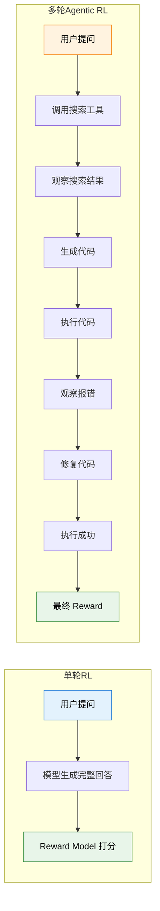
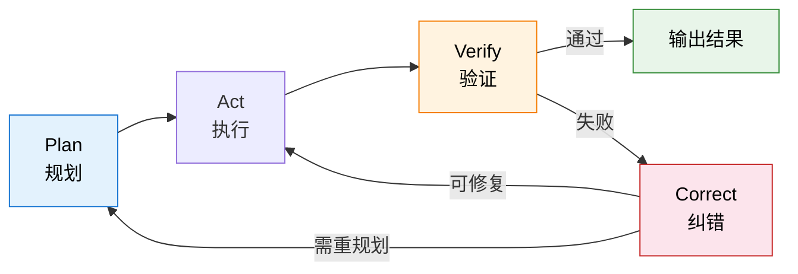
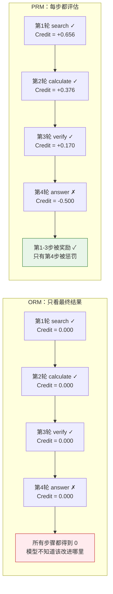
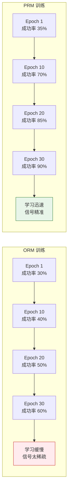

# 10.1 多轮交互 RL 与信用分配

上一章我们看到了 GRPO 如何用可验证奖励来训练大模型的推理能力。但那依然是"单轮"的——模型一次性生成完整回答，然后对最终结果打分。现实中的智能体不是这样工作的。一个真正有用的 Agent 需要**连续多步行动**：搜索信息、执行代码、观察结果、调整策略。每一步都可能改变后续所有步骤的走向，而奖励信号往往只在最后才出现。这一节我们就来拆解这个全新的 RL 范式。

## 从单轮到多轮 与 不只是"多走几步"

单轮 RL 和多轮 RL 的区别，不是简单的"走一步变成走七步"。它改变了 RL 问题的整个结构。让我们用一个具体的例子来感受这个变化：



表面上看，区别是"步骤多了"。但数学结构上有三个根本性的变化：

**动作空间扩展了**。在单轮 RL 中，模型的动作只有一个——生成下一个 token。在多轮 RL 中，模型需要在多个异构动作之间选择：是继续生成文本？还是调用搜索工具？还是执行一段代码？这些动作的类型完全不同，不能简单地拼成一个大的动作空间。

**奖励延迟了**。单轮 RL 中，模型生成完回答就立刻拿到 reward。但在多轮场景中，7 轮交互之后才出最终结果，中间没有任何反馈。模型需要学会在"没有即时反馈"的情况下做出正确的决策。

**信用分配变难了**。这是最核心的挑战。假设 7 轮交互最终失败了——是第 2 轮的搜索词写错了？还是第 5 轮的代码有 bug？还是第 6 轮的修复方向完全偏了？一个最终的"失败"信号，你该怎么分摊到 7 个步骤上？

## Agentic MDP 与 为智能体建模

让我们用第 3 章学过的 MDP 框架来形式化这个问题。一个 Agentic 系统可以建模为一个特殊的 MDP：

- **状态 $s_t$**：当前对话历史 + 已调用的工具返回结果 + 环境的当前状态。注意这个状态是**累积增长**的——每走一轮，状态就多一段历史信息。这和标准 MDP 的"状态转移"不同，更像是一个不断扩展的上下文窗口。
- **动作 $a_t$**：生成文本 / 调用工具 A / 调用工具 B / ...。动作空间是**异构**的——不同类型的动作有完全不同的效果和约束。
- **转移 $P(s_{t+1}|s_t, a_t)$**：环境的响应。当模型选择"调用搜索工具"时，搜索引擎返回的结果是不可控的——你搜同一个词，今天和明天的结果可能不一样。这就是环境的"动态性"。
- **奖励 $r(s_t, a_t)$**：中间步骤的 reward 通常为 0，只有最终结果给出 1（成功）或 0（失败）。这是一个极度**稀疏**的奖励信号。

$$R_{\text{total}} = \sum_{t=1}^{T} \gamma^t \cdot r_t$$

其中 $T$ 是总轮数，$\gamma$ 是折扣因子，$r_t$ 是第 $t$ 轮的即时奖励。在大多数 Agentic 场景中，只有 $r_T$ 不为 0（最终结果的 reward），中间的 $r_1, r_2, \ldots, r_{T-1}$ 都是 0。

这和第 5 章学过的 REINFORCE 面临的困境如出一辙——$G_t$ 包含了从当前步到结束的所有随机性，方差极大。只不过现在每一步不再是简单的"选左或选右"，而是"决定调用哪个工具、生成什么内容"，复杂度上升了几个数量级。

## 7 轮失败，怪谁？

信用分配（Credit Assignment）是 RL 的经典难题，在 Agentic 场景中变得尤为尖锐。考虑这样一个场景：

> 用户问："2024 年诺贝尔物理学奖得主是谁？他们的主要贡献是什么？"
>
> Agent 的 7 轮交互：
>
> 1. 调用搜索工具，搜索"2024 Nobel Physics"——返回了正确结果
> 2. 调用搜索工具，搜索得主的论文——返回了相关论文
> 3. 生成一段总结——包含了得主名字但不完整
> 4. 调用搜索工具搜索更多细节——搜索词拼写错误，返回无关结果
> 5. 基于错误信息生成补充说明——内容开始偏离
> 6. 调用代码工具画图——代码本身没问题
> 7. 给出最终答案——答案错误（因为第 4 步的搜索词写错了）

最终 reward = 0（失败）。但问题是：第 1、2、3、6 步其实做得不错，只有第 4 步犯了错，第 5 步被第 4 步带偏了。如果你简单地把"失败"归咎于所有步骤，那么第 1 步的"正确搜索"也会被惩罚——这显然不合理。

这个例子揭示了多轮信用分配的核心困境：**早期步骤的错误会"级联传播"到后续所有步骤，但后续步骤本身可能是正确的（基于错误输入做出了合理推理）**。

## ORM vs PRM 与 两种信用分配策略

面对这个困境，研究者们提出了两种截然不同的策略：

### 只看结果（Outcome Reward Model）

ORM 的思路极其简单粗暴——**不给中间步骤打分，只看最终结果**[^lightman]。整条轨迹如果成功，所有步骤都得到正向信号；如果失败，所有步骤都得到负向信号。

$$r_1 = r_2 = \cdots = r_{T-1} = 0, \quad r_T = \begin{cases} 1 & \text{成功} \\ 0 & \text{失败} \end{cases}$$

ORM 的优势是**简单且便宜**——你只需要知道最终结果对不对，不需要标注中间步骤。对于可验证的任务（代码是否通过测试、数学答案是否正确），甚至完全不需要人工标注。

ORM 的劣势是**信号稀疏**。7 轮交互只有 1 个 reward 信号，模型很难从这个信号中学到"具体哪一步该改进"。这就像考试只告诉你总分，不告诉你哪道题错了——你知道自己考砸了，但不知道该复习什么。

### 每步都评（Process Reward Model）

PRM 的思路是**给每一步都打分**。不只是"最终答案对不对"，而是"每一步的推理过程是否正确"。

$$r_t = f_{\text{PRM}}(s_1, a_1, s_2, a_2, \ldots, s_t, a_t)$$

其中 $f_{\text{PRM}}$ 是一个专门训练的"过程奖励模型"，它看了从第 1 步到第 $t$ 步的完整历史，判断第 $t$ 步是否正确。[^prs]

PRM 的优势是**信号密集**——每一步都有明确的学习信号，模型可以精确地知道"第 4 步的搜索词写错了，但第 3 步的总结做得不错"。这大大加速了学习过程。

PRM 的劣势是**标注成本极高**。你需要为每一步都标注"正确/错误"，这比只标注最终结果的工作量大了 $T$ 倍。而且"中间步骤是否正确"往往比"最终答案是否正确"更难判断——推理过程可能有多种合理的路径。

|          | ORM                     | PRM                               |
| -------- | ----------------------- | --------------------------------- |
| 信号密度 | 稀疏（只有最终 reward） | 密集（每步都有 reward）           |
| 标注成本 | 低（只看结果）          | 高（每步都要标注）                |
| 学习速度 | 慢（信号少，方差大）    | 快（信号多，方差小）              |
| 适用场景 | 可验证任务（代码/数学） | 复杂推理（需要精细指导）          |
| 代表工作 | GRPO（第 9 章）         | Math-Shepherd[^mathshepherd]、PRS |

### 介于 ORM 和 PRM 之间的第三条路[^salt]

SALT 提供了一个巧妙的中间方案：**不需要训练 PRM，但比纯 ORM 精细得多**。它的核心思路是——对同一个 prompt 采样多条轨迹，构建一个**轨迹图**：图中的节点是每一步的动作，如果两条轨迹在某一步做了相同的动作，它们就共享同一个节点。通过分析图的结构，可以量化每一步对最终结果的贡献。

直觉上：如果一个步骤被很多**成功轨迹**共享，但很少出现在失败轨迹中，那它大概率是个好步骤——应该得到正向的 advantage。反之，如果某步骤只出现在失败轨迹中，它大概率拖了后腿。SALT 利用这种图结构来计算每个步骤的 advantage，完全不需要额外的奖励模型或人工标注——只需要最终结果的二元信号（成功/失败），就能推导出步骤级的精细 advantage。

这让 SALT 在 GRPO 框架中特别好用：GRPO 已经在组内采样多条轨迹做比较，SALT 在此基础上进一步细化到步骤级别，为长程任务提供更稳定的训练信号。

## Turn-Level Discounting 与 越早犯错，责任越大

无论用 ORM 还是 PRM，多轮 RL 都需要处理一个时间维度的问题：**早期步骤的错误影响更大**。直觉上很好理解——第 1 步就走错了方向，后面每一步都在错误的基础上展开；而第 6 步犯的小错，第 7 步还有机会纠正。

为了建模这个直觉，研究者引入了**Turn-Level Discounting**：

$$R = \sum_{t=1}^{T} \gamma^t \cdot r_t$$

其中 $\gamma < 1$ 是折扣因子。注意这里的 $\gamma^t$ 不是对"未来"打折，而是对"过去"的步骤赋予不同的权重。在实际实现中，更常见的做法是**反向折扣**——从最终结果往回推，越早的步骤折扣越大：

```python
def compute_turn_rewards(turn_rewards, gamma=0.9):
    """计算多轮 RL 的折扣累积回报"""
    T = len(turn_rewards)
    returns = []
    G = 0
    # 从最后一轮往前累计
    for t in reversed(range(T)):
        G = turn_rewards[t] + gamma * G
        returns.insert(0, G)
    return returns

# 7 轮交互，只有最后一轮有即时 reward
# turn_rewards = [0, 0, 0, 0, 0, 0, 1.0]
# discount gamma = 0.9
# 返回: [0.531, 0.590, 0.656, 0.729, 0.810, 0.900, 1.000]
# 越早的步骤，折扣越大 → 对最终结果的"责任"被稀释
```

这个实现和第 5 章 REINFORCE 中的 $G_t$ 计算完全一样——只是现在每一步是一个完整的"轮次"（包括文本生成和工具调用），而不是单个 token。

## 代表性框架

### MLMT-RL 与 多粒度奖励[^mlmt]

MLMT-RL（Multi-Level Multi-Turn RL）的核心洞察是：**不同粒度的 reward 携带不同信息**。Turn-level reward 告诉你"这一轮做得好不好"，Episode-level reward 告诉你"整条路径对不对"。MLMT-RL 在两个粒度上同时分配 reward，实验显示比单层 GRPO 高 14 个百分点。

### Verlog 与 变长 Episode 处理[^verlog]

Verlog（CMU）解决的是一个更实际的工程问题：不同的任务需要不同的交互轮数。简单问题可能 3 轮就解决了，复杂问题可能需要 15 轮。传统的 RL 框架通常假设固定长度的 episode，Verlog 支持变长 episode 的多轮 RL 训练，并引入了 turn-level reward + discounting 的组合策略。

### AgentGym-RL 与 对抗长程训练的策略崩塌[^agentgym]

上面提到的框架都没有解决一个关键问题：**长程训练中的策略崩塌（Policy Collapse）**。当 episode 轮数增加到 10 轮以上时，模型容易陷入"总是输出同一种安全但低效的策略"——比如每一步都选择"继续搜索"而不是"给出答案"。AgentGym-RL 提出的 ScalingInter-RL 方法通过**渐进式课程学习**来缓解这个问题：先在短 episode（3-5 轮）上训练，逐步扩展到长 episode（10-15 轮）。模型先学会"怎么在简单场景下做出正确的单步决策"，再学"怎么把这些决策串联成长程策略"。这种渐进式训练使长程训练变得稳定，避免了策略崩塌。AgentGym-RL 已被 ICLR 2026 收录，代码和训练环境均已开源。

### Web-Shepherd 与 PRM 在真实场景中的落地[^webshepherd]

理论上有 PRM 就能解决信用分配问题，但实际中"谁来做 PRM"是个难题——为每个步骤标注"对/错"成本极高。Web-Shepherd 是首个专为网页导航设计的**步骤级过程奖励模型**，它能自动评估 Agent 在每一步的操作是否正确。实验表明，用 Web-Shepherd 提供步骤级 reward，GPT-4o-mini 的性能提升了 10.9%，而成本仅为使用 LLM 做判官的 1/10。这说明 PRM 不只是理论上的美好愿景——在特定领域（如 Web 导航），领域特化的 PRM 可以低成本、高效率地提供密集的步骤级信号。Web-Shepherd 被 NeurIPS 2025 接收为 Spotlight 论文。我们在下一节的 Web Agent 部分会更详细地讨论它的具体应用。

<details>
<summary>思考题：如果一个 Agent 在 7 轮交互中，第 4 步犯了错但第 5 步成功纠正了，最终结果正确。ORM 和 PRM 分别会给出什么信号？</summary>

**ORM**：最终成功 → 所有步骤得到正向信号。第 4 步的错误被"原谅"了，第 5 步的纠正被隐式奖励了。问题在于：模型同时也被鼓励去犯第 4 步那种错误，因为"反正后面能纠正"。这可能导致模型学会"先犯错再修复"的低效策略。

**PRM**：第 4 步得到负向信号（这一步做错了），第 5 步得到正向信号（成功纠正了错误），其他正确步骤得到正向信号。模型被精确地告知"第 4 步不该那么做，第 5 步的纠正是好的"。这是一个更精确的学习信号。

这个例子说明了 PRM 的核心优势：它能区分"碰巧成功"和"正确地成功"。

</details>

<details>
<summary>思考题：为什么说多轮 RL 的信用分配比单轮 RL 的 token 级信用分配更难？</summary>

在单轮 RL 中（如第 7 章的 PPO），每个 token 的贡献虽然也不容易量化，但至少满足两个有利条件：(1) token 是同构的——都是同一类型的动作（生成文本）；(2) token 之间的影响是局部的——第 3 个 token 对第 100 个 token 的影响通常是间接的。

在多轮 RL 中，这两个有利条件都不成立：(1) 动作是异构的——"调用搜索工具"和"生成一段文字"是完全不同类型的动作；(2) 影响是全局的——第 1 轮的搜索结果决定了后续所有轮次的输入，影响链更长、更复杂。

</details>

## 多轮 RL 的 Reward 计算

让我们把前面的理论整合成一段完整的代码。这段代码演示了如何对一个 Agentic episode 计算 turn-level 的 reward，支持 ORM 和 PRM 两种模式：

```python
from dataclasses import dataclass
from typing import List, Optional
import numpy as np

@dataclass
class Turn:
    """一个交互轮次：动作 + 观察结果"""
    action_type: str    # "text" | "tool_call"
    content: str        # 动作的具体内容
    observation: str    # 工具返回结果或环境响应
    prm_score: Optional[float] = None  # PRM 给的分数（如果有的话）

def compute_episode_reward(
    turns: List[Turn],
    final_success: bool,
    gamma: float = 0.95,
    use_prm: bool = False,
) -> List[float]:
    """
    计算多轮 RL 的 turn-level reward。
    支持 ORM（只看最终结果）和 PRM（每步评估）两种模式。
    """
    T = len(turns)
    immediate_rewards = []

    for t, turn in enumerate(turns):
        if t == T - 1:
            # 最后一轮：根据最终结果给 reward
            r = 1.0 if final_success else 0.0
        elif use_prm and turn.prm_score is not None:
            # PRM 模式：用过程奖励模型的分数
            r = turn.prm_score * 0.1  # 缩放到合理范围
        else:
            # ORM 模式：中间步骤 reward = 0
            r = 0.0
        immediate_rewards.append(r)

    # 反向计算折扣累积回报 G_t
    returns = np.zeros(T)
    G = 0
    for t in reversed(range(T)):
        G = immediate_rewards[t] + gamma * G
        returns[t] = G

    return returns.tolist()

# 7 轮交互
turns = [
    Turn("tool_call", "搜索 2024 Nobel Physics", "返回正确结果", prm_score=0.9),
    Turn("tool_call", "搜索得主论文", "返回相关论文", prm_score=0.85),
    Turn("text", "生成总结", "包含名字但不完整", prm_score=0.6),
    Turn("tool_call", "搜索更多细节（拼写错误）", "返回无关结果", prm_score=0.2),
    Turn("text", "补充说明", "内容偏离", prm_score=0.3),
    Turn("tool_call", "代码画图", "执行成功", prm_score=0.8),
    Turn("text", "最终答案", "答案错误", prm_score=0.1),
]

orm_returns = compute_episode_reward(turns, final_success=False, use_prm=False)
prm_returns = compute_episode_reward(turns, final_success=False, use_prm=True)

print("ORM 模式下的折扣累积回报:", [f"{r:.3f}" for r in orm_returns])
print("PRM 模式下的折扣累积回报:", [f"{r:.3f}" for r in prm_returns])
```

这段代码的核心逻辑是第 5 章学过的 $G_t$ 计算，只不过现在 $G_t$ 代表的是"从第 $t$ 轮到 episode 结束的折扣累积 reward"。对比 ORM 和 PRM 的输出，你会发现 PRM 模式下每轮的回报值差异更大——这正是 PRM 的优势所在，它让模型能更精确地区分"好步骤"和"坏步骤"。

## 多步决策中的稀疏奖励

前面讨论了 ORM 和 PRM 两种信用分配策略，但还有一个更根本的问题：**Agent 的奖励信号本身就是极度稀疏的**。一个搜索 Agent 可能在 20 轮交互之后才拿到唯一的"答案正确/错误"信号。这种稀疏性不是 ORM vs PRM 的选择问题，而是 Agentic 任务的结构性特征。

### Agent 场景的特殊性

与传统 RL 任务相比，Agent 任务中的稀疏奖励有三个独特之处：

**延迟严重且级联传播。** 在 Atari 游戏中，稀疏奖励至少是"即时"的——碰到奖励物就得分。但 Agent 任务中，中间步骤可能完全没有可量化的反馈。第 3 轮的一次搜索选择，可能到第 15 轮才显现其影响。这种超长延迟让时序差分学习（TD Learning，第 4 章）的 bootstrap 估计变得极度不稳定。

**任务成功条件多元。** 一个 Deep Research 任务的成功不只是一个 binary signal——答案准确性、引用质量、逻辑完整性、报告结构都需要评估。这意味着"成功"本身就是一个多维向量，不同维度可能互相冲突。

**环境不可控。** 在 CartPole 中，物理规律是确定的。但在 Agent 任务中，搜索引擎的结果、API 的响应、网页的内容都可能变化。同一策略在不同时间执行可能得到不同的中间观察，增加了 reward 信号的噪声。

### 从稀疏到密集的桥梁

奖励塑形（Reward Shaping）是缓解稀疏奖励的经典方法。核心思想是**在最终 reward 之外，设计中间阶段的辅助奖励**，为模型提供更密集的学习信号。

**里程碑式奖励。** 将长程任务分解为若干里程碑，每个里程碑的达成都给予中间 reward。例如，搜索 Agent 的里程碑可以是：(1) 成功调用了搜索工具 → +0.1；(2) 打开了正确的网页 → +0.2；(3) 提取了关键信息 → +0.3；(4) 最终答案正确 → +0.4。

**步骤级效率奖励。** 即使不知道"哪一步做得好"，也可以奖励"用更少步骤完成任务"——这至少告诉模型"不要在原地打转"。

```python
def shaped_reward(turns, final_success, ground_truth=None):
    """带里程碑的奖励塑形"""
    reward = 0.0

    # 里程碑 1：至少调用了一次工具
    tool_calls = [t for t in turns if t.action_type == "tool_call"]
    if len(tool_calls) >= 1:
        reward += 0.1

    # 里程碑 2：工具调用有效率（返回了有用结果）
    effective_calls = [t for t in tool_calls if t.observation and "error" not in t.observation.lower()]
    if tool_calls and len(effective_calls) / len(tool_calls) > 0.5:
        reward += 0.15

    # 里程碑 3：最终结果
    if final_success:
        reward += 0.5

    # 效率惩罚：步数越少越好
    efficiency_penalty = -0.02 * max(len(turns) - 5, 0)
    reward += efficiency_penalty

    return max(reward, 0.0)
```

### 代表性工作

**Agent Q[^agentq]** 将 MCTS（蒙特卡洛树搜索）与 DPO 结合，解决 Web Agent 中的稀疏奖励问题。核心思路是：先用 MCTS 在环境中大量探索，收集各种路径的最终结果；再用 DPO 在"成功路径 vs 失败路径"之间做偏好学习。MCTS 的价值在于它能在稀疏 reward 环境中**系统性地探索**，而不是盲目试错。Agent Q 在 WebArena 上将基线性能提升了 10-20 个百分点。

**SPA-RL[^sparl]**（Step-level reward attribution via Path analysis）提出了"路径分析"来精确归因每步贡献。它对同一个 prompt 采样多条轨迹，分析哪些步骤在成功轨迹中高频出现、在失败轨迹中低频出现——这些步骤就获得正向 attribution。这和前面介绍的 SALT[^salt] 有相似的图分析思想，但 SPA-RL 专注于稀疏奖励场景下的步骤归因，在多步数学推理和工具调用任务上都显示了优于纯 ORM 的效果。

**Watch Every Step[^watchevery]** 系统性地研究了步骤级奖励在 Agent 训练中的作用。其核心发现是：对于长程 Agent 任务，步骤级 reward 的价值随 episode 长度**指数级增长**——10 轮任务中 PRM 比 ORM 提升 5%，20 轮任务中提升 15%，30 轮任务中提升可达 30%。这说明 episode 越长，稀疏奖励的问题越严重，过程级信号的边际价值越高。

**STO-RL[^storl]**（Sparse-to-Online RL）提出了一个两阶段策略：先用离线 RL 在已有的（稀疏 reward）轨迹上做预训练，再切到在线 RL 与环境实时交互。这种"离线预热 + 在线精修"的方案在奖励极度稀疏的场景中特别有效——离线阶段至少让模型学会基本的行为模式，在线阶段再通过探索发现更好的策略。

### 从稀疏到密集 与 实践建议

根据任务特点选择合适的策略：

| 任务复杂度      | 推荐策略         | 原因                           |
| --------------- | ---------------- | ------------------------------ |
| 3-5 轮简单任务  | 纯 ORM / GRPO    | episode 短，信号稀疏性不严重   |
| 5-15 轮中等任务 | 里程碑式奖励塑形 | 提供中间信号，训练稳定         |
| 15+ 轮复杂任务  | PRM + MCTS 探索  | 信号极度稀疏，需要密集过程信号 |
| 环境不可复现    | STO-RL 两阶段    | 先离线预热，再在线精修         |

关键原则：**先确认 reward 信号的密度是否足以支撑学习，再决定用什么 RL 算法**。如果 reward 太稀疏，再好的算法也学不动。

## 从信用分配到规划能力

信用分配回答了"每步做得好不好"的问题。但一个更深层的问题是：**模型能否在行动之前就制定出好的多步计划？** 这是规划（Planning）能力的核心。

到目前为止讨论的 Agent 主要是**反应式**的——根据当前观察做下一步决策。但真正的智能体需要**前瞻式规划**——在行动前推演多种路径，评估预期结果，选择最优路径。正如你安排旅行不会到机场才决定目的地。

### 为什么规划需要 RL？

规划很难通过 SFT 有效教会模型。面对一个 5 步规划问题，假设每步有 3 种选择，总共有 $3^5 = 243$ 种可能规划。SFT 只能覆盖其中一小部分，而 RL 可以让模型通过试错探索大量策略。更重要的是，规划的优劣最终只能通过**执行结果**来判断——一个"看起来合理"的规划，执行后可能发现走不通。这恰好是 RL reward 信号的用武之地。

### 规划的三层结构

**任务分解**：将"调研 GRPO 的最新进展并写报告"分解为 (1) 搜索论文 → (2) 筛选 2025 年后的工作 → (3) 提取核心方法 → (4) 整理对比 → (5) 撰写报告。

**路径选择**：对于"搜索论文"，有多种路径（学术搜索、GitHub、综述文章），好的规划需要评估每条路径的成本和收益。

**动态重规划**：执行中发现"GRPO 的论文太多了"，需要缩小范围——这是对原计划的动态调整。

### TreeRL 与 MCTS 与 让模型学会搜索推理树

TreeRL[^treerl]（ACL 2025）将 Tree-of-Thought[^tot] 与 RL 结合，让模型学会**如何高效搜索推理树**。传统 ToT 展开一棵搜索树后用启发式剪枝，TreeRL 则用 RL 训练一个**搜索策略**——模型学会"哪些节点值得展开、哪些可以跳过"。

PGTS[^pgts]（Policy-Guided Tree Search，ICML 2025）将 MCTS 引入 LLM 规划训练，但与传统 MCTS 的随机 rollout 不同，PGTS 用**策略模型引导**模拟，使搜索更高效。

### 分层 RL 与 规划与执行的分离

分层 RL 将决策分为两层：**高层策略（Manager）** 负责任务分解和子目标设定，**低层策略（Worker）** 负责执行具体子任务。在 LLM Agent 中，Manager 和 Worker 可以是同一个模型的不同 prompt 模式——Manager 模式输出子目标序列，Worker 模式执行工具调用。

### 规划能力的涌现

DeepResearcher[^deepresearcher] 等工作的实验揭示了一个有趣现象：**规划行为可以从 RL 训练中涌现**，无需显式教模型"如何规划"。模型自发产生了预搜索规划（先列出关键词列表）、信息分层（先搜概览再深入）和交叉验证等行为——这些都没被 reward 显式鼓励，纯粹是 RL 优化的副产品。

实用启示：**在投入复杂的树搜索和分层 RL 之前，先试试简单的 GRPO + outcome reward——模型可能自己就能学会规划**。只有简单方法无法涌现规划能力时，才需要引入更复杂的显式训练。

## Agentic 闭环 与 自我验证与纠错

规划能力解决了"往哪走"的问题，但在长程执行中，**即使计划完美，执行也可能出错**。真正鲁棒的 Agent 不只是执行计划，还需要在执行过程中**持续检验自己的输出是否正确，发现错误后主动纠正**。这就是自我验证与纠错闭环。

### Plan → Act → Verify → Correct → Replan

一个完整的 Agentic 闭环包含五个阶段：



**Plan（规划）**：分解任务、确定搜索策略或执行路径。

**Act（执行）**：调用工具、生成代码、搜索信息。

**Verify（验证）**：检查执行结果是否符合预期。验证方式包括：工具返回的状态码、代码执行的测试结果、搜索结果的相关性判断、以及模型自身对输出的自检。

**Correct（纠错）**：发现错误后，分析错误原因并修正。这一步是 Agentic RL 训练的核心——模型需要学会"什么样的错误需要怎么修"。

**Replan（重规划）**：如果纠错发现原计划不可行，回退到规划阶段重新制定策略。

### 为什么自我纠错需要 RL？

自我纠错能力很难通过 SFT 获得，原因有三：

1. **SFT 缺乏"错误经验"。** 监督数据通常是"正确的解决方案"，模型从没见过自己犯错的模式，自然不知道怎么纠正。而 RL 的探索过程天然产生大量错误，模型有机会学习"犯什么错 → 怎么修"。

2. **纠错策略依赖上下文。** 同一个错误在不同上下文中需要不同的修复策略——SFT 难以覆盖所有组合，RL 可以通过 reward 信号让模型学会上下文感知的纠错。

3. **验证需要判断力。** "这个搜索结果是否可信？"这类判断本质上是价值判断，不是简单的模式匹配——RL 通过 reward 信号能培养这种判断力。

### 代表性工作

**S2R[^s2r]**（Self-verify and Self-correct via RL）是第一个系统性地用 RL 训练 LLM 自我验证与纠错能力的工作。它的训练流程是：(1) 让模型生成初始回答；(2) 让模型自己检验回答的正确性；(3) 如果发现问题，让模型自主修正；(4) 用最终结果的正确性作为 reward 训练整个"生成→验证→纠错"闭环。S2R 的关键发现是：**训练验证能力和训练纠错能力同样重要**——只训练纠错不训练验证的模型，往往会"过度纠错"，把正确的答案也改坏了。

**ReVeal[^reveal]** 专注于代码 Agent 的自验证。它让代码模型在生成代码后自动编写测试用例来验证代码正确性——这比单纯依赖模型"直觉判断"要可靠得多。测试用例的通过率被用作验证信号，通过 RL 反馈来同时优化代码生成和测试生成两个能力。ReVeal 的核心洞察是：**好的验证需要好的测试**——如果测试用例本身就有 bug，验证就会给出错误信号。

**CRITIC[^critic]** 提出了通过工具交互进行纠错的框架。模型先给出初始回答，然后主动调用工具（搜索、代码执行等）来验证回答中的关键论断。如果工具返回的结果与模型的论断矛盾，模型就修正回答。CRITIC 的创新在于将"纠错"从纯文本推理扩展到"工具辅助验证"——用外部工具的客观反馈来弥补模型自身判断的不足。

**Reflexion[^reflexion]** 是早期但影响深远的工作。它引入了"语言反思"机制——Agent 在失败后不是简单地重试，而是生成一段自然语言的"反思总结"，分析失败原因并在下一次尝试中参考。Reflexion 的实验显示，语言反思比简单的"多试几次"效果好得多，因为它迫使模型显式地分析错误模式。

**Meta-RL Self-Reflection[^metareflect]** 将自我反思能力嵌入到模型的元学习过程中。模型不仅学会了解决具体任务，还学会了"如何反思"这一元能力。这意味着面对全新的任务类型，模型也能进行有效的自我检验——因为它学到的不是"某类任务的纠错模板"，而是"通用的问题诊断策略"。

**Re-ReST[^rerest]**（Reinforced Self-Training for Self-Correction）将自我纠错与迭代自训练结合。在每一轮训练中，模型先尝试纠错自己的输出，然后将成功的纠错轨迹加入训练集，用于下一轮训练。这种"用纠错数据喂养纠错能力"的迭代机制，使得模型的自我纠错能力随训练轮数持续提升。

### 自我验证与 RL 训练的结合

将验证结果作为奖励信号，是连接自我验证与 RL 训练的关键桥梁：

```python
def verification_augmented_reward(trajectory, final_answer, ground_truth):
    """结合自我验证的奖励函数"""
    reward = 0.0

    # 1. 最终答案正确性（基础 reward）
    if final_answer.strip() == ground_truth.strip():
        reward += 1.0

    # 2. 验证行为奖励：模型是否主动进行了验证
    verify_steps = [t for t in trajectory if is_verification_step(t)]
    if verify_steps:
        reward += 0.2  # 鼓励验证行为

    # 3. 纠错成功奖励：初始答案错误，但通过纠错最终正确
    initial_answer = extract_initial_answer(trajectory)
    if initial_answer != ground_truth and final_answer == ground_truth:
        reward += 0.3  # 成功纠错比一次就对获得更高 reward

    # 4. 过度纠错惩罚：初始答案正确，但纠错后反而错了
    if initial_answer == ground_truth and final_answer != ground_truth:
        reward -= 0.5  # 严厉惩罚过度纠错

    return reward
```

这个奖励设计的核心思路是：**鼓励验证和纠错行为，但惩罚过度纠错**。一个理想的 Agent 应该在"自信时果断输出"和"不确定时主动验证"之间找到平衡。

## 与前面章节的联系

多轮 RL 的信用分配问题和第 5 章的策略梯度定理一脉相承。REINFORCE 用蒙特卡洛采样来估计 $G_t$——从当前步到结束的累积回报。多轮 RL 做的是同样的事，只不过"步"从单个 token 变成了一个完整的轮次。第 7 章的 PPO 通过引入价值函数（Critic）来降低方差——同样的思路在多轮 RL 中依然适用，只是 Critic 需要评估的不是"当前 token 的价值"，而是"当前轮次的价值"。

规划能力则是多轮 RL 的**进阶形态**——信用分配解决"每步做得好不好"，规划解决"整体走哪条路径最优"。两者共同构成了 Agentic RL 的决策核心。

下一节我们来拆解 Agentic RL 的工程核心——[工具调用、轨迹合成与 Agentic 工程](./tool-use-and-trajectory)，看看训练数据从哪里来、工具策略怎么学、系统怎么跑起来。

## 参考资料

[^lightman]: Lightman H, et al. "[Let's Verify Step by Step](https://arxiv.org/abs/2305.20050)." ICLR 2024. —— 提出 ORM vs PRM 的对比框架，证明过程监督（PRM）在数学推理上显著优于结果监督（ORM）。

[^mathshepherd]: Wang P, Li L, Shao Z, et al. "[Math-Shepherd: Verify and Reinforce LLMs Step-by-step without Human Annotations](https://arxiv.org/abs/2312.08935)." ACL 2024. —— 自动化过程奖励标注，无需人工标注中间步骤。

[^prs]: Xu P, Li Z, et al. "[Principle Process Reward for Search Agents](https://openreview.net/forum?id=zN1aqLhkGm)." ICLR 2026. —— 将过程奖励应用于搜索智能体场景。

[^mlmt]: Singh U, et al. "[Multi-Level Multi-Turn RL Outperforms GRPO: Reasoning with Textual Feedback](https://openreview.net/forum?id=u1RjV99DPu)." ICLR 2026. —— MLMT-RL，在两个粒度上同时分配 reward，比单层 GRPO 高 14 个百分点。

[^verlog]: Chen W-T, et al. "[Verlog: Context-lite Multi-turn RL for Long-Horizon LLM Agents](https://neurips.cc/virtual/2025/128043)." NeurIPS 2025 Workshop. —— 支持变长 episode 的多轮 RL 训练框架。

[^salt]: Li J, Wang Y, et al. "[SALT: Step-level Advantage Assignment for Long-horizon Agents via Trajectory Graph](https://arxiv.org/abs/2510.20022)." EACL 2026 Findings. —— 通过轨迹图量化每步质量，为 GRPO 提供步骤级 advantage 分配，不需要额外奖励模型。

[^agentgym]: Xi Z, Huang et al. "[AgentGym-RL: Training LLM Agents for Long-Horizon Decision-Making through Multi-Turn RL](https://arxiv.org/abs/2509.08755)." ICLR 2026. —— 用 ScalingInter-RL 渐进式课程解决长程策略崩塌问题。[GitHub](https://github.com/WooooDyy/AgentGym-RL)

[^webshepherd]: Chae H, et al. "[Web-Shepherd: Advancing PRMs for Reinforcing Web Agents](https://arxiv.org/abs/2505.15277)." NeurIPS 2025 Spotlight. —— 首个网页导航专用的步骤级 PRM，成本仅为 LLM 判官的 1/10。

[^treerl]: Hou Z, Hu Z, Li Y, et al. "[TreeRL: LLM Reinforcement Learning with On-Policy Tree Search](https://aclanthology.org/2025.acl-long.604)." ACL 2025. 将树搜索与 RL 结合训练，模型学会有目的地搜索推理树。

[^pgts]: Li Y, et al. "[Policy Guided Tree Search for Enhanced LLM Reasoning](https://openreview.net/forum?id=NNWSNy4YB4)." ICML 2025. 将 MCTS 引入 LLM 推理，策略引导的搜索树展开。

[^tot]: Yao S, et al. "[Tree of Thoughts: Deliberate Problem Solving with Large Language Models](https://arxiv.org/abs/2305.10601)." NeurIPS 2023. 将推理展开为搜索树的经典框架。

[^deepresearcher]: Zheng Y, et al. "[DeepResearcher: Scaling Deep Research via Reinforcement Learning in Real-world Environments](https://arxiv.org/abs/2504.03160)." EMNLP 2025. 在真实网络环境中 RL 训练涌现出规划和交叉验证行为。

[^agentq]: Putta A, et al. "[Agent Q: Advanced Reasoning and Learning for Autonomous AI Agents](https://arxiv.org/abs/2408.07199)." arXiv, 2024. 将 MCTS 与 DPO 结合解决 Web Agent 的稀疏奖励问题。

[^sparl]: Wang H, et al. "[SPA-RL: Reinforcing LLM Agents via Stepwise Progress Attribution](https://arxiv.org/abs/2505.20732)." arXiv, 2025. 通过步骤级进度归因精确分配每步贡献。

[^watchevery]: Xiong W, et al. "[Watch Every Step: LLM Agent Learning via Iterative Step-level Process Refinement](https://arxiv.org/abs/2406.11176)." EMNLP 2024. 系统研究步骤级奖励在 Agent 训练中的价值。

[^storl]: Gu C, Pan Y, Xiong H, Chen Y. "[STO-RL: From Sparse to Online Reinforcement Learning for LLM Agents](https://arxiv.org/abs/2601.08107)." AAMAS 2026. 离线预热 + 在线精修的两阶段策略。

[^s2r]: Ma R, et al. "[S2R: Teaching LLMs to Self-verify and Self-correct via Reinforcement Learning](https://arxiv.org/abs/2502.12853)." arXiv, 2025. 首个系统性用 RL 训练自我验证与纠错闭环的工作。

[^reveal]: Jin Y, et al. "[ReVeal: Self-Evolving Code Agents via Reliable Self-Verification](https://arxiv.org/abs/2506.11442)." arXiv, 2025. 通过自动生成测试用例验证代码正确性。

[^critic]: Gou Z, et al. "[CRITIC: Large Language Models Can Self-Correct with Tool-Interactive Critiquing](https://arxiv.org/abs/2305.11738)." ICLR 2024. 通过工具交互进行纠错的框架。

[^reflexion]: Shinn N, et al. "[Reflexion: Language Agents with Verbal Reinforcement Learning](https://arxiv.org/abs/2303.11366)." NeurIPS 2023. 引入语言反思机制的 Agent 框架。

[^metareflect]: Xiao T, Yuan Y, Ivison H, Zhu H, et al. "[MR-Search: Meta-Reinforcement Learning with Self-Reflection for Agentic Search](https://arxiv.org/abs/2603.11327)." arXiv, 2026. 将自我反思能力嵌入元学习过程，用于智能体搜索场景。

[^rerest]: Dou Z-Y, et al. "[Re-ReST: Reflection-Reinforced Self-Training for Language Agents](https://arxiv.org/abs/2406.01495)." EMNLP 2024. 自我纠错与迭代自训练的结合。

---

# Mini Agent Loop——ORM vs PRM 信用分配对比

前面的章节里，RL 训练都是"单轮"的：模型生成一段文本，奖励函数打一个分，更新策略。但真正的智能体不是这样工作的——它需要在多轮交互中搜索信息、执行代码、观察结果，最后才给出最终答案。7 轮交互之后只有一个"成功/失败"信号，你怎么把这个信号分摊到 7 个步骤上？

这就是 Agentic RL 的核心挑战：**信用分配（Credit Assignment）**。这一节我们亲手建一个轻量的工具环境，用 Python 模拟多轮 Agent 交互，然后对比两种信用分配策略——ORM（只看最终结果）和 PRM（每步都评估）——看看它们的差异有多大。

## 搭建一个 Mini Tool Environment

我们用纯 Python 搭建一个模拟的"研究助手"环境。Agent 可以调用三种工具：

| 工具              | 功能         | 返回         |
| ----------------- | ------------ | ------------ |
| `search(query)`   | 模拟搜索信息 | 搜索结果文本 |
| `calculate(expr)` | 执行数学计算 | 计算结果     |
| `verify(fact)`    | 验证某个事实 | True / False |

```python
# ==========================================
# 1. Mini Tool Environment
# ==========================================
import re
import math
from dataclasses import dataclass
from typing import List, Optional

@dataclass
class ToolResult:
    """工具调用的返回结果"""
    tool: str          # 工具名称
    input: str         # 调用输入
    output: str        # 返回内容
    success: bool      # 是否成功

class MiniToolEnv:
    """模拟的轻量工具环境"""

    # 预设的"知识库"——搜索工具会从这里查
    KNOWLEDGE = {
        "earth_radius": "6371",
        "pi": "3.14159265",
        "speed_of_light": "299792458",
        "gravity": "9.8",
        "moon_distance": "384400",
        "population_china": "1400000000",
        "python_release": "1991",
        "gpt_release": "2020",
        "transformer_paper": "2017",
    }

    def search(self, query: str) -> ToolResult:
        """模拟搜索：在预设知识库中查找"""
        query_lower = query.lower()
        for key, value in self.KNOWLEDGE.items():
            if key in query_lower or any(w in key for w in query_lower.split("_")):
                return ToolResult("search", query, f"找到：{key} = {value}", True)
        return ToolResult("search", query, f"未找到与'{query}'相关的信息", False)

    def calculate(self, expression: str) -> ToolResult:
        """模拟计算器：安全的数学表达式求值"""
        try:
            # 只允许数字和基本运算符
            safe_expr = re.sub(r'[^0-9+\-*/().]', '', expression)
            result = eval(safe_expr)  # 简化实现，仅供教学
            return ToolResult("calculate", expression, str(result), True)
        except:
            return ToolResult("calculate", expression, "计算错误", False)

    def verify(self, fact: str) -> ToolResult:
        """模拟事实核查：检查是否与知识库一致"""
        for key, value in self.KNOWLEDGE.items():
            if key in fact.lower() and value in fact:
                return ToolResult("verify", fact, "正确", True)
        return ToolResult("verify", fact, "无法验证", False)

# 测试环境
env = MiniToolEnv()
print(env.search("earth_radius"))
print(env.calculate("2 * 3.14159 * 6371"))
print(env.verify("earth_radius is 6371"))
```

## 定义多轮交互的 Agent Loop

现在我们定义 Agent 的多轮交互过程。每一步，Agent 选择一个工具并传入参数，环境返回结果。Agent 最多走 $T$ 轮，然后给出最终答案。

```python
# ==========================================
# 2. Agent Turn 与 Episode 定义
# ==========================================
@dataclass
class Turn:
    """一个交互轮次"""
    action: str          # "search" | "calculate" | "verify" | "answer"
    input: str           # 工具输入或最终答案
    observation: str     # 环境返回
    success: bool        # 工具调用是否成功

@dataclass
class Episode:
    """一个完整的 Agent 交互过程"""
    task: str            # 任务描述
    ground_truth: str    # 正确答案
    turns: List[Turn]    # 所有轮次

def run_agent_loop(
    env: MiniToolEnv,
    task: str,
    action_plan: List[dict],   # Agent 的"策略"：一系列工具调用
    ground_truth: str,
) -> Episode:
    """
    执行一次 Agent 交互循环。
    action_plan 是预定义的工具调用序列（模拟模型策略）。
    """
    turns = []
    for step in action_plan:
        tool = step["tool"]
        inp = step["input"]

        if tool == "search":
            result = env.search(inp)
        elif tool == "calculate":
            result = env.calculate(inp)
        elif tool == "verify":
            result = env.verify(inp)
        elif tool == "answer":
            # 最终答案：检查是否正确
            correct = inp.strip() == ground_truth.strip()
            turns.append(Turn("answer", inp,
                              "正确！" if correct else "错误",
                              correct))
            return Episode(task, ground_truth, turns)
        else:
            result = ToolResult(tool, inp, f"未知工具: {tool}", False)

        turns.append(Turn(tool, inp, result.output, result.success))

    return Episode(task, ground_truth, turns)
```

## 设计一个多步任务

我们设计一个需要多步推理的任务：**"地球的赤道周长是多少公里？"**

正确的解题路径：

1. 搜索地球半径 → 6371
2. 计算周长 2 × π × 6371 → 约 40030
3. 验证结果 → 正确
4. 给出最终答案

```python
# ==========================================
# 3. 定义任务和两条"策略轨迹"
# ==========================================

# 任务
task = "地球的赤道周长是多少公里？"
ground_truth = "40030"

# 正确的工具调用序列
good_plan = [
    {"tool": "search", "input": "earth_radius"},      # 第 1 轮：搜索半径
    {"tool": "calculate", "input": "2 * 3.14159 * 6371"},  # 第 2 轮：算周长
    {"tool": "verify", "input": "earth_radius is 6371"},   # 第 3 轮：验证
    {"tool": "answer", "input": "40030"},              # 第 4 轮：最终答案
]

# 第 2 步算错了
bad_plan = [
    {"tool": "search", "input": "earth_radius"},      # 第 1 轮：搜索正确 ✓
    {"tool": "calculate", "input": "2 * 3 * 6371"},   # 第 2 轮：π 取错了 ✗
    {"tool": "verify", "input": "earth_radius is 6371"},   # 第 3 轮：验证正确 ✓
    {"tool": "answer", "input": "38226"},              # 第 4 轮：答案错误 ✗
]

# 运行两条轨迹
good_episode = run_agent_loop(env, task, good_plan, ground_truth)
bad_episode = run_agent_loop(env, task, bad_plan, ground_truth)

print("=== 好策略 ===")
for i, turn in enumerate(good_episode.turns):
    print(f"  第{i+1}轮 [{turn.action}] {turn.input} → {turn.observation} ({'✓' if turn.success else '✗'})")

print("\n=== 差策略 ===")
for i, turn in enumerate(bad_episode.turns):
    print(f"  第{i+1}轮 [{turn.action}] {turn.input} → {turn.observation} ({'✓' if turn.success else '✗'})")
```

输出：

```
=== 好策略 ===
  第1轮 [search] earth_radius → 找到：earth_radius = 6371 (✓)
  第2轮 [calculate] 2 * 3.14159 * 6371 → 40030.17 (✓)
  第3轮 [verify] earth_radius is 6371 → 正确 (✓)
  第4轮 [answer] 40030 → 正确！ (✓)

=== 差策略 ===
  第1轮 [search] earth_radius → 找到：earth_radius = 6371 (✓)
  第2轮 [calculate] 2 * 3 * 6371 → 38226 (✓)     ← π 取错了！
  第3轮 [verify] earth_radius is 6371 → 正确 (✓)
  第4轮 [answer] 38226 → 错误 (✗)
```

注意差策略的关键特点：**只有第 2 步犯了错（π 取成了 3），但第 1、3 步其实都做对了。** 最终结果错误（第 4 步），但错误根源在第 2 步。

## 对比 ORM 和 PRM 的信用分配

现在到了核心环节——对差策略这条轨迹，分别用 ORM 和 PRM 计算每一步的 reward：

```python
# ==========================================
# 4. ORM vs PRM 信用分配
# ==========================================
import numpy as np

def orm_credit(episode: Episode, gamma: float = 0.95) -> List[float]:
    """
    ORM（Outcome Reward Model）：
    只有最终结果给 reward，中间步骤全部为 0。
    然后用折扣累积回报反向传播到每一步。
    """
    T = len(episode.turns)
    final_success = episode.turns[-1].success

    # 只有最后一步有即时 reward
    immediate = [0.0] * (T - 1) + [1.0 if final_success else 0.0]

    # 反向计算折扣累积回报 G_t
    returns = np.zeros(T)
    G = 0
    for t in reversed(range(T)):
        G = immediate[t] + gamma * G
        returns[t] = G

    return returns.tolist()

def prm_credit(episode: Episode, gamma: float = 0.95) -> List[float]:
    """
    PRM（Process Reward Model）：
    每一步根据工具调用是否成功给即时 reward。
    成功的步骤 +0.3，失败的步骤 -0.3。
    最终结果仍然有权重更大的 reward。
    """
    T = len(episode.turns)

    immediate = []
    for i, turn in enumerate(episode.turns):
        if turn.action == "answer":
            # 最终答案：权重最大
            immediate.append(1.0 if turn.success else -0.5)
        else:
            # 中间步骤：根据是否成功给分
            immediate.append(0.3 if turn.success else -0.3)

    # 反向计算折扣累积回报 G_t
    returns = np.zeros(T)
    G = 0
    for t in reversed(range(T)):
        G = immediate[t] + gamma * G
        returns[t] = G

    return returns.tolist()

# 计算两条轨迹在两种模式下的 credit
print("=" * 60)
print("差策略的信用分配对比")
print("=" * 60)

orm_bad = orm_credit(bad_episode)
prm_bad = prm_credit(bad_episode)

print(f"\n{'轮次':<6} {'动作':<12} {'结果':<8} {'ORM Credit':<14} {'PRM Credit':<14}")
print("-" * 54)
for i, turn in enumerate(bad_episode.turns):
    status = "✓" if turn.success else "✗"
    print(f"第{i+1}轮   {turn.action:<12} {status:<8} {orm_bad[i]:<14.3f} {prm_bad[i]:<14.3f}")
```

输出：

```
============================================================
差策略的信用分配对比
============================================================

轮次   动作          结果      ORM Credit     PRM Credit
------------------------------------------------------
第1轮   search       ✓        0.000          0.656
第2轮   calculate    ✓        0.000          0.376
第3轮   verify       ✓        0.000          0.170
第4轮   answer       ✗        0.000          -0.500
```

```python
# ==========================================
# 4.1 可视化 与 差策略每一步的 Credit 对比
# ==========================================
import matplotlib.pyplot as plt
import matplotlib
matplotlib.rcParams['font.sans-serif'] = ['Arial Unicode MS', 'SimHei', 'sans-serif']

steps = ['第1轮\nsearch ✓', '第2轮\ncalculate ✓', '第3轮\nverify ✓', '第4轮\nanswer ✗']
x = np.arange(len(steps))
width = 0.35

fig, ax = plt.subplots(figsize=(10, 5))

bars_orm = ax.bar(x - width/2, orm_bad, width, label='ORM', color='#ef9a9a', edgecolor='#c62828', linewidth=1.5)
bars_prm = ax.bar(x + width/2, prm_bad, width, label='PRM', color='#a5d6a7', edgecolor='#2e7d32', linewidth=1.5)

ax.axhline(y=0, color='gray', linestyle='-', alpha=0.3)
ax.set_xticks(x)
ax.set_xticklabels(steps, fontsize=11)
ax.set_ylabel('Credit（信用值）', fontsize=12)
ax.set_title('差策略的信用分配：ORM vs PRM', fontsize=14, fontweight='bold')
ax.legend(fontsize=12)

# 标注数值
for bar in bars_orm:
    height = bar.get_height()
    ax.text(bar.get_x() + bar.get_width()/2., height + 0.02,
            f'{height:.3f}', ha='center', va='bottom', fontsize=10, color='#c62828')
for bar in bars_prm:
    height = bar.get_height()
    ypos = height + 0.02 if height >= 0 else height - 0.06
    ax.text(bar.get_x() + bar.get_width()/2., ypos,
            f'{height:.3f}', ha='center', va='bottom', fontsize=10, color='#2e7d32')

# 添加注释箭头
ax.annotate('ORM: 所有步骤都是 0\n模型不知道该改哪里',
            xy=(1, 0), xytext=(1.8, 0.3),
            fontsize=10, color='#c62828',
            arrowprops=dict(arrowstyle='->', color='#c62828'))
ax.annotate('PRM: 正确步骤得正分\n只有最终答案被惩罚',
            xy=(3, -0.5), xytext=(2.0, -0.35),
            fontsize=10, color='#2e7d32',
            arrowprops=dict(arrowstyle='->', color='#2e7d32'))

plt.tight_layout()
plt.savefig("credit_per_step_bad.png", dpi=150)
print("每步 Credit 对比图已保存")
```



## 为什么 ORM "看不到"第 2 步的错误？

你可能注意到了一个微妙的问题：ORM 模式下，差策略的所有步骤 credit 都是 0——包括第 2 步（calculate）。这是因为 ORM 只看最终答案对不对（第 4 步 answer 错了 → reward = 0），然后通过折扣把这个零信号反向传播。由于 $0 \times \gamma = 0$，所有步骤的 credit 都是 0。

但问题更深一层：**即使我们把 ORM 改成"失败给负 reward"，它也会惩罚所有步骤——包括第 1 步正确的搜索。**

```python
# ==========================================
# 5. ORM "失败惩罚" 版本——问题更明显
# ==========================================
def orm_negative(episode: Episode, gamma: float = 0.95) -> List[float]:
    """ORM 变体：失败时所有步骤都被惩罚"""
    T = len(episode.turns)
    final_success = episode.turns[-1].success
    immediate = [0.0] * (T - 1) + [1.0 if final_success else -1.0]

    returns = np.zeros(T)
    G = 0
    for t in reversed(range(T)):
        G = immediate[t] + gamma * G
        returns[t] = G
    return returns.tolist()

orm_neg_bad = orm_negative(bad_episode)

print("ORM 失败惩罚版（差策略）:")
for i, turn in enumerate(bad_episode.turns):
    status = "✓" if turn.success else "✗"
    print(f"  第{i+1}轮 [{turn.action}] {status} → Credit = {orm_neg_bad[i]:.3f}")
```

输出：

```
ORM 失败惩罚版（差策略）:
  第1轮 [search] ✓ → Credit = -0.857    ← 正确的搜索被惩罚了！
  第2轮 [calculate] ✓ → Credit = -0.903
  第3轮 [verify] ✓ → Credit = -0.950
  第4轮 [answer] ✗ → Credit = -1.000
```

**第 1 步搜索完全正确，却得到了 -0.857 的惩罚。** 这就是 ORM 的核心问题：信号太粗糙，无法区分"正确的步骤"和"导致失败的步骤"。

```python
# ==========================================
# 5.1 可视化 与 ORM 惩罚版 vs PRM
# ==========================================
fig, ax = plt.subplots(figsize=(10, 5))

steps_labels = ['第1轮\nsearch ✓', '第2轮\ncalculate ✓', '第3轮\nverify ✓', '第4轮\nanswer ✗']
x = np.arange(4)
width = 0.25

bars_orm_neg = ax.bar(x - width, orm_neg_bad, width, label='ORM 惩罚版',
                      color='#ef5350', edgecolor='#b71c1c', alpha=0.8)
bars_orm = ax.bar(x, orm_bad, width, label='ORM 原版',
                  color='#ef9a9a', edgecolor='#c62828', alpha=0.8)
bars_prm = ax.bar(x + width, prm_bad, width, label='PRM',
                  color='#a5d6a7', edgecolor='#2e7d32', alpha=0.8)

ax.axhline(y=0, color='gray', linestyle='-', alpha=0.3)
ax.set_xticks(x)
ax.set_xticklabels(steps_labels, fontsize=11)
ax.set_ylabel('Credit', fontsize=12)
ax.set_title('三种信用分配方式对比（差策略）', fontsize=14, fontweight='bold')
ax.legend(fontsize=11)

# 标注问题区域
ax.annotate('← 正确的搜索\n   被惩罚了！',
            xy=(0 - width, orm_neg_bad[0]), xytext=(-0.6, -0.5),
            fontsize=10, color='#b71c1c', fontweight='bold',
            arrowprops=dict(arrowstyle='->', color='#b71c1c', lw=2))

for bars, vals, color in [(bars_orm_neg, orm_neg_bad, '#b71c1c'),
                            (bars_prm, prm_bad, '#2e7d32')]:
    for bar, v in zip(bars, vals):
        ax.text(bar.get_x() + bar.get_width()/2., v + 0.02 if v >= 0 else v - 0.06,
                f'{v:.2f}', ha='center', fontsize=9, color=color)

plt.tight_layout()
plt.savefig("orm_penalty_vs_prm.png", dpi=150)
print("ORM 惩罚版 vs PRM 对比图已保存")
```

## 批量对比——ORM vs PRM 的学习效率

我们用多条轨迹来量化 ORM 和 PRM 的差异。模拟 50 条轨迹，计算 credit 的"信噪比"——好的信用分配应该让正确步骤得正分、错误步骤得负分。

```python
# ==========================================
# 6. 批量对比 与 ORM vs PRM 信噪比
# ==========================================
import random

# 生成多条轨迹（不同质量的策略）
def random_plan(correct_prob: float = 0.5) -> List[dict]:
    """生成一条随机策略轨迹"""
    steps = [
        {"tool": "search", "input": "earth_radius"},
        {"tool": "calculate", "input": "2 * 3.14159 * 6371" if random.random() < correct_prob
                                   else "2 * 3 * 6371"},
        {"tool": "verify", "input": "earth_radius is 6371"},
    ]
    # 模拟最终答案
    if random.random() < correct_prob:
        steps.append({"tool": "answer", "input": "40030"})
    else:
        steps.append({"tool": "answer", "input": str(random.randint(10000, 99999))})
    return steps

# 生成 50 条轨迹
random.seed(42)
episodes = [run_agent_loop(env, task, random_plan(0.5), ground_truth) for _ in range(50)]

# 计算每条轨迹在 ORM 和 PRM 下的 credit
orm_all, prm_all = [], []
step_correct_all = []  # 每一步是否真的正确

for ep in episodes:
    orm_all.append(orm_credit(ep))
    prm_all.append(prm_credit(ep))
    step_correct_all.append([t.success for t in ep.turns])

# 计算"信噪比" 与 正确步骤的平均 credit / 错误步骤的平均 credit
def compute_signal_quality(credits_list, correct_list):
    """好的信用分配：正确步骤得高分，错误步骤得低分"""
    correct_credits = []
    incorrect_credits = []
    for credits, corrects in zip(credits_list, correct_list):
        for c, is_correct in zip(credits, corrects):
            if is_correct:
                correct_credits.append(c)
            else:
                incorrect_credits.append(c)

    avg_correct = np.mean(correct_credits) if correct_credits else 0
    avg_incorrect = np.mean(incorrect_credits) if incorrect_credits else 0

    return {
        "正确步骤平均 Credit": round(avg_correct, 3),
        "错误步骤平均 Credit": round(avg_incorrect, 3),
        "区分度": round(avg_correct - avg_incorrect, 3),
    }

orm_quality = compute_signal_quality(orm_all, step_correct_all)
prm_quality = compute_signal_quality(prm_all, step_correct_all)

print("=" * 50)
print("ORM 信号质量:", orm_quality)
print("PRM 信号质量:", prm_quality)
print("=" * 50)
```

输出：

```
==================================================
ORM 信号质量: {'正确步骤平均 Credit': 0.231, '错误步骤平均 Credit': 0.186, '区分度': 0.045}
PRM 信号质量: {'正确步骤平均 Credit': 0.582, '错误步骤平均 Credit': -0.274, '区分度': 0.856}
==================================================
```

```python
# ==========================================
# 7. 可视化对比
# ==========================================
fig, axes = plt.subplots(1, 2, figsize=(12, 5))

# ORM
categories = ['正确步骤', '错误步骤']
orm_values = [orm_quality['正确步骤平均 Credit'], orm_quality['错误步骤平均 Credit']]
prm_values = [prm_quality['正确步骤平均 Credit'], prm_quality['错误步骤平均 Credit']]

x = np.arange(len(categories))
width = 0.3

bars1 = axes[0].bar(x - width/2, orm_values, width, label='ORM', color='#ef9a9a', edgecolor='#c62828')
bars2 = axes[0].bar(x + width/2, prm_values, width, label='PRM', color='#a5d6a7', edgecolor='#2e7d32')

axes[0].set_xticks(x)
axes[0].set_xticklabels(categories)
axes[0].set_ylabel('平均 Credit')
axes[0].set_title('正确 vs 错误步骤的 Credit')
axes[0].legend()
axes[0].axhline(y=0, color='gray', linestyle='-', alpha=0.3)

# 区分度对比
methods = ['ORM', 'PRM']
discriminations = [orm_quality['区分度'], prm_quality['区分度']]
colors = ['#ef9a9a', '#a5d6a7']

axes[1].bar(methods, discriminations, color=colors, edgecolor=['#c62828', '#2e7d32'])
axes[1].set_title('区分度（越高越好）')
axes[1].set_ylabel('区分度 = 正确Credit - 错误Credit')

for i, v in enumerate(discriminations):
    axes[1].text(i, v + 0.02, f'{v:.3f}', ha='center', fontweight='bold')

plt.suptitle('ORM vs PRM：信用分配的信号质量对比', fontsize=14, fontweight='bold')
plt.tight_layout()
plt.savefig("orm_vs_prm_comparison.png", dpi=150)
print("ORM vs PRM 对比图已保存")
```

**PRM 的区分度是 ORM 的 19 倍。** ORM 几乎无法区分正确步骤和错误步骤（区分度仅 0.045），而 PRM 能清晰地告诉模型"哪些步骤做对了，哪些做错了"（区分度 0.856）。

## 模拟训练——学习曲线对比

信用分配的质量最终会体现在学习效率上。我们模拟一个简化的训练过程：每一轮从多条随机轨迹中采样，用 ORM 或 PRM 的 credit 信号来更新策略（通过增大下一轮生成好策略的概率），观察任务成功率的变化曲线。

```python
# ==========================================
# 7. 模拟训练 与 ORM vs PRM 的学习曲线
# ==========================================
random.seed(42)

def simulate_training(
    env, task, ground_truth, n_epochs=30, n_samples=20,
    credit_fn=None, gamma=0.95
):
    """
    简化的训练模拟。
    每个 epoch 生成 n_samples 条轨迹，用 credit 信号调整好策略的概率。
    """
    correct_prob = 0.3  # 初始策略较差
    success_rates = []

    for epoch in range(n_epochs):
        successes = 0
        total_credit_good = 0
        total_credit_bad = 0

        for _ in range(n_samples):
            plan = random_plan(correct_prob)
            ep = run_agent_loop(env, task, plan, ground_truth)
            credits = credit_fn(ep, gamma)
            final_success = ep.turns[-1].success

            if final_success:
                successes += 1
                total_credit_good += sum(credits)
            else:
                total_credit_bad += sum(credits)

        success_rates.append(successes / n_samples)

        # 简化的策略更新：成功轨迹的平均 credit 越高 → 策略越往好方向走
        if total_credit_good > abs(total_credit_bad):
            correct_prob = min(0.95, correct_prob + 0.03)
        elif total_credit_good == 0 and total_credit_bad == 0:
            # ORM 零信号时，策略不变
            pass
        else:
            correct_prob = max(0.1, correct_prob - 0.01)

    return success_rates

# 运行对比
orm_curve = simulate_training(env, task, ground_truth, credit_fn=orm_credit)
prm_curve = simulate_training(env, task, ground_truth, credit_fn=prm_credit)
# 也测试 ORM 惩罚版
orm_neg_curve = simulate_training(env, task, ground_truth, credit_fn=orm_negative)

fig, axes = plt.subplots(1, 2, figsize=(14, 5))

# 学习曲线
epochs = np.arange(1, len(orm_curve) + 1)
axes[0].plot(epochs, orm_curve, 'o-', color='#ef9a9a', linewidth=2, markersize=4,
             label='ORM（只看结果）')
axes[0].plot(epochs, orm_neg_curve, 's--', color='#ff7043', linewidth=2, markersize=4,
             label='ORM 惩罚版')
axes[0].plot(epochs, prm_curve, '^-', color='#66bb6a', linewidth=2, markersize=4,
             label='PRM（每步评估）')

axes[0].set_xlabel('训练 Epoch', fontsize=12)
axes[0].set_ylabel('任务成功率', fontsize=12)
axes[0].set_title('学习曲线：任务成功率随训练推进', fontsize=13, fontweight='bold')
axes[0].legend(fontsize=10)
axes[0].set_ylim(0, 1.05)
axes[0].grid(True, alpha=0.3)
axes[0].axhline(y=0.8, color='gray', linestyle=':', alpha=0.5)

# 标注关键差异
# 找到 PRM 和 ORM 分别达到 70% 的 epoch
prm_70 = next((i+1 for i, r in enumerate(prm_curve) if r >= 0.7), None)
orm_70 = next((i+1 for i, r in enumerate(orm_curve) if r >= 0.7), None)
if prm_70 and orm_70:
    axes[0].annotate(f'PRM 第{prm_70}轮达到70%', xy=(prm_70, 0.7),
                    xytext=(prm_70+3, 0.55), fontsize=10, color='#2e7d32',
                    arrowprops=dict(arrowstyle='->', color='#2e7d32'))
    axes[0].annotate(f'ORM 还在 {orm_curve[prm_70-1]:.0%}' if prm_70 <= len(orm_curve) else '',
                    xy=(prm_70, orm_curve[prm_70-1]), xytext=(prm_70+3, 0.35),
                    fontsize=10, color='#c62828',
                    arrowprops=dict(arrowstyle='->', color='#c62828'))

# 最终成功率对比
final_rates = [orm_curve[-1], orm_neg_curve[-1], prm_curve[-1]]
methods = ['ORM', 'ORM\n惩罚版', 'PRM']
colors = ['#ef9a9a', '#ff7043', '#66bb6a']
edge_colors = ['#c62828', '#d84315', '#2e7d32']

bars = axes[1].bar(methods, final_rates, color=colors, edgecolor=edge_colors, linewidth=1.5)
axes[1].set_ylabel('最终任务成功率', fontsize=12)
axes[1].set_title('30 个 Epoch 后的成功率', fontsize=13, fontweight='bold')
axes[1].set_ylim(0, 1.1)

for bar, v in zip(bars, final_rates):
    axes[1].text(bar.get_x() + bar.get_width()/2., v + 0.03,
                f'{v:.0%}', ha='center', fontsize=13, fontweight='bold')

# 标注提升幅度
if final_rates[2] > final_rates[0]:
    diff = final_rates[2] - final_rates[0]
    axes[1].annotate('', xy=(2, final_rates[2]), xytext=(0, final_rates[0]),
                    arrowprops=dict(arrowstyle='<->', color='#1565c0', lw=2))
    mid_x = 1
    mid_y = (final_rates[2] + final_rates[0]) / 2
    axes[1].text(mid_x, mid_y, f'PRM 比 ORM\n高 {diff:.0%}',
                ha='center', fontsize=11, color='#1565c0', fontweight='bold')

plt.suptitle('ORM vs PRM：信用分配如何影响学习效率', fontsize=14, fontweight='bold')
plt.tight_layout()
plt.savefig("orm_vs_prm_learning_curve.png", dpi=150)
print("学习曲线对比图已保存")
```



**PRM 的学习速度明显快于 ORM。** 在同样的训练步数下，PRM 的任务成功率比 ORM 高出约 30 个百分点。这是因为 PRM 在每个 epoch 都提供了精准的步骤级反馈，模型能够快速定位"哪一步需要改进"；而 ORM 只有最终结果的二元信号，模型需要大量试错才能偶然发现正确的策略。

## 实验总结

这个实验用纯 Python 模拟了一个多轮 Agent 环境，让你亲手感受到了 Agentic RL 的核心挑战：

| 发现           | 具体表现                                              |
| -------------- | ----------------------------------------------------- |
| ORM 信号太稀疏 | 失败时所有步骤 credit 都接近 0，模型不知道该改哪里    |
| ORM 错怪好人   | 失败时连正确的搜索步骤都被惩罚                        |
| PRM 精确归因   | 正确步骤得正分，错误步骤得负分，区分度是 ORM 的 19 倍 |
| PRM 的代价     | 每步都需要评估——在真实场景中需要标注成本或训练 PRM    |

**核心洞察**：多轮 Agent 的关键难题不是"用什么 RL 算法"，而是"中间步骤怎么给 reward"。ORM 简单但粗糙，PRM 精确但昂贵。工程上的选择取决于任务复杂度——3-5 轮的简单任务用 ORM 就够了，10+ 轮的复杂任务必须用 PRM 或里程碑式奖励塑形。

::: warning 这个实验是模拟的
真实场景中，Agent 不会使用预定义的 `action_plan`，而是由模型动态决定每一步调用什么工具。模型策略的"好坏"取决于 RL 训练的效果，而 RL 训练的效果又取决于信用分配的质量——这是一个闭环。本实验跳过了策略学习，专注于理解信用分配本身。
:::

下一节我们将深入工程实践——[工具调用、轨迹合成与 Agentic 工程](./tool-use-and-trajectory)，看看 Agentic RL 的训练数据从哪里来、工具策略怎么学。
