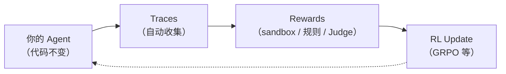

# 10.4 动手实验 与 用 rLLM 训练 DeepCoder Agent

前面几节讨论了 Agentic RL 的概念框架——rollout、信用分配、工具调用、评测体系。现在是动手时间：**用一个工业级框架（rLLM），从头到尾跑通"代码生成 Agent 的 RL 训练"全流程——从数据长什么样，到训练怎么跑，到结果怎么判断好还是不好。**

本节的实验对象是 **DeepCoder**——Berkeley Sky Lab 出品的代码推理模型，其 14B 版本在 LiveCodeBench 上达到 60.6% Pass@1，匹配 OpenAI o3-mini。我们要做的是：用 rLLM 框架复现它的评测和训练流程，看 RL 训练前后模型到底变好了多少、变好在哪。

### RL 训练前后对比

我们将以 Qwen2.5-Coder-3B-Instruct 作为基座模型，用 rLLM 框架做 GRPO RL 训练，在 LiveCodeBench 测试集上评测。预期结果：

| 阶段       | 模型                                    | LiveCodeBench Pass@1 | 说明                        |
| ---------- | --------------------------------------- | -------------------- | --------------------------- |
| **训练前** | Qwen2.5-Coder-3B-Instruct（基座）       | ~30%                 | 未经 RL 训练的原始模型      |
| **训练后** | + DeepCoder RL（1 epoch, LoRA rank 32） | ~38-40%              | RL 训练后提升 8-10 个百分点 |

如果用更大的模型和更长的训练，效果更显著：

| 模型                              | LiveCodeBench Pass@1  |
| --------------------------------- | --------------------- |
| Qwen3-4B-Instruct（基座）         | ~38%                  |
| + DeepCoder RL（1 epoch）         | ~46%                  |
| DeepCoder-14B-Preview（完整训练） | 60.6%（匹配 o3-mini） |

本节动手实验聚焦在 3B 模型上——单卡 24GB 显存即可完成，让你亲自验证"RL 训练确实能让代码 Agent 变强"。


<div style="text-align: center; font-size: 0.9em; color: var(--vp-c-text-2); margin-top: -10px; margin-bottom: 20px;">
  <em>图 1：DeepCoder 在 LiveCodeBench 上的得分进展。DeepCoder-14B-Preview（64K 推理）达到 60.6% Pass@1，匹配 o3-mini 水平。来源：<a href="https://pretty-radio-b75.notion.site/DeepCoder-A-Fully-Open-Source-14B-Coder-at-O3-mini-Level-1cf81902c14680b3bee5eb349a512a51" target="_blank" rel="noopener noreferrer">Agentica Blog</a></em>
</div>

## rLLM 框架速览

**rLLM** 是一个框架无关的 Agentic RL 训练框架 [^rllm]。核心思想：**你的 Agent 代码不需要改，rLLM 通过 gateway 透明拦截 LLM 调用，自动收集训练所需的全部信息。**



rLLM 已在多个任务上验证有效性：

| 项目           | 模型规模 | 成果                                            |
| -------------- | -------- | ----------------------------------------------- |
| **DeepCoder**  | 14B      | LiveCodeBench 60.6%，匹配 o3-mini [^deepcoder]  |
| **DeepScaleR** | 1.5B     | AIME 2024 43.1%，超越 O1-Preview [^deepscaleR]  |
| **DeepSWE**    | 32B      | SWEBench-Verified 59%，开源 SOTA [^deepswe]     |
| **FinQA**      | 4B       | 金融分析超 Qwen3-235B（59.7% vs 51.4%）[^finqa] |


<div style="text-align: center; font-size: 0.9em; color: var(--vp-c-text-2); margin-top: -10px; margin-bottom: 20px;">
  <em>图 2：DeepCoder 的 RL 训练管线。从数据采样、模型生成、sandbox 验证到 GRPO 策略更新的完整循环。来源：<a href="https://pretty-radio-b75.notion.site/DeepCoder-A-Fully-Open-Source-14B-Coder-at-O3-mini-Level-1cf81902c14680b3bee5eb349a512a51" target="_blank" rel="noopener noreferrer">Agentica Blog</a></em>
</div>

## 环境准备

### 硬件要求

| 阶段          | 最低要求                  | 推荐                  |
| ------------- | ------------------------- | --------------------- |
| 评测（eval）  | 1 张 GPU（vLLM 推理端点） | RTX 4090 / A5000 24GB |
| 训练（train） | 1 张 GPU（Tinker 后端）   | A100 80GB 或 2×A6000  |
| 数据准备      | 不需要 GPU                | 任意机器              |

### 安装

```bash
# 安装 rllm（Python >= 3.11）
pip install rllm

# 克隆仓库获取 cookbook
git clone https://github.com/rllm-org/rllm.git
cd rllm

# 安装 deepcoder cookbook
uv pip install --no-deps -e cookbooks/deepcoder

# 确认安装成功
rllm agent list  # 应该看到 "deepcoder"
```

### 启动推理端点

训练和评测都需要一个 OpenAI 兼容的推理端点：

```bash
# 用 Qwen2.5-Coder-3B 作为基座（24GB 显存即可）
python -m vllm.entrypoints.openai.api_server \
  --model Qwen/Qwen2.5-Coder-3B-Instruct \
  --port 8000 \
  --tensor-parallel-size 1
```

端点启动后，`http://localhost:8000/v1` 就是 rLLM 的 `--base-url`。后续所有 `rllm eval` 和 `rllm train` 都会通过这个端点调用模型。

---

## 用 rLLM 设计 Reward

环境准备好后，动手之前先理解 rLLM 的 reward 接口。这是后面所有实验的基础——DeepCoder 的 sandbox 验证和旅游 Agent 的混合评分都建立在同一个接口上。

### `@rllm.evaluator` 与 一个函数就是一个评分器

rLLM 的 reward 设计遵循一个极简原则：**一个 Python 函数就是一个完整的评分器。** 用 `@rllm.evaluator` 装饰器注册，接收 task（题目）和 episode（agent 的完整执行记录），返回一个 `EvalOutput`：

```python
import rllm
from rllm.eval.types import EvalOutput, Signal
from rllm.types import Episode, Task

@rllm.evaluator
def my_evaluator(task: Task, episode: Episode) -> EvalOutput:
    # episode.artifacts 里存着 agent 的输出
    answer = episode.artifacts.get("answer", "")

    # 你的评分逻辑
    reward = ...  # 0.0 ~ 1.0 之间的浮点数

    return EvalOutput(
        reward=reward,                  # 总分（0.0 ~ 1.0）
        is_correct=reward >= 0.7,       # 是否"通过"（阈值自己定）
        signals=[                       # 细粒度信号（可选但强烈推荐）
            Signal(name="accuracy", value=...),
            Signal(name="format", value=...),
        ],
        metadata={...},                 # 附加信息（如每个测试用例的结果）
    )
```

**输入是什么？**

| 参数      | 类型      | 包含什么                                                                                  |
| --------- | --------- | ----------------------------------------------------------------------------------------- |
| `task`    | `Task`    | 题目信息：`task.instruction`（用户 prompt）、`task.metadata`（ground truth 等）           |
| `episode` | `Episode` | agent 的完整执行记录：`episode.artifacts`（最终输出）、`episode.trajectories`（每步详情） |

**输出是什么？**

| 字段         | 类型           | 含义                                                                 |
| ------------ | -------------- | -------------------------------------------------------------------- |
| `reward`     | `float`        | 总分，0.0~1.0。RL 训练直接优化这个值                                 |
| `is_correct` | `bool`         | 是否通过。用于统计 Pass@1                                            |
| `signals`    | `list[Signal]` | 分维度得分。**这是判断模型好坏的关键**——只看 reward 无法区分"差在哪" |
| `metadata`   | `dict`         | 附加详情。可以存每个测试用例的 pass/fail、judge 的评语等             |

### 三种 Reward 设计范式

根据任务的可验证程度，reward 设计从简单到复杂分三档：

#### Sandbox / RLVR（完全可验证）

**适用场景**：代码生成、数学推理——答案有唯一正确解。

```python
@rllm.evaluator
def sandbox_evaluator(task, episode):
    answer = episode.artifacts.get("answer", "")
    code = extract_last_python_block(answer)

    # 在 sandbox 里跑代码，对比隐藏测试
    results = run_tests(code, task.metadata["ground_truth"])

    all_passed = all(r["passed"] for r in results)
    return EvalOutput(
        reward=1.0 if all_passed else 0.0,  # 只有 0 和 1
        is_correct=all_passed,
        signals=[Signal(name="accuracy", value=sum(r["passed"] for r in results) / len(results))],
        metadata={"test_results": results},
    )
```

特点：零噪声、零成本、不需要外部 API。DeepCoder 用的就是这个。

#### 规则匹配（部分可验证）

**适用场景**：格式要求明确、有关键字段可以自动检查的任务。

```python
@rllm.evaluator
def rule_evaluator(task, episode):
    answer = episode.artifacts.get("answer", "")
    meta = task.metadata or {}

    checks = {
        "format":      bool(re.search(r'<result>.*?</result>', answer, re.DOTALL)),
        "keyword_hit": meta.get("keyword", "") in answer,
        "length_ok":   50 <= len(answer) <= 2000,
    }

    # 每项检查权重相等
    reward = sum(checks.values()) / len(checks)

    return EvalOutput(
        reward=reward,
        is_correct=all(checks.values()),
        signals=[Signal(name=k, value=float(v)) for k, v in checks.items()],
    )
```

特点：多项检查、可以有中间分数、仍然不需要外部 API。旅游 Agent 的硬性部分用的就是这个。

#### LLM as Judge（主观质量评估）

**适用场景**：文本质量、创意性、用户体验等无法用规则自动判定的维度。

```python
@rllm.evaluator
def llm_judge_evaluator(task, episode):
    answer = episode.artifacts.get("answer", "")
    from openai import OpenAI
    client = OpenAI()

    judge_prompt = f"""评估以下回答的质量（1-5分）：
问题：{task.instruction}
回答：{answer}
评分标准：1=不可用, 3=可用但有改善空间, 5=超出预期
只输出一个数字。"""

    resp = client.chat.completions.create(
        model="gpt-4o-mini",
        messages=[{"role": "user", "content": judge_prompt}],
        max_tokens=10,
    )
    score = int(re.search(r'(\d)', resp.choices[0].message.content).group(1))
    reward = score / 5.0

    return EvalOutput(
        reward=reward,
        is_correct=score >= 4,
        signals=[Signal(name="judge_score", value=score)],
    )
```

特点：灵活但有 API 成本（每次约 $0.01-0.05），评分有一定噪声。

#### 硬性 + LLM Judge

实际项目中最常见的做法是把范式二和范式三组合——能自动检查的用规则，需要理解语义的用 judge。旅游 Agent 的 reward 就是这个模式：

```python
# 硬性规则（0.8 分） 与 格式、目的地、预算、景点
hard_reward = rule_based_check(answer, task.metadata)

# LLM Judge（0.2 分） 与 行程质量、逻辑性、用户体验
llm_reward = llm_as_judge(answer, task.instruction)

total_reward = hard_reward + llm_reward  # 最高 1.0
```

组合原则：**客观性越强的维度用规则，主观性越强的维度用 judge。** 规则部分的比例越高，训练信号越稳定；judge 部分的比例越高，对"软性质量"的优化越好。

### 设计 Reward 的常见陷阱

| 陷阱                | 表现                                             | 解法                                                           |
| ------------------- | ------------------------------------------------ | -------------------------------------------------------------- |
| **Reward 过于稀疏** | 只有 0/1，大部分时候都是 0，模型学不到东西       | 加中间奖励（如格式正确 +0.2），或增大 GRPO 的 group_size       |
| **Reward hacking**  | 模型找到了漏洞（如堆砌关键词拿高分而非真正理解） | 多维度交叉验证，定期用独立评测集检查                           |
| **Judge 不稳定**    | 同一个回答两次 judge 给出不同分数                | 固定 temperature=0，用确定性评分标准（rubric），多次采样取均值 |
| **维度冲突**        | 格式奖励和内容奖励打架——模型只顾格式不顾内容     | 硬性约束作为前置条件（格式不对直接 0 分），质量分数作为加分项  |

### signals 的重要性

`signals` 不是可选的附加信息——**它是你诊断训练问题的核心工具。** 如果只看 `reward`，你会发现分数在涨但不知道为什么；有了 `signals`，你能看到是哪个维度在涨、哪个维度卡住了。

```text
# 只有 reward —— 信息量低
Epoch 1 | reward_mean: 0.45

# 有 signals —— 能定位问题
Epoch 1 | reward_mean: 0.45 | format: 0.92 | accuracy: 0.28 | budget_ok: 0.15
                              ^^^^^^^^^^^^     ^^^^^^^^^^^^^^    ^^^^^^^^^^^^^^^
                              格式已经学会了    准确性还不够      预算控制最弱
```

这样你就知道下一步应该：在 reward 里加大 budget_ok 的权重，或者增加预算控制相关的训练数据。

## 数据长什么样？

### 数据来源

DeepCoder 的训练数据来自四个代码竞赛平台的题目，全部通过 HuggingFace 自动下载：

| 数据源               | 训练/测试   | 题目特点                           |
| -------------------- | ----------- | ---------------------------------- |
| **LiveCodeBench v5** | 训练 + 测试 | 持续更新的代码评测基准，题目不泄露 |
| **TACO**             | 训练        | 滑铁卢大学竞赛编程题，难度分级     |
| **PrimeIntellect**   | 训练        | 合成编程题，覆盖多种算法模式       |
| **Codeforces**       | 测试        | 竞赛编程平台真实题目，难度较高     |

### 下载数据

```bash
# 快速版——200 题 train + 50 题 test，验证流程用
python cookbooks/deepcoder/prepare_deepcoder_data.py \
  --train-size 200 --test-size 50

# 完整版——所有数据
python cookbooks/deepcoder/prepare_deepcoder_data.py
```

脚本会自动从 HuggingFace 下载 `agentica-org/DeepCoder-Preview-Dataset`，解压后注册到 rLLM 的 `DatasetRegistry`。

### 一条数据长什么样？

每条数据是一个 JSON 对象。以下是一条来自 LiveCodeBench 的真实样例（精简版）：

```python
{
    # 题目描述：模型看到的内容
    "question": """
You are given an array of integers `nums` and an integer `k`.
Return the maximum sum of a subarray of length exactly `k`.

Example 1:
  Input: nums = [1,4,2,10,23,3,1,0,20], k = 4
  Output: 39
  Explanation: The subarray [4,2,10,23] has the maximum sum.

Constraints:
  1 <= k <= nums.length <= 10^5
""",
    # 隐藏测试用例：模型看不到，evaluator 用来判分
    "ground_truth": "["
        '{"input": "1 4 2 10 23 3 1 0 20\\n4", "output": "39", "testtype": "stdin_stdout"},'
        '{"input": "100 200 300\\n3", "output": "600", "testtype": "stdin_stdout"},'
        '{"input": "-1 -2 -3 -4\\n2", "output": "-3", "testtype": "stdin_stdout"}'
    "]",

    "data_source": "livecodebench",  # 来源标记
    "starter_code": "",              # 可选的模板代码
    "uid": "lcb_v5_00142",          # 唯一 ID
}
```

关键点：

- **`question`** 是模型在 prompt 里收到的完整题目描述
- **`ground_truth`** 是一组隐藏的输入-输出测试对，**模型看不到**
- **`testtype`** 有两种：
  - `stdin_stdout`：代码从 stdin 读输入，往 stdout 写输出
  - `functional`：代码实现一个函数，测试框架调用它

再来看一条 Codeforces 风格的：

```python
{
    "question": """
Alice and Bob are playing a game. There are n piles of stones.
On each turn, a player removes 1 or 2 stones from any pile.
The player who cannot make a move loses.
Given n and the sizes of each pile, determine who wins if both play optimally.

Input: The first line contains n. The second line contains n integers.
Output: "Alice" or "Bob"
""",
    "ground_truth": "["
        '{"input": "3\\n1 2 3", "output": "Alice", "testtype": "stdin_stdout"},'
        '{"input": "2\\n4 4", "output": "Bob", "testtype": "stdin_stdout"}'
    "]",
    "data_source": "codeforces",
}
```

::: details 测试用例的格式详解

`ground_truth` 是一个 JSON 编码的列表。每个元素是一个测试用例：

| 字段       | 含义                                                      |
| ---------- | --------------------------------------------------------- |
| `input`    | 传给程序的输入（stdin 或函数参数）                        |
| `output`   | 期望的输出（stdout 或返回值）                             |
| `testtype` | `stdin_stdout`（标准输入输出）或 `functional`（函数调用） |

对于 `stdin_stdout` 类型，evaluator 会执行：`echo "input" | python solution.py`，然后对比 stdout 是否匹配 `output`。

对于 `functional` 类型，evaluator 会导入你的函数，用 `input` 作为参数调用它，对比返回值是否匹配 `output`。
:::

## 模型输出长什么样？Evaluator 怎么打分？

### 模型的输出格式

模型收到题目后，在一个 assistant 回复里输出推理过程 + Python 代码。例如：

````
这道题要求找长度为 k 的最大子数组和。

思路：滑动窗口。维护一个大小为 k 的窗口，记录当前窗口的和，
每次右移时加上新元素、减去离开的元素，更新最大值。

时间复杂度 O(n)，空间复杂度 O(1)。

```python
import sys

def solve():
    data = sys.stdin.read().split()
    nums = list(map(int, data[:-1]))
    k = int(data[-1])

    current_sum = sum(nums[:k])
    max_sum = current_sum

    for i in range(k, len(nums)):
        current_sum += nums[i] - nums[i - k]
        max_sum = max(max_sum, current_sum)

    print(max_sum)

solve()
````

```

### Evaluator 的打分流程

evaluator 做三件事：

```

① 提取最后一个 `python` 代码块
② 在 sandbox 中执行代码，用每个隐藏测试用例作为输入
③ 对比实际输出和期望输出——全部匹配则 reward=1.0，否则 reward=0.0

````

核心代码（精简版，完整版见 [cookbooks/deepcoder/deepcoder\_eval.py](https://github.com/rllm-org/rllm/blob/main/cookbooks/deepcoder/deepcoder_eval.py)）：

```python
@rllm.evaluator
def deepcoder_evaluator(task, episode):
    from rllm.rewards.code_reward import RewardCodeFn, RewardConfig

    # ① 从 episode 的 artifacts 中取出模型的完整输出
    answer = str(episode.artifacts.get("answer", ""))

    # ② RewardCodeFn 自动提取最后一个 ```python``` 块
    #    然后用 task 中的 ground_truth 测试用例逐个跑
    grader = RewardCodeFn(RewardConfig())
    result = grader(task_info=task_info(task), action=answer)

    # ③ 返回评测结果
    is_correct = bool(result.is_correct)
    return EvalOutput(
        reward=float(result.reward),       # 1.0（全过）或 0.0（有错）
        is_correct=is_correct,             # True / False
        signals=[Signal(name="accuracy", value=1.0 if is_correct else 0.0)],
        metadata=result.metadata,          # 包含每个测试用例的详细结果
    )
````

### 看一个具体 case

假设模型对上面的滑动窗口题输出了代码。evaluator 的内部执行过程：

```text
测试用例 1: input="1 4 2 10 23 3 1 0 20\n4"
            期望输出: "39"
            实际输出: "39"  ✅ PASS

测试用例 2: input="100 200 300\n3"
            期望输出: "600"
            实际输出: "600"  ✅ PASS

测试用例 3: input="-1 -2 -3 -4\n2"
            期望输出: "-3"
            实际输出: "-3"  ✅ PASS

全部通过 → reward = 1.0, is_correct = True
```

如果模型输出有 bug，比如忘了处理负数：

```text
测试用例 1: ✅ PASS
测试用例 2: ✅ PASS
测试用例 3: 期望 "-3", 实际 "-1"  ❌ FAIL

有测试失败 → reward = 0.0, is_correct = False
```

reward 只有 0 和 1 两个值——没有中间状态。这就是第 9 章讲的 **RLVR（可验证奖励）**：代码要么对要么不对，不需要 Reward Model 来猜。

## 跑基线评测——训练前模型有多强？

在训练之前，先看基座模型的原始水平：

```bash
rllm eval deepcoder \
  --agent deepcoder \
  --evaluator deepcoder \
  --model Qwen/Qwen2.5-Coder-3B-Instruct \
  --base-url http://localhost:8000/v1 \
  --split test \
  --max-examples 20
```

参数含义：

| 参数                    | 含义                                                  |
| ----------------------- | ----------------------------------------------------- |
| `--agent deepcoder`     | 使用 deepcoder 的 AgentFlow（`@rllm.rollout` 注册的） |
| `--evaluator deepcoder` | 使用 deepcoder 的 evaluator（sandbox 打分）           |
| `--model`               | 模型名称（传给 vLLM 推理端点）                        |
| `--base-url`            | 推理端点地址                                          |
| `--split test`          | 评测测试集（和训练集不重叠）                          |
| `--max-examples 20`     | 先跑 20 题，快速验证流程                              |

### 怎么看评测结果？

评测完成后，结果存放在 `~/.rllm/eval_results/` 目录：

```bash
# 查看评测摘要
ls ~/.rllm/eval_results/
# 输出类似: deepcoder_20260512_143022/

# 用 rllm view 查看
rllm view

# 或者直接看 JSON
cat ~/.rllm/eval_results/latest/*.json | python -m json.tool
```

每条 episode 的 JSON 里包含完整的判分详情：

```json
{
  "task_id": "lcb_v5_00142",
  "reward": 1.0,
  "is_correct": true,
  "signals": [{ "name": "accuracy", "value": 1.0 }],
  "metadata": {
    "test_results": [
      {
        "input": "1 4 2 10 23 3 1 0 20\n4",
        "expected": "39",
        "actual": "39",
        "passed": true
      },
      {
        "input": "100 200 300\n3",
        "expected": "600",
        "actual": "600",
        "passed": true
      },
      {
        "input": "-1 -2 -3 -4\n2",
        "expected": "-3",
        "actual": "-3",
        "passed": true
      }
    ],
    "num_passed": 3,
    "num_total": 3
  }
}
```

一条失败的 episode 看起来是这样的：

```json
{
  "task_id": "lcb_v5_00089",
  "reward": 0.0,
  "is_correct": false,
  "metadata": {
    "test_results": [
      {
        "input": "5\n1 2 3 4 5",
        "expected": "YES",
        "actual": "YES",
        "passed": true
      },
      {
        "input": "3\n1 1 1",
        "expected": "NO",
        "actual": "YES",
        "passed": false
      }
    ],
    "num_passed": 1,
    "num_total": 2,
    "error": "Test case 2 failed: expected 'NO', got 'YES'"
  }
}
```

**判断结果好坏的标准**：看 `reward` 的均值——所有 episode 的 `reward` 加起来除以总数，就是 **Pass@1**（一次生成通过率）。

```bash
# 快速计算 Pass@1
python -c "
import json, glob
files = glob.glob('$HOME/.rllm/eval_results/latest/*.json')
results = [json.load(open(f)) for f in files]
pass1 = sum(r['reward'] for r in results) / len(results)
print(f'Pass@1: {pass1:.1%} ({sum(r["is_correct"] for r in results)}/{len(results)})')
"
```

典型输出：

```text
Pass@1: 30.0% (6/20)
```

说明基座模型在 20 题里做对了 6 题。这就是训练前的基线。

## 理解 DeepCoder AgentFlow

在开始训练之前，理解 rLLM 是怎么把模型调用变成可训练的数据结构的。

DeepCoder 是一个**单轮** Agent——一次 LLM 调用就出答案。它的核心代码约 50 行（精简版，完整版见 [cookbooks/deepcoder/deepcoder_flow.py](https://github.com/rllm-org/rllm/blob/main/cookbooks/deepcoder/deepcoder_flow.py)）：

````python
import rllm
from rllm.types import AgentConfig, Episode, Step, Task, Trajectory
from openai import AsyncOpenAI

SYSTEM_PROMPT = """\
You are a competitive programmer. Reason step by step, then put your
final solution in a single fenced code block:

```python
# your solution here
```
"""

@rllm.rollout(name="deepcoder")
async def deepcoder_flow(task: Task, config: AgentConfig) -> Episode:
    """One-shot coding flow: LLM emits a single response, evaluator grades."""
    question = str((task.metadata or {}).get("question", ""))
    client = AsyncOpenAI(base_url=config.base_url, api_key="EMPTY")

    messages = [
        {"role": "system", "content": SYSTEM_PROMPT},
        {"role": "user", "content": question},
    ]

    # 一次 LLM 调用
    resp = await client.chat.completions.create(
        model=config.model, messages=messages,
        temperature=0.6, max_tokens=16384,
    )
    content = resp.choices[0].message.content or ""

    # 封装为 rLLM 的 Episode
    return Episode(
        trajectories=[Trajectory(name="deepcoder", steps=[
            Step(chat_completions=messages + [{"role": "assistant", "content": content}]),
        ])],
        artifacts={"answer": content},
    )
````

关键设计点：

1. **`@rllm.rollout` 装饰器**：把 async 函数变成 rLLM 的 AgentFlow。gateway 自动拦截 `AsyncOpenAI` 调用，记录 token IDs 和 logprobs。

2. **`config.base_url`**：eval 时指向你的推理端点，训练时 rLLM 自动切换到自己的 gateway。**同一份代码，eval 和 training 完全通用。**

3. **`artifacts["answer"]`**：evaluator 从这里提取代码，只取最后一个 ` ```python ``` ` 块。

## GRPO RL 训练

### 一行命令开始训练

```bash
rllm train deepcoder \
  --agent deepcoder \
  --evaluator deepcoder \
  --model Qwen/Qwen2.5-Coder-3B-Instruct \
  --group-size 4 \
  --batch-size 16 \
  --lora-rank 32 \
  --epochs 1 \
  --val-freq 20
```

### 超参数解读

| 参数           | 值  | 含义                    | 怎么调                             |
| -------------- | --- | ----------------------- | ---------------------------------- |
| `--group-size` | 4   | GRPO 每题采样 4 个解法  | 越大 advantage 估计越准，但越慢    |
| `--batch-size` | 16  | 每批 16 题              | 受显存限制                         |
| `--lora-rank`  | 32  | LoRA 秩——只训低秩适配器 | 16-64 均可，越大训得越细但显存越高 |
| `--epochs`     | 1   | 遍历训练集 1 遍         | 小数据集可以加到 2-3               |
| `--val-freq`   | 20  | 每 20 步验证一次        | 越小监控越细但越慢                 |

### 训练过程发生了什么？

GRPO 的训练循环（对应第 9 章的算法）：

```text
对每道题：
  1. 采样 4 个解法（group_size=4）
     - 同一个题目，模型生成 4 次代码（temperature > 0）
     - 每次可能生成不同的算法/实现

  2. 给每个解法打分
     - sandbox 跑测试：全过 = 1.0，否则 = 0.0
     - 比如这 4 个解法的 reward 是 [0, 1, 0, 1]

  3. 计算组内 advantage（GRPO 核心）
     - 组内均值 = 0.5, 标准差 = 0.5
     - advantage = (reward - mean) / std
     - 结果: [-1, +1, -1, +1]
     - 含义: 做对的解法被强化，做错的被抑制

  4. 策略梯度更新
     - 对 advantage > 0 的解法：提高模型生成类似代码的概率
     - 对 advantage < 0 的解法：降低模型生成类似代码的概率
     - 通过 LoRA 更新，只改少量参数
```


<div style="text-align: center; font-size: 0.9em; color: var(--vp-c-text-2); margin-top: -10px; margin-bottom: 20px;">
  <em>图 3：GRPO+ 与标准 GRPO 的训练奖励曲线对比。GRPO+ 通过改进的组内优势估计，在相同数据量下获得更高的平均奖励。来源：<a href="https://pretty-radio-b75.notion.site/DeepCoder-A-Fully-Open-Source-14B-Coder-at-O3-mini-Level-1cf81902c14680b3bee5eb349a512a51" target="_blank" rel="noopener noreferrer">Agentica Blog</a></em>
</div>


<div style="text-align: center; font-size: 0.9em; color: var(--vp-c-text-2); margin-top: -10px; margin-bottom: 20px;">
  <em>图 4：LiveCodeBench Pass@1 得分随训练步数的变化。从 16K 到 32K 上下文长度扩展后，模型解题能力持续提升。来源：<a href="https://pretty-radio-b75.notion.site/DeepCoder-A-Fully-Open-Source-14B-Coder-at-O3-mini-Level-1cf81902c14680b3bee5eb349a512a51" target="_blank" rel="noopener noreferrer">Agentica Blog</a></em>
</div>

### 训练日志怎么读

训练过程中 rLLM 输出实时日志：

```text
Epoch 1 | Step  5 | loss: 0.352 | reward_mean: 0.25 | val_reward: 0.30
Epoch 1 | Step 10 | loss: 0.328 | reward_mean: 0.33 | val_reward: 0.35
Epoch 1 | Step 15 | loss: 0.298 | reward_mean: 0.38 | val_reward: 0.40
Epoch 1 | Step 20 | loss: 0.275 | reward_mean: 0.42 | val_reward: 0.43
...
```

| 指标          | 含义                  | 正常趋势                                    |
| ------------- | --------------------- | ------------------------------------------- |
| `loss`        | GRPO 策略梯度 loss    | 逐步下降                                    |
| `reward_mean` | 训练集上的平均 reward | 逐步上升                                    |
| `val_reward`  | 验证集上的平均 reward | 跟着上升，如果和 reward_mean 拉开说明过拟合 |

如果 `reward_mean` 持续为 0——说明模型还没做对过任何题，需要降低题目难度或增大 `group_size`。

也可以用 rLLM UI 可视化：

```bash
rllm ui  # 启动本地 Web UI，查看训练曲线和 episode 详情
```

### 训练后端选择

| 后端       | 适用场景             | 说明                                                   |
| ---------- | -------------------- | ------------------------------------------------------ |
| **Tinker** | 单机训练（1-2 GPU）  | 默认后端，入门推荐                                     |
| **Verl**   | 分布式训练（多 GPU） | `uv pip install -e ".[verl]"`，用 `train_verl.sh` 启动 |

## 训练后评测——真的变好了吗？

### 跑训练后评测

用和基线**完全相同**的命令再跑一次：

```bash
rllm eval deepcoder \
  --agent deepcoder \
  --evaluator deepcoder \
  --model Qwen/Qwen2.5-Coder-3B-Instruct \
  --base-url http://localhost:8000/v1 \
  --split test \
  --max-examples 50
```

### Before / After 对比

```text
Before RL Training (基座模型)
  Pass@1 (n=20): 30.0%    # 20 题对了 6 题

After RL Training (1 epoch, LoRA rank 32)
  Pass@1 (n=50): 39.0%    # 50 题对了 ~20 题，+9 个百分点
```

### 怎么判断结果是否可信？

光看 Pass@1 上涨不够。需要检查三件事：

**1. 验证集是否独立？**

训练数据和测试数据不能重叠。DeepCoder 的数据集设计已经保证了这一点——训练用 TACO/PrimeIntellect/LiveCodeBench 训练集，测试用 Codeforces/LiveCodeBench 测试集。如果你自己拆数据，确保 `--split test` 从未参与训练。

**2. 是否 Reward Hacking？**

如果 Pass@1 涨了但模型写的代码逻辑上并没有变好，可能是模型找到了 reward 的漏洞。检查方法：

```bash
# 抽几道题，人工看模型生成的代码是否合理
rllm view  # 逐条查看 episode 的输入、输出、测试结果
```

对于 DeepCoder 的 sandbox reward，reward hacking 的风险很低——代码要么通过隐藏测试要么不通过，没有"钻空子"的空间。这比用 Reward Model 打分的场景安全得多。

**3. 提升是否稳定？**

```bash
# 多跑几次，看方差
rllm eval deepcoder --split test --max-examples 50  # 第 1 次
rllm eval deepcoder --split test --max-examples 50  # 第 2 次
rllm eval deepcoder --split test --max-examples 50  # 第 3 次
```

如果三次结果都在 37%-41% 范围内，说明提升是稳定的。如果一次 40%、一次 25%，说明训练不稳定或者评测样本太少。

### 模型到底学到了什么？

看 `rllm view` 里的 episode 对比，RL 后模型的变化主要体现在：

1. **边界情况处理更好**：空输入、大数据量、特殊字符等不再崩溃
2. **推理更充分**：模型倾向于写代码前先分析题目，输出更长的推理链
3. **减少"差一点就对"的解法**：GRPO 的组内比较让模型学会避开陷阱

这些行为不是 SFT 教的——模型在 RL 训练中自主发现了更有效的解题策略。

## 为什么 reward 如此简洁？

DeepCoder 的 reward 只有 1.0 和 0.0 两个值。这么简单真的够用吗？

**在代码任务上，二元 reward 不仅够用，而且可能是最优选择。**

1. **信号无噪声**：`assert fib(10) == 55` 要么过要么不过，没有歧义。不像文本质量评估（主观、多维）。

2. **GRPO 解决稀疏奖励**：单条轨迹只有 0/1 确实信息量低。但 GRPO 一次对同一题生成 4 个解法，组内至少有一个对的就能产生有效的 advantage 信号。

3. **不需要 Reward Model**：训练 RM 本身就是一个复杂的 ML 任务——需要偏好数据、需要防止 reward hacking。Sandbox 验证是免费的、即时的、永远正确的。

::: details 与 FinQA 的 judge LLM reward 对比

同样是 rLLM cookbook，FinQA（金融分析 Agent）使用了完全不同的 reward：

| 维度        | DeepCoder              | FinQA                          |
| ----------- | ---------------------- | ------------------------------ |
| Reward 来源 | Sandbox 代码执行       | Judge LLM（gpt-5-nano）        |
| Reward 值   | 0.0 / 1.0              | 连续分数 + table-access bonus  |
| 外部依赖    | 无                     | 需要 OpenAI API                |
| 成本        | 零                     | 每次评测约 $0.01-0.05          |
| 适用场景    | 代码、数学等可验证任务 | 金融、研究等需要主观判断的任务 |

代码任务用最简单的 RLVR 就够了；需要理解语义的任务则需要更复杂的 reward 设计（参见 10.1 节 ORM vs PRM 的讨论）。
:::

## 从 DeepCoder 出发可以做什么

### 换基座模型

换模型只需改一个参数：

```bash
# 更大的模型
rllm train deepcoder --model Qwen/Qwen3-8B

# 专门的代码模型
rllm train deepcoder --model deepseek-ai/DeepSeek-Coder-V2-Lite-Instruct
```

### 换评测集

rLLM 支持多种 benchmark：

```bash
rllm eval gsm8k    # 数学推理
rllm eval math     # 数学竞赛
rllm eval finqa    # 金融分析（多工具 Agent）
```

### FinQA 与 多工具搜索 Agent

如果代码实验让你对 rLLM 产生了兴趣，推荐试试 FinQA cookbook。它是一个多轮 ReAct Agent，配备了 4 个工具（SQL 查询、计算器、表查找等），在金融分析任务上用 4B 模型超越了 235B 的 Qwen3 [^finqa]：

```bash
uv pip install --no-deps -e cookbooks/finqa
python cookbooks/finqa/prepare_finqa_data.py
rllm eval finqa --model rLLM/rLLM-FinQA-4B --base-url http://localhost:8000/v1
```

### 自定义一个旅游行程 Agent

DeepCoder 是单轮代码生成。如果你想训练一个更复杂的 Agent——比如一个能搜索信息、比较价格、规划路线的旅游助手——rLLM 同样支持。这个例子展示了**非代码任务**的 reward 设计：既有硬性规则验证，也有 LLM as Judge。

#### AgentFlow 与 多轮搜索 + 行程规划

```python
import rllm, json
from rllm.types import AgentConfig, Episode, Step, Task, Trajectory
from openai import AsyncOpenAI

# 模拟的旅游信息数据库（实际项目中可以是搜索 API）
TRAVEL_DB = {
    "东京": {"酒店": {"经济": 500, "舒适": 1200, "豪华": 3000}, "景点": ["浅草寺", "涩谷", "秋叶原"]},
    "巴黎": {"酒店": {"经济": 600, "舒适": 1500, "豪华": 4000}, "景点": ["埃菲尔铁塔", "卢浮宫", "凯旋门"]},
    "纽约": {"酒店": {"经济": 800, "舒适": 1800, "豪华": 5000}, "景点": ["自由女神", "时代广场", "中央公园"]},
}

SYSTEM_PROMPT = """\
你是一个旅游行程规划助手。用户会给你一个旅行需求，你需要：

1. 用 <search>目的地</search> 查询酒店和景点信息
2. 根据预算和偏好规划行程
3. 最终用以下格式输出：

<itinerary>
目的地: xxx
天数: x
预算: xxx 元
每日安排:
  Day 1: ...
  Day 2: ...
酒店推荐: xxx (xxx元/晚)
总花费: xxx 元
</itinerary>
"""

@rllm.rollout(name="travel_agent")
async def travel_agent_flow(task: Task, config: AgentConfig) -> Episode:
    client = AsyncOpenAI(base_url=config.base_url, api_key="EMPTY")

    messages = [
        {"role": "system", "content": SYSTEM_PROMPT},
        {"role": "user", "content": task.instruction},  # 例如 "帮我规划一个3天东京旅行，预算5000元"
    ]

    all_steps = []
    import re

    for turn in range(3):  # 最多 3 轮交互
        resp = await client.chat.completions.create(
            model=config.model, messages=messages,
            temperature=0.7, max_tokens=2048,
        )
        content = resp.choices[0].message.content or ""
        messages.append({"role": "assistant", "content": content})
        all_steps.append(Step(model_response=content))

        # 检查是否调用了 <search>
        search_match = re.search(r'<search>(.*?)</search>', content)
        if search_match:
            query = search_match.group(1).strip()
            # 模拟搜索结果
            result = TRAVEL_DB.get(query, "未找到相关信息，请换一个目的地")
            obs = f"\n<search_result>\n{json.dumps(result, ensure_ascii=False, indent=2)}\n</search_result>\n"
            messages.append({"role": "user", "content": obs})
            all_steps.append(Step(model_response=obs))
        else:
            break  # 没有搜索请求，说明模型输出了最终行程

    # 从最后一条消息中提取行程
    final_content = messages[-1]["content"] if messages[-1]["role"] == "assistant" else ""

    return Episode(
        trajectories=[Trajectory(name="travel_agent", steps=all_steps)],
        artifacts={"answer": final_content},
    )
```

#### 数据格式

每条任务是一个旅行需求 + 期望信息：

```python
{
    "instruction": "帮我规划一个3天东京旅行，预算5000元，喜欢文化景点",
    "metadata": {
        "destination": "东京",
        "days": 3,
        "budget": 5000,
        "preferences": ["文化"],
        "expected_attractions": ["浅草寺"],  # 期望至少包含的景点
    }
}
```

#### Reward 设计 与 硬性规则 + LLM as Judge

这是重点。旅游行程不能像代码那样用 sandbox 自动判分——行程"好不好"有主观成分。因此 reward 分为两层：

```python
import rllm
from rllm.eval.types import EvalOutput, Signal
from rllm.types import Episode, Task
import re
from openai import OpenAI

@rllm.evaluator
def travel_evaluator(task, episode):
    answer = str(episode.artifacts.get("answer", ""))
    meta = task.metadata if hasattr(task, 'metadata') else task
    meta = meta or {}

    # ===== 第一层：硬性规则（自动验证） =====
    hard_reward = 0.0

    # 1. 格式检查：是否包含 <itinerary> 结构
    has_itinerary = bool(re.search(r'<itinerary>.*?</itinerary>', answer, re.DOTALL))
    hard_reward += 0.2 if has_itinerary else 0.0

    # 2. 目的地正确
    dest = meta.get("destination", "")
    has_dest = dest in answer if dest else True
    hard_reward += 0.1 if has_dest else 0.0

    # 3. 天数匹配
    expected_days = meta.get("days", 0)
    day_matches = re.findall(r'Day (\d+)', answer)
    has_days = len(day_matches) >= expected_days if expected_days else True
    hard_reward += 0.1 if has_days else 0.0

    # 4. 预算合理（总花费 ≤ 预算 × 1.1，允许 10% 浮动）
    budget = meta.get("budget", 0)
    cost_match = re.search(r'总花费[:：]\s*(\d+)', answer)
    if cost_match and budget:
        cost = int(cost_match.group(1))
        hard_reward += 0.2 if cost <= budget * 1.1 else 0.0
    elif budget == 0:
        hard_reward += 0.2  # 无预算要求，直接给分

    # 5. 包含期望景点
    expected = meta.get("expected_attractions", [])
    if expected:
        hits = sum(1 for a in expected if a in answer)
        hard_reward += 0.2 * (hits / len(expected))
    else:
        hard_reward += 0.2

    # ===== 第二层：LLM as Judge（语义质量） =====
    llm_reward = 0.0

    if has_itinerary:  # 只有格式正确才调 judge，节省 API 成本
        client = OpenAI()  # 使用默认 API key
        judge_prompt = f"""请评估这个旅游行程的质量（1-5分）：

用户需求：{meta.get('instruction', '')}
行程方案：
{answer}

评分标准：
1分：完全不可用
2分：有明显遗漏
3分：基本可用但有改善空间
4分：安排合理，信息充分
5分：超出预期，细节到位

只输出一个数字（1-5）。"""

        try:
            resp = client.chat.completions.create(
                model="gpt-4o-mini",
                messages=[{"role": "user", "content": judge_prompt}],
                max_tokens=10,
            )
            score_text = resp.choices[0].message.content.strip()
            llm_score = int(re.search(r'(\d)', score_text).group(1))
            llm_reward = llm_score / 5.0 * 0.2  # 最高 0.2
        except Exception:
            llm_reward = 0.0  # judge 调用失败，不影响硬性分数

    # ===== 综合 reward =====
    total_reward = hard_reward + llm_reward  # 最高 1.0

    return EvalOutput(
        reward=total_reward,
        is_correct=total_reward >= 0.7,
        signals=[
            Signal(name="hard_reward", value=hard_reward),     # 硬性规则分
            Signal(name="llm_reward", value=llm_reward),       # LLM judge 分
            Signal(name="format", value=1.0 if has_itinerary else 0.0),
            Signal(name="budget_ok", value=1.0 if cost_match and int(cost_match.group(1)) <= budget * 1.1 else 0.0),
        ],
    )
```

#### Reward 组成一览

| 层级      | 维度                      | 分值    | 判定方式         |
| --------- | ------------------------- | ------- | ---------------- |
| 硬性      | 格式正确（`<itinerary>`） | 0.2     | 正则匹配         |
| 硬性      | 目的地正确                | 0.1     | 字符串匹配       |
| 硬性      | 天数匹配                  | 0.1     | 正则匹配         |
| 硬性      | 预算合理                  | 0.2     | 数值比较         |
| 硬性      | 包含期望景点              | 0.2     | 关键词匹配       |
| LLM Judge | 行程质量                  | 0.2     | GPT-4o-mini 打分 |
| **合计**  |                           | **1.0** |                  |

#### 怎么看结果？

评测完成后，`signals` 字段告诉你每个维度的得分：

```json
{
  "task_id": "travel_001",
  "reward": 0.88,
  "is_correct": true,
  "signals": [
    { "name": "hard_reward", "value": 0.8 },
    { "name": "llm_reward", "value": 0.08 },
    { "name": "format", "value": 1.0 },
    { "name": "budget_ok", "value": 1.0 }
  ]
}
```

- `hard_reward = 0.8` 说明 5 项硬性检查通过了 4 项
- `llm_reward = 0.08` 说明 LLM judge 给了 2/5 分（2/5 × 0.2 = 0.08）
- 综合来看：格式和预算都没问题，但行程质量还有提升空间

如果 `format = 0.0`，说明模型连 `<itinerary>` 结构都没输出——格式都没学会，这时加 SFT warmup 比 RL 更有效。

这个 reward 设计的思路可以推广到任何"部分可验证 + 部分主观"的任务：

- **能自动验证的部分用硬性规则**（格式、数值、关键词）——零成本、无噪声
- **需要理解语义的部分用 LLM as Judge**——有成本但更灵活
- **两者的权重根据任务调整**——客观性越强的任务，硬性比例越高

#### 轨迹的好坏怎么判断？

一条轨迹好还是不好，不能只看 `reward` 这个单一数字。rLLM 记录了完整的层级化轨迹数据，你需要逐层看：

**rLLM 的轨迹层级（由粗到细）：**

```
Episode（一次任务）
  └── Trajectory（一次 agent 运行）
        ├── Step 1（第 1 次 LLM 调用）
        │     ├── chat_completions: 完整的 messages 列表
        │     ├── model_response: 模型输出
        │     └── token_ids + logprobs: 自动记录（gateway 拦截）
        ├── Step 2（第 2 次 LLM 调用，如果有工具交互）
        │     └── ...
        └── artifacts: 最终输出（如 {"answer": "行程内容"}）
```

| 层级           | 对应什么                | 看什么                                                      |
| -------------- | ----------------------- | ----------------------------------------------------------- |
| **Episode**    | 一次完整的任务执行      | `reward` 总分、`is_correct`、`signals` 各维度               |
| **Trajectory** | 一次 agent 运行的全过程 | 有几轮交互（`len(steps)`）、是否提前结束                    |
| **Step**       | 每一次 LLM 调用         | `model_response` 里模型想了什么、输出了什么、是否调用了工具 |

**具体判断方法——以旅游 Agent 为例：**

**好轨迹**长这样：

```text
Episode reward: 0.92
  Trajectory (2 steps):
    Step 1: 模型输出 "<search>东京</search>" → 搜索正确目的地
    Step 2: 模型输出完整 <itinerary>，预算 4800 元（≤ 5000），包含浅草寺

  Signals: format=1.0, budget_ok=1.0, hard_reward=0.8, llm_reward=0.12
  分析：硬性全过，judge 给了 3/5 分，行程基本可用
```

**差轨迹**长这样：

```text
Episode reward: 0.20
  Trajectory (1 step):
    Step 1: 模型直接输出了 <itinerary> 但没搜索，目的地写的"大阪"（错误）

  Signals: format=1.0, budget_ok=0.0, hard_reward=0.2, llm_reward=0.0
  分析：格式对了但内容全错——没调用搜索工具就去写了行程
```

**从轨迹中发现问题：**

| 症状               | 轨迹里的信号                             | 说明                                           |
| ------------------ | ---------------------------------------- | ---------------------------------------------- |
| reward 一直为 0    | `len(steps) == 1`，没有工具调用          | 模型不会用搜索工具，需要 SFT 教格式            |
| reward 时高时低    | `hard_reward` 稳定但 `llm_reward` 波动大 | 硬性检查过了但行程质量不稳定                   |
| budget_ok 一直为 0 | `Step 2` 里总花费远超预算                | 模型没学会控制成本，可以在 reward 里加预算惩罚 |
| 搜索了错误目的地   | `Step 1` 的 `<search>` 内容和题目不匹配  | 模型的搜索 query 构造能力弱，需要更多训练数据  |

**用 `rllm view` 逐条查看：**

```bash
# 启动交互式查看
rllm view

# 或者直接分析 JSON
python -c "
import json, glob
episodes = [json.load(open(f)) for f in glob.glob('$HOME/.rllm/eval_results/latest/*.json')]

# 按 reward 排序，看最差的是怎么回事
episodes.sort(key=lambda e: e['reward'])
for ep in episodes[:3]:
    print(f\"Task {ep['task_id']}: reward={ep['reward']:.2f}\")
    for s in ep.get('signals', []):
        print(f\"  {s['name']}: {s['value']}\")
    print()
"
```

输出示例：

```text
Task travel_003: reward=0.20
  format: 1.0
  budget_ok: 0.0
  hard_reward: 0.2
  llm_reward: 0.0

Task travel_007: reward=0.40
  format: 1.0
  budget_ok: 0.0
  hard_reward: 0.4
  llm_reward: 0.0

Task travel_012: reward=0.52
  format: 0.0
  budget_ok: 0.0
  hard_reward: 0.3
  llm_reward: 0.02
```

这样就能快速定位：哪些 episode 最差、差在哪（是格式问题、预算问题、还是整体质量问题），然后针对性地改进 reward 或增加训练数据。

## 参考资料

[^rllm]: rLLM Team. "rLLM: Democratizing Reinforcement Learning for LLMs." [GitHub](https://github.com/rllm-org/rllm), 2025. Berkeley Sky Computing Lab 出品的框架无关 Agentic RL 训练框架。

[^deepcoder]: Agentica Project. "DeepCoder: A Fully Open-Source 14B Coder at O3-mini Level." [Blog](https://pretty-radio-b75.notion.site/DeepCoder-A-Fully-Open-Source-14B-Coder-at-O3-mini-Level-1cf81902c14680b3bee5eb349a512a51), 2025. 用分布式 RL 从 DeepSeek-R1-Distilled-Qwen-14B 微调，LiveCodeBench 60.6% Pass@1。

[^deepscaleR]: Agentica Project. "DeepScaleR: Surpassing O1-Preview with a 1.5B Model by Scaling RL." [Blog](https://pretty-radio-b75.notion.site/DeepScaleR-Surpassing-O1-Preview-with-a-1-5B-Model-by-Scaling-RL-19681902c1468005bed8ca303013a4e2), 2025. 仅 1.5B 参数，AIME 2024 43.1%，超越 O1-Preview。

[^deepswe]: Agentica Project. "DeepSWE: Training a Fully Open-sourced, State-of-the-Art Coding Agent by Scaling RL." [Blog](https://pretty-radio-b75.notion.site/DeepSWE-Training-a-Fully-Open-sourced-State-of-the-Art-by-Scaling-RL-22281902c1468193aabbe9a8c59bbe33), 2025. 32B 模型，SWEBench-Verified 59%，开源 SOTA。

[^finqa]: rLLM Team. "rLLM-FinQA: How a 4B Model Outperforms 235B and Rivals Gemini 2.5 Pro on Financial Analysis." [Blog](https://rllm-project.com/blog/post.html?post=finqa.md), 2026. 多轮 ReAct Agent，4B 模型在金融分析上超越 Qwen3-235B。
