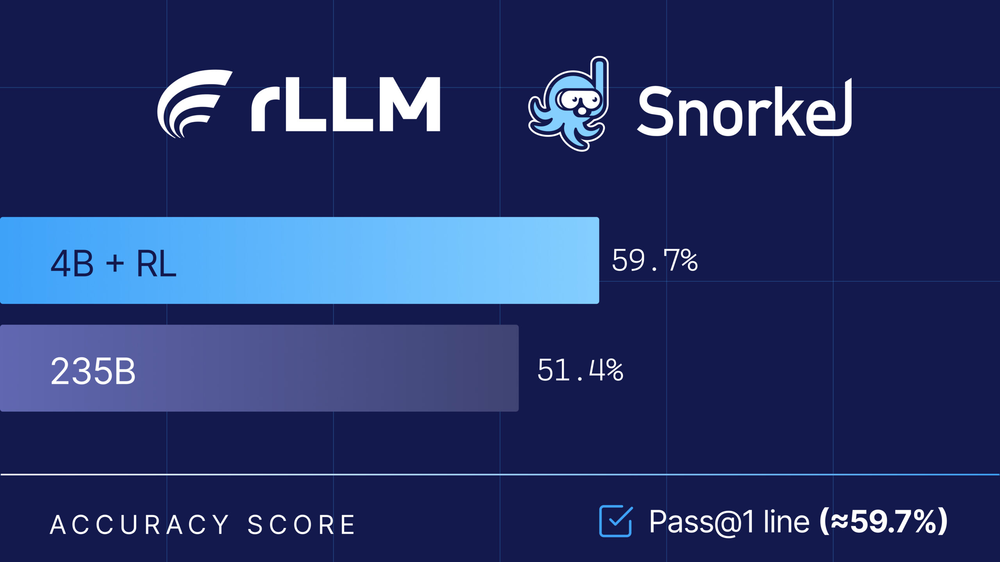
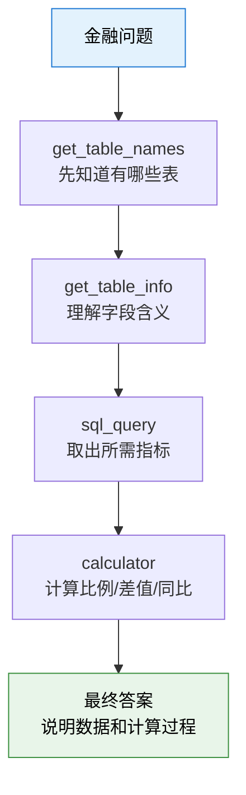

# 10.5 动手实验 与 用 rLLM 训练金融分析 Agent

上一节我们用 DeepCoder 看到了一个典型的代码后训练案例：模型写程序，沙箱运行测试，测试结果给出可验证奖励。这个例子很硬，但它也有一个门槛：代码题的 reward 很干净，真实企业任务却往往没有这么简单。

换个更接近业务的场景。假设用户问：

> 这家公司 2023 年的研发费用占营业收入的比例是多少？与 2022 年相比变化了多少？

一个普通语言模型可能会直接根据记忆回答，或者在长表格里迷失。真正可靠的做法不是凭印象生成结论，而是先找到对应公司的 10-K 财报表格，确认有哪些表，写 SQL 查出收入和研发费用，再做除法，最后把计算过程说清楚。这里的核心已经不是单轮问答，而是一个典型的 **tool-use Agent**：

```text
用户问题
  → 查看公司有哪些表
  → 查看表结构和字段
  → 写 SQL 查询指标
  → 调用计算器完成比例计算
  → 组织最终答案
  → 用 judge 或 benchmark 判断是否正确
```

本节要动手拆解的 **rLLM-FinQA**，正是这样一个金融 Agent 后训练案例。它用 rLLM 框架把 Qwen3-4B-Instruct-2507 训练成一个金融表格分析 Agent，最终在 Snorkel Finance Benchmark 上达到 59.7% 准确率，超过 Qwen3-235B 的 51.4%，接近 Gemini 2.5 Pro 的 60.6%[^rllm-finqa]。

这个实验很适合作为 Agentic RL 的第一个业务案例，因为它同时具备三个特点：任务来自真实财报，工具调用路径清晰，训练和评测都可以完整复现。



<div style="text-align: center; font-size: 0.9em; color: var(--vp-c-text-2); margin-top: -10px; margin-bottom: 20px;">
  <em>图 1：Snorkel 与 rLLM 合作推出金融分析 Agent 后训练方案，4B 模型在 Snorkel Finance Benchmark 上超越 235B 通用模型。来源：<a href="https://snorkel.ai/" target="_blank" rel="noopener noreferrer">Snorkel AI</a></em>
</div>

## 为什么金融问答适合 Agentic RL

先看直觉。金融问题通常不是“背一个事实”，而是“从一组结构化材料中取数、计算、解释”。比如“毛利率同比变化多少”“经营现金流是否覆盖资本开支”“某项费用占收入比例是多少”。这些问题有两个共同点。

第一，答案必须 grounded 到外部数据。模型不能只说“根据财报，公司表现良好”，它必须能指出数字来自哪张表、哪个字段。第二，很多答案需要中间计算。只查到 revenue 和 cost 还不够，还要计算比例、差值或同比变化。

这正好把 Agentic RL 的核心问题都压缩在一个可控环境里：

- **状态**：当前问题、已查看的表、SQL 查询结果、计算器结果。
- **动作**：选择工具、构造 SQL、调用计算器、输出答案。
- **环境反馈**：表结构、查询结果、计算结果、judge 评分。
- **奖励**：最终答案是否回答了金融问题，是否引用了正确数据，计算是否合理。

和 Web Agent 相比，金融 Agent 的环境更稳定；和 SWE Agent 相比，它的工程成本更低；和纯数学 RL 相比，它又保留了真实工具调用和多轮决策。这就是它适合作为动手章节的原因。

## rLLM-FinQA 的任务设定

rLLM-FinQA 的目标很明确：训练一个小模型，让它通过工具完成财报问答。

官方案例使用的基座模型是 `Qwen3-4B-Instruct-2507`，训练后发布为 `rLLM/rLLM-FinQA-4B`。数据集包含 5,110 个金融问答样本，覆盖 207 家公司；底层表格来自 SEC 10-K 文件，共 6,923 张表。数据划分为 4,030 条训练集、522 条验证集和 558 条测试集[^rllm-finqa]。

这些数字的含义值得停一下看。5,110 条样本并不算大，但每条样本背后都有可查询的公司表格环境。模型不是学习“问题到答案”的静态映射，而是学习“面对一个财务问题时，应该如何查表、写 SQL、计算并回答”。也就是说，真正的训练对象是 **决策过程**，不是单个答案字符串。

可以把一条样本理解成：

```json
{
  "question": "What was the ratio of R&D expenses to revenue in 2023?",
  "company": "example_corp",
  "tables": ["income_statement", "operating_expenses", "..."],
  "answer": "The ratio was ...",
  "metadata": {
    "source": "10-K",
    "split": "train"
  }
}
```

实际数据结构会更复杂，但学习重点就在这里：问题指向某家公司，环境中有多张表，Agent 必须自己决定先看哪张表、查哪些字段、如何计算。

## Agent 架构 与 ReAct + 四个金融工具

rLLM-FinQA 使用的是 ReAct 风格的 tool agent。所谓 ReAct，可以理解为让模型在“思考”和“行动”之间交替：先判断下一步需要什么信息，再调用工具，再根据工具返回结果继续推理。

官方案例中，Agent 可以使用四个工具：

| 工具              | 作用                                       |
| ----------------- | ------------------------------------------ |
| `get_table_names` | 查看某家公司有哪些可用表                   |
| `get_table_info`  | 查看某张表的元数据、列名、数据类型和样例值 |
| `sql_query`       | 对内存中的 SQLite 表执行 SQL 查询          |
| `calculator`      | 对查出的数字做数学计算                     |

这四个工具形成了一条非常自然的工作流：




<div style="text-align: center; font-size: 0.9em; color: var(--vp-c-text-2); margin-top: -10px; margin-bottom: 20px;">
  <em>图 2：rLLM-FinQA 的 Agent 环境。模型面对一个金融问题时，通过 get_table_names、get_table_info、sql_query 和 calculator 四个工具与 SEC 10-K 财报表格交互，完成多步推理和计算。来源：<a href="https://snorkel.ai/" target="_blank" rel="noopener noreferrer">Snorkel AI</a></em>
</div>

真正的问题在于，模型一开始并不知道这条路径。它可能直接写 SQL，也可能查错表，可能把 revenue 写成 net income，也可能拿到两个数字后算错比例。后训练要优化的，正是这些行为概率：正确的工具选择应该更常出现，错误的查表和计算路径应该被压低。

## Rollout 长什么样

一条成功的金融 Agent 轨迹通常不是很长，但每一步都带有明确的信息增益。下面是一个简化后的示意：

```text
Task:
  计算某公司 2023 年研发费用占收入比例，并与 2022 年比较。

Step 1:
  Thought: 需要先找到包含收入和研发费用的表。
  Action: get_table_names(company="...")
  Observation: ["consolidated_income_statement", "operating_expenses", ...]

Step 2:
  Thought: income statement 可能包含 revenue，operating expenses 可能包含 R&D。
  Action: get_table_info(table="operating_expenses")
  Observation: columns = ["year", "research_and_development", ...]

Step 3:
  Thought: 先取出 2022 和 2023 的研发费用。
  Action: sql_query("SELECT year, research_and_development FROM operating_expenses WHERE year IN (2022, 2023)")
  Observation: [(2022, 1820), (2023, 2140)]

Step 4:
  Thought: 还需要两年的 revenue。
  Action: sql_query("SELECT year, revenue FROM consolidated_income_statement WHERE year IN (2022, 2023)")
  Observation: [(2022, 39400), (2023, 42100)]

Step 5:
  Thought: 计算两个比例和变化。
  Action: calculator("2140 / 42100 - 1820 / 39400")
  Observation: 0.0046

Final:
  2023 年研发费用占收入约 5.08%，2022 年约 4.62%，上升约 0.46 个百分点。
```

这一步的含义是：Agentic RL 训练的不是“最终句子要怎么写”，而是整条路径中每一次决策的分布。模型学会了先查表结构，再写 SQL；学会了把计算交给 calculator，而不是在自然语言里心算；也学会了最终回答时解释数字来源。

## Reward 与 为什么用 LLM-as-Judge

代码任务可以跑单元测试，数学题可以对比标准答案。金融问答更麻烦：同一个正确答案可能有多种表达方式。例如“上升 0.46 个百分点”和“从 4.62% 增至 5.08%”本质相同；如果只做字符串匹配，很容易误判。

rLLM-FinQA 因此采用 **LLM-as-Judge reward**。官方训练配置使用 GPT-5-nano 作为 reward judge，并通过 Portkey gateway 做缓存以降低重复评分成本[^rllm-finqa]。

这里要注意一个细节。Judge 并不是随便问一句“这个回答好吗”。一个可训练的 judge reward 通常需要明确 rubric，例如：

```text
请根据以下维度判断回答是否正确：
1. 是否使用了正确公司的数据；
2. 是否选择了正确年份；
3. 是否查询了正确财务指标；
4. 计算过程是否正确；
5. 最终回答是否直接回应了问题。

输出 0 到 1 之间的分数。
```

如果 judge 只看语言流畅度，模型会学会写漂亮但不可靠的金融分析；如果 judge 关注数据来源和计算一致性，模型才会被推向真实工具使用。Agentic RL 的 reward 设计，真正重要的不是“用了一个 judge”，而是 judge 是否对准任务目标。

在工程实现中，reward 可以拆成两层：

```text
规则检查：
  SQL 是否可执行
  是否调用了必要工具
  最终答案是否包含数字

LLM judge：
  指标是否选对
  计算是否合理
  回答是否忠实于表格结果
```

规则检查降低噪声，LLM judge 覆盖语义质量。金融场景很适合这种混合式奖励。

## GRPO 训练 与 从多条轨迹中学习偏好

rLLM-FinQA 使用 GRPO 进行后训练。第 9 章已经介绍过 GRPO 的直觉：对同一个问题采样一组回答，用组内相对分数估计优势，再更新策略。

放到金融 Agent 中，GRPO 的对象不再只是单段回答，而是一组完整轨迹：

```text
同一个金融问题
  → rollout 1：查对表，算对，reward = 1.0
  → rollout 2：查对表，算错，reward = 0.5
  → rollout 3：查错指标，reward = 0.2
  → rollout 4：没有调用工具直接回答，reward = 0.0

GRPO 更新：
  提高 rollout 1 中模型动作的概率
  轻微提高 rollout 2 中有效动作的概率
  降低 rollout 3/4 中错误路径的概率
```

这和普通 SFT 有一个关键差别。SFT 只能模仿已有的好轨迹；GRPO 允许模型自己探索多条路径，然后根据 reward 强化更好的路径。金融问答的动作空间不算太大，因此它比 Web 操作和 SWE 修 bug 更适合初学者观察 RL 是否真的带来改进。

## 复现路径一 与 先跑推理和评测

如果目标是完整理解项目，不建议一上来训练。更稳妥的顺序是：先准备数据，再跑官方模型推理，确认环境和工具链都通。

官方步骤大致如下：

```bash
git clone https://github.com/rllm-org/rllm.git
cd rllm

# 安装 rLLM 与 FinQA cookbook
uv pip install -e ".[tinker]"
uv pip install --no-deps -e cookbooks/finqa

# 下载并处理数据
python cookbooks/finqa/prepare_finqa_data.py
```

数据准备脚本会完成几件事：

- 从 Hugging Face 下载 `rLLM/finqa` 数据集；
- 抽取 207 家公司的 6,923 张表；
- 生成 `train / val / test` 三个 split；
- 将数据注册到 rLLM 的 DatasetRegistry。

然后启动一个 OpenAI 兼容的 vLLM 服务：

```bash
python -m vllm.entrypoints.openai.api_server \
  --model rLLM/rLLM-FinQA-4B \
  --host 0.0.0.0 \
  --port 30000 \
  --dtype bfloat16
```

再通过 rLLM CLI 跑评测：

```bash
# 设置OPENAI_API_KEY
export OPENAI_API_KEY=sk-...

rllm eval finqa \
  --agent finqa \
  --evaluator finqa \
  --model rLLM/rLLM-FinQA-4B \
  --base-url http://localhost:30000/v1 \
  --split test \
  --max-examples 20
```

这一步的目标不是刷新成绩，而是检查三件事：模型能否稳定调用工具，SQLite 表是否正确加载，输出是否包含可解释的查表和计算过程。只要这一步能跑通，后面的训练才有意义。

## 复现路径二 与 小规模 GRPO 后训练

真正训练时，官方提供了两条路径：默认的 verl 后端和 tinker LoRA 后端。

verl 后端训练 4B 模型：

```bash
export OPENAI_API_KEY=sk-...

uv pip install -e ".[verl]"
bash scripts/install_megatron.sh <cu128|cu129|...>
bash cookbooks/finqa/train_verl.sh
```

tinker 后端可以用于 30B MoE 模型的 LoRA 训练：

```bash
export OPENAI_API_KEY=sk-...

bash cookbooks/finqa/train_tinker.sh
```

如果是在个人机器或单卡环境中复现，建议不要直接追求官方完整训练。更合理的 mini 版是：

1. 只取 200 到 500 条训练样本；
2. 固定一个较小的 rollout group size；
3. 使用 LoRA 或较小模型；
4. 先跑 1 到 2 个 epoch；
5. 在验证集上比较 base model 与 RL model 的工具调用成功率和答案准确率。

这个 mini 版的价值不在于得到 59.7% 的官方成绩，而在于跑通完整闭环：

```text
数据准备 → Agent rollout → judge reward → GRPO update → eval → 错误分析
```

只要这个闭环能稳定运行，就已经是一个完整的 Agentic RL 训练系统。

## 不要只看总准确率

官方报告的核心结果是：

| 模型           | 参数规模 | Snorkel Finance Benchmark 准确率 |
| -------------- | -------- | -------------------------------- |
| rLLM-FinQA-4B  | 4B       | 59.7%                            |
| Gemini 2.5 Pro | 未公开   | 60.6%                            |
| Qwen3-235B     | 235B     | 51.4%                            |


<div style="text-align: center; font-size: 0.9em; color: var(--vp-c-text-2); margin-top: -10px; margin-bottom: 20px;">
  <em>图 3：Snorkel Finance Benchmark 各模型评测指标对比。rLLM-FinQA-4B 在金融分析任务上达到 59.7%，接近 Gemini 2.5 Pro 的 60.6%，远超 Qwen3-235B 的 51.4%。来源：<a href="https://snorkel.ai/" target="_blank" rel="noopener noreferrer">Snorkel AI</a></em>
</div>

这个结果说明一件重要的事：在强工具环境和合适 reward 下，小模型可以通过后训练超过大得多的通用模型。原因并不神秘。235B 通用模型有更强的语言能力，但它没有专门学过“面对 SEC 表格时应该如何查表、写 SQL、计算和回答”。4B 金融 Agent 的优势来自任务分布上的专门训练。

不过，实际复现时不要只看最终准确率。更有教学价值的是拆分指标：

| 指标           | 说明                                             |
| -------------- | ------------------------------------------------ |
| 工具调用率     | 模型是否真的学会使用工具，而不是直接猜答案       |
| SQL 成功率     | 生成的 SQL 是否能执行                            |
| 表选择正确率   | 是否选择了包含目标指标的表                       |
| 计算正确率     | 查出的数字是否被正确计算                         |
| judge 分数分布 | reward 是否集中在 0 或 1，还是有可学习的中间梯度 |
| 平均轮数       | 模型是否用更少步骤完成同样任务                   |

这些指标能回答一个更关键的问题：模型到底变好了哪里？是少了 SQL 语法错误，还是更会选表，还是更会在最终答案中解释计算过程？Agentic RL 的评测必须能定位能力提升，否则总分变化很难指导下一轮训练。

## 常见失败模式

金融 Agent 的失败通常不是“完全不会答”，而是卡在某个具体环节。

**第一类是查错表。** 模型看到 `income_statement` 就以为所有指标都在里面，但某些费用项可能在另一张 operating expense 表中。这类错误需要更好的 `get_table_info` 使用习惯，或者在 reward 中惩罚未查看表结构就直接查询的行为。

**第二类是 SQL 看似正确但指标错。** 例如把 `net_sales` 当成 `revenue`，把 `research_and_development` 和 `selling_general_admin` 混用。这类错误很适合用 judge 评估，因为字符串规则很难知道哪个字段语义更合适。

**第三类是计算方向错。** 用户问“从 2022 到 2023 增加了多少个百分点”，模型可能算成相对增长率。这里需要在训练样本和 judge rubric 中明确区分 ratio、percentage point、year-over-year growth。

**第四类是过度调用工具。** 有些问题只需要一次 SQL，模型却反复查看表结构，导致成本上升。Agentic RL 不只优化正确率，也应该关注平均步数和调用成本。

**第五类是 judge 噪声。** 如果 judge 对同一答案给分不稳定，GRPO 的优势估计会变脏。实际训练中应固定 judge temperature，缓存 judge 结果，并定期抽样人工检查。

## 如何把它改造成自己的项目

rLLM-FinQA 的真正价值，不只是金融问答本身，而是它提供了一个可以迁移的模板。只要任务满足三件事，就可以仿照它做一个新的行业 Agent：

1. 有一批结构化或半结构化数据；
2. 可以定义少量稳定工具；
3. 可以用规则或 judge 给最终答案打分。

例如：

| 行业场景 | 数据                   | 工具                     | Reward             |
| -------- | ---------------------- | ------------------------ | ------------------ |
| 电商客服 | 订单、物流、退款政策   | 查订单、查物流、计算退款 | 状态检查 + judge   |
| 企业财务 | 财报、预算表、费用明细 | SQL、表格查询、计算器    | 数字一致性 + judge |
| 法务合同 | 合同条款、法规库       | 检索、条款定位、摘要     | rubric judge       |
| 数据分析 | CSV、数据库、指标定义  | SQL、Python、图表生成    | 单元检查 + judge   |

如果要做一个课程项目，可以把它命名为：

> 动手：用 rLLM 训练一个企业财务分析 Agent

最小版本只需要 100 到 300 条问答、几张公司表、四个工具和一个 judge reward。真正重要的是保留完整闭环，而不是一开始追求数据规模。

## 本节小结

rLLM-FinQA 展示了 Agentic RL 在企业任务中的一个清晰样板：模型不再只是生成回答，而是在结构化财务环境中执行多步决策。它先查看表、再写 SQL、再计算、最后回答；训练时用 LLM judge 评价整条轨迹质量，再通过 GRPO 强化更可靠的工具使用路径。

这一节的关键 takeaway 是：**Agentic RL 的难点不只是算法，而是把任务环境、工具、reward 和 benchmark 接成一个闭环**。金融 Agent 的价值在于它足够真实，又足够可控，适合作为从代码 RL 走向企业 Agent 后训练的第一站。

[^rllm-finqa]: rLLM 官方案例页：[FinQA Financial Agent](https://docs.rllm-project.com/cookbooks/finqa)，包含模型、数据、工具、训练命令和 benchmark 结果。
