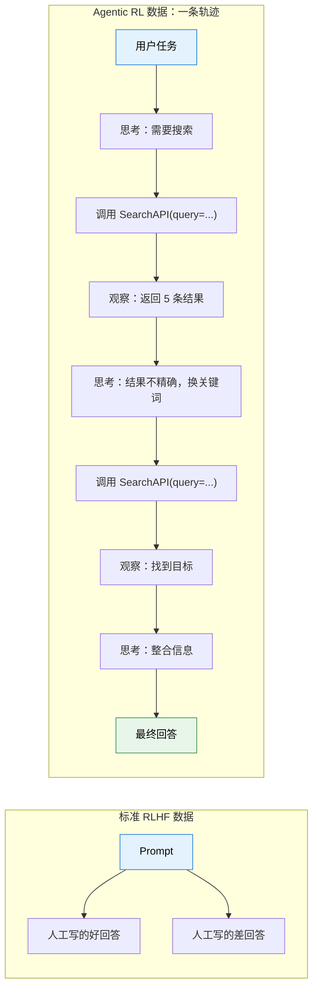
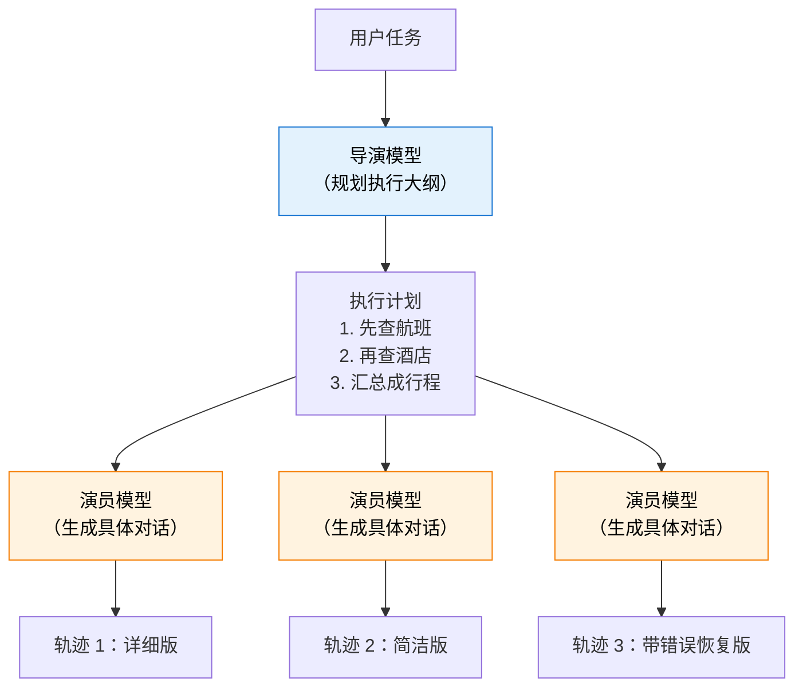
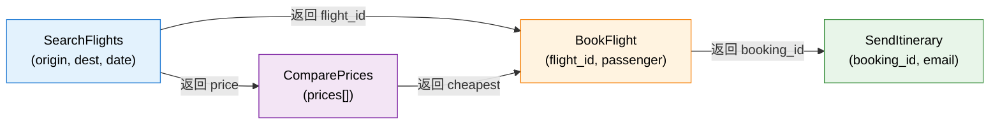
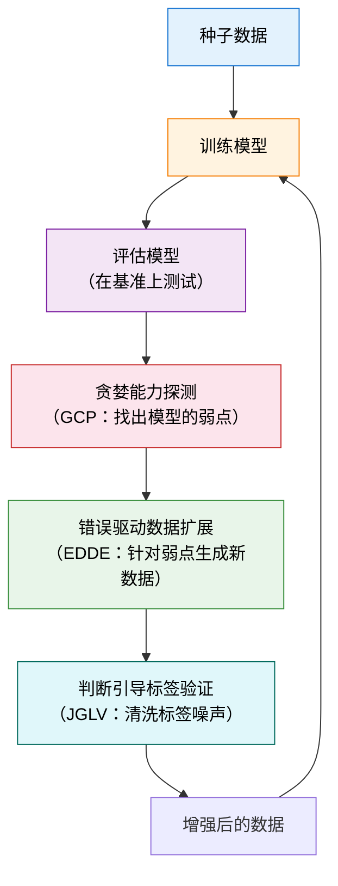
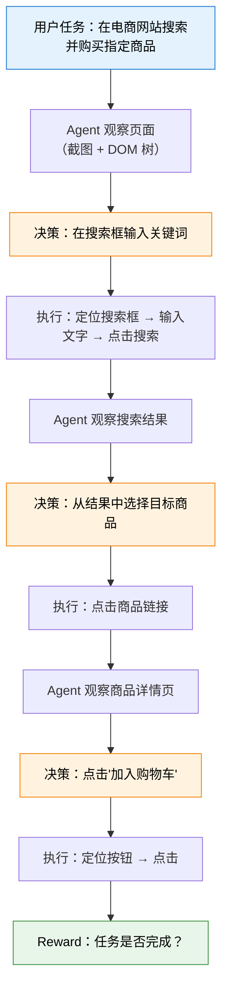
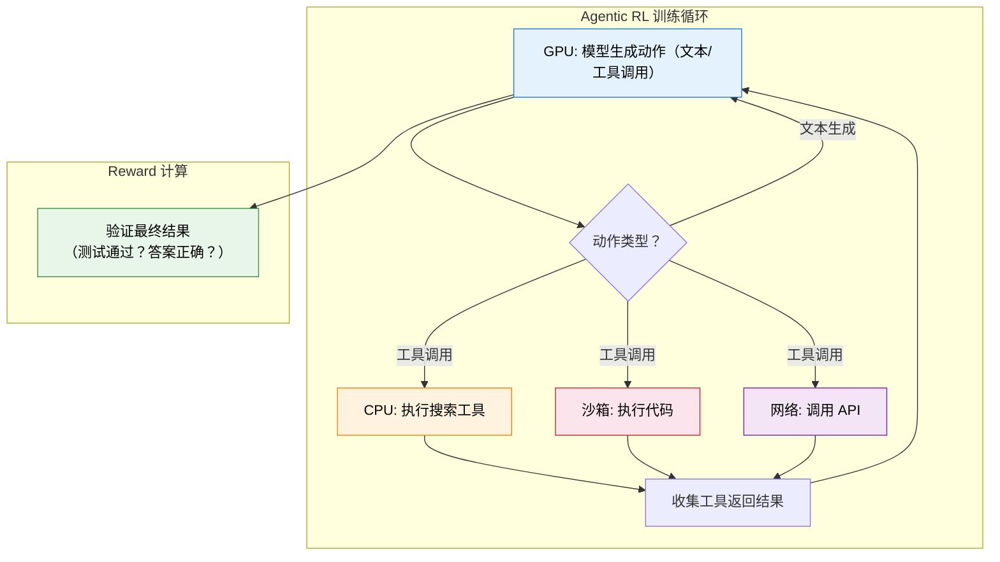
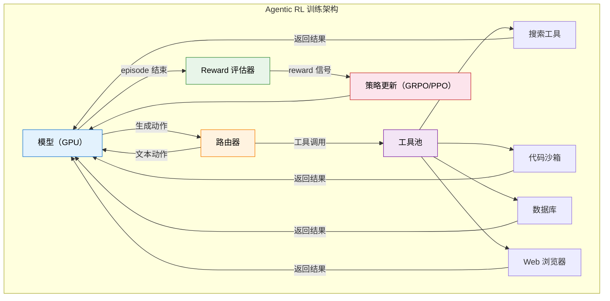

# 22.4 工具调用、轨迹合成与 Agentic 工程

本节把原来的“轨迹合成与数据工程”和“工具调用与 Agentic 工程”合并到同一条工程主线里：先解决训练数据从哪里来，再讨论模型如何学习工具调用策略，最后落到环境、沙箱、异步 rollout 和奖励设计这些真实训练系统会遇到的问题。

## 从哪里搞到训练数据

上一节我们拆解了多轮 RL 的信用分配问题。但在训练之前，还有一个更基本的问题：**数据从哪来？** 标准的 LLM RL（如第 9 章的 GRPO）只需要 prompt + 可验证答案，模型自己生成回答，自己对比，不需要外部数据。但 Agentic RL 不一样——模型需要和环境交互（调用工具、执行代码、浏览网页），这些交互产生的"轨迹"既是训练数据，也是 reward 的来源。高质量的轨迹决定了模型的上限。这一节我们来拆解 Agentic RL 的数据工程核心——轨迹合成。

### 为什么需要轨迹合成？

Agentic RL 的训练数据和标准 RLHF 截然不同。在 RLHF 中，数据是"人工写的好回答"和"人工标注的偏好对"。在 Agentic RL 中，数据是一条完整的**交互轨迹**——模型在多轮对话中的每一步思考、每一个工具调用、每一次观察结果。



人工写一条这样的轨迹，比写一个好回答要贵 10 倍以上——因为每一步都需要：(1) 思考模型应该怎么推理；(2) 构造合理的工具调用参数；(3) 模拟工具返回的结果；(4) 确保整条轨迹逻辑连贯。一条 7 轮的轨迹可能需要一个专家 30 分钟来编写。

这就引出了轨迹合成的核心动机：**用算法自动生成大量高质量的交互轨迹，替代昂贵的人工标注**。

### 六种主流合成方法

#### 拒绝采样——最朴素的方案

拒绝采样（Rejection Sampling）的思路极其直觉：让当前模型反复尝试同一个任务，只保留成功的轨迹作为训练数据。

```python
def rejection_sampling(model, task, tool_env, num_samples=64):
    """拒绝采样：生成多条轨迹，只保留成功的"""
    trajectories = []
    for _ in range(num_samples):
        traj = model.interact_with_tools(task, tool_env)
        if traj.final_success:  # 只保留成功的轨迹
            trajectories.append(traj)
    return trajectories

# 如果模型成功率只有 5%，采样 64 条只能得到约 3 条成功轨迹
# 而且这 3 条轨迹可能都是"同一种成功路径"，缺乏多样性
```

拒绝采样的优势是**实现简单**——你只需要一个能判断"成功/失败"的验证器。第 9 章的 RLVR 训练用的就是这种思路。

但它的劣势也很明显：**效率低、多样性差**。如果模型当前的成功率只有 5%，你需要采样 20 条才能得到 1 条成功轨迹。更严重的是，成功轨迹往往集中在"模型已经擅长的策略"上——那些模型没探索过的、可能更优的路径，在拒绝采样中永远不会出现。

#### 导演-演员模式——规划与执行分离

为了解决拒绝采样的多样性问题，研究者提出了"导演-演员"（Director-Actor）模式。核心思想是**将轨迹生成拆分为"宏观规划"和"微观执行"两个层级**。



导演模型负责理解任务目标，生成一个高层执行大纲（"先做 A，再做 B，最后做 C"）。演员模型根据大纲填充细节——生成具体的工具调用参数和自然语言响应。这种分离带来了两个好处：

**逻辑连贯性有保证**。导演模型确保大纲本身是合理的，演员只需要"照着演"。这比让一个模型同时负责规划和执行要稳定得多——就像电影里的导演和演员分工一样。

**同一大纲可以生成多条不同的轨迹**。改变演员模型（或改变采样温度），同一个"先查航班再查酒店"的大纲可以生成不同风格的轨迹。这增加了训练数据的多样性。

代表性工作包括 IBSEN[^ibsen]、CoDi 等框架。这种模式特别擅长模拟复杂的多步骤交互场景。

#### 基于图谱合成——Magnet[^magnet]

Magnet 的思路更加结构化。它把工具之间的调用关系建模为一个**函数签名图**（Function Signature Graph），然后通过图操作来生成逻辑严密的轨迹。

图的节点是工具的参数和返回值，边是数据流向。比如"搜索航班"工具的返回值包含"航班号"，而"预订机票"工具需要"航班号"作为输入——这两个工具之间就有一条边。



Magnet 定义了两种核心图操作：

**MAGNIFY**（放大）：选中图中的一个节点，展开其内部结构，生成更细粒度的调用链。比如把"搜索航班"展开为"构建查询 → 调用 API → 解析结果 → 过滤"。

**CONNECT**（连接）：在两个不直接相连的节点之间建立新的路径。这可以生成跨越多个工具的复杂调用链，比如"搜索航班 → 比较价格 → 预订最便宜的 → 发送行程"。

Magnet 的核心优势是**在源头保证工具调用的逻辑正确性**。基于图生成的路径一定是合法的（参数类型匹配、调用顺序合理），这比让 LLM 自由生成要可靠得多。基于该方法训练的 Magnet-14B 模型，在 BFCL-v3 和 ToolQuery 基准上超越了其教师模型。

#### 闭环迭代——LoopTool[^looptool]

LoopTool 是目前社区最活跃的轨迹合成框架。它解决的是前三种方法的一个共同缺陷：**生成的数据是"静态"的——不会根据模型的弱点来调整**。

LoopTool 的核心创新是一个**数据生成与模型训练紧密耦合的闭环**：



这个闭环包含三个关键模块：

**贪婪能力探测（GCP）**：让模型在测试集上运行，统计它在哪些能力维度上失败率最高。比如可能发现"处理可选参数"的成功率只有 30%，而"基本单工具调用"的成功率已经 90%。

**错误驱动数据扩展（EDDE）**：针对 GCP 发现的弱点，定向生成新的训练样本。如果模型在"处理可选参数"上表现差，EDDE 就生成大量包含可选参数的工具调用轨迹。

**判断引导标签验证（JGLV）**：用评判模型自动检查合成数据的标签是否正确，去除噪声。这一步很重要——合成数据不可避免会有错误标签（比如"应该调用工具 A 但标注成了工具 B"），如果不清洗就会误导训练。

LoopTool 的实验结果令人印象深刻：用 32B 的 Qwen3 作为数据生成器，训练出来的 8B 模型在 BFCL-v3 上**超越了 32B 的生成器本身**。这说明闭环迭代的数据质量可以远超静态合成。

#### 难度自适应——HardGen[^hardgen]

HardGen 专门解决合成数据"过于简单"的问题。它的核心洞察是：**模型能力的提升主要来自于困难样本**。简单的轨迹（比如只调一次工具就完成的任务）对模型训练的贡献很小。

HardGen 的流程是：先让模型尝试一批任务，收集失败案例。然后从失败案例中构建**动态 API 图谱**——分析模型在哪些工具组合、哪些参数类型上最容易失败。接着基于这个图谱生成高难度的轨迹，确保每条轨迹都触及模型的弱点。

实验表明，用 HardGen 数据训练的 4B 模型，性能超越了多个主流闭源大模型——这再次印证了"困难样本的价值远超简单样本"。

#### 后见之明重写——ECHO[^echo]

ECHO 的思路和第 11 章的 HER（事后经验回放）异曲同工：**失败轨迹不用扔掉——换个目标，它就是成功轨迹**。

在第 11.3 节中我们见过 HER：机器人的目标是"把球放到位置 A"，但实际放到了位置 B。从目标 A 的角度看这是失败的，但从目标 B 的角度看这是完美的成功。ECHO 把这个思路搬到了 LLM 轨迹上——先用 LLM 分析失败轨迹"实际上完成了什么"，然后把目标标签改为实际完成的目标，失败轨迹就被重写为针对新目标的成功案例。

这个方法极大提升了样本效率。在拒绝采样中，失败轨迹被直接丢弃。但如果模型当前成功率只有 10%，90% 的生成都被浪费了。ECHO 让这些"浪费"的轨迹重新变得有价值。结合第 11.3 节的讨论，我们可以把 ECHO 理解为"HER 在语言空间中的应用"——HER 改变的是机器人目标的位置标签，ECHO 改变的是语言任务的目标语义标签。

#### 端到端合成 与 ASTRA[^astra]

前面六种方法聚焦的都是"怎么生成高质量轨迹"。ASTRA 更进一步：它不仅合成多轮交互轨迹，还能把轨迹**自动打包成独立的、可验证的 RL 训练环境**。这意味着从"数据生成"到"环境搭建"全流程自动化——你只需要给定任务规格，ASTRA 就能输出一组可直接用于 GRPO/PPO 训练的（轨迹，环境）配对。这种端到端的思路特别适合需要快速构建新场景训练数据的工程场景。框架将 SFT 数据（合成轨迹）和 RL 环境（可验证竞技场）统一在同一管线中，官方已开源代码和环境。

### 六种方法对比

| 方法         | 核心思路                     | 多样性 | 质量  | 成本 | 代表工作       |
| ------------ | ---------------------------- | ------ | ----- | ---- | -------------- |
| 拒绝采样     | 生成 → 过滤 → 只留成功的     | 低     | 中    | 低   | GRPO、TinyZero |
| 导演-演员    | 规划与执行分离               | 中     | 高    | 中   | IBSEN、CoDi    |
| 图谱合成     | 基于工具关系图生成合法路径   | 高     | 极高  | 高   | Magnet         |
| 闭环迭代     | 训练 → 诊断弱点 → 针对性补强 | 自适应 | 最高  | 中   | LoopTool       |
| 难度自适应   | 从失败案例中定向生成困难样本 | 自适应 | 高    | 中   | HardGen        |
| 后见之明重写 | 失败轨迹换个目标变成成功轨迹 | 高     | 中-高 | 低   | ECHO           |

在实践中，**LoopTool 的闭环迭代思路是最推荐的**。它不需要你预先知道模型会犯什么错——系统会自动发现并补强。如果你资源有限，拒绝采样是最容易上手的起点。

### 轨迹质量控制 与 合成不是终点

无论用哪种方法生成轨迹，都需要**质量控制**。合成的数据不可避免会有噪声——错误的工具调用参数、逻辑不连贯的推理步骤、甚至"碰巧成功"的轨迹（走了最差的路但结果对了）。

质量控制通常包含三个维度：

**正确性**：工具调用的参数是否正确？调用顺序是否合理？这可以通过**自动验证器**检查——用静态分析工具检查参数类型，用执行器实际运行验证结果。

**多样性**：轨迹是否覆盖了不同的策略？如果 100 条轨迹都是"先搜索再总结"的同一种模式，模型就学不到"先分析再搜索"的替代策略。通常用**轨迹嵌入的聚类**来衡量——如果轨迹在嵌入空间中形成了多个聚类，说明覆盖了多种策略。

**难度分布**：数据集中简单/中等/困难样本的比例是否合理？太多简单样本会让模型"安逸"在已知策略上，太多困难样本又可能导致训练不稳定。一个好的分布通常是 30% 简单 + 50% 中等 + 20% 困难。

**步骤级校准**：除了过滤和排序，还有一种更精细的做法——**直接修正轨迹中不理想的步骤**。STeCa（Step-level Trajectory Calibration）[^steca] 的核心洞察是：一条大部分正确但个别步骤有瑕疵的轨迹，与其直接丢弃，不如找到那些不理想的步骤并修正它们。具体做法是通过步骤级奖励对比，识别轨迹中哪些步骤拉低了整体质量，然后用更强模型或规则来校准这些步骤。这比简单的"成功/失败"二分法精细得多——一条轨迹可能在 7 个步骤中有 6 个做得很好，只有第 4 步的搜索策略不够优。STeCa 会保留前 6 步，只校准第 4 步，最终得到一条比原始轨迹更优的校准轨迹。

```python
def filter_trajectories(trajectories, quality_threshold=0.7):
    """轨迹质量控制：过滤低质量合成数据"""
    filtered = []
    for traj in trajectories:
        # 1. 正确性检查：工具调用参数是否合法
        if not all(is_valid_call(call) for call in traj.tool_calls):
            continue

        # 2. 连贯性检查：相邻步骤之间是否有逻辑跳跃
        if not is_coherent(traj):
            continue

        # 3. 难度评估：是否过于简单（只有 1-2 步就完成）
        if len(traj.turns) < 2 and traj.success:
            continue  # 跳过过于简单的成功轨迹

        # 4. 综合质量分
        if traj.quality_score >= quality_threshold:
            filtered.append(traj)

    return filtered
```

### 轨迹合成与第 9 章的联系

你可能已经注意到，轨迹合成的很多思路和第 9 章的 RLVR 高度相关。RLVR 的核心是"用可验证的结果作为 reward"。轨迹合成把这个思路往前推了一步——不只把验证结果用于 reward，还用它来**筛选和生成更好的训练数据**。

具体来说，RLVR 在 Agentic RL 中的数据层面有三种用法：

1. **过滤**：生成大量轨迹，用 RLVR 的验证器筛掉不正确的（拒绝采样）
2. **排序**：对多条轨迹按 RLVR 信号排序，用排名来指导 GRPO 的组内比较
3. **诊断**：分析验证失败的轨迹，找出模型的系统性弱点，定向生成补强数据（LoopTool 的 GCP 模块）

这也解释了为什么 Agentic RL 被认为比 RLHF 更适合轨迹合成：RLHF 需要人工标注偏好，成本高且不可扩展；而 Agentic RL 的 reward 可以通过环境交互自动获取——代码是否通过测试、搜索结果是否包含目标信息——这些都可以自动化验证。

值得一提的是，轨迹合成不仅能从"已有数据"中提炼，还可以借助"搜索"来生成更高质量的轨迹。TSR（Trajectory-Search Rollouts）[^tsr] 的思路是把第 12 章将讨论的测试时搜索技巧——如束搜索（beam search）和 best-of-N——搬到训练阶段的 rollout 中。在生成轨迹时不是随机采样，而是用搜索策略探索多条路径，选出最高质量的轨迹作为训练数据。实验表明，将 TSR 与 PPO 或 GRPO 结合，能带来最高 15% 的性能提升。本质上，TSR 让训练时的数据生成也拥有了"思考"的能力——而不仅仅是随机探索。

<details>
<summary>思考题：拒绝采样生成的"成功轨迹"一定是好的训练数据吗？</summary>

不一定。拒绝采样保留了所有成功轨迹，但"成功"不等于"好策略"。

考虑这样一个场景：模型需要搜索一个事实性问题。模型用了一个非常低效的策略——先搜索了 5 次不相关的关键词，最后碰巧在第 6 次找到了答案。这条轨迹"成功了"，但它的前 5 次搜索完全是无用的。如果用它来训练模型，模型可能会学到"多搜索几次总能找到"的低效策略。

这就是为什么轨迹质量控制中的"效率评估"很重要——不只是看"最终是否成功"，还要看"成功的路径是否高效"。本节后半部分的 reward 设计会引入效率惩罚项，本质上就是在解决这个问题。

</details>

<details>
<summary>思考题：为什么 LoopTool 用 32B 模型生成的数据训练出来的 8B 模型，能超越 32B 的生成器？</summary>

这看起来违反直觉——"学生超越了老师"。关键在于 LoopTool 的闭环迭代机制。

32B 模型生成初始数据时，数据质量受限于模型自身的能力。但 LoopTool 不是一个"生成完就结束"的过程——它会诊断 8B 模型的弱点，针对性地补充数据。经过多轮迭代后，最终的数据集是"32B 模型的初始数据 + 针对 8B 弱点的多轮补强数据"的累积。这个累积数据集的质量可以远超 32B 模型单次生成的数据。

更深层的原因是：**生成数据和理解数据是两种不同的能力**。8B 模型虽然生成能力不如 32B，但它的学习能力和泛化能力可能不逊色——给它更好的训练数据，它就能发挥更大的潜力。这也是为什么"数据质量 > 模型规模"正在成为社区共识。

</details>

### 一个简易的轨迹合成管线

下面这段代码把拒绝采样和简单的质量控制组合起来，形成一个最基础的轨迹合成管线：

```python
from dataclasses import dataclass, field
from typing import List, Optional
import random

@dataclass
class Trajectory:
    """一条完整的交互轨迹"""
    task: str                          # 用户任务
    turns: List[dict] = field(default_factory=list)  # 每轮的 (思考, 动作, 观察)
    success: bool = False              # 最终是否成功
    num_tool_calls: int = 0            # 工具调用次数

def trajectory_synthesis_pipeline(
    model, tool_env, tasks, num_samples_per_task=16, quality_threshold=0.6
):
    """简易轨迹合成管线：拒绝采样 + 质量过滤"""
    all_trajectories = []

    for task in tasks:
        # 阶段 1：批量采样
        candidates = []
        for _ in range(num_samples_per_task):
            traj = model.interact_with_tools(task, tool_env)
            candidates.append(traj)

        # 阶段 2：拒绝采样——只保留成功轨迹
        success_trajs = [t for t in candidates if t.success]

        # 阶段 3：质量过滤
        for traj in success_trajs:
            # 效率检查：超过 8 次工具调用才成功 = 策略低效
            if traj.num_tool_calls > 8:
                continue

            # 多样性检查：与已有轨迹的重复度
            if not is_too_similar(traj, all_trajectories):
                traj.quality_score = compute_quality(traj)
                if traj.quality_score >= quality_threshold:
                    all_trajectories.append(traj)

    return all_trajectories

def is_too_similar(new_traj, existing_trajs, threshold=0.85):
    """检查新轨迹是否与已有轨迹过于相似（基于动作序列）"""
    new_actions = [t["action"] for t in new_traj.turns]
    for old_traj in existing_trajs:
        old_actions = [t["action"] for t in old_traj.turns]
        # 简化：用动作序列的 Jaccard 相似度
        overlap = len(set(new_actions) & set(old_actions))
        union = len(set(new_actions) | set(old_actions))
        if union > 0 and overlap / union > threshold:
            return True
    return False

def compute_quality(traj):
    """计算轨迹的综合质量分"""
    # 效率分：工具调用越少越好（鼓励高效策略）
    efficiency = max(0.0, 1.0 - 0.1 * traj.num_tool_calls)

    # 完整性分：每轮都有完整的 (思考, 动作, 观察)
    completeness = sum(
        1 for t in traj.turns
        if t.get("thought") and t.get("action") and t.get("observation")
    ) / max(len(traj.turns), 1)

    return 0.5 * efficiency + 0.5 * completeness
```

这个管线虽然简单，但包含了轨迹合成的核心环节：生成 → 过滤 → 质量控制。在实际工程中，你可以逐步把拒绝采样替换为 LoopTool 的闭环迭代，把简单的质量检查替换为更精细的验证器。

下面我们聚焦 Agentic RL 的另一个关键维度：工具调用 RL，看看模型怎么学会"什么时候该用工具、用什么工具"。

### 参考资料

[^ibsen]: Han S, Chen L, Lin L-M, et al. "[IBSEN: Director-Actor Agent Collaboration for Controllable and Interactive Drama Script Generation](https://arxiv.org/abs/2407.01093)." ACL 2024. —— 导演-演员模式的代表工作，将轨迹生成拆分为规划与执行两个层级。

[^magnet]: Yin F, Wang Z, Hsu I-H, et al. "[Magnet: Multi-turn Tool-use Data Synthesis and Distillation via Graph Translation](https://arxiv.org/abs/2503.07826)." ACL 2025. —— 基于函数签名图的轨迹合成，通过 MAGNIFY/CONNECT 图操作生成合法调用路径。

[^looptool]: LoopTool Team. "[LoopTool: Closing the Data-Training Loop for Robust LLM Tool Calls](https://arxiv.org/abs/2511.09148)." arXiv:2511.09148, 2025. —— 闭环迭代框架，用 GCP+JGLV+EDDE 三模块实现"模型驱动数据进化"。[GitHub](https://github.com/Rednote-DeepExperience/LoopTool)

[^hardgen]: Hao B, et al. "[From Failure to Mastery: Generating Hard Samples for Tool-use Agents](https://arxiv.org/abs/2601.01498)." arXiv:2601.01498, 2026. —— 从模型失败案例中定向生成高难度训练数据。[数据集](https://huggingface.co/datasets/Bingguang/HardGen)

[^echo]: Hu B, et al. "[Sample-Efficient Online Learning in LM Agents via Hindsight Trajectory Rewriting](https://arxiv.org/abs/2510.10304)." arXiv:2510.10304, 2025. —— ECHO：借鉴 HER 的后见之明经验回放，将失败轨迹重写为针对其他目标的成功案例，极大提升样本效率。

[^astra]: Tian X, Wang H, et al. "[ASTRA: Automated Synthesis of agentic Trajectories and Reinforcement Arenas](https://arxiv.org/abs/2601.21558)." arXiv:2601.21558, 2026. —— 端到端框架：自动合成多轮交互轨迹并打包为可验证 RL 环境。[GitHub](https://github.com/LianjiaTech/astra)

[^tsr]: Djuhera A, Kadhe S, et al. "[TSR: Trajectory-Search Rollouts for Multi-Turn RL of LLM Agents](https://arxiv.org/abs/2602.11767)." arXiv:2602.11767, 2026. —— 将测试时搜索（束搜索、best-of-N）搬到训练阶段 rollout，最高 15% 性能提升。

[^steca]: Wang H, Wang J, et al. "[STeCa: Step-level Trajectory Calibration for LLM Agent Learning](https://arxiv.org/abs/2502.14276)." ACL 2025 Findings. —— 通过步骤级奖励对比识别并修正轨迹中的不理想动作，而非简单过滤。[GitHub](https://github.com/WangHanLinHenry/STeCa)

---

## 工具调用 RL 与 Web Agent 与 Code Agent

上一节我们拆解了多轮 RL 的信用分配问题——7 轮交互失败了，该怪谁。现在我们聚焦另一个关键问题：模型怎么学会"使用工具"？监督微调（SFT）可以教会模型"工具调用的 JSON 格式长什么样"，但教不会它"什么时候该调用工具、调哪个工具、怎么组合多个工具"。后者需要策略性的决策能力——而这正是 RL 擅长的。

### 为什么 RL 对工具调用至关重要？

想象你在训练一个模型帮用户做数据分析。SFT 阶段你给它看了上千个"正确调用工具"的示例，模型学会了：

```json
{ "tool": "sql_query", "query": "SELECT * FROM users WHERE age > 30" }
```

它学会了这个格式。但到了实际使用时，模型面临的是策略性的决策：

- 用户问"我们的高端用户有多少"，模型需要决定：是直接查数据库？还是先搜索内部文档了解"高端用户"的定义？
- 查完数据库后发现有 10 万条记录，模型需要决定：是进一步筛选？还是做聚合统计？
- 聚合后发现数据异常，模型需要决定：是报告异常？还是尝试其他查询方式？

这些决策没有"标准答案"——不同的策略可能导致不同的结果，而 SFT 只能教模型模仿专家的轨迹，无法教它探索更优的策略。RL 的优势在于：你只需要告诉模型"最终结果对不对"，模型自己会通过试错学到"什么时候该用什么工具"。

|          | SFT                        | RL                                     |
| -------- | -------------------------- | -------------------------------------- |
| 学什么   | 工具调用的语法格式         | 何时调用、调哪个、如何组合             |
| 训练数据 | 需要人工标注的工具调用轨迹 | 只需要最终结果（成功/失败）作为 reward |
| 泛化能力 | 只能处理见过的工具组合     | 能探索新的工具使用策略                 |
| 错误恢复 | 不会教模型从错误中恢复     | 模型通过试错学会修复策略               |
| 代表工作 | Toolformer[^toolformer]    | ReTool、VERL-TOOL、ToolRL              |

### 核心方法

#### ReTool 与 推理中调用工具[^retool]

ReTool（Reasoning with Tools）的思路是让模型在推理过程中**自由地**调用工具，而不是预先决定"什么时候调用"。模型在生成回答的过程中，随时可以"暂停"文本生成，调用一个工具（比如计算器或代码解释器），拿到结果后继续生成。

RL 的作用是优化"何时调用工具"的策略。模型可能发现：对于简单的算术题，直接口算比调用计算器更快；但对于复杂的数值计算，调用计算器更准确。这种"因地制宜"的策略，SFT 很难教会，RL 可以通过 reward 信号让模型自己摸索出来。

#### VERL-TOOL 与 跨领域工具调用[^verltool]

VERL-TOOL 是一个跨领域的工具调用 RL 训练框架，覆盖数学推理、SQL 生成、Web 搜索、软件工程等多种场景。它的关键创新是**统一的工具调用接口**——不同领域的工具（计算器、数据库、搜索引擎）被抽象为统一的 RL 动作空间，可以用同一套 RL 算法训练。

#### MCP-RL 与 把工具协议变成训练环境[^mcp_intro][^mcp_tools][^mcprl]

从另一个角度看，工具调用 RL 还有一个容易被低估的问题：工具本身太分散。搜索工具有一套接口，数据库工具有一套接口，文件系统工具又有另一套接口。对产品工程来说，这已经很麻烦；对 RL 训练来说，问题更严重。因为训练系统不仅要知道"有哪些工具"，还要知道每个工具的参数 schema、返回格式、错误状态、权限边界，以及一次工具调用在轨迹里应该如何记录。

这正是 MCP（Model Context Protocol）适合进入 Agentic RL 教材的原因。MCP 本身不是 RL 算法，它更像是**工具环境的标准接口层**：服务器向模型暴露 tools、resources 和 prompts，工具通过 `tools/list` 被发现，通过 `tools/call` 被调用，每个工具带有名称、描述、输入 schema 和可选输出 schema。换句话说，MCP 把"外部世界能做什么"整理成模型和训练系统都能读取的结构化动作空间。

把 MCP 放进 RL 训练循环后，MDP 的几个元素会变得更清楚：

| RL 元素    | MCP-RL 中的对应物                                          |
| ---------- | ---------------------------------------------------------- |
| 状态 $s_t$ | 当前对话、已观测到的工具结果、可用 MCP server 与工具列表   |
| 动作 $a_t$ | 继续生成文本，或选择某个 MCP tool 并填写 JSON 参数         |
| 环境转移   | MCP server 执行工具，返回文本、结构化内容、图片或资源链接  |
| 轨迹记录   | 模型输出、`tools/call` 参数、工具返回、错误与耗时          |
| reward     | 任务是否完成、工具选择是否合理、参数是否正确、调用是否高效 |

这张表背后的意思是：MCP 让工具调用从"一堆工程胶水代码"变成了"可以被 RL 系统观察和优化的环境接口"。在普通应用里，工具调用失败可能只是一次报错；在 RL 训练里，它会成为轨迹的一部分，影响 reward，也影响下一次策略更新。模型调用了不存在的工具、填错了参数、重复调用同一个低价值工具，或者在工具返回已经足够时仍然继续搜索，这些都可以被记录下来，变成训练信号。

换个角度看，如果没有统一协议，每接入一个新工具，训练系统都要单独写解析器、执行器和日志格式。这样训练出来的策略很容易只适配某个固定工具集，一换环境就失效。MCP 的价值在于把"工具描述"前置成结构化信息：模型看到的不只是一个自然语言提示，而是带 schema 的动作候选集。这样一来，训练目标就不再只是"模仿某个工具调用格式"，而是学会在一组可发现的动作里做选择。

这也会改变我们对轨迹数据的理解。普通 LLM 轨迹主要是 token 序列；MCP-RL 的轨迹更像一份结构化执行日志：第几轮发现了哪些工具，选择了哪个工具，参数是否合法，工具返回了什么，是否超时，最终任务有没有完成。训练时，工具返回本身通常不应该参与模型 loss，真正要强化的是模型生成的决策 token：为什么选这个工具，为什么填这些参数，为什么在这个时刻停止。这个处理方式和前面 SearchR1、Code Agent 中的 loss mask 是同一类问题。

OpenPipe 的 MCP-RL 文章给出了一个很直观的训练管线：先从 MCP server 自动发现工具，再根据工具列表生成训练场景；同一个场景采样多条 agent 轨迹；用 RULER 这类 LLM-as-judge 相对评分方法比较轨迹质量；最后用 GRPO 更新模型。这里的关键不在于"又发明了一个新算法"，而在于 MCP 让不同工具服务器可以被同一个训练流程接入。今天训练数据库 agent，明天换成文件管理 agent 或天气 agent，训练代码的大框架可以保持不变。

这条管线特别适合教学，因为它把 Agentic RL 的几个环节连成了一条线。MCP 负责给出动作空间，场景生成负责构造任务分布，多条 rollout 负责提供探索，RULER 或其他 reward 方法负责比较轨迹好坏，GRPO 负责把相对好坏转成策略更新。这一步真正说明的是：协议层、数据层、奖励层和算法层各司其职。只要这四层没有分清，很多讨论就会混在一起，比如把"工具接入方便"误认为"模型已经学会用工具"，或者把"工具调用成功"误认为"策略是最优的"。

不过，MCP-RL 也提醒我们一个重要边界：**标准化接口不等于解决安全和奖励问题**。MCP 规范明确指出，工具可能代表任意代码执行或数据访问，客户端需要处理用户授权、隐私和工具安全。放到 RL 训练里，这一点更关键。模型会为了 reward 探索工具调用，如果训练环境没有沙箱、权限隔离、请求缓存和审计日志，MCP 只会让工具接入更方便，却不会自动让探索过程更安全。

还有一个更细的边界：MCP 能标准化"怎样调用工具"，但不能自动定义"什么叫调用得好"。同一个 `search` 工具，问事实核查时应该鼓励多源交叉验证；问简单日期时应该惩罚过度搜索；问代码问题时搜索结果还要和本地测试结果结合。也就是说，MCP 提供的是动作接口，reward 仍然要由任务语义决定。真正的问题是：工具越容易接入，越需要认真设计 reward，否则模型可能学会的不是"更会解决问题"，而是"更会利用工具接口拿分"。

因此，把 MCP 加入本章内容时，最合适的定位是：它是 Agentic RL 的**环境抽象与工具协议层**。PPO、GRPO、GSPO 仍然负责策略优化；RLVR、RULER 或 PRM 仍然负责奖励；MCP 负责把外部工具整理成可发现、可调用、可记录的环境接口。这个分工一旦建立，读者就能看懂为什么"训练会用工具的 agent"不只是模型问题，也是协议、环境和评估问题。

#### ToolRL 与 工具作为 RL 动作[^toolrl]

ToolRL 将工具调用视为 RL 中的一个**特殊动作**，扩展策略的动作空间。标准 LLM 的动作空间是词汇表（几万个 token），ToolRL 在此基础上增加了"调用工具 A"、"调用工具 B"等动作。策略网络需要在"生成文本"和"调用工具"之间做出选择。

```python
class ToolAugmentedPolicy(nn.Module):
    """工具增强的策略网络：在文本生成和工具调用之间做选择"""

    def __init__(self, base_model, tools):
        super().__init__()
        self.base_model = base_model  # 基座 LLM
        self.tools = tools             # 可用工具列表

    def forward(self, state):
        """
        给定当前状态（对话历史 + 工具返回结果），
        决定下一步是生成文本还是调用工具
        """
        # 基座模型输出 logits
        logits = self.base_model(state)

        # 检测特殊的"工具调用 token"
        # 如果模型选择了工具调用 token，则解析参数并执行
        if self._is_tool_call(logits):
            tool_name, tool_args = self._parse_tool_call(logits)
            return ToolAction(tool_name, tool_args)
        else:
            return TextAction(logits)  # 正常文本生成
```

### 场景决定 Reward

工具调用的 reward 不像偏好对齐那样主观——它可以根据客观信号来设计。这实际上就是第 9 章提到的 **RLVR（Reinforcement Learning from Verifiable Rewards）** 在 Agentic 场景的直接应用。

| 场景     | Reward 来源            | 类型                | 特殊考量                |
| -------- | ---------------------- | ------------------- | ----------------------- |
| 代码生成 | 单元测试通过率         | 连续（0-1）         | 部分通过也有部分 reward |
| 数学推理 | 最终答案是否正确       | 二元（0/1）         | 中间步骤可用 PRM        |
| Web 搜索 | 是否找到正确答案       | 二元 + 路径效率惩罚 | 鼓励更少的搜索轮次      |
| SQL 生成 | 查询结果是否匹配预期   | 二元 + 执行时间惩罚 | 避免生成低效查询        |
| 数据分析 | 分析结论是否正确且完整 | 多维评分            | 同时评估准确性和可读性  |

一个值得注意的模式：很多 Agentic 场景的 reward 都包含**效率惩罚**。这不只为了让模型更快，更因为每次工具调用都有成本（API 费用、延迟、资源消耗）。一个好的 Agent 不只是"能完成任务"，还要"高效地完成任务"。

形式化地，工具调用 RL 的总 reward 可以表示为：

$$R_{\text{total}} = R_{\text{task}} - \lambda_{\text{efficiency}} \cdot T - \lambda_{\text{format}} \cdot \mathbb{1}(\text{format error})$$

其中 $R_{\text{task}}$ 是任务完成奖励（0 或 1），$T$ 是使用的交互轮数，$\lambda_{\text{efficiency}}$ 是效率惩罚系数，$\lambda_{\text{format}}$ 是格式错误惩罚。这个公式把"成功完成任务"和"高效完成任务"统一到了一个 reward 信号中。

```python
def compute_agent_reward(task_success, num_turns, max_turns=10):
    """计算 Agentic RL 的综合 reward"""
    # 任务完成的基础 reward
    success_reward = 1.0 if task_success else 0.0

    # 效率惩罚：使用轮次越多，惩罚越大
    efficiency_penalty = -0.1 * (num_turns / max_turns)

    # 工具调用格式错误的额外惩罚
    # （如果模型生成了无法解析的工具调用）
    format_penalty = -0.5 if has_format_error else 0.0

    return success_reward + efficiency_penalty + format_penalty
```

### Web Agent RL 与 教模型上网

Web Agent 是 Agentic RL 最直观的应用之一：训练一个能够浏览网页、填写表单、搜索信息的智能体。这听起来简单，实现起来却充满了挑战。

**动作空间**。Web Agent 的动作不是"生成文本"，而是浏览器级别的操作：点击某个元素、在输入框中输入文字、滚动页面、导航到新 URL。每个动作都需要精确定位目标元素——这通常通过坐标（x, y）或 DOM 元素 ID 来实现。

**状态空间**。Web Agent 接收的状态通常是两部分：页面截图（视觉信息）和 DOM 树（结构信息）。截图提供了视觉布局，DOM 树提供了精确的元素定位。两者缺一不可——仅用截图很难精确点击小按钮，仅用 DOM 树又无法理解视觉布局。

**奖励信号**。Web Agent 的 reward 基于任务完成度。比如"在携程上预订一张明天北京到上海的机票"，reward 取决于：是否找到了正确的航班？是否成功填写了所有信息？是否提交了订单？



Web Agent RL 的主要挑战是状态空间的巨大规模和动态性。一个网页可能有上千个 DOM 元素，页面内容会动态加载，同一个网站在不同时间的布局可能不同。这意味着 Agent 需要强大的泛化能力——不能记住"某个按钮在屏幕左上角"，而是要理解"提交按钮通常长什么样"。

#### ReLook 与 用眼睛给网页打分[^relook]

现有的 Web Agent reward 主要依赖 DOM 结构匹配或任务完成度的二元判断。ReLook 引入了一种全新的 reward 来源——**视觉反馈**。它的工作流程是：Agent 生成网页代码 → 渲染成截图 → 用多模态 LLM 对截图进行视觉评分 → 将视觉评分作为 RL 的 reward 信号。这种"看到效果再打分"的方式，比纯文本 reward 更符合人类对"好网页"的判断——毕竟用户看到的是渲染后的页面，不是源代码。

#### Agent Workflow Memory 与 从经验中学习工作流[^awm]

Agent Workflow Memory（AWM）解决的是 Web Agent 的**记忆**问题。AWM 从 Agent 过去的成功经验中抽取可复用的工作流（workflow），并在未来的任务中主动提供相关的工作流来指导 Agent 的行动。比如，Agent 在多次购物任务中学到了"先搜索 → 加购物车 → 填写地址 → 支付"这个通用流程，AWM 就会把这个工作流存储起来，下次遇到类似的购物任务时自动激活。AWM 在 WebArena 和 Mind2Web 上的实验表明，这种"从经验中学习"的方式显著提升了 Agent 在新网站上的泛化能力。

#### Web-Shepherd 与 专为网页导航打造的 PRM[^webshepherd2]

上一节我们提到 Web-Shepherd 作为 PRM 在真实场景的落地案例。这里我们更详细地讨论它在 Web Agent 中的具体应用。传统的 Web Agent reward 只有"任务最终是否完成"这一个信号。Web-Shepherd 在每一步操作后都给出一个评分——"这次点击是不是对的？""这个表单填得对不对？"。它用结构化的检查清单（checklist）来引导评估，配合 4 万条标注数据训练出的专用 PRM，评估成本仅为 GPT-4o-mini 做判官的 1/10。这让 Web Agent 的训练可以用更密集的步骤级 reward 来替代稀疏的 episode 级 reward，训练效率和最终性能都大幅提升。

### Code Agent RL 与 写代码、调试、迭代

Code Agent RL 训练的是能够**写代码、执行代码、阅读报错、修复代码**的智能体。这比 Web Agent 更接近"真实程序员"的工作方式——不是一次性写出完美代码，而是通过"写 → 执行 → 报错 → 修复"的循环迭代来完成任务。

Code Agent 的 RL 训练有一个天然的优势：**reward 非常明确**。代码要么通过所有单元测试（reward = 1），要么不通过（reward < 1，按通过率给部分分）。这比 Web Agent 的"任务完成度"更容易量化和自动化。

```python
def code_agent_reward(generated_code, test_cases):
    """Code Agent 的 reward：基于测试通过率"""
    results = []
    for test_input, expected_output in test_cases:
        try:
            # 在沙箱中执行生成的代码
            actual_output = execute_in_sandbox(generated_code, test_input)
            results.append(actual_output == expected_output)
        except Exception:
            results.append(False)  # 执行异常 = 测试不通过

    # 基础 reward = 通过率
    pass_rate = sum(results) / len(results)

    # 额外奖励：代码简洁性（越短越好，但有最低要求）
    # 额外惩罚：执行时间过长
    return pass_rate
```

Code Agent RL 的一个关键发现来自 ICML 2025 的研究：**单步 reward 可以有效引导多轮代码生成**。也就是说，你不需要对每一轮的"写代码 → 执行 → 报错 → 修复"过程都给 reward——只需要给最终代码是否通过测试这一个信号，模型就能学会"写出正确的代码 → 修复错误"的完整策略。这和上一节的 ORM 思路一致——如果 reward 足够明确，稀疏信号也能工作。

#### rStar2-Agent 与 14B 打败 671B 的实战标杆[^rstar2]

如果说前面的讨论还在讲"理论上的可行性"，那么 rStar2-Agent 就是最有力的实战证明。微软训练的这个 14B 参数模型，在 64 张 AMD MI300X GPU 上用**仅 510 步 RL 训练**，就在 AIME24 数学竞赛上达到了 80.6% 的准确率——超越了 671B 参数的 DeepSeek-R1。

rStar2-Agent 的核心创新是 **GRPO-RoC**（Group Relative Policy Optimization with Resampling on Correct）算法。传统 GRPO 在组内采样后只做一次比较，而 GRPO-RoC 会**对正确的轨迹做重采样**——如果模型在某条轨迹上成功了，就在这条成功轨迹的基础上继续探索，看能不能找到更好的路径。这比单纯的组内比较提供了更精细的学习信号。

这个结果有两个重要 insight：(1) **Agentic RL 的训练效率远超预期**——510 步 RL 训练就能超越约 48 倍大的模型（671B vs 14B），说明 RL 的数据效率在大模型上非常高；(2) **小模型 + RL 可以打败大模型 + SFT**，关键在于 RL 让模型学会了"如何有效地使用工具和推理策略"，而不仅仅是模仿专家行为。

#### Agnostics 与 任何语言都能做代码 RL[^agnostics]

现有的 Code Agent RL 几乎都默认用 Python 做代码执行和验证。Agnostics 打破了这个限制：通过一个**语言无关的代码执行验证器**，它可以对任何编程语言做 RL 训练。验证器的工作流很简单：从模型输出中提取代码 → 编译（如果需要）→ 执行 → 对比结果。无论代码是 Python、Rust、Go 还是 SQL，验证器都一视同仁。这意味着你可以用同一套 RL 框架，训练一个"什么语言都会写"的代码模型——而不需要为每种语言单独设计训练管线。代码、数据和配置均已开源。

#### 不执行也能评分 与 Agentic Code Reasoning[^agcodereason]

到目前为止，所有 Code Agent RL 的 reward 都依赖**代码执行**——运行代码，看结果对不对。但 Meta 的研究表明，还有一种更优雅的方式：**让模型在不执行代码的情况下推理出代码的行为**。这种方法叫"半形式化推理"（Semi-Formal Reasoning）：模型需要显式列出前提、追踪每条执行路径、写出形式化的结论——就像数学证明一样，不能跳步，不能含糊。

这种方法在真实世界的补丁验证上达到了 93% 的准确率。它的核心价值在于：**不需要沙箱，不需要执行环境，没有安全风险**。你可以把它理解为 Code Agent RL 的"低成本替代方案"——如果 reward 信号只需要"这段代码大概是对的还是错的"，半形式化推理就够了；如果需要精确的输出匹配，还是得老老实实执行代码。

#### 代码自举的 Scaling Law[^zeroscaling]

第 12 章会系统讨论标准 RL 的 Scaling Law——更多训练步数，往往带来更强推理能力。Agentic RL 领域也有自己的 Scaling Law。ZeroTIR 方法让模型在**没有监督示例**的情况下，自发学会生成和执行代码来辅助推理。研究者发现了一个可预测的关系：训练步数与代码执行频率、最终准确率之间存在**幂律关系**。这意味着你可以在训练早期就预测出最终模型的表现——如果训练了 100 步后代码执行频率还在上升，说明模型还在持续学习，可以继续训练；如果频率已经趋于平稳，说明学习接近饱和，可以提前停止。

这个发现对工程实践非常重要：它给了你一个**免费的训练进度指示器**——不需要跑完整个训练，只需监控代码执行频率就能判断"该不该继续训"。ZeroTIR 被 NeurIPS 2025 收录。

<details>
<summary>思考题：Web Agent 和 Code Agent 的 reward 设计有什么本质区别？这对 RL 训练策略有什么影响？</summary>

Web Agent 的 reward 通常是**二元且不可分**的——要么任务完成了，要么没完成，中间状态很难量化。这导致 reward 信号极度稀疏，训练难度大。

Code Agent 的 reward 是**可分的**——10 个单元测试过了 7 个，reward = 0.7。这种连续的 reward 信号让训练更容易：即使代码不完全正确，模型也能得到"方向对了"的信号。这就是为什么 Code Agent RL 的进展比 Web Agent RL 快得多。

对训练策略的影响是：Web Agent RL 更需要 PRM（每步评估）来提供密集信号，而 Code Agent RL 用 ORM（只看最终测试结果）就能取得不错的效果。

</details>

### 搜索工具 RL 与 SearchR1 与搜索增强推理

前面讨论的 Web Agent 和 Code Agent 各有侧重，但有一个工具场景特别重要、也特别有挑战性：**搜索引擎**。搜索和计算器、数据库等工具不同——搜索返回的结果是开放式的、非结构化的，而且"好"的搜索策略极度依赖上下文。问"GRPO 和 PPO 的区别"时，模型不需要搜索；但问"2025 年诺贝尔物理学奖得主是谁"时，模型必须搜索——内部知识可能已经过时。

2025 年，SearchR1[^searchr1]（Jin et al.）开创性地将 RL 引入搜索工具训练，让模型**自主学习何时搜索、搜什么、怎么用搜索结果**。随后 ReSearch[^research]、ToRL[^torl] 等工作从不同角度推进了这一方向。

#### 为什么 prompting 不够？

在 SearchR1 之前，主流做法是通过 prompting 教模型"你可以在推理过程中调用搜索引擎"。ReAct[^react]、Self-RAG[^selfrag] 等方法都走这条路。但 prompting 有三个根本局限：

**搜索时机判断无法穷举。** 你可以在 prompt 里写"当知识不确定时搜索"，但什么是"不确定"？模型可能对过时信息充满信心（不知道自己不知道），也可能对显而易见的常识过度搜索。

**搜索 query 的策略性无法模仿。** 面对"比较三个量子计算平台的最新性能数据"这种任务，搜索策略需要根据前一次搜索的结果动态调整——第一次搜"quantum computing benchmark 2025"发现太宽泛，第二次改为"IBM quantum advantage vs Google Sycamore 2025"。这种**自适应查询生成**是策略学习问题，不是语言建模问题。

**多轮搜索的长期优化。** 一个复杂任务可能需要 5-10 次搜索。过早停止 = 信息不足，过晚停止 = 资源浪费。这个 trade-off 恰恰是 RL 的用武之地。

#### SearchR1 的 MDP 建模

SearchR1 将搜索增强推理建模为一个特殊的 MDP：

- **状态 $s_t$**：当前推理上下文（已生成文本 + 之前的搜索结果）
- **动作 $a_t$**：两类——(1) 继续生成 token，(2) 生成搜索 query 并触发搜索（通过 `<search>...</search>` 标记）
- **转移**：搜索动作触发搜索引擎，结果被追加到上下文中
- **奖励**：基于最终答案正确性（RLVR）+ 搜索效率惩罚

```
推理 + 搜索的交互过程：

用户: "2025 年图灵奖颁给了谁？"

模型推理: "这个问题涉及 2025 年的最新信息，我需要搜索一下。"
模型动作: <search>2025 Turing Award winner</search>
搜索返回: "The 2025 ACM Turing Award was given to..."
模型推理: "现在信息充足了。"
最终答案: [完整答案]

Reward: 答案正确性 - λ × 搜索次数
```

训练使用 GRPO 的组采样 + 组内比较。关键设计：搜索返回的文本在 loss 中被 **mask 掉**——模型不应因为搜索引擎返回了好结果而被强化。搜索行为从 RL 训练中**自发涌现**——即使 SFT 没有教过搜索，模型也会逐渐学会在合适时机触发搜索。

#### SearchR1 的关键发现

- **搜索行为从 RL 中涌现**。RL 不仅能优化已知策略，还能发现新策略
- **搜索频率的 Scaling Law**。训练步数越多，模型在需要搜索的问题上搜索频率上升，在不需要搜索的问题上搜索频率下降——模型学会了区分两种场景
- **泛化到未见过的搜索场景**。在数学问题上训练的搜索策略能泛化到历史、科学问题

#### SearchR1 之后

| 工作                       | 核心创新                                                 | 引用         |
| -------------------------- | -------------------------------------------------------- | ------------ |
| **SearchR1 **[^searchr1]   | RL 训练模型自主搜索，GRPO + RLVR                         | 819          |
| **ReSearch **[^research]   | 推理与搜索深度融合，每步推理可包含搜索策略反思           | —            |
| **ToRL **[^torl]           | 扩展到计算工具（代码执行器），发现工具使用的 Scaling Law | 131          |
| **ReTool **[^retool]       | 区分推理型 vs 计算型任务，RL 让模型策略性选择工具        | 247          |
| **ZeroTIR **[^zeroscaling] | 无监督示例下模型自发学会代码执行，幂律 Scaling Law       | NeurIPS 2025 |

ToRL[^torl] 训练的 32B 模型在数学推理上超越了不使用工具的 70B 模型，证明了"小模型 + 工具 > 大模型纯推理"。ReTool[^retool] 进一步让模型学会策略性的工具选择——不是所有问题都需要工具，而是根据问题特征动态决定。

```python
def search_reward(answer, ground_truth, num_searches, max_searches=5):
    """搜索 RL 的 reward 函数"""
    correctness = 1.0 if verify_answer(answer, ground_truth) else 0.0
    efficiency_penalty = -0.05 * num_searches  # 搜索成本惩罚
    return correctness + efficiency_penalty
```

### 工具调用策略的训练流程

把上面的概念串起来，一个完整的工具调用 RL 训练流程通常包含三个阶段：

**阶段一：SFT 教格式。** 用人类标注的工具调用轨迹做监督微调，教会模型"工具调用的 JSON 格式长什么样"。这一步不涉及策略优化——模型只是学会了如何正确地格式化一个工具调用请求。

**阶段二：RL 教策略。** 在 SFT 模型的基础上，用 RL 优化工具使用的策略。模型开始探索不同的工具使用方式——有时候该调工具却不调，有时候不该调却调了。Reward 信号（任务成功/失败）告诉模型哪种策略更好。

**阶段三：迭代优化。** 随着 RL 训练的进行，模型会发现自己策略中的弱点——比如"在某些场景下总是忘记先搜索再回答"。这些弱点可以通过增加针对性的训练数据来修复，形成一个持续改进的循环。

```python
# 简化的工具调用 RL 训练循环
def tool_rl_training_loop(
    model, tool_env, tasks, num_epochs=100, group_size=4
):
    """工具调用 RL 的核心训练循环（简化版）"""
    optimizer = torch.optim.Adam(model.parameters(), lr=1e-6)

    for epoch in range(num_epochs):
        for task in tasks:
            # 生成多条轨迹（group sampling，类似 GRPO）
            trajectories = []
            for _ in range(group_size):
                traj = model.interact_with_tools(task, tool_env)
                trajectories.append(traj)

            # 计算每条轨迹的 reward
            rewards = [compute_agent_reward(t.success, t.num_turns) for t in trajectories]

            # 组内比较（GRPO 思路）：用相对排名来计算 advantage
            mean_reward = np.mean(rewards)
            std_reward = np.std(rewards) + 1e-8
            advantages = [(r - mean_reward) / std_reward for r in rewards]

            # 策略梯度更新
            for traj, advantage in zip(trajectories, advantages):
                loss = traj.total_log_prob * (-advantage)  # 策略梯度
                loss.backward()

            optimizer.step()
            optimizer.zero_grad()
```

注意这个训练循环的核心思路和第 9 章的 GRPO 非常相似——都是"组内采样多条轨迹，用相对比较来计算 advantage"。区别在于：GRPO 比较的是多条文本回答，这里比较的是多条工具调用轨迹。

### 与 RLVR 的联系

你可能已经注意到，工具调用 RL 的 reward 设计和第 9 章的 RLVR 非常相似。这不是巧合——**Agentic RL 就是 RLVR 在多轮交互场景的自然延伸**。RLVR 的核心思想是"用可验证的结果作为 reward，不需要训练 Reward Model"。在工具调用场景中，工具的执行结果天然就是可验证的：代码是否通过测试、SQL 查询结果是否正确、搜索结果是否包含目标信息——这些都可以自动化验证，不需要人工标注。

这也是为什么 Agentic RL 被认为比偏好对齐（RLHF/DPO）更适合 Agent 训练的原因之一：偏好对齐需要训练一个 Reward Model 来模拟人类偏好，而 Agent 的任务通常有客观的评判标准，直接用可验证奖励就可以了。

<details>
<summary>思考题：SFT 教格式 + RL 教策略的两阶段范式，和第 2 章的 DPO 有什么异同？</summary>

相同之处在于两者都是"先 SFT 再 RL"——先用监督学习教模型基本的格式和能力，再用 RL 优化策略。这是大模型训练的通用范式。

不同之处在于目标：DPO 的 RL 阶段优化的是"回答的偏好排序"（人类更喜欢哪个回答），而工具调用 RL 的 RL 阶段优化的是"工具使用策略"（什么时候该用什么工具）。前者需要 Reward Model（或隐式的偏好模型），后者可以用可验证奖励（不需要额外的 Reward Model）。

更深层的区别是：DPO 依然在单轮范式中——输入 prompt，输出完整回答。工具调用 RL 在多轮范式中——模型需要在多步交互中做出连续决策。这使得后者面临更复杂的信用分配问题（上一节讨论的核心难题）。

</details>

下一部分我们继续看工业界各家的 Agentic RL 实战经验与评测体系。

### 参考资料

[^toolformer]: Schick T, Dwivedi-Yu J, et al. "[Toolformer: Language Models Can Teach Themselves to Use Tools](https://arxiv.org/abs/2302.04761)." NeurIPS 2023. —— SFT 教工具调用格式的代表工作，证明 LLM 可以自学使用工具。

[^retool]: Feng J, et al. "[ReTool: Reinforcement Learning for Strategic Tool Use in LLMs](https://arxiv.org/abs/2504.11536)." arXiv:2504.11536, 2025. —— 用 RL 优化推理过程中的工具调用策略。

[^toolrl]: Qian C, Acikgoz EC, et al. "[ToolRL: Reward is All Tool Learning Needs](https://arxiv.org/abs/2504.13958)." NeurIPS 2025. —— 将工具调用视为 RL 中的特殊动作，扩展策略的动作空间。

[^verltool]: verl-tool Team. "[verl-tool](https://github.com/volcengine/verl-tool)." GitHub, 2025. —— VeRL 的工具调用增强版，跨领域工具调用 RL 训练框架。

[^mcp_intro]: Model Context Protocol. "[What is the Model Context Protocol (MCP)?](https://modelcontextprotocol.io/docs/getting-started/intro)" —— MCP 官方文档，将 MCP 定义为连接 AI 应用与外部系统的开放标准。

[^mcp_tools]: Model Context Protocol. "[Tools](https://modelcontextprotocol.io/specification/2025-06-18/server/tools)" —— MCP 工具规范，说明工具发现、工具调用、参数 schema、返回内容和安全注意事项。

[^mcprl]: OpenPipe ART. "[MCP-RL: Training Agents to Use MCP Servers](https://art.openpipe.ai/features/mcp-rl)" —— 将 MCP server 接入 ART/GRPO 训练流程：工具发现、场景生成、RULER 评分和强化学习更新。

[^rstar2]: Shang N, Liu Y, Zhu Y, et al. "[rStar2-Agent: Agentic Reasoning Technical Report](https://arxiv.org/abs/2508.20722)." arXiv:2508.20722, 2025. —— 14B 模型用 GRPO-RoC 算法在 AIME24 上达 80.6%，超越 671B DeepSeek-R1。

[^agnostics]: Boruch-Gruszecki A, et al. "[Agnostics: Learning to Code in Any Programming Language](https://arxiv.org/abs/2508.04865)." arXiv:2508.04865, 2025. —— 语言无关的代码 RL 训练管线，通过通用执行验证器支持任何编程语言。[项目主页](https://abgru.me/project/agnostics/)

[^agcodereason]: Ugare S, Chandra S. "[Agentic Code Reasoning](https://arxiv.org/abs/2603.01896)." arXiv:2603.01896, 2026. —— 通过半形式化推理在不执行代码的情况下进行 93% 准确率的补丁验证。

[^zeroscaling]: Mai X, Xu H, Wang X, et al. "[Agent RL Scaling Law: Agent RL with Spontaneous Code Execution for Mathematical Problem Solving](https://arxiv.org/abs/2505.07773)." NeurIPS 2025. —— ZeroTIR 方法：无监督示例下自发学会代码执行，发现训练步数与性能的幂律关系。

[^relook]: Li Y, Zhang C, Lv R, et al. "[ReLook: Vision-Grounded RL with a Multimodal LLM Critic for Agentic Web Coding](https://arxiv.org/abs/2510.11498)." arXiv:2510.11498, 2025. —— 用多模态 LLM 对网页渲染截图进行视觉评分作为 RL reward。

[^awm]: Wang Z, Mao J, et al. "[Agent Workflow Memory](https://arxiv.org/abs/2409.07429)." ICML 2025. —— 从 Agent 过去经验中抽取可复用工作流，增强 Web 导航的泛化能力。[GitHub](https://github.com/zorazrw/agent-workflow-memory)

[^webshepherd2]: Chae H, et al. "[Web-Shepherd: Advancing PRMs for Reinforcing Web Agents](https://arxiv.org/abs/2505.15277)." NeurIPS 2025 Spotlight. —— 首个网页导航专用步骤级 PRM，相比 GPT-4o-mini 做判官，成本降至 1/10。

[^searchr1]: Jin B, et al. "[Search-R1: Training LLMs to Reason and Leverage Search Engines with Reinforcement Learning](https://arxiv.org/abs/2503.09516)." COLM 2025. 首次将搜索工具使用建模为 RL 问题。[GitHub](https://github.com/PeterGriffinJin/Search-R1)

[^torl]: Li X, et al. "[ToRL: Scaling Tool-Integrated RL](https://arxiv.org/abs/2503.23383)." arXiv:2503.23383, 2025. 将工具使用 RL 扩展到计算工具，发现工具使用的 Scaling Law。

[^research]: Chen M, et al. "[ReSearch: Learning to Reason with Search for LLMs via Reinforcement Learning](https://arxiv.org/abs/2503.19470)." arXiv:2503.19470, 2025. 推理与搜索深度融合框架。

[^react]: Yao S, et al. "[ReAct: Synergizing Reasoning and Acting in Language Models](https://arxiv.org/abs/2210.03629)." ICLR 2023. 推理与行动协同的经典 prompting 方法。

[^selfrag]: Asai A, et al. "[Self-RAG: Learning to Retrieve, Generate, and Critique through Self-Reflection](https://arxiv.org/abs/2310.11511)." ICLR 2024. 通过自我反思进行检索增强生成。

---

## Agentic RL 工程实战

前面的章节里我们讲了多轮 RL 的信用分配、轨迹合成方法和工具调用的策略学习。现在我们要面对一个更"接地气"的问题：怎么把这些想法变成一个真正能跑起来的训练系统？Agentic RL 的工程复杂度远超标准 LLM RL——你不仅要管理 GPU 上的模型训练，还要管理 CPU 上的工具执行、网络上的环境交互、安全沙箱里的代码运行。这一节我们来拆解这些工程挑战。

### 为什么 Agentic RL 跑不快

在标准的 LLM RL 训练中（如第 7 章的 PPO 或第 9 章的 GRPO），训练循环是纯 GPU 的：模型在 GPU 上生成回答，Reward Model 在 GPU 上打分，梯度在 GPU 上计算。整个过程中最慢的环节通常是 GPU 计算。

但 Agentic RL 的训练循环完全不同。模型每生成一个"工具调用"动作，就需要暂停等待工具执行的结果。这个执行过程发生在 GPU 之外：



这带来了三个核心瓶颈：

**安全性**。代码执行必须在沙箱中进行——模型可能生成"删除系统文件"或"读取环境变量"的恶意代码。Docker 容器是最常用的沙箱方案，但容器的创建和销毁有毫秒级的开销，在训练循环中累积起来就成了显著的瓶颈。

**可复现性**。RL 训练要求相同的输入产生相同的输出。但工具调用的结果可能是不确定的——搜索引擎对同一个 query 在不同时间可能返回不同结果，API 的响应时间可能波动。这导致同一条训练轨迹无法精确复现，增加了调试难度。

**延迟**。工具调用的响应时间从毫秒（本地代码执行）到秒级（网络 API 调用）不等。在标准 RL 训练中，GPU 的计算是连续的；但在 Agentic RL 中，GPU 经常在"等待"工具执行的结果，导致 GPU 利用率低下。

```python
import asyncio
import docker

class ToolSandbox:
    """安全的工具执行沙箱：用 Docker 容器隔离代码执行"""

    def __init__(self, image="python:3.11-slim", timeout=30):
        self.client = docker.from_client()
        self.image = image
        self.timeout = timeout

    async def execute(self, code: str) -> dict:
        """在沙箱中异步执行代码，返回结果和状态"""
        try:
            container = self.client.containers.run(
                self.image,
                command=f"python -c '{code}'",
                detach=True,
                mem_limit="512m",      # 内存限制
                cpu_period=100000,
                cpu_quota=50000,        # CPU 限制（50%）
                network_mode="none",    # 禁止网络访问
                remove=True,
            )
            result = container.wait(timeout=self.timeout)
            output = container.logs().decode("utf-8")
            return {"success": result["StatusCode"] == 0, "output": output}
        except Exception as e:
            return {"success": False, "output": str(e)}
```

### 基础设施对比 与 标准 LLM RL vs Agentic RL

理解了瓶颈之后，让我们对比一下两种 RL 训练基础设施的核心区别：

| 组件         | 标准 LLM RL              | Agentic RL                                    |
| ------------ | ------------------------ | --------------------------------------------- |
| Rollout 引擎 | GPU 生成文本             | GPU 生成文本 + **CPU 执行工具**（异构计算）   |
| 环境交互     | 无（纯文本生成）         | **需要工具沙箱、Web 环境、代码执行器**        |
| Reward 来源  | Reward Model 打分（GPU） | **环境执行结果**（代码通过/失败，可异步）     |
| Episode 长度 | 固定（生成 max_tokens）  | **可变**（不同任务需要不同轮数）              |
| 并行策略     | GPU 批量生成             | **异步并发**（多条轨迹同时等工具返回）        |
| 容错         | 生成失败重试             | **工具执行可能超时/崩溃**，需要 fallback 机制 |
| 可复现性     | 高（确定性生成）         | **低**（工具执行结果可能不确定）              |

这个对比揭示了一个关键洞察：**Agentic RL 的训练基础设施本质上是一个分布式系统**——它需要同时管理 GPU 计算、CPU 执行、网络通信、状态同步。这比标准 LLM RL 的"纯 GPU"训练复杂了一个数量级。

从形式化的角度来看，标准 LLM RL 的训练吞吐量主要受限于 GPU 计算时间：

$$\text{Throughput}_{\text{standard}} \propto \frac{1}{T_{\text{GPU}}}$$

而 Agentic RL 的训练吞吐量受限于 GPU 计算和工具执行的**最大值**：

$$\text{Throughput}_{\text{agentic}} \propto \frac{1}{\max(T_{\text{GPU}}, T_{\text{tool}})}$$

当工具执行时间远大于 GPU 计算时间时（$T_{\text{tool}} \gg T_{\text{GPU}}$），GPU 大部分时间在空等——这就是为什么异步并发（下面会讨论）是 Agentic RL 工程优化的关键。

### 代表性框架

#### AWorld-RL 与 完整的 Agentic RL 环境

AWorld-RL 提供了一个完整的 Agentic RL 训练环境，包括多种工具（搜索、代码执行、数据库查询）、标准化的环境接口、以及配套的 RL 训练算法。它的设计理念是"把 Agentic RL 变得像 Gymnasium 一样易用"——你只需要定义任务和 reward，框架负责处理工具执行、沙箱管理、轨迹收集等工程细节。

#### Agent-R1 与 端到端 Agentic RL 框架

Agent-R1（中科大出品）是 Agentic RL 领域的标杆开源项目。它对传统 MDP 进行了扩展，使其能更好地描述 LLM 智能体面临的复杂、动态环境。框架由 BaseTool（工具抽象）、BaseToolEnv（状态管理）和 ToolGenerationManager（多轮对话管理）等模块构成，高度解耦，易于扩展。它明确区分了过程奖励（Process Reward）和结果奖励（Outcome Reward），为解决长程任务中的稀疏奖励问题提供了有效手段。

#### AReaL 与 全异步 RL 训练

AReaL（Ant Group 和清华出品）的核心创新是**全异步训练**——将 Actor rollout、工具执行和 Learner 更新彻底解耦，不同组件以不同速率并行运行。实验显示，全异步策略将训练速度提升了最高 2.77 倍，同时原生支持多轮 Agentic RL 训练。对于需要频繁与工具环境交互的 Agentic 场景，异步架构能显著提升 GPU 利用率。

#### NeMo Gym 与 NVIDIA 的科学 Agent 训练平台

NeMo Gym 是 NVIDIA 推出的 Agentic RL 训练基础设施，专注于科学 Agent 的训练。它提供了化学分子模拟、药物发现等科学计算环境，支持高效的并行工具执行和分布式训练。

#### Agentic RL Training Recipes

Agentic RL Training Recipes 是社区维护的开源训练方案集合，覆盖了从简单的工具调用 RL 到复杂的多轮 Agent RL 的多种训练方案。每个方案都包含完整的代码、配置和训练曲线。



### 让 GPU 不再空等

前面提到 Agentic RL 最大的工程瓶颈是 GPU 等待工具执行。一个关键的工程优化是**异步并发**——同时启动多条轨迹的工具调用，让 GPU 在等待一组工具返回的同时处理另一组轨迹。

```python
import asyncio

async def rollout_single_trajectory(model, task, sandbox, max_turns=10):
    """单条轨迹的异步 rollout"""
    state = task.initial_state()
    turns = []

    for t in range(max_turns):
        # GPU: 模型生成动作
        action = await model.generate_async(state)
        turns.append(action)

        if action.is_final_answer():
            break

        # CPU/网络: 异步执行工具
        observation = await sandbox.execute_async(action)
        state = state.update(observation)

    return turns, task.evaluate(turns)

async def parallel_rollouts(model, tasks, sandbox, num_workers=16):
    """并行启动多条轨迹的 rollout，充分利用 GPU 和工具执行器"""
    coroutines = [
        rollout_single_trajectory(model, task, sandbox)
        for task in tasks
    ]
    # asyncio.gather 实现并发：一条轨迹在等工具返回时，其他轨迹可以使用 GPU
    results = await asyncio.gather(*coroutines)
    return results
```

这个设计的核心思想是：**GPU 生成和工具执行是两种不同类型的计算，它们可以流水线化**。当轨迹 A 的工具在 CPU 上执行时，GPU 可以同时为轨迹 B 生成动作。这就像餐厅的流水线——厨师（GPU）不需要等上一桌的菜上完才开始做下一桌的菜。

实际工程中，这种异步并发通常能把 GPU 利用率从 20-30% 提升到 70-80%，训练吞吐量提升 2-3 倍。但实现起来比听起来复杂得多——你需要处理超时、重试、状态同步等分布式系统的经典问题。

### 跨章节联系 与 Agentic RL 与前面章节的概念映射

Agentic RL 不是凭空出现的——它和前面章节学过的几乎所有概念都有联系。下面的表格帮你梳理这些联系：

| 概念          | 前面章节                         | Agentic RL 中的对应                     |
| ------------- | -------------------------------- | --------------------------------------- |
| 动作空间      | 只有"生成 token"（第 5-9 章）    | 扩展为"生成文本 + 调用工具"（异构动作） |
| Reward 来源   | RM 打分 / 偏好比较（第 8-9 章）  | 环境执行结果（可验证，第 9 章 RLVR）    |
| 信用分配      | Token 级别 PPO/RLHF（第 7-8 章） | Turn 级别（跨多轮，ORM vs PRM）         |
| GRPO 组内比较 | 多条回答对比（第 9 章）          | 多条轨迹对比（同样适用）                |
| 经验回放      | DQN 的 Replay Buffer（第 4 章）  | 工具调用轨迹的回放（需要环境可复现）    |
| 策略梯度定理  | REINFORCE（第 5 章）             | 多轮策略梯度（Turn-Level Discounting）  |
| Actor-Critic  | PPO（第 7 章）                   | Agentic PPO（Critic 评估轮次价值）      |
| RLVR          | 可验证奖励（第 9 章）            | 工具执行结果的天然可验证性              |

值得注意的是，经验回放在 Agentic RL 中的使用比在标准 DQN 中更加微妙。DQN 的经验回放可以直接复用旧数据，因为环境是确定的（CartPole 的物理规律不变）。但 Agentic RL 中，工具的执行结果可能随时间变化（搜索引擎的结果会更新），所以旧轨迹可能不再有效。这意味着 Agentic RL 的经验回放需要**过期机制**——超过一定时间或者环境状态发生变化的旧轨迹应该被丢弃。

训练完之后，怎么知道你的 Agent 到底好不好？评测与 Benchmark 是 Agentic RL 中一个足够大的话题——从工具调用排行榜到端到端任务基准，从评测 Pipeline 搭建到评测驱动训练改进的闭环——下一篇会把工业实践和评测体系放在同一条线上讨论。

### Agent 奖励设计与评估体系

前面的讨论假设你已经有了 reward 函数。但在实际项目中，**设计一个好的奖励函数往往是 Agentic RL 最难的环节**。这一节我们来拆解：如何从零开始设计 Agent 的多维奖励，以及如何把"人类直觉"转化为"可计算的 reward"。

#### Agent 奖励的三大维度

一个好的 Agent 奖励函数通常需要覆盖三个正交维度：

**任务完成度（Task Completion）。** Agent 最终是否完成了用户的目标？这是最基本的维度。对于可验证任务（代码执行、SQL 查询），这是 binary signal；对于开放式任务（写报告、搜索研究），这需要更细致的评估。

**过程质量（Process Quality）。** Agent 的执行过程是否合理？即使最终结果正确，如果 Agent 用了 50 步去完成一个 5 步就能解决的任务，或者中间犯了多次不必要的错误，它的过程质量就不高。过程质量包括：工具使用效率、搜索策略合理性、错误恢复能力、信息综合质量。

**执行效率（Efficiency）。** Agent 以多少资源完成了任务？包括交互轮数、工具调用次数、token 消耗量。效率维度的重要性随部署场景变化——对延迟敏感的场景（如客服）效率很重要，对质量敏感的场景（如研究报告）效率可以适当放宽。

```python
def comprehensive_agent_reward(trajectory, final_result, task):
    """Agent 三维奖励框架"""
    # 维度 1: 任务完成度
    completion = task.evaluate_result(final_result)  # 0.0 ~ 1.0

    # 维度 2: 过程质量
    tool_calls = [t for t in trajectory if t.action_type == "tool_call"]
    effective_calls = [t for t in tool_calls if is_effective(t)]
    process_quality = (
        0.4 * (len(effective_calls) / max(len(tool_calls), 1))  # 工具有效率
        + 0.3 * reasoning_coherence_score(trajectory)            # 推理连贯性
        + 0.3 * error_recovery_score(trajectory)                 # 错误恢复能力
    )

    # 维度 3: 执行效率
    efficiency = compute_efficiency(
        num_turns=len(trajectory),
        num_tool_calls=len(tool_calls),
        total_tokens=sum(t.token_count for t in trajectory),
        baseline=task.expected_complexity  # 基准：任务预期复杂度
    )

    # 加权组合（权重可根据任务类型调整）
    return (
        0.50 * completion +
        0.30 * process_quality +
        0.20 * efficiency
    )
```

#### 从 Rubrics 到 Reward Model 与 方法论

人类专家评估 Agent 输出时，通常会用一套评分标准（Rubrics）。把这些 Rubrics 转化为可计算的 reward，需要经过三步：

**Step 1：定义评分维度。** 与领域专家一起确定"好 Agent 输出"的关键维度。例如，对搜索 Agent：答案准确性、引用质量、搜索策略、信息覆盖度。

**Step 2：收集偏好数据。** 让人类标注员（或用 LLM-as-Judge）对成对的 Agent 输出进行偏好比较。"A 和 B 哪个更好？为什么？" 这一步的核心挑战是**标注一致性**——不同标注员可能对"过程质量"有不同标准。解决方法是先在小样本上对齐标注标准，再大规模标注。

**Step 3：训练 Reward Model。** 用偏好数据训练 RM——这和第 8 章训练 Reward Model 时使用的 Bradley-Terry 模型一致。关键区别在于：Agent RM 可能需要多个维度的独立评分（而不是单一分数），以便在 RL 训练中做细粒度的 credit assignment。

#### 演化评分标准 与 RLER

Allen AI 的 DR Tulu 提出了 **RLER[^rler_eng]**（Reinforcement Learning with Evolving Rubrics）——一个让评分标准随训练动态演化的框架。核心洞察是：

- **训练初期**：模型能力弱，用宽松的标准鼓励探索。只要答案大致方向对了就给 reward。
- **训练中期**：模型开始靠谱了，收紧标准。现在要求答案基本正确、引用至少部分可验证。
- **训练后期**：模型已经很强了，用严格的标准精修。要求答案精确正确、所有引用可验证、过程高效。

RLER 的实现方式是：维护一个评分标准版本库，每隔 $N$ 步训练就根据模型的当前表现调整评分标准的严格程度。这和前面轨迹合成部分的课程学习有相似的思想——但 RLER 是"评分标准在演化"，而不是"任务难度在增加"。

#### 工具感知的奖励设计 与 ToolRL

**ToolRL[^toolrl_eng]**（NeurIPS 2025）专门研究了工具调用场景下的奖励设计。它发现了一个反直觉的结论：**在工具调用 RL 中，一个"粗糙但正确"的 reward 函数，往往比一个"精细但带偏差"的 reward 函数效果更好。**

原因在于：精细的 reward 设计通常包含很多人为假设（比如"3 步以内完成是好的"），这些假设可能对某些任务不成立。而简单的"任务是否完成 + 基本格式检查"虽然信号粗糙，但至少不会误导模型。

ToolRL 的实践建议：

1. **从最简单的 reward 开始**：只看任务是否完成
2. **观察模型的失败模式**：是格式错误？工具选择错误？还是效率太低？
3. **针对失败模式添加具体惩罚**：模型过度调用工具 → 加效率惩罚；模型输出格式错误 → 加格式奖励
4. **逐步迭代**：不要一次性设计复杂的 reward，而是观察训练曲线逐步调整

#### LLM-as-Judge 与 自动化的奖励评估

在无法定义精确 reward 函数的场景中（如报告质量、对话自然度），可以用 LLM 作为"自动评审"：

```python
def llm_judge_reward(agent_output, task_description, judge_model):
    """用 LLM 做 Judge 的奖励函数"""
    prompt = f"""请评估以下 Agent 输出的质量。

任务: {task_description}

Agent 输出:
{agent_output}

请从以下维度打分（0-10）：
1. 任务完成度: 是否充分回答了用户的问题？
2. 准确性: 信息是否准确、有无幻觉？
3. 结构清晰度: 回答是否逻辑清晰、层次分明？
4. 引用可靠性: 引用来源是否真实可信？

输出 JSON 格式: {{"completion": X, "accuracy": X, "structure": X, "citation": X}}"""

    scores = judge_model.generate(prompt)
    return weighted_average(scores, weights=[0.4, 0.3, 0.15, 0.15])
```

LLM-as-Judge 的优势是灵活、低成本；劣势是**可能存在系统性偏差**（比如偏好更长或更"礼貌"的回答）。实践中，通常用 LLM-as-Judge 做**初步筛选**，再用人类标注做**质量校准**。

#### 实践路线图

根据项目阶段选择合适的奖励设计策略：

| 项目阶段 | 推荐策略                        | 原因                     |
| -------- | ------------------------------- | ------------------------ |
| 早期验证 | 简单 binary reward（成功/失败） | 快速验证训练流程是否通畅 |
| 中期优化 | 多维 Rubrics + 手工 reward      | 针对具体失败模式优化     |
| 后期精修 | RLER 演化标准 + LLM-as-Judge    | 复杂任务的细粒度优化     |

核心原则：**reward 设计遵循"先简后繁、观察驱动"的迭代原则**。不要在训练开始前就设计复杂的 reward——先跑起来，观察模型的失败模式，再有针对性地添加奖励维度。

### 本章总结

让我们回顾第 14 章到目前为止的核心收获：

**1. Agentic RL = 多轮 RL + 工具调用。** 从"生成文本"扩展到"在环境中行动"，这是从对话模型到自主智能体的关键跨越。

**2. 信用分配是核心难题。** 7 轮交互失败了，该怪谁？ORM 只看结果（简单但信号稀疏），PRM 每步都评（密集但标注昂贵）。在实践中，两者的组合（如 MLMT-RL 的多粒度奖励）效果最好。

**3. RLVR 是 Agentic RL 的天然选择。** 工具执行结果是客观可验证的——代码是否通过测试、SQL 查询结果是否正确——不需要训练额外的 Reward Model。

**4. 环境是工程瓶颈。** 安全沙箱、可复现性、低延迟——这些工程问题直接决定了 Agentic RL 能否从论文走向生产。

<details>
<summary>思考题：如果你要训练一个"能独立完成软件项目"的 Code Agent，你会怎么设计 RL 训练方案？</summary>

这是一个开放性问题，没有标准答案，但有几个关键考量：

**Reward 设计**：不能只看"最终代码是否通过测试"。一个好的 Code Agent 还需要：代码可读性（是否写了注释？命名是否清晰？）、架构合理性（是否合理地拆分了模块？）、鲁棒性（是否处理了边界情况？）。这些可以用多维度 reward 来建模。

**信用分配**：一个软件项目可能需要几十轮交互。纯 ORM 在这里会非常困难——信号太稀疏。PRM 或某种"里程碑式 reward"（比如"完成了数据库设计"是一个中间里程碑）可能更合适。

**课程学习**：不能一开始就让它做完整项目。从单函数 → 单文件 → 多文件 → 完整项目，逐步增加任务难度。

**安全约束**：代码执行沙箱是必须的，但还需要防止模型学会"走捷径"——比如通过硬编码测试用例来通过测试（而不是真正解决问题）。

</details>

到这里，我们已经覆盖了 Agentic RL 的核心理论和工程实践。下一篇会继续拆解工业界训练方案、踩坑记录、评测体系和关键取舍。

### 参考资料

- Cheng M, Ouyang J, Yu S, et al. "[Agent-R1: Training Powerful LLM Agents with End-to-End Reinforcement Learning](https://arxiv.org/abs/2511.14460)." arXiv:2511.14460, 2025. —— Agentic RL 标杆框架，扩展 MDP 建模并区分过程奖励和结果奖励。[GitHub](https://github.com/AgentR1/Agent-R1)
- AReaL Team. "[AReaL: A Large-Scale Asynchronous Reinforcement Learning System for Language Reasoning](https://arxiv.org/abs/2505.24298)." arXiv:2505.24298, 2025. —— Ant Group 和清华出品的异步 RL 框架，全异步训练提升速度 2.77 倍。[GitHub](https://github.com/inclusionAI/AReaL)
- NVIDIA. "[NeMo Gym](https://github.com/NVIDIA-NeMo/Gym)." —— NVIDIA 的科学 Agent 训练平台。
- Patil S, et al. "[The Berkeley Function Calling Leaderboard](https://gorilla.cs.berkeley.edu/leaderboard.html)." ICML 2025. —— BFCL 排行榜，评估 LLM 函数调用能力。
- Jimenez C E, et al. "[SWE-bench: Can Language Models Resolve Real-World GitHub Issues?](https://arxiv.org/abs/2310.06770)." ICLR 2024. —— 代码智能体评估基准。
- Zhou S, et al. "[WebArena: A Realistic Web Environment for Building Autonomous Agents](https://arxiv.org/abs/2307.13854)." ICLR 2024. —— Web Agent 评估环境。
- Mialon G, Fourrier C, Wolf T, et al. "[GAIA: A Benchmark for General AI Assistants](https://arxiv.org/abs/2311.12983)." ICLR 2024. —— 通用 AI 助手评测。
- Chen C, et al. "[ACEBench: Who Wins the Match Point in Tool Usage?](https://arxiv.org/abs/2501.12851)." EMNLP 2025 Findings. —— 综合工具使用评测。
- Yao S, Shinn N, Razavi P, Narasimhan K. "[τ-bench: A Benchmark for Tool-Agent-User Interaction in Real-World Domains](https://arxiv.org/abs/2406.12045)." arXiv:2406.12045, 2024. —— 对话式智能体评测。
- Li M, et al. "[API-Bank: A Comprehensive Benchmark for Tool-Augmented LLMs](https://arxiv.org/abs/2304.08244)." EMNLP 2023. —— 工具增强 LLM 评测。
- Qin Y, et al. "[ToolLLM: Facilitating Large Language Models to Master 16000+ Real-world APIs](https://arxiv.org/abs/2307.16789)." ICLR 2024. —— ToolBench 工具学习平台。
- Li J, et al. "[The Tool Decathlon](https://arxiv.org/abs/2510.25726)." ICLR 2026. —— Toolathlon，多工具长时间工作流评测。
- Zhu J, Sang H, et al. "[Unlocking Agentic RL Training for GPT-OSS: A Practical Retrospective](https://huggingface.co/blog/LinkedIn/gpt-oss-agentic-rl)." Hugging Face Blog, 2026. —— LinkedIn 团队在 GPT-OSS MoE 模型上的 Agentic RL 调试实践，包含 attention sink backward 实现。
- Zhuang R, Vu T, et al. "[Improving Multi-Turn Tool Use with Reinforcement Learning](https://www.bespokelabs.ai/blog/improving-multi-turn-tool-use-with-reinforcement-learning)." Bespoke Labs Blog, 2025. —— GRPO 训练多轮工具调用的详细踩坑记录和稳定性 recipe。
- Moonshot AI. "[Kimi-Researcher: End-to-End RL Training for Emerging Agentic Capabilities](https://moonshotai.github.io/Kimi-Researcher/)." 2025. —— 端到端 REINFORCE 训练自主研究智能体，包含 partial rollout 和 context management 机制。
- Tongyi DeepResearch Team. "[Tongyi DeepResearch: From Chatbot to Autonomous Agent](https://tongyi-agent.github.io/blog/introducing-tongyi-deep-research/)." 2025. —— 三阶段 Agentic CPT → SFT → RL 管线，30B MoE 模型的 Deep Research Agent。[GitHub](https://github.com/Alibaba-NLP/DeepResearch)
- Salesforce AI Research. "[Building Efficient RL Training for the Agentic Era](https://www.salesforce.com/blog/efficient-rl-training-agentic-era/)." 2026. —— SFR-RL 的流水线同步架构和 MoE Expert Parallelism 优化。
- Subramanian S, Xu P, Wang Y. "[Customizing Multiturn AI Agents with Reinforcement Learning](https://www.amazon.science/blog/customizing-multiturn-ai-agents-with-reinforcement-learning)." Amazon Science Blog, 2026. —— 小数据（72 题）RL 定制 Agent 的实践，证明数据质量 > 数量。

[^rler_eng]: Shao R, Asai A, et al. "[DR Tulu: Reinforcement Learning with Evolving Rubrics for Deep Research](https://arxiv.org/abs/2511.19399)." arXiv, 2025. 演化评分标准的 RL 训练，评分标准随训练进程动态调整。

[^toolrl_eng]: Qian C, et al. "[ToolRL: Reward is All Tool Learning Needs](https://openreview.net/forum?id=eOLdGbXT6t)." NeurIPS 2025. 工具调用场景下的奖励设计研究，发现简单正确的 reward 优于精细但带偏差的 reward。
