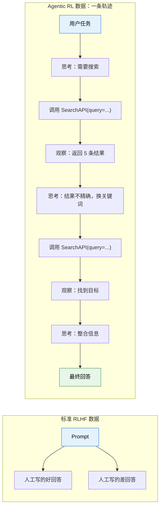
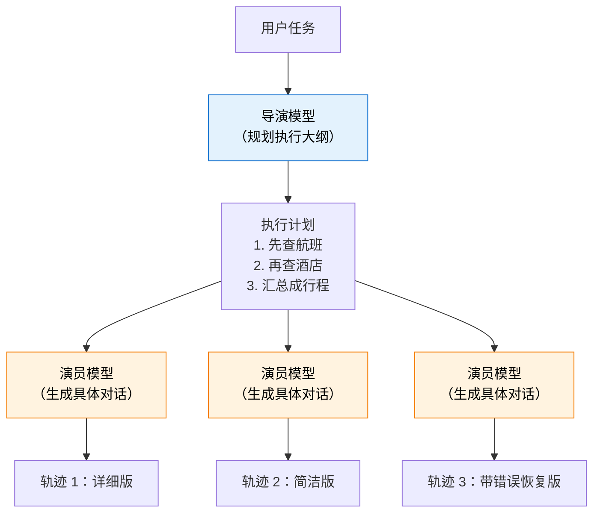
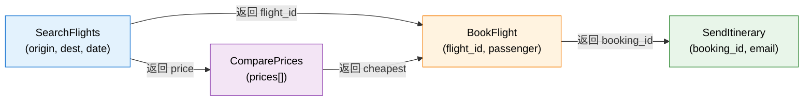
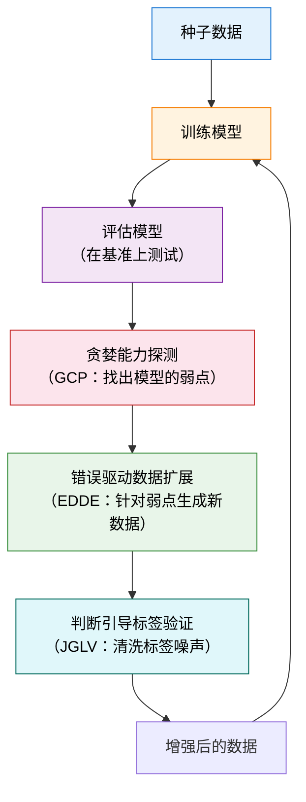

# 轨迹合成与数据工程（已并入 10.2）

> 这一页保留为旧链接入口。核心内容已经合并到 [10.2 工具调用、轨迹合成与 Agentic 工程](./tool-use-and-trajectory)。下面保留原文，方便从旧链接进入的读者对照。

# 12.2 轨迹合成 与 从哪里搞到训练数据

上一节我们拆解了多轮 RL 的信用分配问题。但在训练之前，还有一个更基本的问题：**数据从哪来？** 标准的 LLM RL（如第 9 章的 GRPO）只需要 prompt + 可验证答案，模型自己生成回答，自己对比，不需要外部数据。但 Agentic RL 不一样——模型需要和环境交互（调用工具、执行代码、浏览网页），这些交互产生的"轨迹"既是训练数据，也是 reward 的来源。高质量的轨迹决定了模型的上限。这一节我们来拆解 Agentic RL 的数据工程核心——轨迹合成。

## 为什么需要轨迹合成？

Agentic RL 的训练数据和标准 RLHF 截然不同。在 RLHF 中，数据是"人工写的好回答"和"人工标注的偏好对"。在 Agentic RL 中，数据是一条完整的**交互轨迹**——模型在多轮对话中的每一步思考、每一个工具调用、每一次观察结果。



人工写一条这样的轨迹，比写一个好回答要贵 10 倍以上——因为每一步都需要：(1) 思考模型应该怎么推理；(2) 构造合理的工具调用参数；(3) 模拟工具返回的结果；(4) 确保整条轨迹逻辑连贯。一条 7 轮的轨迹可能需要一个专家 30 分钟来编写。

这就引出了轨迹合成的核心动机：**用算法自动生成大量高质量的交互轨迹，替代昂贵的人工标注**。

## 六种主流合成方法

### 拒绝采样——最朴素的方案

拒绝采样（Rejection Sampling）的思路极其直觉：让当前模型反复尝试同一个任务，只保留成功的轨迹作为训练数据。

```python
def rejection_sampling(model, task, tool_env, num_samples=64):
    """拒绝采样：生成多条轨迹，只保留成功的"""
    trajectories = []
    for _ in range(num_samples):
        traj = model.interact_with_tools(task, tool_env)
        if traj.final_success:  # 只保留成功的轨迹
            trajectories.append(traj)
    return trajectories

# 如果模型成功率只有 5%，采样 64 条只能得到约 3 条成功轨迹
# 而且这 3 条轨迹可能都是"同一种成功路径"，缺乏多样性
```

拒绝采样的优势是**实现简单**——你只需要一个能判断"成功/失败"的验证器。第 9 章的 RLVR 训练用的就是这种思路。

但它的劣势也很明显：**效率低、多样性差**。如果模型当前的成功率只有 5%，你需要采样 20 条才能得到 1 条成功轨迹。更严重的是，成功轨迹往往集中在"模型已经擅长的策略"上——那些模型没探索过的、可能更优的路径，在拒绝采样中永远不会出现。

### 导演-演员模式——规划与执行分离

为了解决拒绝采样的多样性问题，研究者提出了"导演-演员"（Director-Actor）模式。核心思想是**将轨迹生成拆分为"宏观规划"和"微观执行"两个层级**。



导演模型负责理解任务目标，生成一个高层执行大纲（"先做 A，再做 B，最后做 C"）。演员模型根据大纲填充细节——生成具体的工具调用参数和自然语言响应。这种分离带来了两个好处：

**逻辑连贯性有保证**。导演模型确保大纲本身是合理的，演员只需要"照着演"。这比让一个模型同时负责规划和执行要稳定得多——就像电影里的导演和演员分工一样。

**同一大纲可以生成多条不同的轨迹**。改变演员模型（或改变采样温度），同一个"先查航班再查酒店"的大纲可以生成不同风格的轨迹。这增加了训练数据的多样性。

代表性工作包括 IBSEN[^ibsen]、CoDi 等框架。这种模式特别擅长模拟复杂的多步骤交互场景。

### 基于图谱合成——Magnet[^magnet]

Magnet 的思路更加结构化。它把工具之间的调用关系建模为一个**函数签名图**（Function Signature Graph），然后通过图操作来生成逻辑严密的轨迹。

图的节点是工具的参数和返回值，边是数据流向。比如"搜索航班"工具的返回值包含"航班号"，而"预订机票"工具需要"航班号"作为输入——这两个工具之间就有一条边。



Magnet 定义了两种核心图操作：

**MAGNIFY**（放大）：选中图中的一个节点，展开其内部结构，生成更细粒度的调用链。比如把"搜索航班"展开为"构建查询 → 调用 API → 解析结果 → 过滤"。

**CONNECT**（连接）：在两个不直接相连的节点之间建立新的路径。这可以生成跨越多个工具的复杂调用链，比如"搜索航班 → 比较价格 → 预订最便宜的 → 发送行程"。

Magnet 的核心优势是**在源头保证工具调用的逻辑正确性**。基于图生成的路径一定是合法的（参数类型匹配、调用顺序合理），这比让 LLM 自由生成要可靠得多。基于该方法训练的 Magnet-14B 模型，在 BFCL-v3 和 ToolQuery 基准上超越了其教师模型。

### 闭环迭代——LoopTool[^looptool]

LoopTool 是目前社区最活跃的轨迹合成框架。它解决的是前三种方法的一个共同缺陷：**生成的数据是"静态"的——不会根据模型的弱点来调整**。

LoopTool 的核心创新是一个**数据生成与模型训练紧密耦合的闭环**：



这个闭环包含三个关键模块：

**贪婪能力探测（GCP）**：让模型在测试集上运行，统计它在哪些能力维度上失败率最高。比如可能发现"处理可选参数"的成功率只有 30%，而"基本单工具调用"的成功率已经 90%。

**错误驱动数据扩展（EDDE）**：针对 GCP 发现的弱点，定向生成新的训练样本。如果模型在"处理可选参数"上表现差，EDDE 就生成大量包含可选参数的工具调用轨迹。

**判断引导标签验证（JGLV）**：用评判模型自动检查合成数据的标签是否正确，去除噪声。这一步很重要——合成数据不可避免会有错误标签（比如"应该调用工具 A 但标注成了工具 B"），如果不清洗就会误导训练。

LoopTool 的实验结果令人印象深刻：用 32B 的 Qwen3 作为数据生成器，训练出来的 8B 模型在 BFCL-v3 上**超越了 32B 的生成器本身**。这说明闭环迭代的数据质量可以远超静态合成。

### 难度自适应——HardGen[^hardgen]

HardGen 专门解决合成数据"过于简单"的问题。它的核心洞察是：**模型能力的提升主要来自于困难样本**。简单的轨迹（比如只调一次工具就完成的任务）对模型训练的贡献很小。

HardGen 的流程是：先让模型尝试一批任务，收集失败案例。然后从失败案例中构建**动态 API 图谱**——分析模型在哪些工具组合、哪些参数类型上最容易失败。接着基于这个图谱生成高难度的轨迹，确保每条轨迹都触及模型的弱点。

实验表明，用 HardGen 数据训练的 4B 模型，性能超越了多个主流闭源大模型——这再次印证了"困难样本的价值远超简单样本"。

### 后见之明重写——ECHO[^echo]

ECHO 的思路和第 11 章的 HER（事后经验回放）异曲同工：**失败轨迹不用扔掉——换个目标，它就是成功轨迹**。

在第 11.3 节中我们见过 HER：机器人的目标是"把球放到位置 A"，但实际放到了位置 B。从目标 A 的角度看这是失败的，但从目标 B 的角度看这是完美的成功。ECHO 把这个思路搬到了 LLM 轨迹上——先用 LLM 分析失败轨迹"实际上完成了什么"，然后把目标标签改为实际完成的目标，失败轨迹就被重写为针对新目标的成功案例。

这个方法极大提升了样本效率。在拒绝采样中，失败轨迹被直接丢弃。但如果模型当前成功率只有 10%，90% 的生成都被浪费了。ECHO 让这些"浪费"的轨迹重新变得有价值。结合第 11.3 节的讨论，我们可以把 ECHO 理解为"HER 在语言空间中的应用"——HER 改变的是机器人目标的位置标签，ECHO 改变的是语言任务的目标语义标签。

### 端到端合成 与 ASTRA[^astra]

前面六种方法聚焦的都是"怎么生成高质量轨迹"。ASTRA 更进一步：它不仅合成多轮交互轨迹，还能把轨迹**自动打包成独立的、可验证的 RL 训练环境**。这意味着从"数据生成"到"环境搭建"全流程自动化——你只需要给定任务规格，ASTRA 就能输出一组可直接用于 GRPO/PPO 训练的（轨迹，环境）配对。这种端到端的思路特别适合需要快速构建新场景训练数据的工程场景。框架将 SFT 数据（合成轨迹）和 RL 环境（可验证竞技场）统一在同一管线中，官方已开源代码和环境。

## 六种方法对比

| 方法         | 核心思路                     | 多样性 | 质量  | 成本 | 代表工作       |
| ------------ | ---------------------------- | ------ | ----- | ---- | -------------- |
| 拒绝采样     | 生成 → 过滤 → 只留成功的     | 低     | 中    | 低   | GRPO、TinyZero |
| 导演-演员    | 规划与执行分离               | 中     | 高    | 中   | IBSEN、CoDi    |
| 图谱合成     | 基于工具关系图生成合法路径   | 高     | 极高  | 高   | Magnet         |
| 闭环迭代     | 训练 → 诊断弱点 → 针对性补强 | 自适应 | 最高  | 中   | LoopTool       |
| 难度自适应   | 从失败案例中定向生成困难样本 | 自适应 | 高    | 中   | HardGen        |
| 后见之明重写 | 失败轨迹换个目标变成成功轨迹 | 高     | 中-高 | 低   | ECHO           |

在实践中，**LoopTool 的闭环迭代思路是最推荐的**。它不需要你预先知道模型会犯什么错——系统会自动发现并补强。如果你资源有限，拒绝采样是最容易上手的起点。

## 轨迹质量控制 与 合成不是终点

无论用哪种方法生成轨迹，都需要**质量控制**。合成的数据不可避免会有噪声——错误的工具调用参数、逻辑不连贯的推理步骤、甚至"碰巧成功"的轨迹（走了最差的路但结果对了）。

质量控制通常包含三个维度：

**正确性**：工具调用的参数是否正确？调用顺序是否合理？这可以通过**自动验证器**检查——用静态分析工具检查参数类型，用执行器实际运行验证结果。

**多样性**：轨迹是否覆盖了不同的策略？如果 100 条轨迹都是"先搜索再总结"的同一种模式，模型就学不到"先分析再搜索"的替代策略。通常用**轨迹嵌入的聚类**来衡量——如果轨迹在嵌入空间中形成了多个聚类，说明覆盖了多种策略。

**难度分布**：数据集中简单/中等/困难样本的比例是否合理？太多简单样本会让模型"安逸"在已知策略上，太多困难样本又可能导致训练不稳定。一个好的分布通常是 30% 简单 + 50% 中等 + 20% 困难。

**步骤级校准**：除了过滤和排序，还有一种更精细的做法——**直接修正轨迹中不理想的步骤**。STeCa（Step-level Trajectory Calibration）[^steca] 的核心洞察是：一条大部分正确但个别步骤有瑕疵的轨迹，与其直接丢弃，不如找到那些不理想的步骤并修正它们。具体做法是通过步骤级奖励对比，识别轨迹中哪些步骤拉低了整体质量，然后用更强模型或规则来校准这些步骤。这比简单的"成功/失败"二分法精细得多——一条轨迹可能在 7 个步骤中有 6 个做得很好，只有第 4 步的搜索策略不够优。STeCa 会保留前 6 步，只校准第 4 步，最终得到一条比原始轨迹更优的校准轨迹。

```python
def filter_trajectories(trajectories, quality_threshold=0.7):
    """轨迹质量控制：过滤低质量合成数据"""
    filtered = []
    for traj in trajectories:
        # 1. 正确性检查：工具调用参数是否合法
        if not all(is_valid_call(call) for call in traj.tool_calls):
            continue

        # 2. 连贯性检查：相邻步骤之间是否有逻辑跳跃
        if not is_coherent(traj):
            continue

        # 3. 难度评估：是否过于简单（只有 1-2 步就完成）
        if len(traj.turns) < 2 and traj.success:
            continue  # 跳过过于简单的成功轨迹

        # 4. 综合质量分
        if traj.quality_score >= quality_threshold:
            filtered.append(traj)

    return filtered
```

## 轨迹合成与第 9 章的联系

你可能已经注意到，轨迹合成的很多思路和第 9 章的 RLVR 高度相关。RLVR 的核心是"用可验证的结果作为 reward"。轨迹合成把这个思路往前推了一步——不只把验证结果用于 reward，还用它来**筛选和生成更好的训练数据**。

具体来说，RLVR 在 Agentic RL 中的数据层面有三种用法：

1. **过滤**：生成大量轨迹，用 RLVR 的验证器筛掉不正确的（拒绝采样）
2. **排序**：对多条轨迹按 RLVR 信号排序，用排名来指导 GRPO 的组内比较
3. **诊断**：分析验证失败的轨迹，找出模型的系统性弱点，定向生成补强数据（LoopTool 的 GCP 模块）

这也解释了为什么 Agentic RL 被认为比 RLHF 更适合轨迹合成：RLHF 需要人工标注偏好，成本高且不可扩展；而 Agentic RL 的 reward 可以通过环境交互自动获取——代码是否通过测试、搜索结果是否包含目标信息——这些都可以自动化验证。

值得一提的是，轨迹合成不仅能从"已有数据"中提炼，还可以借助"搜索"来生成更高质量的轨迹。TSR（Trajectory-Search Rollouts）[^tsr] 的思路是把第 12 章将讨论的测试时搜索技巧——如束搜索（beam search）和 best-of-N——搬到训练阶段的 rollout 中。在生成轨迹时不是随机采样，而是用搜索策略探索多条路径，选出最高质量的轨迹作为训练数据。实验表明，将 TSR 与 PPO 或 GRPO 结合，能带来最高 15% 的性能提升。本质上，TSR 让训练时的数据生成也拥有了"思考"的能力——而不仅仅是随机探索。

<details>
<summary>思考题：拒绝采样生成的"成功轨迹"一定是好的训练数据吗？</summary>

不一定。拒绝采样保留了所有成功轨迹，但"成功"不等于"好策略"。

考虑这样一个场景：模型需要搜索一个事实性问题。模型用了一个非常低效的策略——先搜索了 5 次不相关的关键词，最后碰巧在第 6 次找到了答案。这条轨迹"成功了"，但它的前 5 次搜索完全是无用的。如果用它来训练模型，模型可能会学到"多搜索几次总能找到"的低效策略。

这就是为什么轨迹质量控制中的"效率评估"很重要——不只是看"最终是否成功"，还要看"成功的路径是否高效"。第 10.3 节的 reward 设计中会引入效率惩罚项，本质上就是在解决这个问题。

</details>

<details>
<summary>思考题：为什么 LoopTool 用 32B 模型生成的数据训练出来的 8B 模型，能超越 32B 的生成器？</summary>

这看起来违反直觉——"学生超越了老师"。关键在于 LoopTool 的闭环迭代机制。

32B 模型生成初始数据时，数据质量受限于模型自身的能力。但 LoopTool 不是一个"生成完就结束"的过程——它会诊断 8B 模型的弱点，针对性地补充数据。经过多轮迭代后，最终的数据集是"32B 模型的初始数据 + 针对 8B 弱点的多轮补强数据"的累积。这个累积数据集的质量可以远超 32B 模型单次生成的数据。

更深层的原因是：**生成数据和理解数据是两种不同的能力**。8B 模型虽然生成能力不如 32B，但它的学习能力和泛化能力可能不逊色——给它更好的训练数据，它就能发挥更大的潜力。这也是为什么"数据质量 > 模型规模"正在成为社区共识。

</details>

## 一个简易的轨迹合成管线

下面这段代码把拒绝采样和简单的质量控制组合起来，形成一个最基础的轨迹合成管线：

```python
from dataclasses import dataclass, field
from typing import List, Optional
import random

@dataclass
class Trajectory:
    """一条完整的交互轨迹"""
    task: str                          # 用户任务
    turns: List[dict] = field(default_factory=list)  # 每轮的 (思考, 动作, 观察)
    success: bool = False              # 最终是否成功
    num_tool_calls: int = 0            # 工具调用次数

def trajectory_synthesis_pipeline(
    model, tool_env, tasks, num_samples_per_task=16, quality_threshold=0.6
):
    """简易轨迹合成管线：拒绝采样 + 质量过滤"""
    all_trajectories = []

    for task in tasks:
        # 阶段 1：批量采样
        candidates = []
        for _ in range(num_samples_per_task):
            traj = model.interact_with_tools(task, tool_env)
            candidates.append(traj)

        # 阶段 2：拒绝采样——只保留成功轨迹
        success_trajs = [t for t in candidates if t.success]

        # 阶段 3：质量过滤
        for traj in success_trajs:
            # 效率检查：超过 8 次工具调用才成功 = 策略低效
            if traj.num_tool_calls > 8:
                continue

            # 多样性检查：与已有轨迹的重复度
            if not is_too_similar(traj, all_trajectories):
                traj.quality_score = compute_quality(traj)
                if traj.quality_score >= quality_threshold:
                    all_trajectories.append(traj)

    return all_trajectories

def is_too_similar(new_traj, existing_trajs, threshold=0.85):
    """检查新轨迹是否与已有轨迹过于相似（基于动作序列）"""
    new_actions = [t["action"] for t in new_traj.turns]
    for old_traj in existing_trajs:
        old_actions = [t["action"] for t in old_traj.turns]
        # 简化：用动作序列的 Jaccard 相似度
        overlap = len(set(new_actions) & set(old_actions))
        union = len(set(new_actions) | set(old_actions))
        if union > 0 and overlap / union > threshold:
            return True
    return False

def compute_quality(traj):
    """计算轨迹的综合质量分"""
    # 效率分：工具调用越少越好（鼓励高效策略）
    efficiency = max(0.0, 1.0 - 0.1 * traj.num_tool_calls)

    # 完整性分：每轮都有完整的 (思考, 动作, 观察)
    completeness = sum(
        1 for t in traj.turns
        if t.get("thought") and t.get("action") and t.get("observation")
    ) / max(len(traj.turns), 1)

    return 0.5 * efficiency + 0.5 * completeness
```

这个管线虽然简单，但包含了轨迹合成的核心环节：生成 → 过滤 → 质量控制。在实际工程中，你可以逐步把拒绝采样替换为 LoopTool 的闭环迭代，把简单的质量检查替换为更精细的验证器。

下一节我们聚焦 Agentic RL 的另一个关键维度——[工具调用 RL：Web Agent 与 Code Agent](./tool-use-agents)，看看模型怎么学会"什么时候该用工具、用什么工具"。

## 参考资料

[^ibsen]: Han S, Chen L, Lin L-M, et al. "[IBSEN: Director-Actor Agent Collaboration for Controllable and Interactive Drama Script Generation](https://arxiv.org/abs/2407.01093)." ACL 2024. —— 导演-演员模式的代表工作，将轨迹生成拆分为规划与执行两个层级。

[^magnet]: Yin F, Wang Z, Hsu I-H, et al. "[Magnet: Multi-turn Tool-use Data Synthesis and Distillation via Graph Translation](https://arxiv.org/abs/2503.07826)." ACL 2025. —— 基于函数签名图的轨迹合成，通过 MAGNIFY/CONNECT 图操作生成合法调用路径。

[^looptool]: LoopTool Team. "[LoopTool: Closing the Data-Training Loop for Robust LLM Tool Calls](https://arxiv.org/abs/2511.09148)." arXiv:2511.09148, 2025. —— 闭环迭代框架，用 GCP+JGLV+EDDE 三模块实现"模型驱动数据进化"。[GitHub](https://github.com/Rednote-DeepExperience/LoopTool)

[^hardgen]: Hao B, et al. "[From Failure to Mastery: Generating Hard Samples for Tool-use Agents](https://arxiv.org/abs/2601.01498)." arXiv:2601.01498, 2026. —— 从模型失败案例中定向生成高难度训练数据。[数据集](https://huggingface.co/datasets/Bingguang/HardGen)

[^echo]: Hu B, et al. "[Sample-Efficient Online Learning in LM Agents via Hindsight Trajectory Rewriting](https://arxiv.org/abs/2510.10304)." arXiv:2510.10304, 2025. —— ECHO：借鉴 HER 的后见之明经验回放，将失败轨迹重写为针对其他目标的成功案例，极大提升样本效率。

[^astra]: Tian X, Wang H, et al. "[ASTRA: Automated Synthesis of agentic Trajectories and Reinforcement Arenas](https://arxiv.org/abs/2601.21558)." arXiv:2601.21558, 2026. —— 端到端框架：自动合成多轮交互轨迹并打包为可验证 RL 环境。[GitHub](https://github.com/LianjiaTech/astra)

[^tsr]: Djuhera A, Kadhe S, et al. "[TSR: Trajectory-Search Rollouts for Multi-Turn RL of LLM Agents](https://arxiv.org/abs/2602.11767)." arXiv:2602.11767, 2026. —— 将测试时搜索（束搜索、best-of-N）搬到训练阶段 rollout，最高 15% 性能提升。

[^steca]: Wang H, Wang J, et al. "[STeCa: Step-level Trajectory Calibration for LLM Agent Learning](https://arxiv.org/abs/2502.14276)." ACL 2025 Findings. —— 通过步骤级奖励对比识别并修正轨迹中的不理想动作，而非简单过滤。[GitHub](https://github.com/WangHanLinHenry/STeCa)
